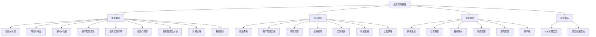

# 第五章：投资理财基础

## 章节概览

> "投资不是为了一夜暴富，而是为了让财富稳健增长。" —— 沃伦·巴菲特

投资理财是财富增长的核心引擎。在前面的章节中，我们已经学习了如何增加收入、控制支出、建立储蓄。但如果你只是把钱存在银行里，通货膨胀会一点一点地吞噬它的购买力。假设年通胀率为 3%，你今天存下的 100 元，10 年后实际只值 74 元，30 年后只值 41 元。**不投资，本身就是一种隐性的亏损**。

然而，很多人对投资存在两个极端的误解：要么觉得"太复杂、太危险"而敬而远之，把全部身家放在活期存款里慢慢贬值；要么被"一夜暴富"的故事吸引，盲目冲进股市追涨杀跌，最终亏损离场。这两种心态的根源是一样的——缺乏对投资本质的系统理解。

本章的使命就是帮你建立**正确的投资认知框架**：理解投资的本质是什么，风险和收益如何共生，主流投资工具各自有什么特点和陷阱，如何根据自己的情况制定科学的资产配置方案，以及如何在实际操作中克服人性弱点、坚守投资纪律。

***

## 本章核心问题

本章围绕五个核心问题展开，每个问题对应一个知识模块：

### 1. 投资的本质是什么？

投资的定义远比"买股票赚钱"要广。**投资是将当前的资源投入到某种资产中，期望未来获得超过原始投入的回报**。这个回报可能来自利息（如债券）、股息（如股票分红）、或资产价格的上涨（资本增值）。理解这一点，你才能看透所有投资产品的底层逻辑——无论它包装得多么花哨。

更关键的是理解风险与收益的共生关系。金融学的第一定律就是：**天下没有免费的午餐，高收益必然伴随高风险**。任何承诺"高收益、零风险"的产品，要么是骗局，要么是你还没看到风险在哪里。

### 2. 有哪些基本的投资工具？

从最保守的银行存款到最激进的期货期权，投资工具形成一个完整的风险-收益谱系。本章将逐一拆解银行存款、货币基金、债券、债券基金、股票、股票基金、指数基金、房地产等主流工具，让你清楚每种工具适合什么场景、有什么风险、收益预期是多少。

其中**指数基金**值得特别关注。巴菲特在 2007 年的著名赌局中，用一只标普 500 指数基金击败了对冲基金 Protege Partners 挑选的一篮子对冲基金，证明了对大多数普通投资者而言，低成本的指数基金是最优选择。本章会详细解释为什么。

### 3. 如何做资产配置？

资产配置是投资中最重要的决策。研究表明，投资组合收益的 90% 以上由资产配置决定，而非个股选择或择时。本章会介绍股债平衡模型、年龄配置法则、标准普尔家庭资产配置（4321 法则）等经典框架，并教你如何根据自己的年龄、收入、风险承受能力来制定个性化方案。

### 4. 如何开始第一笔投资？

理论再好，不落地就是空谈。本章提供从零开始的实操指南：如何开立证券账户和基金账户、如何筛选基金（看什么指标、避什么坑）、如何设置定投计划、以及如何判断买卖时机。我们会用具体的数字和流程来说明，确保你读完就能动手。

### 5. 如何避免投资中的常见错误？

投资中亏钱的人，绝大多数不是因为选错了产品，而是因为犯了心理错误：追涨杀跌、频繁交易、过度自信、恐慌割肉、盲目跟风。行为金融学的研究表明，人类的进化本能（如损失厌恶、从众效应、锚定效应）在投资场景中会系统性地导致错误决策。本章会帮你识别这些心理陷阱，并给出可操作的应对策略。

***

## 本章结构

本章按照"道→法→术→器→戒"的逻辑层层递进，从理论基础到实操技巧，从正面方法到反面警示，形成完整的知识闭环。

### 理论基础：投资的"道"

| 小节 | 主题 | 核心内容 |
|------|------|----------|
| 5.1 | 投资的本质 | 投资的定义、回报来源、为什么要投资（对抗通胀、实现财务增长、通往财务自由） |
| 5.2 | 风险与收益 | 风险-收益谱系、系统性风险与非系统性风险、风险承受能力评估方法 |
| 5.3 | 复利的力量 | 单利与复利的差异、复利三要素（本金、收益率、时间）、72 法则 |
| 5.4 | 资产配置的理论基础 | 马科维茨现代投资组合理论、有效前沿、分散化红利、经典配置模型 |
| 5.5 | 常见投资工具详解 | 银行存款、货币基金、债券、股票、指数基金、房地产等各类工具的深度对比 |
| 5.6 | 投资的心理学 | 前景理论、损失厌恶、锚定效应、从众心理、过度自信、确认偏误等认知偏差 |
| 5.7 | 各类投资品深度分析 | 更细分的投资品类（可转债、REITs、黄金、QDII 等）及其适用场景 |
| 5.8 | 投资中的常见陷阱 | P2P 爆雷、原始股骗局、荐股杀猪盘、高息理财陷阱的识别与防范 |
| 5.9 | 投资中的税务知识 | A 股交易税费、基金分红税、资本利得税、税务优化策略 |

### 核心技巧：投资的"术"

| 小节 | 主题 | 核心内容 |
|------|------|----------|
| 技巧一 | 定投策略 | 定投的原理、优势、最佳频率、金额设定 |
| 技巧二 | 资产配置实操 | 从理论到实践的配置方案、不同资金量的配置模板 |
| 技巧三 | 风险管理方法 | 仓位管理、止损止盈、对冲策略 |
| 技巧四 | 投资信息获取 | 信息渠道、财报阅读、估值指标、信息筛选 |
| 技巧五 | 投资工具使用 | 主流券商 APP、基金平台、数据网站的操作指南 |
| 技巧六 | 定投进阶策略 | 智能定投（估值定投、均线定投）、目标市值法 |
| 技巧七 | 基金定投的止盈策略 | 目标收益率止盈、估值止盈、最大回撤止盈 |

### 实战案例：投资的"器"

本章包含 7 个完整的实战案例，覆盖不同投资阶段和场景：

| 案例 | 主角 | 场景 | 核心教训 |
|------|------|------|----------|
| 案例一 | 小张 | 从零开始定投 | 新手如何迈出第一步 |
| 案例二 | 老王 | 从追涨杀跌到稳健投资 | 克服心理偏差的转变过程 |
| 案例三 | 小李 | 用指数基金实现财务目标 | 目标导向的长期投资 |
| 案例四 | — | 从炒股到投资的转变 | 认知升级的路径 |
| 案例五 | — | 家庭资产配置 | 不同生命周期的配置策略 |
| 案例六 | 老周 | 黄金配置的实践 | 避险资产的配置时机与比例 |
| 案例七 | 小刘 | 资产配置再平衡 | 年度再平衡的操作方法与收益对比 |

### 风险警示：投资的"戒"

- **常见误区**：8 个投资新手最容易犯的错误，每个都配有具体案例和纠正方法
- **深度拓展**：现代投资组合理论（MPT）、有效市场假说（EMH）、行为金融学、CAPM 模型等高级理论，以及全球投资市场比较
- **练习方法**：可执行的练习任务，帮助你将知识转化为能力

***

## 本章的知识地图

***

## 学习目标

完成本章学习后，你应该具备以下能力：

### 认知层（知道"为什么"）

1. **理解投资的本质**——投资不是赌博，而是用今天的资源换取明天更大的购买力，核心驱动力是复利效应
2. **理解风险与收益的关系**——高收益必然伴随高风险，没有例外；学会区分系统性风险和非系统性风险
3. **理解资产配置的重要性**——投资收益的 90% 以上由资产配置决定，而非选股或择时

### 方法层（知道"怎么做"）

4. **制定个性化的资产配置方案**——根据自己的年龄、收入、风险承受能力和投资期限，确定股票、债券、现金等资产的比例
5. **选择合适的投资工具**——能区分主动基金与被动基金、场内基金与场外基金、股票型基金与债券型基金，并根据自身需求做出选择
6. **执行定投策略**——设定合理的定投金额、频率和标的，理解定投如何通过"微笑曲线"降低平均成本

### 实操层（知道"动手做"）

7. **完成开户与首笔投资**——在券商或基金平台完成开户、绑卡、风险测评，并完成第一笔定投
8. **建立投资复盘习惯**——定期检查资产配置比例，执行再平衡操作，记录投资决策和复盘笔记

### 防御层（知道"不要做什么"）

9. **识别并避开常见的投资陷阱**——包括但不限于 P2P 爆雷、原始股骗局、荐股诈骗、高息理财骗局
10. **克服典型的心理偏差**——识别损失厌恶、从众效应、过度自信、锚定效应等认知陷阱在自身行为中的表现，并建立对应的纪律约束

***

## 关键概念速查

在正式学习之前，先熟悉以下核心概念。这些概念会在本章中反复出现，是理解所有内容的基础。

| 概念 | 定义 | 为什么重要 |
|------|------|------------|
| **复利** | 利息产生利息，即"利滚利"。公式：终值 = 本金 × (1 + 收益率)^时间 | 复利是投资增长的核心引擎。10 万元按 8% 年化收益，30 年后变为 100.6 万元——其中 90 万是利息产生的利息 |
| **风险与收益** | 高收益通常伴随高风险，两者不可分割 | 理解这一点才能避免两个极端：因恐惧而不敢投资，或因贪婪而忽视风险 |
| **资产配置** | 将投资资金分配到不同类型的资产（股票、债券、现金等）中 | 研究表明，资产配置决定了投资组合 90% 以上的收益波动，远比选股和择时重要 |
| **定投** | 定期定额投资，无论市场涨跌都按计划买入 | 消除择时焦虑，在低点多买、高点少买，自动实现"微笑曲线"效果 |
| **分散投资** | 不把所有资金集中在单一资产或单一市场上 | 通过持有相关性低的资产，在不降低预期收益的情况下降低整体风险 |
| **通货膨胀** | 货币购买力持续下降的经济现象 | 如果投资收益率低于通胀率，你的实际财富在缩水——不投资就是亏钱 |
| **流动性** | 资产在不大幅折价的情况下快速变现的能力 | 流动性差的资产（如房产）在急需用钱时可能被迫大幅折价出售 |
| **贝塔系数（β）** | 衡量资产相对于市场整体的波动性。β=1 与市场同步，β>1 波动更大 | 帮助你理解一个投资组合在市场上涨/下跌时的预期表现 |
| **夏普比率** | （投资收益率 - 无风险利率）/ 收益率标准差 | 衡量每承担一单位风险所获得的超额回报，是评估基金质量的核心指标 |
| **再平衡** | 定期将投资组合中各资产的比例恢复到目标配置 | 强制实现"高卖低买"，控制风险敞口，长期可提升收益 0.5-1%/年 |

***

## 投资者的认知层级

不同投资者对投资的理解深度不同，面临的问题也不同。本章按照认知层级递进展开，确保每个阶段的读者都能找到自己的位置：

| 层级 | 特征 | 核心困惑 | 本章对应内容 |
|------|------|----------|-------------|
| **零基础层** | 从未投资过，钱只放银行 | "投资是不是很危险？"、"我该从哪里开始？" | 5.1 投资的本质、实战案例一 |
| **入门层** | 买过余额宝或银行理财 | "收益太低怎么办？"、"基金和股票有什么区别？" | 5.5 投资工具详解、核心技巧一（定投） |
| **进阶层** | 买过基金或股票，但缺乏系统方法 | "怎么搭配不同产品？"、"什么时候该卖？" | 5.4 资产配置理论、核心技巧三（风险管理） |
| **经验层** | 有多年投资经验，经历过牛熊 | "如何优化收益？"、"怎么克服心理弱点？" | 5.6 投资心理学、核心技巧六（智能定投） |
| **深度层** | 想理解投资的底层逻辑 | "为什么分散投资有效？"、"市场到底有没有效？" | 深度拓展（MPT、EMH、行为金融学） |

***

## 投资的前提条件

在开始投资之前，请先确认以下条件已经满足。跳过这些前提直接投资，就像地基没打好就盖楼——早晚会出问题。

### 条件一：已有应急基金

**至少留出 3-6 个月的生活费**作为应急资金，存放在货币基金或银行活期中，随时可取。这笔钱不是用来投资的，是用来兜底的。没有应急基金的人，一旦遇到突发用钱（失业、生病、意外），就不得不在市场低点卖出投资——这是最昂贵的操作。

**检验标准**：假设你明天失业，手头的现金和货币基金能否支撑你 3 个月不工作也能正常生活？如果答案是"不能"，请先攒够应急基金再考虑投资。

### 条件二：高息债务已清偿

如果你有信用卡分期（年化 12-18%）、消费贷（年化 8-24%）、网贷（年化 15-36%）等高息债务，**先还债，再投资**。道理很简单：你很难找到一种投资能稳定跑赢 15% 的年化收益，但你的债务利息确实在以这个速度增长。用投资赚的钱去覆盖高息债务的利息，是得不偿负的。

**例外**：低息贷款（如房贷年化 3-4%、公积金贷款）不必急着还，因为长期投资的预期收益（6-10%）高于贷款利率。

### 条件三：已配置基本保障

投资是"攻"，保险是"守"。没有保障的投资，就像在没有护栏的悬崖边开车。至少配置以下保险：

- **医疗保险**（百万医疗险）：覆盖大病住院的高额费用
- **意外险**：覆盖意外伤害导致的医疗和伤残
- **重疾险**（有条件的话）：确诊即赔，覆盖收入中断期的生活开支

### 条件四：投资的钱是"闲钱"

**只用 3 年以上不需要动用的钱来投资**。股票和基金的短期波动是不可预测的——沪深 300 指数年内最大跌幅平均为 20-30%。如果你投入的钱在 1 年后就要用（比如买房首付），市场恰好在你卖出时跌了 20%，你就真的亏了。但如果你能持有 5 年以上，历史上几乎所有宽基指数都是正收益。

***

## 预计学习时间

| 学习内容 | 时间 | 说明 |
|----------|------|------|
| 理论基础（5.1-5.9） | 120-150 分钟 | 核心知识，建议精读并做笔记 |
| 核心技巧（7 个技巧） | 90-120 分钟 | 重点在理解方法论，不需要一次全学完 |
| 实战案例（7 个案例） | 60-90 分钟 | 边读边对照自己的情况思考 |
| 常见误区 + 深度拓展 | 60-90 分钟 | 误区优先，深度拓展可后续回看 |
| 练习实操 | 60-120 分钟 | 包括开户、风险测评、模拟配置等 |
| **总计** | **6-9 小时** | 建议分 3-5 天完成，每天 1-2 小时 |

> **学习建议**：不要试图一口气读完。投资知识需要消化和实践。建议先通读理论基础，建立整体框架；然后选择 1-2 个最匹配自己阶段的核心技巧深入学习；最后通过实战案例检验理解。深度拓展部分可以留到最后，作为进阶内容回看。

***

## 适用人群

本章内容覆盖面广，适合以下人群：

- **投资新手**：从未买过基金或股票，想从零开始学习投资的人
- **有存款无方向**：银行里有几万到几十万存款，不知道除了"存定期"还能做什么的人
- **踩过坑的人**：在股市或基金中亏过钱，想搞清楚"到底错在哪里"的人
- **想建立体系的人**：有一些零散的投资经验，但缺乏系统方法论的人
- **想优化组合的人**：已经在投资，但感觉收益不理想、风险控制不好的人
- **想理解底层逻辑的人**：不满足于"买什么"，还想知道"为什么买"的人

***

## 本章金句

> "投资不是为了一夜暴富，而是为了让财富稳健增长。" —— 沃伦·巴菲特

> "在别人恐惧时贪婪，在别人贪婪时恐惧。" —— 沃伦·巴菲特

> "不要把所有鸡蛋放在一个篮子里。" —— 投资格言

> "时间是好公司的朋友，是坏公司的敌人。" —— 沃伦·巴菲特

> "投资最重要的事是保住本金。" —— 沃伦·巴菲特

> "市场短期是投票机，长期是称重机。" —— 本杰明·格雷厄姆

> "投资的核心不是战胜市场，而是让市场为你工作。" —— 约翰·博格尔（先锋基金创始人）

***

> **免责声明**：投资有风险，入市需谨慎。本章提供的是基础知识和方法论，不构成任何投资建议。在做出投资决策前，请充分了解相关风险，必要时咨询持牌专业人士。历史收益率不代表未来表现。
