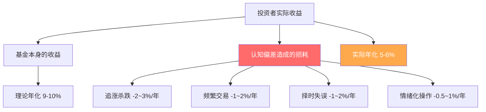
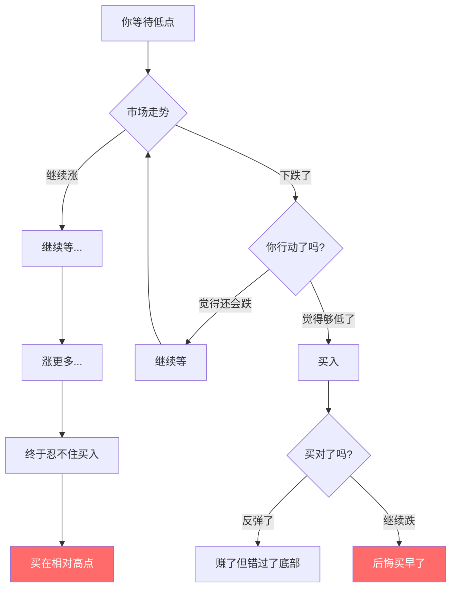
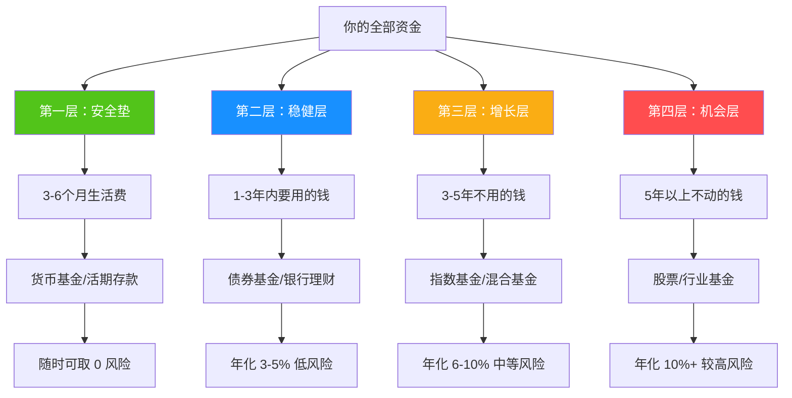
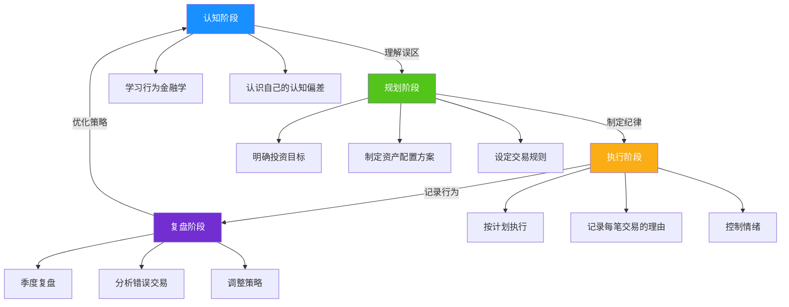

# 第五章：投资理财基础 —— 常见误区

## 为什么投资误区比市场风险更可怕

市场风险是外生的——经济周期、政策变化、黑天鹅事件，这些你无法控制但可以对冲。而投资误区是内生的——它根植于你的认知偏差和情绪反应，是你对自己最大的敌人。

行为金融学的研究反复证明：**普通投资者的长期收益，与其说取决于买了什么，不如说取决于克服了多少认知陷阱。** Dalbar 公司每年发布的 QAIB（Quantitative Analysis of Investor Behavior）报告持续显示，过去 20 年间美国股票型基金的年化收益约为 9%-10%，但普通基金投资者的实际年化收益仅为 5%-6%——每年 4 个百分点的差距，几乎全部来自投资者自身的错误行为。



本章将系统梳理投资中最常见的认知误区，不仅告诉你"这是错的"，更要解释"为什么会犯这个错"以及"如何从根本上纠正"。每个误区都包含心理学机制、真实数据、典型案例和可执行的纠正方案。

---

## 误区一：投资能一夜暴富

### 表现形态

- "我要找到一个翻倍的股票"
- "投资就是为了让钱快速增值"
- "听说某某投资赚了 10 倍，我也要"
- 频繁关注"暴富神话"，忽略背后的概率和风险
- 把投资当成彩票，追求"以小博大"

### 心理学机制：可得性偏差与幸存者偏差

这个误区的根源是两种认知偏差的叠加：

**可得性偏差（Availability Bias）**：媒体和社交网络大量报道暴富案例，让你觉得"暴富很常见"。实际上，你看到的每一个暴富故事背后，都有成千上万亏损的沉默者。

**幸存者偏差（Survivorship Bias）**：你只听到成功者的故事，因为失败者不会上新闻。这就像只研究彩票中奖者来制定投资策略——荒谬但每天都在发生。

### 数据真相

**巴菲特的真实业绩**：

| 时间段 | 年化收益率 | 累计收益 | 说明 |
|--------|-----------|---------|------|
| 1965-2023 | 约 19.8% | 约 3,787,464% | 伯克希尔市值增长 |
| 任意单年 | -9.6% 至 +59.3% | — | 波动巨大 |
| 最差连续 3 年 | 2000-2002 | — | 期间跑输指数 |

巴菲特的"秘密"不是高收益率，而是**持续 60 年的复利效应**。年化 20% 看起来不多，但复利 60 年就是 56000 倍。

**复利的威力与耐心的关系**：


**一夜暴富的代价**：

| 暴富方式 | 成功概率 | 失败后果 | 典型案例 |
|----------|---------|---------|---------|
| 梭哈单只股票 | <5% | 本金腰斩甚至归零 | 2015 年杠杆牛市后股灾 |
| 币圈梭哈 | <1% | 血本无归 | LUNA 归零、FTX 暴雷 |
| 期货加杠杆 | <3% | 穿仓倒欠钱 | 2020 年原油宝事件 |
| 跟风"内幕消息" | <10% | 成为接盘侠 | 各种"杀猪盘" |

### 正确做法

**建立合理的收益预期**：

| 资产类别 | 历史年化收益 | 合理预期 | 需要的持有时间 |
|----------|-------------|---------|---------------|
| 银行存款/货币基金 | 1.5%-2.5% | 1.5%-2% | 随时 |
| 纯债基金 | 3%-5% | 3%-4% | 1 年以上 |
| 二级债基 | 5%-7% | 4%-6% | 2-3 年 |
| 沪深 300 指数 | 8%-10% | 6%-10% | 5 年以上 |
| 偏股混合基金 | 10%-15% | 8%-12% | 7 年以上 |

**年化 10% 已经是世界顶级水平**。标普 500 过去 100 年的年化收益约为 9.8%（含股息再投资），这已经是全球最优秀市场的长期表现。任何承诺年化 20% 以上且"稳赚不赔"的项目，都值得高度警惕。

---

## 误区二：等市场低点再买

### 表现形态

- "现在市场太高了，等等再买"
- "等跌破 3000 点我再入场"
- "我要抄底，等到最低点再买"
- 反复观望，始终不入场
- 入场后发现又跌了，后悔"买早了"

### 心理学机制：损失厌恶与控制幻觉

**损失厌恶（Loss Aversion）**：Kahneman 和 Tversky 的前景理论证明，人对损失的痛苦感受是同等收益快乐感受的 2-2.5 倍。这让你对"买在高点"的恐惧远大于对"错过上涨"的遗憾。

**控制幻觉（Illusion of Control）**：你以为自己能判断市场的高低点，但实际上没有人能做到这一点——包括华尔街最顶尖的基金经理。

### 数据真相：择时有多难

**"错过最好几天"的代价**（以沪深 300 为例，2005-2024 年数据）：

| 投资策略 | 年化收益 | 累计收益（20年） | 说明 |
|----------|---------|-----------------|------|
| 全程持有 | ~9.5% | ~518% | 买入并持有 |
| 错过最好的 5 天 | ~7.2% | ~305% | 收益减少 41% |
| 错过最好的 10 天 | ~5.1% | ~171% | 收益减少 67% |
| 错过最好的 20 天 | ~1.8% | ~42% | 收益减少 92% |
| 错过最好的 30 天 | ~-0.5% | ~-10% | 亏损 |

**关键洞察**：市场最好的几天，往往紧挨着最差的几天。你在恐慌中离场，大概率也会错过随后的暴涨。

**等待"低点"的实际结果**：



**Vanguard 的研究**：在 1926-2011 年的美国市场中，如果投资者只在市场最高点买入（最差的择时），但坚持持有 20 年以上，其最终收益仍然显著高于持有现金或债券。**入场时点的重要性，远不如是否在场。**

### 正确做法

**用定投代替择时**：

| 定投机制 | 效果 |
|----------|------|
| 固定时间买入 | 不需要判断高低点 |
| 不同价位买入 | 自动实现"低买多、高买少" |
| 长期坚持 | 成本趋于市场平均水平 |
| 纪律化执行 | 排除情绪干扰 |

**定投的"微笑曲线"**：


**具体执行建议**：
- 选定指数基金（如沪深 300、中证 500）后，设置自动扣款
- 每月固定日期（如发工资第二天）自动买入
- 不看盘、不判断、不中断
- 至少坚持 3 年以上，最好跨越一个完整牛熊周期

---

## 误区三：频繁交易赚更多

### 表现形态

- 每天看盘超过 1 小时
- 每周交易 3 次以上
- 追涨杀跌，"高抛低吸"
- 看到别的股票涨了就换仓
- 账户里永远满仓，但持仓换了一轮又一轮

### 心理学机制：过度自信与行动偏见

**过度自信（Overconfidence）**：研究表明，约 74% 的投资者认为自己的投资能力高于平均水平——这在统计上是不可能的。过度自信让你相信自己能"跑赢市场"，从而频繁交易。

**行动偏见（Action Bias）**：面对市场波动，"什么都不做"会让你焦虑。频繁交易给人一种"我在掌控"的错觉，但实际上是用确定的交易成本去博不确定的收益。

### 数据真相

**交易成本的隐性侵蚀**：

| 交易频率 | 每次成本 | 年化交易成本 | 需要多少超额收益才能覆盖 |
|----------|---------|-------------|------------------------|
| 每月 1 次 | 0.15% | 1.8% | 1.8% |
| 每月 5 次 | 0.15% | 9.0% | 9.0% |
| 每月 10 次 | 0.15% | 18.0% | 18.0% |
| 每周 3 次 | 0.15% | 23.4% | 23.4% |

> 注：每次交易成本约 0.15%（佣金万 2.5 + 印花税千 1，卖出时收取）。实际成本可能更高（包含冲击成本、滑点等隐性成本）。

**学术研究的铁证**：

加州大学 Barber 和 Odean 的经典研究《Trading Is Hazardous to Your Wealth》（2000）分析了 66,465 个家庭的交易账户（1991-1996），得出结论：

- 交易最频繁的 20% 散户，年化收益比市场低 7.1 个百分点
- 交易最不频繁的 20% 散户，年化收益仅比市场低 1.8 个百分点
- **交易频率与收益呈显著负相关**

另一项研究显示，散户平均持股时间从 1960 年代的 8 年缩短到如今的不到 6 个月——交易越来越频繁，收益越来越差。

### 正确做法

**建立"少动"的投资纪律**：

| 原则 | 具体做法 |
|------|---------|
| 降低查看频率 | 从每天改为每周或每月看一次 |
| 设定交易冷却期 | 想卖出时，强制等 72 小时再决定 |
| 写下交易理由 | 每次交易前写清楚为什么要操作 |
| 事后复盘 | 每季度回顾交易记录，计算累计成本 |
| 用定投替代主动交易 | 自动化排除人为干预 |

**"什么都不做"的力量**：

假设你 2014 年初投入 10 万元买入沪深 300 指数基金并持有到 2024 年底：
- 持有不动：约 18.5 万元（年化约 6.3%）
- 每年换仓一次（扣除交易成本 + 损失最佳持有期）：约 14-15 万元
- 频繁交易（月均 5 次）：约 8-10 万元（大概率亏损）

---

## 误区四：把所有钱都投资

### 表现形态

- "我要把所有存款都投进股市"
- "留着现金太浪费了，通货膨胀会吃掉"
- "全部买股票，收益更高"
- 不留应急资金，生活开支也靠信用卡周转
- 没有保险，裸奔投资

### 心理学机制：贪婪与忽视尾部风险

当市场上涨时，FOMO（Fear of Missing Out，错失恐惧症）会让你觉得"钱放在银行就是亏"。但你忽略了一个关键事实：**流动性是投资的氧气**——没有流动性，你连"持有到回本"的机会都没有。

### 数据真相

**被迫卖出的代价**：

假设你把全部积蓄 20 万投入股市，3 个月后急需 5 万元：

| 情景 | 市场状态 | 卖出结果 | 机会成本 |
|------|---------|---------|---------|
| A | 盈利 10% | 卖出 5 万，少赚 5000 | 损失未来收益 |
| B | 亏损 20% | 卖出 6.25 万份（实际只拿回 4 万） | 亏损锁定 |
| C | 亏损 30% | 卖出 7.14 万份（实际只拿回 3.5 万） | 巨额亏损锁定 |

情景 B 和 C 中，你不仅承受了账面亏损，还被迫在最低点割肉——这正是"把所有钱都投资"的最大风险。

### 正确做法：资金分层管理



**各层资金的具体建议**：

| 层级 | 金额 | 工具 | 流动性 | 目标 |
|------|------|------|--------|------|
| 安全垫 | 3-6 个月生活费 | 货币基金（如余额宝） | T+0 或 T+1 | 应急 |
| 稳健层 | 1-3 年内要用的钱 | 短债基金、银行理财 | T+1 至 7 天 | 跑赢通胀 |
| 增长层 | 3-5 年不用的钱 | 指数基金、混合基金 | T+3 至 7 天 | 资产增值 |
| 机会层 | 5 年以上不动的钱 | 股票、行业 ETF | T+1 | 高收益 |

**底线**：无论市场多好，安全垫永远不能动。这不是浪费，这是投资的地基。没有地基的高楼，风一吹就倒。

---

## 误区五：只看收益不看风险

### 表现形态

- "这个基金去年涨了 50%，我要买"
- "哪个收益高买哪个"
- "不关心风险，只关心收益"
- 看到排行榜第一名就冲进去
- 不理解"最大回撤"是什么意思

### 心理学机制：注意力锚定与短视损失厌恶

**注意力锚定（Anchoring）**：基金销售页面上最醒目的数字就是"近一年收益率"，你的注意力被锚定在这个数字上，忽略了它背后的风险。

**短视损失厌恶（Myopic Loss Aversion）**：Benartzi 和 Thaler 的研究表明，如果你频繁查看收益（比如每天看），你会过度关注短期波动，从而厌恶波动性高的资产——即使它的长期收益更好。

### 数据真相：风险与收益的真实关系

| 资产类型 | 历史年化收益 | 最大年度亏损 | 最大回撤 | 波动率 |
|----------|-------------|-------------|---------|--------|
| 货币基金 | 2%-3% | 接近 0 | 接近 0 | 极低 |
| 纯债基金 | 3%-5% | -3% 至 -5% | -5% 至 -8% | 低 |
| 二级债基 | 5%-8% | -8% 至 -15% | -15% 至 -20% | 中低 |
| 沪深 300 指数 | 8%-10% | -25% 至 -35% | -45% 至 -65% | 中高 |
| 偏股混合 | 10%-15% | -30% 至 -50% | -50% 至 -70% | 高 |
| 单只个股 | 不确定 | -50% 至 -100% | -70% 至 -100% | 极高 |

**"去年涨 80%"的基金，今年可能跌 60%**——这不是假设，而是每年都在发生的真实案例。

**一个真实的反面教材**：

2020 年某"冠军基金"年收益超过 150%，大量投资者在 2021 年初涌入。结果 2021 年该基金下跌超过 30%，2022 年继续下跌。在 2021 年初买入的投资者，到 2022 年底亏损超过 40%。

### 正确做法

**评估风险的核心指标**：

| 指标 | 含义 | 参考标准 |
|------|------|---------|
| 最大回撤 | 历史最大从高点到低点的跌幅 | 你能承受的心理底线 |
| 年化波动率 | 收益的波动程度 | 越低越稳定 |
| 夏普比率 | 每单位风险获得的超额收益 | >1 为优秀，>2 为卓越 |
| 回撤修复时间 | 从最大回撤恢复到前高需要多久 | 你能接受的最长等待时间 |

**风险承受能力自测**：

```text
问自己三个问题：

1. 如果投资亏损 20%，我会：
   A. 立刻卖出止损 → 适合低风险产品
   B. 焦虑但能忍住 → 适合中低风险产品
   C. 无所谓，长期看好 → 适合中高风险产品
   D. 加仓买入更多 → 适合高风险产品

2. 这笔钱多久不用？
   A. 随时可能用 → 货币基金
   B. 1-3 年 → 债券基金
   C. 3-5 年 → 混合基金
   D. 5 年以上 → 股票基金

3. 投资亏损会影响我的生活质量吗？
   A. 会严重影响 → 降低投资比例
   B. 有一些影响 → 适度投资
   C. 几乎不影响 → 正常配置
   D. 完全不影响 → 可以激进配置
```

---

## 误区六：迷信"专家"和"内幕消息"

### 表现形态

- "XX 老师推荐的股票一定涨"
- "我有内幕消息，这只股票要涨"
- "跟着基金经理买准没错"
- 加入各种"荐股群"、"老师带单"
- 为"付费策略"和"VIP 内幕"付高额费用

### 心理学机制：权威偏见与信息不对称幻觉

**权威偏见（Authority Bias）**：人天生倾向于服从权威。一个穿西装、戴名表、自称"XX 老师"的人，比你更能让大脑产生信任感——即使他说的都是废话。

**信息不对称幻觉**：你觉得自己掌握了"别人不知道的信息"，但实际上，如果这条信息真的有价值，它根本不会传到你耳朵里。

### 数据真相

**"专家"预测的真相**：

| 研究/来源 | 样本 | 结论 |
|----------|------|------|
| CXO Advisory（2005-2012） | 6,582 次专家预测 | 准确率仅 46.9%，不如抛硬币 |
| Philip Tetlock 研究 | 284 位专家、82,361 次预测 | 短期预测准确率与黑猩猩掷飞镖相当 |
| 标普 SPIVA 报告 | 美国主动基金 20 年期 | 约 90% 的主动基金跑输指数 |

**如果专家真的能预测市场**，他们不需要卖课、不需要收会员费、不需要开直播——他们只需要用自己的钱投资就行了。

**"内幕消息"的真相**：

| 层级 | 信息状态 | 你的位置 |
|------|---------|---------|
| 第 0 层 | 公司内部决策 | 你不在这里 |
| 第 1 层 | 核心高管/大股东 | 你不在这里 |
| 第 2 层 | 机构投资者（基金/券商） | 你不在这里 |
| 第 3 层 | 金融圈人士 | 你不在这里 |
| 第 4 层 | 财经媒体/KOL | 你不在这里 |
| 第 5 层 | 社交网络/微信群 | **你在这里** |

当你在微信群里看到"内幕消息"时，这个信息已经经过至少 5 层传递，早已 price in（被市场消化），甚至可能是庄家故意放出的诱饵。

### 正确做法

**建立自己的投资体系，而非依赖他人**：

| 依赖"专家" | 依赖自己 |
|------------|---------|
| 听消息买入，不知道为什么买 | 理解投资逻辑，知道为什么买 |
| 跌了不知道该不该卖 | 有明确的买入和卖出规则 |
| 换一个"专家"继续听 | 持续学习，提升认知 |
| 永远在追别人的尾巴 | 建立自己的能力圈 |

**如果真的需要参考意见**：
- 只参考持牌机构（公募基金、券商）的正式研报
- 不听任何"私下推荐"
- 任何推荐都要自己验证逻辑，而非盲目跟从
- 记住：**合法的、有价值的信息，不会在微信群里免费传播**

---

## 误区七：亏损时恐慌卖出

### 表现形态

- 市场下跌 10% 就焦虑不安
- 跌了 20% 就忍不住割肉
- 卖在最低点，市场反弹后后悔
- "这次不一样，市场要崩了"
- 恐慌卖出后发誓"再也不炒股了"，过两年又回来

### 心理学机制：损失厌恶与从众效应

**损失厌恶**：亏损 1 万的痛苦是盈利 1 万快乐的 2-2.5 倍。当账面亏损出现时，你的大脑会疯狂发出"止损"信号——即使长期来看持有才是正确选择。

**从众效应（Herd Behavior）**：当周围人都在卖时，你会本能地跟着卖。这不是理性决策，而是灵长类动物的生存本能——在原始社会，"跟大多数人一起跑"能提高存活率。但在投资中，大多数人往往是错的。

### 数据真相

**市场波动是常态，不是灾难**：

| 指标 | 数据 | 说明 |
|------|------|------|
| 沪深 300 年内平均最大回撤 | -15% 至 -25% | 每年都会发生 |
| 沪深 300 出现 20%+ 回撤的年份 | 约 40% 的年份 | 非常常见 |
| 标普 500 从 1950 年至今的回撤次数 | 超过 30 次回撤超 10% | 但长期一直涨 |
| 回撤后恢复到前高的平均时间 | 4-12 个月 | 只要不卖就不会实际亏损 |

**恐慌卖出 vs 坚持持有的对比**：

假设 2018 年初投入 10 万元买入沪深 300 指数基金：

| 策略 | 2018 年操作 | 到 2020 年底的结果 | 到 2024 年底的结果 |
|------|------------|-------------------|-------------------|
| 恐慌卖出 | 下跌 25% 时割肉，亏损 2.5 万 | 空仓，错过反弹 | 永久性亏损 2.5 万 |
| 坚持持有 | 什么都不做 | 回本并盈利约 15% | 盈利约 40%+ |
| 逢低加仓 | 下跌时追加定投 | 回本并盈利约 25% | 盈利约 55%+ |

**核心原则**：账面亏损 ≠ 实际亏损。只要你不卖出，下跌只是暂时的数字变化。只有卖出的那一刻，亏损才变成真实的。

### 正确做法

**建立反恐慌的投资纪律**：

1. **事前**：只用 3-5 年不用的钱投资，这样下跌时不需要被迫卖出
2. **事中**：市场下跌时不看盘，关闭 App 推送通知
3. **事后**：记录每次恐慌的感受，下次遇到时回顾——你会发现每次恐慌都一样，每次市场都回来了

**具体应对策略**：

| 市场状态 | 错误做法 | 正确做法 |
|----------|---------|---------|
| 下跌 10% | 担忧但观望 | 正常定投，什么都不做 |
| 下跌 20% | 开始焦虑 | 检查持仓是否符合长期目标，如符合则继续 |
| 下跌 30% | 恐慌割肉 | 如有余钱，考虑加倍定投 |
| 下跌 40%+ | 彻底崩溃 | 历史上这是最好的买入时机之一 |

---

## 误区八：投资后就不管了

### 表现形态

- 买了基金后再也不看
- 不知道自己投了什么、投了多少
- 不知道当前收益和亏损情况
- 不做任何调整，"买了就忘"
- 连基金公司发的通知邮件都不看

### 心理学机制：禀赋效应与惰性

**禀赋效应（Endowment Effect）**：你一旦持有某项资产，就会高估它的价值，不愿意卖出——即使有更好的选择。

**惰性（Status Quo Bias）**：人天生倾向于维持现状，做任何改变都需要额外的心理能量。"不管理"比"管理"更省力，但省力不等于正确。

### 需要管理的关键事项

| 关注事项 | 频率 | 原因 |
|----------|------|------|
| 定投是否正常执行 | 每月 | 确保自动扣款没有中断 |
| 资产配置比例是否偏离 | 每季度 | 某类资产涨多了会占比过高 |
| 基金本身是否有问题 | 每季度 | 基金经理离职、策略漂移等 |
| 投资目标是否变化 | 每年 | 人生阶段变化需要调整配置 |
| 市场环境是否变化 | 每年 | 利率、经济周期等宏观变化 |

### 不管理的典型风险

**风险一：资产配置漂移**

假设你初始配置为"60% 股票 + 40% 债券"。经过一年大涨后，可能变成"80% 股票 + 20% 债券"——你的风险暴露远超预期，但你浑然不知。

**风险二：踩雷而不自知**

- 持有的基金更换了基金经理，新经理风格完全不同
- 持有的债券基金踩雷了某只违约债券
- 持有的行业基金，那个行业已经发生根本性变化

**风险三：错过再平衡的最佳时机**

再平衡的本质是"高卖低买"：把涨多了的资产卖掉一部分，买入跌多了的资产。但如果你不管，涨了的继续涨、跌了的继续跌，直到某天集中爆发。

### 正确做法

**建立定期复盘机制**：

| 频率 | 检查内容 | 耗时 |
|------|---------|------|
| 每月 | 查看收益、确认定投执行 | 10 分钟 |
| 每季度 | 检查资产配置比例、评估基金表现 | 30 分钟 |
| 每半年 | 评估是否需要再平衡 | 1 小时 |
| 每年 | 全面复盘、调整目标和策略 | 2-3 小时 |

**再平衡的触发条件**：

```text
当某类资产的实际占比偏离目标占比超过 5 个百分点时，触发再平衡。

例如：
- 目标配置：股票 60% + 债券 40%
- 当前实际：股票 68% + 债券 32%
- 偏离幅度：8% > 5%，触发再平衡
- 操作：卖出部分股票基金，买入债券基金，恢复 60/40
```

---

## 误区九：分散投资就是买很多只基金

### 表现形态

- "我买了 20 只基金，够分散了吧"
- 持有多只持仓高度重叠的基金
- 以为基金数量多 = 风险分散
- 同时持有 3 只追踪沪深 300 的基金
- 买了"全市场"，但实际全是 A 股

### 真相：相关性才是关键

真正的分散投资，不是买很多产品，而是买**相关性低**的产品。如果你买了 10 只基金，但它们都重仓贵州茅台和宁德时代，那你实际上只持有了两只股票。

**分散的层次**：

| 层次 | 示例 | 分散效果 |
|------|------|---------|
| 个股分散 | 买同行业的 10 只股票 | 低（行业风险未分散） |
| 行业分散 | 买不同行业的股票基金 | 中 |
| 资产类别分散 | 股票 + 债券 + 黄金 | 高 |
| 地域分散 | A 股 + 港股 + 美股 | 高 |
| 策略分散 | 价值 + 成长 + 量化 | 中高 |

**一个简单的测试**：把你持有的所有基金的前十大持仓列出来，看看有多少重叠。如果超过 50% 重叠，你的"分散"是假的。

### 正确做法

**核心-卫星配置法**：

```text
核心（60-80%）：
  - 1-2 只宽基指数基金（如沪深 300 + 中证 500）
  - 1 只债券基金
  - 覆盖主要资产类别

卫星（20-40%）：
  - 1-2 只行业/主题基金（如消费、医药、科技）
  - 可选：QDII 基金（投资海外市场）
  - 可选：黄金 ETF
  - 博取超额收益
```

**总基金数量建议**：5-8 只足矣。每增加一只基金，管理复杂度增加，但分散效果的边际收益递减。

---

## 误区十：借钱投资能放大收益

### 表现形态

- 用信用卡套现买基金
- 融资融券加杠杆
- 借亲友的钱投资
- 贷款炒股
- 用房贷置换出来的钱投资

### 真相：杠杆是双刃剑，而且刀刃对着你的概率更大

**杠杆的数学真相**：

假设你有 10 万本金，借 10 万（总投入 20 万，2 倍杠杆）：

| 市场变动 | 无杠杆收益 | 有杠杆收益 | 有杠杆亏损 |
|----------|-----------|-----------|-----------|
| +20% | +2 万 | +4 万（收益 40%） | — |
| +10% | +1 万 | +2 万（收益 20%） | — |
| 0 | 0 | -利息成本 | -利息成本 |
| -10% | -1 万 | — | -2 万（亏损 20%） |
| -20% | -2 万 | — | -4 万（亏损 40%） |
| -30% | -3 万 | — | -6 万（亏损 60%） |
| -50% | -5 万 | — | **-10 万（本金清零）** |

**更可怕的是**：杠杆有"爆仓线"。当亏损达到一定比例时，券商会强制平仓——你不等回本的机会。

**融资融券的典型爆仓线**：

| 杠杆倍数 | 爆仓线（下跌幅度） | 说明 |
|----------|-------------------|------|
| 1.5 倍 | -33% | 沪深 300 历史上多次出现 |
| 2 倍 | -25% | 每隔几年就会出现一次 |
| 3 倍 | -17% | 一次大跌就可能触发 |

2015 年 A 股杠杆牛市转股灾期间，大量融资盘被强制平仓，很多人不仅亏光本金，还倒欠券商钱。

### 正确做法

**铁律：永远不借钱投资。** 这条没有例外。

- 需要用的钱（1-3 年内）：存银行或买货币基金
- 不用的钱（3 年以上）：才拿去投资
- 杠杆：留给机构和专业投资者，普通人碰不得

---

## 误区十一：投资需要很多钱才能开始

### 表现形态

- "我钱太少，等攒够了再投资"
- "投资是有钱人的事"
- "几百块钱投资有什么用"
- 把钱放在活期里，等着"以后有钱了再说"

### 真相

**投资的核心不是金额，而是习惯和时间。**

| 起始金额 | 每月定投 | 年化 10%、10 年后 | 年化 10%、20 年后 |
|----------|---------|------------------|------------------|
| 0 元 | 500 元 | 约 10.3 万 | 约 38.3 万 |
| 0 元 | 1000 元 | 约 20.6 万 | 约 76.6 万 |
| 0 元 | 2000 元 | 约 41.2 万 | 约 153.2 万 |

**每月 500 元，坚持 20 年，也能积累近 40 万**。而如果你等到"有钱了"再开始，你会错过最宝贵的复利时间。

**复利的时间价值**：

| 开始投资的年龄 | 每月定投 | 年化 10%、到 60 岁 | 差距 |
|--------------|---------|-------------------|------|
| 25 岁 | 1000 元 | 约 380 万 | — |
| 30 岁 | 1000 元 | 约 227 万 | 少 153 万 |
| 35 岁 | 1000 元 | 约 133 万 | 少 247 万 |
| 40 岁 | 1000 元 | 约 76 万 | 少 304 万 |

**晚开始 5 年，最终资产少 40%-60%。** 时间是复利最大的杠杆。

### 正确做法

- **现在就开始**，哪怕每月只有 100 元
- 选择门槛低的基金（很多基金 10 元即可起投）
- 设置自动定投，养成习惯
- 随着收入增加，逐步提高定投金额
- **重要的不是起点多高，而是起点多早**

---

## 误区十二：过去的业绩代表未来表现

### 表现形态

- 看排行榜买基金，选"近一年收益最高"的
- "这只基金过去 3 年都涨了 30%，以后也会"
- 忽视基金业绩的均值回归现象
- 不看基金经理变更、策略调整等变化

### 真相：业绩持续性是一个伪命题

**学术研究的结论**：

标普 SPIVA（S&P Indices Versus Active）报告持续追踪基金业绩的持续性：

| 追踪期 | 进入前 25% 的基金仍在前 25% 的比例 | 说明 |
|--------|-----------------------------------|------|
| 1 年 | 约 30%-40% | 有一定持续性 |
| 3 年 | 约 15%-25% | 持续性大幅下降 |
| 5 年 | 约 5%-15% | 几乎无持续性 |

**均值回归**：短期表现极端（极好或极差）的基金，长期大概率回归平均水平。去年的冠军基金，往往在第二年表现平庸甚至垫底。

**为什么"过去业绩"不可靠**：

1. **市场风格轮动**：2020 年是成长股的天下，2021 年价值股崛起。风格切换后，之前表现好的基金可能大幅落后。
2. **规模效应**：业绩好的基金会吸引大量资金涌入，规模膨胀后操作难度增加，业绩往往回落。
3. **幸存者偏差**：你看到的是"活下来"的基金，那些业绩差到清盘的基金已经从数据中消失了。

### 正确做法

选基金时，不要只看过去业绩，要综合考虑：

| 维度 | 关注点 | 权重 |
|------|--------|------|
| 基金经理 | 任职年限、管理规模、投资风格 | 高 |
| 投资策略 | 是否清晰、是否一致、是否适合当前市场 | 高 |
| 风险指标 | 最大回撤、波动率、夏普比率 | 高 |
| 费率 | 管理费、托管费、申购赎回费 | 中 |
| 过去业绩 | 仅作参考，不作为主要决策依据 | 低 |

---

## 误区十三：定投就是"无脑投"

### 表现形态

- "定投不需要管，放着就行"
- 不选标的，随便买一只
- 不设定止盈，永远不止盈
- 市场涨到高位还在傻傻定投
- 定投了 3 个月没赚钱就放弃

### 真相

定投是一种策略，不是一种魔法。它能解决"择时"的问题，但不能解决"选标的"和"何时卖出"的问题。

**定投的三大前提**：

1. **选对标的**：定投一只长期下跌的基金，只会越投越亏。必须选择长期趋势向上的宽基指数或优质主动基金。
2. **坚持足够长**：定投至少要跨越一个完整的牛熊周期（通常 3-5 年以上）。只定投 3-6 个月就判断"没用"是不公平的。
3. **适时止盈**：定投不是"永远不卖"。当收益达到目标时，应该分批止盈。

### 正确做法

**定投的完整策略框架**：

```text
第一步：选标的
  - 优选：沪深 300、中证 500 等宽基指数
  - 备选：优质主动基金（选 3 年以上业绩稳定的）
  - 避免：行业主题基金（波动太大，定投效果差）

第二步：定金额和频率
  - 金额：每月收入的 10%-30%
  - 频率：月定投（最常见）或周定投（差异不大）
  - 时间：发工资后第二天自动扣款

第三步：坚持
  - 最少坚持 3 年，最好 5 年以上
  - 下跌时不停止，反而应该加倍定投
  - 不看短期收益，看长期平均成本

第四步：止盈
  - 设置目标收益率（如 30%-50%）
  - 达到目标后分批卖出（如分 3 次卖出）
  - 卖出后重新开始新一轮定投
```

---

## 如何系统性避免这些误区

### 建立你的投资检查清单

每次做出投资决策前，对照以下清单：

| 检查项 | 问题 | 如果答案是"是" |
|--------|------|---------------|
| 暴富心态 | 我是否期望快速翻倍？ | 暂停，重新审视预期 |
| 择时冲动 | 我是否在等"完美时机"？ | 改用定投，立即开始 |
| 交易冲动 | 我是否想频繁买卖？ | 设 72 小时冷静期 |
| 资金安全 | 这笔钱 3 年内要用吗？ | 不要投入高风险资产 |
| 风险评估 | 我能承受 30% 亏损吗？ | 调整资产配置 |
| 信息来源 | 我是听"消息"买的吗？ | 不买，先做独立研究 |
| 恐慌情绪 | 我是因为下跌想卖吗？ | 不卖，至少等 72 小时 |
| 管理频率 | 我多久没看投资组合了？ | 安排一次复盘 |

### 投资行为的长期改进路径



### 核心理念总结

> **投资中最难的不是选择买什么，而是克服自己的人性弱点。**

| 人性弱点 | 对应误区 | 克服方法 |
|----------|---------|---------|
| 贪婪 | 一夜暴富、借钱投资 | 设定合理预期，远离杠杆 |
| 恐惧 | 恐慌卖出、等待低点 | 只用闲钱投资，定投代替择时 |
| 懒惰 | 投资后不管 | 建立定期复盘机制 |
| 傲慢 | 迷信专家、频繁交易 | 承认自己无法预测市场 |
| 从众 | 跟风买入、恐慌卖出 | 建立独立的投资体系 |
| 锚定 | 只看过去业绩 | 多维度评估投资标的 |

**记住**：建立纪律，坚持执行，时间会给你回报。投资是一生的修行，不是一夜的赌博。
