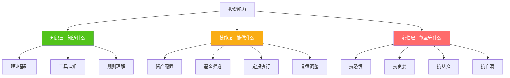
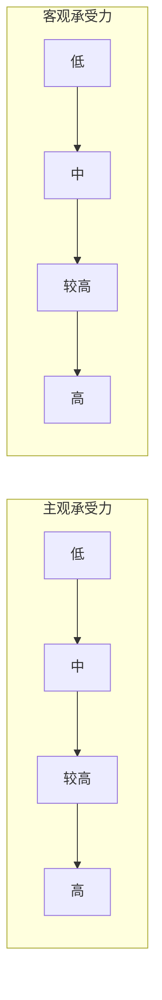
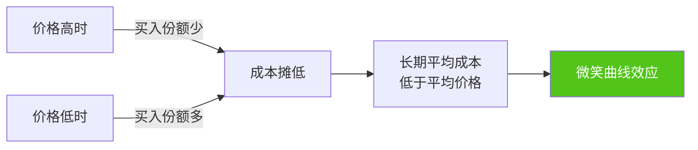

# 第五章：投资理财基础 —— 练习方法

## 为什么要"练习"投资

投资是一项技能，而不是一种知识。就像游泳——你可以把流体力学背得滚瓜烂熟，但跳进水里还是会呛水。投资也是如此：你可以理解复利公式、背下资产配置理论、熟悉每种基金的区别，但真金白银投入市场的那一刻，你的肾上腺素、恐惧和贪婪会瞬间压倒所有理论知识。

这就是练习的价值。**练习的意义不是在模拟中赚钱，而是在模拟中犯错——用最小的代价，建立最深的肌肉记忆。**



本章设计了八个递进式练习，覆盖从自我认知到实操执行的完整链条。每个练习都包含：明确的目标、具体的操作步骤、常见错误警示、以及自检标准。建议按顺序完成，每个练习花 15-30 分钟，总计约 3-4 小时——这可能是你投资生涯中回报率最高的几个小时。

| 练习序号 | 名称 | 核心能力 | 预计时间 | 难度 |
|---------|------|---------|---------|------|
| 练习一 | 风险承受能力评估 | 自我认知 | 15 分钟 | ★☆☆☆☆ |
| 练习二 | 投资心理画像 | 行为觉察 | 20 分钟 | ★★☆☆☆ |
| 练习三 | 投资目标设定 | 目标管理 | 20 分钟 | ★★☆☆☆ |
| 练习四 | 资产配置方案设计 | 组合构建 | 30 分钟 | ★★★☆☆ |
| 练习五 | 基金筛选实操 | 信息分析 | 25 分钟 | ★★★☆☆ |
| 练习六 | 定投计划制定与执行 | 纪律建立 | 20 分钟 | ★★☆☆☆ |
| 练习七 | 投资组合复盘 | 持续优化 | 30 分钟 | ★★★☆☆ |
| 练习八 | 场景模拟与知识测试 | 综合应用 | 30 分钟 | ★★★★☆ |

---

## 练习一：风险承受能力评估

### 为什么这个练习排在第一位

很多人一上来就问"买什么基金好"，但正确的第一个问题应该是"我能承受多大风险"。风险承受能力不是性格测试，而是由你的**财务状况**（客观承受力）和**心理特质**（主观承受力）共同决定的硬约束。忽视这个约束，你大概率会在市场下跌时做出最差的决策——在恐惧中卖出。

### 评估维度一：客观风险承受力

客观风险承受力由四个因素决定：年龄（时间窗口）、收入稳定性（现金流保障）、资产规模（安全垫厚度）、负债情况（杠杆压力）。逐一评估：

**问卷 A：财务状况评估**

回答以下问题，记录对应分数：

```text
1. 你的年龄是？
   A. 25 岁以下（+3）—— 时间是最大的武器，即使亏损也有几十年回本
   B. 25-35 岁（+2）—— 职业上升期，收入增长可覆盖短期亏损
   C. 35-45 岁（+1）—— 家庭责任加重，需要更稳健的配置
   D. 45 岁以上（+0）—— 退休临近，本金安全优先

2. 你的月收入是？
   A. 1 万以下（+0）—— 结余有限，容错空间小
   B. 1-3 万（+1）—— 有一定结余，可承受适度风险
   C. 3-5 万（+2）—— 结余充裕，风险承受力较强
   D. 5 万以上（+3）—— 收入远超生活需要，可承受较大波动

3. 你的收入稳定性如何？
   A. 收入波动大，可能随时失业（+0）—— 如自由职业、销售岗
   B. 有一定波动，但基本稳定（+1）—— 如私企员工
   C. 非常稳定（+2）—— 如公务员、大型国企
   D. 有多元收入来源（+3）—— 工资 + 副业 + 投资收入

4. 你有多少可投资资产（扣除应急基金和日常开支后）？
   A. 5 万以下（+0）—— 安全垫薄，每一分钱都很重要
   B. 5-20 万（+1）—— 有基本安全垫，可开始投资
   C. 20-50 万（+2）—— 资产规模可观，分散配置有意义
   D. 50 万以上（+3）—— 可以构建完整的资产组合

5. 你有负债吗？
   A. 有高息负债（信用卡分期、消费贷、网贷）（+0）—— 先还债
   B. 只有房贷，月供占收入 30% 以下（+1）—— 负债可控
   C. 只有房贷，月供占收入 30-50%（+0）—— 负债较重
   D. 无负债或负债极低（+2）—— 财务自由度高

6. 这笔投资的钱你多久不用？
   A. 1 年内可能需要（+0）—— 不适合投资权益类资产
   B. 1-3 年不用（+1）—— 可配置债券类资产
   C. 3-5 年不用（+2）—— 可配置混合型资产
   D. 5 年以上不用（+3）—— 可以承受股票类资产的波动
```

**问卷 A 评分**：____分（满分 17 分）

| 分数区间 | 客观承受力等级 | 含义 |
|---------|--------------|------|
| 0-5 分 | 低 | 财务状况不允许承担较大风险，应以保本为主 |
| 6-10 分 | 中 | 可以承担适度风险，但需严格控制权益类资产比例 |
| 11-14 分 | 较高 | 财务基础扎实，可以配置较高比例的权益类资产 |
| 15-17 分 | 高 | 财务状况优秀，可以采用积极的投资策略 |

### 评估维度二：主观风险承受力

客观条件允许你承担风险，不代表你心理上能承受。很多人理论计算得出"我应该买 70% 的股票"，但实际亏了 15% 就失眠——这就是主观风险承受力不足。

**问卷 B：心理承受力评估**

请诚实回答，不要选择"理想中的自己"，而是选择"真实的自己"：

```text
1. 如果你的投资一天亏损了 1 万元，你会？
   A. 非常痛苦，立刻想卖出（+0）
   B. 很焦虑，会频繁查看行情（+1）
   C. 有些担心，但会告诉自己这是正常的（+2）
   D. 无所谓，甚至觉得是加仓机会（+3）

2. 你的朋友告诉你他买了一只股票赚了 50%，你会？
   A. 立刻跟着买，怕错过（+0）—— 从众心理强
   B. 很心动，会去研究一下（+1）
   C. 了解一下，但不会冲动买入（+2）
   D. 不感兴趣，坚持自己的计划（+3）

3. 你投资后多久看一次账户？
   A. 每天看好几次（+0）—— 过度关注会放大心理波动
   B. 每天看一次（+1）
   C. 每周看一两次（+2）
   D. 每月或更长时间看一次（+3）

4. 如果你买入后市场连续下跌了 3 个月，你会？
   A. 坚信"这次不一样"，赶紧卖出（+0）
   B. 怀疑自己的判断，考虑卖出（+1）
   C. 虽然不舒服，但会坚持原计划（+2）
   D. 按计划继续定投，甚至加大投入（+3）

5. 你对"不确定性"的态度是？
   A. 非常讨厌，一切都需要确定才安心（+0）
   B. 能接受小的不确定性（+1）
   C. 理解不确定性是生活的一部分（+2）
   D. 拥抱不确定性，认为它是机会的来源（+3）

6. 你在生活中做重大决策时，通常会？
   A. 纠结很久，害怕做错（+0）
   B. 会考虑一段时间再做决定（+1）
   C. 收集足够信息后果断决定（+2）
   D. 凭直觉快速决定（+3）
```

**问卷 B 评分**：____分（满分 18 分）

| 分数区间 | 主观承受力等级 | 含义 |
|---------|--------------|------|
| 0-6 分 | 低 | 心理上不适合高波动投资，先从低风险产品开始 |
| 7-11 分 | 中 | 可以接受适度波动，但需要纪律来约束情绪 |
| 12-15 分 | 较高 | 心态成熟，能在市场波动中保持理性 |
| 16-18 分 | 高 | 心理素质优秀，适合积极的投资策略 |

### 综合评估与配置建议

将两个维度结合起来，确定你的风险等级：



**综合评估矩阵**（取两个维度中较低的那个作为最终等级）：

| | 客观-低 | 客观-中 | 客观-较高 | 客观-高 |
|--|--------|--------|----------|--------|
| **主观-低** | 极保守 | 保守 | 保守 | 稳健 |
| **主观-中** | 保守 | 稳健 | 稳健 | 稳健偏积极 |
| **主观-较高** | 保守 | 稳健 | 积极 | 积极 |
| **主观-高** | 稳健 | 稳健偏积极 | 积极 | 激进 |

**各风险等级的资产配置建议**：

| 风险等级 | 货币基金 | 债券基金 | 混合基金 | 股票/指数基金 | 适合人群 |
|---------|---------|---------|---------|------------|---------|
| 极保守 | 40-50% | 40-50% | 0-10% | 0% | 退休人士、短期内有大额支出需求 |
| 保守 | 20-30% | 40-50% | 10-20% | 0-10% | 风险厌恶者、投资新手 |
| 稳健 | 10-20% | 30-40% | 20-30% | 20-30% | 大多数工薪族、有 3-5 年投资期限 |
| 稳健偏积极 | 5-10% | 15-25% | 25-35% | 35-45% | 收入稳定、有一定投资经验 |
| 积极 | 0-5% | 10-20% | 20-30% | 50-60% | 年轻、收入高、投资经验丰富 |
| 激进 | 0-5% | 0-10% | 10-20% | 70-80% | 年轻、财务自由、心理承受力极强 |

### 常见错误

**错误一：高估自己的风险承受力**。牛市中人人都觉得自己是"激进型"，但一遇到 2008 年或 2015 年那种级别的下跌，才发现自己连"稳健"都承受不了。建议在评估时故意保守一档。

**错误二：风险等级一成不变**。你 25 岁时的风险承受力和 40 岁时一定不同。建议每年重新评估一次，特别是经历重大生活事件（结婚、买房、生子、失业）后。

**错误三：用别人的风险等级**。你的朋友可能告诉你"我全买股票"，但他的收入、存款、家庭状况和你完全不同。风险评估是个人的，不存在"统一标准"。

### 自检标准

完成本练习后，你应该能清晰回答以下问题：
- 我的风险等级是什么？（极保守 / 保守 / 稳健 / 稳健偏积极 / 积极 / 激进）
- 我的客观限制是什么？（收入、资产、负债、投资期限）
- 我的心理弱点是什么？（容易恐慌 / 容易从众 / 容易过度自信 / 容易频繁交易）
- 我的权益类资产配置上限是多少？

---

## 练习二：投资心理画像

### 为什么需要了解自己的投资心理

上一个练习评估的是"你能承受多大风险"，这个练习要回答的是"你在投资中会犯什么心理错误"。行为金融学的研究表明，人类在投资场景中会系统性地犯错——这些错误不是个例，而是进化本能的副产品。了解自己最容易掉进哪个陷阱，是防御的第一步。

### 心理画像测试

以下 10 个问题，每题选择最符合你真实反应的选项。关键原则：**选你真正会做的，不是你认为应该做的**。

```text
场景一：追涨心理
你注意到某只基金最近 3 个月涨了 40%，身边好几个朋友都在讨论。
你的反应是：
A. 立刻买入，怕错过更多涨幅（追涨倾向 +1）
B. 先研究一下，但倾向于买入（追涨倾向 +0.5）
C. 关注但不行动，看看自己的计划里有没有它（理性 +1）
D. 完全不关心，短期涨幅不代表什么（理性 +2）

场景二：恐慌心理
你持有的基金一个月内下跌了 15%，新闻全是利空消息。
你的反应是：
A. 赶紧卖出，少亏就是赚（恐慌倾向 +1）
B. 纠结中，想卖但舍不得（恐慌倾向 +0.5）
C. 虽然不舒服，但不会因此改变计划（理性 +1）
D. 检查基本面是否变化，如果没有则继续持有甚至加仓（理性 +2）

场景三：从众心理
你加入了一个投资交流群，群里大多数人都在买同一只基金。
你的反应是：
A. 跟着买，这么多人买肯定没错（从众倾向 +1）
B. 犹豫后还是买了，感觉不买会错过（从众倾向 +0.5）
C. 会自己研究，但不会因为群里的讨论就买入（独立 +1）
D. 直接退群，群聊是投资的大敌（独立 +2）

场景四：过度自信
你前两次投资决策都赚了钱。
你的反应是：
A. 我很有投资天赋，可以加大投入（过度自信 +1）
B. 感觉不错，觉得自己比大多数人强（过度自信 +0.5）
C. 运气成分很大，不能因此改变策略（理性 +1）
D. 样本太少，两次成功说明不了任何事情（理性 +2）

场景五：损失厌恶
你面临两个选择：
选择 A：确定赚 5000 元
选择 B：50% 概率赚 10000 元，50% 概率不赚
你选：
A. 选 A，确定的钱更踏实（损失厌恶 +1）
B. 纠结后选 A（损失厌恶 +0.5）
C. 两者差不多，但倾向 B（理性 +1）
D. 选 B，数学期望更高（理性 +2）

场景六：锚定效应
你以每份 1.5 元买入的基金，现在跌到 1.2 元。
你的反应是：
A. 一定要等涨回 1.5 元再卖（锚定 +1）
B. 心理上很难接受在 1.2 元卖出（锚定 +0.5）
C. 买入价不重要，重要的是未来走势（理性 +1）
D. 买入价是沉没成本，决策应基于当前信息（理性 +2）

场景七：处置效应
你持有两只基金，A 基金赚了 20%，B 基金亏了 20%。
你需要用钱，必须卖一只。你会卖：
A. 卖 A 基金，落袋为安（处置效应 +1）
B. 纠结，倾向于卖 A（处置效应 +0.5）
C. 看两只基金的基本面再决定（理性 +1）
D. 卖基本面差的那只，不管盈亏（理性 +2）

场景八：心理账户
你意外收到 5000 元奖金。
你会：
A. 拿去消费或买高风险产品，"反正是意外之财"（心理账户 +1）
B. 比平时更舍得花钱（心理账户 +0.5）
C. 和其他收入一样对待，纳入整体规划（理性 +1）
D. 严格执行既定的储蓄和投资比例（理性 +2）

场景九：禀赋效应
你持有的某只基金表现持续不佳，但你已经持有 2 年了。
你的反应是：
A. 持有这么久了，舍不得卖（禀赋效应 +1）
B. 虽然知道应该换，但拖着不动（禀赋效应 +0.5）
C. 如果有更好的选择，会考虑换（理性 +1）
D. 严格按标准筛选，该换就换，持有时间不影响决策（理性 +2）

场景十：短期主义
你设定了 3 年的投资计划，但 6 个月后收益不及预期。
你的反应是：
A. 计划不行，赶紧换策略（短期主义 +1）
B. 有些动摇，想做一些调整（短期主义 +0.5）
C. 6 个月太短了，继续执行（理性 +1）
D. 3 年计划就该执行 3 年，除非基本面变了（理性 +2）
```

### 评分与解读

**统计你的心理偏差类型**：

| 心理偏差 | 场景 | 你的得分 | 风险等级 |
|---------|------|---------|---------|
| 追涨倾向 | 场景一 | /2 | 分数越低越危险 |
| 恐慌倾向 | 场景二 | /2 | 分数越低越危险 |
| 从众倾向 | 场景三 | /2 | 分数越低越危险 |
| 过度自信 | 场景四 | /2 | 分数越低越危险 |
| 损失厌恶 | 场景五 | /2 | 分数越低越危险 |
| 锚定效应 | 场景六 | /2 | 分数越低越危险 |
| 处置效应 | 场景七 | /2 | 分数越低越危险 |
| 心理账户 | 场景八 | /2 | 分数越低越危险 |
| 禀赋效应 | 场景九 | /2 | 分数越低越危险 |
| 短期主义 | 场景十 | /2 | 分数越低越危险 |
| **总分** | | **/20** | |

**总分解读**：

| 总分区间 | 心理成熟度 | 建议 |
|---------|----------|------|
| 16-20 分 | 优秀 | 你有很强的投资心理素质，可以独立做投资决策 |
| 11-15 分 | 良好 | 大部分时候理性，但某些场景下容易犯错，需要针对弱点建立纪律 |
| 6-10 分 | 一般 | 投资心理有待加强，建议从定投开始，用纪律替代情绪 |
| 0-5 分 | 较弱 | 强烈建议先用模拟盘练习至少 3 个月，再投入真实资金 |

**针对你的弱点，制定防御策略**：

找出你得分最低的 2-3 个维度，填写以下防御策略：

```text
我最大的心理弱点是：________________

当这个弱点出现时，我的典型表现是：________________

我的防御规则是（具体、可执行、不可变通）：
1. ________________________
2. ________________________
3. ________________________
```

例如，如果你的弱点是"追涨倾向"，防御规则可以是：
1. 任何基金，不在涨幅超过 30% 后的 1 个月内买入
2. 买入前必须填写"投资决策记录表"，冷静 24 小时后再执行
3. 只在每月固定日期（定投日）做任何买入操作，其他时间不打开基金 APP

---

## 练习三：投资目标设定

### 为什么投资需要目标

没有目标的投资，就像没有目的地的航行——你不知道要去哪里，也不知道什么时候该停。很多人投资了几年后，赚了不知道该不该卖，亏了不知道该不该扛，根本原因就是没有明确的目标。

投资目标的作用有三个：
1. **确定需要多少收益率**——不同的目标对收益率的要求不同，决定了你的资产配置策略
2. **确定投资期限**——期限越长，可以承受的风险越高
3. **提供决策锚点**——有了目标，你就知道什么时候该卖（达到目标时），什么时候该买（目标还远时）

### 第一步：明确你的投资目标

按时间维度，将你的财务目标分为三类：

```text
短期目标（1-3 年内）：
这类目标通常金额明确、时间刚性，如买房首付、买车、结婚、旅行。
对这类目标，本金安全是第一位的，不应承受太大波动。

目标 1：________________
需要金额：____元
目前已有：____元
缺口：____元
期限：____年
每月需要存入：____元（缺口 ÷ 月数）

目标 2：________________
需要金额：____元
目前已有：____元
缺口：____元
期限：____年
每月需要存入：____元

中期目标（3-10 年）：
这类目标需要兼顾增长和安全，如子女教育金、换房资金。
可以承受适度波动，但需要在目标临近时逐步降低风险。

目标 3：________________
需要金额：____元（考虑通胀后的实际购买力）
目前已有：____元
缺口：____元
期限：____年
所需年化收益率：____%（使用 72 法则或复利计算器估算）

长期目标（10 年以上）：
这类目标时间充裕，可以承受较大波动，追求长期复利增长。
典型目标：退休金、子女大学教育金、财务自由。

目标 4：________________
需要金额：____元
目前已有：____元
缺口：____元
期限：____年
所需年化收益率：____%
```

### 第二步：评估可投资金额

投资的前提是"有余钱"。准确评估你的可投资金额，避免过度投资影响生活：

```text
月度收支计算：

收入项：
- 工资（税后）：____元
- 副业收入：____元
- 其他收入：____元
- 月收入合计：____元

支出项：
- 房租/房贷：____元
- 日常餐饮：____元
- 交通出行：____元
- 通讯/网络：____元
- 日用品/衣物：____元
- 社交/娱乐：____元
- 保险费用：____元
- 其他支出：____元
- 月支出合计：____元

月结余：____元（收入 - 支出）

可投资金额计算：
- 月结余：____元
- 建议保留比例（应急储蓄补充）：30%
- 建议定投比例：50-70%
- 每月可定投金额：____元

已有资产盘点：
- 银行活期/定期：____元
- 货币基金（余额宝等）：____元
- 应急基金是否已达标（3-6 个月生活费）：是 / 否
- 已有投资资产：____元
- 总可投资资产：____元
```

### 第三步：目标与策略匹配

根据你的目标和可投资金额，确定每个目标的投资策略：

| 目标 | 金额 | 期限 | 推荐工具 | 预期年化 | 每月投入 |
|------|------|------|---------|---------|---------|
| 短期目标 1 | ____元 | ____年 | 货币基金/短债基金 | 2-3% | ____元 |
| 短期目标 2 | ____元 | ____年 | 银行理财/债券基金 | 3-5% | ____元 |
| 中期目标 3 | ____元 | ____年 | 混合基金/二级债基 | 5-8% | ____元 |
| 长期目标 4 | ____元 | ____年 | 指数基金/偏股基金 | 8-12% | ____元 |

### 常见错误

**错误一：目标不量化**。"我想财务自由"不是目标，"我希望 55 岁时拥有 500 万可投资资产，每年产生 20 万被动收入"才是目标。不量化的目标无法分解为行动计划。

**错误二：忽视通胀**。10 年后需要 100 万，如果年通胀率 3%，实际需要约 134 万。设定目标时，务必用实际购买力计算，而不是名义金额。

**错误三：目标太多且相互冲突**。同时追求"买房""换车""留学""退休"，每个都需要大量资金，但月收入是有限的。优先排序，分阶段实现，而不是什么都想要。

---

## 练习四：资产配置方案设计

### 为什么资产配置是投资中最重要的决策

诺贝尔经济学奖得主威廉·夏普（William Sharpe）的研究表明，投资组合收益的 91.5% 来自资产配置，而非选股或择时。换句话说，你把钱分成几份、每份投什么类型，比你具体买哪只基金重要 10 倍以上。

资产配置的核心逻辑是：不同资产在不同经济环境下的表现不同。股票在经济扩张期表现好，债券在经济衰退期表现好，黄金在危机时期表现好。通过将它们组合在一起，你可以在任何经济环境下都不会输得太惨——这就是分散化的红利。

### 第一步：确定你的配置模型

根据你的风险等级（练习一的结论）和投资期限，选择一个基础配置模型：

**模型 A：标准配置法（适合大多数人）**

| 资产类别 | 配置比例 | 具体工具 | 作用 |
|---------|---------|---------|------|
| 应急基金 | 单独计算，不纳入配置 | 货币基金 | 3-6 个月生活费的安全垫 |
| 债券类 | 40-60% | 纯债基金 + 短债基金 | 稳定器，降低组合波动 |
| 权益类 | 30-50% | 沪深 300 + 中证 500 指数基金 | 增长引擎 |
| 现金类 | 5-10% | 货币基金 | 流动性储备 |

**模型 B：年龄配置法（简易法则）**

债券比例 = 你的年龄，其余配置权益类资产。

例如：30 岁 → 30% 债券 + 70% 权益；45 岁 → 45% 债券 + 55% 权益。

优点是简单易记，缺点是过于粗略，没有考虑个人的具体财务状况。

**模型 C：目标日期法（适合有明确期限的目标）**

距离目标日期越近，债券比例越高：

| 距目标年数 | 权益类比例 | 债券类比例 |
|-----------|----------|----------|
| 10 年以上 | 70-80% | 20-30% |
| 7-10 年 | 60-70% | 30-40% |
| 5-7 年 | 40-50% | 50-60% |
| 3-5 年 | 20-30% | 70-80% |
| 1-3 年 | 0-10% | 90-100% |

### 第二步：设计你的个人配置方案

```text
我的资产配置方案

风险等级：________________（来自练习一）
投资期限：____年
可用投资金额：____元

配置方案：

1. 应急基金（不在投资配置内）：
   - 金额：____元（3-6 个月生活费）
   - 存放位置：货币基金（如余额宝/微信零钱通）
   - 状态：已达标 / 需要补充 ____元

2. 债券类资产（____%）：____元
   - 纯债基金：____元（占比 ____%）
     基金名称/代码：________________
   - 短债基金：____元（占比 ____%）
     基金名称/代码：________________

3. 权益类资产（____%）：____元
   - 沪深 300 指数基金：____元（占比 ____%）
     基金名称/代码：________________
   - 中证 500 指数基金：____元（占比 ____%）
     基金名称/代码：________________
   - 其他：____元（占比 ____%）
     基金名称/代码：________________

4. 现金类资产（____%）：____元
   - 货币基金：____元

合计：____元

每月定投分配：
- 债券类：____元/月
- 权益类：____元/月
- 现金类：____元/月
- 月定投总额：____元/月
```

### 第三步：配置合理性自检

填写完方案后，用以下清单检验：

```text
□ 应急基金是否已单独预留？（不应该纳入投资配置）
□ 权益类资产占比是否符合我的风险等级？
□ 是否至少持有 2 只不同的基金来分散风险？
□ 单只基金占总投资的比例是否低于 40%？
□ 我能否承受这个配置的最大可能回撤？（权益类占比 × 50% + 债券类占比 × 8%）
□ 每月定投金额是否在月结余的 50-70% 之间？
□ 这个配置是否能在不卖出的情况下应对 6 个月的突发支出？
```

如果任何一项打"否"，请回头调整方案。

### 常见错误

**错误一：过度分散**。持有 15 只以上的基金，不仅管理困难，而且其中很多基金的持仓可能高度重叠（比如同时买了沪深 300ETF 和上证 50ETF，前十大重仓股有大量重复）。3-5 只覆盖不同风格的基金就够了。

**错误二：忽视相关性**。分散投资的前提是资产之间相关性低。如果你同时买了沪深 300、MSCI 中国 A50 和上证 50，这三个指数的成分股高度重叠，实际上等于没有分散。

**错误三：配置好就再也不管**。市场涨跌会导致实际比例偏离目标。比如你设定了 60% 权益 + 40% 债券，一年后权益涨了 20% 而债券只涨了 3%，实际比例可能变成了 65:35。需要定期再平衡（见练习七）。

---

## 练习五：基金筛选实操

### 为什么不能随便买基金

基金有数千只，质量参差不齐。同样是跟踪沪深 300 的指数基金，跟踪误差可以从 0.02% 到 0.5%，管理费可以从 0.15% 到 1.0%，规模可以从 1 亿到 1000 亿。这些差异看似微小，但长期累积下来，对你的最终收益影响巨大。

### 第一步：确定投资类型

根据你的配置方案，确定需要哪种类型的基金：

```text
我需要的基金类型：

□ 货币基金 —— 用途：应急基金 / 现金储备
□ 纯债基金 —— 用途：债券类配置
□ 短债基金 —— 用途：短期资金存放
□ 沪深 300 指数基金 —— 用途：大盘蓝筹配置
□ 中证 500 指数基金 —— 用途：中小盘配置
□ 混合基金 —— 用途：均衡配置
□ 其他：________________
```

### 第二步：搜索和比较

**搜索渠道**：

| 渠道 | 优势 | 适合 |
|------|------|------|
| 天天基金网 (fund.eastmoney.com) | 基金数据最全面，筛选工具强大 | 深入研究 |
| 蚂蚁财富 / 支付宝 | 操作方便，可直接购买 | 快速筛选 |
| 晨星中国 (cn.morningstar.com) | 专业评级，风险分析详细 | 质量评估 |
| 且慢 / 蛋卷基金 | 有现成的组合方案参考 | 不想自己选基金的人 |

**以沪深 300 指数基金为例，具体筛选步骤**：

1. 打开天天基金网 → 基金筛选 → 指数型 → 跟踪指数选择"沪深300"
2. 按以下指标逐一比较：

```text
沪深 300 指数基金比较表

基金 A：
- 基金名称：________________
- 基金代码：________________
- 跟踪误差：____%（越小越好）
- 管理费率：____%/年
- 托管费率：____%/年
- 综合费率：____%/年（管理费 + 托管费 + 销售服务费）
- 基金规模：____亿元
- 成立时间：____年
- 基金公司：________________
- 场内/场外：________________
- 是否有 ETF 联接基金：是 / 否

基金 B：
- 基金名称：________________
- 基金代码：________________
- 跟踪误差：____%
- 管理费率：____%/年
- 托管费率：____%/年
- 综合费率：____%/年
- 基金规模：____亿元
- 成立时间：____年
- 基金公司：________________

基金 C：
- 基金名称：________________
- 基金代码：________________
- 跟踪误差：____%
- 管理费率：____%/年
- 托管费率：____%/年
- 综合费率：____%/年
- 基金规模：____亿元
- 成立时间：____年
- 基金公司：________________
```

### 第三步：评估标准详解

每个评估指标背后的逻辑和阈值：

**跟踪误差**（指数基金最重要的指标）

跟踪误差衡量的是基金收益率与指数收益率之间的偏差。跟踪误差越小，说明基金复制指数越精确。对于被动指数基金来说，这是衡量管理水平的核心指标。

- 优秀：< 0.05%
- 良好：0.05% - 0.1%
- 一般：0.1% - 0.3%
- 较差：> 0.3%（不建议选择）

**综合费率**

费率是确定性地侵蚀你收益的因素。假设两只基金跟踪同一个指数，A 基金综合费率 0.6%，B 基金综合费率 0.2%，30 年后 B 基金的累计收益会比 A 基金高约 12%。

- 优秀：< 0.2%/年（如部分 ETF）
- 良好：0.2% - 0.5%/年
- 一般：0.5% - 0.8%/年
- 较差：> 0.8%/年（不建议选择）

**基金规模**

规模太小的基金有清盘风险（低于 5000 万可能触发清盘条款），规模太大可能影响跟踪精度（但影响较小）。

- 不建议：< 2 亿元
- 可接受：2-10 亿元
- 理想区间：10-500 亿元
- 可接受但非最优：> 500 亿元

**成立时间**

成立时间太短的基金没有足够的历史数据来评估跟踪误差和管理水平。

- 不建议：< 1 年
- 可接受：1-3 年
- 理想：> 3 年

**基金公司**

优先选择管理规模大、指数基金产品线齐全的头部公司。在国内，华夏、易方达、南方、嘉实、华泰柏瑞、天弘等公司在指数基金领域有较强的实力。

### 第四步：做出选择

```text
我的选择：

我选择的基金：________________（名称 + 代码）
选择理由（至少写 3 条）：
1. ________________________
2. ________________________
3. ________________________

备选基金（如果首选基金出了问题，如规模大幅缩水、跟踪误差变大）：
备选方案：________________
```

### 常见错误

**错误一：只看收益率选基金**。历史收益率不代表未来表现，但费率和跟踪误差是长期确定的。一只费率低、跟踪误差小的基金，长期表现一定优于费率高、跟踪误差大的同类基金。

**错误二：被"增强型指数基金"迷惑**。增强型指数基金在指数基础上做主动管理，目标是超越指数。听起来很好，但数据显示，大部分增强型指数基金长期跑输基准指数——而且管理费更高。对新手而言，纯被动指数基金是更好的选择。

**错误三：忽略场内场外的区别**。场内 ETF 需要证券账户，交易像股票一样实时成交，费率通常更低。场外基金（在支付宝、天天基金等平台买）申购赎回需要 T+1 或更长时间，但操作更方便。如果你有证券账户且计划长期持有，优先选场内 ETF。

---

## 练习六：定投计划制定与执行

### 为什么定投是新手的最佳策略

定投的核心价值不是"赚更多"，而是"犯更少的错"。它通过自动化消除了择时决策，从而避免了追涨杀跌、恐慌卖出等心理陷阱。对于投资新手来说，定投几乎是唯一可靠的起步方式。

定投的数学原理：通过在不同价格买入相同金额，你在低价时自动买入更多份额，高价时自动买入更少份额，从而实现"自动低买高卖"——这就是所谓的"微笑曲线"效应。



### 第一步：确定定投金额

```text
定投金额计算：

月收入：____元
月支出：____元
月结余：____元

定投金额的确定原则：
1. 不影响日常生活质量
2. 不需要动用应急基金
3. 即使连续亏损 6 个月也能坚持

建议定投金额：月结余的 50-70%
我的定投金额：____元/月

验证：这笔钱扣掉后，我的生活是否受影响？
□ 是 → 降低定投金额，优先保障生活
□ 否 → 可以执行

验证：如果连续 6 个月市场下跌 20%，我能否不中断定投？
□ 是 → 金额合理
□ 否 → 降低定投金额，确保能坚持
```

### 第二步：选择定投标的和分配

```text
我的定投组合：

| 基金名称 | 类型 | 定投金额（元/月） | 占比 | 定投理由 |
|----------|------|----------------|------|---------|
| | 指数基金 | | | |
| | 指数基金 | | | |
| | 债券基金 | | | |
| | 其他 | | | |
| **总计** | | **____元** | **100%** | |

定投组合自检：
□ 是否覆盖了不同风格（大盘/中小盘）？
□ 权益类占比是否符合我的风险等级？
□ 单只基金占比是否低于 50%？
□ 基金之间的相关性是否足够低？
```

### 第三步：设置自动定投

在基金平台（支付宝、天天基金、证券 APP 等）中设置自动定投：

```text
自动定投设置清单：

基金 1：
- 基金名称：________________
- 定投金额：____元
- 定投周期：每周 / 每两周 / 每月
- 定投日期：每月____日（建议选发工资后 1-2 天）
- 扣款账户：________________（建议绑定工资卡）

基金 2：
- 基金名称：________________
- 定投金额：____元
- 定投周期：每周 / 每两周 / 每月
- 定投日期：每月____日
- 扣款账户：________________

基金 3：
- 基金名称：________________
- 定投金额：____元
- 定投周期：每周 / 每两周 / 每月
- 定投日期：每月____日
- 扣款账户：________________
```

**定投频率的选择**：

| 频率 | 优势 | 劣势 | 适合 |
|------|------|------|------|
| 每月 | 最简单，扣款次数少 | 摊薄效果略弱 | 大多数人 |
| 每两周 | 摊薄效果更好 | 扣款次数翻倍 | 月结余较高的人 |
| 每周 | 摊薄效果最好 | 扣款频繁，管理麻烦 | 资金充裕、追求极致的人 |

数据研究表明，月定投和周定投的长期收益差异不超过 0.5%，不必过度纠结。**选一个能坚持的频率，比选一个"最优"频率更重要。**

### 第四步：设定止盈策略

定投只解决了"何时买"的问题，还需要回答"何时卖"。没有止盈策略的定投，可能坐过山车——收益上去了又回来。

```text
我的止盈策略：

选择一种或多种止盈方式：

□ 方式一：目标收益率止盈
  - 适用场景：有明确的收益目标
  - 我的目标收益率：____%
  - 触发后操作：全部卖出 / 分批卖出

□ 方式二：估值止盈
  - 适用场景：投资指数基金，可以参考估值
  - 止盈标准：PE（市盈率）高于历史 ____ 分位时开始卖出
  - 数据来源：中证指数官网 / 且慢估值 / 韭圈儿

□ 方式三：最大回撤止盈
  - 适用场景：想让利润奔跑，但设好"保护线"
  - 触发条件：从最高点回撤 ____% 时卖出
  - 优势：不会过早止盈，能在趋势中吃到大部分涨幅

我的卖出计划（分批卖出比一次性卖出更理性）：
- 第一批：当收益达到 ____% 时，卖出 ____%
- 第二批：收益继续上涨 ____% 后，再卖出 ____%
- 第三批：收益继续上涨 ____% 后，卖出剩余部分
```

### 常见错误

**错误一：定投中断**。市场下跌时是最应该坚持定投的时候——此时买入成本更低，未来收益更高。但很多新手恰恰在下跌时中断定投，违背了定投"低买"的核心逻辑。

**错误二：没有止盈**。定投不等于"永远不卖"。A 股市场有明显的周期性，如果不及时止盈，收益可能大幅回吐。止盈后可以重新开始下一轮定投。

**错误三：止盈后不重启**。卖出获利后，很多人把钱放在活期里不动，错过了下一轮定投的机会。止盈不是结束，而是下一轮定投的开始。

---

## 练习七：投资组合复盘

### 为什么需要定期复盘

投资不是"一锤子买卖"，而是持续管理的过程。市场涨跌会改变你组合中各资产的实际比例，你的生活状况也在不断变化。定期复盘的目的是：确保你的投资组合始终符合你的目标和风险承受能力。

复盘不是"看赚了多少钱"，而是回答三个核心问题：
1. 我的资产配置是否偏离了目标？（是否需要再平衡）
2. 我的投资目标是否发生了变化？（是否需要调整策略）
3. 我的投资行为是否符合纪律？（是否犯了心理错误）

### 月度复盘（每月花 10 分钟）

```text
月度投资复盘表

日期：____年____月____日

一、定投执行情况：
□ 本月所有定投正常执行
□ 本月有定投中断，原因：________________
□ 本月有额外买入/卖出，原因：________________

二、本月账户概况：
- 本月投入金额：____元
- 当前账户总市值：____元
- 累计投入本金：____元
- 累计收益（浮盈/浮亏）：____元
- 累计收益率：____%

三、资产配置现状：
| 资产类别 | 目标比例 | 实际比例 | 偏差 |
|---------|---------|---------|------|
| 债券类 | ____% | ____% | ____% |
| 权益类 | ____% | ____% | ____% |
| 现金类 | ____% | ____% | ____% |

四、行为检查（诚实地勾选）：
□ 本月我没有因为市场波动而改变计划
□ 本月我有冲动想卖出但忍住了
□ 本月我有冲动想追涨但忍住了
□ 本月我因为恐慌/贪婪做了计划外的操作：________________

五、下月计划：
□ 继续执行当前计划，无需调整
□ 需要调整，原因和方案：________________
```

### 季度复盘（每季度花 30 分钟）

```text
季度投资复盘表

日期：____年____月____日
复盘区间：____年____月 至 ____年____月

一、收益回顾：
- 本季度初总市值：____元
- 本季度投入金额：____元
- 本季度末总市值：____元
- 本季度收益：____元
- 本季度收益率：____%
- 同期沪深 300 涨跌幅：____%（用于对比参考）

二、再平衡检查：
当资产配置的实际比例偏离目标超过 5 个百分点时，需要再平衡。

| 资产类别 | 目标比例 | 实际比例 | 偏差 | 是否需要调整 |
|---------|---------|---------|------|------------|
| 债券类 | ____% | ____% | ____% | □ 是 □ 否 |
| 权益类 | ____% | ____% | ____% | □ 是 □ 否 |
| 现金类 | ____% | ____% | ____% | □ 是 □ 否 |

再平衡方式（选择一种）：
□ 用新增资金调整 —— 新增的资金优先买入比例偏低的资产
□ 卖出买入调整 —— 卖出比例偏高的资产，买入比例偏低的资产
□ 暂不调整 —— 偏差尚在可接受范围内

三、基金质量检查：
| 持有基金 | 本季度表现 | 跟踪误差 | 规模变化 | 是否继续持有 |
|----------|----------|---------|---------|------------|
| | | | | □ 是 □ 否 |
| | | | | □ 是 □ 否 |
| | | | | □ 是 □ 否 |

需要更换基金的信号（出现任一则考虑更换）：
□ 跟踪误差显著增大（超过 0.3%）
□ 基金规模跌破 2 亿
□ 基金经理更换（主动基金）
□ 基金费率上调
□ 基金公司出现重大负面事件

四、目标进度检查：
| 目标 | 目标金额 | 当前进度 | 进度百分比 | 是否需要调整策略 |
|------|---------|---------|----------|----------------|
| | | | % | □ 是 □ 否 |
| | | | % | □ 是 □ 否 |
```

### 年度复盘（每年花 1-2 小时）

```text
年度投资复盘表

日期：____年____月____日
复盘年度：____年

一、年度收益总结：
- 年初总市值：____元
- 年度总投入：____元
- 年末总市值：____元
- 年度总收益：____元
- 年度收益率：____%
- 同期沪深 300 涨跌幅：____%
- 同期通胀率（CPI）：____%
- 我是否跑赢了通胀？是 / 否
- 我是否跑赢了沪深 300？是 / 否

二、资产配置回顾与调整：
回顾年初的目标配置，评估是否需要调整。

年初配置 vs 年末实际：
| 资产类别 | 年初目标 | 年末实际 | 下年目标 | 调整原因 |
|---------|---------|---------|---------|---------|
| 债券类 | ____% | ____% | ____% | |
| 权益类 | ____% | ____% | ____% | |
| 现金类 | ____% | ____% | ____% | |

三、投资行为回顾：
回答以下问题（诚实是进步的前提）：

1. 今年我做了几次计划外的交易？____次
   最大的一次计划外交易是什么？________________
   事后看，这个交易对收益的影响是正面还是负面？________________

2. 今年我有几次想卖出但忍住了？____次
   忍住的结果如何？________________

3. 今年我犯过的最大投资错误是什么？________________
   我从中学到了什么？________________

4. 今年我做得最好的一个投资决策是什么？________________
   好在哪里？________________

四、风险承受能力重新评估：
过去一年，我的生活状况是否有重大变化？
□ 结婚/离婚
□ 生子
□ 买房/卖房
□ 换工作/失业
□ 收入显著变化
□ 其他：________________

这些变化是否影响了我的风险承受能力？
□ 是，我需要重新做练习一的评估
□ 否，我的风险等级不变

五、下年计划：
- 调整后的资产配置目标：________________
- 调整后的定投金额：____元/月
- 新增的投资目标：________________
- 需要学习的投资知识：________________
- 需要改掉的投资习惯：________________
```

### 再平衡的具体操作方法

再平衡是复盘中最重要的操作。它强迫你"卖掉涨得多的，买入涨得少的"——本质上是一种纪律化的"高卖低买"。

**再平衡的触发条件**：

| 方法 | 触发条件 | 优势 | 劣势 |
|------|---------|------|------|
| 定期再平衡 | 每半年或每年固定执行 | 简单，有纪律性 | 可能在不需要时也调整 |
| 阈值再平衡 | 任一资产偏离目标超过 5-10% | 只在必要时调整 | 需要持续监控 |
| 现金流再平衡 | 每次新增资金时调整 | 无需卖出，零交易成本 | 偏差大时调整速度慢 |

**推荐组合策略**：每季度检查一次，当偏差超过 5% 时用新增资金调整，当偏差超过 10% 时进行卖出买入调整，每年至少执行一次全面再平衡。

---

## 练习八：场景模拟与综合测试

### 第一部分：场景模拟

以下是 8 个真实的投资场景。不要急着看答案，先认真思考，写下你的决策——这才是练习的价值。

**场景一：刚入场就亏**

你刚开始定投，第一个月投入 3000 元买入沪深 300 指数基金。第二个月市场下跌了 8%，你的账户浮亏约 240 元。此时你会：
```text
你的选择：________________
你的理由：________________
```

> 参考分析：坚持定投。定投的核心逻辑就是在下跌时积累更多便宜的份额。一个月的下跌在 A 股市场极其常见（沪深 300 年内平均最大回撤 -15% 到 -25%），不构成改变计划的理由。恰恰相反，下跌时定投买入的份额更多，未来反弹时收益更大。

**场景二：暴涨后的诱惑**

你持有的某只基金半年涨了 45%，远超你的预期。你的朋友说"现在不卖，等跌了就来不及了"。此时你会：
```text
你的选择：________________
你的理由：________________
```

> 参考分析：取决于你的止盈策略。如果你设定了"收益率达到 40% 就止盈"，那应该按计划执行分批卖出。如果你没有设定止盈策略，就不应该因为短期涨幅大就卖出——半年涨 45% 在 A 股并不罕见，牛市中很多基金可以涨 100% 以上。关键是：**你的卖出决策应该基于事先设定的规则，而不是基于当下的情绪。**

**场景三：大V 推荐**

你关注的一个投资大 V 在公众号上推荐了一只你没听过的基金，分析文章写得非常有说服力，评论区很多人说"跟着买了"。此时你会：
```text
你的选择：________________
你的理由：________________
```

> 参考分析：不买。任何基于他人推荐而非自己研究的买入决策，都是在赌博。大 V 的推荐可能有利益关系（基金公司推广费），也可能只是他的个人观点——他的资金量、风险承受力、投资期限和你完全不同。如果你想研究这只基金，先把它加入观察清单，用练习五的标准独立评估。

**场景四：急需用钱**

你投入了 5 万元，当前市值 4.3 万元（亏损 14%）。此时你遇到了突发情况，需要 2 万元应急。你会：
```text
你的选择：________________
你的理由：________________
```

> 参考分析：卖出需要的金额，但尽量从债券类或货币基金中取。如果全部是权益类资产，不得不卖出，也不要一次性全部赎回——可以分 2-3 次赎回，避免在最低点一次性卖出。更重要的是反思：**为什么投资的钱会和应急的钱混在一起？** 回到练习三，重新规划资金分层。

**场景五：全面崩盘**

市场遭遇重大利空（如疫情爆发、金融危机），所有资产都在暴跌。你的账户一个月内亏损了 25%，而且新闻全是负面消息。你的家人也在劝你"赶紧卖"。此时你会：
```text
你的选择：________________
你的理由：________________
```

> 参考分析：如果你用的是闲钱（3-5 年不用的钱），最好的做法是关闭 APP，不看新闻，继续执行定投计划。历史上每一次重大危机（2008 年金融危机、2015 年股灾、2020 年疫情暴跌），市场最终都恢复并创了新高。恐慌卖出是普通人亏损的最大原因。如果你真的无法承受焦虑，说明你的权益类配置比例超出了你的心理承受力——在市场恢复后，应该调低权益比例。

**场景六：收益达标**

你的投资目标是"3 年后攒够 10 万买房首付"，现在 2 年半就达到了 10.5 万（年化收益率约 18%，远超预期）。此时你会：
```text
你的选择：________________
你的理由：________________
```

> 参考分析：果断止盈，将资金转入货币基金或短期债券基金。你的目标是"3 年后有钱买房"，而不是"追求最高收益"。既然目标提前达成，应该锁定收益，保护本金。用超额的 0.5 万作为安全缓冲。投资的终极目的是实现人生目标，不是在账户里看着数字变大。

**场景七：同行比较**

你的同事告诉你他去年投资收益 35%，而你只有 8%。你觉得自己的策略太保守了。此时你会：
```text
你的选择：________________
你的理由：________________
```

> 参考分析：不改变策略。8% 的年化收益如果能持续 20 年，复利效果远超偶尔一年的 35%。你的同事没有告诉你的是：他可能承担了高得多的风险（全仓单只股票或行业基金），明年可能亏 30%。投资不是比谁短期收益高，而是比谁活得久、犯错少。Dartboard 实验（让猴子扔飞镖选股）证明，短期收益中运气的成分极大。

**场景八：信息过载**

你关注了 10 个财经公众号，加入了 3 个投资交流群，每天收到大量"分析"和"建议"。这些信息让你越来越焦虑，反而不知道该怎么操作了。此时你会：
```text
你的选择：________________
你的理由：________________
```

> 参考分析：大幅减少信息输入。取消关注大部分公众号，退出所有投资交流群。保留 1-2 个高质量的信息源即可（如官方财报、中证指数官网估值数据）。投资中，**信息越少，决策越好**——因为大部分"信息"是噪音，只会干扰你的判断。巴菲特的办公室没有彭博终端，他用这个事实证明了"少即是多"。

### 第二部分：综合知识测试

以下 15 道题覆盖本章所有核心知识。每题只有一个最佳答案。

```text
一、投资基础（5 题）

1. 什么是复利？
   A. 利息只计算在初始本金上
   B. 利息也会产生利息，即"利滚利"
   C. 本金每年减少一部分
   D. 所有投资都自动享受复利
   答案：____

2. 以下哪项是正确的？
   A. 高收益不一定伴随高风险
   B. 低风险的投资一定不赚钱
   C. 高收益必然伴随高风险
   D. 风险可以完全消除
   答案：____

3. 根据 72 法则，年化收益率为 8% 的投资，大约需要多少年翻倍？
   A. 6 年
   B. 8 年
   C. 9 年
   D. 12 年
   答案：____

4. 以下哪种资产的流动性最差？
   A. 货币基金
   B. 银行活期存款
   C. 房产
   D. 沪深 300 指数基金
   答案：____

5. 关于通货膨胀，以下说法正确的是？
   A. 通货膨胀只影响穷人
   B. 如果投资收益率低于通胀率，实际购买力在下降
   C. 通货膨胀可以通过存银行完全对冲
   D. 通货膨胀对投资没有影响
   答案：____

二、资产配置（5 题）

6. 研究表明，投资组合收益的多少由资产配置决定？
   A. 约 50%
   B. 约 70%
   C. 约 90% 以上
   D. 约 30%
   答案：____

7. 分散投资的核心目的是什么？
   A. 追求最高收益
   B. 在不降低预期收益的情况下降低风险
   C. 减少交易成本
   D. 简化投资管理
   答案：____

8. 应急基金应该存多少？
   A. 1 个月生活费
   B. 3-6 个月生活费
   C. 1 年生活费
   D. 越多越好
   答案：____

9. 以下哪种情况应该先还债而不是投资？
   A. 房贷年利率 3.5%
   B. 信用卡分期年利率 15%
   C. 公积金贷款年利率 3.1%
   D. 以上 A 和 C 不需要先还
   答案：____

10. 资产再平衡的本质是什么？
    A. 追涨杀跌
    B. 纪律化的"高卖低买"
    C. 频繁交易
    D. 把所有资产换成现金
    答案：____

三、投资工具（3 题）

11. 以下哪种基金的费率通常最低？
    A. 主动管理型股票基金
    B. 指数基金（被动型）
    C. 混合型基金
    D. QDII 基金
    答案：____

12. 选择指数基金时，最重要的指标是？
    A. 近一年收益率
    B. 基金经理名气
    C. 跟踪误差和综合费率
    D. 基金名称是否好听
    答案：____

13. 定投的核心优势是什么？
    A. 一定能赚钱
    B. 收益率比一次性投入更高
    C. 消除择时焦虑，自动实现"低买多、高买少"
    D. 不需要选择标的
    答案：____

四、投资心理（2 题）

14. 行为金融学研究发现，投资者的实际收益低于基金本身的收益，主要原因是？
    A. 基金经理水平不行
    B. 交易成本过高
    C. 投资者自身的错误行为（追涨杀跌、频繁交易等）
    D. 市场整体不好
    答案：____

15. 你以 1.5 元/份买入的基金跌到 1.2 元/份。以下哪种想法是认知偏差？
    A. "我应该分析这只基金的基本面是否变了"
    B. "我要等涨回 1.5 元再卖"
    C. "这个价位可能是加仓的机会"
    D. "我应该检查我的资产配置是否需要调整"
    答案：____
```

**测试答案与解析**：

| 题号 | 答案 | 核心知识点 |
|------|------|----------|
| 1 | B | 复利是"利息产生利息"，爱因斯坦称其为"世界第八大奇迹" |
| 2 | C | 金融学第一定律：高收益必然伴随高风险，否则是骗局 |
| 3 | C | 72 ÷ 8 = 9 年。72 法则是快速估算翻倍时间的实用工具 |
| 4 | C | 房产变现需要数月，且可能大幅折价；其他三个都可以 T+0 到 T+3 变现 |
| 5 | B | 年通胀 3% 时，100 元 10 年后实际只值 74 元。不投资本身就是亏损 |
| 6 | C | Brinson 等人 1986 年的经典研究表明，资产配置解释了 91.5% 的收益差异 |
| 7 | B | 分散投资的核心是"免费午餐"——在不牺牲预期收益的前提下降低风险 |
| 8 | B | 3-6 个月生活费是国际通行的标准，足以应对大多数突发情况 |
| 9 | B | 信用卡分期年化 12-18%，远超长期投资的预期收益，应优先还清 |
| 10 | B | 再平衡强制你卖出涨多的（高卖）、买入涨少的（低买），是一种纪律化操作 |
| 11 | B | 指数基金不需基金经理主动选股，管理费通常仅 0.15-0.5%，远低于主动基金的 1-1.5% |
| 12 | C | 跟踪误差衡量复制精度，费率决定长期侵蚀程度，两者是被动基金质量的核心指标 |
| 13 | C | 定投不保证赚钱，也不一定比一次性投入收益高，但它消除了择时这个最大的心理陷阱 |
| 14 | C | Dalbar 报告显示投资者年化收益比基金本身低约 4 个百分点，几乎全部来自行为错误 |
| 15 | B | "等涨回买入价再卖"是锚定效应——买入价是沉没成本，不应该影响当前的卖出决策 |

**评分标准**：

| 得分 | 水平 | 建议 |
|------|------|------|
| 13-15 分 | 优秀 | 你已具备扎实的投资基础知识，可以开始实操 |
| 10-12 分 | 良好 | 基础不错，建议回顾答错的知识点后再开始投资 |
| 7-9 分 | 一般 | 建议重新阅读本章理论基础部分，巩固薄弱环节 |
| 0-6 分 | 需要加强 | 强烈建议系统性地重新学习本章，不要急于实操 |

---

## 练习进度跟踪

完成每个练习后，记录你的收获和行动计划：

```text
| 练习名称 | 完成日期 | 我的结论 | 行动计划 |
|----------|----------|---------|---------|
| 练习一：风险承受能力评估 | | 风险等级：____ | 权益配置上限：____% |
| 练习二：投资心理画像 | | 最大弱点：____ | 防御规则：____ |
| 练习三：投资目标设定 | | 核心目标：____ | 每月定投：____元 |
| 练习四：资产配置方案设计 | | 配置比例：股____债____ | 需要买的基金：____只 |
| 练习五：基金筛选实操 | | 选中的基金：____ | 开户平台：____ |
| 练习六：定投计划制定 | | 定投组合：____ | 自动扣款日：每月____日 |
| 练习七：投资组合复盘 | | 复盘周期：____ | 下次复盘日期：____ |
| 练习八：场景模拟与测试 | | 测试得分：____/15 | 需补强的知识点：____ |
```

---

## 从练习到行动：迈出第一步

完成所有练习后，你已经有了：
1. 清楚自己的风险等级和心理弱点
2. 明确的投资目标和资金规划
3. 一套完整的资产配置方案
4. 筛选好的具体基金标的
5. 可执行的定投计划和止盈策略
6. 复盘的方法和纪律

现在，真正重要的只有一件事——**开始执行**。

```text
我的投资启动清单：

□ 1. 开立基金账户（支付宝/天天基金/证券 APP） —— 完成日期：____
□ 2. 完成风险测评（平台要求的合规流程） —— 完成日期：____
□ 3. 预留应急基金到货币基金 —— 完成日期：____
□ 4. 设置自动定投（至少设置第一只基金） —— 完成日期：____
□ 5. 在日历中设置复盘提醒 —— 完成日期：____
□ 6. 记录今天的日期作为"投资起点" —— 完成日期：____
```

> **最后的提醒**：投资是马拉松，不是百米冲刺。你不需要在第一天就做出完美的决策。你需要的是一个"足够好"的开始，然后通过定期复盘不断优化。巴菲特 99% 的财富是在 50 岁以后赚到的——复利需要时间，你需要的是耐心和纪律。开始行动，然后坚持下去。
