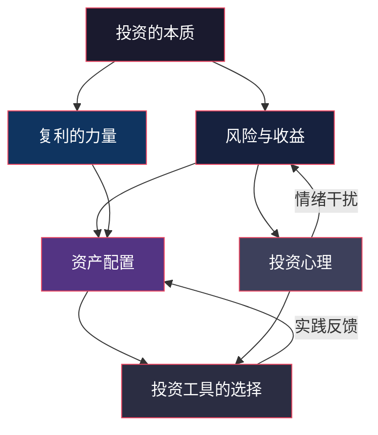

# 第五章：投资理财基础 —— 本章小结

> 本章小结不是简单的"划重点"，而是一次知识的**重构与串联**。如果你已经认真读完了前面五个小节，这一节帮你把碎片拼成全景；如果你是跳着读的，这一节就是整章的浓缩精华。

---

## 一、核心概念全景图

在深入回顾之前，先用一张图看清本章六大模块之间的逻辑关系：



这六个模块构成了一个完整的投资认知闭环：

1. **投资的本质**回答"为什么要投资"——对抗通胀、实现财务增长
2. **风险与收益**回答"投资的代价是什么"——没有免费的午餐
3. **复利的力量**回答"财富增长的引擎是什么"——时间 × 收益率 × 本金
4. **资产配置**回答"如何分配资金"——不把鸡蛋放在一个篮子里
5. **投资工具**回答"用什么投"——从货币基金到股票基金的工具光谱
6. **投资心理**回答"最大的敌人是谁"——是你自己

这六个问题环环相扣，缺一不可。只懂工具不懂心理，你会在市场波动时恐慌抛售；只懂心理不懂配置，你会把所有钱压在一个方向上。

---

## 二、逐模块深度回顾

### 2.1 投资的本质：不只是"钱生钱"

**核心定义：** 投资是将当下的资源（资金、时间、精力）配置到某种资产中，期望未来获得超过原始投入的回报。

**回报的三大来源：**

| 回报类型 | 来源 | 典型资产 | 特征 |
|---------|------|---------|------|
| 利息收入 | 借贷关系 | 银行存款、债券、P2P | 相对固定，到期兑付 |
| 股息分红 | 企业盈利分配 | 股票、REITs | 不固定，取决于企业经营 |
| 资本增值 | 资产价格上涨 | 股票、房产、黄金 | 浮动大，需要卖出才能兑现 |

**为什么要投资？——三个层次的动机：**

- **第一层：对抗通胀。** 中国近10年平均CPI约2%-3%，而银行活期利率常年低于0.5%。把钱放在活期账户里，每年实际购买力缩水约2%。10年后，100元的购买力只相当于今天的约82元。投资的第一个目的不是赚钱，而是**不亏钱**。

- **第二层：财富增长。** 通过合理的资产配置，实现年化5%-10%的收益，在复利的作用下，财富可以稳定增长。

- **第三层：财务自由。** 当被动收入（投资收益、租金等）覆盖日常开支时，你就获得了选择工作的自由。这不是"不工作"，而是"可以不做自己不想做的工作"。

**常见误区：** 很多人把投资等同于"炒股"或"买基金"。实际上，投资自己（学习技能、提升学历、保持健康）是回报率最高的投资。一个能带来每年5万元加薪的技能培训，投资回报率可能远超任何金融产品。

---

### 2.2 风险与收益：没有免费的午餐

**核心法则：** 高收益必然伴随高风险。如果有人告诉你某个投资"收益高、风险低"，那要么是他不理解风险，要么是他在骗你。

**风险的两种分类：**

| 分类维度 | 类型 | 含义 | 能否分散 | 举例 |
|---------|------|------|---------|------|
| 按来源 | 系统性风险 | 影响整个市场的风险 | ❌ 不能 | 经济衰退、战争、利率变动 |
| 按来源 | 非系统性风险 | 个别资产特有的风险 | ✅ 可以 | 某公司财务造假、行业政策变化 |
| 按性质 | 市场风险 | 价格波动导致的损失 | 部分可以 | 股市涨跌、利率变动 |
| 按性质 | 信用风险 | 借款方违约 | 可以分散 | 债券违约、P2P暴雷 |
| 按性质 | 流动性风险 | 资产无法快速变现 | 提前规划 | 房产、定期存款提前支取 |
| 按性质 | 通胀风险 | 购买力下降 | 部分可以 | 持有现金、低收益固定收益产品 |

**风险承受能力评估框架：**

风险承受能力不是靠"感觉"，而是由四个客观因素决定的：

1. **年龄与收入阶段。** 25岁有稳定收入的人，可以承受更高风险，因为时间可以消化波动；55岁接近退休的人，应该降低风险敞口。

2. **收入稳定性。** 公务员、国企员工收入波动小，可以适当提高风险资产比例；自由职业者、创业者收入波动大，应该保留更多安全垫。

3. **家庭负担。** 有房贷、有孩子、有老人需要赡养的人，可投资金额和风险承受能力都会降低。

4. **心理承受力。** 如果你看到账户浮亏10%就睡不着觉，那即使你"理论上"能承受高风险，实际也不应该配置太多高波动资产。

**实用公式：** 可投资金额 = 总储蓄 - 应急基金（6个月支出） - 近期大额支出预留

---

### 2.3 复利的力量：世界第八大奇迹

**爱因斯坦是否说过"复利是世界第八大奇迹"存疑，但复利的威力是真实的。**

**核心公式：**

```text
复利终值 FV = PV × (1 + r)^n

其中：
PV = 本金（Present Value）
r  = 每期收益率
n  = 期数
```

**72法则——快速心算翻倍时间：**

```text
翻倍年数 ≈ 72 ÷ 年化收益率

示例：
年化 3%（货币基金）→ 72 ÷ 3 = 24年翻倍
年化 7%（指数基金）→ 72 ÷ 7 ≈ 10.3年翻倍
年化 10%（优秀主动基金）→ 72 ÷ 10 = 7.2年翻倍
年化 24%（巴菲特长期水平）→ 72 ÷ 24 = 3年翻倍
```

**复利三要素的杠杆效应：**

| 要素 | 变化 | 效果 | 可控程度 |
|------|------|------|---------|
| 本金 | 翻倍 | 收益翻倍 | ⭐⭐⭐ 最可控（多存钱） |
| 收益率 | 从3%→7% | 20年后总收益差3倍 | ⭐⭐ 较可控（选对资产） |
| 时间 | 从10年→30年 | 收益可能差10倍以上 | ⭐⭐⭐ 最关键（越早开始越好） |

**一个震撼的对比：**

假设每月定投1000元，年化收益率7%：

| 投资时长 | 总投入 | 最终金额 | 收益 |
|---------|--------|---------|------|
| 10年 | 12万 | 约17.3万 | 5.3万 |
| 20年 | 24万 | 约52.1万 | 28.1万 |
| 30年 | 36万 | 约122.0万 | 86.0万 |
| 40年 | 48万 | 约264.0万 | 216.0万 |

投入从12万增加到48万（4倍），但收益从5.3万增加到216万（40倍）。**这就是时间在复利中的杠杆效应。** 前10年你可能觉得"没什么感觉"，但坚持下去，后半程的增长会让你惊叹。

**定投收益的计算逻辑：**

定投之所以有效，是因为每一笔投入都在享受不同长度的复利。第1个月投入的钱享受了全部N期的复利，第2个月投入的钱享受了N-1期，以此类推：

```text
定投终值 = Σ(每期投入 × (1 + r)^(剩余期数))

简化的等比数列求和公式：
定投终值 = 每期投入 × [(1+r)^n - 1] / r
```

---

### 2.4 资产配置：投资中最重要的决策

**研究表明，投资收益的90%以上由资产配置决定，而非选股或择时。** 这是诺贝尔经济学奖得主布林森（Gary Brinson）等人在1986年和1991年发表的两篇经典论文得出的结论。

**三种经典配置模型：**

**模型一：股债平衡（60/40法则）**

最经典的资产配置方案：60%股票 + 40%债券。

| 市场环境 | 股票表现 | 债券表现 | 组合表现 | 再平衡动作 |
|---------|---------|---------|---------|----------|
| 牛市 | 上涨 | 平稳/微跌 | 上涨但低于纯股票 | 卖出部分股票，买入债券 |
| 熊市 | 下跌 | 上涨/平稳 | 下跌但远低于纯股票 | 卖出部分债券，买入股票 |
| 震荡 | 波动 | 平稳 | 波动较小 | 保持不动或小幅调整 |

这个模型的核心价值在于：**再平衡本身就是一种"低买高卖"的纪律化操作。**

**模型二：年龄配置法则**

```text
债券比例 = 年龄
股票比例 = 100 - 年龄

示例：
25岁 → 75%股票 + 25%债券（激进增长期）
35岁 → 65%股票 + 35%债券（稳健增长期）
50岁 → 50%股票 + 50%债券（平衡期）
60岁 → 40%股票 + 60%债券（保守期）
```

**进阶版（考虑长寿风险）：** 现代人的寿命越来越长，60岁退休后可能还有30-40年。完全保守的配置可能导致资产被通胀侵蚀。因此很多理财师建议：

```text
债券比例 = 年龄 - 10（或-15）
```

即50岁的人配置35%-40%的债券，而不是50%。

**模型三：4321法则（收入配置）**

```text
40% → 房贷/房租等长期固定支出
30% → 日常生活开支
20% → 投资理财（核心储蓄率）
10% → 保险保障
```

这个法则更适合用来规划"可投资金额"，而不是具体的资产配置比例。

**再平衡的频率与方法：**

| 方法 | 操作 | 优点 | 缺点 |
|------|------|------|------|
| 定期再平衡 | 每季度/半年调整一次 | 简单，纪律化 | 可能错过极端行情 |
| 阈值再平衡 | 偏离目标超过5%时调整 | 更灵活 | 需要经常监控 |
| 现金流再平衡 | 新资金投入低配资产 | 避免卖出产生的税费 | 仅适用于持续投入阶段 |

**推荐做法：** 对于定投为主的普通投资者，用"现金流再平衡"最省心——每次定投时，把钱投到当前比例低于目标的资产类别中。

---

### 2.5 投资工具：从入门到进阶的工具光谱

**工具选择的核心逻辑：先选资产类别，再选具体工具。**

| 资产类别 | 风险等级 | 预期年化收益 | 适合场景 | 代表工具 |
|---------|---------|------------|---------|---------|
| 现金类 | ★☆☆☆☆ | 1%-2% | 应急资金、短期闲钱 | 货币基金（余额宝、零钱通） |
| 固收类 | ★★☆☆☆ | 3%-5% | 稳健增值、中期目标 | 纯债基金、银行理财 |
| 指数类 | ★★★☆☆ | 7%-10% | 长期投资、核心仓位 | 沪深300、中证500指数基金 |
| 股票类 | ★★★★☆ | 不确定 | 有经验的投资者 | 主动股票基金、个股 |
| 另类 | ★★★★★ | 不确定 | 分散配置、对冲风险 | 黄金ETF、REITs、QDII |

**指数基金为什么是普通投资者的最佳选择？**

1. **费率低。** 管理费通常0.5%/年，远低于主动基金的1.5%。长期来看，费率差1%意味着30年后资产差30%以上。
2. **不依赖基金经理。** 主动基金的表现高度依赖基金经理个人能力，而基金经理可能离职、风格漂移、规模膨胀后业绩下滑。
3. **长期跑赢大多数主动基金。** 标普SPIVA报告显示，10年期来看，约80%-90%的主动基金跑输对应的指数。
4. **透明度高。** 指数的编制规则是公开的，你随时知道自己持有什么。

**选择指数基金的实操要点：**

- **选规模。** 规模低于2亿的基金有清盘风险，建议选10亿以上的。
- **选费率。** 同一个指数可能有多只基金跟踪，选管理费+托管费最低的。
- **选跟踪误差。** 跟踪误差越小，说明基金越精准地复制了指数表现。
- **选成立时间。** 成立3年以上的基金，历史数据更有参考价值。

---

### 2.6 投资心理：你最大的敌人是镜子里的那个人

**行为金融学告诉我们：人类天生就不适合投资。** 我们的大脑是在狩猎采集时代进化出来的，很多本能反应在投资场景下会适得其反。

**六大认知偏差及应对策略：**

| 偏差 | 表现 | 危害 | 应对策略 |
|------|------|------|---------|
| 损失厌恶 | 亏100元的痛苦是赚100元快乐的2-2.5倍 | 死扛亏损、过早止盈 | 设定明确的止损止盈规则 |
| 锚定效应 | 以买入价为"锚"判断涨跌 | "回本了再卖"的执念 | 关注资产当前价值，忽略成本价 |
| 从众心理 | 大家都买我也买 | 追涨杀跌 | 独立思考，逆向投资 |
| 过度自信 | 认为自己能预测市场 | 频繁交易、集中持仓 | 用数据记录每次交易的胜率 |
| 确认偏差 | 只关注支持自己观点的信息 | 忽视风险信号 | 主动寻找反对意见 |
| 近因偏差 | 过度关注最近发生的事 | 牛市时忘记熊市的痛 | 定期回顾长期历史数据 |

**四道心理防线：**

**第一道：建立投资纪律。** 在投资之前写下你的投资计划——投什么、投多少、什么时候买入、什么时候卖出、什么时候再平衡。写下来，贴在电脑旁，严格执行。

**第二道：分散投资。** 分散不仅是资产类别的分散，也是时间的分散（定投）、市场的分散（A股+港股+美股）。

**第三道：定期定额。** 定投的最大好处不是"平均成本"（这在数学上不一定成立），而是**消除择时的心理压力**。你不需要判断"现在是高点还是低点"，因为每一笔投入都是自动执行的。

**第四道：减少查看频率。** 研究表明，查看投资账户的频率与投资收益呈负相关。每天看一次的人，比每年看一次的人更容易做出冲动决策。建议：定投执行期（积累阶段）每月查看一次即可。

---

## 三、关键公式速查表

| 公式 | 表达式 | 适用场景 | 示例 |
|------|--------|---------|------|
| 单利终值 | FV = PV × (1 + r × n) | 银行定期存款 | 10万存3年定期3%，FV = 10万 × (1+3%×3) = 10.9万 |
| 复利终值 | FV = PV × (1 + r)^n | 长期投资计算 | 10万投资10年7%，FV = 10万 × 1.07^10 ≈ 19.67万 |
| 72法则 | 翻倍年数 ≈ 72 ÷ r(%) | 快速估算 | 年化8% → 72÷8 = 9年翻倍 |
| 定投终值 | FV = PMT × [(1+r)^n - 1] / r | 定投收益计算 | 月投1000，月收益0.58%（年化7%），10年约17.3万 |
| 年化收益率 | r = (终值/初值)^(1/n) - 1 | 评估投资业绩 | 3年从10万到13万，r = (13/10)^(1/3) - 1 ≈ 9.14% |
| 夏普比率 | SR = (Rp - Rf) / σp | 比较基金性价比 | 收益10%、无风险3%、波动率12%，SR = (10-3)/12 ≈ 0.58 |

---

## 四、自我检验：你真的掌握了吗？

读完本章，试着回答以下问题。如果你能不回翻内容就答对80%以上，说明你真正掌握了这些知识。

### 基础概念题

1. 投资回报的三个来源分别是什么？各自对应哪些资产类型？
2. 系统性风险和非系统性风险的核心区别是什么？为什么这个区别重要？
3. 用72法则计算：如果年化收益率是6%，你的钱大约多少年翻倍？
4. 为什么说"资产配置是投资中最重要的决策"？

### 应用分析题

5. 小张今年28岁，月薪1.5万，每月开支8000元，有10万存款。请用4321法则帮他估算可投资金额，并用年龄配置法则给出一个初步的资产配置建议。
6. 你在2022年初用60/40股债平衡策略投资了100万，到2022年底股票部分下跌20%，债券部分上涨3%。年底时你的组合比例如何？需要怎么再平衡？
7. 你的朋友告诉你："我买了一只基金，去年涨了40%，现在买入肯定赚钱。"你会如何回应？涉及哪些认知偏差？

### 反思题

8. 回顾你过去的消费或投资决策，有没有哪一次受到了"从众心理"或"锚定效应"的影响？
9. 如果明天股市大跌10%，你的第一反应是什么？这个反应合理吗？
10. 你目前距离"财务自由"还有多远？需要多少被动收入才能覆盖开支？

---

## 五、本章金句与智慧

> "投资不是为了一夜暴富，而是为了让财富稳健增长。"
> —— 沃伦·巴菲特

这句话的深意在于：**投资是一种生活方式的选择，不是赌博。** 赌博追求的是短期的刺激和暴利，投资追求的是长期的确定性和复利增长。

> "在别人恐惧时贪婪，在别人贪婪时恐惧。"
> —— 沃伦·巴菲特

**实操提醒：** 这句话不是让你盲目逆向操作。巴菲特的完整意思是：在市场恐慌时，好的资产会被错杀，这时是买入好公司的机会；在市场狂热时，垃圾资产也会被炒上天，这时应该离场。前提是你能分辨什么是"好资产"。

> "不要把所有鸡蛋放在一个篮子里。"
> —— 投资格言

**补充下半句（马克·吐温的版本）：** "但要把所有篮子看好。" 分散投资不等于随便买一堆。每一类资产你都需要理解它、跟踪它、管理它。

> "时间是好公司的朋友，是坏公司的敌人。"
> —— 沃伦·巴菲特

对指数投资者的启示：长期持有宽基指数，本质上就是持有整个经济体中最好的一批公司。时间会让这些公司的价值不断增长，也会让投机泡沫破裂。

> "投资最重要的事是保住本金。"
> —— 沃伦·巴菲特

**数学解释：** 亏损50%后需要上涨100%才能回本。亏损越大，回本越难：

| 亏损幅度 | 回本所需涨幅 |
|---------|------------|
| -10% | +11.1% |
| -20% | +25% |
| -30% | +42.9% |
| -50% | +100% |
| -70% | +233% |
| -90% | +900% |

这就是为什么止损纪律如此重要。

> "市场短期是投票机，长期是称重机。"
> —— 本杰明·格雷厄姆

短期内，股价由情绪和资金流驱动（投票）；长期来看，股价由公司内在价值决定（称重）。如果你投资的是好公司，短期的波动只是噪音。

---

## 六、行动清单：从知道到做到

### 立即行动（今天，30分钟内）

- [ ] **评估你的风险承受能力。** 不是凭感觉，而是用上面的四个客观因素（年龄、收入稳定性、家庭负担、心理承受力）认真评估。
- [ ] **计算你的可投资金额。** 公式：总储蓄 - 应急基金（6个月支出） - 近期大额支出预留。
- [ ] **写下你的投资计划初稿。** 不需要完美，但必须写下来。包括：目标金额、目标时间、可承受的最大亏损、初步的资产配置比例。

### 本周行动（本周内完成）

- [ ] **建立应急基金。** 如果还没有，先用货币基金（余额宝/零钱通）存下3-6个月的生活费。这是所有投资的前提——没有应急基金，你随时可能被迫在低点卖出投资。
- [ ] **选择1-2只宽基指数基金。** 推荐入门选择：沪深300指数基金（代表A股大盘）或中证500指数基金（代表A股中小盘）。
- [ ] **设置第一个定投计划。** 金额不需要大，重要的是开始。可以先从每月500元开始，养成习惯后再逐步增加。

### 本月行动（本月内完成）

- [ ] **完成正式的资产配置方案。** 根据你的风险承受能力和投资目标，确定股债比例，并落实到具体的基金产品。
- [ ] **开始执行定投计划。** 设置自动扣款，让投资成为像交水电费一样的"自动行为"。
- [ ] **建立投资复盘习惯。** 每月底花30分钟回顾：本月投入了多少？组合表现如何？需要再平衡吗？自己有没有做出冲动决策？

### 本季度行动（持续执行）

- [ ] **持续学习。** 读完推荐书单中的至少1本。
- [ ] **扩大能力圈。** 在指数基金稳定后，逐步了解债券基金、行业指数等。
- [ ] **记录投资日志。** 每次买入/卖出时写下理由，定期回顾，这是提升投资能力最有效的方法。

---

## 七、推荐资源

### 入门书籍（按阅读难度排序）

| 书名 | 作者 | 推荐理由 | 难度 |
|------|------|---------|------|
| 《指数基金投资指南》 | 银行螺丝钉 | 中文世界最好的指数基金入门书，实操性强 | ★★☆☆☆ |
| 《漫步华尔街》 | 伯顿·马尔基尔 | 投资学经典，论证了指数投资的合理性 | ★★★☆☆ |
| 《聪明的投资者》 | 本杰明·格雷厄姆 | 巴菲特的老师写的，价值投资的圣经 | ★★★★☆ |
| 《投资最重要的事》 | 霍华德·马克斯 | 关于风险和逆向投资的深刻洞见 | ★★★★☆ |
| 《穷查理宝典》 | 查理·芒格 | 芒格的多元思维模型，投资之外的人生智慧 | ★★★☆☆ |

### 实用工具

| 类别 | 工具 | 用途 | 推荐指数 |
|------|------|------|---------|
| 基金销售 | 天天基金、蚂蚁财富 | 购买基金（费率低，产品全） | ⭐⭐⭐⭐⭐ |
| 数据查询 | 天天基金网、晨星中国 | 查询基金历史业绩、持仓、费率 | ⭐⭐⭐⭐⭐ |
| 估值查询 | 且慢、蛋卷基金 | 查看指数估值百分位（判断贵不贵） | ⭐⭐⭐⭐ |
| 投资记录 | Excel / 腾讯自选股 | 记录每笔投资，计算实际收益率 | ⭐⭐⭐⭐ |
| 学习社区 | 雪球、集思录 | 投资交流、学习经验 | ⭐⭐⭐ |

### 免费在线课程

- **中国大学MOOC：** 搜索"个人理财"或"投资学"，有多所高校的免费课程
- **CFA Institute Investment Foundations：** 国际注册金融分析师协会的免费基础课程（英文）
- **上交所/深交所投教中心：** 官方出品，权威可靠

---

## 八、承上启下：下一步学什么？

本章是投资理财的**地基**——你已经理解了投资的本质、风险与收益的关系、复利的威力、资产配置的方法、常用的投资工具，以及投资心理的陷阱。


下一章我们将进入**股票投资实战**，学习：

1. **分析公司基本面** —— 如何看懂三大财务报表（资产负债表、利润表、现金流量表），如何通过关键指标判断一家公司的好坏
2. **评估股票价值** —— PE、PB、DCF等估值方法的原理和实操，如何判断股票是"贵"还是"便宜"
3. **构建股票组合** —— 行业分散、风格搭配、仓位管理的具体方法
4. **管理股票投资** —— 买入时机的选择、卖出纪律的建立、持有期间的跟踪和调整

**在进入下一章之前，确保你已经：**

- ✅ 理解了风险与收益的关系（不想明白这个，股票投资会让你很痛苦）
- ✅ 建立了应急基金（这是你的安全垫）
- ✅ 有了初步的资产配置思路（股票只是配置的一部分，不是全部）
- ✅ 开始了至少一个定投计划（用指数基金练手，积累经验后再碰个股）

> **最后一句话：** 投资是一场马拉松，不是百米冲刺。坚持正确的策略，时间会给你回报。从今天开始，迈出你的第一步——哪怕这一步很小。
