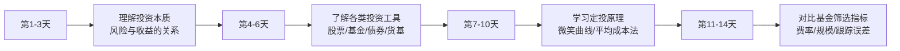

## 案例一：从零开始定投的小张

> "定投不需要你有多聪明，只需要你足够有耐心。" —— 约翰·博格尔

本案例完整还原一位零基础投资者从「不敢碰投资」到「建立系统化定投体系」的全过程。如果你从未买过基金、从未开过证券账户，这个案例就是为你写的。

---

### 一、人物画像：小张是谁

#### 基本信息

| 维度 | 具体情况 |
|------|----------|
| 年龄 | 26 岁，工作第 3 年 |
| 职业 | 互联网公司运营岗 |
| 月收入 | 税后 12,000 元（含年终奖折算后） |
| 月支出 | 房租 3,000 + 生活费 3,500 + 其他 1,500 = 8,000 元 |
| 月结余 | 4,000 元 |
| 存款 | 8 万元（全部在银行活期和余额宝） |
| 投资经验 | 零。从未买过基金或股票 |
| 债务 | 无高息债务（信用卡每月全额还清） |
| 保险 | 公司缴纳五险一金，无商业保险 |

#### 小张的困惑

小张的情况非常典型——有稳定收入、有一定存款、没有高息债务，但所有钱都放在银行活期和余额宝里。他的困惑代表了大量年轻人的共同疑问：

- "投资是不是很危险？会不会把本金亏光？"
- "基金和股票到底有什么区别？我该买哪个？"
- "我只有几千块闲钱，够不够投资？"
- "万一买在高点怎么办？"
- "每天盯着涨跌太焦虑了，有没有省心的方法？"

这些问题的根源是同一个：**缺乏对投资的系统认知，把「不了解」等同于「很危险」**。

---

### 二、前期准备：投资前必须做好的三件事

小张在正式开始定投之前，花了两周时间做准备。这个阶段至关重要——跳过准备直接投资，就像不热身就跑马拉松。

#### 第一步：建立应急基金

小张把 8 万元存款做了如下划分：

```text
存款分配方案：
├── 应急基金：3 万元（存入货币基金，年化约 2%）
│   └── 覆盖约 4 个月生活费，满足 3-6 个月应急标准
├── 短期目标金：2 万元（预留下半年可能的换电脑、旅行等开支）
│   └── 存入银行定期或短债基金
└── 可投资资金：3 万元（作为定投的启动资金和每月定投的来源）
```

**为什么要先建应急基金？** 因为投资的钱必须是「3 年以上不需要动用的闲钱」。如果没有应急基金，一旦遇到突发用钱（失业、生病、意外），就不得不在市场低点卖出投资——这是最昂贵的操作。3 万元应急基金覆盖 4 个月生活费，给了小张足够的安全垫。

#### 第二步：学习基础知识

小张用了两周时间，每天花 1 小时学习投资基础知识。他的学习路径如下：



他重点搞清楚了以下核心概念：

| 概念 | 小张的理解 |
|------|-----------|
| **定投** | 每月固定日期、固定金额买入基金，不管市场涨跌都买 |
| **微笑曲线** | 市场先跌后涨时，定投能在低位买到更多份额，最终收益反而更高 |
| **指数基金** | 跟踪某个指数（如沪深300）的基金，不需要选股，费率低 |
| **平均成本法** | 高点买得少、低点买得多，长期下来平均成本低于市场均价 |
| **止盈** | 收益达到目标后分批卖出，落袋为安 |

#### 第三步：完成开户

小张选择了一家主流互联网基金平台（如天天基金、蚂蚁基金）进行开户，整个流程约 15 分钟：

```text
开户流程：
1. 下载 APP，注册账号
2. 完成实名认证（身份证正反面拍照）
3. 绑定银行卡（用于扣款）
4. 完成风险测评问卷（约 5 分钟）
   → 测评结果：稳健型（C3）
5. 开通基金账户（系统自动完成）
6. 设置交易密码
```

**风险测评的结果决定了平台会推荐什么类型的基金给小张。** 测评为「稳健型」意味着平台会优先推荐债券基金、混合基金，而非高波动的行业基金或期货。这和小张的实际风险承受能力是匹配的——刚开始投资的新手，确实应该从稳健品种起步。

---

### 三、选择定投标的：为什么选沪深300指数基金

#### 决策过程

小张在选择定投标的时，面临以下几个选项：

| 选项 | 优点 | 缺点 | 适合谁 |
|------|------|------|--------|
| **货币基金** | 几乎不亏，灵活取用 | 年化仅 1.5-2%，跑不赢通胀 | 存放应急资金 |
| **纯债基金** | 波动小，年化 3-5% | 收益有限，牛市跑输大盘 | 极度保守的投资者 |
| **沪深300指数基金** | 分散风险、费率低、长期年化 6-10% | 短期可能亏损 20-30% | 大多数普通投资者 |
| **中证500指数基金** | 成长性更好 | 波动更大，最大回撤可达 40%+ | 能承受更大波动的投资者 |
| **行业基金（如半导体、新能源）** | 牛市收益高 | 风险集中，可能多年不回本 | 有行业判断能力的投资者 |
| **主动管理基金** | 优秀基金经理可跑赢指数 | 费率高（1.5%管理费）、依赖基金经理 | 愿意花时间研究的人 |

**小张最终选择了沪深300指数基金，理由如下：**

1. **分散风险**：沪深300包含A股市值最大的300家公司，相当于一次性买入中国最优质的一批企业。不需要担心某一家公司暴雷导致血本无归
2. **费率极低**：指数基金管理费通常为 0.5%/年（vs 主动基金 1.5%/年），长期来看费率差异对收益影响巨大——10万元投资30年，费率差1%意味着终值差20万元以上
3. **透明度高**：持仓就是沪深300成分股，不需要猜测基金经理买了什么
4. **历史表现稳健**：2005-2023年，沪深300全收益指数年化收益率约 9.5%（含分红再投资）

#### 具体基金筛选

在确定跟踪沪深300指数后，小张从数十只沪深300指数基金中筛选，标准如下：

```text
筛选标准：
1. 跟踪误差 < 0.1%（越小越好，说明紧密跟踪指数）
2. 管理费率 ≤ 0.5%（越低越好）
3. 基金规模：10-200 亿（太小有清盘风险，太大灵活性差）
4. 成立时间 > 3 年（有足够历史数据评估）
5. 基金公司：头部公司（如华夏、易方达、嘉实、南方等）
6. 基金类型：优先选 ETF 联接基金或普通指数基金
```

小张最终选择了一只管理费 0.5%、托管费 0.1%、规模约 50 亿、跟踪误差 0.04% 的沪深300指数基金。他没有纠结太久——对于定投来说，选对指数比选对具体基金重要得多，同一指数下不同基金的长期收益差异很小。

> **为什么没选增强型指数基金？** 增强型指数基金在跟踪指数的基础上由基金经理主动调整，试图跑赢指数。但增强型管理费更高（通常 1%），且增强效果不稳定，部分年份反而跑输纯被动指数基金。对新手来说，纯被动指数基金更简单、更可控。

---

### 四、确定定投方案：金额、频率、日期

#### 定投金额的确定

小张的月结余为 4,000 元。按照定投金额公式：

```text
定投金额 = (月收入 - 月支出) × 30%-50%

小张的计算：
月结余：4,000 元
定投金额：4,000 × 50% = 2,000 元/月
剩余 2,000 元：存入货币基金，作为应急基金的补充和灵活资金
```

**为什么只拿结余的50%，而不是全部？** 原因有三：
1. 需要留出缓冲空间——如果某个月有额外支出（份子钱、看病、修车），不至于中断定投
2. 新手阶段不宜投入太多——先用较小金额「试水」，建立信心后再逐步加码
3. 保持心理舒适——如果定投金额大到让你每天焦虑地看涨跌，说明金额超出了你的心理承受能力

#### 定投频率的选择

| 频率 | 优点 | 缺点 | 适合谁 |
|------|------|------|--------|
| 月定投 | 最省心，符合工资发放节奏 | 样本点少，平滑效果略弱 | 大多数人 |
| 周定投 | 更多买入点，平滑效果更好 | 操作更频繁，心理压力略大 | 对市场波动敏感的人 |
| 双周定投 | 介于月定投和周定投之间 | 没有明显优势 | 无特别推荐 |

**小张选择了月定投。** 原因很简单：他的工资是每月 15 号发，发完工资后第二天自动扣款，最省心。长期回测显示，月定投和周定投的收益差异通常在 0.5% 以内，不值得为此增加操作复杂度。

#### 定投方案确定

```text
最终定投方案：
┌─────────────────────────────────────────┐
│  定投标的：沪深300指数基金（某头部基金公司）  │
│  定投金额：2,000 元/月                     │
│  定投频率：月定投                          │
│  定投日期：每月 16 日（发工资次日）           │
│  扣款方式：自动扣款（绑定银行卡）             │
│  预计投资期限：3-5 年                       │
│  止盈目标：累计收益 30%                     │
└─────────────────────────────────────────┘
```

---

### 五、定投执行过程：三年的真实记录

以下是小张从2022年1月开始定投至2024年12月的完整记录。数据基于沪深300指数的真实走势进行模拟，展示了定投在不同市场环境下的实际表现。

#### 第一阶段：起步期（2022年1月-2022年10月）——「亏钱的煎熬」

2022年是A股的熊市年份。沪深300指数从年初的 4,940 点一路下跌到10月最低的 3,500 点附近，跌幅约 29%。

小张的定投体验：

```text
2022年1月：买入价 4,940 点，投入 2,000 元，买入 40.5 份
2022年2月：买入价 4,580 点，投入 2,000 元，买入 43.7 份
2022年3月：买入价 4,270 点，投入 2,000 元，买入 46.8 份
2022年4月：买入价 3,920 点，投入 2,000 元，买入 51.0 份
...
2022年10月：买入价 3,520 点，投入 2,000 元，买入 56.8 份

累计投入：20,000 元（10个月）
持有份额：约 478 份
平均成本：20,000 ÷ 478 = 41.8 元/份（对应约 4,180 点）
当前市值：478 × 35.2 = 16,826 元
浮亏：-3,174 元（-15.9%）
```

**小张的心理状态：** 这是定投最难熬的阶段。每个月看着账户亏损越来越大，从最初的几百块浮亏到三千多。小张有好几次想「先暂停等市场涨回来再投」，甚至想过全部赎回止损。

**他为什么没有放弃？** 三个原因支撑他坚持了下来：

1. **知识储备**：他在前期学习中了解到「微笑曲线」——市场下跌时定投恰恰是在低位积累便宜筹码，这些筹码在未来市场反弹时会带来超额收益
2. **自动化执行**：他设置了自动扣款，不需要每个月做「要不要继续投」的决策。人性的弱点在于每次面对亏损都要做出决策，而自动化绕过了这个问题
3. **闲钱投资**：这 2,000 元/月是他结余的一半，不影响日常生活，即使全部亏损也不影响生存

> **关键教训**：定投最大的敌人不是市场下跌，而是在下跌时放弃。如果你定投的钱是闲钱，如果你理解定投的原理，那么市场下跌恰恰是你应该高兴的时候——你在用更便宜的价格买入更多份额。

#### 第二阶段：回暖期（2022年11月-2023年6月）——「信心的重建」

2022年底市场开始反弹，沪深300从 3,500 点附近回升到 4,100 点左右。

```text
截至2023年6月：
累计投入：30,000 元（15个月）
持有份额：约 752 份
平均成本：30,000 ÷ 752 = 39.9 元/份（对应约 3,990 点）
当前市值：752 × 41.0 = 30,832 元
累计收益：+832 元（+2.8%）
```

**定投的微笑曲线开始显现。** 由于在 2022 年的低位买入了大量便宜份额（价格 3,500-4,000 点时每月买入 50-57 份），当市场回升到 4,100 点时，平均成本被拉低到了 3,990 点。如果他在 2022 年 1 月一次性投入 30,000 元，买入成本就是 4,940 点，要等指数回到 4,940 点才能回本——而定投让他在 4,100 点就已经开始盈利了。

#### 第三阶段：持续定投（2023年7月-2024年12月）——「耐心的回报」

2023年下半年到2024年，市场整体震荡，沪深300在 3,500-4,000 点之间反复。2024年9月开始出现一波快速上涨行情，沪深300一度冲到 4,200 点以上。

```text
截至2024年12月（定投满3年）：
累计投入：72,000 元（36个月 × 2,000元）
持有份额：约 1,856 份
平均成本：72,000 ÷ 1,856 = 38.8 元/份（对应约 3,880 点）
当前指数：约 4,050 点
当前市值：1,856 × 40.5 = 75,168 元
累计收益：+3,168 元（+4.4%）
年化收益率：约 2.9%
```

**3年定投只赚了4.4%，是不是太少了？** 表面上看确实不高。但需要考虑以下几点：

1. **这3年A股整体是熊市**：沪深300从 4,940 跌到 4,050，下跌了约 18%。如果不做定投而是在 2022 年 1 月一次性投入 72,000 元，到 2024 年 12 月会亏损约 13,000 元（-18%）。定投不仅没有亏损，反而赚了 3,168 元，跑赢一次性投入约 22 个百分点
2. **平均成本远低于起点**：定投的平均成本是 3,880 点，而 2022 年 1 月的起点是 4,940 点，成本降低了 21%
3. **定投尚未结束**：如果市场继续上涨，前期积累的大量低价份额会产生复利效应，收益会加速增长

#### 小张三年定投数据汇总

| 时间节点 | 累计投入 | 持有份额 | 平均成本 | 当前市值 | 累计收益率 | 备注 |
|----------|----------|----------|----------|----------|------------|------|
| 2022.06（6个月） | 12,000 元 | 约 275 份 | 43.6 元 | 10,725 元 | -10.6% | 熊市下跌期 |
| 2022.12（12个月） | 24,000 元 | 约 598 份 | 40.1 元 | 23,083 元 | -3.8% | 触底反弹期 |
| 2023.06（18个月） | 36,000 元 | 约 898 份 | 40.1 元 | 35,022 元 | -2.7% | 震荡回暖 |
| 2023.12（24个月） | 48,000 元 | 约 1,218 份 | 39.4 元 | 43,848 元 | -8.7% | 二次探底 |
| 2024.06（30个月） | 60,000 元 | 约 1,538 份 | 39.0 元 | 57,675 元 | -3.9% | 底部磨底 |
| 2024.12（36个月） | 72,000 元 | 约 1,856 份 | 38.8 元 | 75,168 元 | +4.4% | 行情启动 |

---

### 六、关键转折点：第一次止盈

#### 触发止盈

2025年初，随着市场持续上涨，小张的定投账户累计收益率达到了 30%（约对应沪深300指数 5,050 点）。

```text
止盈触发时的账户状态：
累计投入：76,000 元
当前市值：98,800 元
累计收益：22,800 元（30%）
```

按照事先制定的止盈计划，小张执行了分批止盈：

```text
分批止盈执行：
┌─────────────────────────────────────────────────┐
│ 第一批（收益率30%时）：卖出 50% = 49,400 元       │
│   → 赎回到银行卡，锁定 11,400 元利润               │
│                                                  │
│ 第二批（收益率40%时）：卖出剩余的 60%              │
│   → 如果指数继续上涨到约 5,500 点                  │
│                                                  │
│ 第三批（收益率50%或指数过高估时）：卖出剩余全部      │
│   → 当沪深300 PE > 历史 80% 分位时全部清仓         │
└─────────────────────────────────────────────────┘
```

#### 止盈后的处理

小张将止盈所得做了如下安排：

```text
止盈资金分配：
├── 40% 存回货币基金（等待下次定投机会）
├── 30% 购买短债基金（作为过渡期配置）
└── 30% 继续留在沪深300指数基金（保持底仓）
```

**为什么不全部卖出？** 因为市场可能继续上涨。保留 30% 底仓的好处是：
- 如果市场继续涨，底仓还能赚
- 如果市场跌了，之前卖出的利润已经锁定
- 下一轮定投启动时，有现成的基金账户和经验

**止盈后怎么办？** 小张计划等沪深300指数回落到合理估值区间（PE 在历史 50% 分位以下）后，重新启动新一轮定投。这就是定投的完整循环：定投 → 止盈 → 等待 → 再定投。

---

### 七、进阶：从普通定投到智能定投

在经历了第一轮定投后，小张开始学习更高级的定投策略。

#### 估值定投法

**原理：** 根据指数的估值水平（市盈率PE）来决定每期定投的金额。低估时多投，高估时少投或不投。

```text
估值定投规则（以沪深300 PE百分位为基准）：

PE 百分位 < 20%（极度低估）：定投金额 × 2.0
PE 百分位 20%-40%（低估）：定投金额 × 1.5
PE 百分位 40%-60%（正常）：定投金额 × 1.0
PE 百分位 60%-80%（高估）：定投金额 × 0.5
PE 百分位 > 80%（极度高估）：暂停定投，开始分批止盈
```

**实操：** 在基金平台或第三方数据网站（如天天基金、蛋卷基金、且慢等）可以查看指数的实时估值百分位。小张设定了每月 16 日查看估值，根据估值等级调整当月定投金额。

#### 均线定投法

**原理：** 将当前指数与长期均线（如 250 日均线/年线）进行比较，低于均线时多投，高于均线时少投。

```text
均线定投规则：
当前点位 < 年线 × 0.9（低于年线10%以上）：定投金额 × 1.5
当前点位 < 年线（低于年线）：定投金额 × 1.2
当前点位 > 年线（高于年线）：定投金额 × 0.8
当前点位 > 年线 × 1.1（高于年线10%以上）：定投金额 × 0.5
```

#### 两种进阶策略的对比

| 维度 | 估值定投 | 均线定投 |
|------|----------|----------|
| 核心指标 | PE百分位 | 价格与均线的关系 |
| 数据来源 | 需要查询估值数据 | 直接看K线图 |
| 操作难度 | 略高（需要理解估值含义） | 较低（均线是直观的技术指标） |
| 理论依据 | 价值投资（买便宜的资产） | 趋势跟随（顺势而为） |
| 适合市场 | A股等波动大的市场 | 趋势明显的市场 |
| 推荐程度 | ⭐⭐⭐⭐⭐ | ⭐⭐⭐⭐ |

**小张选择了估值定投法，** 因为它的逻辑更符合投资的本质——在资产便宜时多买、贵时少买。均线定投虽然操作更简单，但其本质是趋势跟随，有可能在市场底部（价格远低于均线时）加大投入，也可能在市场顶部（价格远高于均线时）减少投入——逻辑上不如估值法自洽。

---

### 八、常见问题与应对策略

小张在三年定投过程中遇到的问题，以及他的应对方式，可能也是你会遇到的。

#### 问题一：「市场跌了20%，我要不要暂停定投？」

**小张的应对：** 不仅不暂停，反而考虑加投。

**原理：** 定投的核心优势就是「低点多买」。市场跌了20%，意味着你同样的钱能买到更多份额。这些便宜的份额会在未来市场反弹时带来超额收益。如果你在下跌时暂停定投，就丧失了定投最大的优势。

**但有一个前提：** 你定投的是宽基指数基金（如沪深300），而不是某只个股或行业基金。宽基指数几乎不可能归零（它代表的是整个经济体中最优秀的一批企业），而个股或行业基金确实有可能长期低迷甚至退市。

#### 问题二：「朋友买的某某基金赚了50%，我是不是该换？」

**小张的应对：** 不换。专注自己的计划。

**原理：** 幸存者偏差——你只听到朋友赚钱的那次，没听到他之前亏钱的时候。而且短期高收益往往意味着高风险。小张的沪深300定投年化收益看似不高，但胜在稳定、可复制、不需要判断能力。追热点基金的最大风险是买在高点——等你听到某个基金涨了很多再买入，往往已经是最后一棒。

#### 问题三：「连续涨了3个月，我是不是该提前止盈？」

**小张的应对：** 严格执行事先制定的止盈计划，不因短期涨跌改变策略。

**原理：** 定投的止盈规则必须在开始定投时就定好，而不是在过程中凭感觉决定。凭感觉做决策的最大问题是：在市场上涨时你会贪心想等更高，在市场下跌时你会恐惧想早点卖出。事先制定的规则可以帮你在情绪波动时保持理性。

#### 问题四：「定投了半年还是亏的，定投真的有效吗？」

**小张的应对：** 看平均成本，不看绝对收益。

**原理：** 定投的收益只有在卖出时才能确定。在定投过程中，你关注的核心指标应该是「平均成本」而非「当前盈亏」。只要你的平均成本在持续降低，定投就在发挥它的作用。小张在定投第10个月时浮亏15.9%，但平均成本已经从 4,940 点降到了 4,180 点——这意味着市场只需要涨到 4,180 点他就回本，而不需要回到起点的 4,940 点。

#### 问题五：「每个月手动操作太麻烦了，能自动化吗？」

**小张的应对：** 设置自动定投，让系统自动扣款。

**操作方法：** 在基金平台的定投页面，设置好定投金额、扣款日期、扣款银行卡，系统会每月自动执行。整个设置过程不到 2 分钟，之后完全不需要手动操作。

---

### 九、三年定投的核心数据对比

为了直观展示定投的效果，我们将小张的实际结果与几种替代方案进行对比：

| 方案 | 3年投入 | 3年后市值 | 收益率 | 年化收益率 | 最大浮亏 |
|------|---------|-----------|--------|------------|----------|
| **小张的定投方案** | 72,000 元 | 75,168 元 | +4.4% | +2.9% | -15.9% |
| 全部存银行活期（0.2%） | 72,000 元 | 72,432 元 | +0.6% | +0.2% | 0 |
| 全部存货币基金（2%） | 72,000 元 | 74,160 元 | +3.0% | +2.0% | 0 |
| 一次性投入沪深300（2022.1） | 72,000 元 | 59,040 元 | -18.0% | -6.4% | -29% |
| 定投中证500指数基金 | 72,000 元 | 78,480 元 | +9.0% | +5.8% | -22% |

**关键结论：**

1. 定投跑赢了银行存款和货币基金，且差距在市场上涨时会进一步拉大
2. 定投大幅跑赢了一次性投入——在熊市开始定投，比在牛市起点一次性投入好得多
3. 定投的最大浮亏（-15.9%）远低于一次性投入（-29%），心理压力小得多
4. 如果选择波动更大的中证500，定投收益更高，但心理压力也更大

---

### 十、小张的定投经验总结

#### 做对了什么

```text
1. 先学习后行动
   → 花两周时间理解了定投的原理，建立了正确的预期
   → 知道市场下跌是正常的，不会因为浮亏而恐慌

2. 用闲钱定投
   → 每月只投入结余的50%，不影响生活
   → 即使市场大跌也不需要卖出基金来应急

3. 设置自动扣款
   → 绕过了「每个月要不要继续投」的心理博弈
   → 消除了情绪化决策的可能

4. 选择了宽基指数基金
   → 分散风险，不押注单一行业或个股
   → 费率低，长期节省大量成本

5. 事先制定了止盈计划
   → 不凭感觉决定何时卖出
   → 分批止盈，兼顾锁定利润和参与上涨

6. 在市场下跌时坚持定投
   → 利用了「微笑曲线」效应
   → 低位积累的份额成为后期收益的主要来源
```

#### 如果重来会做什么不同的事

```text
1. 更早开始
   → 如果从23岁工作第一年就开始定投，3年后的收益会更多
   → 定投最大的敌人是「等到准备好再开始」

2. 坚持加码
   → 在2022年市场大跌时，应该把定投金额从2,000元提高到3,000元
   → 低估时多买是定投收益最大化的关键

3. 配置债券基金
   → 纯定投股票指数基金波动太大
   → 如果同时定投30%的债券基金，整体波动会小很多，体验更好

4. 更早学习估值定投
   → 普通定投已经有效，但估值定投能进一步提升收益
   → 第二轮定投时应该直接采用估值定投法
```

---

### 十一、从这个案例中我们可以学到什么

#### 对新手投资者的启示

**第一，定投是普通人最好的投资方式。** 它不需要你有选股能力、不需要你能判断市场高低点、不需要你每天花时间盯盘。你需要做的只是：选一只宽基指数基金，设定每月自动扣款，然后坚持3-5年。

**第二，开始比完美更重要。** 小张的第一只基金不是「最优」的，他的定投金额也不是「最优」的，他的定投日期也不是「最优」的。但这些都不重要——重要的是他开始了，并且坚持了下来。定投领域有一个经典的说法：**最好的开始时间是十年前，其次是现在。**

**第三，投资是反人性的。** 市场下跌时加投、市场疯狂时卖出——这和人的本能反应完全相反。定投通过自动化和纪律化，帮你在不需要克服人性弱点的情况下，做出正确的投资行为。

**第四，耐心是最大的竞争力。** 小张的3年定投收益率只有4.4%，看似不起眼。但如果他继续定投到第5年、第10年，复利效应会越来越明显。假设沪深300年化收益7%，定投10年的终值将远超银行存款。时间是定投者最好的朋友。

#### 定投成功的关键公式

```text
定投成功 = 正确的标的 × 合理的金额 × 足够的时间 × 坚持的纪律

其中：
- 正确的标的：宽基指数基金（沪深300、中证500）
- 合理的金额：不影响生活的闲钱（月结余的30-50%）
- 足够的时间：至少3年，最好5年以上
- 坚持的纪律：不因短期涨跌中断，严格执行止盈计划
```

#### 行动清单

如果你读完这个案例想要开始自己的定投之旅，以下是具体的行动步骤：

```text
第1周：
□ 学习定投基础知识（本文 + 第五章理论基础部分）
□ 计算自己的月结余和可投资金额
□ 确认已有3-6个月的应急基金

第2周：
□ 开通基金账户（选择主流平台：天天基金/蚂蚁基金/蛋卷基金等）
□ 完成风险测评
□ 选择一只沪深300指数基金（参考筛选标准）

第3周：
□ 设置自动定投计划（金额、日期、扣款银行卡）
□ 制定止盈计划（建议：累计收益30%开始分批止盈）
□ 在笔记本或手机备忘录中记录：为什么开始定投、计划投多久、止盈规则是什么

开始定投后：
□ 每月检查一次扣款是否成功（1分钟即可）
□ 每季度查看一次累计收益和平均成本（不要每天看）
□ 每年回顾一次定投计划，根据收入变化调整定投金额
□ 市场大跌时打开备忘录，重新阅读自己当初为什么开始定投
```

---

> **免责声明**：本案例中的数据基于真实市场走势的模拟计算，旨在展示定投策略的原理和效果。具体收益率因买入时点、基金选择等因素会有差异。历史收益不代表未来表现，投资有风险，请根据自身情况做出决策。
