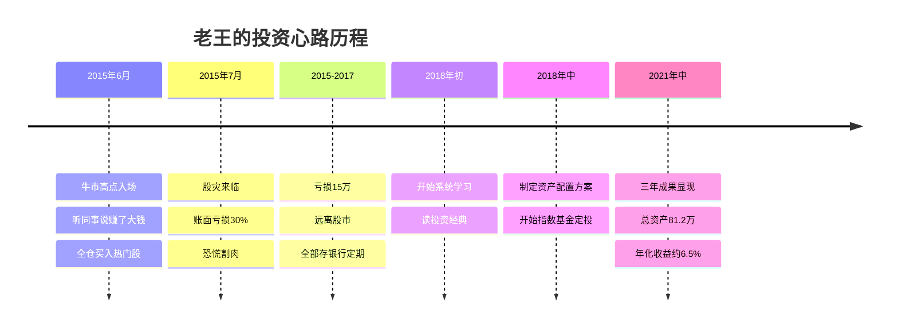
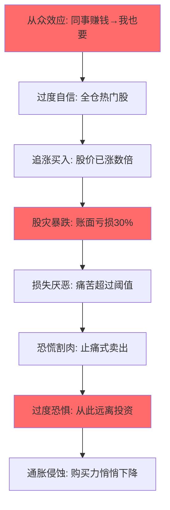
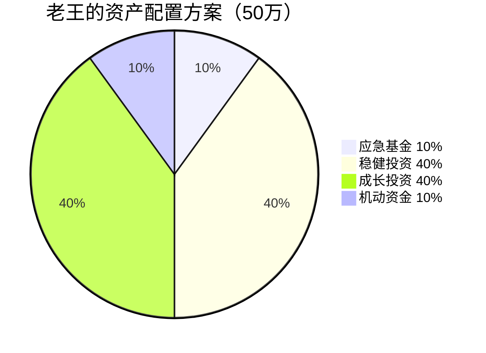

## 案例二：从追涨杀跌到稳健投资的老王

### 案例概述

老王的故事是中国股市散户的典型缩影——在牛市高点入场、在熊市低点割肉、在恐惧中远离市场、在学习后重新出发。这个案例的价值不仅在于展示"怎么做"，更在于剖析"为什么会犯错"以及"如何系统性地纠正"。



---

### 第一部分：背景与问题全景

#### 老王的基本画像

| 维度 | 详情 |
|------|------|
| 年龄 | 40岁，公司中层管理 |
| 年收入 | 约25万（税后） |
| 家庭状况 | 已婚，一个孩子上小学 |
| 可投资资产 | 50万存款 |
| 投资经验 | 仅2015年一次失败经历 |
| 风险承受能力 | 中等偏低（被亏损经历压低） |
| 投资目标 | 跑赢通胀，为退休做准备 |

#### 2015年的惨痛经历还原

**入场时机**：2015年6月初，上证指数在5000点附近。老王的同事在办公室里炫耀自己的股票账户——"三个月翻了一倍"。在从众心理和FOMO（错失恐惧）的双重驱动下，老王开了证券账户，把多年积蓄50万全部投入股市。

**买入决策**：没有任何研究，完全听同事推荐。买入了三只当时最热门的股票——某互联网概念股、某军工股、某创业板小盘股。这些股票有一个共同特征：前期已经涨了2-3倍，市盈率都在80倍以上。

**股灾经过**：2015年6月15日，A股开始暴跌。短短三周内，上证指数从5178点跌至3507点，跌幅超过32%。老王的持仓更惨——创业板个股普遍跌幅50%以上。

**割肉决策**：当亏损达到30%时（账面亏损15万），老王彻夜难眠。妻子的埋怨、同事的沉默、每天打开账户看到又少了几万的心理折磨，最终让他在7月初"割肉出局"。卖出时，他的账户只剩下35万。

**创伤后遗症**：从此老王把剩余的35万（加上后来攒的钱又到50万）全部放在银行三年期定期存款，利率约2.75%。他的信念是："股市就是赌场，我再也不会碰了。"

#### 行为金融学视角的深度诊断

老王的遭遇不是个例，而是散户典型的行为模式。从行为金融学角度看，他犯了以下系统性错误：

**1. 从众效应（Herd Behavior）**

当周围人都在赚钱时，个体很难保持独立判断。2015年牛市期间，A股新开户数单月超过千万，很多从来不关心股市的人被"赚钱效应"吸引入场。老王看到同事赚钱后入场，本质上是把"别人赚钱"当成了"我也会赚钱"的证据——这在逻辑上是不成立的。

从众效应的神经科学基础：当人看到群体行为时，大脑的尾状核（caudate nucleus）会被激活，产生"跟随群体"的冲动。这种进化遗留的心理机制在原始社会帮助人类生存，但在金融市场中往往是灾难性的。

**2. 追涨杀跌的动量偏差（Momentum Bias）**

老王买入时股票已经涨了数倍，卖出时又是在大跌之后。这不是巧合，而是人类的"趋势外推"心理——我们倾向于认为当前的趋势会持续。涨的时候觉得"还会继续涨"，跌的时候觉得"还会继续跌"。

学术研究表明，动量策略在短期内可能有效（3-12个月），但散户的追涨杀跌往往是滞后的——他们通常在趋势的尾声才入场，在反转前夜才出场。这等于"反向的动量策略"——买在高点，卖在低点。

**3. 损失厌恶（Loss Aversion）**

诺贝尔经济学奖得主卡尼曼（Kahneman）和特沃斯基（Tversky）的前景理论指出：人对损失的痛苦感受大约是同等收益快乐感的2.5倍。这意味着：

- 赚10万带来的快乐 = X
- 亏10万带来的痛苦 = 2.5X

老王在亏损30%时选择割肉，不是因为他理性判断还会跌，而是因为"每天看到亏损"的心理痛苦已经超过了他能承受的阈值。这种"止痛式卖出"是散户最常见的错误之一。

**4. 禀赋效应与心理账户（Endowment Effect & Mental Accounting）**

割肉后，老王把"亏掉的15万"放在了一个特殊的"心理账户"里。每次想到投资，这个心理账户就会被激活，产生强烈的负面情绪。这种情绪让他把"不投资"等同于"安全"——但事实上，持有现金同样有风险（购买力被通胀侵蚀）。

**5. 过度自信与归因偏差**

入场时，老王过度自信——"同事能赚，我也能"。割肉后，他又走向另一个极端——过度恐惧。两种极端都不是理性判断，而是情绪驱动的归因：赚钱时归因于自己的判断力，亏钱时归因于市场的不公平。



---

### 第二部分：转变过程——从零开始重建投资体系

#### 第一步：系统学习（3个月）

老王意识到自己之前的失败根本原因是"无知"。他决定先学习再投资。以下是他的学习路径和推荐书单：

**第一个月：建立基础认知**

| 书名 | 作者 | 核心收获 |
|------|------|----------|
| 《漫步华尔街》 | 伯顿·马尔基尔 | 市场有效性的基本概念，指数基金的逻辑 |
| 《聪明的投资者》 | 本杰明·格雷厄姆 | 投资与投机的区别，安全边际的概念 |

这两本书帮老王建立了最基本的认知框架：**市场短期不可预测，长期来看优质资产会增值，普通人最好的策略是低成本的指数基金定投。**

**第二个月：理解资产配置**

| 书名 | 作者 | 核心收获 |
|------|------|----------|
| 《有效资产管理》 | 威廉·伯恩斯坦 | 资产配置决定了90%以上的收益差异 |
| 《共同基金常识》 | 约翰·博格 | 低成本指数基金的优势，费用率对长期收益的巨大影响 |

**第三个月：学习投资心理学**

| 书名 | 作者 | 核心收获 |
|------|------|----------|
| 《思考，快与慢》 | 丹尼尔·卡尼曼 | 认知偏差的系统性梳理 |

老王在学习过程中做了一个关键的事：**用笔记本记录每个核心概念，并写下"如果当时我知道这个，我会怎么做"。** 这种反思性学习让他把书本知识和自己的惨痛经历建立了连接，大大加深了理解。

#### 第二步：制定资产配置方案

学习完成后，老王开始制定自己的资产配置方案。他的核心原则是：

1. **永远留够应急资金**：不再把所有钱都投入市场
2. **分散配置**：不同资产类别、不同风险等级
3. **可执行性**：方案必须简单到能坚持执行
4. **匹配自身风险承受能力**：考虑到自己的心理创伤，初期偏保守

**老王的资产配置方案（初始50万）：**



| 类别 | 占比 | 金额 | 具体配置 | 选择理由 |
|------|------|------|----------|----------|
| 应急基金 | 10% | 5万 | 天弘余额宝/微信零钱通 | 流动性第一，随取随用，年化约2% |
| 稳健投资 | 40% | 20万 | 债券基金10万 + 银行理财10万 | 波动小，收益稳定，心理安全感来源 |
| 成长投资 | 40% | 20万 | 沪深300指数基金10万 + 中证500指数基金10万 | 长期增值的核心引擎 |
| 机动资金 | 10% | 5万 | 货币基金暂存 | 等待极端行情时加仓的机会资金 |

**配置逻辑详解：**

**为什么应急基金占10%？**

应急基金的功能是"让你不会被迫卖出投资"。常见的建议是3-6个月的生活开支。老王家庭月开支约1.2万，6个月就是7.2万。考虑到他有房贷，5万作为应急基金偏少，但他的工资收入稳定，且配偶也有收入，所以5万是底线水平。放在货币基金里，虽然收益低（约2%），但随时可用，这是最重要的。

**为什么稳健投资占40%？**

这是老王心理修复的关键。在经历亏损后，他需要一个"安全垫"来重建信心。40%放在低波动资产上，即使股票市场大跌，他的整体组合也不会出现2015年那样的剧烈波动。债券基金选择的是纯债基金（不投股票），年化收益约3-5%，最大回撤通常在3%以内。银行理财选择的是R2级别（稳健型），年化收益约3.5-4.5%。

**为什么成长投资选择指数基金而非个股？**

这是老王从2015年教训中得出的最重要结论。个股的风险远高于指数——你可能买到下一个乐视，也可能买到下一个茅台。对于非专业投资者来说，指数基金是最优解：

| 对比维度 | 个股投资 | 指数基金 |
|----------|----------|----------|
| 选股难度 | 需要财务分析、行业研究 | 只需选择指数 |
| 个股风险 | 可能归零 | 分散在数百只股票中 |
| 管理费 | 交易佣金（约万2.5） | 管理费约0.5%/年 |
| 时间投入 | 需要持续跟踪 | 几乎不需要 |
| 适合人群 | 专业投资者 | 所有人 |

**为什么选沪深300+中证500的组合？**

- **沪深300**：A股市值最大的300只股票，代表大盘蓝筹，年化收益约8-10%（长期）
- **中证500**：A股市值排名301-800的500只股票，代表中小盘成长，年化收益约10-12%（长期）
- 两者相关性约0.7，组合在一起可以进一步分散风险

**基金选择的具体标准：**

| 筛选条件 | 要求 | 原因 |
|----------|------|------|
| 基金规模 | 10亿以上 | 规模太小有清盘风险 |
| 跟踪误差 | 越小越好 | 越接近指数表现 |
| 管理费 | 低于0.5% | 长期复利下费用差异巨大 |
| 成立年限 | 3年以上 | 有足够历史数据评估 |
| 基金公司 | 头部公司 | 华夏、易方达、南方等 |

#### 第三步：开始定投

**定投计划：**

| 项目 | 金额 | 频率 | 平台 | 备注 |
|------|------|------|------|------|
| 沪深300指数基金 | 3000元/月 | 每月15日自动扣款 | 支付宝/天天基金 | 工资到账后第二天 |
| 中证500指数基金 | 2000元/月 | 每月15日自动扣款 | 支付宝/天天基金 | 工资到账后第二天 |
| **合计** | **5000元/月** | — | — | 约占月收入20% |

**为什么选择每月15日定投？**

选择月中而非月初，是因为月初往往有各种账单（房贷、信用卡），月中扣款可以确保账户余额充足。设定自动扣款的原因是：手动操作会给自己"犹豫的机会"，而犹豫往往意味着"这次不投了"——定投纪律就是这样被破坏的。

**定投的数学逻辑：**

定投的核心优势是"平均成本法"。市场上涨时买的份额少，下跌时买的份额多，长期下来平均成本低于市场均价。

以简化示例说明：

| 月份 | 基金净值 | 投入金额 | 买入份额 |
|------|----------|----------|----------|
| 第1月 | 1.00元 | 3000元 | 3000份 |
| 第2月 | 0.80元 | 3000元 | 3750份 |
| 第3月 | 0.70元 | 3000元 | 4286份 |
| 第4月 | 0.90元 | 3000元 | 3333份 |
| 第5月 | 1.10元 | 3000元 | 2727份 |
| 第6月 | 1.20元 | 3000元 | 2500份 |
| **合计** | — | **18000元** | **19596份** |

- 平均成本：18000 ÷ 19596 = **0.918元**
- 市场均价：(1.00+0.80+0.70+0.90+1.10+1.20) ÷ 6 = **0.95元**
- 定投节省：(0.95 - 0.918) / 0.95 = **3.4%**

这意味着即使市场最终回到原点（1.00元），定投也能赚钱：19596 × 1.00 - 18000 = **1596元**，收益率约8.9%。这就是定投"下跌也是好事"的反直觉逻辑。

#### 第四步：建立投资纪律体系

这是老王转变中最关键的一步。投资知识可以学，资产配置可以制定，但如果没有纪律来克服人性弱点，一切都会功亏一篑。

**老王的投资纪律手册：**

```text
┌─────────────────────────────────────────────────────┐
│              老王的投资纪律（贴在书桌前）              │
├─────────────────────────────────────────────────────┤
│                                                     │
│  1. 每月15日自动定投，不得中断                        │
│  2. 不看盘，每月最后一天查看一次账户                   │
│  3. 不听任何"内幕消息""朋友推荐"                     │
│  4. 市场大跌超过20%：用机动资金加仓，绝不止损          │
│  5. 市场大涨超过50%：不加仓，维持原定投金额            │
│  6. 每年1月做一次再平衡，偏离超过5%才调整              │
│  7. 定投金额随收入增长同步提升，但不超过月收入30%       │
│  8. 任何投资决策必须写下理由，24小时后再执行           │
│  9. 如果想卖出，先问自己：买入的理由还成立吗？         │
│ 10. 永远不借钱投资，永远不用急用的钱投资               │
│                                                     │
└─────────────────────────────────────────────────────┘
```

**每条纪律的深层逻辑：**

**纪律1（自动定投不中断）**：定投最大的敌人是"这次市场不好，我先停一个月"。事实上，市场不好的时候恰恰是定投价值最大的时候——你能用同样的钱买到更多份额。自动扣款消灭了决策环节。

**纪律2（不看盘）**：行为金融学研究表明，查看账户频率越高，做出冲动决策的概率越大。每日查看的投资者比每年查看的投资者收益率低约1-2个百分点——因为看到亏损会触发"损失厌恶"，导致非理性卖出。

**纪律3（不听消息）**：2015年老王就是听同事推荐入场的。所谓"内幕消息"，要么是假消息，要么是滞后的消息（等传到你耳朵里，市场早已反应完毕），要么是故意散布的误导信息。真正的内幕消息交易是违法的。

**纪律4（大跌加仓）**：这是"逆人性"的操作，但历史数据支持这个策略。以沪深300为例，历史上每次从高点下跌超过30%后，3年内的回报都是正的。机动资金（5万）就是为了抓住这种机会。

**纪律8（写下理由，24小时延迟）**：这个规则专门针对冲动决策。人的冲动情绪通常在24小时后会显著减弱。如果一个投资决策24小时后仍然觉得有道理，那大概率是理性判断而非情绪驱动。

**再平衡的执行方法：**

每年1月，老王会检查各资产类别的占比是否偏离目标。例如：

| 资产类别 | 目标占比 | 年初实际占比 | 偏离 | 操作 |
|----------|----------|--------------|------|------|
| 应急基金 | 10% | 9% | -1% | 不调整（偏离<5%） |
| 稳健投资 | 40% | 38% | -2% | 不调整 |
| 成长投资 | 40% | 47% | +7% | 卖出7%转入稳健 |
| 机动资金 | 10% | 6% | -4% | 不调整 |

如果成长投资涨到47%，超出目标7个百分点，老王会卖出部分指数基金（约3.5万），转入债券基金，使比例回到40%。这本质上是"卖高买低"的纪律化执行。

---

### 第三部分：三年后的结果与复盘

#### 收益明细

```text
初始投入：          50万
三年定投累计：      18万（5000元/月 × 36个月）
总投入本金：        68万

三年后各资产市值：
┌─────────────────┬──────────┬──────────┬──────────┐
│ 资产类别         │ 初始金额  │ 最终市值  │ 收益率    │
├─────────────────┼──────────┼──────────┼──────────┤
│ 应急基金（货币） │ 5.0万    │ 5.2万    │ 4.0%     │
│ 债券基金         │ 10.0万   │ 11.8万   │ 18.0%    │
│ 银行理财         │ 10.0万   │ 11.0万   │ 10.0%    │
│ 沪深300指数基金  │ 10.0万   │ 19.5万   │ 95.0%    │
│ 中证500指数基金  │ 10.0万   │ 18.5万   │ 85.0%    │
│ 机动资金（货币） │ 5.0万    │ 5.2万    │ 4.0%     │
├─────────────────┼──────────┼──────────┼──────────┤
│ 合计             │ 50.0万   │ 81.2万   │ —        │
└─────────────────┴──────────┴──────────┴──────────┘

总收益：           81.2 - 68 = 13.2万
整体年化收益率：   约6.5%
指数基金部分年化： 约22%（受益于2019-2021牛市）
```

#### 与替代方案的对比

**如果老王没有转变，继续存银行定期：**

| 方案 | 三年后本金 | 三年后市值 | 收益 |
|------|-----------|-----------|------|
| 银行定期（2.75%） | 68万 | 73.7万 | 5.7万 |
| 实际方案（资产配置） | 68万 | 81.2万 | 13.2万 |
| **差额** | — | **+7.5万** | **+7.5万** |

多出的7.5万，就是"学习投资知识"的直接回报。

**如果老王2015年没有割肉，一直持有到2018年：**

假设他持有的三只股票平均表现与创业板指数相当（2015年6月至2018年6月，创业板从4000点跌至1600点，跌幅60%）：

- 50万 × (1 - 60%) = 20万（亏损30万）
- 但到2021年中，创业板回到3300点，回升约106%：20万 × 2.06 = 41.2万
- 仍然亏损8.8万

这说明：**选错标的（高估值个股）即使长期持有也未必能回本。而指数基金的长期向上趋势远比个股可靠。**

#### 三年中经历的心理考验

**考验一：2018年熊市**

2018年A股单边下跌，沪深300全年下跌25.3%。老王的指数基金账面亏损超过2万。这是他定投的第一年，看到刚投进去的钱就缩水，心理非常难受。

**老王的应对**：翻开笔记本，重新看自己写的"定投的数学逻辑"。他意识到：**下跌正是积累便宜筹码的好时机。** 他不仅没有停止定投，还动用了1万元机动资金加仓。事实证明，2018年底正是三年内的最低点，那些"便宜筹码"后来带来了丰厚回报。

**考验二：2020年3月疫情暴跌**

全球疫情爆发，A股短期暴跌超10%。这一次老王已经有一定经验了，他的反应是：

1. 打开笔记本看纪律手册
2. 确认自己的收入和应急资金没有受到影响
3. 继续自动定投，不动用机动资金（因为跌得不够深，未到加仓阈值）

**考验三：2020-2021年牛市的诱惑**

指数基金大幅上涨后，老王的同事又开始谈论股票——"这次不一样""牛市才刚开始"。老王差点又动心了，想要加大投入甚至借钱投资。

**老王的应对**：纪律手册第10条——"永远不借钱投资"。他按原计划继续定投，不做任何调整。事后证明，2021年之后市场再次回调，那些在高点冲进去的人又一次被套。

---

### 第四部分：经验总结与可复用的方法论

#### 核心经验

**1. 先学习再投资——知识是最好的风险控制**

老王花了3个月学习，换来的是三年13.2万的收益和再也不会犯的错误。这不是成本，而是回报率最高的投资——3个月的时间投入，换来的是未来几十年的投资能力。

知识的价值体现在三个方面：
- **识别风险**：知道什么是真正的风险，什么是暂时的波动
- **控制情绪**：理解自己的认知偏差，用纪律对抗人性
- **做出正确决策**：知道该买什么、什么时候买、买多少

**2. 资产配置决定90%的收益**

诺贝尔经济学奖得主威廉·夏普（William Sharpe）的研究表明，投资收益的90%以上由资产配置决定，而非选股或择时。老王的案例印证了这一点——他的总收益率6.5%主要来自"40%稳健+40%成长+10%应急+10%机动"的配置框架，而不是因为他选了某只特别好的基金。

**3. 定投是普通人最友好的投资方式**

定投的三大优势：
- **不需要择时**：连专业基金经理都无法持续准确择时
- **强制储蓄**：工资到账自动扣款，避免消费掉
- **心理友好**：下跌时买到更多份额，把坏事变成好事

**4. 投资纪律是超额收益的来源**

市场上大多数人亏钱不是因为不懂，而是因为做不到。知道"低买高卖"的人有10亿，真正能做到的不到1%。纪律手册的价值在于：把投资决策从"即时判断"变成"提前规划"，用规则替代情绪。

**5. 时间是最好的朋友——复利效应**

用72法则计算：年化收益6.5%的情况下，资产翻倍需要约11年。如果老王能保持这个收益率：
- 50岁时（10年后）：资产约155万
- 55岁时（15年后）：资产约220万
- 60岁时（20年后）：资产约310万

复利的力量在后期加速——前10年增值85万，后10年增值155万。**这就是为什么越早开始投资越好。**

#### 常见误区与纠正

| 常见误区 | 错误逻辑 | 正确认知 |
|----------|----------|----------|
| "等跌到底再买" | 我要抄底赚更多 | 没人能准确预测底部，定投自动平滑成本 |
| "亏了就不卖" | 不卖就不算亏 | 要区分：指数基金可以等，垃圾股不能等 |
| "分散就是买很多只基金" | 买10只基金就是分散 | 如果10只都是股票基金，风险并没有分散 |
| "定投收益太低" | 我要找翻倍股 | 定投的6-10%年化是可持续的，翻倍股可遇不可求 |
| "等有钱了再投资" | 现在钱太少投了没用 | 定投100元也可以开始，重要的是开始 |
| "基金分红越多越好" | 分红就是赚到了 | 分红只是把钱从左口袋换到右口袋（净值会下降） |
| "基金经理名气大就好" | 跟着明星经理买 | 主动基金长期跑赢指数的概率不到20% |

#### 给类似处境读者的行动清单

如果你和老王有类似经历（曾经亏损、恐惧投资、资金闲置），以下是具体行动步骤：

**第1周：心理建设**
- [ ] 写下你过去的投资经历，分析每次决策背后的情绪驱动因素
- [ ] 计算你的资金如果继续闲置，10年后被通胀侵蚀多少（假设年通胀3%，100万10年后购买力只相当于74万）
- [ ] 明确你的投资目标：金额、时间、用途

**第2-4周：系统学习**
- [ ] 阅读《漫步华尔街》或《指数基金投资指南》（后者更适合中国市场）
- [ ] 理解三个核心概念：资产配置、指数基金、定投
- [ ] 用纸笔画出你理解的投资知识框架图

**第5周：制定方案**
- [ ] 梳理你的资产和负债，确定可投资金额
- [ ] 根据风险承受能力确定股债比例
- [ ] 选择具体的基金产品（参考上文筛选标准）
- [ ] 写下你的投资纪律手册

**第6周：开始执行**
- [ ] 开设基金账户（支付宝/天天基金/蛋卷基金）
- [ ] 一次性配置好应急基金和稳健投资部分
- [ ] 设定自动定投计划
- [ ] 把投资纪律手册贴在常看到的地方

**每月：维护与复盘**
- [ ] 月末查看一次账户，记录各资产占比
- [ ] 如果偏离目标超过5%，计划再平衡
- [ ] 每季度回顾一次：有没有违反纪律？

**每年：深度复盘**
- [ ] 1月做再平衡
- [ ] 回顾全年：收益如何？哪些纪律执行得好/差？
- [ ] 根据收入变化调整定投金额

---

### 第五部分：进阶思考

#### 如果老王想进一步优化

当老王积累了3-5年经验后，可以考虑以下进阶策略：

**1. 增加海外配置**

A股和美股的相关性约0.3-0.4，加入美股指数基金（如标普500ETF）可以进一步分散单一市场风险。建议比例不超过总资产的20%。

**2. 引入REITs（不动产投资信托基金）**

REITs与股票和债券的相关性较低，可以作为第三类资产加入组合。国内REITs市场还在发展初期，可以关注公募REITs产品。

**3. 学习估值指标辅助定投**

在纯定投的基础上，可以引入"估值定投"——当指数市盈率低于历史均值一个标准差时加倍定投，高于一个标准差时减半定投。这需要对PE、PB等指标有基本了解。

**4. 考虑税务优化**

基金持有超过1年免征个人所得税（目前国内政策）。频繁交易不仅增加成本，还可能产生税务负担。这也是长期持有的额外好处。

#### 投资是一场终身修行

老王的故事有一个容易被忽略的要点：**他最大的收获不是13.2万的收益，而是一套可以使用一辈子的投资体系。** 这套体系包括知识框架、资产配置方法、定投纪律和心理管理能力。

市场永远在波动，人性永远有弱点。但一个经过学习和实践检验的投资体系，能让你在波动中保持冷静，在诱惑前保持理性，在恐惧中保持勇气。

正如巴菲特所说："投资很简单，但并不容易。"简单的是原理，不容易的是执行。老王的案例证明：普通人通过学习和纪律，完全可以在资本市场上获得稳健的长期回报。
