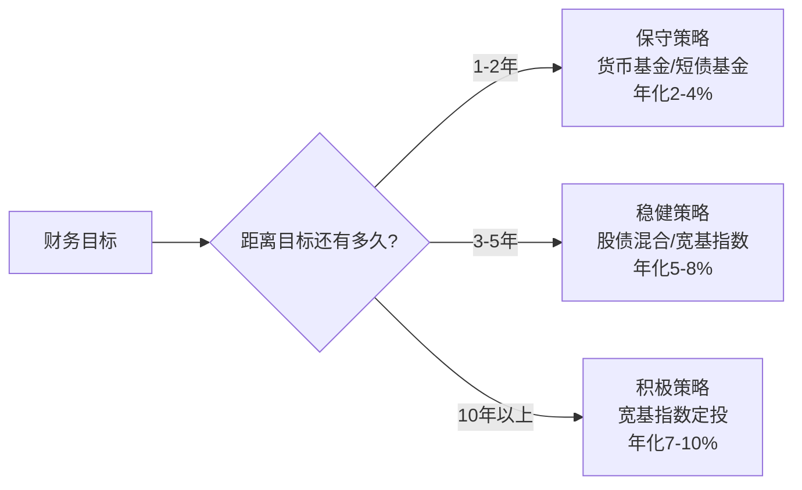
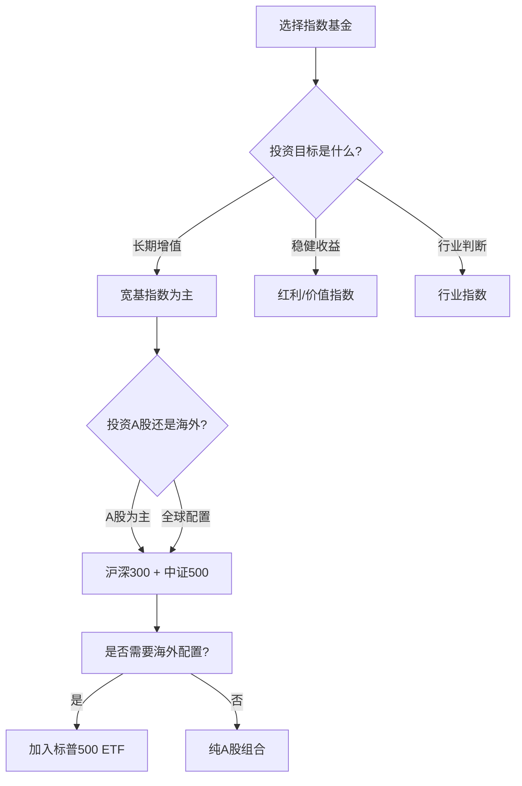
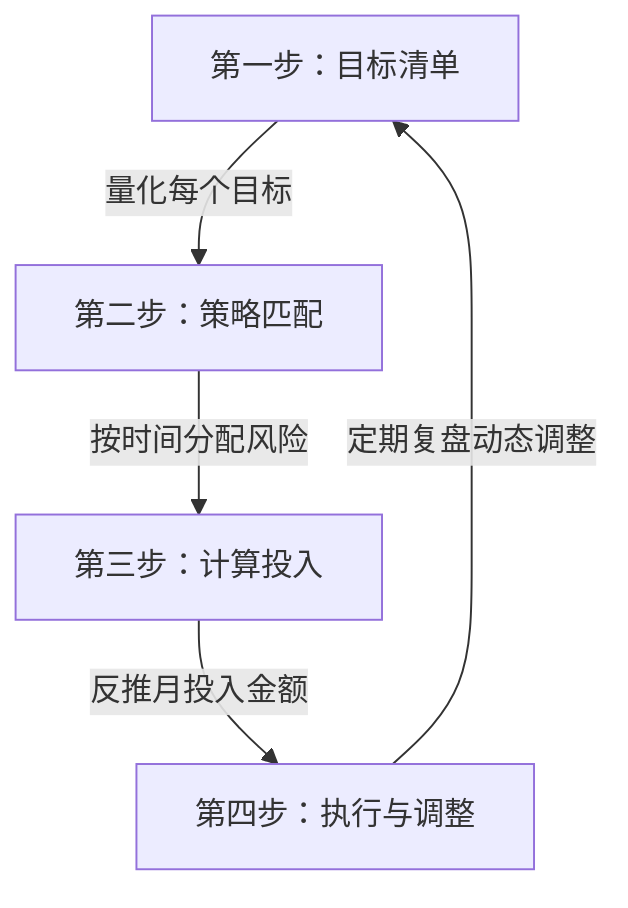

## 案例三：用指数基金实现财务目标的小李

> "目标不是用来梦想的，而是用来拆解和执行的。" —— 彼得·德鲁克

本案例展示一位普通职场人如何将抽象的财务梦想转化为具体的、可量化的投资计划，并通过指数基金定投系统化地实现多个阶段性目标。与案例一的「从零开始」和案例二的「纠正错误」不同，本案例的核心是**目标导向的投资规划**——先有目标，再反推需要投入多少、投资多久、选择什么工具。

---

### 一、人物画像：小李是谁

#### 基本信息

| 维度 | 具体情况 |
|------|----------|
| 年龄 | 28 岁，工作第 5 年 |
| 职业 | 某互联网公司产品经理 |
| 月收入 | 税后 18,000 元（含年终奖折算后月均） |
| 月支出 | 房租 4,000 + 生活费 4,000 + 交通 500 + 娱乐 1,500 + 其他 1,000 = 11,000 元 |
| 月结余 | 7,000 元 |
| 存款 | 22 万元（其中 8 万在银行定期，14 万在货币基金） |
| 投资经验 | 少量——曾买过 2 万元余额宝，偶尔买银行理财 |
| 债务 | 无房贷、无车贷，信用卡每月全额还清 |
| 家庭状况 | 未婚，有女朋友，计划 2 年内结婚 |
| 保险 | 公司五险一金 + 自己买的一份百万医疗险 |

#### 小李的财务目标清单

小李是一个目标感很强的人。他在 28 岁生日那天坐下来，认真梳理了自己未来 5-10 年的财务目标：

```text
小李的财务目标清单（2024年1月制定）

├── 短期目标（1-2年）
│   ├── 结婚基金：15 万元（婚礼+蜜月+家电）
│   └── 应急基金：6 万元（6个月生活费，已有）
│
├── 中期目标（3-5年）
│   ├── 购房首付：60 万元（目标城市首付约 30%）
│   └── 车辆购置：15 万元（代步车）
│
└── 长期目标（10年+）
    └── 退休储备：500 万元（40岁前初步达成财务自由的基础）
```

**这些目标的总金额：约 155 万元。** 而小李目前只有 22 万元存款和每月 7,000 元的结余。如果不做任何投资，仅靠工资储蓄，按月存 7,000 元计算，需要约 18 年才能攒够 155 万元——这还没考虑通货膨胀导致的目标金额上升。

**这就是小李决定学习投资的根本原因：他不是想「钱生钱」，而是发现仅靠储蓄根本无法实现自己的人生规划。**

#### 小李的认知起点

小李对投资的认知处于「入门但未行动」的阶段：

| 维度 | 小李的认知水平 |
|------|----------------|
| 对基金的了解 | 知道基金是「别人帮你投资」，但不清楚具体分类 |
| 对指数基金 | 听说过沪深300，但不了解为什么适合普通人 |
| 对定投 | 听说过「基金定投」，但不理解其数学原理 |
| 对风险 | 觉得投资=炒股=高风险，有恐惧心理 |
| 对收益预期 | 不知道合理的年化收益应该是多少 |
| 最大的困惑 | "我有明确的目标金额，该投多少钱？投多久？" |

小李的情况代表了一类非常典型的投资者——**他们不是没有钱，也不是没有投资意愿，而是不知道如何将「人生目标」转化为「投资计划」**。

---

### 二、目标拆解：把梦想变成数学题

小李做的第一件事，也是最关键的一步，是把每个模糊的财务目标变成精确的数字。

#### 第一步：明确每个目标的时间和金额

| 目标 | 目标金额 | 截止时间 | 距今时间 | 已有资金 | 缺口 |
|------|----------|----------|----------|----------|------|
| 结婚基金 | 15 万元 | 2026年1月 | 2年 | 5万（预留） | 10万 |
| 购房首付 | 60 万元 | 2029年1月 | 5年 | 0万（另算） | 60万 |
| 车辆购置 | 15 万元 | 2028年1月 | 4年 | 0万 | 15万 |
| 退休储备 | 500 万元 | 2036年（40岁） | 12年 | 17万（剩余存款） | 483万 |

#### 第二步：根据目标时间和风险承受度分配投资策略

这是整个案例最核心的一步。**不同的目标，因为时间跨度不同，应该采用不同的投资策略。**



**为什么时间跨度决定了策略？**

投资中有一条铁律：**时间越长，波动被平滑的概率越高，亏损的可能性越低。**

以沪深300指数为例，历史数据表明：

| 持有期 | 正收益概率 | 平均年化收益 | 最大亏损 |
|--------|-----------|-------------|----------|
| 1 个月 | 约 55% | — | -25% |
| 1 年 | 约 65% | 8-10% | -35% |
| 3 年 | 约 80% | 6-10% | -20% |
| 5 年 | 约 90% | 6-10% | -10% |
| 10 年+ | 约 95%+ | 7-10% | 几乎为正 |

**关键结论：** 如果你的目标在 2 年内需要用钱，这笔钱不应该投在股票型基金里——哪怕你「觉得」市场会涨。因为一旦买入后市场大跌 20-30%，你没有时间等它涨回来，而你又必须在目标时间点用钱，就会被迫在亏损状态卖出。

#### 第三步：计算每个目标需要的月投入

小李的财务顾问（他自己通过学习充当了这个角色）为每个目标做了详细的测算。

**结婚基金（2年，缺口10万）：**

```text
策略：保守配置
投资工具：短债基金（年化约 3.5%）
每月投入 = 目标金额 ÷ ((1 + 月利率)^月数 - 1) ÷ 月利率

简化计算：
月利率 ≈ 3.5% ÷ 12 = 0.29%
10万 ÷ 24个月 ≈ 4,167 元/月

考虑利息收入后，实际需要约 4,050 元/月
```

**购车基金（4年，缺口15万）：**

```text
策略：稳健配置
投资工具：沪深300指数基金 60% + 纯债基金 40%
预期年化：约 6%（混合收益）
每月投入计算：约 2,800 元/月

注意：4年期的指数基金有波动风险，需要预留缓冲期
如果第3年底市场恰好大跌，可推迟购车半年-1年
```

**购房首付（5年，缺口60万）：**

```text
策略：稳健偏积极
投资工具：沪深300指数基金 50% + 中证500指数基金 20% + 纯债基金 30%
预期年化：约 7%（混合收益）
每月投入计算：约 8,500 元/月

这笔投入加上结婚基金和购车基金的投入，总月投入 = 4,050 + 2,800 + 8,500 = 15,350 元
远超月结余 7,000 元！

→ 这说明：仅靠工资结余，5年内攒够60万首付+其他目标是不现实的
→ 需要优化方案
```

**方案优化：**

小李发现原始方案不可行后，做了三个调整：

```text
调整一：合并投资池
  不必为每个目标单独建账户。可以统一管理，用一个「投资总池」配合「目标优先级」
  → 结婚基金最紧急（2年），优先保证
  → 其余资金按比例分配到购车和购房

调整二：提高收入
  小李计划通过晋升和副业，将月结余从 7,000 元提升到 12,000 元
  → 晋升预期：产品经理P6→P7，月薪提升约 3,000 元
  → 副业收入：利用产品经验做咨询/写专栏，预期月均 2,000 元

调整三：调整目标预期
  购房首付可能需要家庭支持或适当降低目标（如先买小户型、选择郊区）
  退休储备是长期目标，初期投入可以少一些，随着收入增长逐步加大
```

#### 优化后的投资计划

```text
小李的月度投资分配方案（优化后）

月结余目标：12,000 元

├── 结婚基金：4,000 元/月 → 短债基金
│   └── 2年后预计：约 10 万（含利息）
│
├── 购车/购房综合池：5,000 元/月
│   ├── 60% → 沪深300指数基金（3,000 元）
│   ├── 20% → 中证500指数基金（1,000 元）
│   └── 20% → 纯债基金（1,000 元）
│
├── 退休储备：2,000 元/月 → 沪深300指数基金
│   └── 长期定投，12年不动
│
└── 灵活储备：1,000 元/月 → 货币基金
    └── 作为应急补充和加仓弹药
```

---

### 三、基金选择：小李的筛选过程

#### 理解指数基金的分类

在开始投资之前，小李花了两周系统学习指数基金。他发现指数基金远不止「沪深300」这么简单：

| 分类维度 | 类型 | 代表指数 | 特点 |
|----------|------|----------|------|
| **按市值** | 大盘 | 沪深300、上证50 | 稳健，波动小，蓝筹股为主 |
| | 中盘 | 中证500 | 成长性好，波动中等 |
| | 小盘 | 中证1000、国证2000 | 波动大，潜在收益高 |
| **按风格** | 价值型 | 中证红利、基本面50 | 分红高，估值低，防御性强 |
| | 成长型 | 创业板指、科创50 | 高增长，高波动 |
| **按行业** | 消费 | 中证消费 | 防御性强，长期牛股集中地 |
| | 医药 | 中证医药 | 刚需行业，政策敏感 |
| | 科技 | 中证科技 | 高成长高波动 |
| | 金融 | 中证银行 | 低估值高分红 |
| **按地域** | A股 | 沪深300、中证500 | 国内市场 |
| | 港股 | 恒生指数、H股指数 | 估值低，受外资影响大 |
| | 美股 | 标普500、纳斯达克100 | 全球标杆，长期表现优秀 |

#### 小李的筛选决策树



#### 小李的具体基金选择

**综合池（购车/购房目标）的基金选择：**

| 选择 | 具体产品 | 费率 | 规模 | 理由 |
|------|----------|------|------|------|
| 沪深300指数基金 | 某头部公司联接基金 | 管理费0.5%+托管费0.1% | 约80亿 | A股核心蓝筹代表，历史长期年化约8-10% |
| 中证500指数基金 | 某头部公司联接基金 | 管理费0.5%+托管费0.1% | 约50亿 | 中小盘成长代表，与沪深300形成互补 |
| 纯债基金 | 某大型基金公司纯债A | 管理费0.3%+托管费0.1% | 约100亿 | 波动极小，年化约3-5%，平衡组合波动 |

**退休储备的基金选择：**

小李为退休账户选择了一只费率极低的沪深300 ETF联接基金（管理费0.15%），理由是：这笔钱要投 12 年以上，费率差异在长期复利下影响巨大。

```text
费率差异的长期影响（假设投入10万元，年化收益8%）

管理费 0.5% 的基金（实际收益 7.5%）：
  12年后：10万 × (1.075)^12 = 23.8 万

管理费 0.15% 的基金（实际收益 7.85%）：
  12年后：10万 × (1.0785)^12 = 24.7 万

差额：0.9 万（仅仅10万元就差了近1万）
如果投入金额更大、时间更长，差距会更大
```

#### 没有选增强型指数基金的原因

增强型指数基金试图在跟踪指数的基础上通过主动管理获得超额收益。但小李经过研究后决定不选：

| 对比维度 | 纯被动指数基金 | 增强型指数基金 |
|----------|---------------|---------------|
| 管理费 | 0.15-0.5% | 1-1.5% |
| 跟踪目标 | 紧密跟踪指数 | 超越指数 |
| 超额收益稳定性 | — | 不稳定，部分年份跑输指数 |
| 规模效应 | 规模大，流动性好 | 规模通常较小 |
| 透明度 | 持仓完全透明 | 持仓不完全透明 |
| 适合人群 | 大多数人 | 有挑选能力的投资者 |

历史数据显示，只有约30%的增强型指数基金能在5年期持续跑赢其跟踪的纯被动指数基金。对于小李这种「不想花精力挑选基金」的投资者，纯被动指数基金是更省心、更可靠的选择。

---

### 四、执行过程：小李的投资日志

#### 第一阶段：建仓期（2024年1月-3月）

小李没有一次性把所有钱都投入。他采取了「分批建仓」策略，用 3 个月时间把已有存款中的投资部分逐步转入。

```text
建仓计划：

已有可投资资金：22万 - 6万（应急基金）= 16 万

分配方案：
├── 结婚基金预留：5 万 → 全部买入短债基金（一次性）
├── 综合投资池：8 万 → 分3个月定投
│   ├── 第1个月：3万（沪深300 1.8万 + 中证500 0.6万 + 纯债 0.6万）
│   ├── 第2个月：3万（同上）
│   └── 第3个月：2万（同上，调整比例）
└── 退休储备：3 万 → 分3个月定投沪深300

为什么要分批而不是一次性投入？
  → 如果一次性投入后市场立刻跌10%，16万变成14.4万，心理打击巨大
  → 分3个月投入，即使第1个月买了后跌了，第2、3个月还能以更低价格买入
  → 这本质上就是「定投」的原理在建仓阶段的应用
```

**建仓期的心理状态：** 小李坦言，第一次看到账户里显示「-200元」的时候，心跳加速了。虽然理智告诉他这是正常的，但情绪上还是不舒服。他采取的应对方法是：**设好自动定投后，删除了手机上的基金APP，只在每月月底用电脑查看一次。**

#### 第二阶段：持续定投期（2024年4月-2025年12月）

建仓完成后，小李进入每月自动定投阶段。

```text
每月定投执行清单：

每月 15 日（发工资次日）：
├── 自动扣款 4,000 元 → 短债基金（结婚基金）
├── 自动扣款 3,000 元 → 沪深300指数基金（综合池）
├── 自动扣款 1,000 元 → 中证500指数基金（综合池）
├── 自动扣款 1,000 元 → 纯债基金（综合池）
├── 自动扣款 2,000 元 → 沪深300指数基金（退休储备）
└── 自动扣款 1,000 元 → 货币基金（灵活储备）
─────────────────────────
合计：12,000 元/月
```

**小李遇到的第一个挑战：收入波动**

2024年下半年，互联网行业出现裁员潮，小李的副业收入从预期的 2,000 元/月降到了 500 元/月。月结余从 12,000 元降到了约 10,000 元。

小李的应对策略：

```text
收入减少时的投资调整原则：

1. 永远不中断定投（哪怕减少金额）
   → 定投纪律 > 定投金额
   → 中断一次就会有第二次、第三次

2. 优先级排序
   → 结婚基金（2年后要用）：保持不变 4,000 元
   → 综合投资池（4-5年后用）：从 5,000 降到 4,000 元
   → 退休储备（12年不用）：从 2,000 降到 1,500 元
   → 灵活储备：从 1,000 降到 500 元

3. 调整后的月投入：10,000 元
   → 比原计划少了 2,000 元，但核心目标未受影响
```

**小李遇到的第二个挑战：市场波动**

2024年9月，A股出现一波快速上涨，沪深300从 3,500 点附近冲到 4,200 点以上，涨幅约 20%。小李的综合投资池账面盈利一度超过 15%。

朋友劝他：「市场这么好，要不要加投？」小李的回答是：「不加。我的计划是每月 5,000 元，多一分钱都不加。」

2025年初市场有所回调，沪深300回到 3,800 点附近。那些在高点加大投入的朋友开始亏损，而小李因为坚持原定金额，整体持仓成本仍然健康。

#### 第三阶段：里程碑检查（2025年12月——执行2年）

小李在定投满 2 年时做了一次全面盘点：

```text
2025年12月盘点（执行2年）

结婚基金：
  投入本金：4,000 × 24 = 96,000 元
  当前市值：约 101,000 元（短债基金累计收益）
  收益率：+5.2%
  状态：✅ 已达成目标，可随时取出

综合投资池（购车/购房）：
  初始投入：80,000 元（建仓）
  持续投入：5,000 × 21 = 105,000 元（扣掉收入减少期调整）
  总投入：185,000 元
  当前市值：约 202,000 元
  收益率：+9.2%
  状态：📌 进度正常，距60万首付还差约40万

退休储备：
  初始投入：30,000 元（建仓）
  持续投入：2,000 × 21 = 42,000 元
  总投入：72,000 元
  当前市值：约 80,000 元
  收益率：+11.1%
  状态：📌 长期定投中，进度良好

总览：
  总投入本金：约 353,000 元
  总市值：约 383,000 元
  整体收益率：+8.5%
  年化收益率：约 4.1%（因为部分资金在短债基金中拉低了整体收益）
```

---

### 五、动态调整：当人生计划发生变化

投资计划不是刻在石头上的。小李在执行过程中经历了两次重大调整，每一次都考验了他的应变能力。

#### 调整一：结婚时间提前

2025年中，小李和女朋友决定提前半年结婚。结婚基金需要提前支取。

```text
应对方案：

结婚基金当前状态：
  投入本金：96,000 元
  当前市值：约 101,000 元（短债基金）
  目标金额：100,000 元

执行：
  ✅ 已达成目标，直接赎回短债基金
  ✅ 赎回到账时间：T+1（次日到账）
  ✅ 无亏损风险（短债基金波动极小）

教训验证：
  → 如果当初把结婚基金投在指数基金里，刚好赶上市场回调，可能只有 9 万
  → 短期目标用低风险工具，这个原则救了小李一次
```

#### 调整二：收入增长后的方案升级

2025年底，小李成功晋升P7，月薪提升至 22,000 元（税后），月结余恢复到 14,000 元。

```text
升级后的投资方案：

月结余：14,000 元（扣除已不需要的结婚基金投入后多出 4,000 元）

新增分配：
├── 综合投资池加码：+2,000 元/月
│   └── 全部投入沪深300指数基金
│       → 加速购房首付积累
│
├── 退休储备加码：+1,000 元/月
│   └── 开始配置标普500指数基金
│       → 实现A股+美股的全球分散
│
└── 新增「自我投资」预算：+1,000 元/月
    └── 投资课程、书籍、行业会议
        → 小李认为：投资自己的回报率远高于任何基金

加码后的月度总投资：14,000 元

预期效果：
  综合投资池：5年目标从「需要加码」变为「提前完成」
  退休储备：12年目标的预期终值从 500 万提升到约 600 万
```

#### 标普500配置的理由

小李在收入增长后决定加入美股指数基金，原因如下：

| 对比维度 | 纯A股组合 | A股+美股组合 |
|----------|-----------|-------------|
| 分散程度 | 单一市场风险 | 跨市场分散 |
| A股-美股相关性 | — | 约 0.3-0.4（低相关） |
| 历史年化（A股） | 沪深300约 8-10% | — |
| 历史年化（美股） | — | 标普500约 10-12% |
| 汇率风险 | 无 | 有（人民币贬值时反而有利） |
| 适合阶段 | 投资初期 | 有一定经验后 |

**配置方式：** 小李选择了A股账户可直接购买的标普500 ETF联接基金（QDII），无需开境外账户，操作与买A股基金完全相同。

---

### 六、五年展望：小李的财务目标达成预测

基于当前的投资方案和保守的收益假设，小李做了一个五年展望：

```text
小李的五年财务预测（保守估计）

假设条件：
  - 指数基金年化收益：7%（低于历史均值）
  - 短债基金年化收益：3.5%
  - 月投入保持 14,000 元（不考虑进一步加薪）
  - 不考虑通胀调整

2024年初 → 2029年初（5年）：

结婚基金：
  状态：✅ 已完成（2025年中支取）

综合投资池（购车+购房）：
  2025年底投入本金：约 185,000 元
  2026-2028年持续投入：14,000 × 36 = 504,000 元（加码后）
  累计投入：约 689,000 元
  预计市值（年化7%复利）：约 780,000 - 820,000 元
  状态：✅ 60万购房首付目标预计提前完成

  → 可以在2028年提前购房
  → 购房后剩余资金转入车辆购置

退休储备：
  2025年底投入本金：约 72,000 元
  2026-2028年持续投入：3,500 × 36 = 126,000 元（加码后）
  累计投入：约 198,000 元
  预计市值（年化7%复利）：约 230,000 元
  状态：📌 良好，距离500万目标还很远，但初期积累已完成

总览：
  总投入本金：约 887,000 元
  总市值：约 1,010,000 - 1,050,000 元
  整体收益率：约 +14-18%
```

**如果小李不投资，只存银行：**

```text
存银行方案（年化2%）：
  总投入本金：约 887,000 元
  总市值：约 960,000 元
  差额：约 50,000 - 90,000 元

这5-9万的差距，就是「花两周学习投资」的直接回报
```

---

### 七、目标导向投资的方法论总结

小李的案例最大的价值不在于具体赚了多少钱，而在于他展示了一套**可复制的目标导向投资方法论**。

#### 核心方法论：四步法



**第一步：目标清单——把梦想变成数字**

| 错误做法 | 正确做法 |
|----------|----------|
| "我想以后买房" | "我要在2029年1月攒够60万首付" |
| "我要存点养老钱" | "我要在40岁前积累500万退休储备" |
| "想买辆车" | "4年内攒15万买一辆代步车" |

目标必须满足 SMART 原则：Specific（具体）、Measurable（可衡量）、Achievable（可达成）、Relevant（相关）、Time-bound（有时限）。

**第二步：策略匹配——时间决定风险偏好**

| 目标时间 | 风险策略 | 推荐工具 | 预期年化 |
|----------|----------|----------|----------|
| 1年以内 | 极保守 | 货币基金 | 2-3% |
| 1-3年 | 保守 | 短债基金/银行理财 | 3-5% |
| 3-5年 | 稳健 | 指数基金+债券混合 | 5-8% |
| 5-10年 | 积极 | 宽基指数定投 | 7-10% |
| 10年以上 | 进取 | 指数基金为主+适当行业基金 | 8-12% |

**第三步：计算投入——用数学代替感觉**

```text
定投终值公式（简化版）：

FV = PMT × ((1+r)^n - 1) ÷ r

其中：
  FV = 目标金额
  PMT = 每月投入
  r = 月化收益率（年化÷12）
  n = 投资月数

反推月投入：
PMT = FV × r ÷ ((1+r)^n - 1)
```

**第四步：执行与调整——纪律大于聪明**

| 原则 | 具体做法 |
|------|----------|
| 自动化 | 设好自动扣款，删除APP，减少查看频率 |
| 优先级 | 紧急目标的资金绝不投高风险资产 |
| 弹性空间 | 月结余不要100%用于投资，留20%缓冲 |
| 定期复盘 | 每半年检查一次进度，偏离超10%再调整 |
| 不追热点 | 市场大涨不大投，市场大跌不小投 |

#### 常见错误与纠正

| 错误做法 | 为什么是错的 | 正确做法 |
|----------|-------------|----------|
| 所有钱都买股票基金 | 短期目标可能被市场波动摧毁 | 按目标时间分配风险等级 |
| 为每个目标单独开户管理 | 操作复杂，容易放弃 | 统一投资池+优先级管理 |
| 看到涨了就加投 | 破坏纪律，买在高点 | 严格执行计划金额 |
| 看到跌了就停投 | 丧失低位积累筹码的机会 | 跌了更要坚持定投 |
| 收入增加后立刻提高生活开支 | 浪费了收入增长带来的投资机会 | 收入增加的50%用于加投 |
| 频繁查看账户 | 增加焦虑，导致冲动决策 | 每月查看一次即可 |
| 目标到期时才开始准备 | 复利需要时间，临阵磨枪来不及 | 越早开始越好 |

---

### 八、从这个案例中我们可以学到什么

#### 对目标导向投资者的五大启示

**第一，投资之前先定目标。** 很多人的问题不是「不知道怎么投资」，而是「不知道为什么要投资」。没有目标的投资就像没有目的地的航行——你可能走得很快，但不知道要去哪里。小李的案例表明：当你有了明确的目标金额和时间，投资方案会自然浮现。

**第二，不同的目标需要不同的工具。** 这是很多人忽略的关键点。把所有钱都放在同一个篮子里是危险的——如果你2年后要结婚的钱也放在股票基金里，一场熊市就可能让你的婚礼计划泡汤。**时间跨度决定风险承受度，风险承受度决定投资工具。**

**第三，数学比感觉可靠。** 小李没有凭「我觉得应该够了」来决定投资金额，而是用公式精确计算每月需要投入多少。这种量化思维是投资成功的基础。很多人投资失败，不是因为选错了基金，而是因为投入的金额不够——他们的目标是60万，但每月只投1000元，靠投资收益根本追不上目标。

**第四，收入增长是投资的最大杠杆。** 如果小李只靠最初的月结余7,000元投资，5年后的结果会大打折扣。他通过晋升和副业将月结余提升到14,000元——这笔增量全部用于投资，效果远超「选了一只更好的基金」。**投资自己（提升收入能力）的回报率，永远高于投资金融市场。**

**第五，投资是动态过程，不是一锤子买卖。** 小李经历了收入波动、市场涨跌、人生计划变化，每次都做了合理调整。投资方案不是制定完就永远不变的——它需要随着你的收入、目标、市场环境不断优化。但「调整」不等于「推翻重来」，核心框架（分散配置、定期投入、长期持有）是不变的。

#### 小李的「投资纪律清单」

```text
小李的投资纪律（贴在电脑显示器边框上）

┌───────────────────────────────────────────────────┐
│                                                   │
│  1. 每月15日自动扣款，金额由计划决定，不由心情决定   │
│  2. 每月最后一天查看一次账户，其他时间不打开APP      │
│  3. 市场大涨时不加投，市场大跌时不减投              │
│  4. 结婚基金只买短债基金，绝不动摇                  │
│  5. 每半年复盘一次目标进度，偏离超10%才调整         │
│  6. 收入增加的50%用于加投，50%用于改善生活          │
│  7. 不听任何「内幕消息」「朋友推荐」               │
│  8. 任何投资决策写下理由，48小时冷静期后再执行      │
│  9. 永远留20%月结余作为缓冲，不全部投入            │
│ 10. 每年1月做一次资产再平衡                        │
│                                                   │
└───────────────────────────────────────────────────┘
```

#### 给类似处境读者的行动模板

如果你和小李类似——有明确的人生目标、有稳定的收入、有投资意愿但缺乏系统方案——以下是你可以直接复用的行动模板：

**第1周：目标梳理**
- [ ] 列出你未来 1-15 年的所有财务目标
- [ ] 为每个目标标注具体金额和截止日期
- [ ] 计算每个目标的资金缺口

**第2周：策略制定**
- [ ] 根据每个目标的时间跨度确定风险等级
- [ ] 选择对应的投资工具（参考本案例的匹配表）
- [ ] 用定投公式计算每个目标的月投入金额

**第3周：执行准备**
- [ ] 开设基金账户（支付宝/天天基金/蛋卷基金）
- [ ] 筛选具体基金产品（费率低、规模适中、跟踪误差小）
- [ ] 设置自动定投计划
- [ ] 写下你的投资纪律清单

**第4周：启动执行**
- [ ] 存入应急基金（3-6个月生活费）
- [ ] 启动自动定投
- [ ] 删除或隐藏基金APP
- [ ] 在日历上标记每半年的复盘日期

**持续：复盘与优化**
- [ ] 每半年检查一次目标进度
- [ ] 收入变化时调整投入金额
- [ ] 每年1月做资产再平衡
- [ ] 重大人生事件（结婚、换工作、买房）时全面评估方案

> **最后的话：** 小李的案例告诉我们，投资不是赌博，不是碰运气，也不是少数人才能掌握的技能。它是一道可以被拆解、计算、执行的数学题。当你把人生目标转化为精确的数字，当你用纪律替代情绪，当你让时间成为你的盟友——指数基金定投就是普通人实现财务目标最可靠的路径。正如约翰·博格尔所说：「Don't look for the needle in the haystack. Just buy the haystack.」（不要在草堆里找针，直接买下整个草堆。）

