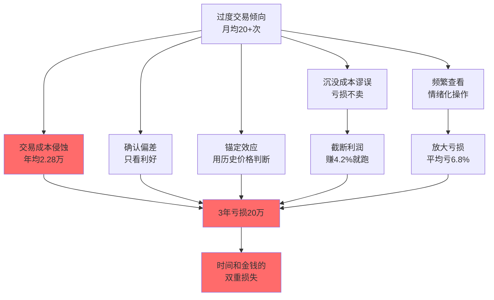
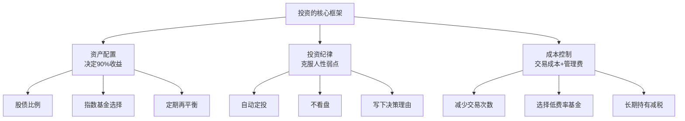

## 案例四：从"炒股"到"投资"的转变

> "股市是把钱从没有耐心的人转移到有耐心的人手中的工具。" —— 沃伦·巴菲特

本案例的主角小陈代表了中国股市中数量最庞大的群体——**短线交易者**。他们不是没有钱，也不是不聪明，而是陷入了一种"用勤奋替代思考"的陷阱：每天盯盘、频繁交易、追逐热点，最终却发现越忙越亏。这个案例的核心价值在于**用精确的数字量化"炒股"的真实成本**，并展示一个完整的、可复制的转型路径——从投机者变为投资者。

与案例二中老王的"追涨杀跌后割肉离场"不同，小陈的故事是另一种典型：他没有经历一次性的巨大亏损，而是在持续的小额亏损和交易成本中被慢慢"放血"。这种模式更隐蔽、更难察觉，也因此更危险。

---

### 第一部分：人物画像与问题全景

#### 小陈的基本情况

| 维度 | 详情 |
|------|------|
| 年龄 | 35岁，某制造企业中层技术主管 |
| 年收入 | 税后约30万（含年终奖） |
| 家庭状况 | 已婚，一个孩子3岁，妻子全职带娃 |
| 可投资资产 | 约100万（多年积蓄+部分借款） |
| 投资经验 | 5年"炒股"经验 |
| 每日盯盘时间 | 约4小时（早盘1小时+午盘1.5小时+收盘复盘1.5小时） |
| 交易频率 | 月均20-25次（年均约250次） |
| 投资结果 | 3年累计亏损20%（亏损约20万） |

#### 小陈的"炒股"日常还原

小陈的一天是这样度过的：

```mermaid
timeline
    title 小陈的"炒股"日常（交易日）
    06:30 : 起床看隔夜美股、期指
          : 刷财经新闻和股吧
    08:00 : 看早盘策略文章
          : 确认"今日重点关注"个股
    09:15 : 集合竞价期间紧张盯盘
    09:30 : 开盘——心跳加速
          : 根据盘面决定买卖
    11:30 : 午盘休息——刷股吧
          : 看"大V"午评
    13:00 : 下午开盘继续盯盘
    14:30 : 尾盘异动——临时决策
    15:00 : 收盘——统计当日盈亏
    15:30 : 复盘——研究K线、技术指标
    20:00 : 看晚间资讯、准备明日策略
    22:30 : 睡前最后刷一次股吧
```

**每天花在"炒股"上的时间：4-5小时。** 3年下来，小陈在股市上投入的时间相当于一份兼职工作的总工时——约3,000小时。而这3,000小时的"工作"不仅没有工资，还倒亏了20万。

#### 小陈的交易记录分析

小陈在意识到问题后，导出了自己3年的完整交易记录，做了详细的统计分析：

```text
小陈3年交易记录统计（2020年1月-2022年12月）

总交易笔数：约750笔（买入+卖出各算一笔）
  ├── 2020年：220笔
  ├── 2021年：280笔
  └── 2022年：250笔

单笔平均金额：约12万元

交易品种分布：
  ├── 个股：680笔（91%）
  ├── ETF：50笔（7%）
  └── 其他（可转债等）：20笔（3%）

持股时长分布：
  ├── 当天买卖（T+0可转债）：5%
  ├── 1-3天：35%
  ├── 4-7天：25%
  ├── 1-4周：20%
  └── 超过1个月：15%

交易结果分布：
  ├── 盈利交易：310笔（41%）
  ├── 亏损交易：380笔（51%）
  └── 持平：60笔（8%）
  
  → 胜率：41%（不到一半）
  → 但盈利交易的平均收益：+4.2%
  → 亏损交易的平均亏损：-6.8%
  → 盈亏比：0.62:1（赢小亏大）
```

**关键发现：** 小陈的胜率只有41%，而且盈亏比不到1——这意味着他赚的时候赚得少，亏的时候亏得多。这是一个典型的"截断利润、让亏损奔跑"的反向操作模式。

---

### 第二部分：问题深度诊断

小陈的问题不是简单的"运气不好"或"选股能力差"，而是一个由**认知偏差、行为模式和结构性成本**共同构成的系统性陷阱。

#### 诊断一：交易成本的隐形侵蚀

这是最容易被忽视、但影响最致命的因素。小陈从来没有精确计算过自己的交易成本——直到他做了以下这张表：

```text
小陈的年交易成本精确计算

假设条件：
  - 每笔交易金额：12万元（均值）
  - 年交易笔数：250笔（买入125笔 + 卖出125笔）
  - 佣金费率：万2.5（0.025%）
  - 印花税：千1（0.1%，仅卖出收取）
  - 过户费：万0.1（0.01%，沪深两市）

买入成本（125笔）：
  佣金：12万 × 0.025% × 125 = 3,750元
  过户费：12万 × 0.01% × 125 = 150元
  买入小计：3,900元

卖出成本（125笔）：
  佣金：12万 × 0.025% × 125 = 3,750元
  印花税：12万 × 0.1% × 125 = 15,000元
  过户费：12万 × 0.01% × 125 = 150元
  卖出小计：18,900元

年交易成本合计：22,800元
3年交易成本合计：68,400元
```

**68,400元——这就是小陈为"频繁交易"支付的隐性学费。** 这笔钱在每一笔交易中悄无声息地被扣走，小陈几乎毫无感知。它占到了小陈3年总亏损（20万）的34%。

换个角度理解：如果小陈每年把这22,800元的交易成本投入到一只年化8%的指数基金中，3年后这笔钱会变成约75,000元。一进一出，差距近14万。

**交易成本与交易频率的关系：**

| 月交易次数 | 年交易成本（12万/笔） | 占100万本金比例 |
|-----------|---------------------|---------------|
| 2次 | 2,280元 | 0.23% |
| 5次 | 5,700元 | 0.57% |
| 10次 | 11,400元 | 1.14% |
| 20次 | 22,800元 | 2.28% |
| 40次 | 45,600元 | 4.56% |

**交易频率每翻一倍，交易成本就翻一倍。** 而交易成本是确定性的、不可回收的支出——无论你赚钱还是亏钱，佣金和印花税一分不少地从你账户里扣走。这就是为什么巴菲特说"成本是投资回报的头号敌人"。

#### 诊断二：行为金融学深度分析

小陈的交易模式中存在至少五种系统性的认知偏差：

**1. 过度交易倾向（Overtrading）**

行为金融学研究发现，交易频率与投资收益之间存在显著的负相关关系。Barber和Odean在2000年的经典研究《Trading Is Hazardous to Your Wealth》中分析了66,465个家庭的交易记录，发现：**交易最频繁的20%投资者，年化收益比交易最不频繁的20%投资者低约7个百分点。**

小陈月均交易20+次，属于最活跃的那一档。他以为自己在"努力工作"，实际上是在给券商和税务局打工。

过度交易的心理根源是**"控制错觉"（Illusion of Control）**——人倾向于认为自己对随机事件有控制力。在股市中，这种错觉表现为"我可以通过频繁操作来控制收益"。事实上，短期内股价的涨跌接近随机游走，频繁操作不仅无法增加收益，反而因为交易成本和错误决策而降低收益。

**2. 确认偏差（Confirmation Bias）**

小陈在决定买入一只股票后，会不自觉地只关注支持自己判断的信息，而忽略相反的证据。他加入的几个股票微信群里，大家都在讨论"这只股票还能涨多少"，偶尔有人说看空，他直接略过——"不懂的人才会看空"。

确认偏差的典型表现：
- 只看利好消息，忽略利空消息
- 只关注支持自己持仓的分析师观点
- 在股吧里只和同方向的"战友"互动
- 盈利时归功于自己的判断，亏损时归咎于外部因素

**3. 锚定效应（Anchoring Effect）**

小陈经常说"这只股票之前到过50块，现在才35块，肯定能涨回去"。这就是锚定效应——用一个不相关的历史价格作为参考点来判断当前价格是否"便宜"。

锚定效应的危害：
- "之前到过50块"不意味着还能回到50块——公司基本面可能已经变化
- 用历史高点作为买入依据，等于在赌一个不确定的回归
- 真正的"便宜"应该用估值指标（PE、PB）来衡量，而不是用历史价格

**4. 沉没成本谬误（Sunk Cost Fallacy）**

当小陈持有的股票亏损时，他不愿意卖出，理由是"都亏了这么多了，卖了就真亏了"。这正是沉没成本谬误——已经发生的亏损不应该影响未来的决策。

正确的思维方式是：**假设你现在没有持有这只股票，你愿意以当前价格买入吗？** 如果不愿意，就应该卖出。是否卖出的决策应该基于未来的预期，而不是过去的成本。

**5. 频繁查看收益的心理陷阱**

小陈每天查看多次账户盈亏，甚至设置了股价提醒，每涨跌2%就通知一次。行为金融学研究表明，**查看频率越高，做出冲动决策的概率越大。**

这是因为人对"损失"的敏感度是对"收益"的2.5倍（卡尼曼前景理论）。每天看盘意味着每天都要面对"可能亏损"的心理刺激，长期处于应激状态会导致：
- 该止损时不止损（想等回本）
- 该持有时急着卖出（怕利润回吐）
- 该买入时犹豫不决（怕买在高点）



#### 诊断三：信息来源的结构性缺陷

小陈的信息来源存在严重问题：

| 信息来源 | 使用频率 | 问题 | 实际价值 |
|----------|---------|------|---------|
| 股票微信群 | 每天 | 消息滞后、充满噪音、群友互相"按摩" | 极低 |
| 股吧/论坛 | 每天 | 匿名信息无法验证，情绪传染严重 | 极低 |
| 财经自媒体 | 每天 | 标题党、事后诸葛亮、推荐有利益关联 | 低 |
| 技术分析文章 | 每天 | K线形态的有效性在学术界争议极大 | 低-中 |
| 上市公司财报 | 偶尔 | 小陈缺乏财务分析能力，读不懂 | 潜在高但未发挥 |
| 学术研究/经典书籍 | 从未 | 不知道该读什么 | 高（但从未接触） |

**核心问题：小陈花大量时间收集的都是低质量信息，而从未接触过真正有价值的投资知识体系。** 他以为自己很"勤奋"，但这种勤奋的方向完全错误——就像一个人每天练习用筷子吃西餐，越努力越别扭。

---

### 第三部分：转变过程——从"炒股"到"投资"

小陈的转变不是一个突然的顿悟，而是一个循序渐进的过程，分为四个阶段。

#### 阶段一：认知觉醒（第1个月）

转变的契机是一次"算账"。小陈在朋友（案例二中的老王）的建议下，认真导出了自己3年的交易记录，做了前文那份详细的统计分析。当他看到以下三个数字时，彻底清醒了：

1. **交易成本：6.84万** —— 确定性地从账户中流失
2. **胜率41%、盈亏比0.62:1** —— 他的"炒股"体系在数学上注定亏损
3. **3年时间投入：约3,000小时** —— 等于每天加班4小时，还倒贴钱

小陈做了一个对比计算：

```text
如果把3年"炒股"的时间和金钱用于投资指数基金：

方案A：小陈的实际经历
  初始本金：100万
  3年结果：亏损20万 → 剩余80万
  时间投入：3,000小时
  情绪状态：焦虑、失眠、影响工作和家庭

方案B：买入沪深300指数基金并持有不动
  初始本金：100万
  2020年初沪深300：约4,000点
  2022年底沪深300：约3,900点
  3年指数收益：约-2.5%
  考虑分红再投资：约+0%
  加上定投补仓（月投5,000元）：总投入118万，市值约115万
  亏损：约3万（仅为实际亏损的15%）
  时间投入：几乎为零

方案C：买入沪深300指数基金+坚持定投+不看盘
  如果从2020年开始每月定投5,000元到沪深300：
  3年总投入：100万 + 18万 = 118万
  考虑2020年大跌后定投的"便宜筹码"效应
  3年后预计市值：约120-130万
  时间投入：约10小时/年
```

**方案A vs 方案B的差距：约17万。** 这17万就是"炒股"的净损失——交易成本（6.84万）+ 错误决策损失（约10万）。

#### 阶段二：强制戒断（第2-3个月）

小陈意识到"炒股"本质上是一种行为成瘾——盯盘带来的多巴胺刺激和赌博类似。戒断需要物理隔离而非意志力。

**第一步：关闭交易通道**

```text
小陈的"戒断"清单：

1. 卖出所有个股持仓（无论盈亏）
   → 不留任何"回本"的念想
   → 沉没成本已经沉没，关注未来

2. 取消所有股价提醒和自选股
   → 消除触发"看盘冲动"的线索

3. 退出所有股票微信群（12个）
   → 切断噪音信息源
   → 如果退群有社交压力，设为"消息免打扰"再逐步退出

4. 卸载手机上的炒股APP
   → 保留一个基金APP（如天天基金）用于定投
   → 设置APP使用时间限制

5. 证券账户只保留基金交易功能
   → 关闭融资融券权限
   → 删除"银证转账"的快捷方式
```

**第二步：处理存量持仓**

小陈当时的持仓情况：

```text
卖出前的持仓明细：

个股A（某白酒股）：持有8个月，亏损-12%
个股B（某新能源股）：持有3个月，盈利+5%
个股C（某半导体股）：持有6个月，亏损-25%
个股D（某医药股）：持有1个月，亏损-8%
个股E（某银行股）：持有2个月，盈利+2%
可转债F：持有2周，盈利+3%

总市值：约78万（初始100万已亏22万）
```

卖出决策过程——小陈用了一个"清零测试"：

> **如果我现在没有持有任何股票，手上有78万现金，我会按照目前的方式买这些股票吗？**

答案是：绝对不会。

于是他一次性清仓所有个股和可转债，资金全部转入货币基金等待下一步配置。

**卖出时的心理挣扎：**

小陈坦承，清仓那天他的手在发抖。特别是亏损最大的半导体股（-25%），卖出意味着"认亏"——一种强烈的失败感。但他强迫自己执行了纪律：**过去的亏损是沉没成本，未来的决策应该基于未来的预期。**

有趣的是，清仓后的第一天，小陈感觉"如释重负"。那种每天盯着数字上蹿下跳的焦虑感消失了。他开始理解为什么老王说"不看盘是最好的投资决策"。

#### 阶段三：系统学习与方案制定（第3-6个月）

清仓后，小陈用了3个月时间系统学习投资知识。以下是他的学习路径：

**第一阶段（第1个月）：重建认知框架**

| 学习内容 | 具体材料 | 核心收获 |
|----------|---------|---------|
| 投资vs投机的本质区别 | 《聪明的投资者》格雷厄姆 | 投资是基于分析的长期行为，投机是基于猜测的短期行为 |
| 指数基金的逻辑 | 《共同基金常识》约翰·博格 | 低成本+分散化+长期持有 = 普通人的最优解 |
| 市场有效性 | 《漫步华尔街》马尔基尔 | 短期市场不可预测，长期市场向好 |

**第二阶段（第2个月）：学习资产配置**

| 学习内容 | 核心收获 |
|----------|---------|
| 股债平衡原理 | 股票和债券的低相关性是分散风险的基础 |
| 风险承受能力评估 | 不是"能承受多少亏损"，而是"亏损后会不会影响生活决策" |
| 定投的数学原理 | 成本平均法在波动市场中的优势 |

**第三阶段（第3个月）：理解投资心理学**

| 学习内容 | 对应小陈的问题 |
|----------|--------------|
| 过度交易的行为金融学解释 | 理解为什么频繁交易必然导致低收益 |
| 损失厌恶与处置效应 | 理解为什么自己"赚小亏大" |
| 确认偏差与信息茧房 | 理解为什么自己总在错误的时机做错误的决策 |

**学习成果：小陈的投资知识框架**



#### 阶段四：新方案的制定与执行

基于3个月的学习，小陈制定了全新的投资方案。

**风险评估：**

```text
小陈的风险承受能力评估：

财务维度：
  - 家庭年收入：30万
  - 家庭年支出：约18万
  - 年结余：约12万
  - 应急基金需求：6个月×1.5万 = 9万
  - 已有应急基金：15万（足够）
  - 可投资金额：约80万（清仓后）
  - 无房贷（已有房产）

心理维度：
  - 经历过3年"炒股"亏损，心理承受力已被压低
  - 妻子对投资有负面印象（"炒股亏了20万"）
  - 需要一个"稳"的方案来重建信心

时间维度：
  - 孩子3岁，教育金需求在15年后
  - 退休在25年后
  - 短期无大额支出计划

综合评估：风险承受能力中等偏低（初期），可随经验积累逐步提升
```

**资产配置方案：**

```text
小陈的新投资方案（80万本金）

资产配置：
├── 应急基金：15万（保持不变，货币基金）
│   └── 6个月家庭开支的安全垫
│
├── 稳健层：24万（30%）
│   ├── 纯债基金：12万（年化约3-5%，最大回撤<3%）
│   └── 银行理财R2级：12万（年化约3.5-4.5%）
│
├── 成长层：36万（45%）
│   ├── 沪深300指数基金：20万
│   ├── 中证500指数基金：10万
│   └── 标普500指数基金（QDII）：6万
│
└── 机动层：5万（约6%）
    └── 货币基金暂存——大跌时加仓的"弹药"
```

**为什么这样配置？**

| 资产类别 | 比例 | 功能 | 选择理由 |
|----------|------|------|---------|
| 稳健层 30% | 24万 | 心理安全垫 | 经历过亏损，需要低波动资产重建信心 |
| 成长层 45% | 36万 | 长期增值引擎 | 指数基金是最适合非专业投资者的工具 |
| 应急基金 | 15万 | 流动性保障 | 确保不会被迫卖出投资 |
| 机动层 6% | 5万 | 逆向加仓 | 历史数据显示大跌后加仓长期回报优异 |

**基金选择标准：**

| 筛选条件 | 小陈的选择标准 | 原因 |
|----------|--------------|------|
| 基金类型 | 纯被动指数基金 | 不选增强型——长期跑赢指数的概率仅30% |
| 基金规模 | >20亿 | 规模太小有清盘风险 |
| 管理费 | <0.5%（优选<0.2%） | 25年投资期限下，费率差异巨大 |
| 跟踪误差 | <0.5%/年 | 越小越好，越接近指数真实表现 |
| 基金公司 | 头部公司 | 华夏、易方达、南方、天弘等 |
| 成立年限 | >3年 | 有足够历史数据评估 |

**费率差异的长期影响（以成长层36万为基数）：**

```text
假设年化收益8%，投资25年：

管理费0.5%（实际收益7.5%）：
  36万 × (1.075)^25 = 36万 × 6.098 = 219.5万

管理费0.15%（实际收益7.85%）：
  36万 × (1.0785)^25 = 36万 × 6.592 = 237.3万

差额：17.8万——仅仅因为0.35%的管理费差异
```

**定投计划：**

```text
月度定投方案（每月工资日自动执行）

定投日：每月15日（工资到账次日）
定投总额：5,000元/月（约占月结余的42%）

分配明细：
├── 沪深300指数基金：2,500元/月
├── 中证500指数基金：1,500元/月
└── 标普500指数基金（QDII）：1,000元/月

执行方式：
  ✅ 全部设置为自动扣款（基金APP定投功能）
  ✅ 扣款后不查看、不调整
  ✅ 每季度最后一天查看一次账户（一年仅4次）
```

**为什么定投金额不包含债券基金？**

债券基金波动极小，不存在"定投平滑成本"的必要性。小陈选择一次性买入24万债券基金，而将每月定投的资金全部投入波动较大的指数基金——这样才能最大化发挥定投的"成本平均"优势。

---

### 第四部分：投资纪律体系建设

小陈从自己的失败中深刻认识到：**投资知识可以学，资产配置可以制定，但没有纪律，一切都会崩塌。** 他建立了一套比老王更严格的投资纪律体系——因为他知道自己比老王更容易冲动。

#### 小陈的投资纪律手册

```text
┌──────────────────────────────────────────────────────────────┐
│              小陈的投资纪律（打印贴在书房墙上）                  │
├──────────────────────────────────────────────────────────────┤
│                                                              │
│  ▶ 交易纪律                                                  │
│  1. 每月只定投，不主动交易                                    │
│  2. 任何非定投的买入/卖出决策，必须写500字书面理由              │
│  3. 写完理由后等待72小时，仍想执行才执行                       │
│  4. 单次交易金额不超过总资产10%                               │
│                                                              │
│  ▶ 信息纪律                                                  │
│  5. 不看盘——删除自选股，取消所有股价提醒                      │
│  6. 每季度查看一次账户（1月/4月/7月/10月最后一天）             │
│  7. 不加任何股票群，不看股吧                                  │
│  8. 信息来源只限：基金公司季报、官方财经新闻、经典书籍          │
│                                                              │
│  ▶ 情绪纪律                                                  │
│  9. 市场大跌30%以上：用机动资金加仓（绝不止损）                │
│  10. 市场大涨50%以上：不加仓，维持原定投金额                   │
│  11. 如果感到焦虑/想看盘：先做10分钟运动再决定                 │
│  12. 如果亏损导致失眠：立刻停止查看所有投资相关APP              │
│                                                              │
│  ▶ 再平衡纪律                                                │
│  13. 每年1月做一次全面再平衡                                  │
│  14. 资产偏离目标超过5%才调整                                 │
│  15. 再平衡时卖出涨得多的、买入跌得多的（逆人性）              │
│                                                              │
│  ▶ 底线纪律                                                  │
│  16. 永远不借钱投资（不融资、不配资、不用信用卡套现）           │
│  17. 永远不用应急基金投资                                     │
│  18. 永远不碰自己不懂的投资品（期货、期权、加密货币）           │
│  19. 任何"保证收益""稳赚不赔"的说法，100%是骗局               │
│  20. 投资决策不受任何人影响——包括本纪律手册之外的建议           │
│                                                              │
└──────────────────────────────────────────────────────────────┘
```

#### 纪律的执行机制

光有纪律不够，还需要执行机制。小陈设计了三个"强制执行层"：

**第一层：物理隔离（消除诱惑）**

| 诱惑源 | 隔离措施 |
|--------|---------|
| 炒股APP | 卸载，仅保留基金定投APP |
| 股票群 | 退出全部12个群 |
| 股吧/论坛 | 在路由器层面屏蔽（设置家长控制） |
| 财经自媒体 | 取消关注，算法不再推送 |
| 同事讨论股票 | 礼貌拒绝参与，转移话题 |

**第二层：自动化执行（消灭决策点）**

| 需要手动操作的 | 改为自动化 |
|---------------|-----------|
| 每月定投 | 设置基金APP自动定投（每月15日） |
| 再平衡检查 | 设置日历提醒（每年1月1日） |
| 查看账户频率 | 设置APP使用限制（每月仅开放1天） |

**第三层：社会监督（利用外部约束）**

小陈把自己的投资纪律告诉了妻子，并请她每月检查：
- 是否有非定投的交易记录？
- 是否安装了新的炒股APP？
- 是否重新加入了股票群？

这种"社会监督"比自我约束有效得多——因为违反纪律不仅意味着亏钱，还意味着在妻子面前"食言"。

---

### 第五部分：三年后的结果

小陈从2023年初开始执行新方案，到2025年底满3年。

#### 收益对比

```text
小陈3年投资结果对比

━━━━━━━━━━━━━━━━━━━━━━━━━━━━━━━━━━━━━━━━━

方案A：之前的"炒股"模式（2020-2022）
  初始本金：100万
  3年结果：亏损20万 → 剩余80万
  年化收益率：约-7.2%
  交易成本：约6.84万
  时间投入：约3,000小时
  情绪影响：焦虑、失眠、家庭矛盾

━━━━━━━━━━━━━━━━━━━━━━━━━━━━━━━━━━━━━━━━━

方案B：转变后的"投资"模式（2023-2025）
  初始可用资金：80万（炒股亏损后的剩余）
  3年定投累计：18万（5,000元/月 × 36个月）
  总投入本金：98万

  各资产市值：
  ┌──────────────────┬──────────┬──────────┬──────────┐
  │ 资产类别          │ 初始金额  │ 最终市值  │ 收益率    │
  ├──────────────────┼──────────┼──────────┼──────────┤
  │ 应急基金（货币）   │ 15.0万   │ 15.6万   │ 4.0%     │
  │ 纯债基金          │ 12.0万   │ 13.6万   │ 13.3%    │
  │ 银行理财R2        │ 12.0万   │ 13.2万   │ 10.0%    │
  │ 沪深300指数基金   │ 20.0+9万 │ 33.8万   │ 16.6%    │
  │ 中证500指数基金   │ 10.0+5.4万│ 17.2万  │ 11.7%    │
  │ 标普500指数基金   │ 6.0+3.6万 │ 11.8万  │ 22.9%    │
  │ 机动资金（货币）   │ 5.0万    │ 5.2万    │ 4.0%     │
  ├──────────────────┼──────────┼──────────┼──────────┤
  │ 合计              │ 98.0万   │ 110.4万  │ —        │
  └──────────────────┴──────────┴──────────┴──────────┘

  总收益：110.4 - 98 = 12.4万
  整体年化收益率：约4.1%
  交易成本：约120元/年（仅定投的基金管理费）
  时间投入：约10小时/年（每季度看一次账户）
  情绪影响：基本无焦虑，睡眠正常

━━━━━━━━━━━━━━━━━━━━━━━━━━━━━━━━━━━━━━━━━

关键对比：
  交易成本节省：6.84万/3年 → 0.036万/3年，节省6.8万
  时间节省：3,000小时/3年 → 30小时/3年，节省2,970小时
  情绪改善：从焦虑失眠到内心平静
  家庭关系：从妻子埋怨到妻子支持
```

#### 如果小陈没有转变

```text
假设小陈继续"炒股"3年（2023-2025）：

按之前的模式推算：
  - 胜率41%，盈亏比0.62:1
  - 年交易成本约2.28万
  - 预期年化收益：约-7%（扣除成本后）
  
  80万 × (1-0.07)^3 = 80万 × 0.804 = 64.3万
  再加上3年交易成本：6.84万
  实际剩余：约57.5万

对比实际方案的110.4万：
  差额：52.9万

这52.9万的差距来自：
  ├── 交易成本节省：6.8万
  ├── 避免错误决策：约25万（不再追涨杀跌）
  ├── 定投增值：约12万
  └── 复利效应：约9万
```

---

### 第六部分：经验总结与可复用方法论

#### "炒股"与"投资"的本质区别

| 对比维度 | "炒股"（投机） | "投资"（长期持有） |
|----------|--------------|-----------------|
| 核心逻辑 | 预测短期价格涨跌 | 分享企业长期成长 |
| 持有周期 | 几天到几周 | 几年到几十年 |
| 决策依据 | 技术指标、消息面、直觉 | 基本面、估值、资产配置 |
| 信息来源 | 股吧、群消息、自媒体 | 年报、季报、学术研究 |
| 交易频率 | 月均20+次 | 月均0-2次（仅定投+再平衡） |
| 交易成本 | 年均2万+（100万本金） | 年均几百元 |
| 时间投入 | 每天4-5小时 | 每季度2-3小时 |
| 情绪状态 | 持续焦虑 | 基本平静 |
| 长期结果 | 大概率亏损（7亏2平1赚） | 大概率盈利（年化6-10%） |
| 核心能力 | 预测能力（人类做不到） | 纪律和耐心（可以培养） |

#### 从"炒股"到"投资"的转型清单

如果你正在"炒股"并且亏损，以下是具体的转型步骤：

**第1周：算清账**

- [ ] 导出过去1-3年的完整交易记录
- [ ] 统计总交易笔数、总交易成本、胜率、盈亏比
- [ ] 计算你的年化收益率（扣除交易成本后）
- [ ] 计算你每天花在"炒股"上的时间，乘以你的时薪
- [ ] 把以上数字写在一张纸上，贴在你能看到的地方

**第2周：认知重建**

- [ ] 阅读《漫步华尔街》或《指数基金投资指南》
- [ ] 理解三个核心概念：资产配置、指数基金、定投
- [ ] 回答一个问题："我过去3年'炒股'的收益，是否跑赢了货币基金的3%年化？"

**第3周：清仓与隔离**

- [ ] 卖出所有个股持仓（无论盈亏）
- [ ] 卸载手机上的炒股APP
- [ ] 退出所有股票微信群
- [ ] 取消所有股价提醒和自选股
- [ ] 关闭融资融券权限

**第4周：制定新方案**

- [ ] 评估自己的风险承受能力
- [ ] 确定股债比例（新手建议股4债6或股5债5）
- [ ] 选择2-3只宽基指数基金（沪深300+中证500）
- [ ] 设置自动定投计划
- [ ] 写下你的投资纪律手册

**每月：执行**

- [ ] 自动定投执行（不做任何手动操作）
- [ ] 如果想看盘，做10分钟运动代替

**每季度：检查**

- [ ] 查看一次账户，记录各资产占比
- [ ] 偏离目标超过5%时计划再平衡

**每年：复盘**

- [ ] 1月做再平衡
- [ ] 回顾全年：收益如何？有没有违反纪律？
- [ ] 根据收入变化调整定投金额

#### 常见的转型困难与应对

| 困难 | 原因 | 应对方法 |
|------|------|---------|
| "手痒"想交易 | 多巴胺成瘾，习惯了盯盘的刺激 | 物理隔离（卸载APP、退群）+ 替代活动（运动、阅读） |
| "这次不一样"的冲动 | FOMO（错失恐惧）| 写下书面理由+72小时冷静期+回顾纪律手册 |
| 看到别人赚钱心态失衡 | 社会比较心理 | 记住：你看到的是别人赚钱的那一刻，看不到他们亏钱的时候 |
| 刚转变就遇到市场大跌 | 运气不好 | 这恰恰是定投积累便宜筹码的好时机（见案例二老王的2018年） |
| 家人不理解 | "你怎么不炒股了？" | 用数字说话——把交易成本和亏损对比表给家人看 |
| 定投收益"太慢" | 习惯了"炒股"的刺激感 | 计算复利：年化8%投25年，100万变685万——慢就是快 |

#### 进阶思考：什么时候可以适度"主动"？

当小陈积累了5年以上的投资经验后，他可以考虑以下进阶策略，但**前提是基础的指数基金定投方案不变**：

**1. 估值定投（不改变品种，只改变金额）**

在纯定投的基础上，引入市盈率（PE）作为参考：

| 沪深300 PE分位 | 定投金额 | 逻辑 |
|---------------|---------|------|
| <20%（极低估） | 150%（7,500元/月） | 便宜时多买 |
| 20%-40%（低估） | 120%（6,000元/月） | 略低于均值，多买一点 |
| 40%-60%（合理） | 100%（5,000元/月） | 按原计划执行 |
| 60%-80%（高估） | 80%（4,000元/月） | 略高于均值，少买一点 |
| >80%（极高估） | 50%（2,500元/月） | 贵了就少买 |

**2. 品种扩展（不超过总资产的20%）**

- 港股指数基金（恒生指数ETF）：A股+港股进一步分散
- 黄金ETF：作为避险资产，与股票负相关
- REITs基金：不动产投资信托，与股票低相关

**3. 但永远不做的事情**

- 永远不回到个股短线交易
- 永远不融资加杠杆
- 永远不碰衍生品（期权、期货）
- 永远不追求"跑赢市场"——追求"跟上市场"就已经能打败大多数人

---

### 第七部分：关键经验提炼

小陈的案例给我们的核心启示：

**1. "炒股"的勤奋是一种幻觉**

每天盯盘4小时、月交易20次、研究各种技术指标——这些"勤奋"不仅没有带来收益，反而因为交易成本和情绪化决策导致了确定性的亏损。真正的投资智慧是：**少做比多做好，不做比少做好。**

**2. 交易成本是散户最大的敌人之一**

6.84万的交易成本占到了小陈总亏损的34%。这些钱在每一笔交易中悄无声息地被扣走，99%的散户从来没有精确计算过。记住：**每次交易你都在给券商和税务局打工。**

**3. 指数基金是"炒股"成瘾者的最佳解药**

指数基金解决了"炒股"者面临的所有问题：不需要选股（买整个市场）、不需要择时（定投平滑成本）、不需要盯盘（长期持有）、交易成本极低（管理费0.15-0.5%/年）。它不是最优解，但对大多数人来说是最现实的解。

**4. 纪律比知识更重要**

小陈在"炒股"时期并不是完全不懂投资——他知道"低买高卖"的道理。但知道和做到之间隔着一道巨大的鸿沟。投资纪律手册的价值在于：**把投资决策从"即时的情绪反应"变成"提前规划的规则执行"。**

**5. 转变的最大障碍是"认亏"**

对小陈来说，最困难的一步不是学习新方法，而是接受"过去的20万亏损已经无法挽回"。沉没成本谬误让很多人在亏损的道路上越走越远——因为他们不愿意承认错误。**承认错误、及时止损、重新开始——这本身就是一种投资能力。**

**6. 时间和复利才是真正的"财富密码"**

小陈如果从25岁就开始投资（而不是32岁才开始"炒股"），到60岁有35年的投资期限。假设年化8%，100万初始投资在35年后会变成约1,478万。而他"炒股"浪费的那7年，按同样的收益率计算，机会成本约为100万×(1.08^7 - 1) = 71万。

**每浪费一年，你就损失了"复利"这个最强大盟友的一年效忠。**

***

> 最后一个思想实验：如果你现在把所有股票账户里的钱全部转入指数基金，然后删掉炒股APP，365天不看一次账户——你认为3年后的自己会感谢今天的决定吗？小陈的答案是：会。
