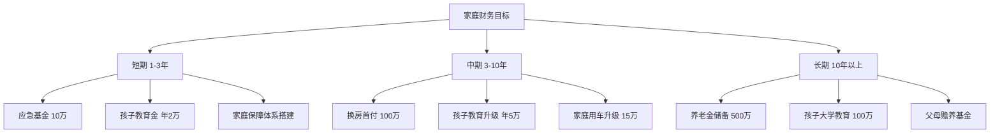
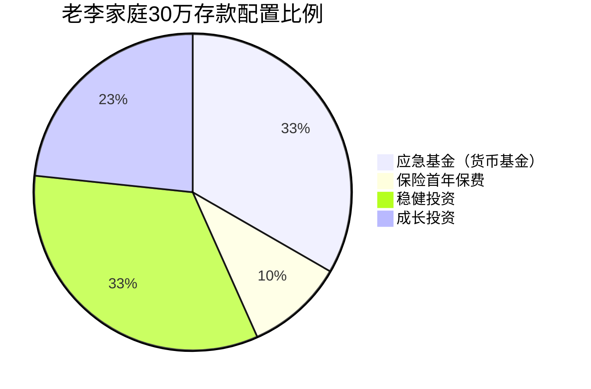
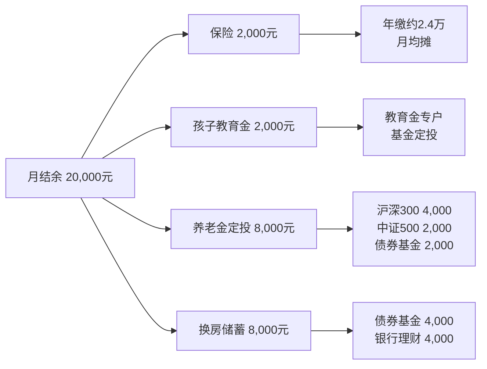
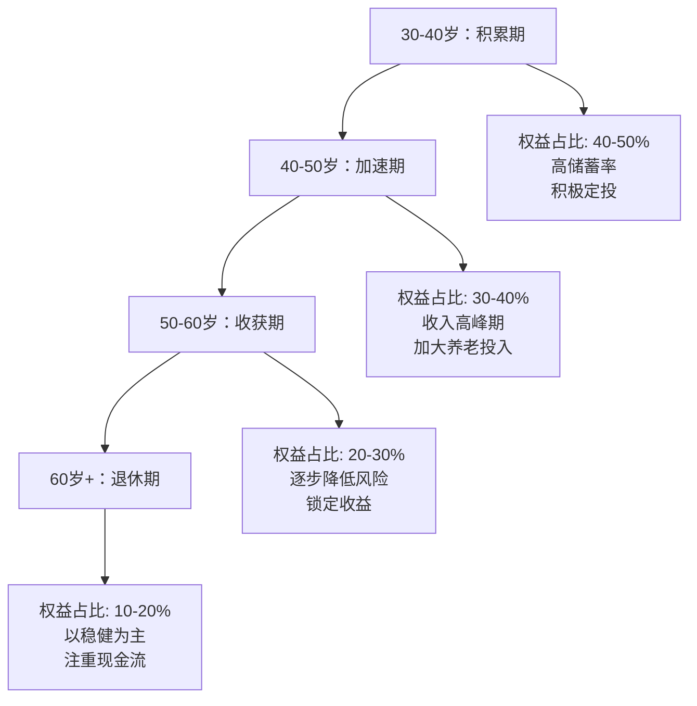
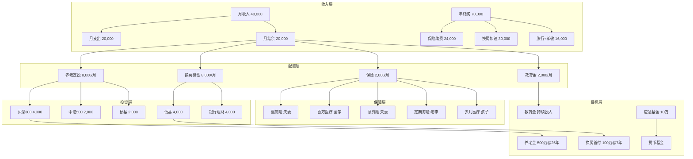

## 案例五：家庭资产配置的实践

> "家庭财务规划不是一个人的事，而是整个家庭的共同工程。" —— 苏茜·欧曼

前四个案例聚焦个人投资者——从零起步的小张、纠正错误的老王、目标导向的小李、以及完成思维转变的炒股者。但现实中，绝大多数投资决策发生在**家庭**这个最小经济共同体中。家庭资产配置比个人投资复杂得多：它需要同时满足多个人的需求、协调短期消费与长期积累的矛盾、在保障与增值之间找到平衡，还要处理夫妻之间可能存在的风险偏好差异。

本案例以老李一家为样本，完整展示一个典型中国中产家庭如何从零开始建立系统化的资产配置方案——从财务诊断、目标梳理、保障搭建、投资执行到年度再平衡的全生命周期管理。

---

### 一、家庭画像：老李一家是谁

#### 1.1 基本信息

| 维度 | 老李（丈夫） | 妻子 | 家庭合计 |
|------|-------------|------|----------|
| 年龄 | 35 岁 | 32 岁 | — |
| 职业 | 某制造企业中层管理 | 某教育机构行政主管 | 双薪家庭 |
| 月收入 | 税后 25,000 元 | 税后 15,000 元 | 40,000 元 |
| 年终奖 | 约 5 万 | 约 2 万 | 约 7 万/年 |
| 社保公积金 | 有（按中等基数缴纳） | 有 | — |
| 存款 | — | — | 30 万元（全部在银行活期/定期） |
| 房产 | 一套两居室（贷款已还清） | — | 市值约 150 万 |
| 车辆 | 一辆代步车（无贷款） | — | — |
| 孩子 | 3 岁，幼儿园小班 | — | — |

#### 1.2 家庭月度收支明细

| 类别 | 金额（元） | 占收入比 | 备注 |
|------|-----------|---------|------|
| **收入** | | | |
| 老李工资 | 25,000 | 62.5% | 税后到手 |
| 妻子工资 | 15,000 | 37.5% | 税后到手 |
| **合计收入** | **40,000** | **100%** | |
| **支出** | | | |
| 房贷 | 0 | 0% | 已还清 |
| 幼儿园+兴趣班 | 4,000 | 10% | 公立幼儿园+一个兴趣班 |
| 餐饮+食材 | 5,000 | 12.5% | 在家做饭为主 |
| 交通+油费 | 2,000 | 5% | 通勤+周末出行 |
| 水电物业+通讯 | 1,500 | 3.75% | — |
| 日用品+服装 | 2,000 | 5% | 非奢侈消费 |
| 社交+娱乐 | 2,000 | 5% | 聚餐、偶尔旅游 |
| 孝敬父母 | 2,000 | 5% | 双方父母各1,000 |
| 其他杂项 | 1,500 | 3.75% | 人情、医疗、临时开支 |
| **合计支出** | **20,000** | **50%** | |
| **月结余** | **20,000** | **50%** | 储蓄率 50%，属优秀水平 |

#### 1.3 家庭财务健康诊断

以下六项指标构成家庭财务健康度的完整评估框架。每一项都对应一个具体的风险维度，任何一项亮红灯都可能成为家庭财务的"定时炸弹"：

| 指标 | 计算公式 | 老李家庭 | 健康标准 | 评价 |
|------|---------|---------|---------|------|
| 储蓄率 | 月结余 ÷ 月收入 | 50% | >30% | ✅ 优秀 |
| 流动性比率 | 流动资产 ÷ 月支出 | 30万÷2万=15个月 | 3-6个月 | ⚠️ 过高，资金效率低 |
| 负债收入比 | 月还款额 ÷ 月收入 | 0 | <40% | ✅ 无负债 |
| 保险覆盖度 | 商业保险保额 ÷ 年收入 | 0（仅社保） | ≥年收入10倍 | ❌ 严重不足 |
| 投资回报率 | 年投资收益 ÷ 投资本金 | ≈2%（银行存款） | >CPI（约3%） | ❌ 实际购买力缩水 |
| 被动收入占比 | 被动收入 ÷ 总收入 | ≈1.5% | >30% | ❌ 几乎为零 |

**诊断结论：** 老李一家的财务状况属于"高储蓄、低效率"型——每月结余很多，但30万元全部躺在银行活期和低息定期里，实际年化收益不到2%，而同期CPI增速约2-3%，意味着**这笔钱的购买力在持续缩水**。同时，家庭没有任何商业保险，一旦老李（主要收入来源）遭遇重大疾病或意外，家庭财务将瞬间崩塌。这是一个典型的"有钱但没有理财"的中国中产家庭。

**为什么被动收入占比如此重要？** 被动收入（投资收益、租金、版税等不需要主动劳动就能获得的收入）占比越高，家庭财务越安全。当被动收入能够覆盖基本生活支出时，就实现了"财务自由"——即使失业或生病，家庭也不会陷入财务危机。老李家庭目前被动收入几乎为零，意味着一旦停止工作，家庭立刻断粮。

---

### 二、家庭财务目标：把模糊的期望变成可执行的数字

#### 2.1 目标梳理过程

老李夫妇坐下来做了一次正式的家庭财务会议。他们把所有"想做的事"列出来，然后按照时间维度和优先级进行分类：



#### 2.2 目标量化与优先级排序

| 优先级 | 目标 | 目标金额 | 时间节点 | 距今 | 风险容忍度 | 依据 |
|--------|------|---------|---------|------|-----------|------|
| P0 | 应急基金 | 10 万 | 立即 | 0 | 极低（必须保本） | 6个月家庭支出 |
| P0 | 保险保障 | 年缴 2.4-3 万 | 立即 | 0 | — | 转移大病/意外风险 |
| P1 | 孩子学前教育 | 年 2 万 | 持续 | — | 低 | 教育支出不可延期 |
| P2 | 换房首付 | 100 万 | 7年后 | 7年 | 中等 | 孩子上小学前换学区房 |
| P2 | 孩子基础教育 | 年 5 万 | 3-10年 | 3年 | 低 | 课外+学费增长 |
| P3 | 孩子大学教育 | 100 万 | 15年后 | 15年 | 中高 | 国内/留学储备 |
| P3 | 养老金 | 500 万 | 25年后 | 25年 | 中高 | 退休后维持生活水平 |
| P4 | 父母赡养 | 持续 | 持续 | — | 低 | 孝道义务 |

**为什么P0是保险而非储蓄？**

很多家庭的第一反应是"先把钱存起来"。但试想一个场景：老李不幸确诊重大疾病，治疗费用50万，收入中断6个月。此时30万存款全部用于治疗，家庭每月2万支出立刻断粮——孩子教育、父母赡养全部停摆。而如果老李提前配置了50万重疾险，保险公司直接赔付50万现金，存款可以完整保留用于家庭生活。

**保险的本质是用小额确定性支出（保费）转移大额不确定性损失（大病/意外）。** 在家庭资产配置中，保险是地基，投资是上层建筑。地基不稳，上层建筑越高越危险。

#### 2.3 资金需求测算

```text
目标总资金需求测算：

短期（1-3年）：
  应急基金：10 万（一次性，从现有30万中划出）
  保险保费：2.4 万/年 × 3年 = 7.2 万
  孩子教育：2 万/年 × 3年 = 6 万
  小计：23.2 万

中期（3-10年）：
  换房首付：100 万
  孩子教育：5 万/年 × 7年 = 35 万
  车辆升级：15 万
  小计：150 万

长期（10年以上）：
  孩子大学：100 万（15年后）
  养老金：500 万（25年后）
  小计：600 万

合计：约 773 万

现有资源：
  存款：30 万
  月结余：2 万（年结余 24 万 + 年终奖 7 万 ≈ 31 万/年）
  
→ 如果纯靠储蓄，需要 773 ÷ 31 ≈ 25 年
→ 但考虑通货膨胀，25年后773万的购买力可能只相当于今天的300万
→ 必须通过投资让资产增值，用复利效应缩短时间
```

#### 2.4 教育通胀：为什么教育金目标可能还不够

很多家庭低估了教育费用的增长速度。中国教育支出的通胀率远高于CPI，原因包括：课外培训费用上涨、国际化教育需求增加、优质教育资源的稀缺性推高价格。

| 教育阶段 | 当前年均费用（参考值） | 年通胀率估算 | 15年后费用（推算） |
|---------|-------------------|------------|------------------|
| 公立幼儿园 | 1-2 万 | 3% | 1.6-3.1 万 |
| 公立小学（含课外） | 3-5 万 | 5% | 6.2-10.4 万 |
| 公立初中（含课外） | 5-8 万 | 5% | 10.4-16.6 万 |
| 公立高中（含课外） | 6-10 万 | 5% | 12.5-20.8 万 |
| 国内大学 | 3-5 万 | 4% | 5.4-9.0 万 |
| 海外留学（美/英） | 30-50 万 | 4% | 54-90 万（总费用） |

老李为孩子大学教育储备100万，如果孩子在国内读大学绰绰有余；但如果考虑留学，以美国本科四年计算，15年后的总费用可能达到120-180万。**教育金规划必须提前明确"国内路线"还是"国际路线"，因为两者的资金需求相差3-5倍。**

---

### 三、家庭资产配置方案设计

#### 3.1 配置框架：标准普尔家庭资产象限图的中国化应用

国际上广泛使用的家庭资产配置参考框架是"标准普尔家庭资产象限图"（Standard & Poor's Family Asset Allocation），将家庭资产分为四个账户：

| 象限 | 名称 | 占比 | 用途 | 特点 |
|------|------|------|------|------|
| 第一账户 | 要花的钱 | 10% | 日常开销、应急 | 流动性极高，随取随用 |
| 第二账户 | 保命的钱 | 20% | 保险保障 | 专款专用，以小博大 |
| 第三账户 | 生钱的钱 | 30% | 高收益投资 | 重在收益，可承受波动 |
| 第四账户 | 保本升值的钱 | 40% | 稳健投资、养老/教育 | 重在安全，稳定增值 |

**需要注意：这个比例是参考值，不是铁律。** 老李一家的具体情况需要调整——他们无房贷，月结余率高达50%，可以将更多资金配置在第三和第四账户。以下是根据老李家庭实际情况调整后的方案。

#### 3.2 老李家庭的具体配置方案

**一次性配置（从30万存款中分配）：**



| 账户 | 金额 | 占比 | 具体配置 | 工具选择 | 预期年化 | 理由 |
|------|------|------|---------|---------|---------|------|
| 应急基金 | 10 万 | 33% | 6个月家庭支出 | 货币基金（如余额宝/零钱通） | 1.5-2.5% | 随时可取，T+0到账，保本 |
| 保险保障 | 3 万/年 | 10% | 首年保费（见3.3节详细方案） | 重疾+医疗+意外+寿险 | — | 转移家庭核心风险 |
| 稳健投资 | 10 万 | 33% | 中低风险增值 | 债券基金 5万 + 银行理财 5万 | 3-5% | 随时可取（债）或3-6个月（理财） |
| 成长投资 | 7 万 | 23% | 中高风险增值 | 沪深300指数基金 3.5万 + 中证500 2万 + 港股通基金 1.5万 | 7-12%（长期） | 3-5年以上不用的资金 |

**为什么应急基金要10万而不是6万？**

按月支出2万算，6个月应急是12万。但老李有孩子、有老人需要赡养，任何突发情况（失业、大病、老人住院）都可能需要额外支出。10万是"略低于6个月但覆盖核心风险"的平衡点。同时，由于老李家庭月结余率很高（50%），即使动用了部分应急基金，2-3个月就能补回来。

**应急基金的分层管理策略：**

10万应急基金不应该全部放在同一个地方。采用"三层缓冲"结构，兼顾流动性和收益：

| 层级 | 金额 | 工具 | 到账时间 | 年化收益 | 用途 |
|------|------|------|---------|---------|------|
| 第一层（即时可用） | 2 万 | 银行活期/微信零钱 | 秒到 | 0.2% | 当天就要用的钱 |
| 第二层（快速赎回） | 5 万 | 货币基金（余额宝/零钱通） | T+0（单日限额1万） | 1.5-2.5% | 1-3天内需要的钱 |
| 第三层（短期理财） | 3 万 | 短债基金/7天通知存款 | T+1 或 7天 | 2-3% | 1-2周内需要的钱 |

分层的核心逻辑：真正需要"秒到账"的紧急情况（如急诊押金）通常只需要1-2万，这部分放活期损失很小；其余资金可以放在收益更高的地方。

#### 3.3 保险保障方案详解

保险是家庭资产配置中**最容易被忽视但最关键**的环节。以下是老李一家的具体保险方案：

| 保险类型 | 被保人 | 保额 | 年缴保费 | 缴费期 | 产品类型 | 核心理由 |
|---------|--------|------|---------|--------|---------|---------|
| **重疾险** | 老李 | 50 万 | 约 8,000 元 | 20年 | 消费型（纯保障） | 家庭经济支柱，确诊即赔，覆盖治疗+收入损失 |
| **重疾险** | 妻子 | 30 万 | 约 4,500 元 | 20年 | 消费型 | 非主要收入来源但大病同样致命 |
| **百万医疗险** | 全家 | 200-400 万 | 约 2,000 元 | 年缴 | 一年期（可续保） | 覆盖社保外的高额医疗费用，1万免赔额 |
| **意外险** | 老李 | 100 万 | 约 300 元 | 年缴 | 一年期 | 意外身故/伤残赔付，杠杆率极高 |
| **意外险** | 妻子 | 50 万 | 约 200 元 | 年缴 | 一年期 | 同上 |
| **定期寿险** | 老李 | 100 万 | 约 1,500 元 | 20年 | 消费型 | 万一老李身故，赔付金可覆盖家庭10年生活 |
| **少儿医保+医疗** | 孩子 | 50 万 | 约 800 元 | 年缴 | 少儿专属 | 孩子生病住院的医疗保障 |
| **合计** | — | — | **约 17,300 元/年** | — | — | **占家庭年收入约 3.6%** |

**保险配置的核心原则：**

1. **先大人后小孩**：孩子生病有大人照顾和赚钱，大人生病全家断粮。老李（主要收入来源）的保障优先级最高。
2. **先保障后理财**：消费型保险（纯保障、无返还）的杠杆率远高于返还型。同样50万保额，消费型重疾险年缴8,000元，返还型可能要15,000元以上。多出来的7,000元拿去投资，20年后的收益远高于返还型"返还"的金额。
3. **保额要充足**：重疾险保额至少覆盖"治疗费+3年收入损失"。老李年收入30万，3年就是90万，加上治疗费30-50万，理想保额100万以上。但保费预算有限，先配50万，后续收入增长再加保。
4. **定期寿险是必需品**：很多家庭不买寿险，觉得"我又不会死"。但35岁正是事业高峰期，也是房贷、教育、赡养压力最大的时期。万一老李意外离世，100万定期寿险赔付可以让妻子有5-10年的缓冲期重新规划人生。

**为什么选消费型而非返还型？**

| 对比维度 | 消费型重疾险 | 返还型重疾险 |
|---------|-------------|-------------|
| 年缴保费（50万保额） | 约 8,000 元 | 约 15,000 元 |
| 20年总保费 | 16 万 | 30 万 |
| 保障期间 | 保障到70岁或终身 | 保障到70岁或终身 |
| 满期返还 | 不返还 | 返还已交保费30万 |
| 多出的7,000元如果投资 | 7,000 × 20年 × 年化7% ≈ **30万+** | — |
| 实际总收益 | 保障 + 投资收益约30万 | 保障 + 返还30万 |

看似返还型"不花钱"，实际上你多交的保费本身就是一笔投资，保险公司拿去投资赚了差价后把本金还给你。自己拿去投资，收益大概率更高。

**投保实操：健康告知与理赔要点**

很多人买了保险却在理赔时被拒，90%的原因出在**健康告知**环节。投保时必须注意：

| 环节 | 关键要点 | 常见错误 |
|------|---------|---------|
| 健康告知 | 问什么答什么，不问不答；如实告知既往病史 | 隐瞒体检异常（如结节、息肉），理赔时被拒 |
| 等待期 | 重疾险通常90-180天等待期内出险不赔 | 等待期内去体检发现问题，影响后续投保 |
| 免责条款 | 仔细阅读"不保什么" | 以为所有疾病都保，忽略了免责条款 |
| 理赔材料 | 保留所有就诊记录、检查报告、发票原件 | 材料丢失导致理赔困难 |
| 如实告知 | 中国保险法规定：故意不如实告知，保险公司有权解除合同并不退还保费 | 保险代理人说"不用告知"——这是违规操作 |

**实用建议：** 投保前先整理近5年的体检报告和就诊记录，逐一核对健康告知问卷。如果有异常指标（如甲状腺结节、乙肝携带等），选择智能核保或人工核保的产品，不同保险公司对同一健康异常的核保标准不同，可以多家对比。

#### 3.4 稳健投资配置详解

10万元稳健投资分为两部分，各有不同的定位：

**债券基金（5万元）：**

| 选择维度 | 具体要求 | 理由 |
|---------|---------|------|
| 基金类型 | 纯债基金（不投股票） | 波动小，最大回撤通常<3% |
| 基金规模 | 50亿以上 | 规模太小有清盘风险 |
| 管理费率 | <0.3% | 纯债基金收益本就不高，费率敏感 |
| 历史业绩 | 近3年年化3-5%，最大回撤<2% | 稳定性优先 |
| 推荐类型 | 短债基金或中长期纯债基金 | 短债更灵活，中长期收益略高 |

**银行理财（5万元）：**

| 选择维度 | 具体要求 | 理由 |
|---------|---------|------|
| 产品类型 | R2（稳健型）净值型理财 | R2风险等级适合保守配置 |
| 期限 | 3-6个月封闭期 | 收益比活期高，流动性可接受 |
| 预期收益 | 年化3-4% | 当前市场环境下合理预期 |
| 发行机构 | 国有大行或头部股份制银行 | 信用风险低 |

**重要提醒：** 2022年资管新规全面实施后，银行理财已经**不再保本保息**。R2级理财虽然风险较低，但在极端市场下仍可能出现短期亏损（如2022年底债市调整导致大量R2理财净值回撤）。老李需要理解：银行理财≠银行存款，它是投资产品，不是储蓄产品。

#### 3.5 成长投资配置详解

7万元成长投资的目标是长期增值，时间跨度5年以上，因此可以承受短期波动：

| 标的 | 金额 | 占比 | 选择理由 | 风险特征 |
|------|------|------|---------|---------|
| 沪深300指数基金 | 3.5 万 | 50% | 跟踪A股大盘蓝筹，长期年化8-10% | 与大盘同涨同跌，波动中等 |
| 中证500指数基金 | 2 万 | 29% | 中小盘成长股，弹性更大 | 波动大于沪深300，牛市弹性更强 |
| 港股通基金 | 1.5 万 | 21% | 分散A股单一市场风险，估值更低 | 受港股市场和汇率双重影响 |

**为什么选指数基金而非主动基金？**

指数基金费率低（管理费0.15-0.5%，主动基金1-1.5%）、透明度高（持仓就是指数成份股）、不受基金经理个人能力影响。长期来看，80%以上的主动基金跑不赢指数。对家庭投资者而言，指数基金是最省心、最可靠的选择。

**股债配置的核心逻辑——负相关性：**

老李家庭的7万成长投资和10万稳健投资之间存在"跷跷板效应"：当股市下跌时，资金通常流向债市避险，债券价格上涨；反之亦然。这种负相关性意味着：

```text
假设极端场景：

场景A：股市大跌20%
  沪深300：3.5万 × (-20%) = -7,000元
  中证500：2万 × (-25%) = -5,000元
  港股基金：1.5万 × (-15%) = -2,250元
  权益合计亏损：-14,250元
  
  但同期债券基金可能上涨3-5%：
  债券基金：5万 × (+4%) = +2,000元
  
  → 股债组合的总亏损约为 -12,250元（而非 -14,250元）
  → 债券的上涨缓冲了股票的下跌

场景B：牛市上涨30%
  权益合计收益：约 +18,900元
  债券基金可能下跌1%：-500元
  → 股债组合总收益约 +18,400元
```

这就是为什么"不要把所有鸡蛋放在一个篮子里"不仅仅是分散风险，更是利用不同资产之间的负相关性来平滑整体收益曲线。

---

### 四、每月投资计划：让钱自动流向正确的方向

#### 4.1 月度资金分配方案

老李家庭月结余2万元，年终奖约7万元/年（折合月均约5,800元）。综合计算，每月可支配投资资金约2.5万元。但为保守起见，先按月结余2万元做计划，年终奖作为"超额储蓄"单独安排。



| 分配项 | 月投入 | 年投入 | 投资工具 | 目标账户 | 对应目标 |
|--------|--------|--------|---------|---------|---------|
| 保险保费 | 2,000 元 | 24,000 元 | 年缴（自动扣款） | 保险账户 | 家庭保障 |
| 孩子教育金 | 2,000 元 | 24,000 元 | 教育金保险或指数基金定投 | 教育账户 | 学前+基础教育 |
| 养老金定投 | 8,000 元 | 96,000 元 | 沪深300(4K)+中证500(2K)+债基(2K) | 养老账户 | 长期增值 |
| 换房储蓄 | 8,000 元 | 96,000 元 | 债券基金(4K)+银行理财(4K) | 换房账户 | 中期稳健增值 |
| **合计** | **20,000 元** | **240,000 元** | | | |

#### 4.2 年终奖的处理方案

年终奖约7万元，建议按以下方案处理：

| 用途 | 金额 | 比例 | 理由 |
|------|------|------|------|
| 保险续费 | 2.4 万 | 34% | 确保全年保费无忧 |
| 换房首付加速 | 3 万 | 43% | 一次性追加到换房账户 |
| 旅行基金 | 1 万 | 14% | 家庭生活品质不能忽视 |
| 孝敬父母 | 0.6 万 | 9% | 过年给双方父母红包 |
| **合计** | **7 万** | **100%** | |

#### 4.3 教育金配置的两种路径对比

教育金是家庭理财中最具争议的话题之一。市场上有"教育金保险"和"基金定投"两种主流方案，老李需要了解两者的本质差异：

| 对比维度 | 教育金保险 | 指数基金定投 |
|---------|-----------|-------------|
| 本质 | 保险公司的储蓄产品（低息存款+保障） | 自主投资（收益取决于市场） |
| 预期收益 | 年化约 2-3%（保证利率） | 年化约 6-8%（长期，不保证） |
| 流动性 | 差（提前退保亏损） | 好（随时可赎回） |
| 保障功能 | 有（投保人身故豁免保费） | 无 |
| 灵活性 | 低（缴费金额和期限固定） | 高（随时调整金额） |
| 适合人群 | 极度保守、担心自己中途断缴的人 | 能承受波动、追求更高收益的人 |

**建议：** 老李家庭收入稳定、储蓄率高，建议采用"基金定投为主+少量教育金保险为辅"的策略。教育金保险的核心价值在于"投保人豁免"——万一老李出事，保险公司替孩子继续交教育金。这个功能值得用少量保费锁定，但不要把大部分教育金放在保险里。

#### 4.4 自动化执行系统

投资计划最难的不是"制定"而是"执行"。老李需要建立一套自动化系统，让投资像交水电费一样不需要意志力：

```text
自动化执行清单：

每月 10 日（发工资日）：
├── 工资到账 → 自动转入货币基金（应急基金）
├── 系统自动检查：应急基金是否低于10万
│   ├── 低于 → 从活期转入补齐
│   └── 正常 → 不操作
│
每月 15 日：
├── 自动扣款 2,000 元 → 保险账户（年缴时统一划转）
├── 自动扣款 2,000 元 → 教育金定投
├── 自动扣款 4,000 元 → 沪深300指数基金（养老）
├── 自动扣款 2,000 元 → 中证500指数基金（养老）
├── 自动扣款 2,000 元 → 债券基金（养老）
├── 自动扣款 4,000 元 → 债券基金（换房）
└── 自动扣款 4,000 元 → 银行理财（换房）

执行要点：
1. 所有定投设置为「自动扣款」，不需要手动操作
2. 发工资后第二天自动执行，避免钱在活期账户被消费掉
3. 每月只查看一次账户总览，不盯盘
4. 任何调整只在年度再平衡时进行
```

---

### 五、五年后的资产预测

#### 5.1 基于不同市场情景的测算

投资收益是不确定的，但我们可以基于不同假设做出合理区间预测：

**假设条件：**

| 变量 | 保守情景 | 中性情景 | 乐观情景 |
|------|---------|---------|---------|
| 指数基金年化 | 5% | 8% | 12% |
| 债券基金年化 | 3% | 4% | 5% |
| 银行理财年化 | 3% | 3.5% | 4% |
| 月投入 | 2 万 | 2 万 | 2 万 |
| 年终奖追加 | 4.6 万/年 | 4.6 万/年 | 4.6 万/年 |

**中性情景下的五年资产增长（最可能情况）：**

```text
初始资产：30万（存款）
五年累计投入：2万×60个月 + 4.6万×5年年终奖 = 120万 + 23万 = 143万

五年后各项资产预测：

应急基金：
  初始：10万
  五年后：12万（保持10-12万，略有增长）
  
保险保障：
  五年累计保费：约12万
  保障状态：持续有效，保额覆盖家庭核心风险

稳健投资（养老账户债券部分+换房账户）：
  初始：10万
  月投入：8,000元（养老债基2K+换房债基4K+换房理财4K）
  五年后：约 65-70万

成长投资（养老账户权益部分）：
  初始：7万
  月投入：6,000元（沪深300 4K+中证500 2K）
  五年后：约 50-60万

孩子教育金：
  月投入：2,000元
  五年后：约 14-16万

────────────────────────────────────
五年后总资产（不含房产、车辆）：
  保守：约 130万
  中性：约 155万
  乐观：约 180万

对比纯储蓄方案（不做投资）：
  纯储蓄：30万 + 143万 = 173万（名义值）
  但扣除5年通胀（约12-15%），实际购买力约 148-152万

中性投资方案的155万 + 保险保障 ≈ 优于纯储蓄方案
而且投资方案的资产在继续产生复利，差距会随时间越拉越大
```

#### 5.2 各目标达成进度

| 目标 | 目标金额 | 五年后进度 | 状态 |
|------|---------|-----------|------|
| 应急基金 | 10 万 | 12 万 | ✅ 已完成 |
| 保险保障 | 持续缴费 | 五年累计12万保费 | ✅ 保障体系已建立 |
| 孩子教育金 | 持续投入 | 约 15 万 | ✅ 进度正常 |
| 换房首付 | 100 万 | 约 55-65 万 | 📌 进度60%，还需3年 |
| 养老金 | 500 万 | 约 40-50 万（仅5年投入） | 📌 长期目标，进度正常 |

---

### 六、年度再平衡：保持配置不跑偏

#### 6.1 什么是再平衡？

投资组合运行一段时间后，由于不同资产涨跌幅度不同，实际比例会偏离最初设定的目标比例。例如，老李设定股票基金占成长投资的60%，但一年后股市大涨，股票基金占比变成了70%——这意味着他的风险敞口比计划的更高。

**再平衡就是定期把各资产比例调回到目标值的操作。** 它本质上是一种"高卖低买"的纪律性操作——卖掉涨得多的（高位减仓），买入涨得少或跌了的（低位加仓）。

**再平衡的数学原理：**

假设初始配置为股票60%、债券40%。一年后股票涨30%、债券涨5%：

```text
初始：股票 6万 + 债券 4万 = 10万（60:40）
一年后：股票 7.8万 + 债券 4.2万 = 12万
实际比例：股票 65% + 债券 35%

再平衡操作：卖出 0.6万股票，买入 0.6万债券
再平衡后：股票 7.2万 + 债券 4.8万 = 12万（60:40）

效果：在股票高位减仓了0.6万，在债券低位加仓了0.6万
→ 本质上是"止盈+抄底"的自动化纪律
```

#### 6.2 老李家庭的年度再平衡流程

```text
每年1月（建议在春节前完成）：

第一步：资产盘点
  ├── 登录各账户，记录每项资产的当前市值
  ├── 计算各项资产占总资产的实际比例
  └── 与目标比例对比，找出偏离项

第二步：偏离度判断
  ├── 偏离 <5%：不需要调整
  ├── 偏离 5-10%：下次定投时调整方向（增量调整）
  └── 偏离 >10%：立即进行再平衡（存量调整）

第三步：执行调整
  ├── 卖出占比过高的资产
  ├── 买入占比过低的资产
  ├── 注意赎回费和申购费的影响
  └── 利用定投金额调整而非一次性买卖（减少交易成本）

第四步：生活变化审查
  ├── 收入是否变化？→ 调整定投金额
  ├── 家庭成员是否变化？→ 调整保险和教育金
  ├── 目标是否变化？→ 调整配置策略
  └── 风险承受力是否变化？→ 调整股债比例

第五步：保险审查
  ├── 保障是否充足？→ 是否需要加保
  ├── 产品是否过时？→ 是否有更好的替代产品
  └── 缴费是否正常？→ 避免保单失效
```

#### 6.3 再平衡的实操示例

假设一年后老李的家庭投资账户情况如下：

| 资产 | 目标比例 | 目标金额 | 实际市值 | 实际比例 | 偏离 | 操作 |
|------|---------|---------|---------|---------|------|------|
| 沪深300 | 24% | 24 万 | 28 万 | 28% | +4% | 下次定投减少 |
| 中证500 | 12% | 12 万 | 11 万 | 11% | -1% | 不调整 |
| 港股基金 | 8% | 8 万 | 7 万 | 7% | -1% | 不调整 |
| 债券基金 | 33% | 33 万 | 32 万 | 32% | -1% | 不调整 |
| 银行理财 | 17% | 17 万 | 18 万 | 18% | +1% | 不调整 |
| 货币基金 | 6% | 6 万 | 4 万 | 4% | -2% | 从年终奖补入 |

结论：所有偏离均<5%，无需进行存量再平衡，仅在后续定投中微调方向即可。

---

### 七、夫妻投资分歧：最容易被忽视的家庭财务风险

#### 7.1 分歧的典型场景

家庭投资中最大的风险不是市场波动，而是**夫妻之间的投资分歧**。老李和妻子可能在以下场景产生冲突：

| 场景 | 老李的想法 | 妻子的想法 | 潜在冲突 |
|------|----------|----------|---------|
| 股市大跌30% | "加仓！便宜了！" | "快卖掉！再跌怎么办！" | 恐慌卖出 vs 逆势加仓 |
| 朋友推荐高收益产品 | "试试看，收益很高" | "骗子吧，别碰" | 贪婪 vs 恐惧 |
| 孩子教育金不够 | "股票赚了先拿出来" | "不动，那是养老的钱" | 短期需求 vs 长期目标 |
| 换房时机 | "再等等，房价还会跌" | "孩子要上学了，必须换" | 投资判断 vs 生活刚需 |

#### 7.2 建立夫妻投资共识的五步法

**第一步：共同学习**

在开始投资之前，夫妻双方应该一起读1-2本基础理财书（如《小狗钱钱》《富爸爸穷爸爸》），建立共同的知识基础。不需要成为专家，但需要对"风险和收益的关系""复利的力量""为什么要分散投资"这些核心概念有一致理解。

**第二步：风险承受力测试**

分别做一份风险承受力评估问卷，对比两人的结果。如果差异较大（如一个是进取型、一个是保守型），取中间值作为家庭整体风险偏好。

```text
简易风险承受力评估：

1. 投资亏损10%时，你会？
   A. 立刻卖掉（保守型 -2分）
   B. 焦虑但不卖（稳健型 0分）
   C. 加仓（进取型 +2分）

2. 这笔钱多久不用？
   A. 1年内要用（保守型 -2分）
   B. 3-5年（稳健型 0分）
   C. 5年以上（进取型 +2分）

3. 如果投资翻倍和亏损50%的概率各半，你会？
   A. 不参与（保守型 -2分）
   B. 投一小部分（稳健型 0分）
   C. 投大部分（进取型 +2分）

得分：
  -6 ~ -3：保守型 → 股债比例 20:80
  -2 ~ +2：稳健型 → 股债比例 50:50
  +3 ~ +6：进取型 → 股债比例 70:30
```

**第三步：划定"决策权限"**

明确哪些投资决策需要双方同意，哪些可以单方面决定：

| 决策类型 | 权限 | 举例 |
|---------|------|------|
| 日常定投执行 | 单方面可执行 | 按计划扣款，不需要每次商量 |
| 调整定投金额（±20%以内） | 单方面可执行 | 临时多投/少投几千元 |
| 调整配置比例 | 双方协商 | 从股债50:50改为60:40 |
| 新增投资品种 | 双方同意 | 想买黄金/比特币/P2P |
| 超过月收入10%的单笔投资 | 双方同意 | 一次性投入5万买基金 |
| 动用应急基金 | 双方同意 | 任何非紧急用途的动用 |

**第四步：设立"冷却期"**

任何新增投资想法，必须经过48小时冷却期。冲动是投资的大敌，而夫妻一方的冲动往往会演变为两人的争吵。48小时后还觉得有必要，再坐下来讨论。

**第五步：定期"家庭财务约会"**

每季度安排一次"家庭财务约会"——选一个轻松的环境（如咖啡厅），花30-60分钟回顾投资情况、讨论下一步计划。关键规则：

- 不在投资亏损时讨论（情绪化）
- 不在疲惫时讨论（效率低）
- 用数据说话，不用"我觉得"
- 先肯定对方的贡献，再提出不同意见

---

### 八、市场暴跌时的家庭应急预案

#### 8.1 暴跌场景模拟

投资计划执行过程中，市场暴跌是必然发生的事件。以下是对老李家庭投资组合的极端压力测试：

```text
极端场景：全球金融危机级别暴跌（类似2008年或2020年3月）

假设：一个月内股市暴跌40%，债券下跌5%

老李投资组合（假设已运行3年，总资产约100万）：

暴跌前：
  股票基金：35万（35%）
  债券基金：30万（30%）
  银行理财：20万（20%）
  货币基金：10万（10%）
  教育金：5万（5%）
  合计：100万

暴跌后：
  股票基金：35万 × 60% = 21万（亏损14万）
  债券基金：30万 × 95% = 28.5万（亏损1.5万）
  银行理财：20万 × 98% = 19.6万（亏损0.4万）
  货币基金：10万（不变）
  教育金：5万 × 70% = 3.5万（亏损1.5万）
  合计：82.6万（总亏损17.4万，-17.4%）

→ 账面浮亏17.4万，但：
  - 应急基金10万完好无损
  - 每月2万收入不受影响
  - 保险保障不受影响
  → 家庭基本面没有动摇
```

#### 8.2 暴跌时的行动清单

| 时间节点 | 行动 | 具体操作 | 心理目标 |
|---------|------|---------|---------|
| 暴跌当天 | **不做任何操作** | 关闭交易APP，不看账户 | 避免恐慌性卖出 |
| 暴跌1周内 | 夫妻沟通 | 坐下来回顾配置方案，确认计划未变 | 彼此支持，统一行动 |
| 暴跌1个月内 | 检查定投 | 确认自动扣款正常执行（定投在低位买入更多份额） | 理解"定投天然适合下跌" |
| 暴跌3个月后 | 评估偏离度 | 如果股债比例偏离>10%，考虑再平衡 | 纪律性操作 |
| 暴跌6个月后 | 年度回顾 | 评估是否需要调整长期目标 | 回归理性分析 |

**暴跌时的三个绝对禁止：**

1. **禁止恐慌性卖出**：历史数据显示，股市暴跌后卖出的投资者，90%以上错过了随后的反弹。2020年3月暴跌后，A股在6个月内收复全部失地并创新高。
2. **禁止借钱抄底**：用杠杆抄底是散户最致命的操作。如果市场继续下跌20%，杠杆投资者会爆仓血本无归。
3. **禁止改变长期计划**：暴跌是短期事件，养老金是25年的事。一次暴跌在25年的投资长河中只是一个浪花。

**暴跌时的唯一正确操作：坚持定投。** 定投的数学原理决定了，市场下跌时同样的金额能买入更多份额，等市场回升后这些"便宜份额"会带来超额收益——这就是"微笑曲线"。

---

### 九、不同人生阶段的配置调整

家庭资产配置不是一成不变的。随着年龄增长、收入变化、孩子成长，配置策略需要动态调整：



| 生命阶段 | 老李当前（35岁） | 45岁时调整 | 55岁时调整 |
|---------|----------------|-----------|-----------|
| 权益类占比 | 35% | 30% | 20% |
| 债券/理财占比 | 45% | 45% | 50% |
| 现金类占比 | 10% | 10% | 15% |
| 保险占比 | 10% | 8% | 5%（保额可降低） |
| 定投重点 | 养老+换房 | 纯养老 | 保本增值 |
| 风险偏好 | 中等 | 中等偏低 | 保守 |

**关键转折点：**

- **40岁**：孩子进入小学，教育支出上升，但收入也在增长。此时应加大养老金定投，因为距离退休还有20年，复利效应仍然显著。
- **50岁**：孩子上大学，教育金开始消耗。此时应逐步降低权益比例，将前期的股票基金收益锁定到债券和理财中。
- **55岁**：距离退休5年，应该确保退休时的资产配置以稳健为主（债券+理财占比60%以上），避免退休时遭遇市场暴跌。
- **60岁退休**：投资目标从"增值"转变为"保值+产生现金流"。高分红股票、债券基金、年金保险成为主要配置方向。

---

### 十、常见误区与纠正

#### 误区一：家庭存款越多越好

**错误表现：** 老李的30万全部在银行活期/定期，觉得"有存款心里踏实"。

**纠正：** 存款超过6个月支出的部分，实际上在**每天亏钱**。假设通胀率3%，银行活期利率0.2%，30万存款一年的实际购买力损失约：

```text
名义利息：30万 × 0.2% = 600 元
通胀损失：30万 × 3% = 9,000 元
实际损失：9,000 - 600 = 8,400 元/年

→ 每年"亏"掉一个名牌包
→ 10年后30万的实际购买力只剩约22万
```

#### 误区二：保险是骗人的，不如自己存钱

**错误表现：** "我每年存3万进银行，20年后有60万，比买保险强。"

**纠正：** 如果第3年确诊重疾需要50万治疗费，你存了9万，缺口41万从哪来？保险的杠杆作用在于：交了第一年保费8,000元后，确诊就能拿到50万。**保险解决的是"钱不够时的风险"，不是"钱够了后的增值"。**

#### 误区三：夫妻各自管各自的钱

**错误表现：** 老李管自己的工资，妻子管自己的工资，家庭开支AA。

**纠正：** 家庭是一个经济共同体。各自管钱会导致：重复配置保险、资金效率低下、无法实现家庭整体最优。建议设立一个"家庭财务联合账户"，每月各自按收入比例（62.5%:37.5%）注入资金，统一管理投资和大额支出。

#### 误区四：孩子的教育金要用教育金保险来存

**错误表现：** 保险代理人推荐教育金保险，说"存够XX万，孩子上大学不用愁"。

**纠正：** 教育金保险的内部收益率（IRR）通常只有2-3%，甚至低于国债收益率。它的"保证"二字是用极低的收益换来的。用同样的钱做指数基金定投，15年后的预期金额可能是教育金保险的1.5-2倍。唯一值得购买教育金保险的场景是"投保人豁免"功能——万一老李出事，保险公司替孩子继续交费。

#### 误区五：等有钱了再开始投资

**错误表现：** "现在钱不多，等存够50万再开始投资。"

**纠正：** 投资的核心优势是**时间复利**。假设年化收益8%：

| 开始年龄 | 月投入 | 60岁时资产 |
|---------|--------|-----------|
| 35岁开始 | 5,000 元 | 约 530 万 |
| 40岁开始 | 5,000 元 | 约 345 万 |
| 45岁开始 | 5,000 元 | 约 217 万 |

晚5年开始，最终资产少了约185万——这不是5年少投30万的问题，而是损失了30万在25年里的复利增长。**最好的投资时间是十年前，其次是现在。**

#### 误区六：投资了就不用管了

**错误表现：** 设好定投后完全不管，三年不看账户。

**纠正：** 虽然不建议频繁操作，但完全不管也不行。需要关注的情况包括：基金清盘风险、基金经理更换、家庭财务目标变化、保险续费、市场极端波动（如2020年3月、2022年4月）时的心理建设。建议**每季度花30分钟查看一次账户总览，每年做一次全面再平衡。**

#### 误区七：追求"高收益"产品

**错误表现：** "同事买的那个产品年化15%，我也要买。"

**纠正：** 任何承诺年化收益超过10%的"理财产品"都要高度警惕。金融市场的铁律是**收益与风险成正比**。年化15%意味着承担亏掉全部本金的风险。P2P暴雷、信托违约、私募跑路的案例数不胜数，受害者大多是追求"高收益低风险"的普通家庭。

**识别骗局的三个信号：**

1. 承诺"保本保息"且收益超过6%——资管新规后所有理财产品都不允许保本保息
2. 需要"拉人头"才能获得更高收益——传销特征
3. 说不清楚钱投向了哪里——信息不透明

#### 误区八：盲目跟风买房

**错误表现：** "同事都买了学区房，我们也赶紧买。"

**纠正：** 买房是家庭最大的一笔投资决策，需要冷静计算而非跟风。老李在考虑换房时需要评估：

| 评估维度 | 计算方式 | 老李的情况 |
|---------|---------|-----------|
| 首付资金 | 是否充足？是否需要借？ | 目标100万，7年后达成 |
| 月供压力 | 月供不超过月收入30% | 100万房贷30年月供约5,000元，在安全范围内 |
| 机会成本 | 首付100万如果不买房能赚多少？ | 年化8%投资，7年后约170万 |
| 流动性风险 | 房产变现周期长（3-6个月） | 紧急情况可能无法快速变现 |

---

### 十一、进阶优化：从及格到优秀

#### 11.1 税务优化

老李可能不知道，投资收益也涉及税务问题。以下是需要了解的税务知识：

| 投资品 | 税种 | 税率 | 优化建议 |
|--------|------|------|---------|
| 银行存款利息 | 个人所得税 | 20%（目前暂免征收） | 关注政策变化 |
| 基金分红 | 个人所得税 | 目前暂免 | 选择红利再投资 |
| 基金赎回收益 | 个人所得税 | 目前暂免 | — |
| 股票分红 | 个人所得税 | 持有>1年免税 | 长期持有享受免税 |
| 房产交易 | 增值税+个税 | 复杂 | 满五唯一可免增值税和个税 |

**实用建议：** 基金投资目前在中国享受较宽松的税收政策。但随着税制改革推进，未来可能调整。建议在当前政策窗口期充分利用免税优势。

**个税专项附加扣除：** 老李家庭可以申报以下扣除项来减少税负：

| 扣除项 | 每月扣除额 | 适用条件 | 老李家庭可否享受 |
|--------|----------|---------|---------------|
| 子女教育 | 2,000元/每个子女 | 3岁至博士毕业 | ✅ 孩子3岁已上幼儿园 |
| 继续教育 | 400元（学历）或3,600元/年（证书） | 在学或取得证书 | 视情况而定 |
| 住房贷款利息 | 1,000元 | 首套房贷 | ❌ 已还清 |
| 赡养老人 | 3,000元 | 父母≥60岁 | 视父母年龄而定 |
| 3岁以下婴幼儿照护 | 2,000元/每个婴幼儿 | 3岁以下 | ❌ 孩子已满3岁 |

#### 11.2 家庭信用管理

良好的信用记录是家庭财务健康的"隐形资产"：

- **信用卡：** 办理1-2张信用卡，每月全额还款，积累信用记录
- **征信报告：** 每年免费查询2次个人征信报告（通过中国人民银行征信中心），检查是否有异常记录
- **贷款能力：** 即使当前不需要贷款，保持良好的信用记录可以在换房时获得更低的贷款利率。100万房贷，利率差0.5%，30年总利息差约10万

**信用管理的红线：**

| 行为 | 影响程度 | 恢复时间 |
|------|---------|---------|
| 逾期1-30天 | 轻微（部分银行不上报） | 还清后1个月 |
| 逾期30-90天 | 中度（征信记录保留5年） | 还清后5年 |
| 逾期90天以上 | 严重（可能被列入黑名单） | 还清后5年，期间贷款困难 |
| 为他人担保 | 高风险（被担保人违约你也受影响） | 担保解除后5年 |

#### 11.3 遗产规划基础

很多中国家庭忌讳谈"身后事"，但遗产规划是负责任的家庭资产配置不可或缺的一环。

**为什么需要遗产规划？**

假设老李意外离世，没有遗嘱：

- 30万存款、房产等按照法定继承分配：妻子、孩子、老李父母各得一份
- 老李父母如果年迈，可能无法处理复杂的继承手续
- 妻子需要证明哪些是夫妻共同财产，哪些是老李个人财产
- 银行存款需要公证后才能取出，手续可能耗时数月

**老李家庭需要做的三件事：**

| 事项 | 具体操作 | 成本 | 重要性 |
|------|---------|------|--------|
| 立遗嘱 | 到公证处立公证遗嘱，明确财产分配意愿 | 500-2,000元 | ⭐⭐⭐⭐⭐ |
| 整理财产清单 | 记录所有账户、保险单、房产证等信息，存放在安全位置 | 0 | ⭐⭐⭐⭐⭐ |
| 指定受益人 | 确认所有保险单的受益人已明确指定（而非"法定"） | 0 | ⭐⭐⭐⭐⭐ |

**保险受益人的重要性：** 如果重疾险/寿险的受益人填的是"法定"，理赔金将作为遗产分配——可能涉及继承纠纷、债务清偿等问题。明确指定"妻子"为受益人，理赔金直接打入妻子账户，不属于遗产，不参与债务清偿。

#### 11.4 家庭财务仪表盘

建议老李建立一个简单的家庭财务仪表盘，每月更新一次：

```text
家庭财务仪表盘（每月更新）

┌─────────────────────────────────────────────────┐
│  净资产总值：¥ ___________                      │
│  较上月变化：¥ ___________ (  __%)              │
│  本月储蓄率：____%                              │
│  保险覆盖率：____%                              │
│  投资收益率（年化）：____%                       │
│  距换房目标进度：____%                           │
│  距养老目标进度：____%                           │
└─────────────────────────────────────────────────┘

记录方式：
  - Excel/Google Sheets 自建表格
  - 记账APP（随手记、钱迹等）
  - 最简单：每月15日花10分钟手写记录
```

#### 11.5 突发事件的资金应急预案

家庭财务计划需要为"黑天鹅"事件预留应对空间：

| 突发事件 | 影响 | 应急方案 | 资金来源 |
|---------|------|---------|---------|
| 老李失业 | 月收入减少25,000元 | 削减非必要支出至1.5万/月 | 应急基金（可支撑6-8个月） |
| 重大疾病 | 治疗费30-50万 | 重疾险赔付50万+百万医疗报销 | 保险赔付 |
| 父母重病 | 赡养费增加 | 暂停换房储蓄，优先赡养 | 调整定投计划 |
| 房屋重大维修 | 维修费5-10万 | 从应急基金支出 | 应急基金 |
| 经济衰退（双方降薪20%） | 月收入降至32,000元 | 降低定投金额至1.5万 | 削减非核心投资 |

---

### 十二、关键经验总结

老李一家的案例展示了一个完整家庭资产配置的全过程。以下是可以直接复用的核心经验：

**原则层面：**

1. **先保障后投资**——保险是家庭财务的基石，没有保险的投资是在"裸奔"
2. **目标导向**——每个账户对应一个明确目标，不做"为了投资而投资"的无效操作
3. **分账户管理**——不同目标、不同时间、不同风险容忍度，必须分账户管理
4. **自动化执行**——设好自动定投后删除APP，用纪律对抗人性

**操作层面：**

5. **储蓄率>投资收益率**——对大多数家庭来说，提高储蓄率（少花钱/多赚钱）比追求高收益率更重要、更可控
6. **应急基金先行**——没有应急基金，任何突发情况都会被迫中断投资计划
7. **定期再平衡**——每年花半天时间做一次再平衡，长期效果显著优于"买了不管"
8. **夫妻共识**——投资决策必须夫妻达成一致。一个人偷偷投资，亏了会被埋怨，赚了也得不到认可

**心态层面：**

9. **不追求完美**——"差不多对"的方案立刻执行，远好于"完美方案"永远在纸上
10. **接受不确定性**——投资收益不可能精确预测，但"有计划地投资"一定好于"没有计划地存钱"
11. **为暴跌做准备**——市场暴跌不是"会不会来"的问题，而是"什么时候来"的问题。提前制定应急预案，暴跌时就不会恐慌
12. **长期主义**——家庭财务是一场25年的马拉松，不是25天的短跑。短期波动是噪音，长期趋势才是信号

---

### 十三、对照自查清单

在参考本案例制定自己家庭的资产配置方案时，逐项检查以下清单：

```text
家庭资产配置自查清单

□ 家庭财务目标是否已量化（具体金额+时间节点）？
□ 应急基金是否已覆盖 6 个月家庭支出？
□ 家庭经济支柱是否配置了足额的重疾险+定期寿险？
□ 全家是否配置了百万医疗险和意外险？
□ 保险年缴保费是否控制在家庭年收入的 5-10%？
□ 保险受益人是否已明确指定（非"法定"）？
□ 是否为不同目标设立了独立的投资账户？
□ 短期目标（<3年）是否使用了低风险工具？
□ 长期目标（>10年）是否配置了足够的权益类资产？
□ 是否设置了自动定投？
□ 是否建立了年度再平衡机制？
□ 夫妻双方是否对投资方案达成共识？
□ 是否建立了定期（季度/年度）财务审查习惯？
□ 是否了解极端市场下跌时的应对预案？
□ 是否立了遗嘱并整理了财产清单？
□ 是否充分利用了个税专项附加扣除？
```

如果以上16项中有3项以上未勾选，说明家庭的资产配置方案还有明显的优化空间。建议从P0优先级（应急基金+保险）开始，逐步完善。

---

### 附录：老李家庭资产配置全景图


