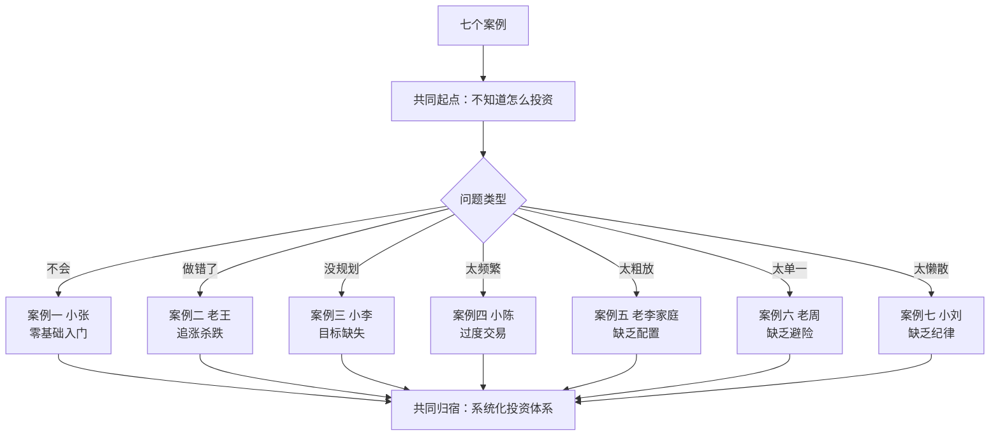
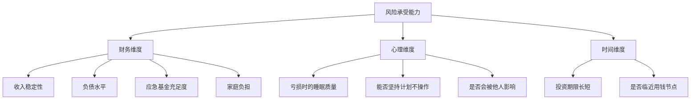
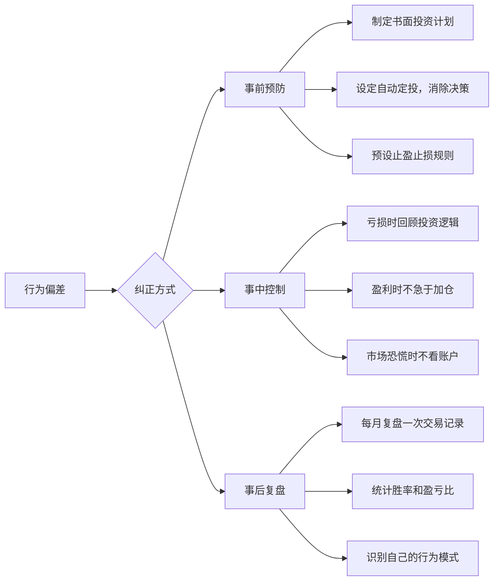
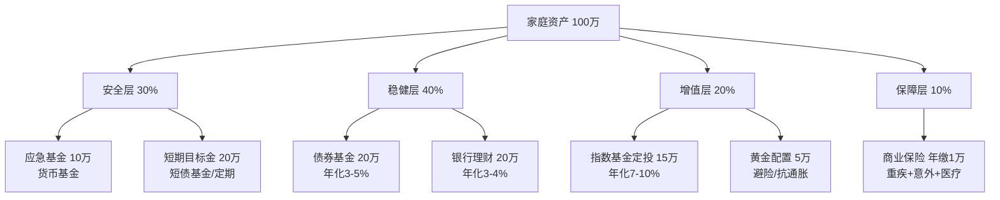
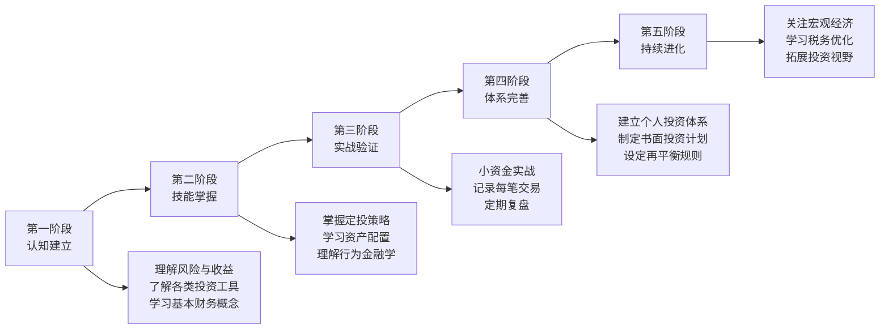
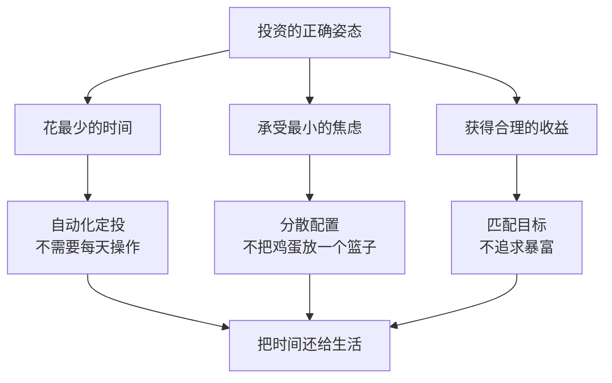

## 从这些案例中我们可以学到什么

> "经验不是发生在你身上的事，而是你如何处理发生在你身上的事。" —— 阿道斯·赫胥黎

前面七个案例，覆盖了投资理财中最常见的七种典型场景：零基础入门、纠正错误、目标导向、思维转变、家庭配置、避险策略、定期再平衡。这些案例的主角背景不同、起点不同、目标不同，但他们身上暴露出来的问题和走过的弯路，却有着惊人的相似性。

本章不是简单地重复每个案例的内容，而是**从中提炼出可迁移的通用原则**——无论你是谁、有多少钱、处于什么阶段，这些原则都适用。

---

### 一、七个案例的全景回顾

在深入分析之前，先用一张表把七个案例的核心信息拉齐，方便对比：

| 案例 | 主角 | 核心问题 | 关键转折 | 最终状态 | 核心教训 |
|------|------|---------|---------|---------|---------|
| 案例一 | 小张（26岁） | 零基础，不敢投资 | 系统学习+建立应急基金 | 建立定投体系，年化约8% | 先学后做，定投入门 |
| 案例二 | 老王（40岁） | 追涨杀跌，亏损15万 | 学习行为金融学+制定配置方案 | 年化约6.5%，心态平稳 | 认识偏差，系统纠正 |
| 案例三 | 小李（28岁） | 有目标但不知道如何规划 | 目标拆解+反推月投入 | 多目标并行推进 | 目标导向，先算后投 |
| 案例四 | 小陈（35岁） | 频繁交易，越忙越亏 | 量化交易成本+思维转变 | 年化约7%，每天只花10分钟 | 炒股≠投资，少动多看 |
| 案例五 | 老李一家 | 有钱但不会理财 | 全面财务诊断+资产配置 | 家庭财务健康度全面提升 | 家庭视角，配置为王 |
| 案例六 | 老周 | 缺乏避险手段 | 黄金配置+对冲策略 | 组合波动显著降低 | 分散风险，黄金避险 |
| 案例七 | 小刘 | 配置后不管不顾 | 建立再平衡纪律 | 长期收益稳定 | 定期检视，纪律执行 |



---

### 二、十大核心教训：从案例中提炼的通用原则

#### 教训一：先防守，再进攻——应急基金是投资的前提条件

**案例来源**：案例一（小张）、案例五（老李家庭）

小张在开始定投之前，先从8万存款中拿出3万建立应急基金。老李一家在做资产配置之前，先把10万应急基金落实到位。这不是可选步骤，而是**强制前置条件**。

**为什么应急基金必须先于投资？**

投资的钱必须是「3年以上不需要动用的闲钱」。如果没有应急基金，一旦遇到突发状况（失业、疾病、意外），你将面临一个两难困境：

```text
困境链条：
突发用钱 → 需要变现投资 → 此时市场可能处于低点 → 被迫在亏损状态卖出
→ 不仅亏了钱，还丧失了未来反弹的机会 → 心理创伤 → 从此远离投资
```

**应急基金的标准配置**：

| 维度 | 建议 | 说明 |
|------|------|------|
| 金额 | 3-6个月生活支出 | 单身3个月，有家庭6个月 |
| 存放位置 | 货币基金或银行活期 | 必须随时可取，T+0或T+1到账 |
| 收益预期 | 年化1.5-2.5% | 不追求收益，追求流动性 |
| 是否可以挪用 | 绝对不可以 | 除非真正的紧急情况 |

**一个判断标准**：如果你明天突然失业，手上的钱能让你在不卖出任何投资的情况下，维持正常生活至少3个月吗？如果答案是"不能"，那么你需要做的第一件事不是学习投资，而是先攒够应急基金。

---

#### 教训二：认识你自己——投资前必须做的风险评估

**案例来源**：案例一（小张）、案例二（老王）、案例四（小陈）

三个案例的主角都犯了一个共同错误：**没有在投资前准确评估自己的真实风险承受能力**。

- 小张通过正规的风险测评问卷，确认自己是「稳健型」，选择了匹配的沪深300指数基金
- 老王在2015年高估了自己的承受能力，全仓买入高波动个股，结果亏损30%就崩溃割肉
- 小陈误以为自己是「激进型」，但5年下来的心理压力证明他其实承受不了高频交易的波动

**风险承受能力由三个维度决定**：



**一个实用的自测方法**：假设你投资了10万元，第二天醒来发现变成了8万元（亏损20%，即2万元），你的第一反应是什么？

| 反应 | 你的真实风险类型 | 建议配置 |
|------|-----------------|---------|
| "天塌了，必须马上卖掉" | 极度保守 | 90%债+10%股 |
| "很不安，但先观察一下" | 保守 | 70%债+30%股 |
| "短期波动正常，继续持有" | 稳健 | 50%债+50%股 |
| "跌了正好加仓" | 积极 | 30%债+70%股 |
| "无所谓，反正长期看好" | 激进 | 10%债+90%股 |

**关键原则**：风险承受能力不是一成不变的。它会随着年龄、收入、家庭状况、投资经验的变化而变化。建议每年重新评估一次。

---

#### 教训三：定投是普通人最可靠的投资方式

**案例来源**：案例一（小张）、案例三（小李）、案例四（小陈）

三个案例从不同角度证明了同一个结论：**对于没有专业投资能力的普通人来说，定投指数基金是最优解**。

小张从零开始定投，三年下来年化约8%。小李用定投配合目标规划，多个财务目标并行推进。小陈从每天盯盘4小时的「炒股」模式，转型为每月花10分钟的定投模式，不仅收益更高，生活质量也大幅提升。

**定投之所以有效，核心在于三个数学原理**：

**原理一：平均成本法（Dollar Cost Averaging）**

```text
举例：每月定投1000元购买某基金

月份 | 基金净值 | 买入份额
1月  | 1.00元  | 1000份
2月  | 0.80元  | 1250份（跌了，反而买更多）
3月  | 0.60元  | 1667份（继续跌，买得更多）
4月  | 0.80元  | 1250份
5月  | 1.00元  | 1000份
6月  | 1.20元  | 833份

总投入：6000元
总份额：7000份
平均成本：6000 ÷ 7000 = 0.857元/份
当前净值：1.20元/份
总资产：7000 × 1.20 = 8400元
收益率：(8400-6000) ÷ 6000 = 40%

而如果在1月一次性投入6000元：
买入份额：6000份
当前资产：6000 × 1.20 = 7200元
收益率：(7200-6000) ÷ 6000 = 20%

定投收益率(40%) > 一次性投入收益率(20%)
```

**原理二：微笑曲线效应**

市场先跌后涨时，定投在低位买到更多份额，最终收益反而高于市场均价。这就像一个微笑的形状——两边高、中间低。

**原理三：强制储蓄效应**

定投把「投资」从一个需要决策的行为变成了一个自动执行的行为。不需要判断市场时机，不需要选择买卖点，只需要设定好金额和日期，系统自动执行。这从根本上消除了「择时焦虑」。

**定投的最佳实践清单**：

| 维度 | 推荐做法 | 避免做法 |
|------|---------|---------|
| 标的 | 宽基指数基金（沪深300、中证500） | 行业基金、主题基金 |
| 频率 | 月定投（每月固定日期） | 周定投（过于频繁，增加焦虑） |
| 金额 | 月结余的30-50% | 超过承受能力的金额 |
| 持续时间 | 至少3年，理想5年以上 | 不到1年就放弃 |
| 止盈 | 收益达到目标后分批卖出 | 贪心不卖，或者一涨就卖 |
| 心态 | 设置好就不看，专注工作和生活 | 每天看收益，焦虑涨跌 |

---

#### 教训四：交易成本是隐形杀手——你亏的钱比你以为的多

**案例来源**：案例四（小陈）

这是所有教训中最容易被忽视的一条。小陈3年累计亏损20万，其中**6.84万（34%）是交易成本**——佣金、印花税、过户费。这笔钱在每一笔交易中悄无声息地被扣走，他几乎毫无感知。

**散户常犯的「成本盲区」**：

| 成本类型 | 费率 | 谁在收 | 你是否意识到 |
|---------|------|--------|------------|
| 佣金 | 万2.5（0.025%） | 券商 | 大部分人知道 |
| 印花税 | 千1（0.1%，仅卖出） | 国家 | 很多人不知道 |
| 过户费 | 万0.1（0.01%） | 交易所 | 几乎没人注意 |
| 基金管理费 | 0.5-1.5%/年 | 基金公司 | 持有期间持续扣 |
| 基金托管费 | 0.1-0.25%/年 | 托管银行 | 和管理费一起扣 |
| 基金申赎费 | 0-1.5% | 基金销售 | 买入或卖出时扣 |

**一个惊人的对比**：

```text
假设每月交易20次，每次金额10万元：

年交易成本 ≈ 22,800元（如小陈的情况）

如果把这22,800元/年定投到年化8%的指数基金：
  5年后：约 137,000元
  10年后：约 346,000元
  20年后：约 1,100,000元

换句话说，频繁交易的隐性成本，20年后会吃掉你超过100万元。
```

**减少交易成本的方法**：

1. **降低交易频率**：从每月20次降到每月1次（定投），交易成本降低95%
2. **选择低成本工具**：指数基金管理费0.5% vs 主动基金1.5%，长期差距巨大
3. **选择低佣金券商**：佣金从万3降到万1，每笔交易省40%
4. **避免频繁申赎基金**：持有不到7天赎回，费率高达1.5%

---

#### 教训五：行为偏差是最大的敌人——认识并纠正你的心理陷阱

**案例来源**：案例二（老王）、案例四（小陈）

老王和小陈的亏损，表面上看是「选股不好」或「时机不对」，但根本原因是**行为金融学中定义的经典偏差**在作祟。

**散户最常见的六大行为偏差**：

| 偏差名称 | 表现 | 案例中的体现 | 纠正方法 |
|---------|------|------------|---------|
| **从众效应** | 别人买我也买 | 老王看同事赚钱就入场 | 建立独立决策框架，不听小道消息 |
| **损失厌恶** | 亏损的痛苦是盈利快乐的2.5倍 | 老王亏损30%就崩溃割肉 | 设定机械止损规则，不靠感觉 |
| **过度自信** | 觉得自己能跑赢市场 | 小陈5年高频交易，年均250笔 | 用数据说话，定期复盘胜率 |
| **处置效应** | 赢了急着卖，输了死拿着 | 小陈盈亏比0.62:1（赢小亏大） | 设定止盈止损规则并严格执行 |
| **锚定效应** | 被买入成本价束缚 | "我买的时候是10元，没到10元不卖" | 关注资产当前价值，忘记成本价 |
| **确认偏差** | 只看支持自己判断的信息 | 小陈只看利好的股评文章 | 主动寻找反对意见，做魔鬼代言人 |

**行为偏差的纠正不是靠意志力，而是靠系统**：



**一个实用的「情绪检查清单」**：在做任何投资决策之前，问自己三个问题：

1. **「如果这笔钱明天亏了30%，我能承受吗？」** —— 测试风险承受能力
2. **「我是因为自己分析后做出的判断，还是因为别人说的？」** —— 测试从众效应
3. **「如果我从来没有买过这只基金/股票，以现在的价格，我会买入吗？」** —— 测试锚定效应

如果任何一个答案让你犹豫，那就不要执行这笔交易。

---

#### 教训六：目标导向——先有目标，再有策略

**案例来源**：案例三（小李）

小李的做法是所有案例中最值得学习的。他不是先问「我该买什么基金」，而是先问「我需要多少钱、什么时候需要」。这个思维顺序的差异，决定了投资计划能否真正落地。

**目标导向投资的四步法**：

```text
第一步：列出所有财务目标
  └── 结婚、买房、买车、子女教育、退休……

第二步：为每个目标标注时间和金额
  └── 2026年结婚需要15万、2029年买房需要60万……

第三步：根据时间跨度匹配投资策略
  ├── 1-2年内要用的钱 → 保守（货币基金/短债基金）
  ├── 3-5年内要用的钱 → 稳健（股债混合/宽基指数）
  └── 10年以上才用的钱 → 积极（宽基指数定投）

第四步：反推每月需要投入多少
  └── 用复利公式计算，或用在线定投计算器
```

**为什么目标导向比「随便投投」更有效？**

| 对比维度 | 目标导向 | 随便投投 |
|---------|---------|---------|
| 动力来源 | 每一笔投资都对应一个具体目标 | "投资嘛，总比放银行好" |
| 策略选择 | 根据目标时间匹配不同策略 | 所有钱买同一种基金 |
| 风险控制 | 短期目标绝不碰高波动资产 | "跌了总会涨回来的" |
| 止盈依据 | 达到目标金额就止盈 | "再涨一点再卖" |
| 坚持动力 | 看到目标逐步接近 | 容易因为短期波动放弃 |

**小李的核心公式**：

```text
每月所需投入 = 目标缺口 ÷ [(1 + 月收益率)^月数 - 1] ÷ 月收益率

以小李的购房首付为例：
  目标：60万
  已有：0万（另算）
  时间：5年（60个月）
  预期年化：8%（月化约0.643%）

  每月投入 = 600,000 ÷ [(1.00643^60 - 1) ÷ 0.00643]
           = 600,000 ÷ 73.48
           ≈ 8,166元/月
```

---

#### 教训七：资产配置决定90%的长期收益

**案例来源**：案例五（老李家庭）、案例六（老周）

学术研究反复证明：**投资收益的90%以上由资产配置决定，而不是个股选择或择时**。老李家庭从「30万全部存银行」到建立「股债结合+保险+黄金」的多元配置，是一个典型的升级路径。

**资产配置的核心逻辑——不把鸡蛋放在一个篮子里**：



**不同资产类别的作用**：

| 资产类别 | 核心作用 | 预期年化 | 最大回撤 | 适合谁 |
|---------|---------|---------|---------|--------|
| 货币基金 | 流动性，应急 | 1.5-2.5% | 几乎为零 | 所有人 |
| 短债基金 | 短期稳健增值 | 2-4% | -1% | 1-3年目标 |
| 中长期债券 | 稳定收益 | 3-6% | -5% | 保守投资者 |
| 宽基指数基金 | 长期增值主力 | 7-10% | -30% | 3年以上资金 |
| 黄金 | 避险/抗通胀 | 长期3-5% | -20% | 所有家庭 |
| 房产 | 实物资产/居住 | 因城而异 | 流动性差 | 有自住需求的家庭 |

**老周的黄金配置案例告诉我们**：即使你对股票市场完全不了解，配置5-10%的黄金也能显著降低组合波动。黄金与股票的负相关性，使得在股市大跌时黄金往往上涨，起到「对冲」作用。

---

#### 教训八：定期再平衡——配置完成后最重要的纪律

**案例来源**：案例七（小刘）

很多人以为「做好配置就万事大吉了」，但事实恰恰相反——**不做再平衡的资产配置，会随着时间推移自动偏离你最初设定的风险水平**。

**为什么需要再平衡？**

假设你初始配置是60%股票+40%债券。一年后股票涨了20%，债券涨了3%：

```text
初始配置：
  股票：60万（60%）
  债券：40万（40%）
  总计：100万

一年后（不做再平衡）：
  股票：60万 × 1.20 = 72万（62.6%）
  债券：40万 × 1.03 = 41.2万（35.5%）
  其他增长：2.2万（1.9%）
  总计：115.4万

问题：股票占比从60%自动升到了62.6%
  → 如果继续不调整，几年后可能变成70%甚至80%
  → 组合波动性大幅上升，风险超出你的承受能力
  → 一旦遇到熊市，亏损会远超预期
```

**再平衡的两种方法**：

| 方法 | 操作方式 | 优点 | 缺点 | 适合谁 |
|------|---------|------|------|--------|
| **定期再平衡** | 每半年或每年调整一次 | 简单，纪律性强 | 可能错过最佳时机 | 大多数投资者 |
| **阈值再平衡** | 任何一类资产偏离目标超过5%就调整 | 更灵活 | 需要经常监控 | 有经验的投资者 |

**再平衡的实操步骤**：

1. **检视当前配置**：登录账户，记录每类资产的当前市值
2. **计算当前比例**：各资产市值 ÷ 总市值
3. **与目标比例对比**：找出偏离超过5%的资产类别
4. **调整操作**：卖出超配的，买入低配的
5. **记录存档**：记录本次调整的日期、操作、原因

**再平衡的心理挑战**：再平衡的本质是「卖出涨得多的，买入涨得少的」。这在心理上是反直觉的——你正在卖出「赢家」，买入「输家」。但历史数据反复证明，这种「逆向操作」正是长期超额收益的重要来源。

---

#### 教训九：保险是投资的护城河——没有保障的投资是裸奔

**案例来源**：案例五（老李家庭）

老李一家在做资产配置之前，商业保险保额为零——这意味着一旦老李（主要收入来源）遭遇重大疾病或意外，家庭财务将瞬间从「中产」跌入「贫困」。

**保险和投资的关系**：

```text
投资 = 让钱增值
保险 = 保护增值的成果不被意外摧毁

没有保险的投资 = 在没有护栏的悬崖边跑步
  → 你跑得再快（投资收益再高）
  → 一次意外就可能让你跌落悬崖（重大疾病花光所有积蓄）
```

**家庭保障的优先级**：

| 优先级 | 险种 | 作用 | 预算参考 | 谁最需要 |
|--------|------|------|---------|---------|
| 第一 | 百万医疗险 | 覆盖大病医疗费 | 30-60岁约300-1500元/年 | 所有家庭成员 |
| 第二 | 重疾险 | 确诊即赔，覆盖收入损失 | 30岁约3000-6000元/年 | 家庭经济支柱 |
| 第三 | 意外险 | 覆盖意外伤残/身故 | 100-300元/年 | 所有家庭成员 |
| 第四 | 定期寿险 | 身故赔付，覆盖家庭责任 | 30岁约1000-2000元/年 | 家庭经济支柱 |
| 第五 | 年金险 | 养老补充 | 根据收入情况 | 有余力的家庭 |

**保险配置的「双十原则」**：

- 保额 ≈ 年收入的10倍（确保万一出事，家庭有10年的缓冲期）
- 保费 ≈ 年收入的10%（不影响正常生活和投资）

---

#### 教训十：投资是一场无限游戏——持续学习，保持谦逊

**案例来源**：所有案例

七个案例中最一致的规律是：**每一个成功转型的投资者，都经历了系统学习的过程**。

- 小张花两周时间每天学习1小时，建立了基本认知框架
- 老王在亏损后读了《聪明的投资者》《漫步华尔街》等经典
- 小李用量化方法把目标变成数学题
- 小陈做了3年交易记录的详细复盘，才看清自己的问题

**投资学习的阶段路径**：



**推荐书单（按阶段）**：

| 阶段 | 书名 | 作者 | 核心价值 |
|------|------|------|---------|
| 入门 | 《小狗钱钱》 | 博多·舍费尔 | 建立基本理财意识 |
| 入门 | 《富爸爸穷爸爸》 | 罗伯特·清崎 | 理解资产和负债的区别 |
| 进阶 | 《指数基金投资指南》 | 银行螺丝钉 | 定投实操指南 |
| 进阶 | 《漫步华尔街》 | 伯顿·马尔基尔 | 理解市场有效性 |
| 深入 | 《聪明的投资者》 | 本杰明·格雷厄姆 | 价值投资的圣经 |
| 深入 | 《思考，快与慢》 | 丹尼尔·卡尼曼 | 理解认知偏差 |
| 高级 | 《资产配置的艺术》 | 大卫·达斯特 | 系统化配置方法 |
| 高级 | 《投资最重要的事》 | 霍华德·马克斯 | 风险管理和逆向思维 |

---

### 三、不同阶段投资者的行动指南

基于七个案例的经验，为处于不同阶段的读者提供具体的行动建议：

#### 阶段一：零基础入门期（0-6个月）

**你的状态**：从未投资过，或只买过余额宝

**行动清单**：

| 步骤 | 具体行动 | 预计时间 | 完成标志 |
|------|---------|---------|---------|
| 1 | 建立应急基金（3-6个月生活费） | 1-3个月 | 货币基金中有3万+ |
| 2 | 学习基础概念（风险、收益、复利） | 2周 | 能向别人解释什么是定投 |
| 3 | 完成风险测评 | 15分钟 | 知道自己是哪种风险类型 |
| 4 | 选择一个基金平台开户 | 30分钟 | 账户开通并绑好银行卡 |
| 5 | 开始第一次定投（金额可以很小） | 当月 | 成功扣款100元 |
| 6 | 坚持3个月不看收益 | 3个月 | 建立「投了就不管」的习惯 |

**参考案例**：案例一（小张）

#### 阶段二：纠正错误期（6-18个月）

**你的状态**：有投资经验，但一直在亏钱

**行动清单**：

| 步骤 | 具体行动 | 预计时间 | 完成标志 |
|------|---------|---------|---------|
| 1 | 导出所有历史交易记录 | 1天 | 获得完整的交易数据 |
| 2 | 统计胜率、盈亏比、交易成本 | 2天 | 看清自己的真实投资表现 |
| 3 | 学习行为金融学基础 | 1周 | 能识别自己犯过哪些偏差 |
| 4 | 制定书面投资计划 | 3天 | 有明确的配置方案和规则 |
| 5 | 停止所有主动交易 | 当月 | 转入定投模式 |
| 6 | 设定止盈止损规则 | 当月 | 写下来并严格执行 |

**参考案例**：案例二（老王）、案例四（小陈）

#### 阶段三：体系建立期（18-36个月）

**你的状态**：已经定投了一段时间，想建立更完善的体系

**行动清单**：

| 步骤 | 具体行动 | 预计时间 | 完成标志 |
|------|---------|---------|---------|
| 1 | 梳理所有财务目标并量化 | 1周 | 每个目标有金额和时间 |
| 2 | 根据目标制定多账户策略 | 3天 | 不同目标对应不同投资组合 |
| 3 | 配置商业保险 | 2周 | 四大险种齐全 |
| 4 | 建立再平衡机制 | 1天 | 确定再平衡频率和阈值 |
| 5 | 开始学习税务优化 | 持续 | 了解个税抵扣和投资税务 |

**参考案例**：案例三（小李）、案例五（老李家庭）

#### 阶段四：精进优化期（3年以上）

**你的状态**：已有成熟体系，追求更优的风险收益比

**行动清单**：

| 步骤 | 具体行动 | 预计时间 | 完成标志 |
|------|---------|---------|---------|
| 1 | 加入另类资产（黄金、REITs等） | 1周 | 组合包含3种以上资产类别 |
| 2 | 优化税务结构 | 持续 | 合理利用税优账户 |
| 3 | 关注宏观经济周期 | 持续 | 能判断当前处于什么周期 |
| 4 | 考虑遗产规划 | 持续 | 有基本的财富传承安排 |
| 5 | 持续学习，保持谦逊 | 终身 | 每年至少读2本投资经典 |

**参考案例**：案例六（老周）、案例七（小刘）

---

### 四、案例中的常见误区与纠正

综合七个案例，以下是出现频率最高的投资误区：

| 误区 | 错误表现 | 正确做法 | 涉及案例 |
|------|---------|---------|---------|
| **把投资当赌博** | 全仓买入单一热门股 | 分散配置，控制单只占比 | 案例二、四 |
| **追涨杀跌** | 涨了追、跌了割 | 定投+止盈止损规则 | 案例二 |
| **没有应急基金就投资** | 所有钱都投进去 | 先留3-6个月生活费 | 案例一、五 |
| **频繁交易** | 每天盯盘，月均20+笔 | 降低频率，选择定投 | 案例四 |
| **忽视交易成本** | 从不算佣金和税费 | 量化成本，减少交易 | 案例四 |
| **不做资产配置** | 所有钱买同一种产品 | 股债搭配+黄金+保险 | 案例五 |
| **配置后不管** | 买了就再也不看 | 定期再平衡 | 案例七 |
| **忽视保险** | "有社保就够了" | 商业保险是投资的护城河 | 案例五 |
| **盲目跟风** | 同事买什么我买什么 | 独立决策，有理有据 | 案例二 |
| **目标缺失** | "随便投投看" | 先有目标，再选策略 | 案例三 |

---

### 五、从案例到你：个人投资自查清单

读完所有案例后，用以下清单检验自己的投资状态。每答一个"否"，就代表一个需要改进的地方：

**基础层（必须全部为"是"才能开始投资）**：

- [ ] 我有3-6个月生活费的应急基金，且放在货币基金或活期
- [ ] 我没有高息债务（信用卡分期、网贷、消费贷）
- [ ] 我了解投资的基本概念（风险、收益、复利、通胀）
- [ ] 我知道自己的风险承受能力类型

**执行层（投资过程中必须遵守）**：

- [ ] 我的投资金额是我能承受亏损的闲钱
- [ ] 我有书面的投资计划（包括配置比例、定投金额、止盈规则）
- [ ] 我的交易频率合理（定投为主，不频繁买卖）
- [ ] 我知道自己的投资组合中每类资产的占比

**保障层（保护投资成果）**：

- [ ] 家庭经济支柱有足额的重疾险和意外险
- [ ] 我有定期再平衡的习惯（至少每年一次）
- [ ] 我能区分「投资」和「投机」
- [ ] 我不会因为别人的赚钱消息而冲动操作

**进阶层（长期优化）**：

- [ ] 我有明确的财务目标，且每个目标有金额和时间
- [ ] 我会定期复盘自己的投资表现
- [ ] 我在持续学习投资知识
- [ ] 我了解基本的投资税务知识

---

### 六、写在最后：投资的本质是生活的一部分

七个案例的主角，最终都达成了一个共同的状态：**投资不再是焦虑的来源，而是生活规划的一部分**。

小张不再害怕「投资会不会亏光」，因为他理解了分散和定投的原理。老王不再被「今天又跌了」折磨，因为他有了系统化的配置方案。小陈不再每天花4小时盯盘，因为他把时间还给了家人和工作。老李一家不再为「钱放在银行贬值」焦虑，因为他们有了完整的资产配置和保障体系。

**投资的终极目标不是赚最多的钱，而是让钱为你的生活服务**。当你建立起系统化的投资体系后，你应该花更少的时间在投资上，把更多的时间用在真正重要的事情上——工作、家庭、健康、兴趣。



这就是七个案例教给我们的最重要的一课：**好的投资，是让你忘记你在投资**。
