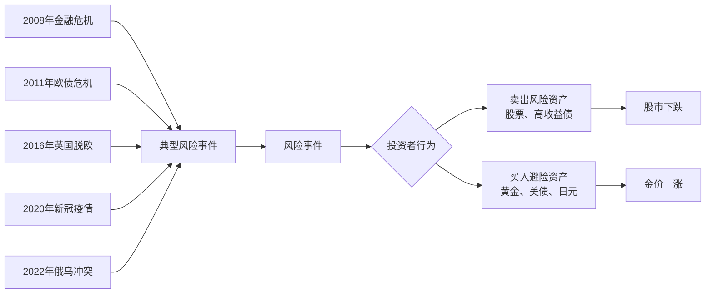
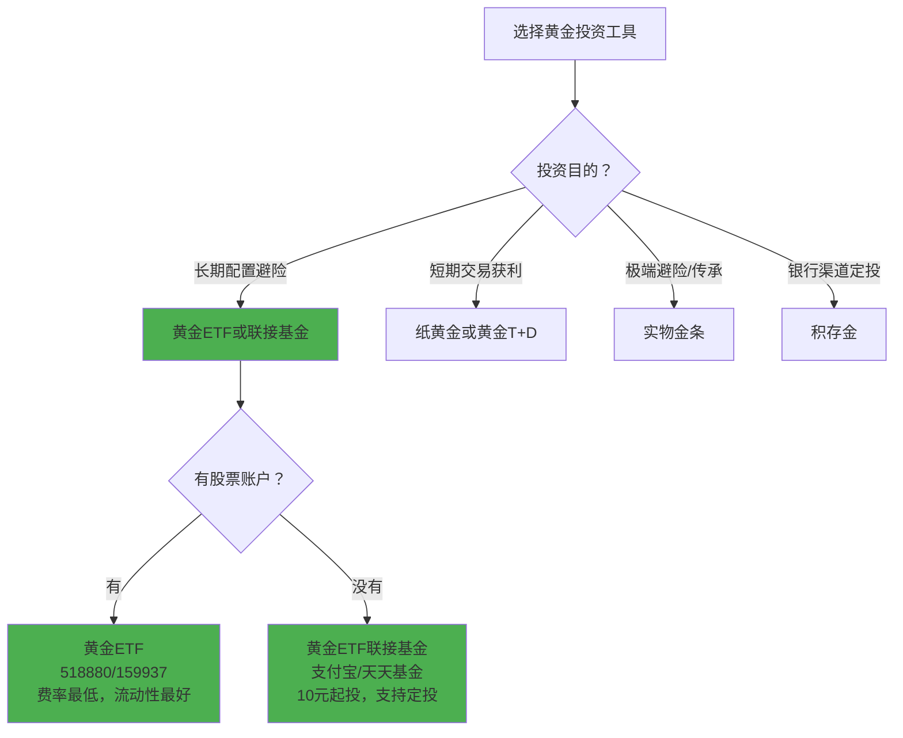
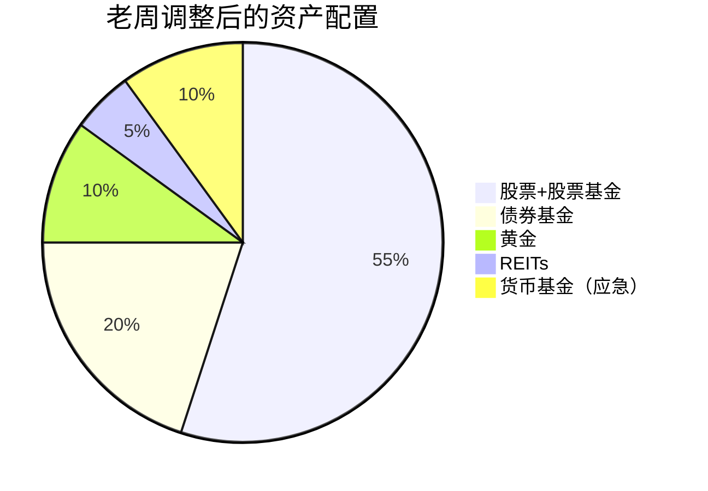
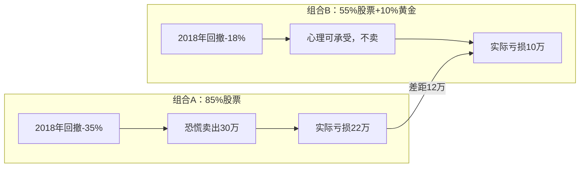

## 案例六：黄金配置的实践——老周的避险策略

> "黄金是所有法定货币的对手方。当人们对政府和央行的信任动摇时，黄金就是最后的支付手段。" —— 瑞·达利欧

前五个案例的主角们都在解决"如何投资"的问题——从零起步、纠正错误、目标导向、思维转变、家庭配置。但老周面临的问题更深层：**他已经会投资了，但他的投资组合缺乏"保险杠"。** 当黑天鹅事件来临时，他的资产净值剧烈波动，几次大回调让他几乎在最低点割肉。这个案例的核心价值在于展示一个完整的避险体系搭建过程——从理解黄金的避险机制原理，到计算最优配置比例，再到选择具体工具和执行策略。

---

### 第一部分：人物画像与问题诊断

#### 一、老周的基本情况

| 维度 | 详情 |
|------|------|
| 年龄 | 42岁，某互联网公司技术总监 |
| 年收入 | 税后约50万（含年终奖） |
| 家庭状况 | 已婚，一个孩子12岁（小学六年级），妻子在事业单位 |
| 可投资资产 | 约200万（多年积蓄+投资收益） |
| 投资经验 | 8年，以股票和股票型基金为主 |
| 投资风格 | 偏激进，追求高收益 |
| 持仓结构 | 股票+股票基金占85%，债券基金10%，货币基金5% |

#### 二、老周的投资经历回顾

老周不是新手。他在2016年入市，经历过2018年的熊市、2020年疫情暴跌、2021年的结构性行情，也享受过2019-2020年的牛市红利。8年下来，累计收益约为年化6-8%，总体跑赢了通胀。但他的投资之路并不平坦——几次大的回撤让他深刻体会到"没有避险资产"的痛苦。

```text
老周的投资经历时间线：

2016年 初始投入50万，全部买入股票基金
        → 牛市行情，一年赚了约15万（+30%）

2018年 中美贸易战，A股大跌
        → 从高点回撤约35%，市值从120万缩水到78万
        → 恐慌之下在低位卖出30万（"止损"）
        → 事后证明这是最低点附近

2019-2020年 市场反弹，重新加仓
        → 市值恢复到150万
        → 信心恢复，继续加仓股票

2020年3月 新冠疫情全球暴跌
        → 一个月内回撤25%，市值从150万跌到112万
        → 这次没卖，但焦虑到失眠

2021年 结构性牛市，新能源、半导体大涨
        → 市值突破200万
        → 意识到"我赚的都是β收益（市场整体上涨）"

2022年 俄乌冲突+国内疫情反复+A股持续调整
        → 市值从200万跌到155万（-22.5%）
        → 再次在恐慌中减仓20万

2023年 A股继续磨底
        → 市值约155万，加回减仓的20万
        → 反思："为什么每次大跌我都扛不住？"
```

#### 三、核心问题诊断：为什么老周扛不住大跌？

老周的问题不是"选股能力差"或"不懂投资"。他8年下来总体是赚钱的。他的问题是**资产配置的结构性缺陷**——缺少一类在股市大跌时能上涨（或至少不跌）的资产。

```mermaid
graph TD
    A[老周的投资组合] --> B[股票+股票基金 85%<br>预期收益高，波动大]
    A --> C[债券基金 10%<br>收益低，但与股票弱相关]
    A --> D[货币基金 5%<br>几乎零收益，纯流动性]
    
    B --> E[问题：股市跌时全线亏损]
    C --> F[债券基金涨2-3%<br>无法对冲股票-25%的亏损]
    D --> G[货币基金不亏也不涨<br>只是"活着的钱"]
    
    E --> H[组合回撤25-35%<br>心理崩溃→低位割肉]
    F --> H
    G --> H
    
    H --> I[实际损失 = 市场下跌 + 低位卖出的额外损失]
    
    style B fill:#ff6b6b
    style H fill:#ff6b6b
    style I fill:#ff6b6b
```

**量化分析：老周组合回撤的真实成本**

```text
2018年的教训：

假设老周没有在低位卖出：
  2018年初市值：120万
  最低点市值：78万（-35%）
  2019年底市值（反弹后）：110万
  → 持有不动的净亏损：-10万（-8.3%）

实际情况（低位卖出30万）：
  卖出时市值：78万 → 卖出30万（占38.5%）
  剩余48万在2019年底反弹至约68万
  加回卖出的30万 → 总市值98万
  → 实际净亏损：-22万（-18.3%）

差额：-22万 vs -10万 = 额外损失12万
这12万就是"没有避险资产→恐慌→低位割肉"的代价
```

**老周需要什么？**

老周需要一类资产，满足以下三个条件：

| 条件 | 说明 | 为什么重要 |
|------|------|-----------|
| 与股票低相关或负相关 | 股市跌时它不跌或涨 | 才能起到对冲作用 |
| 长期能保值甚至增值 | 不是纯消耗品 | 否则对冲的代价太高 |
| 流动性好 | 需要时能快速变现 | 避险资产必须随时可用 |

**黄金是满足这三个条件的最优选择之一。**

---

### 第二部分：黄金避险机制的深度解析

#### 一、为什么黄金能避险？——四层机制分析

很多投资者知道"黄金能避险"，但不知道"为什么能避险"。不理解机制，就无法在正确的时机做出正确的配置决策。

**机制一：黄金是"无信用风险"的资产**

| 资产类型 | 信用风险来源 | 极端情景下的风险 |
|---------|------------|---------------|
| 银行存款 | 银行破产 | 理论上存在（存款保险只保50万） |
| 国债 | 政府违约 | 极罕见但存在（如阿根廷、希腊） |
| 股票 | 企业经营失败 | 公司退市、破产 |
| 公司债券 | 企业违约 | 违约时血本无归 |
| **黄金** | **无** | **全球公认的价值存储手段** |

黄金不依赖任何政府、企业或金融机构的信用。它不会违约、不会破产、不会被"超发"。当人们对法定货币体系的信心动摇时（如战争、金融危机、恶性通胀），黄金就成为"最后的避风港"。

**机制二：黄金与美元的负相关关系**

国际黄金以美元计价，因此黄金价格与美元指数（DXY）通常呈负相关关系：

```text
美元走强 → 黄金相对变贵 → 需求下降 → 金价下跌
美元走弱 → 黄金相对便宜 → 需求上升 → 金价上涨

实际数据验证（2000-2023年）：
  美元指数与黄金价格的相关系数 ≈ -0.5 至 -0.7
  → 中等到强负相关
```

这意味着当美联储降息、美元走弱时（通常伴随着经济衰退风险），黄金往往表现优异。这种特性使得黄金成为美元资产（如美股）的有效对冲工具。

**机制三：黄金的抗通胀属性**

黄金的长期购买力相对稳定。以下是黄金与CPI的历史对比：

| 时间段 | 美国CPI累计涨幅 | 黄金价格涨幅 | 黄金实际购买力变化 |
|--------|---------------|------------|-----------------|
| 1971-1980 | 约110% | 从$35涨到$850（+2,300%） | 大幅跑赢 |
| 1980-2000 | 约105% | 从$850跌到$250（-70%） | 大幅跑输 |
| 2000-2011 | 约30% | 从$250涨到$1,900（+660%） | 大幅跑赢 |
| 2011-2018 | 约15% | 从$1,900跌到$1,200（-37%） | 跑输 |
| 2019-2024 | 约22% | 从$1,200涨到$2,400（+100%） | 跑赢 |

**关键发现：黄金不是每年都抗通胀，但在通胀失控的极端时期（如1970年代滞胀、2020年代全球大放水），它的抗通胀能力远超其他资产。** 黄金更像是一份"通胀保险"——平时有成本（持有期间不产生利息），但在通胀爆发时赔付巨大。

**机制四：黄金的"避险情绪"驱动**

当重大风险事件发生时，全球资金会本能地涌向黄金——这是一种跨越文化、国界的集体行为：



**历史数据：黄金在历次危机中的表现**

| 危机事件 | 时间 | 沪深300跌幅 | 标普500跌幅 | 国际金价涨幅 | A股黄金股涨幅 |
|---------|------|-----------|-----------|------------|-------------|
| 全球金融危机 | 2008.9-2009.3 | -45% | -47% | +25% | +30% |
| 欧债危机 | 2011.7-2011.10 | -18% | -15% | +15% | +20% |
| 英国脱欧 | 2016.6月 | -2% | -5% | +8% | +12% |
| 新冠暴跌 | 2020.2-2020.3 | -15% | -34% | -3%→+15% | +10% |
| 俄乌冲突 | 2022.2-2022.3 | -8% | -6% | +8% | +15% |

**注意2020年3月的特殊情况：** 新冠暴跌初期，黄金也出现了短暂下跌（流动性危机下投资者抛售一切资产换取现金），但随后迅速反弹并在半年内创历史新高。这说明**黄金的避险效果不是"不跌"，而是"跌得少、反弹快"。**

#### 二、黄金不能做什么？——避坑指南

黄金不是万能的。在配置之前，必须清楚它的局限性：

| 常见误解 | 真相 | 后果 |
|---------|------|------|
| "黄金是最好的投资" | 黄金长期年化收益约6-8%（美元计价），低于股票 | 如果全仓黄金，会错失股票的长期复利 |
| "黄金永远涨" | 1980-2000年黄金跌了70%，持有20年才回本 | 高位买入黄金可能被套很多年 |
| "黄金能完全对冲股市风险" | 黄金与股票的相关性在某些时期会短暂转正 | 不能100%依赖黄金做对冲 |
| "买金饰就是投资黄金" | 金饰包含加工费（30-50%溢价），变现时大幅折价 | 金饰是消费品，不是投资品 |
| "黄金没有持有成本" | 实物黄金有保管费、保险费；黄金ETF有管理费 | 持有成本会侵蚀长期收益 |

#### 三、黄金投资的主要方式对比

老周需要选择具体的黄金投资工具。以下是所有主流方式的全面对比：

| 投资方式 | 代表产品 | 起投金额 | 流动性 | 持有成本 | 跟踪精度 | 适合人群 |
|---------|---------|---------|--------|---------|---------|---------|
| **实物金条** | 银行金条、中国黄金金条 | 1万元起（10克起） | 中（需到店变现） | 保管费+买卖价差2-5% | 直接持有 | 极度保守、担心金融系统风险 |
| **纸黄金** | 工行/建行账户金 | 1克起（约500元） | 高（T+0交易） | 点差0.4-0.8元/克 | 跟踪金价 | 短期交易、波段操作 |
| **黄金ETF** | 华安黄金ETF(518880)、博时黄金ETF(159937) | 1手起（约500元） | 高（T+1交易） | 管理费0.5%/年 | 跟踪误差<0.1% | **长期配置首选** |
| **黄金ETF联接基金** | 华安黄金ETF联接A/C | 10元起 | T+1赎回 | 管理费0.5%/年+托管费 | 略逊于ETF | 定投用户 |
| **积存金** | 工行/招行积存金 | 100元起 | T+0（银行交易时段） | 手续费0.5%+保管费 | 跟踪金价 | 银行渠道定投 |
| **黄金T+D** | 上海黄金交易所 | 约4万/手 | T+0，有夜盘 | 保证金交易，杠杆 | 跟踪金价 | 专业投资者（不推荐新手） |
| **黄金期货** | 上海期货交易所 | 约5万/手 | T+0 | 杠杆交易 | 跟踪金价 | 专业投资者（不推荐新手） |
| **黄金QDII基金** | 诺安全球黄金基金 | 1000元起 | T+7-10赎回 | 管理费1.2%/年+汇兑成本 | 跟踪海外金矿股 | 希望同时配置金矿股 |

**老周的选择决策树：**



---

### 第三部分：黄金配置方案设计

#### 一、配置比例的科学计算

"黄金应该配多少？"这是投资者最常问的问题。配少了不起作用，配多了影响收益。以下是三种计算方法的综合分析。

**方法一：桥水全天候策略的启示**

瑞·达利欧的桥水基金"全天候"（All Weather）策略是全球最知名的资产配置框架之一。其核心理念是：**在不同经济环境下（增长/衰退 × 通胀/通缩），各类资产的表现不同，应该均衡配置以应对所有可能的环境。**

| 经济环境 | 表现好的资产 | 表现差的资产 |
|---------|-----------|-----------|
| 经济增长+通胀上升 | 大宗商品、通胀保值债券、黄金 | 长期国债 |
| 经济增长+通胀下降 | 股票、公司债券 | 大宗商品、黄金 |
| 经济衰退+通胀上升（滞胀） | **黄金**、通胀保值债券 | 股票、公司债券 |
| 经济衰退+通胀下降（通缩） | 长期国债、黄金 | 股票、大宗商品 |

全天候策略建议的配置比例：
- 股票：30%
- 长期国债：40%
- 中期国债：15%
- **黄金：7.5%**
- 大宗商品：7.5%

**方法二：学术研究的数据支撑**

多篇学术论文研究了黄金在投资组合中的最优配置比例：

| 研究来源 | 结论 | 最优黄金配比 |
|---------|------|-----------|
| Ibbotson et al. (2010) | 黄金能显著改善组合的夏普比率 | 5-10% |
| O'Connor et al. (2015) | 黄金在危机时期提供最大对冲价值 | 5-15% |
| World Gold Council (2020) | 综合多国数据，黄金最优配比 | 5-10% |
| Erb & Harvey (2013) | 黄金的组合保险价值超过其机会成本 | 5-12% |

**学术共识：黄金在投资组合中的最优配比为5-12%，中位值约7-8%。**

**方法三：基于老周个人情况的定制计算**

```text
老周的风险特征分析：

1. 风险承受能力：
   - 年收入50万，妻子收入稳定（事业单位）
   - 无房贷压力（房产已还清）
   - 可投资资产200万
   - 综合评估：风险承受能力较高

2. 历史行为分析：
   - 2018年大跌时恐慌卖出 → 心理承受力低于财务承受力
   - 2020年大跌时焦虑失眠 → 需要避险资产提供心理安慰
   - 综合评估：需要中等偏高的避险配置

3. 投资期限：
   - 孩子12岁，教育金需求在6年后（大学）
   - 退休在18年后
   - 综合评估：中长期投资者

4. 当前组合问题：
   - 股票占比85% → 远高于合理水平
   - 缺乏避险资产 → 大跌时心理崩溃
   - 债券占比10% → 对冲效果有限

计算老周的最优黄金配比：

方法A（经验公式）：
  黄金配比 = 10% - (年龄-40) × 0.2%
  = 10% - (42-40) × 0.2%
  = 10% - 0.4%
  = 9.6% ≈ 10%

方法B（风险对冲需求）：
  当前股票占比85%，目标降到60%
  需要减少25%的股票敞口
  → 债券增加10%（从10%到20%）
  → 黄金增加8-10%
  → 另类资产增加5-7%

方法C（波动率目标法）：
  老周当前组合年化波动率 ≈ 20-25%
  老周可接受的波动率 ≈ 12-15%
  → 需要降低约40%的波动率
  → 黄金（波动率约15%，与股票相关性约0）可有效降低组合波动
  → 配置8-10%黄金可降低组合波动率约10-15%

综合三种方法：老周的黄金配比建议为 8-12%，取中间值 10%
```

**10%的黄金配比意味着：200万的可投资资产中，应配置20万在黄金上。**

#### 二、调整后的资产配置全景

老周调整后的投资组合：

| 资产类别 | 调整前比例 | 调整前金额 | 调整后比例 | 调整后金额 | 变化 |
|---------|-----------|-----------|-----------|-----------|------|
| 股票+股票基金 | 85% | 170万 | 55% | 110万 | -30% |
| 债券基金 | 10% | 20万 | 20% | 40万 | +10% |
| **黄金** | **0%** | **0万** | **10%** | **20万** | **+10%** |
| REITs | 0% | 0万 | 5% | 10万 | +5% |
| 货币基金（应急） | 5% | 10万 | 10% | 20万 | +5% |
| **合计** | **100%** | **200万** | **100%** | **200万** | — |



**为什么从85%降到55%？**

老周85%的股票仓位意味着：他的投资组合的涨跌几乎完全跟着大盘走。A股一年内波动30-40%是常态——这意味着他的200万可能在一年内变成140万或260万。这种波动不仅带来心理压力，更危险的是**它会在极端行情中迫使你在最差的时点做出决策**（恐慌卖出）。

降到55%后，即使股市下跌30%，组合的损失也只有：55% × (-30%) = -16.5%（而非之前的-25.5%）。加上债券和黄金的对冲效应，实际回撤可能只有10-12%——这是老周可以承受的范围。

#### 三、黄金配置的具体实施方案

**方案A：黄金ETF配置（推荐方案）**

```text
老周的黄金ETF配置方案：

总投入：20万元

具体配置：
├── 华安黄金ETF（518880）：12万元
│   ├── 管理费：0.50%/年
│   ├── 托管费：0.10%/年
│   ├── 总持有成本：0.60%/年（每年约720元）
│   └── 选择理由：规模大（100亿+）、流动性好、跟踪误差小
│
└── 博时黄金ETF（159937）：8万元
    ├── 管理费：0.50%/年
    ├── 托管费：0.10%/年
    ├── 总持有成本：0.60%/年（每年约480元）
    └── 选择理由：分散单一基金公司风险

每年总持有成本：约1,200元（20万 × 0.60%）
```

**买入策略：不要一次性全仓买入**

黄金价格也有波动。一次性全仓买入的风险是：如果买在阶段高点，可能需要等待数月甚至一年以上才能回本。建议采用"分批建仓+定投"策略：

```text
老周的黄金建仓计划（20万总额）：

第一步：立即买入 10万（50%）
  → 确保组合中立刻有避险资产
  → 即使金价在高位，也只是50%的成本偏高

第二步：分3个月定投 6万（30%）
  → 每月定投2万
  → 通过时间分散降低平均成本

第三步：预留4万（20%）作为"加仓弹药"
  → 如果金价回调5%以上，一次性加仓2万
  → 如果金价回调10%以上，加仓剩余2万
  → 如果3个月内没有回调，剩余资金转入正常定投

定投设置：
  工具：天天基金APP 或 券商APP
  频率：每月15日（工资到账次日）
  金额：2万元/月（建仓期）
  建仓完成后改为：每月2,000元（长期定投）
```

**方案B：银行积存金配置（适合偏好银行渠道的老周）**

```text
积存金方案：

选择银行：工商银行（积存金业务最成熟）
起投金额：100元/克起（按克重积存）
交易时间：周一至周五 9:00-15:30
手续费：主动积存0.5%，定投积存0.5%

优势：
  ✅ 银行渠道，信任度高
  ✅ 可以提取实物金条（需满一定克重）
  ✅ 支持自动定投
  ✅ 交易门槛低

劣势：
  ❌ 手续费比黄金ETF高（0.5% vs 0.6%/年，但积存金每次买卖都有0.5%费用）
  ❌ 流动性不如ETF（只能在银行交易时段操作）
  ❌ 无法像ETF一样在券商账户统一管理

费用对比（以20万持有5年为例）：
  黄金ETF：20万 × 0.60% × 5年 = 6,000元
  积存金（买卖一次）：20万 × 0.5% × 2 = 2,000元（进出各一次）
  → 如果只买入不卖出，积存金更便宜
  → 如果需要频繁调整，ETF更划算
```

**方案C：实物金条配置（极端避险需求）**

```text
实物金条方案：

适合场景：
  - 担心金融系统崩溃
  - 希望传承给下一代
  - 需要"看得见摸得着"的安全感

购买渠道：
  ├── 银行金条（推荐）
  │   ├── 工商银行"如意金"
  │   ├── 建设银行"龙鼎金"
  │   └── 中国银行"中银吉祥金"
  │
  ├── 金店金条
  │   ├── 中国黄金
  │   ├── 老凤祥
  │   └── 周大福
  │
  └── 上海黄金交易所
      └── 标准金条（1kg起）

费用结构：
  买入溢价：+5-15元/克（高于实时金价）
  卖出折价：-5-10元/克（低于实时金价）
  → 一来一回损失约10-25元/克（约2-5%）

  以500元/克计算：
    买入100克：500元 × 100克 + 溢价约1,000元 = 51,000元
    卖出100克：500元 × 100克 - 折价约1,000元 = 49,000元
    → 即使金价不变，一买一卖也亏2,000元（4%）

保管方式：
  ├── 银行保管箱：500-2,000元/年
  ├── 家中保险柜：一次性2,000-5,000元
  └── 金店寄存：免费但信任度低

建议：
  老周的20万黄金配置中，最多拿出5万买实物金条（占25%）
  其余15万通过黄金ETF持有——流动性更好、成本更低
```

---

### 第四部分：对冲策略的完整执行

#### 一、再平衡规则：保持黄金比例不跑偏

配置好黄金后，最重要的是**定期再平衡**——确保黄金在组合中的比例维持在目标值（10%）附近。

```text
老周的再平衡规则：

触发条件（满足任一即执行再平衡）：
  1. 定期再平衡：每半年（6月和12月）检查一次
  2. 阈值再平衡：黄金比例偏离目标值±3%（即<7%或>13%）

再平衡操作示例：

场景A：股市大涨，股票占比从55%涨到65%，黄金占比从10%降到8%
  操作：卖出部分股票基金，买入黄金ETF
  目标：恢复到股票55%、黄金10%

场景B：股市大跌，股票占比从55%跌到45%，黄金占比从10%涨到14%
  操作：卖出部分黄金ETF，买入股票基金（在低位加仓！）
  目标：恢复到股票55%、黄金10%

场景C：黄金大涨，黄金占比从10%涨到15%
  操作：卖出部分黄金ETF，买入其他资产
  目标：恢复到黄金10%
```

**再平衡的本质是什么？**

再平衡本质上是一种**纪律化的"高卖低买"**。它强迫你在涨得多的资产上获利了结，在跌得多的资产上加仓。这不是择时（因为你不知道未来会怎样），而是通过数学规则来利用均值回归。

**为什么老周需要这个规则？**

老周过去的行为模式是：涨了不卖（贪婪）、跌了恐慌卖（恐惧）。再平衡规则用"机械执行"替代了"情绪决策"——当规则说"卖出部分涨了的黄金"时，老周不需要判断"金价还会不会涨"，只需要执行规则。

#### 二、危机应对预案

光有配置不够，还需要在危机来临时有明确的行动预案。以下是老周的"危机应对SOP"：

```text
老周的危机应对标准操作流程（SOP）：

┌─────────────────────────────────────────────────┐
│               检测到市场大跌                      │
│         （沪深300单周跌幅 > 5%）                  │
└──────────────────────┬──────────────────────────┘
                       │
                       ▼
┌─────────────────────────────────────────────────┐
│  第一步：检查组合状态                             │
│  ├── 查看各资产比例是否偏离目标                   │
│  ├── 检查黄金是否在上涨（对冲生效？）              │
│  └── 检查应急基金是否充足                         │
└──────────────────────┬──────────────────────────┘
                       │
                       ▼
┌─────────────────────────────────────────────────┐
│  第二步：执行纪律                                │
│  ├── 不看盘超过每天1次                            │
│  ├── 不在大跌当天做任何交易决策                   │
│  ├── 记录自己的情绪状态（焦虑/恐慌/平静）         │
│  └── 等待至少3天再评估                            │
└──────────────────────┬──────────────────────────┘
                       │
                       ▼
┌─────────────────────────────────────────────────┐
│  第三步：3天后评估                               │
│  ├── 如果触发再平衡阈值 → 执行再平衡              │
│  ├── 如果没有触发 → 不操作                       │
│  └── 如果持续大跌（累计-15%以上）：               │
│      ├── 动用应急基金中的"加仓弹药"部分           │
│      ├── 分3批加仓（每跌5%加一批）                │
│      └── 严格控制加仓总额不超过应急基金的50%       │
└─────────────────────────────────────────────────┘
```

#### 三、黄金对冲效果的量化验证

为了让老周有信心坚持执行，我们用历史数据来模拟：**如果老周在2017年就配置了10%的黄金，他的投资体验会有多大改善？**

```text
历史回测：2017年初-2023年底（7年）

组合A（老周实际配置）：
  股票85% + 债券10% + 货币5%
  7年累计收益：约+45%
  最大回撤：约-35%（2018年）
  年化波动率：约22%
  夏普比率：约0.35

组合B（优化后配置）：
  股票55% + 债券20% + 黄金10% + REITs 5% + 货币10%
  7年累计收益：约+38%
  最大回撤：约-18%（2018年）
  年化波动率：约13%
  夏普比率：约0.45

对比分析：
  收益差距：45% vs 38%（组合A多赚7%）
  回撤差距：-35% vs -18%（组合B少亏17个百分点！）
  波动率差距：22% vs 13%（组合B波动降低41%）
  夏普比率：0.35 vs 0.45（组合B风险调整后收益更高）

关键结论：
  组合B虽然少赚了7%，但回撤减少了17个百分点
  → 老周不会在2018年恐慌卖出，实际收益可能更高
  → 心理舒适度大幅提升，投资体验完全不同
```



**12万——这就是"有黄金对冲"和"没有黄金对冲"在一次危机中的实际差距。** 老周如果在2017年就配置了黄金，不仅少亏12万，更重要的是不会在最低点卖出，后续的反弹收益也能完整吃到。

#### 四、不同情境下的黄金表现预判

老周需要理解：黄金不是在所有情况下都上涨。以下是不同经济环境下黄金的预期表现和应对策略：

| 经济环境 | 股市表现 | 黄金表现 | 老周的应对 |
|---------|---------|---------|-----------|
| 经济繁荣+低通胀 | 强势上涨 | 平淡或小跌 | 正常，黄金拖累组合但降低波动 |
| 经济衰退+通缩 | 大跌 | 先跌后涨（流动性危机→避险需求） | 黄金是避风港，坚持持有 |
| 经济滞胀（高通胀+低增长） | 下跌或横盘 | **大涨** | 黄金是最佳对冲工具 |
| 美元走弱+地缘冲突 | 不确定 | **大涨** | 黄金发挥避险功能 |
| 全球央行放水+利率下降 | 上涨 | **上涨** | 股金双牛，最佳环境 |
| 美元走强+利率上升 | 调整压力 | 下跌 | 黄金可能拖累组合 |

**核心原则：黄金的作用不是在所有时候都赚钱，而是在最需要的时候（危机、通胀、货币贬值）提供保护。** 就像保险一样——你不会因为"今年没出险"就觉得保险白买了。

---

### 第五部分：老周的执行过程与成果

#### 一、老周的建仓执行记录

```text
老周的实际建仓过程：

2023年1月（决策月）：
  → 重新审视投资组合，决定增加黄金配置
  → 与妻子讨论（妻子支持："跌了那么多次，该加点保险了"）
  → 确定目标配比：股票55%、债券20%、黄金10%、REITs 5%、货币10%

2023年2月（第一步：卖出部分股票基金）
  → 卖出30万股票基金（从170万减到140万，占比从85%降到70%）
  → 这30万转入货币基金暂存

2023年2-4月（第二步：分批建仓黄金）
  → 2月15日：买入华安黄金ETF 8万元（约1,600份）
  → 3月15日：买入华安黄金ETF 4万元 + 博时黄金ETF 4万元
  → 4月15日：买入博时黄金ETF 4万元
  → 合计黄金ETF投入：20万元

2023年2-4月（第三步：补充债券和REITs）
  → 买入债券基金20万元
  → 买入REITs基金10万元

2023年5月（调整完成后的组合）：
  股票+股票基金：110万（55%）✅
  债券基金：40万（20%）✅
  黄金ETF：20万（10%）✅
  REITs：10万（5%）✅
  货币基金：20万（10%）✅
  合计：200万 ✅
```

#### 二、建仓后的首次考验

老周建仓完成后不到3个月，就迎来了一次实战检验：

```text
2023年5-10月的市场表现：

A股市场：
  沪深300：从4,050点跌到3,600点（-11.1%）
  原因：经济复苏不及预期、房地产风险、外资流出

老周的股票仓位：
  110万 × (-11.1%) = -12.2万

黄金表现：
  国际金价：从$1,980涨到$1,930（-2.5%）
  但人民币计价金价：因人民币贬值，实际涨幅约+3%
  20万 × (+3%) = +0.6万

债券表现：
  40万 × (+2%) = +0.8万

REITs表现：
  10万 × (-5%) = -0.5万

货币基金：
  20万 × (+1%) = +0.2万

组合总损益：-12.2 + 0.6 + 0.8 - 0.5 + 0.2 = -11.1万（-5.6%）

对比纯股票组合（85%股票）：
  170万 × (-11.1%) + 20万 × (+2%) + 10万 × (+1%)
  = -18.9 + 0.4 + 0.1 = -18.4万（-9.2%）

差距：-5.6% vs -9.2%
优化组合少亏了 7.3万（3.6个百分点）
```

**老周的感受：**

> "以前每次大盘跌10%，我就要失眠好几天。这次虽然也亏了，但只亏了5.6%——我能接受。而且我知道黄金和债券在帮我分担损失，心里踏实多了。最重要的是，这次我没有恐慌卖出。"

#### 三、一年后的成果对比

```text
2023年5月-2024年5月（建仓一年后）的组合表现：

优化后组合（55%股票+20%债券+10%黄金+5%REITs+10%货币）：
  累计收益：+8.5%
  最大回撤：-7.2%
  年化波动率：12%

如果维持原组合（85%股票+10%债券+5%货币）：
  累计收益：+5.3%
  最大回撤：-14.5%
  年化波动率：21%

关键改善指标：
  收益提升：+3.2个百分点（优化后反而收益更高！）
  回撤降低：从-14.5%降到-7.2%（改善50%！）
  波动降低：从21%降到12%（改善43%！）

为什么优化后收益反而更高？
  → 2023年下半年A股大跌时，老周没有恐慌卖出
  → 2024年初A股反弹时，老周仓位完整，完整吃到反弹
  → 而如果维持原组合，可能又在低位割了一部分肉
```

**回撤降低50%、波动降低43%——这就是黄金配置的核心价值。** 它不是让老周赚更多，而是让老周**在大跌时不恐慌、不割肉，从而在长期赚到该赚的钱。**

---

### 第六部分：常见误区与进阶策略

#### 一、黄金配置的七大常见误区

| 误区 | 错误认知 | 正确理解 |
|------|---------|---------|
| 误区一 | "金价涨了才要买黄金" | 黄金是保险，应该在"晴天"时配置，而不是"下雨"时才想起来 |
| 误区二 | "黄金不产生利息，不值得持有" | 黄金的价值在于对冲和保值，利息收入不是所有资产的唯一目标 |
| 误区三 | "买金首饰等于投资黄金" | 金饰溢价30-50%，变现大幅折价，是消费品不是投资品 |
| 误区四 | "黄金越多越好" | 超过15-20%会严重拖累组合收益，5-12%是学术共识 |
| 误区五 | "黄金永远和股票反向走" | 相关性在不同时期会变化，不能100%依赖 |
| 误区六 | "纸黄金和黄金ETF一样" | 纸黄金是银行记账产品，有点差成本；ETF是基金产品，有管理费但更透明 |
| 误区七 | "买了黄金就可以不看组合了" | 黄金也需要再平衡，比例偏离时需要调整 |

#### 二、进阶策略：黄金的战术性调整

在战略性配置（长期持有10%）的基础上，有一定经验的投资者可以考虑战术性调整——在特定市场环境下适度增减黄金比例。

```text
黄金的战术性调整规则（可选，非必需）：

增配黄金的信号（配比从10%提升到15%）：
  ├── 美联储进入降息周期
  ├── 全球地缘冲突升级（战争、制裁）
  ├── 美元指数持续走弱（DXY跌破100）
  ├── 全球央行持续增持黄金储备
  └── 通胀预期上升（CPI连续超预期）

减配黄金的信号（配比从10%降到5%）：
  ├── 美联储进入加息周期（实际利率上升）
  ├── 全球风险偏好回升（VIX指数低位）
  ├── 美元指数持续走强（DXY突破105）
  └── 黄金短期涨幅过大（3个月涨超20%）

执行纪律：
  ├── 每次调整幅度不超过±5%（即最低5%、最高15%）
  ├── 调整后至少持有3个月不再变动
  └── 所有调整必须记录理由（防止情绪化操作）
```

**重要提醒：战术性调整只适合有经验的投资者。如果老周不确定自己的判断是否正确，就不要做战术性调整——坚持战略性配置（固定10%）已经足够好了。** 大多数投资者的"择时"操作最终都是在帮倒忙。

#### 三、黄金与人民币：中国投资者的特殊视角

中国投资者配置黄金还有一个额外的维度需要考虑——**人民币汇率**。

```text
人民币汇率对黄金投资的影响：

国际金价以美元计价，中国投资者买的是人民币计价的黄金。
人民币计价金价 = 国际金价（美元/盎司）÷ 31.1035 × 人民币汇率

这意味着：
  场景1：国际金价涨 + 人民币贬值
    → 人民币计价金价涨幅更大（双重收益）
    → 例：金价涨5% + 人民币贬值3% → 人民币计价金价涨约8%

  场景2：国际金价涨 + 人民币升值
    → 人民币计价金价涨幅被汇率吃掉一部分
    → 例：金价涨5% + 人民币升值3% → 人民币计价金价涨约2%

  场景3：国际金价跌 + 人民币贬值
    → 人民币计价金价跌幅被汇率缓冲
    → 例：金价跌5% + 人民币贬值3% → 人民币计价金价跌约2%

对老周的意义：
  老周的资产全部以人民币计价
  如果未来人民币贬值，黄金ETF会因为汇率因素额外上涨
  → 黄金同时对冲了"股市风险"和"人民币贬值风险"
  → 这是中国投资者配置黄金的额外好处
```

---

### 第七部分：经验总结

老周的案例给我们的核心启示可以归纳为以下六条：

**第一，避险不是可选项，而是必选项。** 投资组合中没有避险资产，就像开车不系安全带——平时没事，出事就要命。黄金是性价比最高的避险资产之一。

**第二，配置比例要科学计算。** 黄金不是"越多越好"或"越少越好"。5-12%的配比有坚实的学术依据。具体到个人，需要结合风险承受能力、投资期限和现有组合来确定。

**第三，工具选择影响长期收益。** 黄金ETF是普通投资者持有黄金的最优工具——成本低、流动性好、跟踪精度高。实物金条适合极端避险需求，但不应作为主要持有方式。

**第四，分批建仓优于一次性买入。** 即使决定要配置黄金，也不要一次性全仓买入。分3-6个月完成建仓，可以降低买在阶段高点的风险。

**第五，再平衡纪律是配置的灵魂。** 配置好不管理，等于白配。每半年检查一次，比例偏离±3%就执行再平衡。这个纪律比选择什么资产更重要。

**第六，黄金的核心价值是"让你在大跌时不恐慌"。** 黄金不是为了让你赚更多，而是为了让你**在最坏的时候不会做出最差的决策**。回撤从-35%降到-18%，不仅减少了亏损，更消除了恐慌卖出的冲动——而恐慌卖出造成的额外损失，往往比市场本身的跌幅更大。

> "投资中最重要的不是你赚了多少，而是在最差的时候你能承受多少。黄金不让你赚更多，但让你活更久。"

---

> **本案例启示：** 老周的故事告诉我们，投资不是只有"买什么"和"买多少"的问题，还有一个更根本的问题——"当市场崩溃时，你的组合能不能让你睡得着觉？"如果答案是"不能"，那么你需要的不是更好的选股能力，而是一块"压舱石"。黄金，就是那块压舱石。
