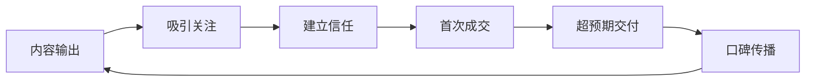
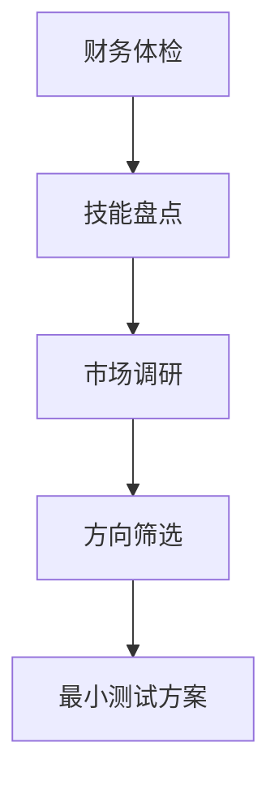

## 从这些案例中我们可以学到什么（补充）

前面的实战案例展示了不同背景、不同起点的人如何通过投资理财和副业创造实现财务增长。本节作为补充，将这些案例中反复出现的核心规律提炼出来，形成一套可复制的思维框架和行动清单。

### 一、案例复盘：三个关键转折点

回顾所有案例，成功者的路径并非一帆风顺，但几乎都在三个关键节点做出了正确决策。

#### 1.1 起点决策：选择大于努力

以副业月入12000元的案例为例，当事人在起步阶段做了三件事：

| 步骤 | 具体行动 | 耗时 | 产出 |
|------|---------|------|------|
| 技能盘点 | 列出自己擅长的10项技能，标注熟练度 | 1天 | 技能清单 |
| 需求验证 | 在5个平台搜索相关需求，统计月搜索量和竞争度 | 3天 | 需求报告 |
| 最小测试 | 用最低成本（免费或50元以内）发布第一个服务 | 1周 | 首单/反馈 |

这三步的核心逻辑是：**用最小成本验证"你的技能 × 市场需求"是否有交集**。很多人跳过验证直接投入大量时间，结果方向错了，越努力越亏损。

#### 1.2 增长拐点：从0到1的突破

案例中的增长拐点通常不是因为"运气好接了个大单"，而是建立了一套可重复的获客机制：



这个循环一旦转起来，获客成本会持续下降。案例中客户复购率达到60%，正是因为"超预期交付"这一步做到了极致。

#### 1.3 规模化：从副业到生意的跃迁

当月收入稳定在8000-10000元时，面临一个关键选择：继续做个人接单，还是转型为小团队/产品化。成功案例中选择后者的比例更高，因为他们意识到**个人时间是有限的，只有把服务标准化才能突破天花板**。

---

### 二、六大核心教训

#### 教训一：现金流比利润率更重要

很多初学者盯着"利润率50%"这样的数字兴奋不已，却忽略了现金流的时间维度。

**反面案例：** 小王做代购，每单利润率40%，但需要提前垫付货款，回款周期15天。一个月做30单，垫资2万元，实际月利润8000元但现金流几乎断裂。

**正面做法：** 先选择不需要垫资或回款周期短的项目。利润率低一点没关系，关键是钱能快速回笼。财务健康的优先级永远高于账面利润。

| 指标 | 垫资型项目 | 即时回款项目 |
|------|-----------|------------|
| 单笔利润率 | 40%-60% | 15%-30% |
| 回款周期 | 15-30天 | 即时-3天 |
| 月现金流 | 波动大 | 稳定可预测 |
| 风险等级 | 高（资金链断裂） | 低 |
| 适合阶段 | 有充足备用金后 | 起步期首选 |

#### 教训二：最小可行产品先跑通，再迭代

案例中几乎每一个成功者都有一个共同点：**第一版产品/服务都很粗糙，但先跑通了整个闭环**。

具体操作步骤：

1. **定义核心价值**：你的服务解决的最核心问题是什么？用一句话说清楚
2. **砍掉所有非必要功能**：只保留解决核心问题的那部分
3. **找到前3个客户**：免费或低价提供，换取真实反馈
4. **根据反馈迭代**：记录每个客户的需求和痛点，按频次排序
5. **逐步定价**：从免费 → 低价 → 合理价格，每阶段验证市场接受度

#### 教训三：数据驱动而非直觉驱动

"我觉得这个方向不错"——这是最常见的失败起点。成功案例中的做法是：

**必须跟踪的核心数据：**

- **获客数据**：每个渠道带来的咨询量、转化率、获客成本
- **交付数据**：平均服务时长、客户满意度评分、复购间隔天数
- **财务数据**：月收入、月支出、净利润、应收账款
- **增长数据**：新客户增长率、老客户流失率、客单价变化趋势

每周花30分钟整理这些数据，比每天埋头干活10小时更有价值。数据会告诉你该把时间花在哪里。

#### 教训四：个人品牌是最好的护城河

案例中的副业成功者，无一例外都在做一件事：**持续输出有价值的内容**。

个人品牌建设的时间线：

| 阶段 | 时间 | 动作 | 预期效果 |
|------|------|------|---------|
| 冷启动 | 第1-2月 | 每周发2-3篇干货文章/回答 | 建立专业形象 |
| 积累期 | 第3-6月 | 开始接免费/低价咨询积累案例 | 搜索排名上升，自然流量增加 |
| 爆发期 | 第6-12月 | 案例沉淀后开始付费推广 | 客户主动找上门，获客成本趋近于零 |
| 成熟期 | 12月+ | 出课程/写书/做社群 | 多元收入流，品牌溢价 |

#### 教训五：分散风险，不要All In

投资理财的案例反复证明一个道理：**任何时候都不要把所有资金押在一个标的上**。

分散策略矩阵：

| 维度 | 具体做法 | 比例建议 |
|------|---------|---------|
| 资产类型 | 股票+债券+现金+实物资产 | 根据风险偏好调整 |
| 行业分布 | 不超过30%资金在同一行业 | 科技+消费+金融+医疗等 |
| 时间分散 | 定投代替一次性投入 | 每月固定日期投入 |
| 地域分散 | A股+港股+美股+全球基金 | 按经济周期轮动 |

#### 教训六：预留安全垫

无论副业收入多稳定，无论投资收益多好，**永远保留6个月生活费的应急资金**。这笔钱放在货币基金或活期存款中，不参与任何投资。

安全垫的计算方式：

```text
月必要支出 = 房租/房贷 + 餐饮 + 交通 + 通讯 + 保险 + 基本生活用品
应急资金 = 月必要支出 × 6
```

案例中有一位投资者在2022年市场大跌时被迫割肉，就是因为没有安全垫，生活费都成问题。如果有6个月的缓冲，他完全可以等到2023年的反弹。

---

### 三、常见误区与纠正

#### 误区一："等我准备好了再开始"

**真相：** 你永远不会"准备好"。所有案例中的成功者都是在不完美的状态下开始的。等待完美条件的本质是拖延和恐惧。

**纠正方法：** 设定一个"最迟启动日期"，比如两周后的周一。在此之前完成最小可行版本，到了那天无论准备得如何都开始执行。

#### 误区二："我需要先学完所有知识"

**真相：** 投资理财和副业都需要在实践中学习。看书100本不如实操1个月。

**纠正方法：** 采用"70-20-10"学习法则——70%的时间用于实操，20%用于向有经验的人请教，10%用于阅读理论。

#### 误区三："这个项目别人赚到钱了，我也能"

**真相：** 幸存者偏差。你看到的成功案例背后，可能有100个失败的人没有发声。

**纠正方法：** 在投入之前，先做"反向调研"——搜索该项目的失败案例、投诉记录、负面评价。如果失败原因集中在"竞争太激烈""利润太薄""需求不稳定"，就要谨慎。

#### 误区四："收入高就是成功"

**真相：** 月入2万但每天工作16小时、没有社保、没有储蓄，这不叫成功，叫高风险打工。

**纠正方法：** 用"时薪"和"可持续性"来衡量——时薪是否高于你的主业？这个收入能否持续6个月以上？是否有被动收入的潜力？

#### 误区五："投资就是炒短线赚快钱"

**真相：** 案例中长期稳健获利的投资者，没有一个是靠短线交易成功的。短线交易的手续费、税费和心理压力会大幅侵蚀收益。

**纠正方法：** 将80%的资金用于长期投资（指数基金定投、优质个股长期持有），最多用20%的资金做中期波段操作，彻底放弃日内交易的幻想。

---

### 四、可复制的行动框架

将案例中的规律提炼为一个通用行动框架，适用于任何想要通过副业或投资改善财务状况的人。

#### 4.1 第一阶段：诊断（第1-2周）



**具体清单：**

- [ ] 计算当前净资产（资产 - 负债）
- [ ] 记录连续7天的时间分配
- [ ] 列出5项可变现的技能
- [ ] 在3个平台搜索每项技能的市场需求
- [ ] 选择1-2个最有潜力的方向
- [ ] 设计最小可行测试方案

#### 4.2 第二阶段：验证（第3-6周）

- [ ] 完成最小可行产品/服务
- [ ] 找到前3个测试客户（可以免费）
- [ ] 收集详细反馈（结构化问卷）
- [ ] 验证定价区间（A/B测试不同价格）
- [ ] 计算单位经济模型（获客成本、服务成本、利润）

#### 4.3 第三阶段：增长（第7-16周）

- [ ] 建立稳定获客渠道（至少2个）
- [ ] 开始内容输出（每周至少2篇）
- [ ] 建立客户管理系统（哪怕只是Excel表格）
- [ ] 优化服务流程，提高交付效率
- [ ] 月收入达到目标的50%以上

#### 4.4 第四阶段：优化（第17周起）

- [ ] 分析数据，砍掉低效渠道
- [ ] 提价或升级服务（提升客单价）
- [ ] 考虑产品化或团队化
- [ ] 开始投资理财（用副业利润）
- [ ] 建立被动收入流

---

### 五、进阶思考：从案例到体系

#### 5.1 财富增长的三阶段模型

所有案例中的成功者，无论起点如何，最终都走过了这三个阶段：

| 阶段 | 核心任务 | 收入特征 | 时间投入 |
|------|---------|---------|---------|
| 阶段一：赚钱 | 用时间换钱，提升技能 | 主动收入为主，时薪提升 | 高 |
| 阶段二：生钱 | 用钱生钱，投资理财 | 主动+被动收入并行 | 中 |
| 阶段三：值钱 | 建立资产，系统运转 | 被动收入为主 | 低 |

大多数人卡在阶段一，因为没有系统地将主动收入转化为投资本金。案例中的突破者都有一个共同习惯：**副业收入的50%强制储蓄，30%用于再投资（扩大业务），20%用于生活改善**。

#### 5.2 复利效应的真正含义

复利不只是"利滚利"。在副业和投资的语境下，复利体现在三个层面：

1. **技能复利**：每做一个项目，技能提升带来的下一个项目报价更高
2. **人脉复利**：每个满意客户可能带来2-3个新客户
3. **资金复利**：投资收益再投资产生的指数增长

以副业月入12000元的案例为例，如果将50%收入持续投入指数基金（年化8%），5年后的资产情况：

| 年份 | 累计投入（元） | 投资收益（元） | 总资产（元） |
|------|--------------|--------------|------------|
| 第1年 | 72,000 | 3,120 | 75,120 |
| 第2年 | 144,000 | 12,730 | 156,730 |
| 第3年 | 216,000 | 29,616 | 245,616 |
| 第4年 | 288,000 | 54,633 | 342,633 |
| 第5年 | 360,000 | 88,794 | 448,794 |

5年后总资产近45万元，其中投资收益贡献了约8.9万元——这就是复利的力量，而且这还是保守估计。

#### 5.3 风险管理的四道防线

案例中的失败者往往只有一道防线甚至没有，而成功者至少建立了四道：

| 防线 | 作用 | 具体措施 |
|------|------|---------|
| 第一道：应急资金 | 应对突发支出 | 6个月生活费，货币基金 |
| 第二道：保险保障 | 转移重大风险 | 医疗险+意外险+重疾险 |
| 第三道：收入多元化 | 避免单一收入中断 | 主业+副业+投资收益 |
| 第四道：技能储备 | 保持市场竞争力 | 持续学习，保持至少2项可变现技能 |

---

### 六、本节小结

从这些案例中我们可以提炼出一个核心公式：

> **财务改善 = 正确方向 × 持续行动 × 风险控制 × 时间复利**

四个因子缺一不可。方向错了，越努力越偏离；有方向但不行动，等于零；行动了但不控风险，一次意外就归零；前三者都对但急于求成，享受不到复利的指数增长。

最后，记住所有案例中反复出现的一句话：**先完成，再完美**。不要等到万事俱备才开始，从今天的一个小行动开始，比明天的宏大计划更有价值。
