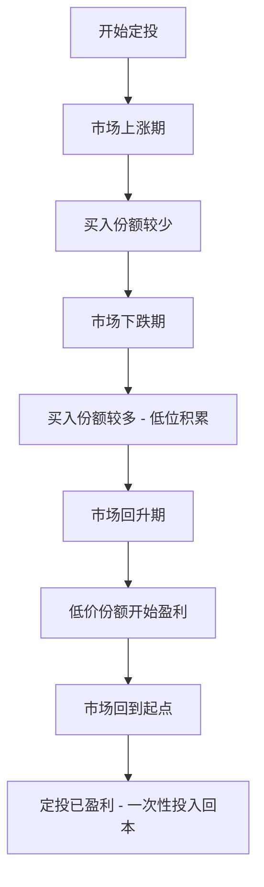
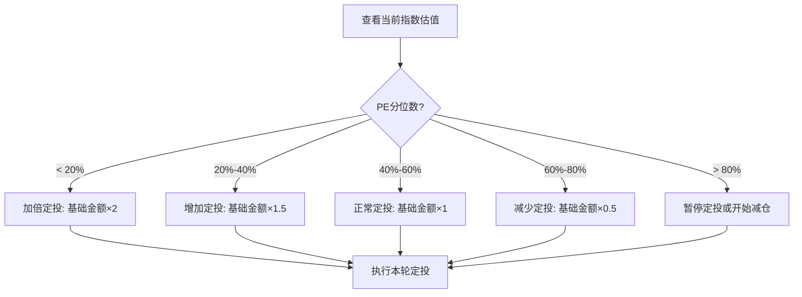
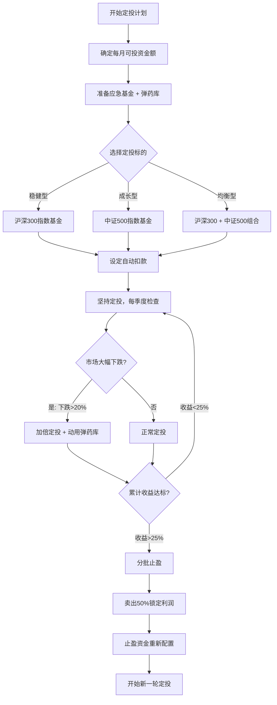

## 定投策略

定投是公认最适合普通投资者的策略，被称为"懒人投资法"。但"懒"不是随便投，而是用纪律和系统替代择时和情绪。真正理解定投的人，不仅能获得稳健收益，还能在市场恐慌时从容加仓，在市场疯狂时理性止盈。

### 定投的本质

定投，全称**定期定额投资**（Dollar Cost Averaging, DCA），是指在固定的时间间隔（如每周、每两周、每月）投入固定金额到指定的投资产品中。

这个概念最早由华尔街基金经理本杰明·格雷厄姆在《聪明的投资者》中系统阐述，后来被先锋基金创始人约翰·博格尔推广到普通投资者群体。

**定投的数学本质**是：通过时间维度的分散化，自动实现"低买多、高买少"的效果。当价格下跌时，同样的金额能买到更多份额；当价格上涨时，同样的金额买到的份额减少。长期下来，你的平均持仓成本会低于市场平均价格。

### 定投的核心机制：微笑曲线

定投之所以有效，核心在于"微笑曲线"效应——当市场先跌后涨时，定投投资者反而比一次性投入获得更好的收益。



**具体数据演示**：假设你每月定投1000元到某基金，经历了这样的行情：

```text
月份   基金价格   买入份额     累计投入   累计份额   累计净值    浮盈率
───────────────────────────────────────────────────────────────────
1月    10.0元     100.0份      1000元     100.0份    1000元     0%
2月    8.0元      125.0份      2000元     225.0份    1800元     -10%
3月    6.0元      166.7份      3000元     391.7份    2350元     -21.7%
4月    5.0元      200.0份      4000元     591.7份    2959元     -26%
5月    6.0元      166.7份      5000元     758.3份    4550元     -9%
6月    8.0元      125.0份      6000元     883.3份    7067元     +17.8%
7月    10.0元     100.0份      7000元     983.3份    9833元     +40.5%
8月    12.0元     83.3份       8000元     1066.7份   12800元    +60%

定投结果：
- 总投入：8000元
- 最终价值：12800元
- 收益率：60%
- 平均成本：8000 ÷ 1066.7 = 7.50元/份
- 市场平均价格：(10+8+6+5+6+8+10+12) ÷ 8 = 8.125元/份
- 定投节省成本：7.6%

如果在第1个月一次性投入8000元：
- 买入份额：800份
- 第8月价值：800 × 12 = 9600元
- 收益率：20%

定投比一次性投入多赚了40个百分点！
```

这个例子清晰地展示了微笑曲线的威力：在价格最低的4月和5月，定投自动买入了最多的份额（200份和167份），大幅拉低了平均成本。

### 为什么定投有效：三个核心原因

**原因一：自动实现"低买多、高买少"**

这是定投的数学基础。当基金净值下跌时，相同的金额能买到更多份额；净值上涨时，买到的份额减少。长期来看，你的平均成本必然低于市场算术平均价格。这不需要你判断市场高低点，系统自动完成。

**原因二：克服人性弱点**

行为金融学研究表明，普通投资者有三个致命弱点：
- **损失厌恶**：亏损的痛苦是盈利快乐的2倍，导致在下跌时恐慌卖出
- **过度自信**：高估自己判断市场的能力，频繁交易反而亏钱
- **羊群效应**：看到别人赚钱就跟风买入，往往买在高点

定投通过"自动化执行"直接绕过这些心理陷阱。你不需要做任何决策，只需要坚持执行计划。

**原因三：强制储蓄与复利效应**

定投本质上是一种强制储蓄机制。每月拿出固定金额投资，避免了"月光"的困境。长期坚持下来，复利效应会让资产加速增长。

```text
复利的力量（假设年化收益8%）：

定投金额：每月3000元
定投年限    累计投入    资产终值    收益部分
──────────────────────────────────────────
  5年       18万       22万        4万
 10年       36万       55万       19万
 15年       54万       104万      50万
 20年       72万       176万      104万
 25年       90万       285万      195万
 30年       108万      447万      339万

投入108万，收益339万，收益是本金的3.1倍。
这就是复利 + 坚持的力量。
```

> **数据支撑**：根据Wind数据回测，2010-2023年期间，每月定投沪深300指数基金的年化收益率约为6.8%，而同期一次性投入的年化收益率约为4.2%。定投在波动市场中的优势明显，尤其在A股这种高波动市场中，定投的微笑曲线效应更加显著。

### 定投的正确姿势

#### 选择标的

定投标的选择是决定收益的第一要素。适合定投的标的有两个核心特征：**长期向上**和**波动适中**。

**推荐的定投标的**：

| 标的类型 | 具体产品 | 适合人群 | 定投适配度 |
|----------|----------|----------|------------|
| 宽基指数基金 | 沪深300、中证500 | 大多数人 | ★★★★★ |
| 全市场指数 | MSCI中国A50 | 全球视野投资者 | ★★★★☆ |
| 红利指数 | 中证红利、红利ETF | 稳健型投资者 | ★★★★☆ |
| 行业指数 | 医药、消费、科技 | 有行业判断力的投资者 | ★★★☆☆ |
| 主动基金 | 优秀基金经理管理 | 有能力筛选的人 | ★★★☆☆ |
| 债券基金 | 纯债基金 | 保守型投资者 | ★★☆☆☆ |

**不推荐的定投标的**：
- **个股**：单只股票风险太大，可能退市或长期不涨
- **货币基金**：波动太小，定投没有任何优势
- **商品期货ETF**：没有长期向上的逻辑
- **QDII基金（部分）**：时差导致申赎时间不一致，影响定投节奏

#### 定投金额计算

定投金额不是随便定的，需要综合考虑收入、支出、应急储备和风险承受能力。

```text
定投金额计算公式：

月可投资金额 = 月收入 - 月固定支出 - 月应急储蓄
定投金额 = 月可投资金额 × 定投比例（30%-50%）

实际计算示例：
──────────────────────────────────
月收入（税后）：     20,000元
月固定支出：         10,000元（房贷、生活费、保险）
月应急储蓄：         1,000元（补充应急基金直到达标）
月可投资金额：       9,000元
定投比例：           40%
定投金额：           3,600元/月
──────────────────────────────────

注意：定投比例不是越高越好。
- 刚开始投资的新手：30%（留足安全边际）
- 有1年以上经验：40%（建立信心后适当增加）
- 经验丰富且收入稳定：50%（上限，不要超过）
```

**定投金额的底线原则**：定投金额必须是你"丢了也不影响生活"的钱。如果定投金额让你每月都很紧张，说明定得太多了。定投最大的敌人就是中途因为缺钱而被迫中断。

#### 定投频率

关于定投频率，争论很多。月定投还是周定投？实际数据给出了明确答案。

| 频率 | 优点 | 缺点 | 适合人群 |
|------|------|------|----------|
| 月定投 | 操作简单，与工资周期匹配 | 分散度最低 | 大多数人（推荐） |
| 双周定投 | 分散度适中 | 操作略频繁 | 希望更平滑的投资者 |
| 周定投 | 分散度最高 | 操作频繁，手续费略高 | 对成本敏感的投资者 |

**数据对比**：根据历史回测，月定投和周定投的年化收益率差异通常在0.1%-0.3%之间，几乎可以忽略不计。选择与你工资发放周期一致的频率即可。

**不需要纠结"每月几号定投"**：多项研究表明，定投日期对长期收益的影响不到0.5%。选择发工资后的第2-3天即可，关键是坚持。

#### 定投的自动化设置

定投最大的优势就是"不用管"。要充分利用这个优势，必须设置自动扣款。

**自动定投设置步骤**：
```text
1. 打开基金平台（支付宝/天天基金/蛋卷基金）
2. 搜索你要定投的基金
3. 点击"定投"按钮
4. 设置定投金额和频率
5. 选择扣款账户（绑定工资卡）
6. 开启"智能定投"（可选，见后文进阶策略）
7. 确认并开始
```

**设置完成后**：不需要再看它。每天查看收益只会增加焦虑，导致非理性操作。建议每季度查看一次即可。

### 定投的卖出策略

"会买的是徒弟，会卖的才是师父。"定投的买入策略已经确定，但如果没有合理的卖出策略，再好的定投也可能功亏一篑。

#### 策略一：目标止盈法（最推荐新手）

这是最简单、最纪律化的止盈方法。

```text
目标止盈法操作流程：
──────────────────────
1. 设定目标收益率（建议20%-30%）
2. 定期检查累计收益率
3. 达到目标时，分批卖出

分批卖出方案：
- 第一批：达到目标，卖出50%（锁定一半利润）
- 第二批：继续上涨10%，再卖出30%
- 第三批：再上涨10%，卖出剩余20%

如果卖出后市场继续上涨，不要后悔。
如果卖出后市场下跌，你会庆幸自己执行了纪律。
```

**目标收益率的设定**：
- 保守型：累计收益15%-20%止盈
- 均衡型：累计收益25%-30%止盈（推荐）
- 进取型：累计收益40%-50%止盈

#### 策略二：估值止盈法

利用指数估值的历史分位数来判断卖出时机。

```text
估值止盈法操作流程：
──────────────────────
1. 关注目标指数的PE（市盈率）分位数
2. PE分位数 < 30%：低估区间，加大定投
3. PE分位数 30%-70%：正常区间，正常定投
4. PE分位数 > 70%：高估区间，开始减仓
5. PE分位数 > 90%：极度高估，全部卖出

数据来源：中证指数官网、且慢、蛋卷基金的估值数据
```

**估值止盈的优势**：不会在牛市初期就全部卖出，能吃到更多上涨空间。**估值止盈的劣势**：需要主动关注估值数据，不如目标止盈省心。

#### 策略三：回撤止盈法

这种方法在牛市中特别有效，能帮你"吃鱼身"。

```text
回撤止盈法操作流程：
──────────────────────
1. 定投过程中，记录历史最高收益
2. 当收益从最高点回撤超过10%时，卖出全部
3. 例如：最高收益达到50%，后来跌到40%，触发卖出

优势：在大牛市中不会过早卖出
劣势：回撤10%意味着你让出了10%的利润
```

#### 止盈后的资金处理

止盈卖出后，钱不能闲置。合理的处理方式：

```text
止盈资金分配方案：
──────────────────────
方案一（保守）：
  - 50% 存入货币基金，等待下次定投机会
  - 50% 继续定投（重新开始一轮）

方案二（均衡）：
  - 30% 存入货币基金
  - 40% 继续定投
  - 30% 分散投资到其他资产（如债券基金）

方案三（进取）：
  - 100% 继续定投（适合长期投资者）
```

### 定投的进阶策略

#### 策略一：智慧定投（价值平均法）

在基础定投的基础上，根据市场估值动态调整投资金额。核心逻辑是：**低估时多买，高估时少买或不买**。



**智慧定投的数据对比**：

```text
普通定投 vs 智慧定投（沪深300，2015-2023年回测）：
─────────────────────────────────────────────────
                普通定投    智慧定投    差异
年化收益率       6.8%       9.2%      +2.4%
最大回撤         -28%       -22%      降低6%
夏普比率         0.65       0.89      +0.24
总投入金额       100%       85%       节省15%
─────────────────────────────────────────────────

智慧定投在少投入15%的情况下，收益率反而更高。
```

**如何获取估值数据**：
- 且慢APP的"指数估值"功能
- 蛋卷基金的"指数估值"
- 中证指数官网（index.cs.com.cn）
- 韭圈儿APP的估值数据

#### 策略二：均线偏离法

当指数价格偏离其长期均线时，调整定投金额。

```text
均线偏离法定投规则：
──────────────────────
基准：指数的250日均线（年线）

当前价格 > 年线 × 1.15（高估15%以上）：减半定投
当前价格 > 年线 × 1.05（高估5%-15%）：正常定投
当前价格在年线附近（±5%）：正常定投
当前价格 < 年线 × 0.95（低估5%-15%）：1.5倍定投
当前价格 < 年线 × 0.85（低估15%以上）：2倍定投
```

#### 策略三：市场恐慌加仓法

这是最适合A股市场的进阶策略。A股的特征是"牛短熊长"，但每次暴跌之后都有反弹。当市场出现恐慌性下跌时，正是加大定投的最佳时机。

```text
恐慌加仓触发条件：
──────────────────────
条件一：单日跌幅 > 3%（极端行情）
  → 下一个定投日加投50%

条件二：指数从近期高点回撤 > 20%（技术性熊市）
  → 连续3个月加倍定投

条件三：PE分位数 < 10%（历史性低估）
  → 一次性投入储备资金的30%

重要提醒：
- 加仓资金必须来自"弹药库"（提前准备的储备金）
- 绝对不能借钱加仓
- 加仓后继续正常定投，不要all in
```

**弹药库的准备**：建议在开始定投时，就准备一笔"加仓弹药"，金额为6-12个月的定投总额。这笔钱放在货币基金中，等待市场恐慌时使用。

### 定投的常见误区

#### 误区一：定投不用管

"定投是懒人投资法"这句话害了很多人。定投确实不需要择时，但需要：
- 定期检查基金是否出了问题（基金经理变更、跟踪误差变大）
- 根据收入变化调整定投金额
- 在极端市场条件下执行加仓或止盈策略

建议每季度花15分钟检查一次你的定投组合。

#### 误区二：亏损就停止定投

这是最常见的错误。定投亏损时恰恰是积累低价份额的最佳时机。停止定投等于放弃了"微笑曲线"的左半边。

```text
错误示范：
定投6个月后亏损15%，觉得"基金不行"，停止定投。
3个月后市场反弹，但你已经没有低成本份额了。

正确做法：
亏损时继续定投，甚至加倍定投。
如果你定投的标的是宽基指数基金，不存在"基金不行"的问题。
```

#### 误区三：频繁更换定投标的

看到别的基金涨得好就想换过去，这是"追热点"的典型表现。频繁更换的后果是：你总是在旧基金低位时卖出，在新基金高位时买入。

**规则**：定投标的一旦选定，至少坚持2年再评估。除非基金本身出了问题（如基金经理离职、基金规模急剧缩水），否则不要轻易更换。

#### 误区四：定投只投一只基金

虽然定投可以降低单只基金的风险，但如果只投一只基金，系统性风险仍然很大。建议：

```text
定投组合建议（核心-卫星策略）：
──────────────────────
核心仓位（60%-70%）：沪深300指数基金
卫星仓位（30%-40%）：
  - 中证500指数基金（成长性补充）
  - 或中证红利指数基金（防守性补充）
  - 或行业指数基金（如果你有行业判断力）

不建议持有超过5只定投标的，管理成本太高。
```

#### 误区五：定投金额一成不变

随着收入增长和投资经验积累，定投金额应该动态调整：

```text
定投金额调整时机：
──────────────────────
1. 升职加薪后：提高定投金额（与收入增长同步）
2. 大额支出后（买房、结婚）：暂时降低定投金额
3. 建立充足应急基金后：可以提高定投比例
4. 市场大跌时：临时增加定投金额
```

### 定投的心理建设

定投最难的不是技术，而是心理。需要建立三个认知：

**认知一：短期亏损是正常的**
定投在开始的前1-2年大概率是亏损的，这是正常的。因为你在积累份额，市场波动导致账面亏损不代表真正亏损。只有卖出时才真正结算盈亏。

**认知二：不要和别人比收益**
别人炒股一个月赚了30%，你定投一年才赚8%？不要焦虑。别人的30%可能下个月就变成-30%，而你的8%是经过波动考验的真实收益。

**认知三：时间是定投最好的朋友**
定投的收益与时间呈指数关系，不是线性关系。定投10年的收益远不是定投5年的2倍，可能是4-5倍。坚持越久，复利效果越强。

```text
定投年限与收益的关系（假设年化8%）：
──────────────────────────────────
定投1年：  收益率约 3%-5%（可能亏损）
定投3年：  收益率约 10%-20%
定投5年：  收益率约 20%-40%
定投10年： 收益率约 50%-100%
定投20年： 收益率约 150%-300%
定投30年： 收益率约 300%-500%

定投时间越长，亏损的概率越低。
定投5年以上，历史上几乎不存在亏损的案例（以宽基指数为标的）。
```

### 定投的实操清单

**开始定投前的准备工作**：
```text
□ 准备好应急基金（3-6个月生活费，放在货币基金中）
□ 清理高利率负债（信用卡分期、消费贷等）
□ 开通基金账户（支付宝/天天基金/蛋卷基金）
□ 选定定投标的（建议从沪深300指数基金开始）
□ 计算定投金额（月可投资金额 × 30%-40%）
□ 设置自动定投（避免忘记或犹豫）
□ 准备"弹药库"（6-12个月定投总额，用于极端加仓）
□ 记录定投起始日和起始金额（用于计算收益率）
```

**定投执行中的检查清单（每季度一次）**：
```text
□ 检查基金是否有基金经理变更
□ 检查基金跟踪误差是否异常
□ 检查基金规模是否过大或过小
□ 根据收入变化调整定投金额
□ 查看当前市场估值分位数
□ 决定是否需要调整定投策略
```

### 定投策略总览


