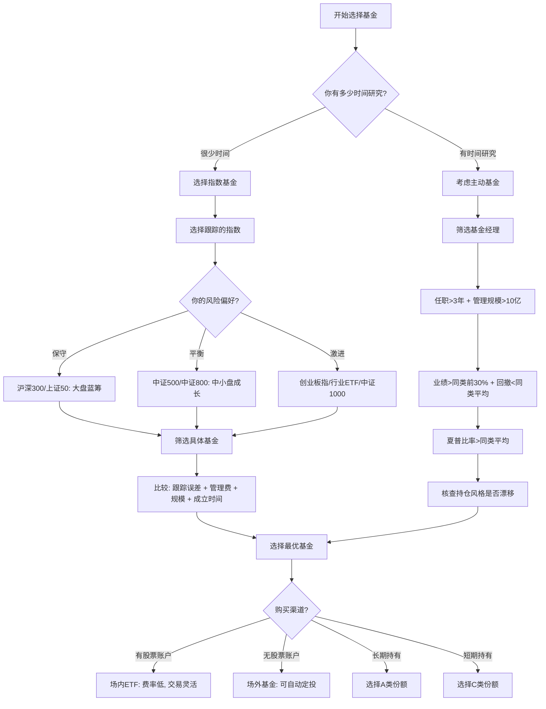

## 基金选择方法

选基金是定投的第一步，选错了标的，再好的策略也白搭。基金选择的核心逻辑是：**先选类型，再选指数，最后选具体基金**。这三步环环相扣，跳过任何一步都可能踩坑。

本节将系统讲解基金的完整分类体系、指数基金与主动基金的选择方法论、费率结构的深层分析、以及实操中的筛选流程和常见陷阱。学完本节，你将具备独立筛选优质基金的能力。

### 基金选择全景决策图



> **关键数据**：晨星研究显示，管理费率每降低0.5%，10年期投资总收益可提高约5%。以10万元投资为例，费率从1.5%降至0.5%，30年后终值差异可达20万元以上。费率是投资中唯一确定可控的变量——市场涨跌你无法预测，但费率高低你完全可以自己选择。

---

### 基金分类体系

在选择具体基金之前，先建立完整的基金分类认知。基金按投资标的和运作方式可以分为以下几大类：

#### 按投资标的分类

| 基金类型 | 投资范围 | 风险等级 | 预期年化收益 | 适合场景 |
|----------|----------|----------|-------------|----------|
| 货币基金 | 短期债券、银行存单、回购 | 极低 | 1.5%-3% | 现金管理、零钱理财 |
| 纯债基金 | 国债、企业债、金融债 | 低 | 3%-6% | 稳健配置、降低组合波动 |
| 混合偏债基金 | 债券为主(60%-80%)+少量股票 | 中低 | 4%-8% | 稳健增值 |
| 混合偏股基金 | 股票为主(60%-80%)+少量债券 | 中高 | 8%-15% | 长期增值 |
| 股票基金 | 股票占比≥80% | 高 | 10%-20% | 进取型长期投资 |
| 指数基金 | 跟踪特定指数 | 跟随指数 | 跟随指数 | 定投核心标的 |
| QDII基金 | 境外市场(美股、港股等) | 中高 | 跟随境外市场 | 全球资产配置 |
| 商品基金 | 黄金、原油等大宗商品 | 中高 | 跟随商品价格 | 抗通胀、避险 |

#### 按运作方式分类

**开放式基金**：随时申购赎回，规模可变。绝大多数公募基金都是开放式。流动性好，但基金经理可能面临赎回压力。

**封闭式基金**：在封闭期内不能赎回，只能在二级市场交易。封闭期通常1-3年。优点是基金经理不受赎回干扰，可以执行更长期的策略；缺点是流动性差。

**定期开放基金**：介于两者之间，定期开放申购赎回（如每季度开放一次）。兼顾了封闭运作和流动性需求。

#### 按管理方式分类

这是对投资决策影响最大的分类维度，下一节将详细展开。

---

### 指数基金 vs 主动基金：根本性选择

在做任何具体筛选之前，先理解两种基金的本质差异。这是基金投资中最重要的一次决策。

#### 核心差异对比

| 维度 | 指数基金 | 主动基金 |
|------|----------|----------|
| 管理方式 | 被动跟踪指数，不需要基金经理主动选股 | 基金经理主动选股、择时 |
| 费率 | 管理费0.15%-0.5%，托管费0.05%-0.1% | 管理费1%-1.5%，托管费0.15%-0.25% |
| 跟踪标的 | 明确（如沪深300、中证500） | 不确定，取决于基金经理判断 |
| 长期表现 | 跟踪误差小，收益接近指数 | 约70%的主动基金长期跑输指数 |
| 适合人群 | 大多数普通投资者 | 有能力筛选基金经理的投资者 |
| 透明度 | 高，持仓与指数一致 | 低，持仓季度才披露 |
| 选择难度 | 低，选指数即可 | 高，需要研究基金经理能力 |
| 规模影响 | 规模越大越好（摊薄成本） | 规模过大反而拖累业绩 |
| 人员依赖 | 几乎无依赖 | 高度依赖基金经理个人能力 |

#### 为什么指数基金更适合大多数人

根据标普道琼斯SPIVA（S&P Indices Versus Active）报告的持续追踪数据：

- **中国市场**：5年期来看，约65%-75%的主动基金跑输沪深300指数
- **美国市场**：10年期来看，约85%-90%的主动基金跑输标普500指数
- **全球市场**：主动基金跑输指数的比例随时间延长而增加

这意味着即使你花大量时间研究主动基金，选到能持续跑赢指数的概率也不到三分之一。更残酷的是，去年排名前10%的基金，明年继续排在前10%的概率不到5%——业绩的持续性极差。

对普通投资者来说，直接买指数基金反而是最优策略。这不是"偷懒"，而是基于统计事实的理性选择。

#### 什么情况下可以考虑主动基金

指数基金并非万能，在以下场景中主动基金有其价值：

1. **市场效率较低的领域**：如中小盘股、新兴市场，信息不对称更大，优秀的基金经理有更多发挥空间
2. **特定行业或主题**：如医药、科技等专业壁垒高的行业，专业基金经理的研究深度可能超过指数编制规则
3. **你有可靠的筛选能力**：能够持续跟踪基金经理的投资风格、持仓变化、业绩归因
4. **震荡市或熊市**：优秀基金经理可以通过减仓、调仓来控制回撤，而指数基金只能被动承受

---

### 指数基金选择方法论

#### 第一步：理解指数编制规则

选指数基金，首先要理解指数本身。指数不是凭空产生的，它有严格的编制规则，这些规则决定了指数的收益特征。

**主流宽基指数详解**：

| 指数 | 代码 | 成分股数量 | 编制规则要点 | 适合人群 | 波动性 | 长期年化收益 |
|------|------|-----------|-------------|----------|--------|------------|
| 沪深300 | 000300 | 300只 | A股市值最大、流动性最好的300只股票 | 稳健型，入门首选 | 中 | 8%-10% |
| 中证500 | 000905 | 500只 | 排除沪深300后，市值最大的500只 | 成长型，追求弹性 | 中高 | 9%-12% |
| 中证800 | 000906 | 800只 | 沪深300+中证500 | 全市场覆盖 | 中 | 8%-11% |
| 中证1000 | 000852 | 1000只 | 排除中证800后，市值最大的1000只 | 激进型，小盘弹性 | 极高 | 10%-15% |
| 上证50 | 000016 | 50只 | 上海证券交易所市值最大的50只 | 保守型，超大盘蓝筹 | 低 | 7%-9% |
| 创业板指 | 399006 | 100只 | 创业板市值最大的100只 | 激进型，科技成长 | 高 | 10%-15% |
| 科创50 | 000688 | 50只 | 科创板市值最大的50只 | 激进型，硬科技 | 极高 | 不确定(历史短) |
| 中证红利 | 000922 | 100只 | 股息率最高的100只股票 | 价值型，防守性强 | 低 | 7%-9% |
| 恒生指数 | HSI | 82只 | 港股主板市值最大的公司 | 分散A股集中度 | 中高 | 7%-10% |
| 纳斯达克100 | NDX | 100只 | 纳斯达克市值最大的100只非金融股 | 全球科技龙头 | 高 | 12%-18% |
| 标普500 | SPX | 500只 | 美国500家大型上市公司 | 全球配置核心 | 中 | 8%-12% |

**新手建议**：从沪深300开始，这是最"不会出错"的选择。等你对市场有了更深的理解，再逐步加入中证500、行业指数等。一个经典的入门组合是"沪深300+中证500"，按6:4或5:5配比，覆盖A股大中盘。

#### 第二步：选择具体基金（五维筛选法）

确定了要跟踪的指数后，下一步是从众多跟踪同一指数的基金中选出最优的一只。用以下五个维度逐一筛选：

**维度一：跟踪误差（最重要）**

跟踪误差衡量基金收益率与指数收益率之间的偏离程度。这是评价指数基金最核心的指标——指数基金存在的意义就是跟踪指数，如果跟踪不准，其他指标再好也没用。

```text
跟踪误差标准：
- < 0.05%：优秀（顶级基金公司的旗舰产品）
- 0.05%-0.1%：良好
- 0.1%-0.2%：合格
- > 0.2%：不推荐（跟踪能力有问题）
```

跟踪误差产生的原因包括：管理费和托管费的扣除、现金留存比例（基金需要保留一定现金应对赎回）、成分股调整时的交易成本、以及分红再投资的时间差。

**维度二：费率（长期影响巨大）**

```text
费率构成（指数基金）：
├── 管理费：0.15%-0.5%/年（ETF通常0.15%-0.5%，增强指数0.8%-1%）
├── 托管费：0.05%-0.1%/年
├── 申购费：场外0-0.15%（很多平台打1折），场内无（但有佣金）
├── 赎回费：持有<7天1.5%（惩罚性），7天-1年0.5%，>2年通常免
└── 销售服务费：C类份额0.2%-0.4%/年（替代申购费）
```

费率差0.3%，30年后的终值差异有多大？假设年化收益10%：

| 年限 | 费率0.2%终值 | 费率0.5%终值 | 差额 |
|------|-------------|-------------|------|
| 10年 | 25.9万 | 24.7万 | 1.2万 |
| 20年 | 67.1万 | 61.2万 | 5.9万 |
| 30年 | 174.0万 | 150.4万 | 23.6万 |

（以10万元初始投资计算）

**维度三：基金规模**

```text
规模筛选标准：
- < 2亿：有清盘风险，不推荐
- 2亿-50亿：理想区间
- 50亿-200亿：可以接受
- > 200亿：对指数基金影响不大，但主动基金则不推荐
```

为什么规模太小有风险？根据法规，基金资产净值连续60个工作日低于5000万元，基金管理人需要向证监会报告并提出解决方案。规模太小的基金随时可能被清盘，虽然不会损失本金，但会打乱你的投资计划。

**维度四：成立时间**

成立时间越长，历史数据越多，越能验证基金的跟踪效果。建议选择成立3年以上的基金。新基金可能在牛市中为了冲规模做过营销，跟踪误差数据不够有代表性。

**维度五：基金公司**

优先选择头部基金公司的产品。头部公司的优势在于：指数基金管理经验丰富、系统投入大（交易系统、风控系统）、流动性好（ETF尤其重要）、不太可能因经营问题而关闭产品。

国内指数基金管理规模排名靠前的公司包括：华夏基金、易方达基金、南方基金、嘉实基金、华泰柏瑞基金、天弘基金、招商基金等。

#### 第三步：同类基金实战比较

以沪深300指数基金为例，展示如何用五维筛选法做比较：

```text
沪深300指数基金比较（示例）：

| 基金名称     | 跟踪误差 | 管理费 | 托管费 | 规模   | 成立时间 | 基金公司 |
|-------------|----------|--------|--------|--------|----------|---------|
| 华夏沪深300ETF | 0.04%  | 0.15%  | 0.05%  | 300亿+ | 2012年   | 华夏    |
| 易方达沪深300ETF | 0.05% | 0.15%  | 0.05%  | 200亿+ | 2013年   | 易方达  |
| 嘉实沪深300ETF | 0.06%  | 0.15%  | 0.05%  | 150亿+ | 2012年   | 嘉实    |
| 某小公司沪深300 | 0.18% | 0.5%   | 0.1%   | 3亿    | 2021年   | 小公司  |

选择：前三者差距不大，都是优质标的。小公司产品在费率、跟踪误差、规模上全面落后。
```

**实操技巧**：在天天基金网搜索指数名称（如"沪深300"），按规模排序，优先选前5-10名，再逐一比较跟踪误差和费率。通常10分钟内就能确定最终选择。

---

### 场内ETF vs 场外基金：购买渠道选择

同一个指数通常有两种以上的购买渠道，选择哪种直接影响你的投资体验和成本。

#### 场内ETF（交易所交易基金）

**特点**：
- 需要开通股票账户（券商APP）
- 像买卖股票一样实时交易，价格随市场波动
- 费率最低：管理费通常0.15%，交易佣金万2-万5
- 流动性好（头部ETF日成交额数十亿）
- 可以盘中随时买卖，支持T+1（A股）

**适合场景**：有股票账户、喜欢灵活操作、大额投资（省费率优势明显）

#### 场外联接基金/指数基金

**特点**：
- 不需要股票账户，支付宝、天天基金等平台即可购买
- 按每日收盘净值申赎，一天只有一个价格
- 支持自动定投（设置后自动扣款）
- 费率略高于ETF（管理费相同，但申购费打折后通常0.1%-0.15%）
- 联接基金是投资于对应ETF的基金，本质上是"基金的基金"

**适合场景**：定投首选、没有股票账户、不想频繁操作

#### 场内LOF基金（上市型开放式基金）

LOF基金兼具场内和场外两种交易方式。你既可以在银行/平台按净值申购，也可以在股票账户按市价买卖。当出现折价（市价低于净值）时，可以在场内买入，实现"打折买基金"。

#### 选择建议

```text
购买渠道决策树：

你是否有股票账户？
├── 否 → 场外基金（联接基金）
│         └── 设置自动定投，省心省力
└── 是 → 你是否需要自动定投？
          ├── 是 → 场外基金（自动定投功能更完善）
          └── 否 → 场内ETF
                    └── 费率最低，交易最灵活
```

---

### A类、B类、C类份额：选对省钱

同一只基金往往有多个份额类别，它们的投资策略完全相同，唯一的区别在于费率结构。

#### 份额类型详解

| 份额类型 | 申购费 | 赎回费 | 销售服务费 | 适合持有时间 |
|----------|--------|--------|-----------|-------------|
| A类 | 有（0-1.5%，平台打折后0-0.15%） | 有（随持有时间递减） | 无 | 长期持有（>1年） |
| B类 | 无（后端收费，赎回时扣） | 有（随持有时间递减） | 无 | 长期持有（较少见） |
| C类 | 无 | 有（通常30天后免） | 有（0.2%-0.4%/年） | 短期持有（<1年） |

#### 选A还是选C？算笔账

假设投资10万元，基金年化收益10%：

```text
场景一：持有1年
A类：申购费0.1%（100元）+ 赎回费0.5%（约550元）= 650元
C类：销售服务费0.4%（约440元）+ 赎回费0（30天后免）= 440元
结论：短期持有选C类更划算

场景二：持有3年
A类：申购费0.1%（100元）+ 赎回费0（>2年免）= 100元
C类：销售服务费0.4%×3年（约1,450元）+ 赎回费0 = 1,450元
结论：长期持有选A类更划算

临界点：通常持有超过1年，A类更划算
```

**定投场景建议**：如果你是长期定投（计划持有3年以上），选A类。如果你不确定持有时间，或者可能需要短期调整，选C类更灵活。

---

### 债券基金选择方法

债券基金常被忽视，但它是资产配置中不可或缺的一环。在股市下跌时，债券基金往往能提供正收益，起到"压舱石"作用。

#### 债券基金分类

| 类型 | 投资范围 | 风险 | 预期年化 | 特点 |
|------|----------|------|----------|------|
| 短债基金 | 短期限债券（<1年） | 极低 | 2%-4% | 替代货币基金，收益略高 |
| 中长期纯债 | 各期限利率债+信用债 | 低 | 3%-6% | 稳定收益，波动小 |
| 一级债基 | 债券+打新股 | 中低 | 4%-8% | 打新增厚收益 |
| 二级债基 | 债券+少量股票（<20%） | 中 | 4%-10% | 可参与股市上涨 |
| 可转债基金 | 可转换债券 | 中高 | 5%-15% | 兼具债性和股性，波动大 |

#### 债券基金筛选要点

1. **看基金规模**：纯债基金规模越大越好（摊薄成本），2亿以上
2. **看最大回撤**：纯债基金年最大回撤应<2%，二级债基<10%
3. **看信用风险**：持仓中是否有低评级债券（AA以下），占比多少
4. **看基金经理**：债券投资更依赖宏观判断和信用研究能力
5. **看费率**：纯债基金管理费通常0.3%-0.6%，高于此值需警惕

#### 货币基金：零钱管理工具

货币基金是风险最低的基金类型，适合存放短期闲置资金。选择要点：

- **七日年化收益率**：参考指标，但不要追短期高收益（可能是昙花一现）
- **规模**：100亿-1000亿为佳。太大（如余额宝万亿规模）收益会被摊薄，太小有流动性风险
- **万份收益稳定性**：比看某一天的七日年化更重要
- **T+0快速赎回**：多数货币基金支持当日快速赎回（限额1万），日常应急够用

---

### QDII基金与全球配置

QDII（Qualified Domestic Institutional Investor）基金允许国内投资者间接投资境外市场，是实现全球资产配置的重要工具。

#### 主要QDII基金类型

| 跟踪市场 | 代表指数/标的 | 优势 | 风险 |
|----------|-------------|------|------|
| 美股大盘 | 标普500、纳斯达克100 | 全球最成熟的市场 | 汇率波动、溢价风险 |
| 港股 | 恒生指数、恒生科技 | 估值低、AH价差 | 受内地和国际资金双重影响 |
| 欧洲 | 德国DAX、英国富时100 | 分散美股集中度 | 欧元/英镑汇率波动 |
| 日本 | 日经225 | 日元资产、制造业龙头 | 日本经济结构性问题 |
| 印度 | 印度MSCI | 人口红利、高增长 | 市场不成熟、流动性差 |
| 越南 | 越南VN30 | 新兴市场高增长 | 风险极高、信息不透明 |

#### QDII基金注意事项

1. **溢价风险**：当QDII基金场内交易价格高于净值时，就是溢价。溢价买入意味着你多付了钱，一旦溢价收窄就会亏损。溢价超过5%时应谨慎，超过10%时应避免
2. **汇率影响**：人民币升值时，以美元计价的QDII基金收益会被汇率侵蚀；反之则增厚
3. **申购限制**：热门QDII基金经常限额甚至暂停申购，需要提前关注
4. **时差问题**：美股QDII基金的净值更新有延迟（T+2），不能实时反映市场变化

---

### 主动基金选择方法论

如果你决定投资主动基金，筛选标准要比指数基金严格得多。主动基金的选择本质上是选择基金经理。

#### 基金经理筛选六维模型

**维度一：任职年限（硬性门槛）**

```text
任职时间要求：
- < 1年：数据不足，无法判断
- 1-3年：数据不够充分，需谨慎
- 3-5年：基本可以判断，经历了至少一轮牛熊转换
- > 5年：数据充分，判断可靠性高
- > 10年：顶级经验，但要确认是同一个人管理
```

为什么3年是门槛？A股市场一个完整的牛熊周期通常3-5年。没经历过熊市的基金经理，你无法判断他在下跌时的风控能力。很多在牛市中风光无限的基金经理，在熊市中回撤比指数还大。

**维度二：管理规模**

```text
规模筛选标准：
- < 10亿：可能策略容量足够，但市场认可度待验证
- 10亿-100亿：理想区间，策略容量充足
- 100亿-300亿：需关注规模是否开始影响业绩
- > 300亿：船大难掉头，"抱团"风险高
```

为什么规模过大有问题？基金经理的策略容量是有限的。当他管理300亿时，买入一只股票可能动辄几亿，这会推高买入成本；卖出时同样面临流动性压力。很多基金在规模膨胀后业绩明显下滑。

**维度三：业绩排名**

```text
业绩评估标准：
- 任职以来年化收益 > 同类前30%
- 近1年、近3年、近5年排名均在前50%
- 不能只看某一个时间段表现好（避免"赌对了"的基金经理）
```

**维度四：风险控制（最大回撤）**

```text
回撤评估标准：
- 最大回撤 < 同类平均
- 牛市中不过度激进（收益不比同类高太多）
- 熊市中回撤可控（比指数跌得少）
```

最大回撤是衡量基金经理风控能力的关键指标。一个年化收益20%但最大回撤50%的基金，和一个年化收益15%但最大回撤20%的基金，后者的持有体验和实际收益可能更好——因为大多数人承受不了50%的回撤，会在最低点割肉。

**维度五：夏普比率（风险调整后收益）**

夏普比率 = (基金收益率 - 无风险利率) / 基金收益率标准差

```text
夏普比率标准：
- > 1：良好
- > 1.5：优秀
- > 2：顶级（非常罕见）
- < 0.5：不推荐（承担的风险与获得的收益不匹配）
```

夏普比率衡量的是"每承担一单位风险能获得多少超额收益"。两个基金收益相同，夏普比率更高的那个，说明它的收益更多来自能力而非运气。

**维度六：持仓风格一致性**

```text
需要核查的问题：
- 基金经理的投资风格是否稳定？（价值/成长/均衡）
- 持仓是否与基金名称/招募说明书一致？
- 是否存在"风格漂移"？（名为成长基金却重仓银行股）
- 前十大持仓集中度是否合理？（>60%过于集中）
```

风格漂移是主动基金的大忌。一个"科技成长基金"如果突然重仓了银行和地产，说明基金经理可能在追热点，这种行为让你无法对其形成稳定预期，也无法将其纳入你的资产配置计划。

#### 需要避开的主动基金特征

```text
六大警示信号：
1. 规模太小（< 1亿）：可能清盘
2. 规模太大（> 300亿）：策略容量受限，"抱团"风险
3. 频繁换基金经理：策略不连续，前任积累归零
4. 费率过高（管理费 > 1.5%）：长期吃掉大量收益
5. 追热点的基金：名字里带"创新""未来""机遇"，但持仓风格频繁切换
6. 名实不符：名字里带"科技创新"但持仓全是银行地产——挂羊头卖狗肉
```

#### "冠军魔咒"：不要追逐年度排名

每年的基金排名冠军，第二年大概率跑输同类平均水平。原因包括：

- 年度冠军往往是押注了某个行业或风格，恰好那一年这个风格表现好
- 成为冠军后大量资金涌入，基金经理被迫买入更多同类股票，推高成本
- 市场风格轮动，去年的热门往往是今年的冷门

**正确做法**：不看1年排名，看3-5年排名的稳定性。连续5年排名在同类前50%的基金，比某一年排名第1但其他年份排名靠后的基金，更值得信赖。

---

### 基金费率深度解析

费率是基金投资中唯一确定可控的变量。深入理解费率结构，能帮你每年省下数千甚至数万元。

#### 费率全景图

```text
基金费率结构：
├── 显性费用（直接扣除）
│   ├── 管理费：基金公司收取，每日从净值中扣除
│   ├── 托管费：托管银行收取，每日从净值中扣除
│   ├── 申购费/认购费：买入时收取
│   ├── 赎回费：卖出时收取（持有时间越短越高）
│   └── 销售服务费：C类份额收取，每日从净值中扣除
│
└── 隐性费用（不易察觉）
    ├── 交易佣金：基金买卖股票时的券商佣金
    ├── 冲击成本：大额交易对市场价格的影响
    ├── 成分股调整成本：指数调仓时的交易成本
    └── 现金拖累：持有现金部分不产生收益
```

#### 不同类型基金费率对比

| 基金类型 | 管理费 | 托管费 | 合计 | 申购费(打折后) |
|----------|--------|--------|------|---------------|
| 宽基指数ETF | 0.15%-0.5% | 0.05%-0.1% | 0.2%-0.6% | 场内无(有佣金) |
| 增强指数基金 | 0.8%-1.0% | 0.15%-0.2% | 0.95%-1.2% | 0.1%-0.15% |
| 主动股票基金 | 1.0%-1.5% | 0.15%-0.25% | 1.15%-1.75% | 0.1%-0.15% |
| 债券基金 | 0.3%-0.7% | 0.08%-0.15% | 0.38%-0.85% | 0-0.08% |
| 货币基金 | 0.15%-0.33% | 0.05%-0.08% | 0.2%-0.41% | 无 |

#### 赎回费的陷阱

赎回费是很多投资者忽视的成本。监管规定赎回费必须有一定比例计入基金资产（防止短期投机），持有时间越短赎回费越高：

```text
赎回费阶梯：
- 持有 < 7天：1.5%（惩罚性费率，绝对不能短线操作基金）
- 持有 7天-1年：0.5%
- 持有 1年-2年：0.25%
- 持有 > 2年：0%

重要提醒：持有不足7天赎回要交1.5%的惩罚性费率！
这意味着如果你买了10万基金，3天后赎回，要交1500元赎回费。
这是监管层为了遏制短期投机专门设置的门槛。
```

---

### 基金筛选实操流程

把前面的理论落地为可执行的操作流程：

#### 完整筛选步骤

```text
Step 1：确定投资目标
├── 投资期限：短期(<1年) / 中期(1-3年) / 长期(>3年)
├── 风险承受能力：保守 / 稳健 / 平衡 / 进取 / 激进
├── 投资金额：每月定投金额 or 一次性投入金额
└── 用途：应急储备 / 购房首付 / 子女教育 / 养老

Step 2：选择基金类型
├── 短期 + 保守 → 货币基金 / 短债基金
├── 中期 + 稳健 → 中长期纯债 / 二级债基
├── 长期 + 平衡 → 宽基指数基金（沪深300）
├── 长期 + 进取 → 宽基指数 + 行业指数
└── 长期 + 激进 → 中小盘指数 + 行业ETF + QDII

Step 3：选择具体指数
├── 参考本节"主流宽基指数详解"表格
├── 从沪深300开始，逐步扩展
└── 同一市场选一个即可（不要重复配置）

Step 4：筛选具体基金
├── 天天基金网搜索指数名称
├── 按规模排序，取前10名
├── 逐一比较：跟踪误差、费率、成立时间、基金公司
└── 选出1-2只最优基金

Step 5：确定购买渠道和份额类型
├── 长期定投 → 场外A类份额
├── 短期灵活 → 场外C类份额
├── 大额一次性 → 场内ETF
└── 设置自动定投（场外）或手动买入（场内）
```

#### 实操演示：筛选一只沪深300指数基金

```text
操作步骤：
1. 打开天天基金网(fund.eastmoney.com)
2. 搜索栏输入"沪深300"
3. 筛选条件：
   - 基金类型：指数型
   - 排序方式：按规模从大到小
4. 逐一点开前5-10只基金，记录：
   - 跟踪误差（基金页面→跟踪误差）
   - 管理费率（基金页面→费率详情）
   - 基金规模
   - 成立时间
   - 基金公司
5. 制作比较表，选出综合最优的1-2只
6. 检查是否为ETF还是场外基金（根据你的需求选择）
7. 确认份额类型（A类还是C类）
8. 完成购买
```

---

### 推荐的基金查询工具

| 工具 | 网址/APP | 核心优势 | 适合场景 |
|------|----------|---------|----------|
| 天天基金网 | fund.eastmoney.com | 数据最全面，筛选功能强大，覆盖所有公募基金 | 基金筛选和比较 |
| 晨星中国 | cn.morningstar.com | 评级权威，分析报告专业，风格箱直观 | 深度研究和评级 |
| 且慢 | qieman.com | 策略组合，适合不想自己选的投资者 | 跟投策略组合 |
| 蛋卷基金 | danjuanapp.com | 指数估值数据直观，温度计功能 | 指数估值判断 |
| 好买基金 | howbuy.com | 基金经理画像详细 | 研究主动基金经理 |
| 支付宝/蚂蚁财富 | 支付宝APP | 操作最方便，费率优惠多，用户基数大 | 日常定投和购买 |
| 且慢/雪球 | APP | 社区讨论+组合跟投 | 学习交流+跟投 |
| Choice金融终端 | 专业版 | 数据最全面，支持自定义筛选 | 专业分析（付费） |

**免费工具组合推荐**：天天基金（筛选）+ 晨星（评级）+ 蛋卷（估值）+ 支付宝（购买），覆盖从研究到执行的全流程。

---

### 常见基金选择误区

#### 误区一：只看短期排名买基金

**错误做法**：看到某基金近3个月涨了30%，立刻买入。

**为什么错**：短期大涨往往意味着该基金重仓的行业正处于风口，但风口过后大概率回调。追涨买入的投资者往往成为"接盘侠"。

**正确做法**：看3-5年业绩排名的稳定性，不追短期冠军。

#### 误区二：觉得净值低的基金更"便宜"

**错误做法**：觉得1元的新基金比3元的老基金更"划算"。

**为什么错**：基金净值反映的是过去的投资收益，3元的净值说明它从1元涨到了3元，说明管理能力强。1元的新基金没有任何历史业绩参考，反而风险更大。

**正确做法**：基金不是股票，净值高低不代表贵贱，只看涨跌百分比。

#### 误区三：频繁买卖基金

**错误做法**：基金跌了5%就赎回，涨了10%就止盈，反复操作。

**为什么错**：每次买卖都有费率成本（申购费+赎回费），频繁操作的费率成本可能吃掉大部分收益。而且持有不足7天要交1.5%惩罚性赎回费。

**正确做法**：基金投资至少持有1年以上，最好3-5年。定投更不需要频繁操作。

#### 误区四：只买一只基金

**错误做法**：把所有钱都投到一只基金中。

**为什么错**：即使是沪深300指数基金，单一市场也存在系统性风险。A股可能连续几年低迷，如果你急需用钱，可能不得不在亏损时卖出。

**正确做法**：至少配置2-3只不同类型/市场的基金。资产配置的具体方法将在技巧三中详细讲解。

#### 误区五：忽视费率差异

**错误做法**：觉得0.3%的费率差异"无所谓"。

**为什么错**：前文已经算过，0.3%的费率差异在30年后会造成23.6万元的终值差距。费率是确定的、可控的成本，是投资中唯一能完全由你决定的因素。

**正确做法**：同等条件下，永远选费率更低的那个。

#### 误区六：迷信基金评级

**错误做法**：只看晨星五星评级就买入。

**为什么错**：基金评级是基于过去业绩的，而过去业绩不能代表未来。五星基金降为四星甚至三星是很常见的事。评级可以作为参考，但不能作为唯一依据。

**正确做法**：评级作为筛选的起点（过滤掉三星以下），再用本节的五维筛选法做进一步判断。

#### 误区七：被基金名称误导

**错误做法**：看到"科技创新"基金就以为一定投资科技股。

**为什么错**：基金名称和实际持仓可能完全不一致。有些"科技创新"基金实际重仓银行、地产等传统行业，这叫做"风格漂移"。

**正确做法**：查看基金的前十大重仓股和行业分布，确认持仓与名称/你的预期一致。

---

### 进阶：Smart Beta与因子投资

当你对传统指数基金有了深入理解后，可以了解Smart Beta（聪明贝塔）策略。它介于被动指数和主动管理之间，通过特定的规则（因子）来选择和加权股票。

#### 常见因子策略

| 因子 | 策略逻辑 | 代表指数 | 适用环境 |
|------|----------|----------|----------|
| 红利因子 | 选择高股息率的股票 | 中证红利、上证红利 | 震荡市/熊市，防御性强 |
| 价值因子 | 选择估值低的股票 | 沪深300价值 | 价值回归期 |
| 成长因子 | 选择盈利增长快的股票 | 沪深300成长 | 经济上行期 |
| 低波动因子 | 选择股价波动小的股票 | 中证500低波动 | 不确定性高的市场 |
| 质量因子 | 选择盈利能力强的股票 | 沪深300质量 | 任何时期 |
| 动量因子 | 选择近期涨幅大的股票 | 较少见独立指数 | 趋势明确的市场 |

Smart Beta指数基金的管理费通常在0.3%-0.8%之间，高于普通指数但低于主动基金。对于有一定经验的投资者，Smart Beta提供了一种"有纪律的主动管理"方式。

---

### 小结

基金选择的核心方法可以浓缩为三句话：

1. **先选类型**：货币/债券/混合/股票/指数/QDII，根据投资目标和风险偏好确定
2. **再选指数**：沪深300/中证500/创业板指等，根据风险承受能力选择
3. **最后选基金**：五维筛选法（跟踪误差、费率、规模、成立时间、基金公司）

记住这几个关键原则：

- **费率是唯一可控变量**：永远选费率更低的同类基金
- **不要追逐短期排名**：看3-5年业绩的稳定性
- **指数基金适合大多数人**：不要高估自己选主动基金的能力
- **A类适合长期，C类适合短期**：根据持有计划选择份额类型
- **场外适合定投，场内适合灵活操作**：根据使用习惯选择渠道

基金选择做好了，投资就成功了一半。接下来，技巧三将讲解如何把选好的基金组合成一个完整的资产配置方案。
