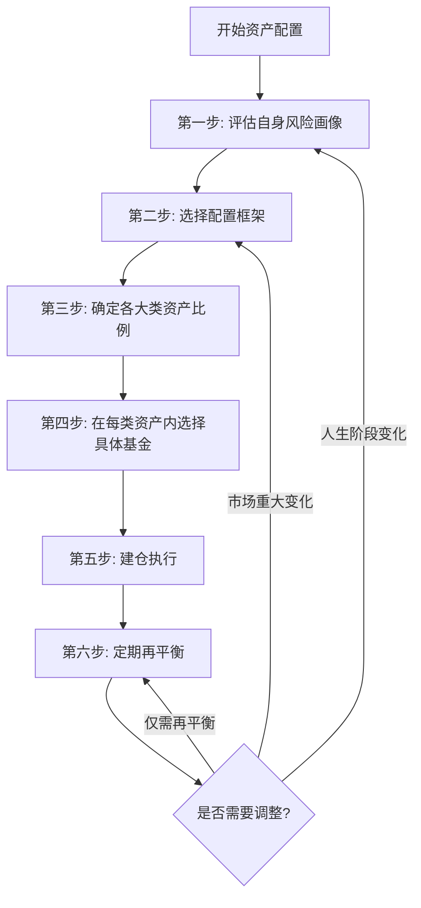

## 技巧三：资产配置实操

如果说选基金是"选食材"，那么资产配置就是"搭菜谱"。同样一批基金，不同的配置比例会带来截然不同的收益曲线和持有体验。诺贝尔经济学奖得主马科维茨（Harry Markowitz）的研究表明，投资组合90%以上的收益波动来自资产配置决策，而非个股或个券选择。

本节将从配置框架、风险画像、生命周期模型、实操建仓、再平衡策略五个维度，系统讲解如何将资产配置从理论落地为可执行的操作方案。

### 资产配置全景决策流程



---

### 资产配置的核心逻辑：为什么分散能降低风险

#### 分散投资的数学原理

分散投资不是"把鸡蛋放在不同篮子里"这么简单。它的数学本质是利用资产之间的**低相关性**来降低组合整体的波动。

假设你持有两类资产，A和B：

```text
资产A：预期收益10%，波动率20%
资产B：预期收益7%，波动率10%

如果A和B的相关系数为0（完全不相关）：
  组合各持50% → 预期收益8.5%，波动率约11.2%

如果A和B的相关系数为1（完全正相关）：
  组合各持50% → 预期收益8.5%，波动率15%

波动率从15%降到11.2%，收益不变——这就是分散的力量。
```

**关键概念：相关系数**

相关系数衡量两类资产价格走势的同步程度，取值范围 -1 到 +1：

| 相关系数 | 含义 | 分散效果 | 实际资产举例 |
|----------|------|----------|-------------|
| +1.0 | 完全同涨同跌 | 无分散效果 | 同一行业的两只股票 |
| +0.5 | 大致同向但幅度不同 | 一定分散效果 | 沪深300与中证500 |
| 0 | 走势独立 | 明显分散效果 | A股与黄金 |
| -0.5 | 大致反向 | 优秀分散效果 | 股票与长期国债（部分时期） |
| -1.0 | 完全反向 | 最佳分散效果 | 理想状态，现实中极少 |

> **重要提示**：资产之间的相关性不是固定的。在市场极端恐慌时（如2008年金融危机、2020年3月新冠冲击），原本低相关的资产可能同时下跌——这叫做"相关性趋同"。因此配置时要保留一部分现金或类现金资产作为终极缓冲。

#### 资产配置对收益的决定性影响

Brinson、Hood 和 Beebower 于1986年发表的经典研究（BHB研究）分析了91只大型养老基金10年的数据，结论是：

- **资产配置解释了投资组合收益差异的93.6%**
- 证券选择（选哪只股票/基金）解释了约4.2%
- 择时（什么时候买卖）解释了约2.2%

后续多项研究对具体比例有争议，但核心结论一致：**配置什么类型资产，比在每类资产里选哪只标的重要得多。**

---

### 主流资产配置框架

#### 框架一：战略资产配置（SAA）

战略资产配置是根据你的投资目标和风险承受能力，确定各大类资产的长期目标比例。这是资产配置的"骨架"，一旦确定，短期内不轻易变动。

**核心步骤**：

1. 确定可投资资产类别（股票、债券、商品、现金等）
2. 评估每类资产的长期预期收益、波动率和相关性
3. 通过均值-方差优化或简单规则确定目标比例
4. 设定偏离容忍区间（如 ±5%）

**各大类资产长期特征参考**：

| 资产类别 | 预期年化收益 | 年化波动率 | 主要作用 | 中国市场可选标的 |
|----------|-------------|-----------|----------|----------------|
| A股大盘 | 8%-10% | 20%-25% | 长期增值核心 | 沪深300ETF、上证50ETF |
| A股中小盘 | 9%-12% | 25%-35% | 增值弹性 | 中证500ETF、中证1000ETF |
| 港股 | 7%-10% | 20%-30% | 分散A股集中度 | 恒生ETF、恒生科技ETF |
| 美股 | 8%-12% | 15%-20% | 全球配置 | 纳斯达克100QDII、标普500QDII |
| 纯债 | 3%-6% | 2%-5% | 降低波动、稳定收益 | 十年国债ETF、纯债基金 |
| 黄金 | 5%-8% | 12%-18% | 抗通胀、避险 | 黄金ETF、积存金 |
| 货币 | 1.5%-3% | ~0 | 流动性储备 | 货币基金、短债基金 |

#### 框架二：战术资产配置（TAA）

在战略配置的基础上，根据对短期市场环境的判断，小幅调整各类资产的比例。这相当于在骨架上做"微调"。

```text
举例：你的战略配置是 股票60% + 债券30% + 黄金10%

你判断当前股市估值偏高、债券收益率有下行空间：
→ 战术调整：股票50% + 债券38% + 黄金12%

注意：战术调整幅度不应超过 ±10%，否则就是择时而非配置
```

**战术调整的依据**：

| 信号维度 | 看多股票 | 看空股票 |
|----------|----------|----------|
| 估值 | PE低于历史中位数 | PE高于历史中位数1.5倍 |
| 流动性 | 货币宽松、利率下行 | 货币收紧、利率上行 |
| 经济周期 | 复苏期、扩张早期 | 衰退期、滞胀期 |
| 市场情绪 | 极度悲观（逆向指标） | 极度乐观（逆向指标） |

> **警告**：战术资产配置要求较高的宏观判断能力，普通投资者不建议频繁操作。如果不确定，老老实实执行战略配置，不做战术调整，长期来看反而收益更好。

#### 框架三：核心-卫星策略

这是对普通投资者最友好的配置框架，兼顾了稳定性和灵活性。

```text
核心-卫星配置模型：

总资金 = 核心仓位(70%-80%) + 卫星仓位(20%-30%)

核心仓位：
  目标：稳健长期增值，不折腾
  标的：宽基指数基金（沪深300、中证500）
  策略：买入持有 + 定期再平衡
  调整频率：每年1-2次

卫星仓位：
  目标：增强收益，捕捉阶段性机会
  标的：行业ETF、QDII基金、商品基金
  策略：根据估值和趋势适度调整
  调整频率：每季度审视
```

核心-卫星策略的优势在于：核心仓位保证你不会"踏空"长期牛市，卫星仓位满足你"主动出击"的需求。即使卫星仓位判断失误，对整体影响有限。

#### 框架四：全天候策略（桥水All Weather理念）

桥水基金创始人达利欧（Ray Dalio）提出的全天候策略，核心思想是：经济环境可以分为四种状态，每种状态对应不同的受益资产。通过在四种环境中都持有相应资产，实现无论经济如何变化都不会大亏的组合。

```mermaid
quadrantChart
    title 经济环境四象限与受益资产
    x-axis 通胀下行 --> 通胀上行
    y-axis 增长下行 --> 增长上行
    quadrant-1 增长上行+通胀上行: 商品、通胀保值债券、新兴市场股票
    quadrant-2 增长上行+通胀下行: 股票、公司债、新兴市场债券
    quadrant-3 增长下行+通胀下行: 名义国债、通胀保值债券
    quadrant-4 增长下行+通胀上行: 商品、黄金、通胀保值债券
```

**简化版全天候配置（适合个人投资者）**：

| 资产类别 | 配比 | 理由 |
|----------|------|------|
| 长期国债 | 40% | 经济下行+通胀下行时的核心保护 |
| 股票（宽基指数） | 30% | 经济上行时的增值引擎 |
| 中期国债 | 15% | 降低组合波动 |
| 黄金 | 7.5% | 通胀上行+避险 |
| 商品 | 7.5% | 通胀上行时的收益来源 |

全天候策略的核心优势是**持有体验好**——最大回撤远小于纯股票组合，适合风险承受能力中等、不愿承受大幅波动的投资者。

---

### 风险画像评估：你到底能承受多大风险

在确定任何配置比例之前，先搞清楚自己的风险画像。风险画像由两个维度决定：**风险承受能力**（客观条件）和**风险偏好**（主观意愿）。

#### 风险承受能力评估

| 评估维度 | 低承受能力 | 中等承受能力 | 高承受能力 |
|----------|-----------|-------------|-----------|
| 年龄 | 55岁以上 | 35-55岁 | 35岁以下 |
| 收入稳定性 | 自由职业/不稳定 | 体制内/稳定工薪 | 高收入且稳定 |
| 家庭负担 | 高（房贷+子女教育+赡养） | 中等 | 低/无 |
| 投资期限 | < 3年 | 3-10年 | > 10年 |
| 应急储备 | 不足3个月支出 | 3-6个月支出 | > 6个月支出 |
| 投资经验 | 新手 | 有3年以上经验 | 5年以上且经历过熊市 |
| 负债率 | > 50% | 20%-50% | < 20% |

**评分方法**：以上7项，每项低=1分、中=2分、高=3分。总分：

- 7-11分：保守型（股票占比不超过30%）
- 12-16分：稳健型（股票占比30%-60%）
- 17-21分：进取型（股票占比60%-80%）

#### 风险偏好自测

风险承受能力是客观条件，风险偏好是主观感受。有些人客观上能承受很大波动，但心理上就是受不了账户亏损。两个维度需要取**较低值**作为最终风险画像。

**关键自测问题**：

1. 如果你的投资组合一个月内下跌了20%，你会怎么做？
   - A. 立刻全部卖出 → 保守型
   - B. 心里不安但不会卖 → 稳健型
   - C. 觉得是加仓机会 → 进取型

2. 以下两个选择你更倾向哪个？
   - A. 确定获得5%收益 → 保守型
   - B. 50%概率获得15%，50%概率亏损5% → 进取型

3. 你能忍受的最大年度亏损是多少？
   - A. 5%以内 → 保守型
   - B. 10%-15% → 稳健型
   - C. 20%-30% → 进取型

> **实操建议**：如果你不确定自己是哪种类型，先按保守配置开始。等经历了至少一轮市场波动（上涨和下跌）后，再根据真实感受调整。很多自认为"进取型"的投资者，在第一次经历30%回撤时才发现自己其实是"稳健型"。

---

### 生命周期资产配置模型

#### 经典"100法则"及其修正

最简单的年龄-配置公式是"100法则"：

```text
股票占比 = 100 - 年龄

例：
  25岁 → 股票75%，债券25%
  35岁 → 股票65%，债券35%
  50岁 → 股票50%，债券50%
  60岁 → 股票40%，债券60%
```

但这个公式过于粗糙，没有考虑个人实际情况。修正版需要加入以下调整因子：

```text
修正股票占比 = (100 - 年龄) + 调整因子

调整因子：
  +10：投资期限>15年，收入非常稳定，无负债
  +5：投资期限10-15年，收入稳定
  0：基准情况
  -5：投资期限5-10年，有一定家庭负担
  -10：投资期限<5年，收入不稳定，负债率高
  -15：临近退休或已有大额刚性支出需求
```

#### 不同人生阶段的配置方案

**阶段一：积累期（22-35岁）**

```yaml
特征: 收入增长快，可投资资金少但增长中，投资期限长
核心目标: 最大化长期增值，建立投资纪律

配置方案:
  A股宽基指数: 50%  # 沪深300+中证500，各25%
  港股/美股QDII: 15%  # 全球分散
  债券基金: 20%  # 降低波动
  黄金: 5%  # 小比例避险
  货币基金: 10%  # 应急+加仓弹药

定投建议: 月结余的50%-70%用于定投
重点关注: 坚持定投纪律，不要择时
```

**阶段二：成长期（35-50岁）**

```yaml
特征: 收入达到峰值，家庭支出增加（房贷、子女教育），责任最重
核心目标: 稳健增值，控制回撤，为子女教育和养老做准备

配置方案:
  A股宽基指数: 35%  # 降低集中度
  港股/美股QDII: 10%  # 全球配置
  纯债/二级债基: 30%  # 增加债券占比
  黄金: 10%  # 提高避险比例
  货币基金: 15%  # 保持流动性

特别注意:
  - 子女教育金单独管理，不与主投资组合混用
  - 确保应急资金覆盖6个月家庭支出
  - 考虑配置定期寿险和重疾险
```

**阶段三：成熟期（50-60岁）**

```yaml
特征: 临近退休，收入将下降，风险承受能力降低
核心目标: 保本为主，适度增值对抗通胀

配置方案:
  A股宽基指数: 20%  # 保持一定权益敞口
  纯债基金/国债: 40%  # 核心稳定器
  黄金: 10%  # 避险
  货币基金/短债: 30%  # 高流动性

特别注意:
  - 开始逐步卖出权益资产，转入债券和货币
  - 每年将生活费的2-3倍保留在货币基金中
  - 不要为了追求高收益而加大股票比例
```

**阶段四：退休期（60岁以上）**

```yaml
特征: 以养老金和投资收益为主要收入来源
核心目标: 保值 + 稳定现金流

配置方案:
  A股宽基指数: 10-15%  # 少量权益对抗通胀
  纯债基金/国债: 45%  # 稳定收益
  黄金: 5%  # 小比例避险
  货币基金/大额存单: 35-40%  # 随时可用

现金流规划:
  - 货币基金中保留3年生活费
  - 债券基金产生的利息用于补充生活费
  - 每年卖出少量股票基金用于再平衡
```

---

### 实操建仓：从零开始的配置执行

#### 第一步：做好前置准备

在开始配置之前，确保以下条件已满足：

```text
前置清单：
  [x] 已建立3-6个月支出的应急资金（放在货币基金）
  [x] 已还清高利率负债（信用卡分期、消费贷等）
  [x] 已配置基本保险（医保+商业医疗险+意外险）
  [x] 明确了投资目标和期限
  [x] 完成了风险画像评估
  [x] 选好了基金购买渠道（支付宝/天天基金/券商APP）
```

#### 第二步：确定具体配置比例

以一个**30岁、稳健型、月可投资金额5000元**的投资者为例：

```text
配置方案（稳健型，总可投资资金10万元 + 每月定投5000元）：

大类资产    目标比例    具体基金                  金额
──────────────────────────────────────────────────────
A股大盘     25%        沪深300ETF联接A            25,000
A股中盘     15%        中证500ETF联接A            15,000
美股QDII    10%        纳斯达克100QDII            10,000
纯债基金    25%        某纯债基金A                25,000
黄金        10%        黄金ETF联接A               10,000
货币基金    15%        某货币基金                  15,000
──────────────────────────────────────────────────────
合计       100%                                  100,000

每月定投5000元分配：
  沪深300联接: 1,500元
  中证500联接: 1,000元
  纳斯达克100QDII: 500元
  纯债基金: 1,200元
  黄金ETF联接: 500元
  货币基金: 300元
```

#### 第三步：建仓策略——一次性还是分批

| 建仓方式 | 操作方法 | 优点 | 缺点 | 适合场景 |
|----------|----------|------|------|----------|
| 一次性建仓 | 立即按目标比例全部买入 | 不错过上涨，简单直接 | 可能买在高点 | 市场估值偏低时 |
| 分批建仓 | 将资金分成6-12份，每月投入 | 平滑成本，心理压力小 | 牛市中收益低于一次性 | 市场估值中等或不确定时 |
| 估值建仓 | 根据PE百分位决定投入金额 | 低估多买、高估少买 | 需要判断估值，执行更复杂 | 有一定经验的投资者 |

**分批建仓实操示例**（10万元分10个月建仓）：

```text
每月投入10,000元，按比例分配：
  第1个月: 沪深300联接2500 + 中证500联接1500 + QDII1000
           + 纯债2500 + 黄金1000 + 货币1500
  第2-10个月: 同上
  第11个月起: 改为定投5000元/月

货币基金的15,000元（15%）在分批建仓期间先全部买入，
因为货币基金波动极小，不需要分批。
实际分批的是股票类+债券类+黄金 = 85,000元 ÷ 10个月
```

#### 第四步：定投金额的动态调整

随着收入增长和积蓄增加，定投金额应逐步提升。同时根据市场估值调整权益类定投金额：

```text
估值驱动的定投金额调整：

PE百分位 < 30%（低估）: 权益类定投金额 × 1.5
PE百分位 30%-70%（正常）: 权益类定投金额 × 1.0
PE百分位 > 70%（高估）: 权益类定投金额 × 0.6

注意：仅调整权益类（股票基金）的定投金额，
债券、黄金、货币部分保持不变。

PE百分位查询方式：
  - 理杏仁网站（lixinger.com）
  - 且慢估值
  - 天天基金APP指数估值功能
```

---

### 再平衡策略：配置的"维护保养"

资产配置不是"设好就忘"。随着时间推移，不同资产涨跌幅度不同，实际比例会偏离目标比例。再平衡就是定期将比例调整回目标值。

#### 为什么必须再平衡

```text
举例：初始配置 股票60% + 债券40%

一年后：
  股票上涨30% → 10万 × 1.3 = 13万
  债券上涨5%  → 10万 × 1.05 = 10.5万
  总资产 = 23.5万

  股票实际占比 = 13/23.5 = 55.3%（接近目标，问题不大）

三年后（假设股票连涨3年30%，债券每年5%）：
  股票 = 10万 × 1.3³ = 21.97万
  债券 = 10万 × 1.05³ = 11.58万
  总资产 = 33.55万

  股票实际占比 = 21.97/33.55 = 65.5%
  → 股票占比从60%升至65.5%，风险敞口放大
  → 如果接下来股市大跌20%，你的亏损会比预期更大
```

再平衡的本质是**纪律化的高卖低买**：卖出涨得多的资产（高卖），买入涨得少或跌了的资产（低买）。这正好与人性相反——人总想追涨杀跌，而再平衡强制你反向操作。

#### 再平衡的方法

**方法一：定期再平衡（推荐）**

```text
操作方式：
  每半年或每年固定日期检查一次资产比例
  偏离目标超过阈值时进行调整

推荐频率：
  - 每年1次：适合长期投资者，操作简单
  - 每半年1次：平衡精度和成本
  - 每季度1次：过于频繁，增加交易成本和税务负担

阈值设置（推荐）：
  - 绝对偏离5%：任何一类资产偏离目标5个百分点时触发
  - 例：目标60%股票，实际66%或54%时需要再平衡
```

**方法二：阈值再平衡**

```text
操作方式：
  不固定时间，仅当某类资产偏离超过阈值时触发
  优点：减少不必要的交易
  缺点：需要经常监控

阈值设置：
  大类资产（股票/债券）：偏离5%-8%触发
  小类资产（黄金/QDII）：偏离3%-5%触发
```

**方法三：现金流再平衡（最适合定投族）**

```text
操作方式：
  不卖出任何资产，通过调整新增资金的分配来恢复比例
  涨得多的少投或不投，跌得多的多投

举例：
  目标：股票60% 债券40%
  当前：股票65% 债券35%（股票涨多了）
  下个月定投5000元：
    → 全部投入债券基金5000元
    → 直到比例恢复到目标附近

优点：零卖出成本，无税务影响
缺点：当偏离很大时恢复速度慢
```

**实操建议**：定投族优先使用现金流再平衡。当偏离超过10%且现金流再平衡无法快速恢复时，再配合卖出操作。

#### 再平衡的操作示例

```text
年度再平衡检查（假设目标配置）：
  沪深300: 25%    中证500: 15%    纳斯达克100: 10%
  纯债: 25%       黄金: 10%       货币: 15%

年末实际比例：
  沪深300: 28% (+3%)    中证500: 12% (-3%)
  纳斯达克100: 13% (+3%)  纯债: 22% (-3%)
  黄金: 11% (+1%)        货币: 14% (-1%)

偏离检查：
  沪深300偏离3% < 5%阈值 → 不急
  中证500偏离3% < 5%阈值 → 不急
  纳斯达克100偏离3% < 5%阈值 → 不急

结论：所有偏离均在阈值内，本年无需再平衡操作。

如果沪深300升至32%（偏离7%）：
  → 卖出7%的沪深300（约总资产的7%）
  → 买入中证500、纯债等不足的资产
```

---

### 常见配置误区与纠正

#### 误区一：以为买了多只基金就是分散

```text
错误示范：
  买了5只基金：沪深300ETF + 上证50ETF + 中证800ETF
               + 银行ETF + 金融ETF

  实际情况：这些基金高度重叠，前十大持仓几乎都是
  贵州茅台、招商银行、中国平安等同一批股票
  → 看似5只基金，实际风险集中度和买1只差不多

正确做法：
  分散的维度应该是"资产类别"而非"基金数量"
  沪深300 + 中证500 + 纯债基金 + 黄金
  → 4只基金的分散效果远好于5只高度重叠的股票基金
```

#### 误区二：频繁调整配置比例

```text
错误心态：
  "最近股市涨得好，我把债券全卖了换成股票"
  "听说黄金要涨，我调到30%黄金"

  → 这不是资产配置，是追热点/择时

正确心态：
  战略配置确定后，除非人生阶段发生重大变化
  （结婚、生子、买房、换工作、退休），
  否则至少1年内不改变大类资产目标比例。

  战术微调最多 ±5%-10%，且每季度最多操作一次。
```

#### 误区三：忽视债券和货币基金的价值

```text
错误想法：
  "债券收益太低了，不如全买股票"

  真相：
  - 2018年A股沪深300下跌25.3%，纯债基金平均上涨6.3%
  - 2022年A股沪深300下跌21.6%，纯债基金平均上涨2.5%
  - 在熊市中，债券是让你"活下来"的关键

  债券的作用不是让你赚大钱，
  而是让你在股市暴跌时不至于恐慌割肉。
  一个下跌30%的组合，和一个下跌15%的组合，
  前者割肉的概率远高于后者。
```

#### 误区四：把资产配置当成一劳永逸的事

```text
错误做法：
  设好配置后三年不管，结果：
  - 原来60%的股票涨到了80%（牛市后）
  - 风险敞口已经远超自己的承受能力
  - 下一次大跌时亏损远超预期

正确做法：
  至少每半年审视一次配置比例
  偏离5%以上时执行再平衡
  人生阶段变化时重新评估风险画像
```

#### 误区五：照搬别人的配置方案

```text
错误做法：
  "我朋友的配置是70%股票+20%债券+10%黄金，
   我也照着来"

  → 你和朋友的年龄、收入、家庭负担、
    投资经验、心理承受能力可能完全不同

正确做法：
  配置方案必须基于自己的风险画像
  别人的方案可以参考框架，但比例要自己定
  先保守开始，根据真实体验逐步调整
```

---

### 进阶：多账户配置策略

当你有多个投资目标时，建议为每个目标建立独立的投资组合，分别配置。

#### 目标分账户模型

| 账户名称 | 目标 | 期限 | 风险等级 | 配置建议 |
|----------|------|------|----------|----------|
| 教育金账户 | 子女大学学费 | 10-18年 | 稳健 | 股票40% + 债券50% + 货币10% |
| 养老金账户 | 退休后生活 | 20-30年 | 进取→稳健 | 股票60%→逐步降至30% |
| 旅行基金 | 年度旅行 | 1-2年 | 保守 | 货币基金60% + 短债40% |
| 应急账户 | 突发支出 | 随时 | 极保守 | 100%货币基金 |
| 核心投资 | 财富增值 | 10年+ | 稳健-进取 | 按风险画像配置 |

#### 多账户管理要点

1. **各账户独立记账**：用Excel或记账APP分别记录每个账户的投入和收益
2. **各账户独立再平衡**：每个账户有自己的目标比例，分别再平衡
3. **不跨账户调配**：教育金账户的钱不要挪到核心投资账户追涨
4. **统一审视**：每半年整体审视所有账户的总配置情况

---

### 本节实操检查清单

```text
资产配置实操检查清单：

[ ] 完成风险画像评估（7项评分 + 3道自测题）
[ ] 确定人生阶段（积累期/成长期/成熟期/退休期）
[ ] 选择配置框架（核心卫星/全天候/生命周期）
[ ] 确定大类资产目标比例
[ ] 在每类资产中选定具体基金（参考技巧二）
[ ] 决定建仓方式（一次性/分批/估值驱动）
[ ] 设定再平衡频率和阈值（推荐每年1次 + 5%阈值）
[ ] 建立配置记录表（目标比例、实际比例、调整记录）
[ ] 设定日历提醒（每半年检查一次）
```
