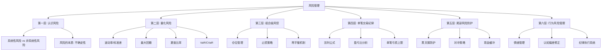
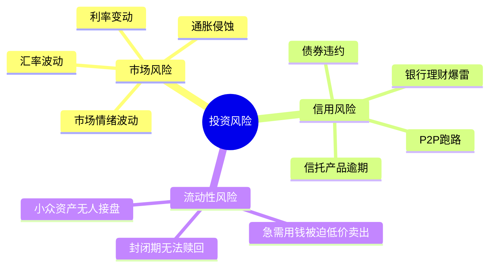
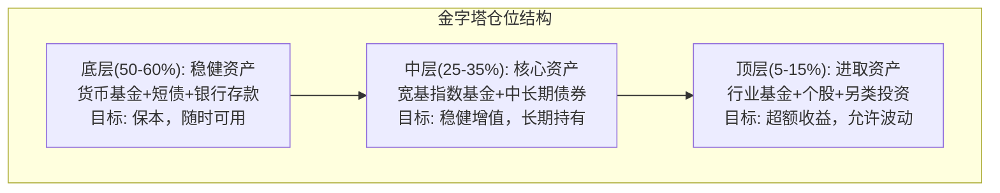
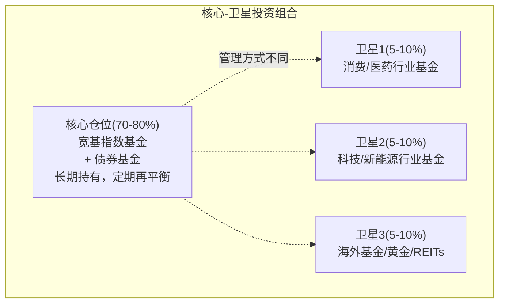

## 技巧四：风险管理方法

> "投资的首要原则是不要亏损，第二个原则是永远不要忘记第一条。" —— 沃伦·巴菲特

资产配置解决了"把钱放在哪里"的问题，但没有回答"如何保护这些钱"。风险管理不是在亏损发生后亡羊补牢，而是在每一笔投资决策之前就设定好防线。本节将从风险认知、核心指标、组合级管理、单笔交易纪律、尾部风险防护、行为风险管理六个层面，构建一套完整的个人投资者风险管理体系。

---

### 风险管理全景框架



---

### 一、认识风险：不只是"会亏钱"这么简单

#### 1.1 风险的真正定义

很多投资者把风险等同于"亏钱的可能性"，这是一个过于狭窄的理解。在投资学中，风险的核心定义是**未来实际收益偏离预期收益的不确定性**。这个定义包含两层含义：

**向下风险（损失风险）**：本金缩水的可能。比如你买入一只基金，净值从1.0跌到0.7，亏损30%。

**向上风险（踏空风险）**：错过收益的可能。比如你在2023年初因恐惧清仓，错过了全年20%的涨幅，这也是风险的一种。

个人投资者往往过度关注向下风险而忽视踏空风险，导致长期持有过多现金，实际购买力被通货膨胀悄悄侵蚀。

#### 1.2 系统性风险与非系统性风险

**系统性风险**是影响整个市场的风险，无法通过分散投资消除：

| 风险来源 | 具体表现 | 历史案例 | 影响范围 |
|----------|---------|---------|---------|
| 宏观经济衰退 | GDP下滑、企业盈利下降 | 2008年全球金融危机 | 全球所有资产类别 |
| 货币政策变动 | 利率升降、量化宽松/紧缩 | 2022年美联储激进加息 | 股票、债券、汇率 |
| 地缘政治冲突 | 战争、制裁、贸易摩擦 | 2022年俄乌冲突 | 能源、粮食、全球供应链 |
| 流动性危机 | 市场流动性枯竭 | 2020年3月新冠恐慌 | 短期内几乎所有资产同跌 |

**非系统性风险**是特定公司或行业的风险，可以通过分散投资显著降低：

| 风险来源 | 具体表现 | 案例 |
|----------|---------|------|
| 经营风险 | 公司管理不善、产品失败 | 瑞幸咖啡财务造假 |
| 行业风险 | 政策打击、技术颠覆 | 2021年教培行业双减政策 |
| 信用风险 | 债券发行人违约 | 恒大债券违约事件 |
| 流动性风险 | 某只基金/股票难以变现 | 小盘股停牌、封闭式基金折价 |

**关键结论**：持有1只股票承担的风险 ≈ 90%系统性风险 + 10%个股风险；持有30只以上分散的股票或宽基指数基金，非系统性风险几乎可以消除，剩余的主要是系统性风险。这正是普通投资者应优先选择指数基金而非个股的深层原因。

#### 1.3 风险的三大来源



---

### 二、量化风险：用数字替代直觉

"感觉风险很大"是最危险的风控方式。专业投资者用四个核心指标来量化风险，每个普通投资者都应该掌握。

#### 2.1 波动率（Volatility / 标准差）

**定义**：衡量资产价格偏离均值的幅度，通常用年化标准差表示。

**计算原理**：

$$\sigma = \sqrt{\frac{1}{n-1}\sum_{i=1}^{n}(r_i - \bar{r})^2}$$

其中 $r_i$ 为每期收益率，$\bar{r}$ 为平均收益率。

**直觉理解**：如果某基金年化收益10%、波动率20%，意味着在任何一年里，它的收益率大约有68%的概率落在 -10% 到 +30% 之间（正负一个标准差），约有95%的概率落在 -30% 到 +50% 之间（正负两个标准差）。

**各类资产的典型波动率**：

| 资产类别 | 年化波动率 | 含义 |
|----------|-----------|------|
| 货币基金 | 0.1-0.5% | 几乎没有波动 |
| 短债基金 | 1-3% | 极小波动 |
| 中长期纯债基金 | 2-5% | 小幅波动 |
| 沪深300指数 | 20-25% | 显著波动 |
| 中证500指数 | 25-30% | 较大波动 |
| 个股（平均） | 30-50% | 高度波动 |
| 比特币 | 60-80% | 极端波动 |

**实操意义**：波动率不是"风险"本身，但它是风险的温度计。如果你无法承受资产价格下跌20%的心理压力，就不应该配置波动率超过25%的资产超过50%的仓位。

#### 2.2 最大回撤（Maximum Drawdown）

**定义**：从历史最高点到最低点的最大跌幅，衡量"最坏情况"下你会亏多少。

**计算公式**：

$$MDD = \frac{Trough - Peak}{Peak} \times 100\%$$

**为什么最大回撤比波动率更直观**：波动率是统计抽象值，而最大回撤回答的是一个投资者最关心的问题——"我最多会亏多少钱？"

**主要指数/基金的历史最大回撤参考**：

| 投资标的 | 时间区间 | 最大回撤 | 恢复时间 |
|----------|---------|---------|---------|
| 沪深300 | 2005-2024 | -72.3%（2008年） | 约7年 |
| 沪深300 | 2005-2024 | -46.7%（2015年） | 约3年 |
| 中证500 | 2007-2024 | -72.4%（2008年） | 约8年 |
| 标普500 | 2000-2024 | -56.8%（2008年） | 约5.5年 |
| 恒生指数 | 2000-2024 | -66.0%（2008年） | 约12年 |

**最大回撤的使用方法**：

1. **投资前**：查看你准备投资的基金/指数的历史最大回撤，问自己"如果这个情况再现，我能否承受？"
2. **设定底线**：如果你的心理承受极限是亏损30%，那么当组合回撤接近30%时，应触发减仓或对冲信号
3. **预留安全边际**：历史最大回撤不等于未来最大回撤，建议以历史最大回撤的1.2-1.5倍作为心理准备值

#### 2.3 夏普比率（Sharpe Ratio）

**定义**：每承担1单位风险能获得多少超额收益，是衡量风险调整后收益的核心指标。

**公式**：

$$Sharpe = \frac{R_p - R_f}{\sigma_p}$$

其中 $R_p$ 为组合收益率，$R_f$ 为无风险利率（通常取1年期国债收益率），$\sigma_p$ 为组合波动率。

**直觉理解**：

| 夏普比率 | 水平 | 含义 |
|----------|------|------|
| < 0 | 很差 | 承担了风险但收益不如无风险资产 |
| 0-0.5 | 一般 | 风险收益比偏低 |
| 0.5-1.0 | 良好 | 风险收益比合理 |
| 1.0-2.0 | 优秀 | 以较低风险获得了较好收益 |
| > 2.0 | 顶级 | 极少数策略能长期维持此水平 |

**实操应用**：选择两只历史收益相近的基金时，夏普比率更高的那只意味着"用更少的焦虑赚到同样的钱"。例如：基金A年化收益12%、波动率18%，夏普比率0.56；基金B年化收益11%、波动率12%，夏普比率0.75。虽然基金A收益更高，但基金B的风险调整后表现更优。

#### 2.4 在险价值（VaR）与条件在险价值（CVaR）

**VaR（Value at Risk）**：在给定置信水平下，最大可能亏损。

> 示例：95% VaR = -3% 意味着"在95%的情况下，单日亏损不超过3%"。换言之，大约每20个交易日会有1天亏损超过3%。

**CVaR（Conditional VaR / Expected Shortfall）**：当亏损超过VaR时，平均会亏多少。

> 示例：如果95% CVaR = -5%，意味着当那5%的极端下跌发生时，平均亏损是5%。CVaR比VaR更保守，更能反映尾部风险。

**个人投资者的简化用法**：不必精确计算VaR，但应建立如下意识——根据历史数据，沪深300指数的单日95% VaR大约为-2.5%。这意味着如果你持有10万元指数基金，有5%的概率在某一天亏损超过2500元。如果你每周检查一次账户，每月大约会遇到1-2次"超出正常波动"的下跌日。

---

### 三、组合级风险管理：构建你的防御体系

#### 3.1 仓位管理：决定你生死的最关键变量

仓位管理的核心原则是：**永远不要让任何单一资产的亏损威胁到你的整体财务安全**。

**金字塔仓位法**：



**各层资产的功能对比**：

| 层级 | 占比 | 资产类型 | 预期收益 | 最大可接受回撤 | 功能 |
|------|------|---------|---------|---------------|------|
| 底层 | 50-60% | 货币基金、短债、存款 | 2-3% | < 2% | 安全垫、流动性储备 |
| 中层 | 25-35% | 宽基指数、中长债 | 5-10% | 15-25% | 长期增值主力 |
| 顶层 | 5-15% | 行业基金、个股、另类 | 不确定 | 可全部亏损 | 进攻性配置 |

**仓位管理的三条铁律**：

1. **永远留有现金**：至少保留6个月生活费的应急资金（放在货币基金中），这部分钱绝对不进入任何风险投资
2. **单一品种不超过总资产的20%**：即使是看好的行业基金，也不要超过总资产的五分之一
3. **风险资产总量有上限**：进取型资产（顶层）的亏损不应超过你一年可投资收入的30%

#### 3.2 止损策略：什么时候该认输

止损是风险管理中最具争议的话题。反对者说"止损会让你卖在最低点"，支持者说"不止损会让你血本无归"。真相是：**止损是一种保险，保费就是偶尔被震出的成本，但它能在极端情况下救你一命**。

**三种止损方法**：

**方法一：固定比例止损**

设定一个最大亏损阈值，达到即卖出。常见阈值：

| 投资品种 | 建议止损线 | 理由 |
|----------|-----------|------|
| 宽基指数基金定投 | 不设止损，坚持定投 | 定投本身就是分散风险的机制 |
| 行业/主题基金 | -15%到-20% | 行业轮动风险大，错判要及时修正 |
| 个股 | -8%到-12% | 个股波动大，需要更紧的止损 |
| 债券基金 | -3%到-5% | 债券基金不应有大亏损，超过说明有信用风险 |

**方法二：跟踪止损（移动止损）**

当投资获利后，将止损线随价格上涨而上移。例如：你以1.00元买入某基金，止损线设在0.85元（-15%）。当净值涨到1.20元时，止损线上移到1.02元（从最高点回撤15%）。这样即使之后大跌，你至少能保住微利。

**方法三：时间止损**

如果一笔投资在设定的时间内（比如6个月）没有达到预期表现，考虑清仓。这个方法特别适用于基于特定逻辑（如某个政策利好）买入的投资——如果逻辑迟迟未兑现，说明判断可能有误。

**止损的注意事项**：

- 止损线一旦设定就不要轻易修改（不能因为"再给它一次机会"而下移止损线）
- 不要在情绪恐慌时执行止损，应提前在交易软件中设置条件单
- 止损不等于永远不再投资——止损后应重新评估，决定是否在更低价格接回

#### 3.3 再平衡机制：纪律化的风险控制

再平衡是被最低估的风险管理工具。它的原理很简单：**当某类资产因上涨占比过高时，卖出一部分买入占比偏低的资产，维持原始配置比例**。

**再平衡的触发条件**：

| 触发方式 | 机制 | 适合人群 |
|----------|------|---------|
| 定时再平衡 | 每季度/每半年/每年执行一次 | 怕麻烦的投资者 |
| 阈值再平衡 | 某类资产偏离目标比例超过5%时触发 | 有定期关注习惯的投资者 |
| 定时+阈值 | 每季度检查，仅当偏离超过5%时才操作 | 推荐大多数人使用 |

**再平衡为什么能降低风险**：

本质是"高卖低买"的纪律化执行。假设你的目标配置是60%股票基金 + 40%债券基金：

| 时间 | 股票占比 | 债券占比 | 操作 |
|------|---------|---------|------|
| 年初 | 60% | 40% | 初始配置 |
| 股市大涨后 | 72% | 28% | 卖出12%的股票基金，买入12%债券基金 |
| 股市大跌后 | 48% | 52% | 卖出12%的债券基金，买入12%股票基金 |

再平衡的收益不来自于"预测市场"，而来自于**在波动中持续做"高卖低买"的机械操作**。学术研究表明，定期再平衡可以在降低组合波动的同时提升长期收益约0.5-1.5个百分点。

#### 3.4 核心-卫星策略

这是将上述方法整合在一起的实用框架：



| 部分 | 占比 | 风控要求 |
|------|------|---------|
| 核心仓位 | 70-80% | 不止损，定期再平衡，3-5年持有周期 |
| 卫星仓位 | 20-30% | 严格止损（-15%），半年评估一次，允许灵活调整 |

---

### 四、单笔交易纪律：凯利公式与盈亏比

#### 4.1 凯利公式：科学决定每笔投资该投多少钱

凯利公式（Kelly Criterion）源自信息论，由贝尔实验室的John Kelly于1956年提出，后被Ed Thorp应用于赌场和金融市场。它的核心作用是：**在已知胜率和赔率的情况下，计算使长期资本增长率最大化的最优下注比例**。

**公式**：

$$f^* = \frac{bp - q}{b}$$

其中：
- $f^*$ = 最优投入比例
- $b$ = 盈亏比（盈利/亏损）
- $p$ = 胜率
- $q = 1 - p$ = 败率

**实例演算**：

假设你有一个投资策略，历史数据表明胜率为60%，平均盈利15%，平均亏损10%：

```text
b = 15% / 10% = 1.5（盈亏比）
p = 0.60（胜率）
q = 0.40（败率）

f* = (1.5 × 0.60 - 0.40) / 1.5
   = (0.90 - 0.40) / 1.5
   = 0.50 / 1.5
   = 0.333 = 33.3%
```

结论：在这个策略下，每笔投资不应超过可投资资金的33.3%。

**重要提醒**：实际操作中，建议使用**半凯利**（凯利值的一半）。原因有三：

1. 胜率和盈亏比是基于历史数据估算的，存在误差
2. 全凯利在连续亏损时波动过大，容易导致心理崩溃
3. 半凯利牺牲约25%的长期增长率，但大幅降低了波动和回撤

以上例来说，实际投入比例应为 33.3% / 2 ≈ 16.7%。

**不同场景的凯利值参考**：

| 场景 | 估计胜率 | 估计盈亏比 | 全凯利 | 半凯利(建议) |
|------|---------|-----------|--------|-------------|
| 定投宽基指数 | 65% | 2:1 | 42.5% | 21% |
| 行业轮动策略 | 55% | 1.5:1 | 18.3% | 9% |
| 个股投资 | 50% | 1.5:1 | 16.7% | 8% |
| 趋势跟踪 | 40% | 3:1 | 26.7% | 13% |

#### 4.2 盈亏比分析：确保你的策略在数学上可行

**盈亏比（Risk-Reward Ratio）** = 预期盈利 / 预期亏损

一个策略要长期盈利，必须满足：**胜率 × 平均盈利 > 败率 × 平均亏损**

**盈亏比与最低胜率的关系**：

| 盈亏比 | 最低胜率要求 | 说明 |
|--------|------------|------|
| 1:1 | > 50% | 需要超过一半的交易盈利才能赚钱 |
| 1.5:1 | > 40% | 40%胜率即可盈利，适合趋势策略 |
| 2:1 | > 33% | 只需三分之一交易盈利 |
| 3:1 | > 25% | 四分之一胜率即可，大趋势捕捉型 |

**实操建议**：在买入任何投资之前，先明确三个数字：

1. 我的预期收益是多少？（目标价或预期涨幅）
2. 我的最大亏损是多少？（止损价或可承受亏损）
3. 盈亏比是否 ≥ 1.5:1？

如果盈亏比低于1.5:1，这笔投资不值得做——即使你判断对了方向，长期来看也不赚钱。

#### 4.3 单笔亏损上限

无论使用什么策略，单笔投资的最大亏损应控制在总资产的**1-3%**以内。这是专业交易员的通行规则。

**为什么是1-3%？**

假设你单笔亏损上限为总资产的2%，那么即使连续亏损10次，总亏损约为 1 - (0.98)^10 ≈ 18.3%。虽然痛苦，但本金仍然安全，且你有充足的资本继续执行策略。

如果单笔亏损为10%，连续亏损10次后的总亏损约为 1 - (0.90)^10 ≈ 65.1%，几乎没有翻身的可能。

**如何计算单笔投资额**：

$$单笔最大投资额 = \frac{总资产 \times 2\%}{止损幅度}$$

例如：总资产10万元，计划止损幅度为-10%：

$$单笔最大投资额 = \frac{100000 \times 2\%}{10\%} = 20000元$$

这笔投资最多投入2万元，即使触发止损，损失为 20000 × 10% = 2000元，占总资产的2%。

---

### 五、尾部风险防护：为黑天鹅事件做准备

#### 5.1 什么是尾部风险

尾部风险是指概率极低但破坏力极大的事件。以正态分布为参照，这些事件落在分布曲线的"尾部"——发生概率不到5%，但一旦发生，损失远超预期。

**历史上的尾部风险事件**：

| 事件 | 时间 | 沪深300跌幅 | 恢复时间 |
|------|------|------------|---------|
| 全球金融危机 | 2008年 | -72.3% | ~7年 |
| 钱荒 | 2013年6月 | -15%（1个月） | ~3个月 |
| 杠杆牛崩塌 | 2015年6-8月 | -46.7% | ~3年 |
| 中美贸易摩擦 | 2018年 | -25.3% | ~1.5年 |
| 新冠疫情 | 2020年1-3月 | -16.0% | ~4个月 |
| 全球加息冲击 | 2022年 | -21.6% | ~1年 |

**关键规律**：大约每3-5年就会出现一次"百年一遇"级别的市场冲击。这意味着如果你的投资周期是20年，至少会经历4-6次重大回撤。不为尾部风险做准备，等于是在赌运气。

#### 5.2 尾部风险防护的四大工具

**工具一：现金缓冲（最简单、最重要）**

在风险资产之外，始终保留一定比例的现金或类现金资产。这部分资金不仅在危机时提供心理安全垫，更是抄底的弹药。

| 投资者类型 | 建议现金比例 | 功能 |
|-----------|------------|------|
| 保守型（退休/近退休） | 30-50% | 保障生活，降低波动 |
| 稳健型（工薪族） | 15-25% | 应急+择机加仓 |
| 进取型（年轻人/高收入） | 10-15% | 抄底弹药 |

**工具二：黄金配置**

黄金是"乱世之金"，在股市暴跌时通常有对冲作用。配置5-10%的黄金（实物金或黄金ETF），可以在极端事件中降低组合整体回撤。

历史数据佐证：2008年金融危机期间，沪深300下跌72%，同期国际金价上涨约5%；2020年3月全球恐慌中，股市暴跌后黄金短暂下跌，但全年上涨25%。

**工具三：股债平衡**

股债的负相关性（在大多数情况下）是天然的风险对冲机制。当股票下跌时，债券通常上涨，起到缓冲作用。

| 组合 | 股票占比 | 债券占比 | 2008年最大回撤 | 长期年化收益 |
|------|---------|---------|---------------|------------|
| 激进型 | 80% | 20% | 约-55% | 约9% |
| 平衡型 | 60% | 40% | 约-38% | 约7.5% |
| 稳健型 | 40% | 60% | 约-25% | 约6% |
| 保守型 | 20% | 80% | 约-12% | 约4.5% |

**工具四：分散地域风险**

不要把所有投资都放在A股市场。配置一定比例的海外资产（如跟踪标普500或MSCI全球指数的QDII基金），可以避免单一市场的系统性风险。

A股与美股的相关性约为0.3-0.5（远低于同一市场内股票之间的相关性），这意味着当A股大跌时，美股不一定同步下跌，反之亦然。

建议海外配置比例：总资产的10-30%，可根据个人风险偏好调整。

---

### 六、行为风险管理：管住自己才能管住钱

#### 6.1 投资者的七大行为偏差

投资中80%的亏损不是因为选错了资产，而是因为**在错误的时间做了错误的决策**。行为金融学的研究揭示了人类在投资中最常犯的认知偏差：

| 偏差 | 定义 | 典型表现 | 危害 | 应对方法 |
|------|------|---------|------|---------|
| 损失厌恶 | 亏损的痛苦是等额盈利快乐的2-2.5倍 | 死扛亏损不愿止损，稍有盈利就急于卖出 | 亏大赚小 | 设定自动止损单 |
| 锚定效应 | 过度依赖第一个接触到的信息 | "这只基金之前涨到过2元，现在1.5肯定便宜" | 买入被高估的资产 | 关注基本面而非历史价格 |
| 确认偏差 | 只关注支持自己观点的信息 | 买入后只看利好消息，忽视风险信号 | 延迟止损 | 定期主动寻找反面论据 |
| 羊群效应 | 跟随大多数人做决策 | 大家都在买我也买 | 高买低卖 | 制定并遵守投资计划 |
| 过度自信 | 高估自己的判断能力 | "我能准确判断市场顶部和底部" | 频繁交易，损失手续费 | 记录交易日志，回顾胜率 |
| 近因偏差 | 过度看重最近发生的事件 | 最近涨了就认为会一直涨 | 追涨杀跌 | 拉长时间维度看收益 |
| 沉没成本 | 因为已投入的成本而继续错误决策 | "已经亏了30%，现在卖太可惜" | 越陷越深 | 问自己"如果现在持有现金，我会重新买入这只基金吗" |

#### 6.2 构建个人风控执行系统

知道偏差不等于能避免偏差。你需要一个**系统化的执行框架**，用规则替代情绪做决策。

**风控执行清单**：

**买入前（必做）**：
- [ ] 明确买入逻辑（为什么要买？看涨理由是什么？）
- [ ] 设定止损价位（跌到多少卖出？）
- [ ] 设定止盈目标（涨到多少卖出？或用什么指标判断？）
- [ ] 计算盈亏比（是否 ≥ 1.5:1？）
- [ ] 确认仓位不超过单笔上限（总资产的2%止损上限）
- [ ] 检查是否违反"不追涨"原则（近期是否已大涨？）

**持有中（定期检查）**：
- [ ] 买入逻辑是否仍然成立？（基本面有无变化？）
- [ ] 是否触发止损线？
- [ ] 组合整体风险是否超标？（各资产占比是否偏离目标？）
- [ ] 是否需要再平衡？

**卖出时（记录）**：
- [ ] 记录卖出原因（止损/止盈/逻辑变化/再平衡）
- [ ] 记录盈亏金额和持有时间
- [ ] 复盘：这笔交易哪里做得好？哪里可以改进？

#### 6.3 情绪管理的实用技巧

**技巧一：48小时冷静期**

当市场出现剧烈波动（单日涨跌超过3%）时，强制自己等待48小时再做任何操作。研究表明，绝大多数冲动交易发生在波动发生的当天，而48小时后情绪通常回归理性。

**技巧二：账户分离**

将投资资金和日常资金完全分开，使用不同的银行账户或投资平台。日常用钱从日常账户取，不要因为短期需要钱而在不合适的时机卖出投资。

**技巧三：降低查看频率**

将查看账户的频率从每天降低到每周甚至每月。研究表明，每天查看账户的投资者比每月查看的投资者更容易做出冲动决策（因为每天都看到了波动的"噪音"）。

**技巧四：写下投资日记**

记录每次买入/卖出决策的理由和当时的情绪状态。定期回顾你会发现自己的决策模式——在恐慌时卖出、在贪婪时买入——认识到这一点本身就是巨大的进步。

---

### 七、风险管理实战模板

以下是将本节内容整合为可直接使用的个人风险管理模板：

#### 7.1 投资者风险画像评估表

在做任何投资之前，先完成以下评估：

| 评估维度 | 问题 | 你的答案 | 对应建议 |
|----------|------|---------|---------|
| 年龄 | 你多大？ | ___岁 | 年龄越大，风险资产占比越低 |
| 收入稳定性 | 收入是否稳定？ | 稳定/不稳定 | 不稳定需要更多现金储备 |
| 投资期限 | 这笔钱多久不用？ | ___年 | 期限越短，越应保守 |
| 亏损承受力 | 你能接受最大多少亏损？ | ___% | 根据此数字选配资产 |
| 投资经验 | 你投资几年了？ | ___年 | 新手应从低风险开始 |
| 知识水平 | 你了解投资知识吗？ | 了解/不了解 | 不了解先学习再投资 |

**风险画像快速判定**：

- 若多数答案指向"保守"：股票类资产占比不超过30%
- 若多数答案指向"稳健"：股票类资产占比30-60%
- 若多数答案指向"进取"：股票类资产占比60-80%

#### 7.2 个人风控规则模板

```text
=== 我的投资风控规则 v1.0 ===

【总则】
- 应急资金：____个月生活费，存放于货币基金
- 投资资金上限：总资产扣除应急资金后的部分

【仓位规则】
- 单笔投资上限：总资产的____%
- 单一行业/主题上限：总资产的____%
- 进取型资产（股票/行业基金）上限：总资产的____%

【止损规则】
- 宽基指数基金：不定投止损，止盈目标____%
- 行业基金：止损线____%，止盈目标____%
- 个股：止损线____%，止盈目标____%

【再平衡规则】
- 频率：每____个月检查一次
- 阈值：偏离目标比例超过____%时执行
- 方法：卖出超配资产，买入低配资产

【情绪管理规则】
- 波动超过____%时等待48小时再决策
- 查看账户频率：每____天一次
- 每次交易记录投资日记

【规则修订】
- 每年1月修订一次
- 重大人生变化时（结婚、买房、换工作）修订
```

---

### 八、常见误区与纠正

**误区一："我投资的是长期，不需要风险管理"**

纠正：长期投资恰恰更需要风险管理。2007年高点买入沪深300的投资者，即使持有到2024年（17年），收益依然微薄，因为72%的回撤需要约200%的涨幅才能回本。风险管理不是"不投资"，而是"更聪明地投资"。

**误区二："分散投资就是买很多只基金"**

纠正：买了10只行业基金，如果它们都是A股股票型基金，在系统性风险面前仍然会同涨同跌。真正的分散是**跨资产类别**（股票+债券+黄金+现金）、**跨市场**（A股+港股+美股）、**跨风格**（成长+价值+红利）的分散。

**误区三："止损了就亏了，不止损就只是浮亏"**

纠正：浮亏和实亏在财务上是一样的——你的资产缩水了。"浮亏不是亏"是一种自我安慰的心理偏差，它让你避免面对痛苦，但也让你失去了修正错误的机会。

**误区四："风险越大收益越高，所以我应该冒最大风险"**

纠正：风险和收益的正相关关系是**统计意义上的平均趋势**，不是保证。高风险投资的正确理解是：高风险意味着收益的**可能性范围更大**——可能赚很多，也可能亏很多。如果你没有承受"亏很多"的能力，就不应该追求"赚很多"。

**误区五："我的风控系统很完美，不需要留现金"**

纠正：没有任何风控系统能应对所有情况。现金缓冲的作用不是"赚钱"，而是**让你在极端情况下保持选择权**——不用被迫在最差的时机卖出资产。

---

### 九、进阶内容：深度风控工具与策略

#### 9.1 压力测试

压力测试是将你的投资组合放在极端历史情境中，看它会亏多少。

**如何对自己的组合做压力测试**：

1. 确定你的组合中各资产的比例
2. 查询各资产在以下历史事件中的表现
3. 按比例加权计算组合整体的回撤

| 压力测试情境 | A股跌幅 | 债券变动 | 黄金变动 | 美股跌幅 |
|-------------|---------|---------|---------|---------|
| 2008年金融危机 | -72% | +10% | +5% | -57% |
| 2015年股灾 | -47% | +5% | -5% | 0% |
| 2020年新冠 | -16% | +2% | +25% | -34% |
| 2022年加息 | -22% | -3% | +1% | -25% |

**示例**：假设你的组合是60%沪深300 + 30%债券基金 + 10%黄金，压力测试2008年情境：

```text
组合回撤 = 60% × (-72%) + 30% × (+10%) + 10% × (+5%)
         = -43.2% + 3.0% + 0.5%
         = -39.7%
```

如果你无法承受约40%的回撤，就需要调整配置比例。

#### 9.2 风险平价模型

传统的60/40股债配置有一个问题：股票的波动率大约是债券的3-5倍，这意味着组合的风险几乎全部来自股票部分。

**风险平价（Risk Parity）**的思路是：让每类资产对组合风险的贡献相等，而不是让资金占比相等。

| 配置方式 | 股票资金占比 | 债券资金占比 | 股票风险贡献 | 债券风险贡献 |
|----------|------------|------------|------------|------------|
| 传统60/40 | 60% | 40% | ~90% | ~10% |
| 风险平价 | ~25% | ~75%（或加杠杆） | ~50% | ~50% |

对于个人投资者，一个简化的风险平价做法是：**根据资产的波动率倒数来分配权重**。

```text
股票年化波动率 ≈ 22%
债券年化波动率 ≈ 5%

波动率倒数比 = (1/22) : (1/5) = 0.045 : 0.2 = 1 : 4.4

标准化后：股票占比 ≈ 18%，债券占比 ≈ 82%
```

这意味着在"风险平价"框架下，你需要用更少的股票仓位和更多的债券仓位来构建组合。这听起来"不赚钱"，但实际上，通过债券部分使用杠杆或选择中高收益债券，可以在降低波动的同时维持合理的收益水平。

#### 9.3 尾部风险对冲策略进阶

对于资金量较大（100万元以上）的投资者，可以考虑更精细的尾部风险对冲：

**策略一：看跌期权保护（Put Protection）**

如果投资了ETF，可以买入看跌期权（Put Option）作为保险。例如持有10万元沪深300ETF，买入行权价为当前价格95%的看跌期权，成本约为组合的1-3%（取决于期限和波动率）。这样即使指数暴跌，你的最大亏损被锁定在5%加上期权成本。

**策略二：波动率交易（VIX相关）**

VIX恐慌指数与股市呈负相关。当VIX处于历史低位时（市场极度乐观），适当配置VIX相关的ETF或期权，可以在市场恐慌时获利。但这是一个高级策略，需要深入理解后再操作。

**策略三：趋势跟踪信号**

使用简单的移动平均线作为风控信号。例如：

- 沪深300收盘价 > 200日均线：保持满仓
- 沪深300收盘价 < 200日均线：减仓至50%，剩余转入债券

历史回测显示，这个简单的规则可以规避2008年和2015年的大部分下跌，但会在震荡市中产生较多的错误信号（"假突破"）。它更适合作为辅助风控手段而非唯一的决策依据。

---

### 本节核心要点回顾

| 风控层级 | 核心工具 | 关键行动 |
|----------|---------|---------|
| 认识风险 | 系统性 vs 非系统性风险 | 理解风险的本质是不确定性 |
| 量化风险 | 波动率、最大回撤、夏普比率、VaR | 用数字替代直觉评估风险 |
| 组合级风控 | 仓位管理、止损、再平衡、核心-卫星 | 构建多层次防御体系 |
| 交易纪律 | 凯利公式、盈亏比、单笔亏损上限 | 每笔交易都经过数学验证 |
| 尾部风险 | 现金缓冲、黄金、股债平衡、地域分散 | 为"不可能"的事件做准备 |
| 行为管理 | 认知偏差识别、风控执行清单、情绪技巧 | 用系统替代情绪做决策 |

风险管理不是一次性的设置，而是一个持续运行的系统。它不会让你的投资收益更高，但会让你在每一次市场风暴中活下来——而在投资的世界里，**活下来，就是最大的胜利**。

> "在别人贪婪时恐惧，在别人恐惧时贪婪"——这句话的前提是，你在别人贪婪时没有全仓追高，在别人恐惧时还有子弹可以加仓。这一切的基础，就是风险管理。
