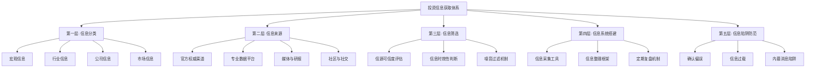
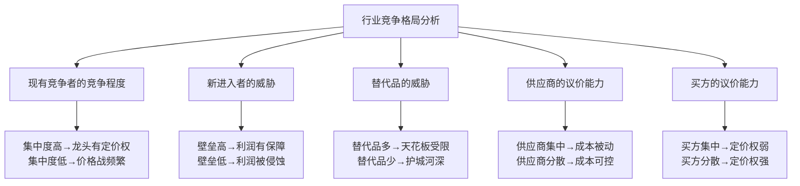
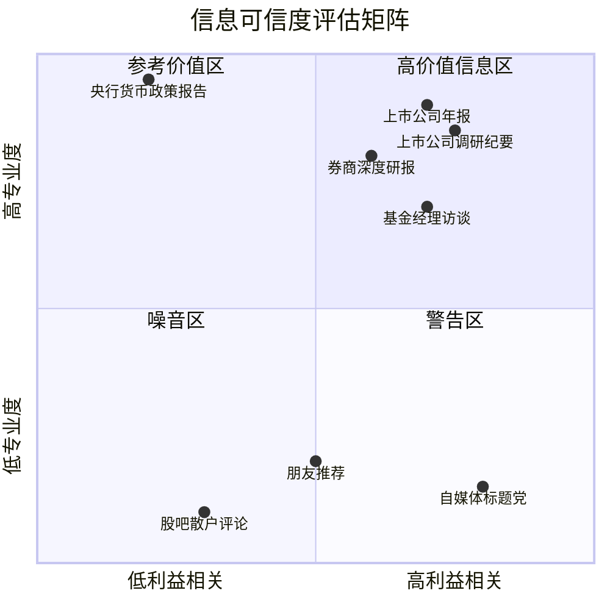
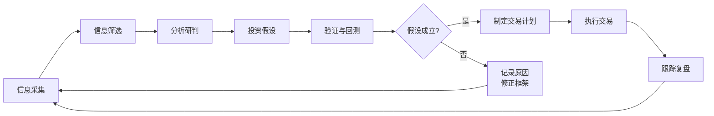

## 技巧五：投资信息获取

> "在信息时代，投资者最大的优势不是资金量，而是获取和处理信息的能力。" —— 彼得·林奇

投资本质上是一场信息博弈。你所获取的信息质量、处理信息的速度、以及从噪音中提取信号的能力，直接决定了投资决策的优劣。本节将从信息分类体系、权威信息源、信息筛选方法、个人信息系统搭建、常见信息陷阱五个层面，构建一套完整的投资信息获取框架。

---

### 信息获取全景框架



---

### 第一层：理解投资信息的分类体系

投资信息并非铁板一块。不同类别的信息影响不同层面的决策，获取渠道、更新频率、分析方法也完全不同。理清信息分类，是构建信息体系的第一步。

#### 1.1 宏观经济信息

宏观信息影响的是整个市场的方向和节奏。它决定了你"该不该入场"以及"该配置哪类资产"。

**核心宏观指标清单：**

| 指标类别 | 具体指标 | 发布频率 | 数据来源 | 对投资的影响 |
|---------|---------|---------|---------|------------|
| 经济增长 | GDP增速 | 季度 | 国家统计局 | 反映经济整体健康度，GDP加速利好股市 |
| 通货膨胀 | CPI（居民消费价格指数） | 月度 | 国家统计局 | CPI过高引发加息预期，压制股市和债市 |
| 通货膨胀 | PPI（工业生产者出厂价格指数） | 月度 | 国家统计局 | PPI上升预示企业成本压力，影响利润 |
| 货币政策 | M2增速、社融数据 | 月度 | 央行 | 宽松货币利好资产价格，紧缩则相反 |
| 就业数据 | 城镇调查失业率 | 月度 | 国家统计局 | 就业恶化可能触发政策宽松 |
| 利率政策 | LPR、MLF、逆回购利率 | 不定期 | 央行 | 利率下调利好债市和成长股 |
| 汇率 | 人民币兑美元汇率 | 实时 | 外汇交易中心 | 汇率贬值利好出口企业，升值利好进口 |
| 国际环境 | 美联储议息会议、非农数据 | 不定期/月度 | 美联储/美国劳工部 | 影响全球资金流向和风险偏好 |

**如何使用宏观信息：**

宏观信息不是用来预测明天涨跌的，而是用来判断当前处于经济周期的哪个阶段。经济周期分为四个阶段——复苏、过热、滞胀、衰退——每个阶段对应不同的最优资产配置：

| 经济阶段 | 特征 | 最优资产 | 应避免的资产 |
|---------|------|---------|------------|
| 复苏期 | GDP回升、通胀低、政策宽松 | 股票（尤其是周期股） | 长期国债 |
| 过热期 | GDP高、通胀上升、政策收紧 | 大宗商品、通胀保值债券 | 成长股 |
| 滞胀期 | GDP下降、通胀高 | 现金、黄金 | 股票、长期债券 |
| 衰退期 | GDP下降、通胀下降、政策宽松 | 长期国债、防御性股票 | 周期股、大宗商品 |

#### 1.2 行业信息

行业信息回答的问题是"在确定了大方向之后，该投哪个赛道"。

**行业信息的四个维度：**

**（一）行业生命周期**

每个行业都有从萌芽到衰退的生命周期。不同阶段的投资逻辑完全不同：

- **萌芽期**：技术刚刚出现，市场空间不确定。典型特征是高投入、低收入、亏损居多。投资风险极高，但一旦押中可能是百倍回报。适合风险承受能力极强的投资者小额配置。
- **成长期**：市场需求爆发，行业增速远超GDP。典型特征是收入快速增长、竞争者涌入。这是投资的黄金期，但需要关注估值是否过高。
- **成熟期**：增速放缓，行业格局基本确定。龙头企业具有规模效应和品牌壁垒。适合追求稳健收益的投资者，关注分红和估值回归。
- **衰退期**：技术被替代或需求萎缩。除非有极强的逆周期逻辑，否则应谨慎回避。

**（二）行业竞争格局**

用波特五力模型分析一个行业的竞争强度：



**（三）行业政策环境**

中国市场的政策导向对行业影响巨大。获取行业政策信息的关键渠道：

- 国务院政策文件库（www.gov.cn）：查看国家级产业政策
- 各部委官网：工信部、发改委、证监会等发布的行业规范
- 地方政府招商政策：了解区域产业扶持方向
- 行业协会报告：如中国汽车工业协会、中国光伏行业协会等

**判断政策影响的三层分析法：**

1. **政策意图**：这个政策要解决什么问题？是鼓励还是限制？
2. **政策力度**：是方向性指引还是有具体量化目标和时间表？
3. **政策落地**：有没有配套的财政补贴、税收优惠、监管措施？

只有三个层面都明确的政策，才真正值得纳入投资决策。

**（四）行业关键数据**

不同行业有不同的核心跟踪指标：

| 行业 | 关键跟踪指标 | 数据来源 |
|------|------------|---------|
| 房地产 | 销售面积、库存去化周期、土地出让金 | 中指研究院、克而瑞 |
| 半导体 | 费城半导体指数、晶圆代工产能利用率 | SEMI、各公司财报 |
| 新能源 | 装机量、电池级碳酸锂价格、组件价格 | BNEF、Wind |
| 消费 | 社零数据、消费者信心指数、电商GMV | 国家统计局、阿里/京东公告 |
| 医药 | 创新药临床进度、集采政策、医保目录调整 | 药监局、医保局 |
| 金融 | 社融数据、银行不良贷款率、保费收入 | 央行、银保监会 |

#### 1.3 公司信息

公司信息是最终做投资决策的微观基础。它回答的问题是"在选定了行业之后，该买哪家公司"。

**公司信息的五大来源：**

**（一）财务报告**

上市公司财务报告是最重要的公司信息来源，也是法律要求必须披露的信息。

| 报告类型 | 披露时间 | 内容密度 | 重点关注 |
|---------|---------|---------|---------|
| 年报 | 次年4月30日前 | 最详细 | 经营情况讨论、财务报表、审计意见 |
| 半年报 | 8月31日前 | 较详细 | 中期业绩、经营变化 |
| 一季报 | 4月30日前 | 简要 | 收入利润的季节性变化 |
| 三季报 | 10月31日前 | 简要 | 前三季度累计数据 |

**读财报的黄金顺序：**

1. **先看审计意见**：如果审计师出具"保留意见"或"无法表示意见"，直接跳过这家公司
2. **再看现金流量表**：经营活动现金流是否为正？是否匹配利润？利润高但现金流差的公司要警惕
3. **然后看资产负债表**：负债率是否合理？商誉是否过高？应收账款是否异常增长？
4. **最后看利润表**：收入增速、毛利率变化、费用率趋势
5. **交叉验证**：用现金流量表验证利润表的真实性——利润可以调节，现金流很难造假

**（二）公告与临时信息披露**

上市公司的重要事件都会通过公告披露：

- 重大合同/订单：预示未来收入
- 股东增减持：大股东最了解公司，其行为是重要信号
- 股权激励计划：管理层对公司前景的信心
- 定增/可转债：融资用途揭示公司战略方向
- 诉讼/处罚：潜在风险暴露

获取渠道：巨潮资讯网（www.cninfo.com.cn）、上交所/深交所官网。

**（三）投资者关系活动记录**

上市公司会定期接待机构调研，调研纪要通常比财报更能反映管理层的真实想法。获取渠道：

- 巨潮资讯网的"投资者关系活动记录表"
- 各券商的研究终端

**阅读调研纪要的关键：**

- 关注管理层对未来的表述是否发生变化
- 关注机构提问的焦点在哪里（机构关注点往往比公司主动披露的信息更重要）
- 对比不同时间的纪要，看管理层是否前后一致

**（四）股东结构与资金流向**

- **十大股东变化**：是否出现知名基金经理？是否被社保基金增持？
- **股东人数变化**：股东人数减少通常意味着筹码集中，可能有上涨预期
- **北向资金流向**：外资对A股个股的持仓变化，反映国际投资者的判断
- **融资融券数据**：融资余额增加代表市场看多情绪升温

**（五）券商研究报告**

券商研报是获取行业和公司分析的重要渠道。但需要注意筛选：

| 研报类型 | 价值 | 使用建议 |
|---------|------|---------|
| 深度报告（30页以上） | 高 | 值得精读，看逻辑框架和数据引用 |
| 行业报告 | 中高 | 了解行业全貌和趋势 |
| 调研纪要整理 | 中 | 获取一手信息，但需自行判断 |
| 事件点评 | 中低 | 快速了解市场对事件的解读 |
| 晨会纪要 | 低 | 信息密度低，适合快速浏览 |

获取渠道：慧博投研资讯、萝卜投研、东方财富研报中心、各券商官方APP。

#### 1.4 市场信息

市场信息反映的是市场参与者的集体情绪和行为，它影响的是"什么时候买"和"什么时候卖"。

**关键市场指标：**

| 指标 | 含义 | 使用方法 |
|------|------|---------|
| 成交量 | 市场活跃程度 | 放量上涨是健康信号，放量下跌是恐慌信号 |
| 换手率 | 筹码流转速度 | 换手率过高（>15%）提示短期见顶风险 |
| 涨跌比 | 上涨与下跌个股数量比 | 涨跌比<0.3说明市场极度悲观，可能接近底部 |
| 两市成交额 | 全市场资金活跃度 | 连续低于6000亿说明市场低迷，可能是底部区域 |
| 融资余额 | 杠杆资金规模 | 融资余额大幅下降提示去杠杆压力 |
| 北向资金 | 外资流向 | 持续大额流入通常代表外资看好 |
| 新增开户数 | 散户入场情绪 | 开户数暴增往往出现在行情末期 |

---

### 第二层：权威信息源清单

信息源的质量直接决定投资决策的质量。下面按可靠度分级列出常用信息源。

#### 2.1 第一梯队：官方权威渠道（可靠度最高）

这类信息具有法律效力，是最值得信赖的一手信息。

| 信息源 | 网址 | 主要内容 |
|-------|------|---------|
| 巨潮资讯网 | cninfo.com.cn | 上市公司公告、财报的法定披露平台 |
| 中国人民银行 | pbc.gov.cn | 货币政策、利率决议、金融统计数据 |
| 国家统计局 | stats.gov.cn | GDP、CPI、PMI等宏观经济数据 |
| 中国证监会 | csrc.gov.cn | 监管政策、行政处罚、市场规则 |
| 上交所/深交所 | sse.com.cn / szse.cn | 交易所公告、市场数据、规则变更 |
| 国务院 | gov.cn | 国家政策、重大决策 |
| 外汇交易中心 | chinamoney.com.cn | 汇率、债券市场数据 |

#### 2.2 第二梯队：专业数据平台（可靠度高）

这些平台对官方数据进行了加工整理，提高了使用效率。

| 平台 | 特点 | 适合人群 |
|------|------|---------|
| 东方财富网 | 数据全面、免费、更新及时 | 入门到中级投资者 |
| 同花顺iFinD | 专业级终端，数据深度高 | 专业投资者、分析师 |
| Wind（万得） | 金融行业标配，数据最全 | 专业投资者（付费） |
| 理杏仁 | 估值数据突出，界面简洁 | 价值投资者 |
| 乌龟量化 | 指数估值、基金筛选 | 基金投资者 |
| 集思录 | 可转债、套利策略数据 | 固收+投资者 |
| Tushare | Python金融数据接口 | 量化投资者 |

#### 2.3 第三梯队：研报与媒体（需要筛选）

这类信息有参考价值，但需要批判性阅读。

**研报获取渠道：**
- 慧博投研资讯（hibor.com.cn）：研报聚合平台
- 萝卜投研（robo.datayes.com）：AI辅助的研报分析
- 各券商官方APP：如中信证券、国泰君安等

**财经媒体：**
- 财新网：深度调查报道，宏观经济分析权威
- 第一财经：覆盖面广，更新及时
- 证券时报/上海证券报：证券市场专业报道
- 经济观察报：宏观政策解读

**国际信息源：**
- Bloomberg（彭博）：全球金融数据标杆
- Reuters（路透）：全球财经新闻
- The Economist（经济学人）：深度经济分析
- FRED（美联储经济数据库）：美国及全球经济数据

#### 2.4 第四梯队：社区与社交（需要高度警惕）

社交媒体上的投资信息鱼龙混杂，是噪音和误导信息的重灾区。

| 平台 | 内容特点 | 使用建议 |
|------|---------|---------|
| 雪球 | 投资社区，用户讨论活跃 | 可看观点启发，但不可作为决策依据 |
| 东方财富股吧 | 散户情绪风向标 | 当做反向指标观察市场情绪 |
| 知乎 | 长文分析质量参差不齐 | 关注专业认证用户的深度回答 |
| 微博财经 | 信息速度快但噪音极大 | 仅用于快速了解市场热点 |
| 微信公众号 | 内容质量差异巨大 | 选择性关注3-5个高质量账号 |

---

### 第三层：信息筛选与评估方法

获取信息只是第一步，筛选和评估才是真正的核心能力。

#### 3.1 信源可信度评估矩阵

不是所有信息都值得同等对待。用以下矩阵对信息进行分级：



**评估信息的五个维度：**

1. **来源权威性**：信息发布者是否有专业资质？是否有过往的准确记录？
2. **利益关联性**：信息发布者是否与讨论标的有利益关系？（券商给自家推荐的股票打高分，就是典型的利益冲突）
3. **数据支撑度**：观点是否有数据支撑？还是纯粹的主观判断？
4. **逻辑严密性**：推理过程是否自洽？是否有逻辑跳跃？
5. **可证伪性**：这个观点是否可以被验证或推翻？如果怎么都对，那等于什么都没说

#### 3.2 区分事实、观点与噪音

这是信息处理中最关键的技能之一：

| 类型 | 定义 | 举例 | 处理方式 |
|------|------|------|---------|
| 事实 | 可验证的客观数据 | "公司Q3营收同比增长25%" | 记录、存储、用于分析 |
| 观点 | 基于事实的主观判断 | "公司明年营收会增长30%" | 记录观点和逻辑，独立验证 |
| 噪音 | 无信息量的情绪表达 | "这只股票要飞了！" | 过滤、忽略 |

**实操原则：** 投资决策应基于事实，参考经过验证的观点，过滤所有噪音。

#### 3.3 信息时效性管理

不同信息有不同的"保质期"：

| 信息类型 | 保质期 | 处理方式 |
|---------|--------|---------|
| 实时行情 | 秒级 | 除交易决策外，不必实时关注 |
| 财报数据 | 季度 | 发布后48小时内完成分析 |
| 行业趋势 | 月度到季度 | 每月回顾更新 |
| 宏观经济数据 | 月度 | 发布后一周内完成解读 |
| 政策变化 | 年度级 | 发布后深度解读，纳入长期框架 |
| 投资理论/框架 | 长期有效 | 持续学习和内化 |

---

### 第四层：搭建个人投资信息系统

知道信息在哪里还不够，你需要一个系统化的框架来持续获取、整理和使用信息。

#### 4.1 晨间信息扫描流程（15分钟）

每天开盘前用15分钟完成以下信息扫描：

**第一步：宏观速览（3分钟）**
- 打开东方财富或同花顺APP的"要闻"板块
- 浏览隔夜美股收盘情况（标普500、纳斯达克、道琼斯）
- 检查是否有重大政策发布（央行、国务院）
- 查看北向资金预期流向

**第二步：持仓检查（5分钟）**
- 检查持仓个股是否有新公告（巨潮资讯网）
- 检查持仓基金的净值更新
- 确认是否有即将触发的止盈/止损条件

**第三步：行业扫描（5分钟）**
- 浏览关注行业的最新动态
- 检查是否有行业政策出台
- 关注行业关键数据是否更新

**第四步：市场情绪（2分钟）**
- 观察两市集合竞价情况
- 浏览涨跌停板数量
- 感受市场整体情绪温度

#### 4.2 周度深度研究框架（2-3小时）

每周末花2-3小时进行深度研究：

**Step 1：宏观环境更新**
- 更新宏观经济数据表
- 判断经济周期位置是否发生变化
- 检查货币政策方向是否有变化

**Step 2：行业轮动分析**
- 对比各行业ETF的周涨跌幅
- 分析资金流入流出情况
- 判断行业轮动方向

**Step 3：个股深度跟踪**
- 阅读持仓公司的最新公告和调研纪要
- 跟踪关键经营数据
- 更新估值模型

**Step 4：投资组合检视**
- 检查资产配置比例是否偏离目标
- 评估是否需要再平衡
- 记录本周投资决策和理由

**Step 5：复盘与学习**
- 回顾本周的判断哪些对了、哪些错了
- 分析错误原因
- 更新投资笔记

#### 4.3 信息管理工具链

**初级方案（免费）：**

```text
信息获取：东方财富APP + 巨潮资讯网 + 国家统计局
信息整理：Excel/飞书表格（记录关键数据和投资笔记）
信息提醒：同花顺APP的公告提醒功能
信息存储：坚果云/OneNote（保存重要研报和分析笔记）
```

**中级方案（低成本）：**

```text
信息获取：理杏仁 + 乌龟量化 + 慧博投研
信息整理：Notion/Obsidian（建立投资知识库）
数据获取：Tushare Python API（自动化数据采集）
信息提醒：自建监控脚本（关键指标突破阈值时提醒）
```

**高级方案（专业级）：**

```text
信息获取：Wind/Choice金融终端
数据处理：Python + pandas + Tushare/akshare
策略回测：聚宽/米筐/优矿
信息管理：自建数据库 + Grafana看板
自动化：定时任务自动采集、分析、推送关键信息
```

#### 4.4 Python自动化信息采集示例

如果你具备编程能力，可以用Python自动化日常信息采集。以下是一个简单的示例框架：

```python
"""
投资信息自动采集脚本框架
依赖：pip install tushare akshare pandas
"""

import akshare as ak
import pandas as pd
from datetime import datetime

def get_macro_data():
    """获取宏观经济关键数据"""
    # CPI数据
    cpi = ak.macro_china_cpi_monthly()
    latest_cpi = cpi.iloc[-1]
    print(f"最新CPI: {latest_cpi}")

    # PMI数据
    pmi = ak.macro_china_pmi()
    latest_pmi = pmi.iloc[-1]
    print(f"最新PMI: {latest_pmi}")

def get_market_sentiment():
    """获取市场情绪指标"""
    # 涨跌停统计
    # 北向资金流向
    north_flow = ak.stock_hsgt_north_net_flow_in_em(symbol="北上")
    print(f"今日北向资金净流入: {north_flow.iloc[-1]}")

def check_portfolio_news(stock_codes):
    """检查持仓个股公告"""
    for code in stock_codes:
        # 获取个股最新公告
        notices = ak.stock_notice_report(symbol=code)
        if len(notices) > 0:
            latest = notices.iloc[0]
            print(f"{code} 最新公告: {latest['title']}")

if __name__ == "__main__":
    print(f"=== 晨间信息扫描 {datetime.now().strftime('%Y-%m-%d %H:%M')} ===")
    get_macro_data()
    get_market_sentiment()
    # check_portfolio_news(["600519", "000858"])  # 替换为你的持仓代码
```

---

### 第五层：常见信息陷阱与防范

#### 5.1 确认偏误——只看到想看的信息

**表现：** 买入某只股票后，只关注利好消息，自动过滤利空消息。看到支持自己观点的文章就收藏，看到反对的就划走。

**危害：** 让你在该卖出时加仓，在该止损时死扛。

**防范方法：**
- 每次做投资决策前，强制自己列出至少3个反对理由
- 主动关注与自己持仓相反的分析观点
- 建立"魔鬼代言人"清单——专门记录这只股票的风险因素
- 定期问自己："如果我没有持仓，现在还会买吗？"

#### 5.2 信息过载——知道得越多，决定越难

**表现：** 每天花几个小时刷财经新闻，看了100篇分析文章，结果反而不知道该怎么办。下载了十几个APP，加了几十个投资群，信息越多越焦虑。

**危害：** 分析瘫痪，错过最佳操作时机。频繁交易，增加摩擦成本。

**防范方法：**
- 限制每天的信息获取时间（建议不超过30分钟日常浏览+周末2小时深度研究）
- 精选3-5个核心信息源，卸载其余
- 退出大部分投资群，只保留1-2个高质量交流群
- 记住：投资决策的质量不取决于信息的数量，而取决于关键信息的准确性和分析的深度

#### 5.3 "内幕消息"陷阱

**表现：** 听说朋友的亲戚在某上市公司工作，透露了一个"重大利好"；或者在某个群里看到"主力资金即将拉升某股"的消息。

**危害：** 所谓"内幕消息"99%是假的，剩下1%是真的也不应该用——利用内幕信息交易是违法行为，面临刑事处罚。

**防范原则：**
- 如果一个消息到了你耳朵里，它已经不是"内幕"了——真正的内幕知情人不会到处说
- 任何承诺"稳赚"、"保底"、"必涨"的消息，100%是骗局
- 刑法第180条规定：内幕交易罪最高可处10年有期徒刑
- 信息的价值不在于"别人不知道"，而在于"你的分析比别人更准"

#### 5.4 幸存者偏差——只看到赢家的故事

**表现：** 媒体上充斥着"某散户翻了10倍"的励志故事，但没有人报道另外9999个亏损离场的人。

**危害：** 高估投资收益的可复制性，低估风险。

**防范方法：**
- 永远用统计数据而非个案来做决策
- 关注"这个策略在所有样本中的表现如何"，而非"某个人用这个策略赚了多少"
- 读投资书时，既读成功案例，也读失败案例

#### 5.5 锚定效应——被第一个数字绑架

**表现：** "这只股票最高到过100块，现在才50块，太便宜了！"——你被100块这个历史高点"锚定"了。

**危害：** 用不相关的历史价格来判断当前估值，做出错误决策。

**防范方法：**
- 估值只看当前的基本面数据（PE、PB、现金流折现），不看历史价格
- 问自己："如果我不知道它以前的价格，只看当前基本面，我会觉得便宜吗？"
- 用相对估值（与同行业对比）替代绝对估值（与自己历史对比）

#### 5.6 媒体标题党——情绪操控

**表现：** "重磅！A股即将迎来史诗级行情！"、"紧急！这个板块要崩了！"

**危害：** 制造焦虑和FOMO（错失恐惧），导致冲动交易。

**防范方法：**
- 只看正文中的数据和逻辑，忽略标题的情绪修饰
- 把标题中的形容词全部去掉，只保留名词和动词，看剩下的信息量还有多少
- 如果一篇"分析文章"读完后你只记住了情绪而记不住数据，那就是噪音

---

### 进阶：构建自己的投资研究体系

#### 信息驱动的投资决策流程

将信息获取嵌入完整的投资决策流程中：



#### 信息研究的长期积累

投资研究能力的提升是一个长期积累的过程。建议建立以下长期习惯：

1. **投资笔记**：每笔投资决策都记录理由、预期、关键假设。事后复盘时对比实际结果，分析偏差原因。
2. **行业知识库**：对自己关注的2-3个行业建立深度知识库，持续积累行业认知。
3. **错误日志**：专门记录投资错误，分析错误原因，避免重复犯错。
4. **年度投资报告**：每年写一份投资年度总结，回顾全年决策、收益、得失。
5. **阅读清单**：保持持续学习，推荐书单：
   - 《聪明的投资者》——本杰明·格雷厄姆
   - 《股票作手回忆录》——埃德温·勒菲弗
   - 《漫步华尔街》——伯顿·马尔基尔
   - 《投资最重要的事》——霍华德·马克斯
   - 《周期》——霍华德·马克斯
   - 《价值》——张磊

---

### 常见误区与纠正

| 误区 | 纠正 |
|------|------|
| "消息灵通才能赚钱" | 散户的信息优势不在于速度，而在于深度和耐心 |
| "研报推荐的股票都很好" | 券商研报有利益冲突，要独立验证逻辑 |
| "大V说的一定对" | 大V也是人，也会犯错，而且很多大V的真实业绩无从验证 |
| "信息越多决策越好" | 过多信息反而导致决策质量下降，关键信息通常只有3-5条 |
| "技术面不需要信息" | 技术分析也需要成交量、资金流等信息支撑 |
| "价值投资只看财报" | 价值投资还需要理解商业模式、竞争格局、管理层能力等定性信息 |
| "专业投资者才有必要建信息系统" | 普通投资者更需要系统化，因为没有机构的团队支持 |

---

### 本节核心要点

1. **信息分层**：宏观→行业→公司→市场，每层信息解决不同层面的投资问题
2. **信源分级**：官方权威渠道 > 专业数据平台 > 研报媒体 > 社交社区，优先使用高可靠度来源
3. **信息筛选**：区分事实、观点与噪音，评估信源的权威性和利益关联性
4. **系统搭建**：建立晨间扫描、周度研究、工具链配合的个人信息体系
5. **陷阱防范**：警惕确认偏误、信息过载、内幕消息、幸存者偏差、锚定效应和媒体标题党
6. **长期积累**：投资研究能力靠日积月累，建立投资笔记、错误日志和行业知识库

> **记住：在投资市场中，信息不对称是客观存在的。但普通投资者的出路不在于追求"比机构更快"，而在于"比多数人更深"。深度研究、独立思考、系统化管理，才是信息时代个人投资者的真正护城河。**
