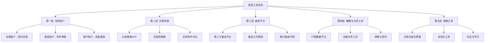
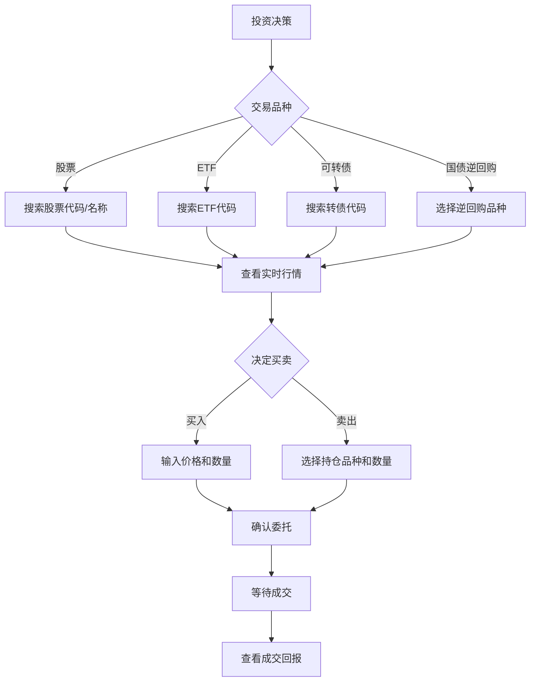
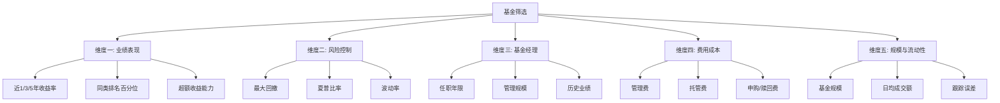
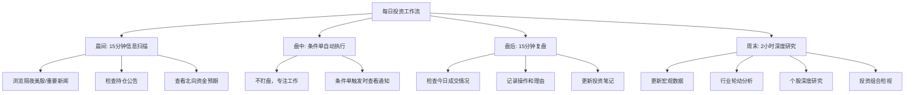
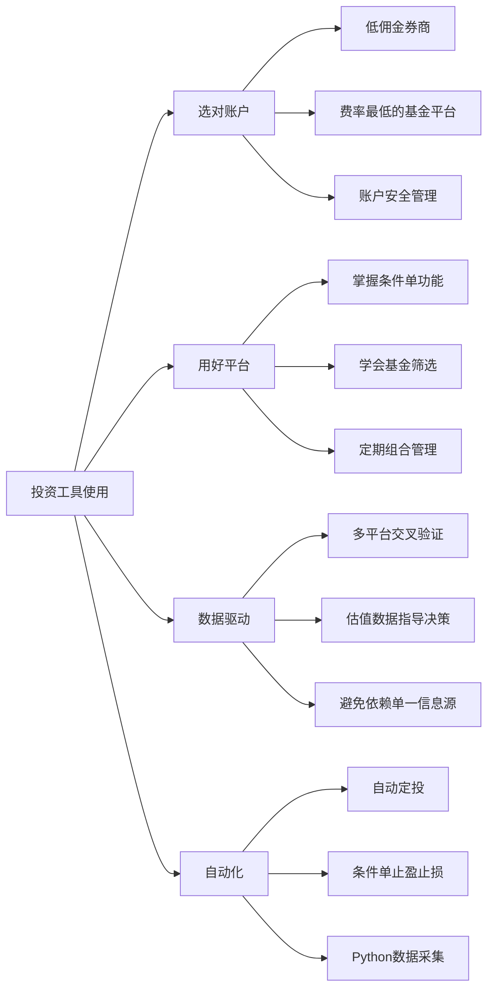

## 技巧六：投资工具使用

> "工欲善其事，必先利其器。" —— 《论语·卫灵公》

投资工具是你与市场之间的桥梁。你的每一笔买入、卖出、定投、查询、分析，都要通过工具完成。选对工具、用好工具，不仅能节省大量时间，还能避免操作失误带来的真金白银损失。本节将从账户开立、券商APP、基金平台、数据工具、量化辅助五个层面，构建一套完整的投资工具使用框架。

---

### 投资工具全景图



---

### 第一层：投资账户的开立与选择

在做任何投资之前，你首先需要一个"入口"——投资账户。不同类型的投资需要不同的账户，搞清楚账户体系是第一步。

#### 1.1 证券账户（股票账户）

证券账户是你进入资本市场的"通行证"。它不仅能买卖股票，还能交易场内基金（ETF、LOF）、债券、国债逆回购、可转债等多种品种。

**开户条件：**

| 条件 | 要求 |
|------|------|
| 年龄 | 年满18周岁（16-18周岁需提供收入证明） |
| 证件 | 有效身份证 + 银行借记卡 |
| 数量限制 | 同一市场（沪/深）最多开3个账户 |
| 开户方式 | 线上APP开户（推荐）或线下营业部 |

**券商选择的核心指标：**

选择券商不是随便挑一个就行，佣金费率、交易体验、增值服务三方面都会直接影响你的投资收益和操作效率。

| 指标 | 重要性 | 说明 |
|------|--------|------|
| 佣金费率 | ★★★★★ | 股票交易佣金直接影响每次交易成本。目前行业最低可到万1（0.01%），大多数券商默认万2.5-万3。差异看似微小，但频繁交易下累积成本巨大 |
| APP体验 | ★★★★☆ | 界面设计、下单速度、行情刷新频率、智能选股/选基功能 |
| 研报与资讯 | ★★★★☆ | 头部券商有强大的研究团队，研报质量远超第三方平台 |
| 产品线 | ★★★☆☆ | 是否支持港股通、期权、融资融券、北交所等 |
| 客户服务 | ★★★☆☆ | 是否有专属客户经理、投顾服务、问题响应速度 |
| 网点覆盖 | ★★☆☆☆ | 大多数业务可线上办理，但部分业务（如期权开户）需临柜 |

**主流券商对比：**

| 券商 | 默认佣金 | 最低佣金 | APP评分 | 研报实力 | 适合人群 |
|------|---------|---------|---------|---------|---------|
| 中信证券 | 万3 | 可谈至万1.2 | 4.0 | ★★★★★ | 重视研究和投顾服务的投资者 |
| 华泰证券 | 万3 | 可谈至万1 | 4.5 | ★★★★☆ | 注重交易体验的活跃交易者 |
| 招商证券 | 万3 | 可谈至万1.5 | 4.2 | ★★★★☆ | 综合服务需求的投资者 |
| 东方财富证券 | 万2.5 | 万1 | 4.3 | ★★★☆☆ | 与东方财富数据平台深度绑定的投资者 |
| 国泰君安 | 万3 | 可谈至万1.2 | 4.1 | ★★★★★ | 机构级服务需求 |
| 中信建投 | 万3 | 可谈至万1 | 4.0 | ★★★★☆ | 性价比优先 |

**降低佣金的实操方法：**

```text
方法一：开户前联系客户经理
  - 通过券商官网/APP预约开户，系统会分配客户经理
  - 直接要求"万1佣金"，大多数券商为了获客都会同意
  - 如果不同意，换一家券商即可——竞争激烈，选择很多

方法二：通过专属链接开户
  - 很多财经博主、投资社区有券商合作的专属开户链接
  - 通过这些链接开户通常直接享受最低佣金
  - 注意甄别，选择正规渠道

方法三：已有账户申请调佣
  - 拨打券商客服电话，要求调低佣金
  - 话术："我是XX年的老客户，目前佣金是万X，想调到万1"
  - 如果客服拒绝，可以说"如果不调我就转户到XX券商"
  - 大多数情况下会同意——留住一个老客户的成本远低于获取新客户
```

**佣金对收益的影响测算：**

```text
假设条件：
  每月交易10次（买入5次+卖出5次），每次金额1万元
  年交易总额 = 10次 × 12月 × 1万元 = 120万元

佣金万3 vs 万1 的年成本对比：
  万3佣金：120万 × 0.03% × 2（买卖各收一次）= 720元/年
  万1佣金：120万 × 0.01% × 2 = 240元/年
  差额：480元/年

如果本金10万，年化收益8%：
  年收益 = 8000元
  万3佣金占比 = 720/8000 = 9%
  万1佣金占比 = 240/8000 = 3%

结论：佣金差异会吃掉你9% vs 3%的收益。
交易越频繁、本金越小，佣金的影响越大。
```

#### 1.2 基金账户

基金投资有两种渠道：场外申赎和场内交易，对应的账户和操作完全不同。

| 维度 | 场外基金 | 场内基金（ETF/LOF） |
|------|---------|-------------------|
| 账户要求 | 基金账户（支付宝/天天基金/蛋卷基金等即可） | 证券账户 |
| 交易方式 | T日申购，T+1日确认 | 实时买卖，价格随市场波动 |
| 交易价格 | 每日收盘净值（未知价原则） | 实时价格（可能溢价或折价） |
| 费率 | 申购费0-1.5%（通常打1折，0.1%-0.15%） | 佣金（与股票交易相同，万1-万3） |
| 赎回到账 | T+3至T+7个工作日 | 卖出后T+1资金可用，T+2可取 |
| 适合场景 | 定投、长期持有、大额配置 | 波段操作、套利、快速进出 |
| 分红方式 | 现金分红或红利再投 | 现金分红 |

**场外基金平台选择：**

| 平台 | 申购费率折扣 | 基金数量 | 特色功能 | 推荐指数 |
|------|-------------|---------|---------|---------|
| 支付宝（蚂蚁财富） | 1折 | 5000+ | 用户基数最大，定投功能成熟，有"金选"基金推荐 | ★★★★☆ |
| 天天基金 | 1折 | 7000+ | 东方财富旗下，数据最全，筛选功能强大 | ★★★★★ |
| 蛋卷基金 | 1折 | 4000+ | 雪球旗下，组合投资功能突出，指数估值数据好 | ★★★★☆ |
| 且慢 | 1折 | 3000+ | 策略跟投功能独特，有专业的"温度计"估值工具 | ★★★★☆ |
| 微信理财通 | 1折 | 3000+ | 微信生态内便捷，适合轻度投资者 | ★★★☆☆ |
| 银行APP | 4-8折 | 2000+ | 费率高，产品少，唯一优势是有银行理财经理服务 | ★★☆☆☆ |

**为什么费率折扣重要：**

```text
申购10万元基金：
  银行渠道（无折扣，费率1.5%）：申购费 = 1,500元
  第三方平台（1折，费率0.15%）：申购费 = 150元
  差额：1,350元

这1,350元直接从你的投资本金中扣除。
对于年化收益8%的投资，这相当于你白白损失了将近2个月的收益。
结论：永远选择费率最低的渠道，同一基金在不同平台的收益表现完全相同。
```

#### 1.3 账户安全管理

投资账户涉及真金白银，安全意识必须到位。

**必须做到的安全措施：**

| 措施 | 操作 | 为什么重要 |
|------|------|-----------|
| 设置强密码 | 16位以上，含大小写字母+数字+特殊符号 | 防止暴力破解 |
| 开启双因素认证 | 绑定手机+谷歌验证器/券商安全令牌 | 即使密码泄露也无法登录 |
| 绑定专用银行卡 | 使用专门的投资银行卡，与日常消费卡分离 | 降低资金被盗风险 |
| 定期修改密码 | 每3-6个月更换一次 | 降低长期泄露风险 |
| 不在公共WiFi下交易 | 使用4G/5G或可信网络 | 防止中间人攻击 |
| 警惕钓鱼短信/电话 | 券商不会要求你提供密码或验证码 | 防止社会工程攻击 |

---

### 第二层：券商APP深度使用指南

券商APP是你日常投资操作最频繁的工具。掌握它的核心功能，能大幅提升交易效率和分析能力。

#### 2.1 核心交易功能

**基础交易操作流程：**



**下单方式对比：**

| 下单方式 | 操作 | 适用场景 | 优缺点 |
|---------|------|---------|--------|
| 限价委托 | 设定一个具体价格，达到该价格才成交 | 大多数交易场景 | 价格可控，但可能无法成交 |
| 市价委托 | 以当前市场最优价格立即成交 | 急需买入/卖出时 | 保证成交，但价格不确定 |
| 对手价 | 以对方最优价格成交 | 快速成交 | 介于限价和市价之间 |
| 本方价 | 以己方挂单价格成交 | 不急时 | 可能等待较久 |
| 条件单 | 达到预设条件自动下单 | 止盈止损、突破买入 | 自动执行，省心但需设置准确 |

**交易数量规则：**

```text
股票：最少100股（1手），之后以100股为单位递增
  例外：科创板（688开头）最少200股，以1股递增
  例外：北交所最少100股，以1股递增

ETF：最少100份，之后以100份为单位递增

可转债：最少10张（每张面值100元），之后以10张递增

国债逆回购：
  沪市：最少1000元（10手），以1000元递增
  深市：最少1000元（10张），以1000元递增
```

#### 2.2 行情分析功能

现代券商APP远不止是一个交易工具，它集成了大量行情分析功能。

**核心行情指标解读：**

| 指标 | 含义 | 看盘技巧 |
|------|------|---------|
| K线图 | 显示开盘价、收盘价、最高价、最低价 | 红涨绿跌（A股），注意不同市场颜色约定不同 |
| 成交量 | 当日成交的股票数量 | 放量突破是健康信号，缩量下跌说明抛压减弱 |
| 五档盘口 | 买卖各5个价位的挂单量 | 买盘厚、卖盘薄说明多方力量强 |
| 内外盘 | 主动买入（外盘）vs 主动卖出（内盘） | 外盘>内盘说明买方力量占优 |
| 换手率 | 当日成交量/流通股本 | 换手率>15%提示筹码快速流转，注意风险 |
| 量比 | 当日成交量/过去5日平均成交量 | 量比>3说明明显放量，需关注原因 |

**常用技术指标入门：**

| 指标 | 类型 | 核心用法 | 适合场景 |
|------|------|---------|---------|
| MA（均线） | 趋势 | 价格在均线上方为多头趋势，下方为空头趋势 | 判断大方向 |
| MACD | 趋势 | 金叉（DIF上穿DEA）看多，死叉看空 | 中线趋势判断 |
| RSI | 超买超卖 | RSI>70超买区，RSI<30超卖区 | 短期反转信号 |
| KDJ | 超买超卖 | K线和D线的交叉配合 | 短线操作 |
| 布林带 | 波动 | 价格触及上轨可能回调，触及下轨可能反弹 | 波段操作 |
| 成交量均线 | 量能 | 量均线金叉配合价格突破，信号更可靠 | 验证价格信号 |

> **重要提醒**：技术指标是辅助工具，不是预测工具。没有任何单一指标能准确预测市场走势。技术指标的最大价值在于帮你建立交易纪律和执行计划，而非替代思考。

#### 2.3 条件单与智能交易

条件单是现代券商APP最实用的功能之一，能帮你实现"无人值守"的交易计划。

**条件单的主要类型：**

| 类型 | 设置方法 | 实际应用场景 |
|------|---------|-------------|
| 止损单 | 设置一个低于当前价格的触发价 | "如果跌到XX元就卖出，控制亏损" |
| 止盈单 | 设置一个高于当前价格的触发价 | "如果涨到XX元就卖出，锁定利润" |
| 定价买入 | 设置一个低于当前价格的买入价 | "如果跌到XX元就买入，抄底布局" |
| 定时定投 | 设置固定时间自动买入 | 每月发工资后自动买入ETF |
| 回落卖出 | 从最高点回落一定比例后卖出 | "如果从最高点回落10%就卖出" |
| 突破买入 | 突破某个价格后自动买入 | "如果突破XX元就追入" |

**条件单设置示例（以华泰证券涨乐财富通为例）：**

```text
场景：你持有1000股某股票，成本价50元，当前价格55元。

设置止盈单：
  1. APP → 交易 → 条件单 → 新建条件单
  2. 选择品种：输入股票代码
  3. 触发条件：价格 >= 65元（收益率30%）
  4. 委托操作：卖出1000股
  5. 委托价格：买一价（保证成交）
  6. 有效期：30天（到期可续期）

设置止损单：
  1. 触发条件：价格 <= 45元（亏损10%）
  2. 委托操作：卖出1000股
  3. 委托价格：卖一价（保证成交）

两条条件单同时挂上，无论涨跌都有应对方案。
你不需要每天盯盘，系统自动帮你执行。
```

#### 2.4 交易记录与对账

养成定期查看交易记录的习惯，是复盘和优化的基础。

**月度对账流程：**

```text
每月最后一个交易日：
  1. 导出当月交易流水（APP → 交易 → 交割单 → 导出）
  2. 统计本月交易次数、总成交额
  3. 计算本月实际佣金支出
  4. 对比本月收益与基准指数（如沪深300）的涨跌幅
  5. 记录本月做的最好的一笔和最差的一笔交易
  6. 分析最差交易的错误原因
  7. 更新投资笔记

每季度额外检查：
  1. 计算季度收益率
  2. 与年初设定的目标对比
  3. 评估资产配置是否需要调整
  4. 检查是否有遗忘的条件单或委托
```

---

### 第三层：基金平台深度使用指南

对于大多数普通投资者，基金（尤其是指数基金）是最合适的投资工具。掌握基金平台的核心功能，是高效投资的关键。

#### 3.1 基金筛选的核心指标

面对市场上数千只基金，如何快速筛选出优质标的？以下是必须关注的核心指标。

**基金筛选五维模型：**



**各指标的判断标准：**

| 指标 | 优秀标准 | 警戒线 | 说明 |
|------|---------|--------|------|
| 近3年收益率 | 同类前25% | 同类后50% | 不要只看1年业绩，短期冠军往往不可持续 |
| 近5年收益率 | 年化>10% | 年化<5% | 长期业绩更能说明基金经理的真实能力 |
| 最大回撤 | <20% | >40% | 回撤越大，你需要的心理承受能力越强 |
| 夏普比率 | >1.0 | <0.5 | 每承担1单位风险获得的超额回报 |
| 基金经理任职年限 | >3年 | <1年 | 经历过完整牛熊周期的经理更可靠 |
| 基金规模 | 2-100亿 | <5000万或>500亿 | 太小有清盘风险，太大影响操作灵活性 |
| 管理费 | 指数基金<0.5% | 主动基金>1.5% | 费率差异长期累积影响巨大 |
| 跟踪误差（指数基金） | <2% | >5% | 跟踪误差大说明基金管理有问题 |

**指数基金 vs 主动基金的选择逻辑：**

| 维度 | 指数基金 | 主动基金 |
|------|---------|---------|
| 管理费 | 0.15%-0.5% | 1%-1.5% |
| 选股方式 | 被动跟踪指数 | 基金经理主动选股 |
| 业绩确定性 | 跟踪指数，确定性高 | 依赖基金经理能力，不确定性大 |
| 适合人群 | 大多数普通投资者 | 有能力筛选优秀基金经理的投资者 |
| 巴菲特推荐度 | ★★★★★ | ★★★☆☆ |

> **数据支撑**：根据标普道琼斯SPIVA报告，截至2023年底，在过去15年的时间里，中国A股市场中超过85%的主动股票型基金跑输了沪深300指数。这意味着，对于大多数投资者，直接买一只沪深300指数基金，收益大概率优于精心挑选主动基金。

#### 3.2 基金定投操作详解

定投是基金投资最核心的策略。在平台上正确设置定投，是"懒人投资"的第一步。

**支付宝定投设置全流程：**

```text
步骤1：选择基金
  打开支付宝 → 理财 → 基金 → 搜索基金代码或名称
  例如搜索"110020"（易方达沪深300ETF联接A）

步骤2：查看基金详情
  - 查看近1年/3年/5年收益率
  - 查看基金经理信息
  - 查看持仓构成（前十大重仓股）
  - 查看费率结构

步骤3：设置定投
  点击"定投" → 进入定投设置页面
  - 定投金额：根据前文计算的金额（如每月3000元）
  - 定投周期：月定投（推荐）、周定投、双周定投
  - 定投日期：选择发工资后2-3天（如每月5号）
  - 扣款方式：选择工资卡

步骤4：开启智能定投（可选）
  部分平台支持"慧定投"等智能定投功能：
  - 高位少投、低位多投
  - 基于均线偏离度或估值分位数自动调整金额
  - 建议新手先用普通定投，熟悉后再尝试智能定投

步骤5：确认并开始
  核对信息无误后确认，系统会在每个定投日自动扣款
```

**天天基金定投设置流程：**

```text
天天基金的优势在于筛选功能更强大，适合有明确筛选需求的投资者。

步骤1：使用基金筛选器
  天天基金首页 → 基金筛选 → 设置筛选条件
  - 基金类型：股票型/混合型/指数型
  - 成立年限：>3年
  - 基金规模：2-100亿
  - 近3年收益：同类前30%
  - 最大回撤：<25%

步骤2：从筛选结果中选择
  按夏普比率排序，选择风险调整后收益最优的基金

步骤3：设置定投
  基金详情页 → 定投 → 设置金额和周期
  - 支持"智能定投"功能
  - 支持设置止盈提醒
```

#### 3.3 基金组合管理

持有3只以上基金时，需要系统化管理，避免"买了就忘"或"频繁操作"两个极端。

**基金组合管理清单（每月执行）：**

```text
□ 更新持仓明细
  - 每只基金的当前市值、持仓占比、浮动盈亏
  - 使用Excel或记账APP记录

□ 检查资产配置偏离度
  - 当前股债比例是否与目标一致
  - 偏离超过5%时考虑再平衡

□ 检查基金本身
  - 基金经理是否变更
  - 基金规模是否异常变化（急剧缩水或膨胀）
  - 跟踪误差是否异常（指数基金）
  - 是否有重大持仓变动

□ 定投执行检查
  - 本月定投是否正常扣款
  - 是否有扣款失败的情况
  - 定投金额是否需要调整

□ 记录本月投资笔记
  - 做了什么操作、为什么
  - 市场发生了什么
  - 自己的情绪状态
```

---

### 第四层：数据与分析工具

数据是投资决策的基础。掌握核心数据工具，能让你从"凭感觉投资"升级为"用数据说话"。

#### 4.1 行情数据平台

| 平台 | 费用 | 核心优势 | 适合人群 | 推荐指数 |
|------|------|---------|---------|---------|
| 东方财富网 | 免费 | 数据最全面，覆盖A股/港股/美股/基金/债券/期货 | 入门到中级投资者 | ★★★★★ |
| 同花顺iFinD | 部分免费 | AI选股功能强，技术分析工具丰富 | 技术分析爱好者 | ★★★★☆ |
| Wind（万得） | 付费（年费数万） | 金融行业标配，数据最全最准 | 专业投资者、分析师 | ★★★★★ |
| 理杏仁 | 部分免费 | 估值数据突出，界面极简 | 价值投资者 | ★★★★☆ |
| 乌龟量化 | 免费 | 指数估值、基金筛选、定投计算器 | 基金投资者 | ★★★★☆ |
| 集思录 | 免费 | 可转债、分级基金、套利策略 | 固收+投资者 | ★★★★☆ |
| Tushare | 免费（有积分限制） | Python接口，适合自动化数据采集 | 量化投资者 | ★★★★☆ |
| AKShare | 免费开源 | Python接口，数据源丰富 | 量化投资者 | ★★★★☆ |

#### 4.2 估值分析工具

估值是判断"买贵了还是买便宜了"的核心方法。以下工具能帮你快速获取估值数据。

**常用估值指标：**

| 指标 | 计算方式 | 使用方法 |
|------|---------|---------|
| PE（市盈率） | 股价 / 每股收益 | PE分位数<30%为低估，>70%为高估 |
| PB（市净率） | 股价 / 每股净资产 | 适合周期性行业（银行、地产） |
| 股息率 | 每股分红 / 股价 | 股息率>4%有配置价值 |
| ROE（净资产收益率） | 净利润 / 净资产 | ROE>15%持续3年以上说明公司质量好 |

**获取指数估值数据的免费渠道：**

```text
渠道一：中证指数官网（index.cs.com.cn）
  - 提供所有中证系列指数的PE、PB数据
  - 可查历史分位数
  - 官方数据，最权威

渠道二：乌龟量化（guorn.com）
  - 指数估值一目了然，用颜色标记低估/高估
  - 提供PE/PB历史分位数图表
  - 完全免费，无需注册

渠道三：且慢APP的"指数估值"功能
  - 用"温度"直观展示市场冷热
  - 温度<20为低温区（适合买入），>80为高温区（适合卖出）

渠道四：蛋卷基金的"指数估值"
  - 与基金购买直接打通
  - 可以一键定投低估指数

渠道五：理杏仁（lixinger.com）
  - 估值数据最详细
  - 支持个股和指数的多维度估值
  - 部分功能需要付费
```

#### 4.3 基金筛选与对比工具

**天天基金筛选器使用技巧：**

```text
进阶筛选条件组合：

筛选宽基指数基金：
  基金类型 → 指数型
  跟踪指数 → 沪深300 / 中证500 / 创业板指
  成立年限 → >3年
  基金规模 → 2亿-500亿
  跟踪误差 → <3%
  管理费 → <0.5%
  结果按规模排序，选规模最大的3-5只

筛选优秀主动基金：
  基金类型 → 混合型/股票型
  成立年限 → >5年
  基金规模 → 10亿-200亿
  近5年收益 → 同类前20%
  最大回撤 → <30%
  基金经理任职 → >3年
  结果按夏普比率排序
```

**晨星网（Morningstar）使用指南：**

晨星是全球最权威的基金评级机构，其评级体系被广泛使用。

```text
晨星评级的核心逻辑：
  - 将同类基金按风险调整后收益排名
  - 前10%获得★★★★★
  - 前32.5%获得★★★★
  - 中间35%获得★★★
  - 后32.5%获得★★
  - 最后10%获得★

使用建议：
  1. 优先选择★★★★及以上评级的基金
  2. 晨星评级是基于过去3年/5年/10年的历史数据
  3. 高评级不代表未来一定好，但说明历史表现优秀且风险可控
  4. 晨星官网：cn.morningstar.com
```

---

### 第五层：辅助工具与自动化

投资不只是买卖，还需要记录、分析、复盘。以下工具能帮你构建完整的投资工作流。

#### 5.1 投资记账与组合追踪

| 工具 | 类型 | 核心功能 | 适合人群 |
|------|------|---------|---------|
| 且慢APP | APP | 组合持仓追踪、收益分析、定投管理 | 基金投资者 |
| 蛋卷基金APP | APP | 组合持仓、收益归因、再平衡提醒 | 基金投资者 |
| 雪球APP | APP | 股票+基金组合追踪、社区讨论 | 股票+基金投资者 |
| Excel/飞书表格 | 通用 | 自定义组合追踪表，灵活性最高 | 有定制需求的投资者 |
| Portfolio Visualizer | 网页 | 专业级组合分析、回测、有效前沿计算 | 进阶投资者 |
| 有知有行APP | APP | 投资知识库+组合追踪一体化 | 学习型投资者 |

**自建Excel组合追踪表模板：**

```text
工作表一：持仓明细
  列：基金代码 | 基金名称 | 买入日期 | 买入金额 | 持有份额 | 当前净值 | 当前市值 | 浮动盈亏 | 收益率

工作表二：定投记录
  列：日期 | 基金代码 | 买入金额 | 买入份额 | 买入净值 | 累计投入 | 累计份额

工作表三：月度汇总
  列：月份 | 总投入 | 总市值 | 总收益 | 收益率 | 沪深300涨跌幅 | 超额收益

工作表四：资产配置
  列：资产类别 | 目标比例 | 实际比例 | 偏离度 | 是否需要再平衡

公式示例：
  浮动盈亏 = 当前市值 - 买入金额
  收益率 = 浮动盈亏 / 买入金额 × 100%
  超额收益 = 组合收益率 - 基准指数收益率
```

#### 5.2 Python自动化工具

如果你有编程基础，可以用Python构建自动化投资辅助工具。

**示例一：自动获取持仓基金净值并计算收益**

```python
"""
基金净值自动追踪脚本
依赖：pip install akshare pandas openpyxl
"""
import akshare as ak
import pandas as pd
from datetime import datetime

# 你的持仓配置：基金代码 -> (持有份额, 买入成本)
portfolio = {
    "110020": (5000.0, 6000.0),   # 易方达沪深300ETF联接A
    "000961": (3000.0, 4500.0),   # 天弘沪深300ETF联接A
    "161725": (2000.0, 3200.0),   # 招商中证白酒指数A
}

def get_fund_nav(fund_code):
    """获取基金最新净值"""
    try:
        df = ak.fund_open_fund_info_em(symbol=fund_code, indicator="单位净值走势")
        latest = df.iloc[-1]
        return float(latest["单位净值"])
    except Exception as e:
        print(f"获取{fund_code}净值失败: {e}")
        return None

def calculate_portfolio():
    """计算组合收益"""
    total_cost = 0
    total_value = 0
    results = []

    for code, (shares, cost) in portfolio.items():
        nav = get_fund_nav(code)
        if nav:
            value = shares * nav
            profit = value - cost
            roi = profit / cost * 100
            total_cost += cost
            total_value += value
            results.append({
                "基金代码": code,
                "持有份额": shares,
                "最新净值": nav,
                "当前市值": round(value, 2),
                "买入成本": cost,
                "浮动盈亏": round(profit, 2),
                "收益率": f"{roi:.2f}%"
            })

    df = pd.DataFrame(results)
    print(f"\n=== 组合报告 {datetime.now().strftime('%Y-%m-%d')} ===")
    print(df.to_string(index=False))
    print(f"\n总投入: {total_cost:.2f}元")
    print(f"总市值: {total_value:.2f}元")
    print(f"总盈亏: {total_value - total_cost:.2f}元")
    print(f"总收益率: {(total_value - total_cost) / total_cost * 100:.2f}%")

if __name__ == "__main__":
    calculate_portfolio()
```

**示例二：指数估值监控与提醒**

```python
"""
指数估值监控脚本
当指数进入低估区域时输出提醒，可配合定时任务使用
依赖：pip install akshare pandas
"""
import akshare as ak
import pandas as pd

# 监控的指数列表
indices = {
    "000300": "沪深300",
    "000905": "中证500",
    "399006": "创业板指",
    "000015": "红利指数",
}

def get_index_valuation(index_code, index_name):
    """获取指数估值"""
    try:
        df = ak.stock_zh_index_value_em(symbol=index_code)
        latest = df.iloc[-1]
        pe = float(latest["市盈率"])
        pb = float(latest["市净率"])

        # 计算PE历史分位数（简化版本）
        pe_history = df["市盈率"].astype(float)
        pe_percentile = (pe_history < pe).sum() / len(pe_history) * 100

        status = "极低" if pe_percentile < 10 else \
                 "低估" if pe_percentile < 30 else \
                 "合理" if pe_percentile < 70 else \
                 "高估" if pe_percentile < 90 else "极高"

        return {
            "指数": index_name,
            "PE": round(pe, 2),
            "PB": round(pb, 2),
            "PE分位数": f"{pe_percentile:.1f}%",
            "估值状态": status
        }
    except Exception as e:
        return {"指数": index_name, "错误": str(e)}

if __name__ == "__main__":
    print(f"=== 指数估值监控 ===\n")
    for code, name in indices.items():
        result = get_index_valuation(code, name)
        for k, v in result.items():
            print(f"  {k}: {v}")
        print()
```

#### 5.3 投资学习与社区工具

| 工具 | 类型 | 核心价值 | 使用建议 |
|------|------|---------|---------|
| 雪球 | 社区 | 最大的中文投资社区，有大量深度讨论 | 可以看观点启发思考，但不可作为决策依据 |
| 有知有行 | 学习 | 系统化的投资教育内容 | 新手入门最好的学习平台 |
| 知乎投资话题 | 社区 | 长文分析，深度较好 | 关注高赞的系统性回答 |
| B站财经UP主 | 视频 | 直观易懂，适合入门 | 推荐关注数据驱动的UP主，远离"荐股"类 |
| 经典书单 | 书籍 | 系统化知识体系 | 必读：《指数基金投资指南》《漫步华尔街》《聪明的投资者》 |

---

### 常见工具使用误区

#### 误区一：过度依赖APP推荐功能

很多APP有"热销基金""金选基金"等推荐功能。这些推荐往往基于近期业绩排名，而近期业绩好的基金，未来大概率回归均值。

```text
错误做法：
  看到APP首页推荐"近1年收益率排名第一"的基金，直接买入。

正确做法：
  1. 查看该基金的3年/5年长期业绩
  2. 了解其投资策略和风格
  3. 确认基金经理任职时间
  4. 评估当前市场环境是否匹配其风格
  5. 只有通过以上筛选后才考虑买入
```

#### 误区二：频繁切换投资平台

有些投资者看到某个平台有活动（如申购费减免），就把资金在不同平台间频繁转移。这不仅浪费时间，还可能因为赎回到账的时间差而错失投资机会。

```text
正确原则：
  - 选定1-2个主力平台，长期使用
  - 同一基金在不同平台的净值完全相同，差异只在费率
  - 费率差异通常只有0.1%左右，不值得为此频繁迁移
  - 把时间花在研究投资标的上，比研究平台优惠更有价值
```

#### 误区三：忽视交易时间规则

A股和基金的交易有严格的时间规则，不了解这些规则会导致操作失误。

```text
关键时间规则：

股票/ETF交易时间：
  集合竞价：9:15-9:25（9:20前可撤单，9:20后不可撤单）
  连续竞价：9:30-11:30, 13:00-14:57
  收盘集合竞价：14:57-15:00

基金申购/赎回时间：
  T日15:00前提交 → 按T日净值确认
  T日15:00后提交 → 按T+1日净值确认
  周末和节假日不算交易日

常见错误：
  - 周五15:01提交基金申购 → 要等到下周一才能确认
  - 节假日前一天卖出股票 → 资金要节后才能到账
  - 急用钱时才想起卖出基金 → 赎回需要T+3到T+7个工作日
```

#### 误区四：不看基金持仓就买入

很多投资者只看基金名称和历史业绩就买入，完全不了解基金的实际持仓。

```text
案例：
  某投资者看到"XX科技创新混合基金"近1年收益很好，直接买入。
  实际上该基金重仓的是白酒和消费股，与"科技创新"名称严重不符。

正确做法：
  买入前必看：
  1. 前十大重仓股及其占比
  2. 行业分布（是否与名称一致）
  3. 持仓集中度（前十大重仓占比>60%说明集中度高）
  4. 换手率（过高说明基金经理频繁交易）
```

#### 误区五：只在一个平台看数据

不同平台的数据展示方式和更新时间可能不同，交叉验证能避免被单一数据源误导。

```text
最佳实践：
  - 核心交易：选定1个主力券商APP
  - 基金申赎：选定1个主力基金平台
  - 数据查询：至少使用2个数据平台交叉验证
  - 推荐组合：
    交易 → 华泰/东方财富证券
    基金 → 天天基金/支付宝
    数据 → 东方财富网 + 乌龟量化/理杏仁
```

---

### 不同阶段投资者的工具配置方案

#### 入门方案（0-6个月经验）

```text
适用人群：刚开始投资，资金量<5万元

核心工具：
  交易账户：支付宝（基金）+ 任意低佣金券商（股票）
  数据平台：东方财富APP（免费，数据全面）
  估值工具：乌龟量化（免费，一目了然）
  记账方式：Excel表格或支付宝自带的持仓分析

操作要点：
  - 只投宽基指数基金（沪深300/中证500）
  - 设置自动定投，不看盘
  - 每月花15分钟检查一次
  - 先学习，不急于交易个股
```

#### 进阶方案（6个月-2年经验）

```text
适用人群：有一定投资经验，资金量5-30万元

核心工具：
  交易账户：低佣金券商APP（华泰/东方财富证券）
  基金平台：天天基金（筛选功能强）
  数据平台：东方财富网 + 理杏仁
  估值工具：且慢APP + 乌龟量化
  记账方式：Excel详细记录 + 雪球组合追踪

操作要点：
  - 建立基金+ETF组合
  - 开始学习个股分析
  - 使用条件单管理止盈止损
  - 每周花2小时做深度研究
  - 开始阅读券商研报
```

#### 专业方案（2年以上经验）

```text
适用人群：有丰富经验，资金量>30万元

核心工具：
  交易账户：头部券商（中信/国泰君安，服务好）+ 互联网券商（费率低）
  基金平台：天天基金 + 基金公司直销（部分基金直销费率更低）
  数据平台：Wind/Choice（付费，数据最全）+ 东方财富网
  量化工具：Python + Tushare/AKShare
  分析工具：理杏仁 + 集思录 + 晨星
  记账方式：自建数据库 + Grafana看板

操作要点：
  - 自动化数据采集和分析
  - 构建多因子选股模型
  - 使用条件单和算法交易
  - 系统化的投资复盘流程
  - 持续优化投资策略
```

---

### 工具使用效率提升技巧

#### 快捷操作设置

```text
大多数券商APP支持自定义快捷操作：

1. 自选股分组
   - 按策略分组：定投组、观察组、已卖出组
   - 按行业分组：消费、科技、金融、医药
   - 设置价格提醒：在关键价格点自动推送通知

2. 自定义看盘界面
   - 将最关注的指标放在最显眼的位置
   - 设置多窗口同时显示K线、分时、盘口
   - 保存常用的分析模板

3. 快捷交易
   - 设置常用交易量（如"买入100股""买入1000股"）
   - 使用条件单替代手动盯盘
   - 设置一键撤单功能
```

#### 信息整合工作流



---

### 本节核心要点回顾



> **最后的建议**：工具是为人服务的，不要让工具成为负担。初学者不需要掌握所有工具，从最简单的组合开始——一个低佣金券商APP + 一个基金平台 + 一个免费数据网站——然后随着经验增长逐步扩展工具链。最重要的是开始行动，而不是在选择工具上纠结太久。
