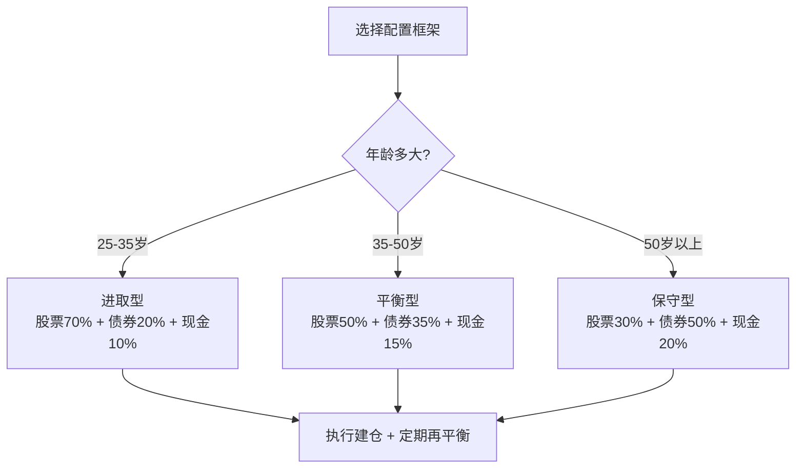
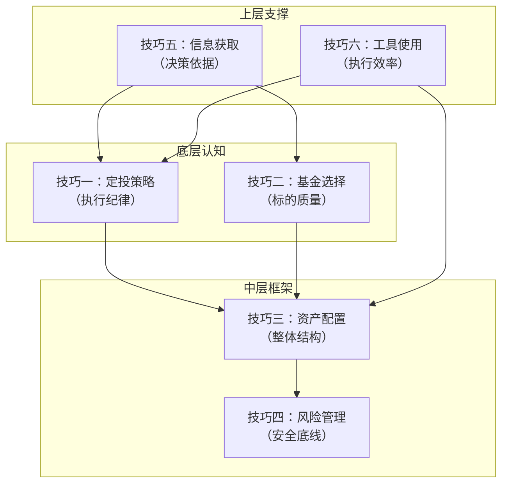

## 核心技巧 · 本节小结

> 本节小结不是把六个技巧各摘一句话凑成清单，而是帮你把零散的方法论**编织成一张可执行的投资操作系统**。如果你已经认真读完前面六个技巧，这一页帮你建立全局视角；如果你是跳着读的，这就是核心技巧的浓缩精华。

---

### 一、六大技巧全景回顾

六个技巧覆盖了个人投资者从"决定开始投资"到"持续盈利"的完整闭环。它们不是独立的技能点，而是一条环环相扣的链条：

下面逐一回顾每个技巧的核心要点、关键公式和最容易踩的坑。

---

### 二、技巧一：定投策略 —— 用纪律替代择时

#### 核心要点

定投的本质是**时间维度的分散化**。通过固定时间、固定金额投入，自动实现"低买多份额、高买少份额"，长期持仓成本低于市场均价。这就是著名的**微笑曲线效应**。

#### 关键数据

| 定投方式 | 适用场景 | 纪律要求 | 择时需求 |
|----------|----------|----------|----------|
| 普通定投 | 新手入门、工资结余 | 低 | 无 |
| 智能定投 | 有一定经验、愿意投入精力 | 中 | 部分（基于估值） |
| 价值平均定投 | 进阶投资者、资金充裕 | 高 | 较高 |

#### 最关键的一句话

**定投的收益不是来自"选对时机"，而是来自"持续不断"。** 中断定投是新手犯的最致命错误——恰恰在市场下跌、份额最便宜的时候停手，等于主动放弃了微笑曲线的左半边。

#### 常见误区

- **误区一：定投=无脑投。** 定投需要选对标的、设定止盈，不是闭着眼睛买入就完事。
- **误区二：亏损就停止。** 下跌恰恰是积累便宜筹码的黄金期，停投等于高位买入、低位卖出。
- **误区三：定投时间越长越好。** 不设止盈的定投可能坐过山车，必须配合止盈策略锁定收益。

---

### 三、技巧二：基金选择方法 —— 先选类型，再选指数，最后选基金

#### 核心要点

基金选择遵循**三步筛选法**：

1. **选类型**：指数基金（被动跟踪）vs 主动基金（基金经理选股）。对普通投资者，指数基金是更优选择——费率低、不依赖基金经理能力、长期跑赢大多数主动基金。
2. **选指数**：根据风险偏好选择——保守选沪深300/上证50，平衡选中证500/中证800，激进选创业板指/行业ETF。
3. **选具体基金**：比较跟踪误差、管理费率、基金规模、成立时间。

#### 关键筛选标准

| 筛选维度 | 优质标准 | 警戒线 |
|----------|----------|--------|
| 跟踪误差 | < 0.5%/年 | > 2%/年 |
| 管理费率 | < 0.5%/年 | > 1%/年 |
| 基金规模 | 2亿-500亿 | < 2亿有清盘风险 |
| 成立时间 | > 3年 | < 1年数据不足 |
| 基金经理任职 | > 2年 | 频繁更换 |

#### 最关键的一句话

**选基金的本质是选市场（指数），而不是选基金经理。** 巴菲特2007年的赌局证明：一只标普500指数基金跑赢了一篮子对冲基金。对普通人来说，承认自己没有选股能力，反而是最大的投资智慧。

#### 常见误区

- **误区一：追短期排名。** 近一年排名第一的基金，下一年大概率回归均值。
- **误区二：只看收益率不看费率。** 1%的费率差异，30年复利差距可达收益的20%-30%。
- **误区三：迷信明星基金经理。** 主动基金高度依赖个人，人走茶凉是常态。

---

### 四、技巧三：资产配置实操 —— 投资中最重要的单一决策

#### 核心要点

马科维茨的研究表明：**投资组合90%以上的收益波动来自资产配置决策**，而非个股选择或择时。资产配置就是决定"把多少钱放在哪类资产里"。

#### 三种经典配置框架

| 配置模型 | 核心逻辑 | 适合人群 |
|----------|----------|----------|
| 年龄法则（100-年龄=股票比例） | 年轻承受更多风险 | 新手快速决策 |
| 标准普尔4321法则 | 10%要花/20%保命/30%生钱/40%保本 | 家庭资产全盘规划 |
| 股债平衡模型 | 固定比例（如60/40）定期再平衡 | 纪律型投资者 |

#### 最关键的一句话

**再平衡是资产配置的"自动纠错机制"。** 市场涨了股票比例偏高就卖一些买债券，跌了就反向操作。这本质上是一种"高卖低买"的纪律化执行，每年做1-2次即可。

#### 常见误区

- **误区一：全部买股票或全部存银行。** 极端集中配置等于把命运押在单一资产上。
- **误区二：配好了就不管。** 不再平衡的组合会随市场偏离初始目标。
- **误区三：追求完美的配置比例。** 资产配置没有"最优解"，只有"适合你"的解。

---

### 五、技巧四：风险管理方法 —— 投资的底线思维

#### 核心要点

巴菲特的投资第一原则：**永远不要亏损**。风险管理不是事后补救，而是事前设防。它包含六个层次：

| 层次 | 内容 | 关键指标/动作 |
|------|------|---------------|
| 第一层：认识风险 | 区分系统性风险与非系统性风险 | 理解"风险=不确定性" |
| 第二层：量化风险 | 用数据度量风险大小 | 波动率、最大回撤、夏普比率 |
| 第三层：组合级风控 | 通过分散化降低整体风险 | 不超过30%集中在单一资产 |
| 第四层：单笔交易纪律 | 每笔交易设定止损止盈 | 亏损8%-10%强制止损 |
| 第五层：尾部风险防护 | 防范极端事件（黑天鹅） | 保留5%-10%现金/黄金对冲 |
| 第六层：行为风控 | 管理自己的情绪和偏见 | 交易日志、冷静期制度 |

#### 关键风险指标速查

| 指标 | 含义 | 健康范围 |
|------|------|----------|
| 最大回撤 | 从最高点到最低点的最大跌幅 | < 20%（个人可承受） |
| 夏普比率 | 每承担1单位风险获得的超额收益 | > 1.0 为良好 |
| 波动率（标准差） | 收益的离散程度 | 因资产类型而异 |
| 持仓集中度 | 单一资产占总资产比例 | < 30% |

#### 最关键的一句话

**分散化是投资中唯一的"免费午餐"。** 通过持有不完全相关的资产，你可以在不降低预期收益的情况下降低组合风险。但分散化不是"买很多只基金"——如果它们高度相关（比如全是A股大盘股），分散效果接近于零。

#### 常见误区

- **误区一：把波动当风险。** 短期波动不是风险，永久性亏损才是。
- **误区二：不设止损。** "它总会涨回来的"是投资中最昂贵的信念。
- **误区三：过度分散。** 持有30只相关性很高的基金，不如持有3只低相关资产。

---

### 六、技巧五：投资信息获取 —— 从噪音中提取信号

#### 核心要点

投资是一场信息博弈。信息获取分为五个层次：信息分类→信息来源→信息筛选→信息系统搭建→信息陷阱防范。

#### 关键信息源分级

| 级别 | 信息源 | 特点 | 用途 |
|------|--------|------|------|
| 一级（权威） | 央行报告、统计局数据、财报原文 | 最准确，但滞后 | 宏观判断、基本面分析 |
| 二级（专业） | 券商研报、Wind、Choice数据 | 专业分析，需筛选 | 行业研究、估值参考 |
| 三级（实时） | 财经新闻、交易所公告 | 速度快，噪音多 | 事件驱动、市场情绪 |
| 四级（社交） | 雪球、股吧、微博大V | 观点多元，鱼龙混杂 | 情绪参考（反向指标） |

#### 最关键的一句话

**信息不等于知识，知识不等于行动。** 90%的公开信息已经反映在价格中。你真正需要关注的是：（1）你自己投资逻辑是否被打破；（2）持仓公司的基本面是否发生质变；（3）市场情绪是否走向极端。其余都是噪音。

#### 常见误区

- **误区一：信息越多越好。** 信息过载导致决策瘫痪，少而精的信息源优于多而杂。
- **误区二：把新闻当投资信号。** 等你看到新闻，市场早已反应完毕。
- **误区三：听信"内幕消息"。** 真正的内幕消息轮不到你，轮到你的大概率是陷阱。

---

### 七、技巧六：投资工具使用 —— 工欲善其事，必先利其器

#### 核心要点

投资工具体系包含五层：交易账户→交易终端→基金平台→数据与分析工具→辅助工具。选对工具能节省时间、避免操作失误。

#### 主流工具对比

| 工具类型 | 推荐选择 | 核心优势 | 适用场景 |
|----------|----------|----------|----------|
| 证券账户 | 华泰/中信/东方财富 | 费率低、系统稳定 | 场内ETF交易 |
| 基金平台 | 天天基金/蚂蚁基金/蛋卷 | 费率1折、品种全 | 场外基金定投 |
| 数据工具 | 理杏仁/乌龟量化/韭圈儿 | 免费、数据全 | 估值查询、指数分析 |
| 记账工具 | 且慢/蛋卷组合 | 自动记录、收益分析 | 投资组合追踪 |

#### 最关键的一句话

**工具的选择标准是"够用就好"，而不是"功能最多"。** 新手用一个券商APP+一个基金平台就够了。等你的投资体系成熟了，再按需添加数据工具和量化辅助。过早追求复杂工具，反而会分散你对投资本身的关注。

#### 常见误区

- **误区一：在多个平台分散买入。** 不同平台的基金无法合并查看，增加管理成本。
- **误区二：忽略费率差异。** 场外基金申购费率0.12%-0.15%（1折）和1.5%（原价），差异巨大。
- **误区三：过度依赖工具指标。** 任何工具的评分、推荐都是参考，最终决策权在你自己。

---

### 八、六大技巧的协同关系

六个技巧不是并列关系，而是**层层递进、互相依赖**的系统：

**协同逻辑说明：**

- **定投+基金选择**是底层执行动作：你用什么方式（定投）、投什么标的（基金选择）。
- **资产配置**是中层框架：把底层动作纳入整体规划，决定各资产类别的比例。
- **风险管理**是安全底线：确保中层框架在极端情况下不会崩溃。
- **信息获取**为定投和基金选择提供决策依据：投什么、什么时候调整。
- **工具使用**为所有环节提供执行效率：用什么平台、什么APP完成操作。

---

### 九、一页纸速查表

将六大技巧浓缩为一张可打印的速查卡：

| 技巧 | 一句话核心 | 必做动作 | 绝对禁忌 |
|------|-----------|----------|----------|
| 定投策略 | 用纪律替代择时 | 每月固定日期自动扣款 | 市场下跌时停投 |
| 基金选择 | 先选指数再选基金 | 比较费率、规模、跟踪误差 | 追短期排名第一 |
| 资产配置 | 不要把鸡蛋放一个篮子 | 根据年龄确定股债比例 | 全仓单一资产 |
| 风险管理 | 永远不要亏大钱 | 设定止损线、保留现金仓位 | 不设止损死扛 |
| 信息获取 | 少而精优于多而杂 | 关注财报和宏观数据 | 听信内幕消息 |
| 工具使用 | 够用就好 | 一个券商+一个基金平台 | 多平台分散买入 |

---

### 十、从技巧到习惯：下一步行动清单

读完六个技巧，最关键的是**立刻行动**。以下是按优先级排列的行动清单：

#### 第一周：搭建基础

- [ ] 开通证券账户（选一家低费率头部券商）
- [ ] 开通基金定投平台（天天基金或蚂蚁基金）
- [ ] 确定你的风险画像（保守/平衡/进取）
- [ ] 根据年龄确定初始股债比例

#### 第二周：完成首笔投资

- [ ] 选择一只宽基指数基金（新手推荐沪深300）
- [ ] 设定每月定投金额（收入的10%-30%）
- [ ] 设置自动定投（每月发薪日后2-3天）
- [ ] 记录下你的投资理由（这是你的"投资日志"第一笔）

#### 第一个月：建立系统

- [ ] 完成资产配置方案（股票/债券/现金比例）
- [ ] 设定止损规则（建议单只基金亏损10%触发审视）
- [ ] 搭建信息获取习惯（每周看一次宏观数据，不看每日涨跌）
- [ ] 学习使用一个数据工具（推荐理杏仁或乌龟量化查估值）

#### 持续执行

- [ ] 每月执行定投，不因市场波动而中断
- [ ] 每季度检查一次资产配置，偏离超过5%就再平衡
- [ ] 每年回顾一次投资日志，总结经验教训
- [ ] 持续学习，但不频繁改变策略

---

### 十一、核心公式与参数速记

| 公式/参数 | 内容 | 用途 |
|-----------|------|------|
| 72法则 | 72÷年化收益率=资产翻倍年数 | 快速估算复利效果 |
| 定投成本公式 | 平均成本=总投入÷总份额 | 衡量定投效果 |
| 夏普比率 | (组合收益-无风险收益)÷组合波动率 | 评估风险调整后收益 |
| 最大回撤 | (最高点-最低点)÷最高点 | 衡量最坏情况损失 |
| 股债比例（年龄法则） | 股票%=100-你的年龄 | 快速确定初始配置 |
| 再平衡触发线 | 偏离目标比例±5% | 何时需要再平衡 |
| 止损线 | 单只基金亏损8%-10% | 触发审视或卖出 |

---

### 十二、写在最后

投资理财不是一门需要天赋的学问，而是一门需要**纪律和耐心**的技能。六个核心技巧总结下来，其实就三句话：

1. **选对标的**（技巧二），用**合理的方式**（技巧一）买入，放入**科学的结构**（技巧三）中。
2. **守住底线**（技巧四），用**可靠的信息**（技巧五）支撑决策，用**趁手的工具**（技巧六）执行操作。
3. **最重要的不是知道多少，而是执行了多少。** 定投一年的人，胜过研究十年的人。

从今天开始，用行动而非焦虑来对待你的财富增长。
