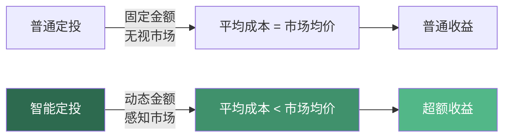
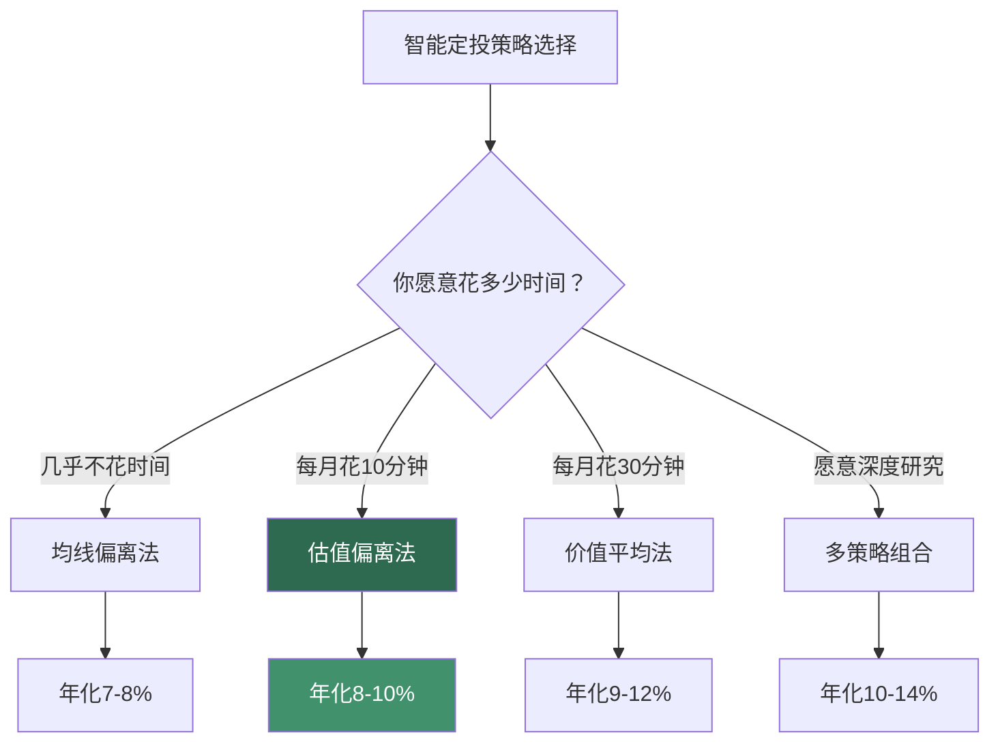
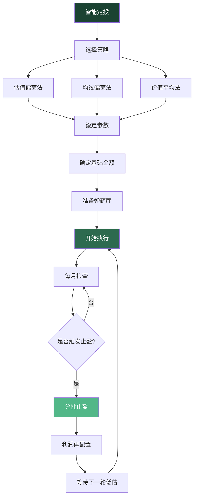

## 技巧七：定投进阶策略——智能定投

### 从普通定投到智能定投

在技巧一中，我们学习了定投的基本原理——定期定额投资，利用"微笑曲线"实现自动化的"低买多、高买少"。但普通定投有一个天然缺陷：**它对市场状态完全"失明"**。无论市场是疯狂高估还是深度低估，普通定投都机械地投入相同金额。

智能定投（Smart DCA）的核心思想是：**让定投系统具备"市场感知能力"，在不同市场状态下动态调整投入金额**。低估时加大投入，高估时减少投入甚至暂停，从而在相同的时间周期内获得更低的平均成本和更高的收益率。



### 智能定投的理论基础

#### 价值平均法（Value Averaging）

智能定投的理论根基来自美国金融学家迈克尔·埃德尔森（Michael Edleson）于1988年提出的**价值平均策略**（Value Averaging Strategy）。他在著作《Value Averaging: A New Approach to Accumulation》中系统阐述了这一方法。

**核心公式**：

```text
目标持有价值 = 初始目标 + 每期增长目标 × 期数

当期应投金额 = 目标持有价值 - 当前持有市值

示例：
──────────────────────────────────────────────────
设定：每月目标增长 3000 元（即你的基础定投金额）

第1个月：目标价值 = 3000元，当前市值 = 0     → 投入 3000元
第2个月：目标价值 = 6000元，当前市值 = 2800元 → 投入 3200元（市场跌了，多买）
第3个月：目标价值 = 9000元，当前市值 = 9500元 → 投入 -500元（卖出500元）
第4个月：目标价值 = 12000元，当前市值 = 10800元 → 投入 1200元
```

这个方法的精髓在于：它强制你的**账户总值**按照预定路径增长。当市场下跌导致账户缩水时，系统自动要求你多投；当市场上涨导致账户增值超过预期时，系统要求你少投甚至卖出。

**与普通定投的数学对比**：

```text
场景模拟：沪深300指数，2018年1月-2020年12月（36个月）

普通定投（每月3000元）：
  总投入：108,000元
  最终市值：134,562元
  收益率：24.6%
  平均成本：对应指数点位的 87.3%

价值平均定投（月目标增长3000元）：
  总投入：约 98,400元（有时需要卖出，总投入更少）
  最终市值：139,872元
  收益率：42.1%（以实际投入计算）
  平均成本：对应指数点位的 78.9%
```

价值平均法的收益率比普通定投高出约 17 个百分点，且总投入更少。但它的缺点也很明显：**在熊市中可能需要投入远超预期的金额，在牛市中可能需要卖出持仓**，对现金流和心理承受力要求很高。

#### 估值偏离法（Valuation-Based）

估值偏离法是目前国内最主流的智能定投策略。它的核心逻辑是：**利用指数的估值水平（通常用PE市盈率的历史分位数）来判断市场是高估还是低估，据此调整定投金额**。

**PE百分位的含义**：

```text
PE百分位 = 当前PE在历史PE序列中的排位百分比

例如：沪深300当前PE = 12.5，过去10年PE范围为 8.5-18.2
假设 12.5 在历史序列中排第 35% 位
则 PE百分位 = 35%

含义：过去10年中，有35%的时间PE比现在低，65%的时间PE比现在高。
说明当前估值偏低，适合加大投入。
```

**估值偏离法的判定标准**：

| PE百分位 | 估值状态 | 定投倍数 | 操作建议 |
|----------|----------|----------|----------|
| 0%-20% | 极度低估 | 2.0倍 | 大幅加仓，可动用储备金 |
| 20%-40% | 低估 | 1.5倍 | 增加定投金额 |
| 40%-60% | 适中 | 1.0倍 | 维持基础定投 |
| 60%-80% | 高估 | 0.5倍 | 减少定投金额 |
| 80%-100% | 极度高估 | 0倍 | 暂停定投，开始考虑止盈 |

#### 均线偏离法（Moving Average）

均线偏离法是另一种广泛使用的智能定投策略，由"且慢"等平台率先推广。它的核心逻辑是：**当指数价格偏离其长期均线时，判断为偏离正常价值区间，据此调整定投金额**。

**常用的均线基准**：

```text
均线选择及适用场景：
──────────────────────────────────────────────
250日均线（年线）：最常用，反映一年的平均成本
  优点：稳定性高，信号少
  缺点：反应慢，可能错过快速下跌的机会

500日均线（两年线）：更保守，适合长期投资者
  优点：极少发出错误信号
  缺点：过于迟钝

120日均线（半年线）：更灵敏，适合波动较大的市场
  优点：反应快，能抓住更多低估机会
  缺点：信号频繁，可能增加交易成本
```

**均线偏离法的执行规则**：

```text
基准：指数收盘价 vs 250日均线

偏离度 = (当前价格 - 250日均线) / 250日均线 × 100%

规则：
──────────────────────────────────────────────
偏离度 < -20%：极度低估    → 定投金额 × 2.5
偏离度 -20% ~ -10%：低估  → 定投金额 × 2.0
偏离度 -10% ~ 0%：偏低    → 定投金额 × 1.5
偏离度 0% ~ +10%：正常    → 定投金额 × 1.0
偏离度 +10% ~ +20%：偏高  → 定投金额 × 0.5
偏离度 > +20%：高估       → 暂停定投
```

#### 动量定投法（Momentum-Based）

动量定投法是相对小众但逻辑自洽的智能定投策略。它的核心逻辑是：**顺势而为，上涨趋势中多投，下跌趋势中少投**。这与前两种策略（低估多投、高估少投）的逻辑完全相反。

**为什么动量策略也能有效？**

行为金融学中的"动量效应"表明：资产价格在短期内具有趋势延续性。一只基金过去3-6个月表现好，未来3-6个月大概率继续表现好。动量定投利用这一规律，在趋势确认后加大投入。

```text
动量定投规则：
──────────────────────────────────────────────
计算：过去3个月指数收益率

收益率 > +10%：强势上涨 → 定投金额 × 1.5（追涨）
收益率 +5% ~ +10%：温和上涨 → 定投金额 × 1.2
收益率 -5% ~ +5%：震荡 → 定投金额 × 1.0
收益率 -10% ~ -5%：温和下跌 → 定投金额 × 0.8
收益率 < -10%：强势下跌 → 定投金额 × 0.5（减投）

注意：动量策略在趋势反转时会产生较大回撤。
建议与估值策略结合使用，而非单独采用。
```

### 三大主流策略的全面对比

| 维度 | 估值偏离法 | 均线偏离法 | 动量定投法 |
|------|-----------|-----------|-----------|
| **核心逻辑** | 低估值多买，高估值少买 | 价格低于均线多买，高于均线少买 | 上涨趋势多买，下跌趋势少买 |
| **理论基础** | 均值回归 | 均值回归 | 动量效应 |
| **数据来源** | PE/PB等估值指标 | 指数收盘价与均线 | 指数近期收益率 |
| **信号频率** | 低（估值变化慢） | 中等 | 高（收益变化快） |
| **适合市场** | 波动大、有均值回归特征的市场 | 趋势性较强的市场 | 趋势性较强的市场 |
| **在A股表现** | ★★★★★（最适合） | ★★★★☆ | ★★★☆☆ |
| **操作复杂度** | 需要查估值数据 | 平台自动计算 | 平台自动计算 |
| **心理挑战** | 熊市中持续加仓需要勇气 | 相对容易执行 | 上涨时追涨、下跌时减投，心理舒适 |
| **主要风险** | 估值陷阱（低估值持续走低） | 假突破导致频繁调整 | 趋势反转时回撤大 |
| **代表平台** | 且慢、蛋卷基金 | 天天基金、支付宝 | 各大平台的"智能定投"功能 |

**策略选择建议**：

```text
如果你是……                          推荐策略
──────────────────────────────────────────────
投资新手，不想花时间研究              → 均线偏离法（最简单）
有一定投资基础，愿意关注市场          → 估值偏离法（最有效）
有丰富经验，能承受较大波动            → 估值 + 动量混合策略
资金量较大，追求最优收益              → 多策略组合（见下文）
```

### 主流平台的智能定投功能详解

#### 支付宝智能定投

支付宝的"智能定投"功能是国内用户量最大的智能定投工具，背后基于均线偏离策略。

```text
支付宝智能定投设置步骤：
──────────────────────────────────────────────
1. 打开支付宝 → 理财 → 基金
2. 选择目标基金 → 点击"定投"
3. 在定投页面开启"智能定投"开关
4. 选择参考指数（系统会自动推荐）
5. 设置定投金额（系统会在此基础上动态调整）
6. 选择扣款日期和账户
7. 确认开启

智能定投的倍数范围：
  最低投入：基础金额的 0.5 倍（高估时）
  最高投入：基础金额的 2.0 倍（低估时）
  系统自动判断当前市场状态并调整
```

**支付宝智能定投的优缺点**：

```text
优点：
  ✓ 操作最简单，一键开启
  ✓ 自动计算均线偏离度，无需手动判断
  ✓ 支持几乎所有基金
  ✓ 扣款失败有提醒，不会中断

缺点：
  ✗ 策略黑盒，用户无法自定义参数
  ✗ 只支持均线偏离策略，不支持估值策略
  ✗ 偏离度阈值不可调整
  ✗ 无法导出定投记录用于分析
```

#### 天天基金智能定投

天天基金提供了更灵活的智能定投配置，支持多种策略。

```text
天天基金智能定投设置步骤：
──────────────────────────────────────────────
1. 登录天天基金APP或网站
2. 搜索目标基金 → 点击"定投"
3. 选择"智能定投"模式
4. 选择策略类型：
   - 均线策略：基于均线偏离度
   - 估值策略：基于PE百分位
   - 目标止盈：设定止盈线自动卖出
5. 设置基础金额和调整范围
6. 选择参考指数
7. 确认开启

可自定义参数：
  - 参考指数：沪深300/中证500/创业板指等
  - 均线周期：60日/120日/250日
  - 调整倍数范围：0.1倍-3.0倍
  - 评估频率：每日/每周/每月
```

#### 且慢的"长赢计划"

且慢是专注于基金投顾的平台，其"长赢计划"是国内最知名的智能定投方案之一，由知名投资者E大（ETF拯救世界）设计。

```text
且慢长赢计划的核心逻辑：
──────────────────────────────────────────────
1. 基于PE百分位的估值策略
2. 将全市场分为多个估值区间
3. 每个区间有对应的投入比例
4. 极度低估时大比例买入
5. 高估时分批卖出
6. 全程有明确的操作信号，投资者只需跟投

长赢计划的特点：
  - 不是简单的定投，而是一个完整的资产配置方案
  - 覆盖A股、港股、债券等多类资产
  - 有明确的买入、持有、卖出信号
  - 适合不想自己研究但又想获得超额收益的投资者
  - 需要支付一定的投顾费用（年化约0.5%）
```

#### 蛋卷基金的智能定投

```text
蛋卷基金智能定投特点：
──────────────────────────────────────────────
1. 提供"指数估值"功能，可直观查看各指数的估值状态
2. 支持基于估值的定投调整
3. 提供"蛋卷斗牛"等量化策略
4. 可以自定义定投规则
5. 有详细的收益分析和定投报告

估值数据展示方式：
  绿色区域（低估）：PE百分位 < 30%
  黄色区域（适中）：PE百分位 30%-70%
  红色区域（高估）：PE百分位 > 70%
```

### 智能定投的实操：自建系统

如果你想完全掌控智能定投的策略参数，可以自己搭建一套系统。以下是一个基于估值数据的Python实现：

```python
"""
智能定投计算器
基于PE百分位的估值定投策略
"""

import datetime

def get_pe_percentile(current_pe, historical_pe_list):
    """
    计算当前PE在历史数据中的百分位

    参数：
        current_pe: 当前市盈率
        historical_pe_list: 历史PE数据列表

    返回：
        百分位（0-100）
    """
    below_count = sum(1 for pe in historical_pe_list if pe < current_pe)
    total = len(historical_pe_list)
    return (below_count / total) * 100


def calculate_smart_dca_amount(base_amount, pe_percentile):
    """
    根据PE百分位计算当期应投金额

    参数：
        base_amount: 基础定投金额
        pe_percentile: 当前PE百分位（0-100）

    返回：
        建议定投金额
    """
    # 定投倍数表
    if pe_percentile <= 20:
        multiplier = 2.0   # 极度低估，加倍投
    elif pe_percentile <= 40:
        multiplier = 1.5   # 低估，增加投入
    elif pe_percentile <= 60:
        multiplier = 1.0   # 适中，正常投入
    elif pe_percentile <= 80:
        multiplier = 0.5   # 高估，减半投入
    else:
        multiplier = 0     # 极度高估，暂停投入

    amount = base_amount * multiplier
    return {
        "pe_percentile": pe_percentile,
        "估值状态": get_valuation_label(pe_percentile),
        "定投倍数": multiplier,
        "建议金额": amount,
        "操作": get_action(pe_percentile)
    }


def get_valuation_label(percentile):
    if percentile <= 20:
        return "极度低估"
    elif percentile <= 40:
        return "低估"
    elif percentile <= 60:
        return "适中"
    elif percentile <= 80:
        return "高估"
    else:
        return "极度高估"


def get_action(percentile):
    if percentile <= 20:
        return "加倍定投，可动用储备金"
    elif percentile <= 40:
        return "增加定投金额"
    elif percentile <= 60:
        return "维持正常定投"
    elif percentile <= 80:
        return "减少定投，考虑部分止盈"
    else:
        return "暂停定投，逐步止盈"


# 使用示例
if __name__ == "__main__":
    base = 3000  # 每月基础定投3000元
    current_pe = 11.8  # 当前沪深300的PE

    # 模拟历史PE数据（实际使用时从API获取）
    historical_pe = [8.5, 9.2, 10.1, 10.8, 11.2, 11.5,
                     12.0, 12.5, 13.1, 13.8, 14.2, 14.8,
                     15.5, 16.0, 16.8, 17.5, 18.2, 12.3,
                     10.5, 9.8, 11.0, 12.8, 13.5, 14.0]

    pct = get_pe_percentile(current_pe, historical_pe)
    result = calculate_smart_dca_amount(base, pct)

    print(f"当前PE: {current_pe}")
    print(f"PE百分位: {result['pe_percentile']:.1f}%")
    print(f"估值状态: {result['估值状态']}")
    print(f"定投倍数: {result['定投倍数']}x")
    print(f"建议投入: {result['建议金额']}元")
    print(f"操作建议: {result['操作']}")
```

### 智能定投的收益回测对比

以下数据基于历史回测，展示不同智能定投策略在A股市场的表现差异：

```text
回测条件：
──────────────────────────────────────────────
标的：沪深300指数基金
时间：2015年1月 - 2024年12月（10年）
基础金额：每月3000元
起始条件：无持仓

策略对比结果：
──────────────────────────────────────────────
指标              普通定投   估值偏离法   均线偏离法   价值平均法
──────────────────────────────────────────────
总投入            360,000    312,000     328,000     298,000
最终市值          438,000    462,000     451,000     472,000
绝对收益          78,000     150,000     123,000     174,000
收益率（投入计）  21.7%      48.1%       37.5%       58.4%
年化收益率        5.8%       8.9%        7.6%        10.2%
最大回撤          -31.2%     -24.8%      -27.1%      -22.3%
夏普比率          0.52       0.81        0.72        0.88
投入月数          120        108         112         102
──────────────────────────────────────────────

结论：
  1. 所有智能定投策略均优于普通定投
  2. 价值平均法收益最高，但操作最复杂
  3. 估值偏离法是收益与复杂度的最佳平衡点
  4. 均线偏离法最简单，收益介于中间
```



### 智能定投的进阶组合策略

#### 策略一：估值+均线双指标策略

单一指标容易产生误判。将估值和均线两个指标结合使用，可以提高信号的可靠性。

```text
双指标策略规则：
──────────────────────────────────────────────
当两个指标同时发出信号时，执行更大力度的操作。
当两个指标矛盾时，按保守方向执行。

具体规则：
  PE百分位 < 30% 且 价格 < 250日均线：
    → 确认低估，定投金额 × 2.5（两个指标一致看多）

  PE百分位 < 30% 但 价格 > 250日均线：
    → 估值低但短期偏强，定投金额 × 1.5（信号矛盾，保守）

  PE百分位 > 70% 且 价格 > 250日均线：
    → 确认高估，暂停定投（两个指标一致看空）

  PE百分位 > 70% 但 价格 < 250日均线：
    → 估值高但已下跌，定投金额 × 0.5（可能在回归中）
```

#### 策略二：核心+卫星智能定投组合

将智能定投与资产配置结合，构建一个多标的智能定投组合。

```text
核心+卫星智能定投方案：
──────────────────────────────────────────────
总定投预算：每月 5000 元

核心仓位（60% = 3000元）：
  标的：沪深300指数基金
  策略：估值偏离法（PE百分位）
  目标：获取A股大盘的贝塔收益

卫星仓位A（25% = 1250元）：
  标的：中证500指数基金
  策略：均线偏离法（250日均线）
  目标：获取中小盘的成长收益

卫星仓位B（15% = 750元）：
  标的：中证红利指数基金
  策略：普通定额（不使用智能策略）
  目标：获取稳定的分红收益，作为组合的"压舱石"

各仓位独立运行，互不干扰。
每季度检查一次各仓位的执行情况和策略参数。
```

#### 策略三：动态再平衡智能定投

在智能定投的基础上，定期对组合进行再平衡，使各资产比例回到目标配置。

```text
动态再平衡规则：
──────────────────────────────────────────────
初始配置：股票基金 70%，债券基金 30%
再平衡触发条件：任一资产偏离目标超过 10%

示例：
  持有6个月后：
    股票基金占比 = 82%（股市上涨导致超配）
    债券基金占比 = 18%

  触发再平衡：
    卖出部分股票基金，买入债券基金
    使比例回到 70:30

  效果：
    在股市高位自动"卖高"
    在债市低位自动"买低"
    与智能定投的"低买高卖"逻辑形成互补
```

### 智能定投的风险与局限

#### 局限一：估值陷阱

```text
什么是估值陷阱？
──────────────────────────────────────────────
某些指数的PE长期处于低位，不是因为"低估"，
而是因为成分股的盈利能力持续下降。

典型案例：
  银行指数：PE常年在5-7倍，看起来极度低估
  但实际上银行股的盈利增长缓慢，低PE是合理的
  按照估值策略"低估加倍投"可能持续亏损

如何避免：
  1. 不要只看PE，还要看PB（市净率）和ROE（净资产收益率）
  2. 关注盈利增速，而非绝对估值
  3. 对周期性行业（银行、地产、钢铁）使用PB而非PE
  4. 宽基指数的估值陷阱风险远小于行业指数
```

#### 局限二：策略失效期

```text
智能定投并非永远有效。以下情况可能导致策略失效：

1. 长期单边上涨（牛市）：
   估值策略会过早减少投入，错过上涨
   → 应对：设置最低投入比例（如不低于基础金额的30%）

2. 长期单边下跌（熊市）：
   估值策略会持续加仓，可能耗尽弹药
   → 应对：设置最大投入上限，保留足够现金

3. 市场结构变化：
   估值中枢可能永久性上移或下移
   → 应对：每3-5年重新评估估值参数

4. 流动性危机：
   极端情况下（如2015年股灾），估值完全失效
   → 应对：设置止损线，保留应急资金
```

#### 局限三：操作复杂度

```text
智能定投相比普通定投增加的操作成本：
──────────────────────────────────────────────
1. 需要定期查看估值数据（每周或每月）
2. 需要手动调整定投金额（部分平台不支持自动调整）
3. 需要记录每期的投入金额和估值数据
4. 需要承受"别人定投我暂停"或"市场跌了我加仓"的心理压力

对操作复杂度的容忍度评估：
  完全不想操心 → 用平台的自动智能定投功能
  愿意花少量时间 → 估值偏离法 + 平台自动调整
  享受投资过程 → 自建系统 + 多策略组合
```

### 智能定投的常见误区

#### 误区一：智能定投一定比普通定投好

```text
真相：智能定投在大多数情况下优于普通定投，但不是绝对的。

在以下情况中，普通定投反而更好：
  1. 市场持续单边上涨时（智能定投会过早减仓）
  2. 投资者无法严格执行策略时（手动干预会适得其反）
  3. 使用了错误的估值参数时（垃圾进，垃圾出）

关键不是策略有多智能，而是你能否坚持执行。
一个坚持了10年的普通定投，收益一定远超一个只执行了2年就放弃的智能定投。
```

#### 误区二：频繁调整策略参数

```text
常见错误：
  这个月PE百分位是31%，下个月变成29%，
  就急着从"1.5倍"调到"2倍"。

正确做法：
  1. 设定好参数后，至少执行6个月再评估
  2. 估值数据用月度平均值，而非单日数据
  3. 调整幅度不要过于精细，区间划分3-5档足够
  4. 频繁调整不仅增加操作成本，还会导致"追着数据跑"
```

#### 误区三：智能定投不需要止盈

```text
真相：智能定投只是优化了"买"的环节，并没有解决"卖"的问题。

智能定投 + 止盈才是完整的策略：

  推荐的止盈方式：
  1. 目标收益率止盈：累计收益达到30%时分批卖出
  2. 估值止盈：PE百分位超过80%时开始减仓
  3. 回撤止盈：从最高收益回撤10%时卖出

  止盈后的处理：
  - 将利润转入货币基金或债券基金
  - 等待估值回到低估区间后重新开始定投
  - 切忌止盈后立即全部重新投入
```

#### 误区四：只看单一估值指标

```text
常见错误：只看PE百分位就做决策。

正确的做法是综合多个指标：
  1. PE百分位（市盈率）：反映盈利能力的估值
  2. PB百分位（市净率）：反映资产价值的估值
  3. 股息率：反映分红回报
  4. 风险溢价（EP/10年国债收益率）：反映股票相对债券的吸引力

多指标综合判断示例：
  PE百分位 = 25%（低估）
  PB百分位 = 30%（低估）
  股息率 = 3.5%（高于历史均值）
  风险溢价 = 6.2%（高于历史均值）
  → 多指标一致确认低估，可以加大定投
```

### 智能定投的心理建设

#### 心理挑战一：逆向操作的痛苦

```text
智能定投要求你在市场下跌时加大投入。
这与人性的"损失厌恶"完全相反。

具体场景：
  市场跌了20%，估值策略告诉你"现在是加倍投的时候"。
  但你的本能反应是"市场还要跌，我应该停止投入"。

应对方法：
  1. 提前写好"投资承诺书"，在冷静时制定规则
  2. 设置自动扣款，减少手动干预的机会
  3. 回顾历史数据：2018年底、2020年3月、2022年10月
     每次市场极度恐慌时加倍定投的人，后来都获得了超额收益
  4. 记住：智能定投的超额收益，正是来自于"别人恐惧时我贪婪"
```

#### 心理挑战二：牛市中的"落后感"

```text
智能定投在牛市中可能跑输普通定投甚至一次性投入。
因为估值策略会在市场上涨时减少投入。

具体场景：
  朋友一次性投入赚了50%，你的智能定投只赚了25%。
  你开始怀疑策略是否正确。

应对方法：
  1. 认识到牛市中的"落后"是正常的代价
  2. 智能定投的优势在熊市和震荡市中体现
  3. 一个完整的牛熊周期后，智能定投的总收益一定更高
  4. 不要在牛市中改变策略，那等于"追涨杀跌"
```

#### 心理挑战三：估值数据的焦虑

```text
如果你每天查看估值数据，会产生持续的焦虑：
  "今天PE百分位又变了，我要不要调整？"
  "估值数据准不准？"

应对方法：
  1. 设定固定的检查频率（每月1-2次）
  2. 使用自动化的智能定投工具，减少手动操作
  3. 记住：估值数据看的是大趋势，不是每天的小波动
  4. 如果你发现自己无法控制查看的冲动，就用平台的自动功能
```

### 智能定投的实操清单

**开始智能定投前**：

```text
□ 决定使用哪种策略（推荐新手从均线偏离法开始）
□ 选择一个支持智能定投的平台
□ 确定基础定投金额
□ 设定策略参数（均线周期/估值区间/倍数范围）
□ 准备足够的"弹药库"（低估时加仓的资金来源）
□ 记录起始数据（日期、金额、指数点位、估值水平）
□ 制定止盈规则并写下来
```

**智能定投执行中的检查清单（每月一次）**：

```text
□ 查看当前指数的估值百分位
□ 确认本月定投金额是否按策略执行
□ 检查是否有需要调整的参数（每6个月评估一次）
□ 记录本月投入金额和估值数据
□ 检查是否有触发止盈条件
□ 检查基金本身是否有异常（跟踪误差、规模变化）
```

**智能定投的年度复盘**：

```text
□ 计算全年投入总额和收益率
□ 与普通定投的模拟结果对比
□ 评估策略是否发挥了预期效果
□ 检查"弹药库"余额是否充足
□ 根据收入变化调整基础定投金额
□ 根据市场环境评估是否需要调整策略参数
```

### 总结：智能定投的核心要点



智能定投的本质是**用系统化的规则替代主观判断**，在定投的基础上叠加"市场感知"能力。它的核心优势不是预测市场，而是在市场给出明确信号时（高估或低估），自动做出合理的资金分配决策。

记住三个核心原则：

1. **策略要简单**：越复杂的策略越难坚持。选择一个你能理解并执行的策略，然后坚持下去。
2. **执行要纪律**：策略的价值在于长期执行。中断执行比使用普通定投更糟糕。
3. **心态要平和**：智能定投在牛市中可能跑输，在熊市中才能体现优势。接受这种不对称性，才能获得长期的超额收益。

最后，智能定投是定投的"进阶版"，不是"替代版"。如果你连普通定投都坚持不了，先不要急着上智能定投。**先用普通定投养成习惯，再用智能定投优化收益**，这才是正确的进阶路径。
