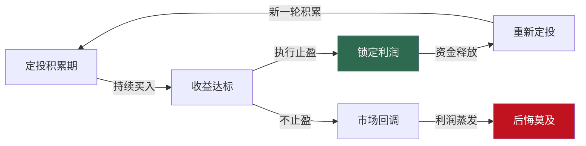
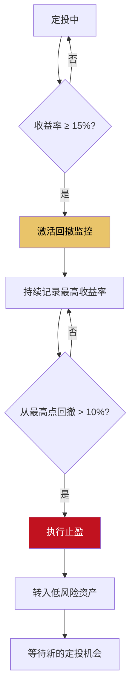
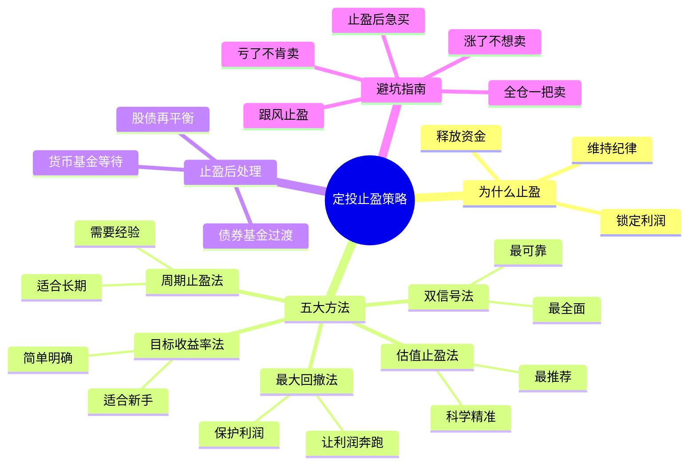

## 技巧八：基金定投的止盈策略

### 为什么止盈比买入更重要

在定投的世界里，大多数人把精力花在"什么时候买""买多少""买什么"上，却忽略了一个更关键的问题——**什么时候卖**。

定投的本质是通过长期积累摊低成本，但如果你永远不卖出，纸面上的收益就只是数字。2007年沪深300冲到5891点，如果当时定投者没有止盈，到2008年底指数跌到1627点，不仅利润全部蒸发，本金也亏损过半。**会买的是徒弟，会卖的才是师傅**——这句话在定投领域同样适用。

止盈的核心意义有三个：

1. **锁定利润**：将浮盈转化为真实收益，避免"坐电梯"（涨上去又跌回来）
2. **释放资金**：止盈后的资金可以重新投入下一轮定投，在新的低位积累份额
3. **维持纪律**：有明确的止盈规则，避免在贪婪和恐惧之间反复摇摆



### 止盈的核心难题：卖早了还是卖晚了

止盈之所以困难，是因为它面临一个永恒的两难：

- **卖早了**：止盈后市场继续涨，你错过了后面的利润，心里懊悔
- **卖晚了**：达到目标没有卖，市场回调，利润缩水甚至亏损，更加懊悔

没有人能精确卖在最高点。止盈策略的目标不是"卖在最高点"，而是**在可接受的误差范围内，大概率地锁定大部分利润**。接受"卖不到最好"是成熟投资者的第一课。

### 方法一：目标收益率止盈法

这是最简单、最适合新手的止盈方法。核心逻辑：**设定一个预期收益率目标，达到后全部或分批卖出**。

#### 基本规则

```text
目标收益率止盈法：
──────────────────────────────────────────────
设定：目标收益率 = 20%（可根据市场环境调整）
触发条件：定投持仓的累计收益率 ≥ 20%
操作：达到目标后全部卖出，或分3批卖出

分批卖出方案：
  第一批：收益率达20%时，卖出1/3仓位
  第二批：收益率达30%时，卖出1/3仓位
  第三批：收益率达40%时，卖出剩余仓位
  兜底：若收益率从最高点回落10%，强制清仓
```

#### 目标收益率的设定依据

目标不是随便拍脑袋定的，需要参考三个因素：

| 因素 | 低目标（10-15%） | 中目标（20-30%） | 高目标（40%+） |
|------|------------------|------------------|----------------|
| 定投标的 | 宽基指数（沪深300） | 行业指数（消费/医药） | 窄基/主题指数 |
| 市场环境 | 震荡市、慢牛 | 正常牛熊周期 | 大熊市后启动 |
| 定投时长 | 已投3年以上 | 已投1-3年 | 已投不到1年 |
| 风险偏好 | 保守型 | 稳健型 | 进取型 |

**A股市场的实际参考**：

```text
沪深300指数的历史牛市涨幅：
──────────────────────────────────────────────
2005-2007年：从807点涨到5891点，涨幅 630%
2008-2009年：从1627点涨到3803点，涨幅 134%
2014-2015年：从2054点涨到5380点，涨幅 162%
2019-2021年：从2935点涨到5930点，涨幅 102%

定投投资者通常在市场中段开始积累，实际可获得的
收益率约为指数涨幅的 40%-60%。

因此：
  牛市初期开始定投 → 目标可设 30-50%
  牛市中期开始定投 → 目标可设 15-25%
  牛市末期开始定投 → 目标可设 10-15%（尽快止盈）
```

#### 优缺点分析

```text
优点：
  ✓ 规则明确，执行简单，不需要判断市场
  ✓ 适合新手和没时间盯盘的投资者
  ✓ 避免"贪心不足蛇吞象"的心理陷阱

缺点：
  ✗ 目标设低了：可能在牛市初期就止盈，错过主升浪
  ✗ 目标设高了：可能长期达不到，资金效率低
  ✗ 不考虑市场估值：在极度高估时目标没达到不止盈，
    或在低估区刚达到目标就止盈
  ✗ 固定目标不能适应不同市场环境
```

### 方法二：估值止盈法

估值止盈法是与技巧七中"估值偏离法定投"配套的卖出策略。核心逻辑：**当指数估值进入高估区间时，分批卖出**。

#### 估值止盈的判定标准

```text
PE百分位止盈规则：
──────────────────────────────────────────────
PE百分位 60%-70%（偏高）：
  → 停止定投，持有不动
  → 开始关注市场情绪和估值变化

PE百分位 70%-80%（高估）：
  → 卖出 1/3 仓位
  → 停止定投

PE百分位 80%-90%（严重高估）：
  → 再卖出 1/3 仓位
  → 将卖出资金转入债券基金或货币基金

PE百分位 > 90%（极度高估）：
  → 清仓剩余仓位
  → 全部转入低风险资产，等待下一轮低估机会
```

#### 结合PB（市净率）双重确认

单一指标可能失真。PE和PB同时处于高位时，高估信号更可靠：

| PE百分位 | PB百分位 | 综合判定 | 操作 |
|----------|----------|----------|------|
| > 80% | > 80% | 确认极度高估 | 清仓 |
| > 80% | 50%-80% | 大概率高估 | 卖出2/3 |
| 50%-80% | > 80% | 结构性高估 | 卖出1/3 |
| > 80% | < 50% | 估值矛盾 | 卖出1/3，观察 |
| < 50% | < 50% | 正常或低估 | 继续定投 |

#### 估值止盈的实战数据

```text
回测场景：沪深300指数基金定投
时间范围：2012年1月 - 2024年12月（13年）
基础金额：每月3000元

方案A：普通定投，不止盈
  总投入：468,000元
  最终市值：612,000元
  收益率：30.8%
  年化收益率：2.1%

方案B：目标收益率止盈（达到25%即止盈，止盈后重新开始）
  总投入：468,000元（实际有效投入约380,000元）
  累计止盈次数：4次
  累计止盈收益：约 156,000元
  最终持仓市值：约 78,000元
  总资产：约 622,000元
  收益率：32.9%
  年化收益率：2.2%

方案C：估值止盈法（PE百分位>75%分批卖出，<30%加倍定投）
  总投入：468,000元（高估期减少投入，低估期增加投入）
  累计止盈收益：约 210,000元
  最终持仓市值：约 95,000元
  总资产：约 773,000元
  收益率：65.2%
  年化收益率：3.9%

结论：估值止盈法不仅止盈更精准，还能通过低估加仓
进一步提升整体收益。
```

#### 估值数据的获取途径

```text
免费数据来源：
──────────────────────────────────────────────
1. 中证指数官网（www.csindex.com.cn）
   → 提供主要指数的PE、PB等估值数据
   → 数据更新频率：每日

2. 且慢APP - 指数估值
   → 直观的红绿灯展示（低估/适中/高估）
   → 覆盖主流宽基和行业指数

3. 蛋卷基金 - 指数估值
   → 提供PE百分位的可视化图表
   → 可查看历史估值走势

4. 理杏仁（lixinger.com）
   → 最全面的A股估值数据
   → 需付费（基础版约198元/年）
   → 提供个股和指数的多维度估值

5. 韭圈儿（jiucaishuo.com）
   → 免费的指数估值数据
   → 界面简洁，适合快速查看
```

### 方法三：最大回撤止盈法

最大回撤止盈法是一种"让利润奔跑"的策略。核心逻辑：**不设固定的止盈目标，而是在利润达到一定水平后，设置一个回撤阈值，当收益从最高点回落超过阈值时止盈**。

#### 执行规则

```text
最大回撤止盈法：
──────────────────────────────────────────────
前提条件：持仓收益率 ≥ 15%（利润保护线）

规则：
  1. 当收益率首次达到15%时，激活回撤监控
  2. 记录持仓以来的最高收益率
  3. 当收益率从最高点回撤 10% 时，执行止盈

示例：
  第12个月：收益率达15%，激活监控
  第15个月：收益率达28%，记录最高点28%
  第18个月：收益率回落到20%（回撤8%），继续持有
  第20个月：收益率回落到17%（回撤11% > 10%阈值），执行止盈
  止盈收益率：17%

  如果不做回撤止盈：
  第24个月：收益率回落到5%，利润大幅缩水
```

#### 回撤阈值的设定

| 投资者类型 | 激活线 | 回撤阈值 | 适用场景 |
|-----------|--------|----------|---------|
| 保守型 | 15% | 5-8% | 资金有明确用途，不能承受大波动 |
| 稳健型 | 20% | 8-12% | 大多数定投投资者的最优选择 |
| 进取型 | 30% | 12-15% | 追求更高收益，能承受较大回撤 |
| 激进型 | 50% | 15-20% | 牛市中想吃到更多涨幅 |



#### 优缺点分析

```text
优点：
  ✓ 在牛市中能让利润充分奔跑，不会过早止盈
  ✓ 自动适应市场——涨得多就多赚，涨得少就少赚
  ✓ 有明确的退出机制，不会"坐电梯"

缺点：
  ✗ 在震荡市中可能反复触发止盈信号（假回撤）
  ✗ 从最高点回撤到止盈，实际卖出价可能比最高点低很多
  ✗ 需要持续监控收益率，不适合完全"躺平"的投资者
  ✗ 如果牛市持续上涨不回头，可能永远不触发止盈
```

### 方法四：估值+回撤双信号止盈法

单一方法都有缺陷。将估值止盈和回撤止盈结合，可以互相弥补不足。

#### 核心逻辑

```text
双信号止盈法：
──────────────────────────────────────────────
信号1（估值信号）：PE百分位进入高估区（>70%）
信号2（回撤信号）：收益率从最高点回撤超过阈值

两个信号独立运行，任一信号触发即执行对应操作：

情景1：估值进入高估区，但收益率还在上涨
  → 估值信号触发
  → 卖出1/3仓位（降低风险敞口）
  → 同时激活回撤监控（如果尚未激活）

情景2：估值正常，但收益率大幅回撤
  → 回撤信号触发
  → 卖出全部仓位（保护利润）
  → 估值正常说明可能是短期波动，但利润保护优先

情景3：估值高估 + 收益率回撤
  → 双信号共振
  → 立即清仓（最强的卖出信号）
```

#### 完整决策矩阵

| 估值状态 | 收益率趋势 | 回撤状态 | 操作 |
|---------|-----------|---------|------|
| 低估（<40%） | 上涨 | 未激活 | 继续定投，享受低吸 |
| 低估（<40%） | 回撤 | 未激活 | 继续定投，回撤是好事 |
| 适中（40-70%） | 上涨 | 未激活 | 正常定投，耐心等待 |
| 适中（40-70%） | 上涨 | 已激活未触发 | 持有，监控回撤 |
| 适中（40-70%） | 回撤 | 触发 | 卖出1/2，保留观察仓 |
| 高估（>70%） | 上涨 | 未激活 | 卖出1/3，激活回撤 |
| 高估（>70%） | 回撤 | 已激活 | 卖出1/2 |
| 高估（>70%） | 回撤 | 触发 | 清仓 |
| 极度高估（>90%） | 任意 | 任意 | 清仓，不犹豫 |

### 方法五：周期止盈法（适合长期投资者）

如果你的定投目标是养老金、子女教育金等超长期目标（10年+），可以采用"周期止盈"——不以收益率为标准，而是以**市场周期**为标准。

#### 核心逻辑

```text
周期止盈法：
──────────────────────────────────────────────
核心假设：A股市场大约每3-5年经历一个完整的牛熊周期

规则：
  1. 在一个完整的熊市期间持续定投（通常2-3年）
  2. 当市场进入牛市（判断标准：指数从低点上涨50%+，
     市场成交量持续放大，新增开户数激增）
  3. 开始分批止盈：
     牛市初期（指数翻倍前）：卖出30%
     牛市中期（指数翻倍后）：卖出40%
     牛市末期（见顶信号明显）：卖出剩余30%
  4. 止盈后资金存入货币基金，等待下一个熊市
  5. 下一个熊市到来时，重新开始定投
```

#### 牛市和熊市的判断指标

```text
牛市信号（至少满足3个）：
──────────────────────────────────────────────
□ 沪深300 PE百分位 > 70%
□ 指数站上250日均线且均线向上
□ 两市日均成交额 > 1.5万亿（2024年标准）
□ 新增投资者数量月环比增长 > 50%
□ 基金发行规模大幅增长（"日光基"频现）
□ 媒体大量报道股市赚钱效应
□ 身边从不炒股的人开始问你买什么

熊市信号（至少满足3个）：
──────────────────────────────────────────────
□ 沪深300 PE百分位 < 30%
□ 指数跌破250日均线且均线向下
□ 两市日均成交额 < 5000亿
□ 新基金发行困难，延期募集
□ 媒体报道股市亏损故事
□ 身边的人说"再也不炒股了"
□ 大股东增持和公司回购数量增加
```

### 六大主流止盈方法的全面对比

| 维度 | 目标收益率法 | 估值止盈法 | 最大回撤法 | 双信号法 | 周期止盈法 | 定投年限法 |
|------|------------|-----------|-----------|---------|-----------|-----------|
| **核心逻辑** | 达到目标就卖 | 高估就卖 | 利润回撤超限就卖 | 估值+回撤共振 | 跟随牛熊周期 | 投满N年就卖 |
| **难度** | ★☆☆☆☆ | ★★★☆☆ | ★★☆☆☆ | ★★★★☆ | ★★★★★ | ★☆☆☆☆ |
| **适合人群** | 纯新手 | 有基础的投资者 | 稳健型投资者 | 进阶投资者 | 资深投资者 | 佛系投资者 |
| **牛市表现** | 可能卖早 | 优秀 | 优秀 | 最优 | 优秀 | 一般 |
| **熊市表现** | 一般 | 优秀 | 优秀 | 优秀 | 优秀 | 差 |
| **震荡市表现** | 差（难达标） | 一般 | 差（假信号多） | 良好 | 一般 | 一般 |
| **自动化程度** | 高 | 中 | 高 | 中 | 低 | 最高 |
| **推荐指数** | ★★★☆☆ | ★★★★★ | ★★★★☆ | ★★★★★ | ★★★★☆ | ★★☆☆☆ |

### 止盈后的资金处理

止盈不是终点，而是新一轮投资的起点。止盈后的资金处理同样重要。

#### 方案一：全部转入货币基金等待

```text
适用场景：市场处于高估区间，预计会回调
操作：
  1. 止盈资金全部转入货币基金（余额宝/零钱通）
  2. 等待PE百分位回落到40%以下
  3. 重新开始定投
预期等待时间：3-18个月
优点：安全，不操心
缺点：资金闲置期收益低（年化约2%）
```

#### 方案二：转入债券基金过渡

```text
适用场景：市场中等估值，不确定方向
操作：
  1. 止盈资金全部转入中短债基金
  2. 同时保持对市场估值的关注
  3. 当估值回到低估区间，分批从债基转入指数基金
预期收益：债基年化约3-5%
优点：比货币基金收益高，波动小
缺点：债基也有小幅波动，极端情况可能短期亏损
```

#### 方案三：股债再平衡

```text
适用场景：长期投资者，不想完全离场
操作：
  1. 止盈后，将权益仓位降低到30%（原来可能是70%）
  2. 增加债券基金仓位到50%
  3. 保留20%货币基金作为机动资金
  4. 随市场变化动态调整

资产配置变化：
  止盈前：股票基金70% + 债券基金20% + 货币基金10%
  止盈后：股票基金30% + 债券基金50% + 货币基金20%
```

### 常见的止盈误区

#### 误区一："涨了就不想卖"

```text
心理分析：
  这是"禀赋效应"和"贪婪"的混合体。
  你的基金涨了30%，你觉得"还能涨"；
  涨到50%，你觉得"牛市来了不能卖"；
  涨到80%，你觉得"这次不一样"；
  结果市场回调，利润归零。

纠正方法：
  在定投开始时就写下止盈规则，贴在显示器旁边。
  达到条件时，不问感受，只执行规则。
  记住：落袋为安的利润才是真正的利润。
```

#### 误区二："亏了就不卖"

```text
心理分析：
  这是"损失厌恶"和"沉没成本谬误"的体现。
  "我已经亏了20%，现在卖就真亏了"——但如果不卖，
  可能亏得更多。止盈不仅包括盈利时的卖出，也包括
  判断趋势恶化时的止损。

纠正方法：
  区分"暂时波动"和"趋势恶化"：
  - 估值正常+短期下跌 = 暂时波动，继续定投
  - 估值高估+持续下跌 = 趋势恶化，考虑减仓
```

#### 误区三："到了止盈点就全卖"

```text
心理分析：
  全部卖出的最大风险是：卖完之后市场继续涨，
  你踏空了。踏空的痛苦甚至比亏损更大（行为金融学）。

纠正方法：
  采用分批止盈：
  - 第一批（1/3）：达到止盈条件立即卖出
  - 第二批（1/3）：再涨10%卖出
  - 第三批（1/3）：再涨10%卖出，或从最高点回撤8%卖出
  这样既锁定了部分利润，又保留了继续上涨的可能。
```

#### 误区四："止盈后马上重新定投"

```text
心理分析：
  止盈后看到市场还在涨，忍不住马上重新入场。
  这往往买在高位，之前的止盈白做了。

纠正方法：
  止盈后设置"冷静期"——至少等待1个月再重新定投。
  更好的做法是等待估值回落到合理区间再开始。
  在等待期间，把资金放在货币基金或短债基金中。
```

#### 误区五："所有人都止盈了我也要止盈"

```text
心理分析：
  羊群效应。当身边所有人都在止盈卖出时，
  你可能跟风卖出，但实际上你的持仓成本和
  收益率与别人不同。

纠正方法：
  每个人的定投起点、金额、标的都不同，
  止盈时机也应该不同。
  只依据自己的规则和数据做决策。
```

### 止盈策略的自动化实现

如果你不想每天盯着盘面，可以用以下方法实现半自动化止盈。

#### 方法一：利用平台的止盈功能

```text
支付宝止盈提醒设置：
──────────────────────────────────────────────
1. 打开支付宝 → 理财 → 基金 → 持有
2. 选择目标基金 → 点击"收益提醒"
3. 设置提醒条件：
   - 盈利提醒：收益率达到 X% 时通知
   - 亏损提醒：亏损达到 X% 时通知
4. 收到提醒后手动执行卖出

注意：支付宝目前不支持自动止盈卖出，
需要收到提醒后手动操作。
```

```text
天天基金止盈设置：
──────────────────────────────────────────────
1. 登录天天基金APP
2. 进入"目标止盈"功能
3. 设置止盈目标收益率
4. 系统在达到目标后自动发起赎回

优势：支持自动执行，不需要手动操作
限制：仅支持目标收益率止盈，不支持估值止盈
```

#### 方法二：Python自动止盈监控脚本

```python
"""
基金定投止盈监控器
监控持仓收益率，在达到止盈条件时发送提醒
"""

import json
from datetime import datetime


class TakeProfitMonitor:
    """止盈监控器"""

    def __init__(self, holdings, strategy="target"):
        """
        初始化监控器

        参数：
            holdings: 持仓列表，格式：
                [{"name": "沪深300ETF", "cost": 50000,
                  "shares": 2800, "current_nav": 19.5}]
            strategy: 止盈策略类型
                "target" - 目标收益率
                "drawdown" - 最大回撤
                "dual" - 双信号（估值+回撤）
        """
        self.holdings = holdings
        self.strategy = strategy
        self.max_return = {}  # 记录每只基金的历史最高收益率
        self.alerts = []

    def calculate_return(self, holding):
        """计算单只基金的收益率"""
        current_value = holding["shares"] * holding["current_nav"]
        cost = holding["cost"]
        return_rate = (current_value - cost) / cost * 100
        return {
            "name": holding["name"],
            "cost": cost,
            "current_value": current_value,
            "return_rate": return_rate,
            "profit": current_value - cost,
        }

    def check_target_strategy(self, name, return_rate, target=20):
        """目标收益率策略检查"""
        if return_rate >= target:
            return {
                "signal": "SELL",
                "reason": f"收益率达{return_rate:.1f}%，"
                          f"超过目标{target}%",
                "action": "执行止盈",
            }
        elif return_rate >= target * 0.8:
            return {
                "signal": "WATCH",
                "reason": f"收益率{return_rate:.1f}%，"
                          f"接近目标{target}%",
                "action": "密切关注",
            }
        return {"signal": "HOLD", "reason": "未达目标", "action": "继续持有"}

    def check_drawdown_strategy(self, name, return_rate,
                                 activate_at=15, drawdown_limit=10):
        """最大回撤策略检查"""
        # 更新历史最高收益率
        if name not in self.max_return:
            self.max_return[name] = return_rate
        else:
            self.max_return[name] = max(self.max_return[name], return_rate)

        max_ret = self.max_return[name]

        # 未激活
        if max_ret < activate_at:
            return {
                "signal": "HOLD",
                "reason": f"最高收益率{max_ret:.1f}%，"
                          f"未达激活线{activate_at}%",
                "action": "继续持有",
            }

        # 已激活，检查回撤
        drawdown = max_ret - return_rate
        if drawdown >= drawdown_limit:
            return {
                "signal": "SELL",
                "reason": f"从最高{max_ret:.1f}%回撤"
                          f"{drawdown:.1f}%，超过阈值{drawdown_limit}%",
                "action": "执行止盈",
            }
        else:
            return {
                "signal": "WATCH",
                "reason": f"最高{max_ret:.1f}%，"
                          f"当前{return_rate:.1f}%，"
                          f"回撤{drawdown:.1f}%",
                "action": "继续监控",
            }

    def run_check(self):
        """执行一轮检查"""
        self.alerts = []
        print(f"\n{'='*55}")
        print(f"止盈监控报告  {datetime.now().strftime('%Y-%m-%d %H:%M')}")
        print(f"{'='*55}")

        for h in self.holdings:
            info = self.calculate_return(h)
            name = info["name"]
            ret = info["return_rate"]

            if self.strategy == "target":
                result = self.check_target_strategy(name, ret)
            elif self.strategy == "drawdown":
                result = self.check_drawdown_strategy(name, ret)
            else:
                result = self.check_target_strategy(name, ret)

            status_icon = {
                "SELL": "🔴", "WATCH": "🟡", "HOLD": "🟢"
            }[result["signal"]]

            print(f"\n{status_icon} {name}")
            print(f"  成本: {info['cost']:.0f}元  "
                  f"市值: {info['current_value']:.0f}元  "
                  f"盈亏: {info['profit']:+.0f}元")
            print(f"  收益率: {ret:+.2f}%")
            print(f"  信号: {result['signal']}  "
                  f"建议: {result['action']}")
            print(f"  原因: {result['reason']}")

            if result["signal"] == "SELL":
                self.alerts.append({
                    "name": name,
                    "return_rate": ret,
                    "action": result["action"],
                })

        if self.alerts:
            print(f"\n{'='*55}")
            print("⚠️  止盈提醒：以下基金触发止盈条件！")
            for a in self.alerts:
                print(f"  → {a['name']}：收益率{a['return_rate']:.1f}%")
            print("请登录交易平台执行卖出操作。")
        else:
            print(f"\n✅ 当前无止盈信号，继续持有。")


# 使用示例
if __name__ == "__main__":
    my_holdings = [
        {
            "name": "沪深300ETF联接",
            "cost": 54000,
            "shares": 3000,
            "current_nav": 19.8,
        },
        {
            "name": "中证500ETF联接",
            "cost": 36000,
            "shares": 2200,
            "current_nav": 17.5,
        },
        {
            "name": "创业板ETF联接",
            "cost": 24000,
            "shares": 1500,
            "current_nav": 18.2,
        },
    ]

    monitor = TakeProfitMonitor(my_holdings, strategy="drawdown")
    monitor.run_check()
```

运行效果：

```text
=======================================================
止盈监控报告  2025-06-24 10:30
=======================================================

🟡 沪深300ETF联接
  成本: 54000元  市值: 59400元  盈亏: +5400元
  收益率: +10.00%
  信号: HOLD  建议: 继续持有
  原因: 最高收益率10.0%，未达激活线15%

🟢 中证500ETF联接
  成本: 36000元  市值: 38500元  盈亏: +2500元
  收益率: +6.94%
  信号: HOLD  建议: 继续持有
  原因: 最高收益率6.9%，未达激活线15%

🔴 创业板ETF联接
  成本: 24000元  市值: 27300元  盈亏: +3300元
  收益率: +13.75%
  信号: HOLD  建议: 继续持有
  原因: 最高收益率13.8%，未达激活线15%

✅ 当前无止盈信号，继续持有。
```

### 不同市场环境下的止盈策略选择

#### 牛市中

```text
特征：指数持续上涨，成交量放大，市场情绪高涨
推荐策略：最大回撤法 或 双信号法
关键要点：
  - 不要过早止盈，让利润充分奔跑
  - 设置较宽的回撤阈值（12-15%）
  - 关注估值信号，一旦进入高估区就开始分批减仓
  - 保留20-30%仓位应对可能的继续上涨
```

#### 熊市中

```text
特征：指数持续下跌，成交量萎缩，市场情绪低迷
推荐策略：不做止盈（此时的任务是坚持定投）
关键要点：
  - 熊市是积累便宜筹码的黄金期
  - 不要因为亏损而停止定投
  - 如果有余钱，可以在极度低估时加倍定投
  - 唯一的"止盈"是：当亏损超过你的心理极限时减仓保护自己
```

#### 震荡市中

```text
特征：指数在一个区间内反复波动，没有明确方向
推荐策略：目标收益率法（设较低的目标）
关键要点：
  - 将止盈目标设低一些（10-15%）
  - 达到目标就止盈，不要贪心
  - 止盈后等待回调再重新定投
  - 震荡市中反复止盈+重启，积少成多
```

### 止盈的税务成本考量

止盈不是免费的，卖出基金涉及费用，需要纳入收益计算。

```text
基金卖出费用：
──────────────────────────────────────────────
费用类型          金额              说明
──────────────────────────────────────────────
赎回费            0-1.5%           持有时间越长越低
  持有<7天        1.5%             惩罚性费率，极不划算
  持有7-365天     0.5%             大部分平台标准
  持有1-2年       0.25%            鼓励长期持有
  持有>2年        0%               免赎回费

管理费（已扣除）  0.5-1.5%/年      从基金净值中扣除，无感
托管费（已扣除）  0.1-0.25%/年     从基金净值中扣除，无感
```

**税务提示**：目前中国大陆个人投资者买卖公募基金的资本利得暂不征收个人所得税。但基金分红涉及的税务因基金类型而异——股票基金分红免征个税，债券基金分红需缴纳20%个税（由基金公司代扣）。

**止盈频率对费用的影响**：

```text
假设每次止盈的平均赎回费为0.3%：

每月止盈一次：年化费用 = 0.3% × 12 = 3.6%
每季度止盈一次：年化费用 = 0.3% × 4 = 1.2%
每年止盈一次：年化费用 = 0.3% × 1 = 0.3%

结论：止盈频率越高，费用损耗越大。
建议每年止盈不超过2-3次，避免频繁操作侵蚀收益。
```

### 本节核心要点回顾



**一句话总结**：定投止盈的最高境界不是卖在最高点，而是**在规则的指引下，大概率地锁定大部分利润，然后纪律性地开启下一轮定投**。选一种适合你的方法，写下规则，严格执行——这就是普通投资者战胜90%基金经理的秘密。
