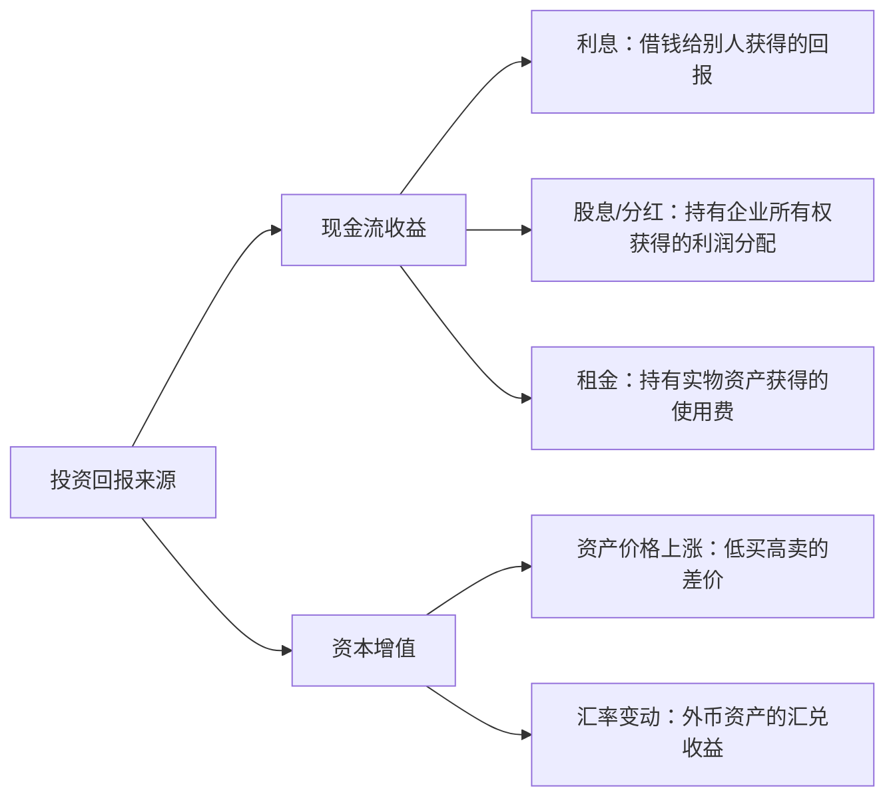
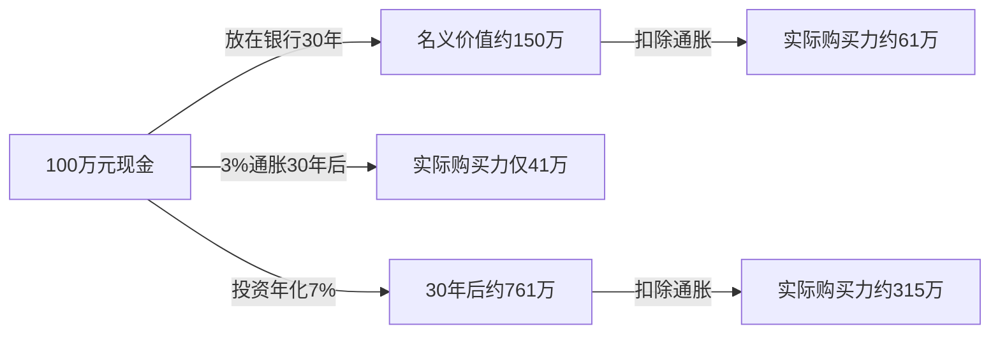
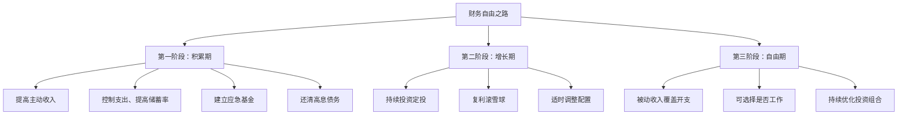
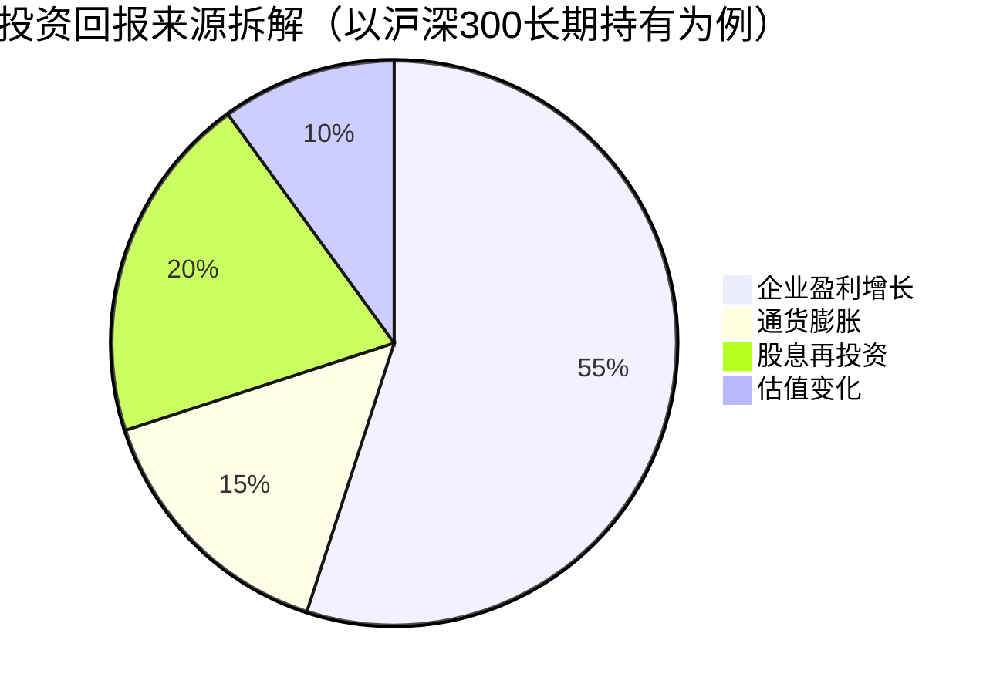
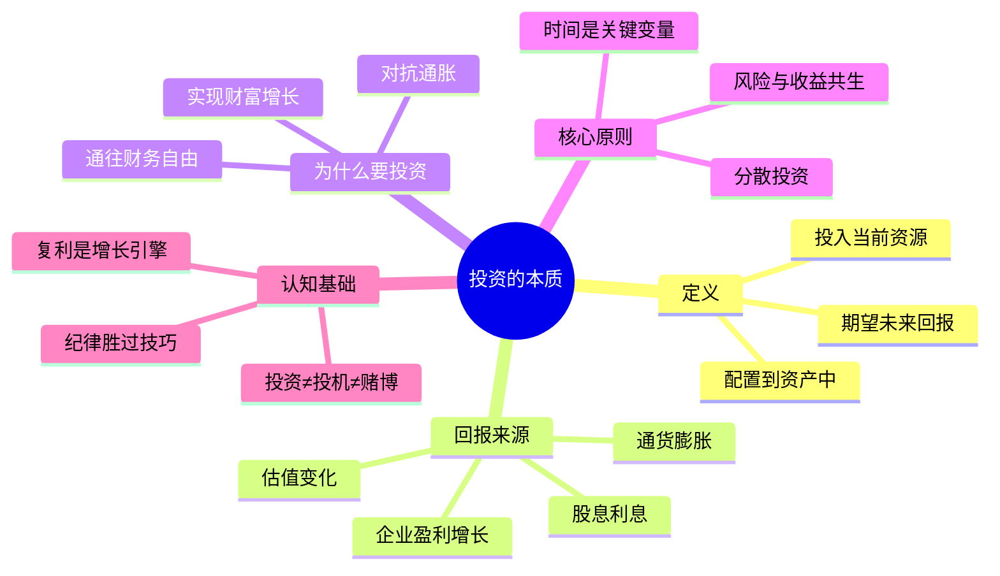

## 5.1 投资的本质

> "投资是经过深入分析，承诺本金安全并获得满意回报的操作。不满足这些要求的就是投机。" —— 本杰明·格雷厄姆《聪明的投资者》

在学习任何具体的投资工具和策略之前，你必须先回答一个最根本的问题：**投资到底是什么？** 这个问题看似简单，但绝大多数人——包括一些投资多年的人——给出的答案都是片面的甚至是错误的。有人说投资就是"买股票赚钱"，有人说投资就是"钱生钱"，有人说投资就是"赌涨跌"。这些回答都只触及了表面。

理解投资的本质，是建立整个投资知识体系的地基。地基歪了，上面盖的楼越高越危险。

---

### 5.1.1 投资的严格定义

**投资的本质，是将当前的资源（主要是资金，也包括时间和精力）配置到某种资产或活动中，期望在未来获得超过原始投入的回报。**

这个定义包含三个核心要素：

| 要素 | 含义 | 关键点 |
|------|------|--------|
| **当前的资源** | 你今天拥有的资金、时间、精力 | 投资意味着"延迟满足"——牺牲今天的消费，换取明天更多 |
| **某种资产或活动** | 投资的对象——股票、债券、房产、教育、创业等 | 资产的种类极其广泛，远不止"买股票" |
| **未来的回报** | 利息、股息、租金、资本增值、能力提升等 | 回报是"期望"的，不是"保证"的——这是投资与存款的本质区别 |

拆开来看，这个定义揭示了几个重要的真相：

**真相一：投资是用"今天的确定性"换"明天的不确定性"。** 你今天有 10 万元现金，这是确定的。你把它买入一只指数基金，10 年后可能变成 20 万，也可能变成 15 万。你用确定的 10 万换取不确定的未来收益，这个行为本身就包含了风险。**没有风险的"投资"不叫投资，叫存款。**

**真相二：投资的对象远比你想象的广泛。** 大多数人一提投资就想到股票和基金，但实际上，投资的核心逻辑渗透在生活的方方面面：

- 你花钱读一个在职研究生学位——这是对"人力资本"的投资
- 你花时间学习一门新技能——这是对"能力"的投资
- 你花钱装修房子出租——这是对"实物资产"的投资
- 你把钱买入国债——这是对"固定收益资产"的投资
- 你买入一家公司的股票——这是对"企业所有权"的投资
- 你花时间经营人脉关系——这是对"社会资本"的投资

所有这些行为都符合投资的定义：**投入当前资源 → 承担不确定性 → 期望未来回报**。

**真相三：投资回报的来源有且只有两种。** 无论投资的对象多么千变万化，回报的底层来源只有两个：



理解这一点极其重要。它能帮你穿透所有投资产品的包装，看到底层逻辑。无论一款理财产品被包装得多么复杂——什么"结构化产品""量化对冲""固收增强"——它的回报来源最终都归结为：要么赚现金流（利息、分红、租金），要么赚价差（低买高卖），或者两者兼有。

---

### 5.1.2 投资与投机、赌博的区别

很多人把投资和投机混为一谈，甚至把投资等同于赌博。这种认知混淆是导致大多数人投资失败的根源之一。我们必须把这三个概念彻底分清。

| 维度 | 投资 | 投机 | 赌博 |
|------|------|------|------|
| **决策依据** | 深入分析基本面（公司盈利、经济趋势、资产价值） | 依赖市场情绪、价格趋势、消息面 | 依赖运气和概率 |
| **持有期限** | 中长期（通常 1 年以上） | 短期（几天到几个月） | 极短期（瞬间到几小时） |
| **预期回报来源** | 资产本身创造的价值（盈利增长、利息收入） | 其他参与者的错误定价或情绪波动 | 对手方的损失 |
| **风险控制** | 分散配置、安全边际、长期持有 | 止损、仓位控制 | 无（输赢靠运气） |
| **数学期望** | 正期望（长期有经济增长支撑） | 不确定（取决于技巧和时机） | 负期望（庄家抽水） |
| **典型行为** | 每月定投沪深 300 指数基金 | 根据 K 线图短线买卖个股 | 借钱炒期货、加杠杆追涨杀跌 |

**格雷厄姆的定义至今仍是金标准**：投资必须满足三个条件——(1) 经过深入分析，(2) 本金相对安全，(3) 获得满意的回报。不满足这些条件的，就是投机。

这里要特别说明：**投机不等于坏事。** 投机是金融市场的重要组成部分，提供了流动性和价格发现功能。职业交易员、量化基金、做市商都是投机者，但他们有专业能力、风险管理系统和资金优势。**问题在于：普通散户把自己当成投资者，实际上却在做投机者的事情——没有分析能力，没有风控系统，没有资金优势，却频繁短线交易。** 这就好比一个业余游泳爱好者去参加奥运会自由泳比赛，结果可想而知。

**赌博的本质特征是"负期望值"。** 赌场的每一种游戏，从轮盘赌到老虎机，庄家都有概率优势。长期来看，赌客必然亏损。投资的本质特征是"正期望值"——因为全球经济长期是增长的，持有优质资产长期必然获得正回报。这正是投资与赌博的根本分水岭。

一个简单的自我检测方法：**如果你的"投资"行为需要依赖"下一个人用更高价格接盘"才能赚钱，那你就不是在投资，而是在投机甚至赌博。** 这在经济学中被称为"博傻理论"（Greater Fool Theory）——你买入不是因为它值这个价，而是因为你相信会有更大的傻瓜用更高的价格从你手里买走。

---

### 5.1.3 为什么要投资：对抗通货膨胀

理解了投资的定义之后，下一个问题是：**我为什么一定要投资？把钱放在银行里不行吗？**

答案是：不行。原因是通货膨胀。

**通货膨胀是货币购买力持续下降的经济现象。** 简单说，就是物价在涨，钱在"变毛"。你今天 100 元能买到的东西，明年可能需要 103 元才能买到。

中国的 CPI（居民消费价格指数）长期年均涨幅约为 2-3%，但这个数字是被低估的。房价、教育、医疗等大项支出的涨幅远高于 CPI。如果用更贴近生活的指标来衡量，实际的购买力下降速度约为每年 4-6%。

**通货膨胀对现金的侵蚀效果是惊人的：**

| 持有年数 | 100元的实际购买力（按3%通胀） | 100元的实际购买力（按5%通胀） |
|----------|-------------------------------|-------------------------------|
| 0年 | 100元 | 100元 |
| 5年 | 86元 | 78元 |
| 10年 | 74元 | 61元 |
| 20年 | 55元 | 38元 |
| 30年 | 41元 | 23元 |

换句话说，如果你今天把 100 万元现金放在家里什么都不做，按 3% 的通胀率计算，30 年后它的实际购买力只剩 41 万——你"安全"地失去了 59 万的购买力。

**这就是为什么"不投资"本身就是一种隐性亏损。** 你以为自己在"保本"，实际上你的本金每天都在缩水。活期存款利率约 0.2%，定期存款利率约 1.5-2.5%，都远低于真实的通货膨胀率。把全部身家放在银行里，本质上是在"确定性地亏钱"。



这个图表清楚地说明了一个事实：**投资的目的不是"赚大钱"，而是"不让钱贬值"。** 即使是保守的投资（年化 5-6%），只要能跑赢通胀，就已经在保护你的财富了。

---

### 5.1.4 为什么要投资：实现财富增长

对抗通胀只是投资的"防守"功能——保住你已有的购买力。投资的"进攻"功能是**实现财富的真正增长**。

财富增长的核心引擎是**复利效应**。复利是指利息产生利息，即"利滚利"。爱因斯坦（据传）曾说："复利是世界第八大奇迹。理解它的人赚取它，不理解的人付出它。"

复利的数学公式非常简单：

```text
终值 = 本金 × (1 + 收益率)^时间
```

但这个简单公式的威力是惊人的。以下是一组对比数据，展示了不同收益率下 10 万元本金的增长轨迹：

| 年化收益率 | 10年 | 20年 | 30年 | 40年 |
|-----------|------|------|------|------|
| 3%（银行定期） | 13.4万 | 18.1万 | 24.3万 | 32.6万 |
| 5%（债券基金） | 16.3万 | 26.5万 | 43.2万 | 70.4万 |
| 8%（指数基金） | 21.6万 | 46.6万 | 100.6万 | 217.2万 |
| 10%（股票基金） | 25.9万 | 67.3万 | 174.5万 | 452.6万 |

**关键洞察：**

1. **时间是复利最大的盟友。** 同样 8% 的年化收益，10 年翻 2.2 倍，20 年翻 4.7 倍，30 年翻 10 倍，40 年翻 21.7 倍。时间越长，复利的加速效应越明显。这就是为什么投资要"尽早开始"。

2. **收益率的小幅提升，长期效果巨大。** 10 万元本金，30 年期：收益率从 3% 提升到 8%（只多了 5 个百分点），终值从 24.3 万变成 100.6 万——差了 4 倍多。

3. **前期增长慢，后期增长快。** 10 万元按 8% 年化：前 10 年只增长了 11.6 万，但第 20-30 年增长了 54 万。这就是复利的"滚雪球效应"——前期需要耐心等待，后期才会爆发式增长。

**复利的前提条件是"不中断"。** 每一次中断投资（恐慌卖出、频繁交易、提前消费），都会打断复利的累积过程，让你从"指数增长"退回"线性增长"甚至"归零重来"。这就是为什么投资纪律如此重要。

关于复利的更多数学细节和实际应用，请参阅本章 5.3 节"复利的力量"。

---

### 5.1.5 为什么要投资：通往财务自由

投资的终极目标，对大多数人而言，是实现**财务自由**。

**财务自由的定义：你的被动收入（不需要工作就能获得的收入）足以覆盖你的生活开支。** 这意味着你不必为了生存而工作——你可以选择继续工作（因为你热爱它），也可以选择不工作（去做其他想做的事）。

财务自由的核心公式：

```text
财务自由 = 被动收入 ≥ 生活开支

被动收入的来源：
- 投资收益（股息、利息、基金分红）
- 租金收入（房产出租）
- 版税/专利收入（知识产权）
- 经营利润（不需亲自管理的生意）
```

**财务自由的计算方法——4% 法则：**

这是一个源自美国"三一研究"（Trinity Study）的经验法则：如果你的投资组合每年提取不超过 4%，在大多数情况下，你的本金可以支撑 30 年以上不枯竭。

```text
所需投资本金 = 年生活开支 ÷ 4% = 年生活开支 × 25

例如：
- 每月开支 1 万元 → 年开支 12 万 → 需要 300 万投资本金
- 每月开支 2 万元 → 年开支 24 万 → 需要 600 万投资本金
- 每月开支 3 万元 → 年开支 36 万 → 需要 900 万投资本金
```

4% 法则的假设条件：
- 投资组合为 60% 股票 + 40% 债券
- 每年通胀调整提取金额
- 投资期限 30 年以上

对于中国市场，考虑到 A 股波动较大、无风险利率较低等因素，更保守的做法是将提取率调整为 3%，即需要年生活开支 × 33 的投资本金。

**实现财务自由的路径：**



**一个重要提醒：财务自由不等于"有很多钱"。** 一个年消费 50 万的人需要 1250-1650 万才能财务自由，而一个年消费 12 万的人只需要 300-400 万。**降低欲望和提高收入同样重要。** 很多人在追求财务自由的路上，不断升级消费水平——收入涨了就换更大的房子、更好的车——结果被动收入永远追不上膨胀的开支。这就是所谓的"享乐跑步机"（Hedonic Treadmill）陷阱。

---

### 5.1.6 投资回报的四大来源

理解了"为什么要投资"之后，我们来深入拆解投资回报的来源。任何一笔投资的回报，都可以归结为以下四种来源的组合：

**来源一：经济增长带来的企业盈利增长**

这是最根本的回报来源。全球经济在过去 100 年里长期保持正增长，年均实际 GDP 增长约 3%。企业是经济的基本单元，经济增长意味着企业整体盈利在增长，股票的内在价值随之上升。

中国名义 GDP 年均增速约 8-10%（实际增速约 5-6%，加上通胀 2-3%），这意味着中国的优质企业整体盈利也在以类似速度增长。你买入宽基指数基金（如沪深 300），实际上就是持有了中国最优秀的 300 家上市公司的一部分所有权，分享它们的盈利增长。

**来源二：通货膨胀推高资产名义价格**

通胀对现金持有者是"敌人"，但对资产持有者是"朋友"。当物价普遍上涨时，企业的收入和利润也会以名义值增长，推动股价上涨；房产的名义价格也会上涨。这就是为什么适度的通胀环境下，股票和房产是比现金更好的选择。

**来源三：股息和利息等现金流回报**

即使资产价格不涨，持有期间获得的现金流也是实实在在的回报。A 股上市公司整体的股息率约为 2-3%，银行理财和债券的利息收入更为稳定。长期来看，股息再投资对总回报的贡献非常可观——标普 500 指数过去 50 年的总回报中，约 40% 来自股息再投资。

**来源四：估值变化（市场情绪波动）**

短期内，股价的涨跌主要由市场情绪驱动——乐观时涨，悲观时跌。这部分回报是**不可预测的**，也是**零和博弈**的（你赚的是别人亏的）。长期来看，估值会回归均值，情绪的影响会被时间稀释。



**关键启示：前三项是"正和博弈"——所有长期投资者都能从中获益；第四项是"零和博弈"——只有比别人更聪明或更幸运才能获益。** 这就是为什么长期持有优质资产（赚前三项）比短线交易（试图赚第四项）更适合普通投资者。

---

### 5.1.7 投资的三个核心原则

在进入具体的投资工具和策略之前，请牢牢记住以下三个原则。它们是投资世界的"牛顿定律"，违背它们就会付出代价。

**原则一：风险与收益共生——天下没有免费的午餐**

金融学的第一定律：**高收益必然伴随高风险，没有例外。**

任何承诺"高收益、零风险"的产品，要么是骗局，要么是你还没看到风险在哪里。2018 年 P2P 平台集中爆雷，数百万投资者血本无归——那些平台承诺的年化收益是 10-15%，而同期银行理财只有 4-5%。多出来的收益从哪里来？从投资者承担的信用风险中来——当借款人违约时，风险就变成了真实的亏损。

更隐蔽的案例是"刚性兑付"——银行理财、信托产品长期承诺"保本保收益"。这看似消除了风险，实际上只是把风险隐藏了起来。当底层资产出问题时（如 2022 年部分银行理财破净），投资者才发现"保本"只是幻觉。

关于风险与收益的详细分析，请参阅本章 5.2 节。

**原则二：时间是投资最重要的变量——尽早开始，耐心持有**

复利的威力需要时间来释放。以下对比说明了"早开始"的巨大优势：

| 情况 | 开始年龄 | 每月投入 | 年化收益 | 60岁时总资产 | 其中本金 |
|------|----------|----------|----------|-------------|----------|
| 小张 | 25岁 | 2000元 | 8% | 约700万 | 84万 |
| 小李 | 35岁 | 2000元 | 8% | 约300万 | 60万 |

小张只比小李早开始 10 年，每月投入金额相同，但到 60 岁时总资产多出 400 万——其中大部分是复利贡献的。**时间是无法弥补的资源。你永远不可能回到 25 岁开始投资，但你今天就是你余生中最早的一天。**

耐心持有同样重要。沪深 300 指数自 2005 年至 2024 年的 20 年间，经历了 2008 年暴跌 65%、2015 年暴跌 47%、2018 年下跌 25%、2022 年下跌 22% 等多次大幅下跌，但任何连续持有 10 年以上的投资者，最终都获得了正收益。

**原则三：分散投资是唯一的"免费午餐"**

诺贝尔经济学奖得主马科维茨（Harry Markowitz）证明了一个深刻的结论：**通过合理配置相关性低的资产，可以在不降低预期收益的情况下降低整体风险。** 这是投资领域中唯一真正的"免费午餐"。

分散投资的层次：
- **资产类别分散**：同时持有股票、债券、现金、黄金等不同类型的资产
- **地域分散**：同时投资中国、美国、欧洲等不同市场的资产
- **行业分散**：在股票中覆盖科技、消费、金融、医药等不同行业
- **时间分散**：通过定投将买入时间分散到不同月份

关于资产配置的详细理论和实操，请参阅本章 5.4 节。

---

### 5.1.8 投资者的常见认知误区

在建立正确的投资认知之前，先清除几个根深蒂固的错误观念。

**误区一："投资是有钱人的事，我没钱投不了"**

事实：投资的门槛远比你想象的低。货币基金 1 元起投，指数基金 10 元起投，很多券商开户免费。更重要的是，**投资的本质是"让钱工作"，与钱的多少无关**。每月定投 500 元，按 8% 年化收益，30 年后变成约 75 万。金额不大，但复利的力量是真实的。

**误区二："投资就是炒股，风险太大"**

事实："炒股"和"投资"是两回事。"炒股"是短线买卖个股，试图预测股价涨跌——这确实是高风险的投机行为。"投资"是通过分析，将资金配置到优质资产中长期持有——风险可控，回报可期。通过指数基金持有整个市场，你的风险比任何单只股票都低得多。

**误区三："等我学够了再开始投资"**

事实：投资是一门"做中学"的技能，不可能只靠读书学会。更重要的是，**等待的成本是巨大的**——你每等待一年，就损失了一年的复利累积。正确的做法是：先用小金额（比如每月 500 元）开始定投指数基金，边投边学，逐步积累经验和信心。

**误区四："过去涨得好，以后也会涨得好"**

事实：这是最危险的认知偏差之一，叫做"近因效应"。2020 年白酒基金涨了 80%，很多人在 2021 年初冲进去买入，结果 2021 年跌了 20%。过去的表现不能预测未来——这不是一句空话，而是无数投资者用真金白银验证过的教训。选择投资标的时，要看估值、看基本面、看长期逻辑，而不是看过去的涨幅。

**误区五："分散投资太保守，集中投资才能赚大钱"**

事实：集中投资确实可能赚大钱——但也可能亏大钱。2021 年重仓教育股的投资者，在"双减"政策出台后亏损超过 90%。**分散投资不是"保守"，而是"理性"。** 它放弃了"暴富"的可能，但也排除了"归零"的风险。对于绝大多数非专业投资者，分散投资是唯一正确的选择。

---

### 5.1.9 投资的本质：一张全景图

让我们把本节的核心内容整合为一张全景图，帮助你建立完整的认知框架：



---

### 5.1.10 自测清单：你是否真正理解了投资的本质？

在进入下一节之前，用以下问题检验自己的理解。如果你不能自信地回答每一个问题，建议重新阅读相关部分。

| 序号 | 问题 | 期望答案 |
|------|------|----------|
| 1 | 投资和投机的核心区别是什么？ | 投资基于深入分析、追求本金安全和满意回报；投机依赖市场情绪和价格波动 |
| 2 | 100 万元现金放 30 年不动，按 3% 通胀会损失多少购买力？ | 约 59 万，实际购买力只剩约 41 万 |
| 3 | 复利终值公式是什么？三个关键变量是什么？ | 终值=本金×(1+收益率)^时间；变量为本金、收益率、时间 |
| 4 | 4% 法则的含义是什么？月开支 1.5 万需要多少本金实现财务自由？ | 每年提取不超过 4% 可支撑 30 年以上；需要 1.5×12×25=450 万 |
| 5 | 投资回报的四大来源是什么？哪个是"零和博弈"？ | 经济增长、通胀、股息利息、估值变化；估值变化是零和博弈 |
| 6 | 为什么说分散投资是"免费午餐"？ | 马科维茨证明：配置相关性低的资产可在不降收益的前提下降低风险 |
| 7 | "等学够了再开始投资"为什么是错误的？ | 等待损失复利累积，投资是"做中学"的技能，应小金额先行 |

---

### 本节小结

本节的核心信息可以用三句话概括：

1. **投资是用今天的确定性换明天的不确定性**，目的是让财富在通胀侵蚀下保值增值，最终实现财务自由。
2. **投资的回报来源是经济长期增长和企业盈利**，不是零和博弈的价差游戏——这是投资与投机/赌博的根本区别。
3. **尽早开始、耐心持有、分散配置**是投资的三大核心原则，它们的共同作用力就是复利效应——时间越长，威力越大。

带着这些认知基础，我们进入下一节——理解风险与收益这对"孪生兄弟"的关系。
