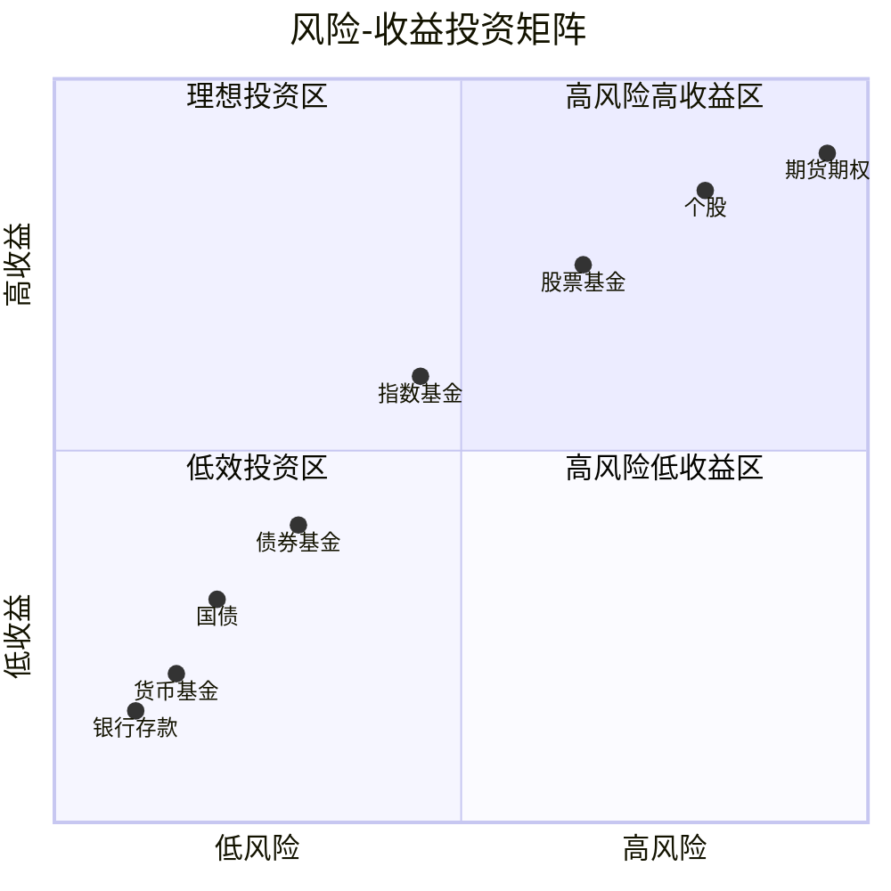
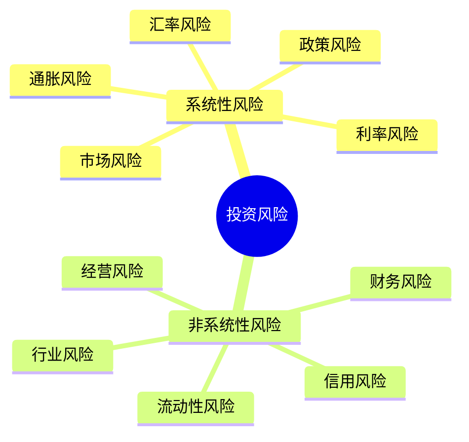
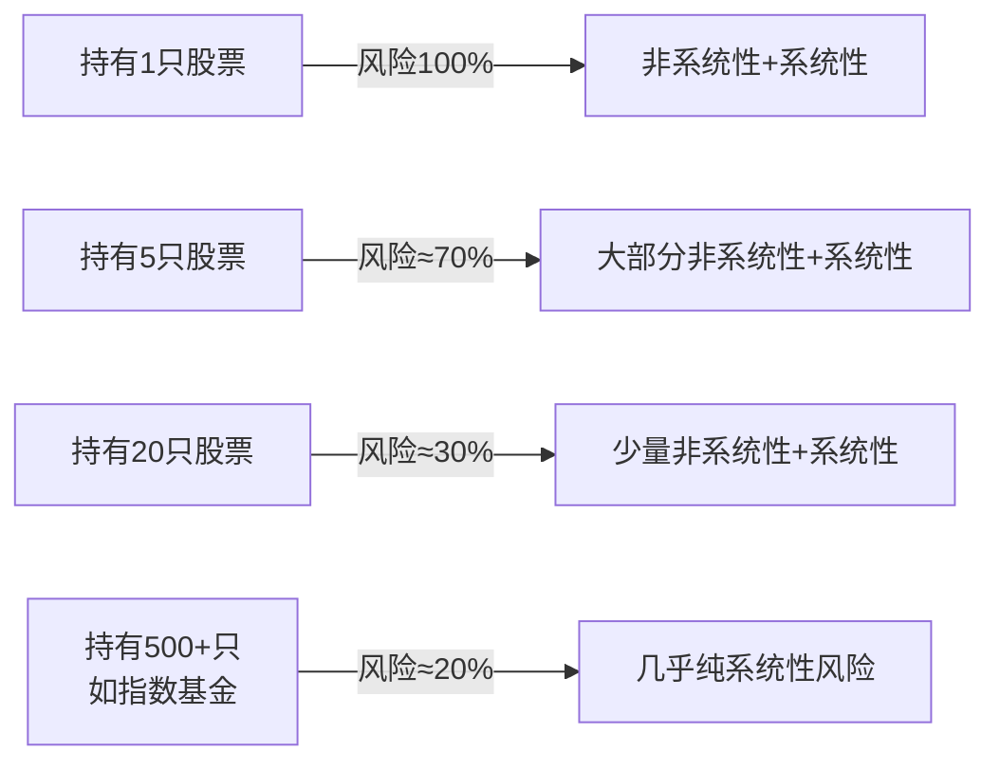
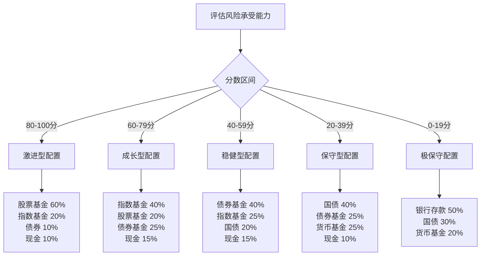

## 5.2 风险与收益

> "风险来自于你不知道自己在做什么。" —— 沃伦·巴菲特

投资世界有一条铁律：**天下没有免费的午餐**。你想要更高的回报，就必须承担更大的风险。这不是某个人的观点，而是金融市场几百年运行中反复验证的客观规律——风险与收益之间存在系统性的正相关关系。理解这条规律，是每一个投资者从"凭感觉赌"走向"理性决策"的第一步。

---

### 5.2.1 风险与收益的基本关系

#### 什么是收益？

收益是你投资获得的回报，通常用**年化收益率**来衡量。收益的来源有三种：

| 收益来源 | 含义 | 典型例子 |
|----------|------|----------|
| **利息收入** | 借出资金获得的固定回报 | 银行存款利息、债券票息 |
| **股息收入** | 持有股份获得的利润分配 | 股票分红、基金分红 |
| **资本利得** | 资产价格上涨带来的差价 | 低买高卖股票、房产增值 |

三种收益来源可以同时存在。比如你持有一只股票，既可能收到分红（股息收入），股价上涨后卖出还能赚差价（资本利得）。

#### 什么是风险？

风险不是"亏钱"——那是风险的结果。**风险的本质是不确定性**，即实际收益偏离预期收益的可能性。这种偏离可能是好的（实际收益高于预期），也可能是坏的（实际收益低于预期）。但在投资领域，我们更关注下行风险——亏损的可能性和幅度。

风险有两个关键维度：

| 维度 | 含义 | 衡量方式 |
|------|------|----------|
| **波动性** | 收益率上下波动的剧烈程度 | 标准差（Standard Deviation） |
| **最大亏损幅度** | 极端情况下可能遭受的最大损失 | 最大回撤（Maximum Drawdown） |

举个例子：两只基金年化收益都是10%，但A基金每月波动2%，B基金每月波动8%。虽然"平均赚的一样多"，但持有B基金的体验要痛苦得多——你可能连续3个月亏损20%然后才反弹。这就是波动性的实际含义。

#### 核心法则：风险-收益正相关



> **数据支撑**：根据晨星（Morningstar）2023年全球基金数据，过去20年全球股票型基金年化回报约8.2%，债券型基金约3.5%，货币基金约1.8%。但股票型基金的最大回撤可达-50%以上，债券型基金最大回撤约-15%，体现了风险与收益的正相关关系。

**各种投资工具的风险-收益对比**：

| 投资工具 | 预期年化收益 | 风险等级 | 波动性（年化标准差） | 最大历史回撤 | 适合持有期限 |
|----------|-------------|----------|---------------------|-------------|-------------|
| 银行存款 | 1-2% | 极低 | ≈0% | 0%（保本） | 随时 |
| 货币基金 | 2-3% | 极低 | ≈0.5% | ≈0% | 随时 |
| 国债 | 2-4% | 低 | 3-5% | ≈-5% | 1年以上 |
| 债券基金 | 3-6% | 中低 | 3-8% | ≈-15% | 1-3年 |
| 指数基金 | 6-10% | 中 | 15-20% | ≈-55% | 3-5年 |
| 股票基金 | 8-15% | 中高 | 20-30% | ≈-60% | 5年以上 |
| 个股 | 不确定 | 高 | 30-60% | -100%（退市） | 不确定 |
| 期货/期权 | 不确定 | 极高 | 50%+ | 可超过本金 | 极短期 |

**关键洞察**：注意"不确定"三个字。个股和衍生品的收益分布是高度偏斜的——少数人暴赚，多数人亏损。这与指数基金"大概率获得市场平均回报"的特征完全不同。选择投资工具时，不仅要看"能赚多少"，更要看"亏损的概率和幅度"。

#### 为什么高风险不一定带来高收益？

这是很多人对"高风险高收益"的误解。准确的表述应该是：**高风险资产在长期中倾向于提供更高的平均回报，但这不意味着每一笔高风险投资都能赚钱。**

风险溢价（Risk Premium）的概念解释了这一点：投资者承担额外风险，要求获得额外补偿。市场通过价格机制自动完成这个过程——风险越高的资产，价格越低（因为没人愿意买），从而隐含的预期回报越高。但"预期回报"是概率加权的平均值，不等于"实际回报"。

用一个简单的例子说明：假设有一个投资机会，50%概率赚100%，50%概率亏50%。预期收益是 `0.5×100% + 0.5×(-50%) = 25%`——看起来很好。但如果你连投4次全部亏损（概率6.25%），你的本金会从100变成6.25。高风险意味着结果的分布极度分散，而人类心理对亏损的厌恶远大于对盈利的欣喜（这就是损失厌恶，详见5.6投资的心理学）。

---

### 5.2.2 风险的系统分类

理解风险的类型，是管理风险的前提。风险可以按"能否被分散"分为两大类：



#### 系统性风险（不可分散风险）

系统性风险是影响整个市场或大部分资产的风险，**无法通过增加持有资产的数量来消除**。它是所有投资者共同面对的"大盘风险"。

| 类型 | 来源 | 影响机制 | 典型案例 |
|------|------|----------|----------|
| **市场风险** | 整体市场情绪和估值变化 | 所有股票同涨同跌 | 2008年金融危机，全球股市暴跌40-60% |
| **利率风险** | 央行调整基准利率 | 利率上升→债券价格下跌→股票估值承压 | 2022年美联储加息，全球资产价格下跌 |
| **通胀风险** | 物价持续上涨 | 货币购买力下降，固定收益资产实际回报为负 | 2021-2023年全球高通胀，实际利率为负 |
| **汇率风险** | 本币对外币贬值/升值 | 影响海外资产的本币计价价值 | 人民币贬值时，海外投资换算回来赚更多 |
| **政策风险** | 政府法规、税收、监管变化 | 改变特定行业或整体市场的盈利环境 | 教育"双减"政策对教培行业的冲击 |
| **地缘政治风险** | 战争、贸易摩擦、制裁 | 破坏供应链、影响市场信心 | 俄乌冲突导致能源价格剧烈波动 |

**系统性风险为什么不能被分散？** 因为它的影响是全局性的。当整个市场下跌时，不管你是买A股还是B股，买消费还是科技，都难以幸免。这就像涨潮和退潮——潮水退去时，所有船都会降低。

**应对策略**：系统性风险不能被消除，但可以被管理：
- **资产配置**：在股票、债券、现金、黄金等不同大类资产之间分散，因为它们对系统性风险的敏感度不同
- **时间分散**：通过定投（定期定额投资）在不同时间点买入，平滑入场成本
- **对冲**：使用衍生品（如期权）或反向资产（如黄金在危机时往往上涨）来对冲

#### 非系统性风险（可分散风险）

非系统性风险是影响个别公司、个别行业或个别地区的风险，**可以通过持有多样化的资产来降低甚至消除**。

| 类型 | 来源 | 影响机制 | 典型案例 |
|------|------|----------|----------|
| **经营风险** | 公司管理不善、战略失误 | 盈利下降、股价下跌 | 柯达错失数码相机转型机会而破产 |
| **财务风险** | 过度负债、现金流断裂 | 无法偿还债务、被迫重组 | 恒大地产因高杠杆陷入债务危机 |
| **行业风险** | 行业周期、技术替代 | 整个行业景气度下降 | 新能源汽车对传统燃油车行业的冲击 |
| **信用风险** | 债务人违约 | 债券本金或利息无法收回 | 企业债违约、P2P爆雷 |
| **流动性风险** | 资产无法快速变现 | 需要大幅折价才能卖出 | 小盘股在熊市中可能连续跌停无法卖出 |

**分散投资消除非系统性风险的数学原理**：研究表明，持有20-30只相关性较低的股票，可以消除约80-90%的非系统性风险。这就是为什么指数基金（持有几百甚至几千只股票）几乎完全消除了非系统性风险，投资者只承担系统性风险。



> **实践意义**：如果你只买了一两只股票，你同时承担着系统性风险和非系统性风险。但如果你买的是宽基指数基金，你几乎只承担系统性风险。后者可以通过资产配置来管理，前者则可能因为一只股票暴雷而损失惨重。

#### 其他重要风险类型

除了上述两大分类，还有几种风险值得特别关注：

**购买力风险（通胀侵蚀风险）**：表面安全的资产可能在扣除通胀后实际亏损。银行存款利率2%，通胀3%，你的实际购买力每年下降1%。持有现金不是"没有风险"，而是一种隐蔽的风险——你的钱在慢慢变"毛"。

**再投资风险**：当你持有的债券到期或被提前赎回时，你可能无法找到同等收益率的替代投资。在利率下行周期中，这个问题尤为突出——锁定长期高利率的债券变得越来越稀缺。

**行为风险**：投资者自身的行为导致的亏损。追涨杀跌、频繁交易、过度自信、从众心理——这些"自己给自己制造的风险"可能是所有风险中最常见也最致命的。详见5.6投资的心理学。

---

### 5.2.3 风险的量化工具

光知道"有风险"是不够的，你需要量化风险的大小，才能做出理性的投资决策。以下是金融学中最常用的风险衡量指标：

#### 标准差（Standard Deviation）

标准差衡量收益率围绕平均值波动的幅度，是最基础的风险指标。

```text
含义解读：
- 标准差 = 15%，表示年收益率大约有68%的时间落在"平均收益±15%"的范围内
- 标准差越大，波动越剧烈，不确定性越高

示例：
- 货币基金：标准差≈0.5% → 收益非常稳定
- 沪深300指数：标准差≈22% → 收益波动大
- 个股：标准差≈40-60% → 收益极度不确定
```

**局限性**：标准差把上行波动和下行波动同等对待。一只基金大涨时也会产生"高波动"，但这对投资者是好事。因此，标准差高不一定代表风险大——它只代表不确定性大。

#### Beta系数（β）

Beta衡量一只资产相对于市场整体的波动敏感度。

| Beta值 | 含义 | 市场涨10%时该资产预期涨跌 |
|--------|------|--------------------------|
| β = 0 | 与市场无关 | 涨跌不受市场影响 |
| β = 0.5 | 波动是市场的一半 | 预期涨5% |
| β = 1.0 | 与市场同步 | 预期涨10% |
| β = 1.5 | 波动是市场的1.5倍 | 预期涨15% |
| β < 0 | 与市场反向 | 预期跌（如黄金在危机时常如此） |

**Beta的计算公式**：

```text
β = Cov(Ri, Rm) / Var(Rm)

其中：
Ri = 该资产的收益率
Rm = 市场组合的收益率
Cov = 协方差
Var = 方差
```

**实践应用**：如果你持有的股票Beta=1.5，意味着市场下跌10%时，它可能下跌15%。在牛市中Beta高是好事（放大收益），但在熊市中就是灾难（放大亏损）。保守型投资者应选择低Beta资产。

#### 夏普比率（Sharpe Ratio）

夏普比率是最实用的风险调整收益指标，由诺贝尔经济学奖得主威廉·夏普（William Sharpe）提出。它回答的核心问题是：**每承担一单位风险，能获得多少超额回报？**

```text
夏普比率 = (投资收益率 - 无风险利率) / 投资收益率的标准差

示例：
- 基金A：年化收益12%，标准差15%，无风险利率3%
  夏普比率 = (12% - 3%) / 15% = 0.60

- 基金B：年化收益8%，标准差6%，无风险利率3%
  夏普比率 = (8% - 3%) / 6% = 0.83
```

在这个例子中，基金B的绝对收益虽然低于基金A，但夏普比率更高——说明它每承担一单位风险获得的回报更多。**夏普比率越高，风险调整后的表现越好。**

**夏普比率的参考标准**：

| 夏普比率 | 评价 |
|----------|------|
| < 0.5 | 较差，风险调整回报低 |
| 0.5 - 1.0 | 一般，风险调整回报尚可 |
| 1.0 - 2.0 | 优秀，风险调整回报好 |
| > 2.0 | 卓越，持续超过2.0非常罕见 |

#### 最大回撤（Maximum Drawdown）

最大回撤衡量从历史最高点到最低点的最大亏损幅度，是衡量"最坏情况"的直观指标。

```text
最大回撤 = (历史最高净值 - 最低净值) / 历史最高净值 × 100%

示例：
某基金净值从2.0涨到3.0，然后跌到1.5，再涨到3.5
最大回撤 = (3.0 - 1.5) / 3.0 = 50%
```

**为什么最大回撤很重要？** 因为它告诉你"在最坏的情况下你会亏多少"。很多人在牛市中觉得自己能承受高风险，但当真金白银亏了50%时，才发现自己根本扛不住。了解历史最大回撤，可以帮助你提前评估自己是否能承受这种痛苦。

**回撤恢复的数学现实**：

| 亏损幅度 | 需要多少涨幅才能回本 |
|----------|---------------------|
| -10% | +11.1% |
| -20% | +25.0% |
| -30% | +42.9% |
| -50% | +100.0% |
| -70% | +233.3% |

亏损50%需要翻倍才能回本，亏损70%需要涨233%。这就是为什么控制回撤比追求高收益更重要——**亏损的修复成本是指数级增长的**。

#### 综合运用：如何选择基金

在实际选择投资产品时，不要只看收益率，要综合运用以上指标：

| 指标 | 权重建议 | 判断标准 |
|------|----------|----------|
| 夏普比率 | ★★★★★ | 越高越好，>1.0为佳 |
| 最大回撤 | ★★★★☆ | 是否在你能承受的范围内 |
| 年化收益率 | ★★★☆☆ | 同类基金中排名前1/3 |
| 标准差 | ★★★☆☆ | 同类基金中偏低为佳 |
| Beta | ★★☆☆☆ | 根据你的风险偏好选择 |

---

### 5.2.4 风险承受能力评估

在选择投资策略之前，你必须先了解自己能承受多大的风险。风险承受能力不是主观的"我觉得我能扛"，而是由客观条件决定的。

#### 影响风险承受能力的六大因素

| 因素 | 高承受能力 | 低承受能力 | 权重 |
|------|------------|------------|------|
| **年龄** | 年轻（20-35岁），有时间弥补亏损 | 年长（55岁以上），接近用钱时间 | ★★★★★ |
| **收入稳定性** | 高且稳定的工资收入（如公务员、大企业员工） | 低或不稳定（如自由职业、创业初期） | ★★★★☆ |
| **负债水平** | 低负债，月供占收入比<30% | 高负债，月供占收入比>50% | ★★★★☆ |
| **家庭状况** | 无子女或已成年，配偶有收入 | 有未成年子女，单收入家庭 | ★★★☆☆ |
| **投资期限** | 长期（5年以上不需要动用） | 短期（1-2年内要用） | ★★★★★ |
| **心理承受力** | 能接受账户短期浮亏30%+ | 看到亏损就焦虑失眠 | ★★★☆☆ |

#### 风险承受能力自测评分

用以下评分表量化你的风险承受能力（满分100分）：

```text
年龄评分（满分25分）：
  25岁以下 → 25分
  25-35岁  → 22分
  35-45岁  → 18分
  45-55岁  → 12分
  55-65岁  → 6分
  65岁以上 → 2分

收入稳定性评分（满分20分）：
  公务员/事业单位/大型国企      → 20分
  大型私企/外企，工作5年以上    → 16分
  中小企业，工作稳定           → 12分
  自由职业/创业，收入波动      → 6分
  无固定收入                   → 2分

负债评分（满分20分）：
  无负债或负债/资产<20%        → 20分
  负债/资产 20%-40%            → 14分
  负债/资产 40%-60%            → 8分
  负债/资产 >60%               → 3分

投资期限评分（满分20分）：
  10年以上    → 20分
  5-10年      → 16分
  3-5年       → 10分
  1-3年       → 5分
  1年以内     → 1分

心理承受力评分（满分15分）：
  "亏损30%我也能安心持有"     → 15分
  "亏损20%我会紧张但能扛"     → 11分
  "亏损10%我就开始焦虑"       → 6分
  "看到任何亏损就睡不着"      → 2分

总分解读：
  80-100分 → 激进型：可配置70%+权益类资产
  60-79分  → 成长型：可配置50-70%权益类资产
  40-59分  → 稳健型：可配置30-50%权益类资产
  20-39分  → 保守型：可配置10-30%权益类资产
  0-19分   → 极保守：以存款和国债为主
```

#### 年龄与风险配置的经验法则

一个广泛使用的经验法则是"**100法则**"：

```text
权益类资产比例上限 ≈ 100 - 年龄

示例：
- 30岁：最多配置70%股票/股票基金
- 50岁：最多配置50%股票/股票基金
- 65岁：最多配置35%股票/股票基金
```

这个法则的逻辑很简单：年轻人有更多时间等待市场回升，即使遭遇熊市也有机会回本；而年长者需要用钱的时间更近，不能承受大幅亏损。

**但要注意**：100法则只是起点，不是定论。如果你收入高、负债低、投资期限长，可以把比例上调到"110-年龄"甚至"120-年龄"。反之，如果你负债高、收入不稳定，应该下调到"80-年龄"。

---

### 5.2.5 风险管理的实操框架

知道了风险是什么、如何量化、自己能承受多少之后，接下来就是如何管理风险。

#### 第一层：资产配置分散

这是最基础也最有效的风险管理手段。不同资产类别在不同经济环境下的表现不同：

| 经济环境 | 股票 | 债券 | 黄金 | 现金 |
|----------|------|------|------|------|
| 经济繁荣 | ↑↑ | → | ↓ | → |
| 经济衰退 | ↓↓ | ↑ | ↑ | → |
| 高通胀 | ↓ | ↓ | ↑↑ | ↓ |
| 低通胀 | ↑ | ↑ | → | → |

通过在不同资产类别间配置，可以在任何经济环境下都有部分资产表现良好，平滑整体波动。

**参考配置方案**：



#### 第二层：时间分散（定投）

定投（定期定额投资）是时间分散的经典实践。无论市场涨跌，你都按固定时间、固定金额买入。

**定投降低风险的数学原理**：

假设每月定投1000元：
- 第1月：净值1.0，买入1000份
- 第2月：净值0.8，买入1250份（低价多买）
- 第3月：净值0.9，买入1111份
- 第4月：净值1.1，买入909份

4个月总投入4000元，持有4270份，平均成本 = 4000/4270 = 0.937元/份。而4个月的平均净值 = (1.0+0.8+0.9+1.1)/4 = 0.95元/份。**定投的平均成本低于市场平均价格**——这就是"微笑曲线"效应。

#### 第三层：定期再平衡

即使你设好了配置比例，随着市场波动，实际比例会偏离目标。比如你设定了60%股票+40%债券，牛市之后可能变成75%股票+25%债券——此时你的风险暴露已经超过了预设水平。

**再平衡操作**：卖出涨多了的资产，买入跌多了的资产，让比例回到目标值。这本质上是一种"高抛低吸"的纪律化操作。

```text
再平衡规则建议：
- 频率：每季度检查一次，或当偏离超过5个百分点时触发
- 方式：优先通过新增资金调整（减少卖出带来的税务成本）
- 纪律：无论市场情绪如何，偏离就调，不犹豫
```

#### 第四层：止损与仓位管理

对于个股投资，止损是控制单笔亏损的重要纪律：

```text
止损规则示例：
- 单只个股亏损超过15-20%时，强制卖出
- 单只个股仓位不超过总资金的10%
- 单个行业暴露不超过总资金的30%
```

**为什么止损很重要？** 因为亏损的修复成本是指数级增长的（见前文回撤恢复表）。及时止损虽然痛苦，但保留了大部分本金，让你有机会在其他投资中赚回来。

---

### 5.2.6 常见误区与纠正

#### 误区一："低风险=没风险"

**现实**：银行存款也面临通胀侵蚀风险。如果通胀率3%而存款利率1.5%，你的实际购买力每年下降1.5%。10年后，你的钱的购买力下降了约14%。"安全"的资产在长期中可能是最"危险"的——因为它确定会让你的财富缩水。

#### 误区二："高风险一定能赚大钱"

**现实**：高风险只是意味着结果的分布范围更广。你可能赚100%，也可能亏80%。期望值为正不等于确定能赚钱。很多散户追求高风险投资，结果是"高风险低收益"甚至"高风险负收益"——因为他们缺乏分析能力和纪律。

#### 误区三："分散投资就是买很多只股票"

**现实**：如果你买了10只银行股，这不叫分散——它们面临几乎相同的行业风险和系统性风险。真正的分散是跨资产类别（股票+债券+现金）、跨行业（消费+科技+医药）、跨地域（A股+港股+美股）的分散。

#### 误区四："过去的收益代表未来的收益"

**现实**：这是投资中最危险的思维。过去3年涨了200%的基金，不代表未来3年还会涨200%。业绩回归均值是金融市场的铁律——过去表现最好的基金，未来往往表现平庸。选择投资产品时，应关注基金经理的投资理念、策略的可持续性、费率等结构性因素，而不是过去的收益率排名。

#### 误区五："我不需要风险管理，我是长期投资"

**现实**：长期投资可以平滑短期波动，但不能消除重大风险。日本日经指数1989年见顶后，30多年后仍未回到高点。如果你在1989年全仓买入并"长期持有"，30年后仍然亏损。长期投资必须配合合理的资产配置和风险管理。

---

### 5.2.7 中国市场特有的风险因素

对于A股投资者，除了上述通用风险外，还需要关注一些中国特色的风险因素：

| 风险因素 | 说明 | 应对策略 |
|----------|------|----------|
| **政策调控风险** | 产业政策变化可能对特定行业产生颠覆性影响 | 不过度集中于政策敏感行业 |
| **退市风险** | A股退市制度趋严，绩差股面临退市 | 避免炒作ST股、壳资源 |
| **流动性分化** | 大盘蓝筹流动性好，小盘股可能面临流动性枯竭 | 优先选择流动性好的标的 |
| **散户主导波动** | A股散户占比高，情绪化交易导致波动加剧 | 逆向思维，不跟风追涨杀跌 |
| **信息披露不完善** | 部分公司财报质量不高，信息不对称严重 | 选择信息透明度高的公司或指数基金 |

---

### 5.2.8 本节核心要点回顾

```text
1. 风险与收益正相关：想要更高回报，必须承担更大风险
2. 风险分为系统性（不可分散）和非系统性（可分散）
3. 用标准差、Beta、夏普比率、最大回撤量化风险
4. 风险承受能力由年龄、收入、负债、期限、心理共同决定
5. 风险管理四层框架：资产配置→时间分散→定期再平衡→止损纪律
6. 常见误区：低风险≠没风险，高风险≠高收益，分散≠买很多只股
7. 中国市场有特殊的政策、退市、流动性风险需要注意
```

> **下一步**：理解了风险与收益的关系之后，你需要了解投资中另一个核心力量——复利。复利是让财富指数级增长的引擎，也是"为什么要尽早开始投资"的数学证明。详见5.3节。
