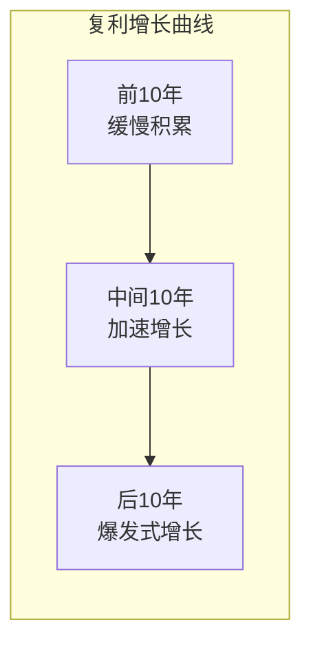

## 5.3 复利的力量

> "Compound interest is the eighth wonder of the world. He who understands it, earns it; he who doesn't, pays it." —— 常被归于爱因斯坦（原始出处存疑，但道理深刻）

上一节你了解了风险与收益的关系——高收益需要承担高风险。但还有一个问题：即使你找到了风险收益比合理的投资，**财富的真正增长靠的是什么？** 答案是复利。复利是投资中最强大的数学力量，也是普通人实现财富积累的核心引擎。

理解复利不需要高等数学，但需要你真正"看见"它的运作方式。本节将从数学原理出发，带你理解复利的三要素、掌握快速估算技巧、学会定投的复利运用，认识现实中的约束因素，并在不同人生阶段灵活应用复利策略。同时，我们也会揭示复利的"黑暗面"——当你成为债务的复利承受者时，同样的数学力量会反过来吞噬你的财富。

---

### 5.3.1 什么是复利

#### 单利 vs 复利的本质区别

单利只对原始本金计算利息，而复利对"本金+已累积利息"一起计算利息——利息也在产生利息。这个看似微小的差异，在时间的放大下会产生天壤之别。

```text
单利：每年只对本金计算利息
复利：每年对本金+累计利息计算利息

示例：100,000元，年利率10%

单利：
- 第1年：100,000 + 10,000 = 110,000
- 第2年：110,000 + 10,000 = 120,000
- 第3年：120,000 + 10,000 = 130,000
- 第10年：200,000
- 第20年：300,000
- 第30年：400,000

复利：
- 第1年：100,000 × 1.10 = 110,000
- 第2年：110,000 × 1.10 = 121,000
- 第3年：121,000 × 1.10 = 133,100
- 第10年：259,374
- 第20年：672,750
- 第30年：1,744,940
```

**30年后的差距**：单利40万 vs 复利174.5万——相差4.36倍。时间越长，差距越大。这就是复利的威力：它不是线性增长，而是指数增长。

下面这张表更直观地展示了单利与复利在不同时间跨度下的差距：

| 年数 | 单利终值 | 复利终值 | 复利/单利倍数 | 复利多赚 |
|------|----------|----------|--------------|----------|
| 5年  | 15.0万   | 16.1万   | 1.07倍       | 1.1万    |
| 10年 | 20.0万   | 25.9万   | 1.30倍       | 5.9万    |
| 20年 | 30.0万   | 67.3万   | 2.24倍       | 37.3万   |
| 30年 | 40.0万   | 174.5万  | 4.36倍       | 134.5万  |
| 40年 | 50.0万   | 452.6万  | 9.05倍       | 402.6万  |

（假设本金10万，年利率10%）

可以看到，前5年差距微乎其微（仅1.1万），但到第40年差距已扩大到402.6万。**这就是为什么很多人在投资初期感受不到复利的威力——复利的效果需要时间来显现，而大多数人缺乏足够的耐心。**

#### 复利的数学公式

```text
复利终值 = 本金 × (1 + 收益率)^时间

FV = PV × (1 + r)^n

其中：
FV = 终值（Future Value）
PV = 本金（Present Value）
r  = 年化收益率
n  = 投资年数
```

这个公式的几何意义是一条指数曲线——前期增长缓慢，后期加速上升。



为了更精确地理解指数增长的本质，我们可以用数学语言描述：复利终值 $FV = PV \times (1+r)^n$ 是关于时间 $n$ 的指数函数。其导数 $FV' = PV \times (1+r)^n \times \ln(1+r)$ 意味着：**增长速度本身也在增长**——这就是"加速增长"的数学含义。

#### 连续复利：理论极限

现实中的复利通常是按年、按季、按月计算的。如果把计息周期无限缩短，就得到**连续复利**（Continuous Compounding）：

```text
连续复利公式：FV = PV × e^(r×n)

其中 e ≈ 2.71828，是自然常数

示例：10万元，年化10%，10年
- 按年复利：10 × 1.10^10 = 25.94万
- 按月复利：10 × (1 + 0.10/12)^120 = 27.07万
- 连续复利：10 × e^(0.10×10) = 27.18万

按月复利比按年复利多1.13万，连续复利比按年复利多1.24万
```

连续复利是理论上的上限，实际中很少直接使用，但它揭示了一个重要规律：**计息频率越高，实际收益越高**。这就是为什么银行存款、货币基金等产品会强调"按日计息""按月复利"——更频繁的计息意味着略高的实际收益率。

| 计息方式 | 年化10%的实际收益率 | 相当于按年复利的等效利率 |
|----------|--------------------|-----------------------|
| 按年计息 | 10.000%            | 10.00%                |
| 按半年计息 | 10.250%          | 10.25%                |
| 按季计息 | 10.381%            | 10.38%                |
| 按月计息 | 10.471%            | 10.47%                |
| 按日计息 | 10.516%            | 10.52%                |
| 连续计息 | 10.517%            | 10.52%                |

#### 复利为什么强大？

复利强大的秘密在于**指数增长的反直觉性**。人类大脑习惯线性思维——"每年赚10%，30年就是赚300%"。但复利不是这样运作的。10%复利30年的总回报是1645%，是线性预期的5.5倍。

这种非线性增长意味着：**时间是复利最重要的盟友**。早开始一年，最终结果的差异可能是惊人的。

为什么人类天生不擅长理解指数增长？认知科学的研究给出了答案：人类大脑进化于线性关系占主导的自然环境（食物的消耗、距离的积累等），对指数增长缺乏直觉。有一个经典的"折纸问题"：一张纸对折42次的厚度可以从地球到达月球——大多数人觉得不可思议，但这在数学上完全成立。复利的"不可思议"与折纸的本质相同：**指数增长在前期看起来平淡无奇，在后期却势不可挡。**

---

### 5.3.2 复利的三要素

复利终值由三个变量决定，每一个都至关重要：

```text
FV = PV × (1 + r)^n

三要素：
1. 本金（PV）：投入多少钱
2. 收益率（r）：每年的回报率
3. 时间（n）：投资多长时间
```

#### 要素一：本金

本金是复利的起点。本金越大，最终结果越大——这是最直观的。

| 本金 | 收益率 | 时间 | 终值 | 增长倍数 |
|------|--------|------|------|----------|
| 5万 | 8% | 30年 | 50.3万 | 10.1倍 |
| 10万 | 8% | 30年 | 100.6万 | 10.1倍 |
| 20万 | 8% | 30年 | 201.2万 | 10.1倍 |
| 50万 | 8% | 30年 | 503.1万 | 10.1倍 |

注意：增长倍数是相同的（都约10倍），但绝对金额差异巨大。本金5万和50万，30年后相差500万。**这就是为什么提高收入、增加储蓄是投资的基础——没有本金，再高的收益率也无济于事。**

本金的积累并非一蹴而就。对于大多数工薪阶层，本金的增长路径是：

```text
本金积累的四个阶段：

1. 储蓄阶段（0→第1桶金）
   - 核心：控制支出，提高储蓄率
   - 目标：积累3-6个月应急资金 + 首笔投资本金
   - 方法：50/30/20法则（50%必要开支，30%弹性消费，20%储蓄投资）

2. 起步阶段（第1桶金→10万）
   - 核心：建立投资习惯，开始定投
   - 时间：通常1-3年
   - 关键：不要等"有钱了再投资"，现在就开始

3. 加速阶段（10万→100万）
   - 核心：收入增长 + 投资收益双重驱动
   - 时间：通常5-10年
   - 转折点：当投资收益首次超过年度储蓄时，财富增长进入快车道

4. 飞轮阶段（100万+）
   - 核心：复利成为主要增长引擎
   - 特征：每年的投资收益可能超过全年工资收入
```

#### 要素二：收益率

收益率的小幅差异，经过长时间复利，会产生巨大的终值差距：

| 本金 | 收益率 | 30年终值 | 相对7%的差额 |
|------|--------|----------|-------------|
| 10万 | 5% | 43.2万 | -57.4万 |
| 10万 | 7% | 76.1万 | 基准 |
| 10万 | 8% | 100.6万 | +24.5万 |
| 10万 | 10% | 174.5万 | +98.4万 |
| 10万 | 12% | 299.6万 | +223.5万 |

从7%到10%，只差3个百分点，但30年终值相差近100万。**这就是为什么投资者愿意花大量时间研究如何提高哪怕1-2个百分点的年化收益——在复利的放大下，微小的差异会被时间放大成巨大的金额。**

但要注意：追求更高收益率通常意味着承担更高风险（5.2节的核心结论）。不要为了多2%的收益而承担自己无法承受的风险。

不同资产类别的长期年化收益率参考（中国及全球市场）：

| 资产类别 | 中国长期参考 | 全球长期参考 | 风险等级 |
|----------|-------------|-------------|----------|
| 银行活期 | 0.2-0.35% | 0.1-0.5% | 极低 |
| 货币基金 | 1.5-3% | 1-3% | 极低 |
| 国债/政金债 | 2.5-4% | 2-4% | 低 |
| 债券基金 | 3-6% | 3-6% | 中低 |
| 沪深300指数 | 8-10% | — | 中高 |
| 标普500指数 | — | 9-11% | 中高 |
| 偏股混合基金 | 10-15% | 8-12% | 高 |
| 房产（含租金） | 5-8% | 3-7% | 中 |

注意：以上为名义收益率，实际收益需扣除通胀（中国近年约2-3%）。收益率越高，波动越大，短期内亏损的可能性也越高——这正是风险与收益的权衡。

#### 要素三：时间

时间是复利三要素中**最容易被忽视但影响最大**的变量。

| 本金 | 收益率 | 投资时间 | 终值 | 增长倍数 |
|------|--------|----------|------|----------|
| 10万 | 8% | 10年 | 21.6万 | 2.2倍 |
| 10万 | 8% | 20年 | 46.6万 | 4.7倍 |
| 10万 | 8% | 30年 | 100.6万 | 10.1倍 |
| 10万 | 8% | 40年 | 217.2万 | 21.7倍 |

**从30年到40年，只多了10年，但终值翻了一倍多。** 而且这额外的106.6万，远远超过前30年的总收益100.6万。这就是指数增长的特征：越到后期，增长越快。

**早投资一年的巨大价值**：

假设你从25岁开始每月定投1000元（年化8%），到60岁退休。如果你晚一年开始（26岁），最终会少多少钱？

```text
25岁开始，投资35年：1000×12×((1.08^35-1)/0.08) ≈ 203.3万
26岁开始，投资34年：1000×12×((1.08^34-1)/0.08) ≈ 187.3万

差额：约16万
```

晚一年开始，最终少16万。而这1年你只是少投了1.2万本金。**1.2万的本金差异，在34年复利后变成了16万的终值差异。** 这就是"时间就是金钱"在投资中的最精确诠释。

如果把"延迟10年"的代价列成表格，冲击力更强：

| 开始年龄 | 定投年限 | 月投1000元终值 | 相比25岁少赚 |
|----------|----------|---------------|-------------|
| 25岁 | 35年 | 203.3万 | — |
| 30岁 | 30年 | 135.9万 | 67.4万 |
| 35岁 | 25年 | 89.4万 | 113.9万 |
| 40岁 | 20年 | 57.3万 | 146.0万 |
| 45岁 | 15年 | 34.6万 | 168.7万 |

（假设年化8%）

每晚5年开始，终值减少约50-70万。**这就是为什么投资界有句话："种一棵树最好的时间是十年前，其次是现在。"**

#### 三要素的敏感性分析

三个要素中，哪个对终值的影响最大？我们用一个简单的实验来回答：

```text
基准：10万本金，8%收益率，30年投资
基准终值：100.6万

测试：每个要素单独提升20%
1. 本金+20%（12万）：终值 = 120.7万（增加20.1万，+20%）
2. 收益率+20%（9.6%）：终值 = 155.6万（增加55.0万，+54.6%）
3. 时间+20%（36年）：终值 = 159.1万（增加58.5万，+58.1%）
```

结论：在长期投资中，**时间和收益率的敏感性远高于本金**。这并不是说本金不重要，而是说——在本金有限的情况下，尽早开始（增加时间）和优化策略（提高收益率）比"攒够钱再投资"更有效。

---

### 5.3.3 72法则与快速估算

#### 72法则

72法则是一个快速计算资金翻倍时间的经验公式：

```text
翻倍时间 ≈ 72 ÷ 年化收益率（%）

例如：
年化收益率 3%：72 ÷ 3 = 24年翻倍
年化收益率 6%：72 ÷ 6 = 12年翻倍
年化收益率 8%：72 ÷ 8 = 9年翻倍
年化收益率 10%：72 ÷ 10 = 7.2年翻倍
年化收益率 12%：72 ÷ 12 = 6年翻倍
```

**72法则的数学来源**：

72法则并非随意选取的数字。在数学上，资金翻倍需要满足 $(1+r)^n = 2$，两边取自然对数得 $n = \ln(2) / \ln(1+r)$。当 $r$ 较小时，$\ln(1+r) \approx r$，所以 $n \approx \ln(2) / r = 0.693 / r$。用百分比表示就是 $n \approx 69.3 / R$（$R$ 为百分比数值）。

为什么用72而不用69.3？因为72有很多因数（2, 3, 4, 6, 8, 9, 12），便于心算。而且在3%-15%的常见收益率范围内，72的精度反而比69.3更高（对偏高的收益率做了修正）。

**72法则的实际应用**：

- **评估投资产品**：某基金声称年化15%，用72法则一算约4.8年翻倍。如果历史数据显示它从未在5年内翻倍过，那这个收益率可能被夸大了。
- **设定目标**：如果你想在10年内让资产翻倍，需要的年化收益率约7.2%（72÷10）。这正好是股票市场的长期平均回报率——说明买指数基金并持有10年，大概率可以翻倍。
- **理解通胀侵蚀**：如果通胀率3%，你的现金购买力约24年减半。也就是说，今天的100元，24年后的购买力只有50元。
- **评估负债成本**：信用卡分期年化利率约15-18%，用72法则可知约4-5年债务翻倍。这就是为什么信用卡债务被称为"财务毒药"。

#### 72法则的变体

```text
72法则的精确度：
- 收益率3%-15%范围内，误差很小（<3%）
- 收益率越接近7.2%（72的自然对数），越精确
- 超出15%时，用"70法则"或"69法则"更准

相关变体：
- 70法则：翻倍时间 ≈ 70 ÷ r（低收益率时更准）
- 115法则：三倍时间 ≈ 115 ÷ r
- 144法则：四倍时间 ≈ 144 ÷ r
```

各法则的精确度对比：

| 收益率 | 72法则 | 69.3法则（精确） | 70法则 | 最优选择 |
|--------|--------|-----------------|--------|---------|
| 3%     | 24.0年 | 23.1年          | 23.3年 | 70法则  |
| 6%     | 12.0年 | 11.9年          | 11.7年 | 69.3法则 |
| 8%     | 9.0年  | 8.97年          | 8.75年 | 72法则  |
| 10%    | 7.2年  | 7.27年          | 7.0年  | 72法则  |
| 12%    | 6.0年  | 6.12年          | 5.83年 | 72法则  |
| 15%    | 4.8年  | 4.95年          | 4.67年 | 72法则  |

**115法则实战示例**：

你持有某基金10万元，想知道大约多少年能变成30万（三倍）。如果该基金长期年化收益约8%，则 $115 \div 8 \approx 14.4$ 年。实际精确计算 $1.08^{14.4} = 3.01$，验证无误。

#### 心算实战：三分钟评估任何投资

掌握了72法则及其变体，你可以快速评估几乎任何投资方案：

```text
场景：朋友推荐一个"年化收益20%"的理财产品

快速评估步骤：
1. 翻倍时间：72 ÷ 20 = 3.6年
2. 合理性检查：
   - 巴菲特长期年化收益约20%，他是全球最成功的投资者
   - 一个普通理财产品凭什么能达到巴菲特的水平？
   - 结论：极大概率是骗局或夸大宣传
3. 对比基准：
   - 沪深300长期年化约8-10%
   - 该产品声称是市场的2倍，但风险呢？
4. 72法则的另一面：如果这是骗局，3.6年你的本金就可能归零
```

---

### 5.3.4 定期定额投资的复利效应

大多数人不是一次性投入大笔资金，而是每月从工资中拿出一部分来投资。这种"定期定额"（定投）的方式，同样可以利用复利。

#### 定投的终值公式

```text
定投终值 = 每期投入 × ((1 + r)^n - 1) / r

其中：
每期投入 = 每月/每年投入的金额
r = 每期收益率（年化收益率除以12得到月收益率）
n = 总投入期数
```

这个公式的推导逻辑很直观：第一笔投入复利增长n期，第二笔增长n-1期，以此类推，最后一笔增长1期。把所有这些加起来，就是等比数列求和。

```text
定投公式推导（以月定投为例）：

第1个月投入M，到第n个月末：M × (1+r)^(n-1)
第2个月投入M，到第n个月末：M × (1+r)^(n-2)
...
第n个月投入M，到第n个月末：M × (1+r)^0 = M

总和 = M × [1 + (1+r) + (1+r)^2 + ... + (1+r)^(n-1)]
     = M × ((1+r)^n - 1) / r    （等比数列求和）
```

#### 定投的真实案例

假设每月定投2000元，不同收益率和时间下的终值：

| 每月投入 | 年化收益率 | 投资年限 | 总投入 | 终值 | 收益倍数 |
|----------|-----------|----------|--------|------|----------|
| 2000元 | 6% | 10年 | 24万 | 32.8万 | 1.37倍 |
| 2000元 | 6% | 20年 | 48万 | 92.4万 | 1.93倍 |
| 2000元 | 6% | 30年 | 72万 | 200.9万 | 2.79倍 |
| 2000元 | 8% | 10年 | 24万 | 36.6万 | 1.53倍 |
| 2000元 | 8% | 20年 | 48万 | 117.8万 | 2.45倍 |
| 2000元 | 8% | 30年 | 72万 | 298.1万 | 4.14倍 |
| 2000元 | 10% | 30年 | 72万 | 452.1万 | 6.28倍 |

**每月2000元，坚持30年，年化8%收益，终值近300万——而你的本金只有72万。** 其中226万是复利创造的收益，是本金的3倍多。

#### 定投的"微笑曲线"

定投的独特优势在于：**下跌时自动买入更多份额，上涨时享受更多份额的增值**。


这个过程形成了一条"微笑曲线"——下跌阶段积累筹码，上涨阶段兑现收益。定投者不需要择时，只需要坚持。**坚持是定投最大的难点，也是最大的收益来源。**

用具体数字来说明：

```text
假设每月定投1000元，基金净值走势如下：

月份    净值    投入    买入份额    累计份额    累计投入
第1月   1.0元   1000元  1000份     1000份     1000元
第2月   0.8元   1000元  1250份     2250份     2000元
第3月   0.6元   1000元  1667份     3917份     3000元
第4月   0.8元   1000元  1250份     5167份     4000元
第5月   1.0元   1000元  1000份     6167份     5000元
第6月   1.2元   1000元  833份      7000份     6000元

第6月末市值：7000份 × 1.2元 = 8400元
总投入：6000元
收益：2400元（40%）

而如果在第1月一次性投入6000元买6000份：
6000份 × 1.2元 = 7200元
收益：1200元（20%）

定投收益是一次性投入的2倍！
```

这就是微笑曲线的威力：净值下跌时用同样的钱买到了更多份额，拉低了平均成本（857元/份 vs 1000元/份）。

#### 定投进阶策略

基础定投（每期固定金额）是最简单的形式。在实践中，还有一些进阶变体：

**1. 价值平均定投（Value Averaging）**

目标是让投资组合的价值按固定金额增长。当市场下跌时多投，上涨时少投甚至赎回：

```text
目标：投资组合每月增长2000元

第1月：投入2000元（目标2000，当前0）
第2月：市场涨了500元，只需投入1500元（目标4000，当前2500）
第3月：市场跌了800元，需投入2800元（目标6000，当前3200）
第4月：市场大涨1500元，只需投入500元（目标8000，当前7500）
```

价值平均定投的理论收益高于普通定投，但需要更多的资金灵活性（大跌时需要更多资金），且操作更复杂。

**2. 智慧定投（均线偏离法）**

根据市场估值调整定投金额：

```text
以沪深300指数的250日均线为基准：
- 指数低于均线10%以上：定投金额 × 1.5（多投）
- 指数低于均线0-10%：定投金额 × 1.2
- 指数在均线附近（±5%）：定投金额 × 1.0（正常投）
- 指数高于均线0-10%：定投金额 × 0.8
- 指数高于均线10%以上：定投金额 × 0.5（少投）
```

这种策略在A股市场（牛短熊长的特征）中表现较好，因为可以在漫长的低估期积累更多筹码。

**3. 目标止盈定投**

设定一个目标收益率，达到后分批止盈，然后重新开始新一轮定投：

```text
策略规则：
- 止盈目标：年化15%（累计收益达到目标后触发）
- 止盈方式：分3次赎回（每次1/3）
- 止盈后：重新开始新一轮定投

关键点：止盈后的资金可以进入低风险资产等待，
或者直接开始新一轮定投（不择时，保持纪律）
```

---

### 5.3.5 复利的现实约束

复利的公式很美好，但现实中有几个因素会侵蚀复利的效果：

#### 通胀侵蚀

名义收益率扣除通胀才是真实收益率。

```text
真实收益率 ≈ 名义收益率 - 通胀率

（更精确的费雪方程：真实收益率 = (1+名义)/(1+通胀) - 1）

示例：
名义收益率8%，通胀率3%
近似真实收益率 ≈ 5%
精确真实收益率 = 1.08/1.03 - 1 = 4.85%

10万元在30年后的：
- 名义终值：100.6万（看起来不错）
- 实际购买力：10 × 1.0485^30 = 40.9万（考虑通胀后）
```

通胀让终值打了四折。**投资时不要被名义收益率迷惑，要看真实收益率。**

更可怕的是，通胀本身也在复利增长。中国过去20年的平均CPI约2.5%，但如果考虑房价、教育、医疗等实际支出，真实的生活成本上涨可能在4-6%。用72法则估算：按4.5%的真实生活成本涨幅，约16年翻一倍。这意味着你今天每月开支1万元，16年后需要2万元才能维持同等生活水平。

**不同通胀情景下的购买力变化**：

| 年化通胀率 | 10年后100元的购买力 | 20年后 | 30年后 |
|-----------|-------------------|--------|--------|
| 2% | 82元 | 67元 | 55元 |
| 3% | 74元 | 55元 | 41元 |
| 5% | 61元 | 38元 | 23元 |
| 7% | 51元 | 26元 | 13元 |

**这就是为什么"把钱存银行"在长期来看是亏钱的**——银行活期利率0.2-0.35%，远低于通胀率，你的购买力在持续缩水。

#### 税费

投资收益需要缴税或支付管理费，这些都在侵蚀复利。

```text
基金投资的费用结构：
- 管理费：每年0.5-1.5%（从基金净值中扣除）
- 申购费：0-1.5%（买入时一次性扣除）
- 赎回费：0-1.5%（卖出时一次性扣除）
- 托管费：每年0.05-0.25%
- 销售服务费：C类份额每年0.4-0.8%

看似每年只多扣1-2%，但30年复利下来差异巨大：
10万元，年化8%，30年 = 100.6万
10万元，年化6.5%（扣1.5%费用），30年 = 66.1万
差额：34.5万
```

1.5%的年费，30年让你少赚34.5万——相当于本金的3.5倍。**这就是为什么低成本的指数基金长期往往跑赢高费率的主动基金。**

中国市场的基金费率实战对比：

| 基金类型 | 管理费 | 托管费 | 合计年费 | 30年侵蚀比例 |
|----------|--------|--------|---------|-------------|
| 货币基金 | 0.15-0.33% | 0.05-0.1% | 0.2-0.43% | 6-12% |
| 宽基指数ETF | 0.15-0.5% | 0.05-0.1% | 0.2-0.6% | 6-17% |
| 主动股票基金 | 1.2-1.5% | 0.2-0.25% | 1.4-1.75% | 34-41% |
| 私募基金 | 1.5-2% | +20%业绩提成 | 3-5%+ | 50%+ |

选择低成本的指数基金，每年省下的1%费用，在30年复利下就是几十万的差距。

**税收优化提示**：

中国目前对个人投资者的基金/股票投资有以下税收政策：
- 买卖股票/基金的资本利得：**暂免征收个人所得税**
- 基金分红：暂免个人所得税
- 股息红利：持股超过1年免税，1个月-1年减半征收，1个月以内全额征收

这意味着在中国，长期持有基金/股票的税收成本相对较低。但未来政策可能变化，需要关注。在其他国家/地区（如美国），资本利得税是复利的重要侵蚀因素，长期投资者通常会优先选择税优账户（如401k、IRA）。

#### 收益率的波动

复利公式假设收益率每年恒定，但现实中收益率是波动的。波动本身会降低复利效果（称为"波动率拖累"）。

```text
波动率拖累示例：
情况A：每年稳定+10%
10万 × 1.1^10 = 25.9万

情况B：交替+30%和-10%（平均也是10%）
10万 × 1.3 × 0.9 × 1.3 × 0.9 × ... = 23.7万

同样的平均收益，波动让终值少了2.2万（约8.5%）
```

更极端的例子：

```text
情况C：交替+100%和-50%（算术平均也是+25%）
第1年：10万 × 2 = 20万
第2年：20万 × 0.5 = 10万
第3年：10万 × 2 = 20万
第4年：20万 × 0.5 = 10万
...10年后还是10万！

算术平均收益25%，但实际复利收益为0！
```

数学解释：`((1+a)(1+b))^0.5 ≤ (1+(a+b)/2)`——几何平均数永远小于算术平均数。**波动越大，几何平均（你实际获得的复利收益）越低于算术平均（你以为你能获得的收益）。**

波动率拖累的量化公式：

```text
波动率拖累 ≈ 0.5 × σ²

其中σ为收益率的年化波动率

示例：
- 波动率10%：拖累 ≈ 0.5%（几乎可忽略）
- 波动率20%：拖累 ≈ 2%（显著）
- 波动率30%：拖累 ≈ 4.5%（严重）
- 波动率50%：拖累 ≈ 12.5%（毁灭性）

这就是为什么年化收益20%但波动率50%的投资，
实际复利效果可能只有7.5%（20% - 12.5%）。
```

这就是为什么稳定收益比大起大落更有价值，也是为什么夏普比率（5.2节）比绝对收益更重要。**降低波动率，就是提高实际复利收益。**

降低波动率的实操方法：
1. **资产配置**：股债搭配，降低组合整体波动
2. **分散投资**：跨行业、跨地域、跨资产类别
3. **定期再平衡**：涨多了卖一点、跌多了买一点，强制"低买高卖"
4. **定投**：通过分散投入时间来降低择时风险

#### 交易成本与摩擦

除了基金费用，频繁交易本身也会产生隐性成本：

```text
频繁交易的隐性成本：
1. 买卖价差（bid-ask spread）：每次约0.05-0.3%
2. 冲击成本：大额交易对市场价格的影响
3. 印花税：卖出股票收取0.05%
4. 佣金：每次约0.02-0.05%

假设每月交易一次，每次成本0.2%：
年化交易成本 = 0.2% × 12 = 2.4%

对比：年化收益8%，扣掉2.4%交易成本，实际只有5.6%
30年后：
- 不交易：100.6万
- 每月交易：50.4万
- 差额：50.2万
```

**"交易越多，赚得越少"是投资中反复被验证的铁律。** 行为金融学研究表明，过度交易是个人投资者最大的收益杀手之一。巴菲特说过："股市是转移耐心者财富到耐心者的工具。"

---

### 5.3.6 复利的黑暗面：债务的指数增长

复利是财富增长的引擎，但同样的数学力量在债务端也会无情地吞噬你的财务状况。**如果你不理解复利如何帮你赚钱，你很可能会在不知不觉中为别人的复利买单。**

#### 信用卡债务：复利的反面教材

```text
信用卡最低还款的复利陷阱：

场景：信用卡欠款5万元，年化利率18%（月息1.5%），每月只还最低还款额（欠款的10%，最低200元）

计算：
第1月：欠50,000，利息750元，最低还款2,000元，剩余欠款48,750元
第2月：欠48,750，利息731元，最低还款2,000元，剩余欠款47,481元
...

如果持续只还最低还款：
- 需要约15年才能还清
- 总还款金额约9.2万元
- 其中利息约4.2万元——本金的84%！

5万元的消费，最终花了9.2万元。
```

信用卡债务的可怕之处在于：18%的年化利率用72法则算，约4年债务翻倍。你的债务在指数增长，而你还款的速度是线性的。

#### 消费分期的真实成本

很多电商平台宣传"免息分期"，但实际年化利率往往远高于表面数字：

```text
"12期免息"的真相：
- 你借了12000元，分12期还，每月还1000元
- 表面利率：0%
- 实际上，你的平均借款余额只有约6500元（不是12000元）
- 如果收取"手续费"每月0.6%（72元），看似很低
- 实际年化利率：约13%（因为你一直在还本金，但手续费按总额收）

常见消费贷/分期的真实年化利率：
- 花呗分期：约13-16%
- 信用卡分期：约13-18%
- 白条分期：约12-15%
- 各类消费贷：约10-36%不等
```

**规则：任何分期付款的实际年化利率，大约是表面月费率的1.8-2倍。**

#### 如何避免债务复利的陷阱

```text
债务防御清单：

1. 永远全额还清信用卡账单（不使用最低还款）
2. 避免任何年化利率超过8%的消费性借贷
3. 如果已有高息债务，优先偿还利率最高的（雪崩法）
4. 建立3-6个月应急资金，避免因紧急情况被迫借贷
5. "免息分期"也要谨慎——它培养的消费习惯比利息更危险
6. 计算任何借贷的真实年化利率（IRR），不要看表面月费率
```

---

### 5.3.7 复利在不同人生阶段的应用

#### 20-30岁：起步期——时间是最大资本

这个阶段收入不高，但拥有最宝贵的资产：**时间**。

```text
小王25岁月薪8000元：
- 每月定投1500元到指数基金
- 假设年化8%
- 投资35年到60岁

终值：1500 × 12 × ((1.08^35 - 1) / 0.08) ≈ 304.9万
总投入：1500 × 12 × 35 = 63万
复利收益：241.9万（是本金的3.8倍）
```

63万的投入，换来305万的终值。如果小王35岁才开始同样的定投，到60岁只能积累约135万——少了170万。**10年的延迟，代价是170万。**

这个阶段的核心策略：
1. **不要等"有钱了再投资"**：月投500元也是开始，重要的是建立习惯
2. **投资自己**：提升技能带来的收入增长，是这个阶段回报率最高的"投资"
3. **选择低成本宽基指数基金**：不需要研究个股，沪深300/中证500指数基金即可
4. **开通个人养老金账户**：每年12000元的税优额度，复利效果在30年后非常可观

#### 30-40岁：积累期——提高本金和收益率

这个阶段收入增长较快，应该同时提高投入金额和优化投资策略。

```text
关键策略：
1. 随收入增长同步提高定投金额（每年增加10-20%）
2. 学习资产配置，在指数基金基础上增加其他资产类别
3. 利用72法则设定阶段性目标
   - 比如"10年内让投资资产翻倍"
4. 复利+加薪的双重效应：
   - 如果月薪从1万涨到2万，定投从2000涨到5000
   - 10年后（假设年化8%）：定投终值约91.3万
   - 其中本金60万，收益31.3万——复利已经开始显著
```

这个阶段的关键转折点：**当你的年度投资收益首次超过你的年度储蓄额时**，你就进入了"复利主导"阶段。假设你每年定投6万，当投资组合达到75万时（8%收益=6万），投资收益开始与你的储蓄相当——这就是财富增长的"奇点"。

#### 40-50岁：加速期——复利进入快车道

如果你从25岁开始投资，到40岁时复利效应已经开始显著。此时你的投资收益可能已经接近或超过你的年度投入。

```text
25岁开始月投2000元，年化8%：
- 40岁时（投资15年）：约69.4万，其中本金36万，收益33.4万
- 50岁时（投资25年）：约189.3万，其中本金60万，收益129.3万
- 60岁时（投资35年）：约452.1万，其中本金84万，收益368.1万

注意收益与本金的比例变化：
15年：收益≈本金（1:1）
25年：收益≈2倍本金（2:1）
35年：收益≈4.4倍本金（4.4:1）
```

**后期的复利加速效应极其惊人**——最后10年（50-60岁）的收益是262.8万，比前25年的总收益129.3万还多一倍。

这个阶段的核心策略：
1. **不要恐慌性卖出**：市场大跌时，你的组合可能缩水几十万，但复利需要你留在市场中
2. **开始关注资产配置**：随着金额增大，降低波动率变得更有价值
3. **考虑再平衡**：每年或每两年调整一次股债比例，维持目标风险水平

#### 50岁以上：收获期——保护与增长并重

这个阶段应该逐步降低风险敞口，但不要完全退出投资——你可能还有20-30年的退休生活需要资金增长来支持。

```text
资产配置调整建议：
- 50-55岁：50%权益 + 40%债券 + 10%现金
- 55-60岁：40%权益 + 45%债券 + 15%现金
- 60岁+：30%权益 + 45%债券 + 25%现金

为什么不要100%转为保守：
假设60岁退休，需要资金支撑到85岁（25年）
如果全部存银行（2%）：100万 → 164万
如果30%权益+70%债券（约5%）：100万 → 339万
差额175万——可能是晚年生活质量的巨大差异
```

退休后的复利仍然重要。**即使在退休阶段，完全放弃投资也是一种风险——通胀风险。** 如果退休后25年的生活成本翻倍（3%通胀），而你的资产完全没有增长，你的后半段退休生活将面临严重缩水。

---

### 5.3.8 复利的心理学：为什么大多数人无法坚持

理解复利的数学很简单，但坚持执行却是大多数人做不到的。行为金融学的研究揭示了几个关键的心理障碍：

#### 即时满足偏好（Present Bias）

人类天生倾向于选择即时的小收益，而非延迟的大收益。在投资中，这表现为：

```text
心理对比：

即时满足思维：
"这个月少投2000元，买个新手机"
→ 损失：2000元在30年后的复利价值约2万（8%年化）

延迟满足思维：
"这个月多投2000元，30年后它会变成2万"
→ 需要的自制力：巨大

这就是为什么"先支付自己"（先扣掉投资金额再消费）比
"月底有剩余再投资"有效得多——它利用了惰性的力量。
```

解决方案：设置自动定投（工资日自动扣款），让投资变成一个无需决策的默认行为。

#### 损失厌恶（Loss Aversion）

人们对损失的感受强度是等额收益的2-2.5倍。这意味着：

```text
市场下跌10%时的痛苦 > 市场上涨10%时的快乐

这导致：
- 市场大跌时恐慌卖出（"我不能亏更多了"）
- 错过随后的反弹（大多数大涨发生在大跌之后）
- 实际收益远低于市场收益

数据：
沪深300在2005-2025年间的年化收益约9%
但偏股基金投资者的平均年化收益只有约5-6%
差距来自"高买低卖"的行为偏差
```

解决方案：理解"账面亏损不是真实亏损"——只要不卖出，市场早晚会回来。定投天然利用了下跌（低价买入更多份额），把损失厌恶转化为实际优势。

#### 注意力偏差

每天看盘、看净值、看新闻，会放大短期波动的心理影响：

```text
不同查看频率下的心理体验（年化8%的基金）：

每天查看：约46%的天数是亏损的（红色）→ 焦虑
每周查看：约40%的周是亏损的 → 不安
每月查看：约35%的月是亏损的 → 尚可
每年查看：约20-25%的年是亏损的 → 从容
每5年查看：几乎全部是正收益 → 愉悦

查看频率越低，投资体验越好。
这不是自欺欺人，而是因为短期波动是噪音，
长期趋势才是信号。
```

解决方案：设定一个固定的检查频率（如每季度一次），其他时间不要打开投资APP。

---

### 5.3.9 复利的实操工具

#### Excel/在线计算器

复利计算不需要复杂的工具，Excel或任何电子表格都可以轻松实现：

```text
复利终值计算（Excel公式）：

一次性投入：
=FV(收益率, 年数, 0, -本金)
示例：=FV(8%, 30, 0, -100000) → 1,006,266

定期定额投入：
=FV(收益率/12, 年数*12, -每月投入, 0)
示例：=FV(8%/12, 30*12, -2000, 0) → 2,981,138

反推所需收益率：
=RATE(年数, 0, -本金, 目标金额)
示例：10年翻倍需要多少收益？
=RATE(10, 0, -100000, 200000) → 7.18%

反推所需时间：
=NPER(收益率, 0, -本金, 目标金额)
示例：8%收益，10万变100万需要多久？
=NPER(8%, 0, -100000, 1000000) → 29.9年
```

Python实现（适合批量计算和可视化）：

```python
import matplotlib.pyplot as plt
import numpy as np

def compound_growth(principal, rate, years):
    """计算复利增长曲线"""
    return principal * (1 + rate) ** np.arange(years + 1)

def regular_investment(monthly, rate, years):
    """计算定投终值"""
    r = rate / 12
    n = years * 12
    return monthly * ((1 + r)**n - 1) / r

# 对比单利与复利
years = 30
principal = 100000
rate = 0.08

compound = compound_growth(principal, rate, years)
simple = principal * (1 + rate * np.arange(years + 1))

# 绘图
plt.figure(figsize=(10, 6))
plt.plot(range(years + 1), compound / 10000, label='复利', linewidth=2)
plt.plot(range(years + 1), simple / 10000, label='单利', linewidth=2, linestyle='--')
plt.xlabel('投资年数')
plt.ylabel('金额（万元）')
plt.title('10万元单利vs复利增长对比（年化8%）')
plt.legend()
plt.grid(True, alpha=0.3)
plt.savefig('compound_vs_simple.png', dpi=150)
plt.show()

# 定投计算示例
for monthly in [1000, 2000, 3000]:
    for rate in [0.06, 0.08, 0.10]:
        fv = regular_investment(monthly, rate, 30)
        total_invested = monthly * 12 * 30
        print(f"月投{monthly}元, 年化{rate*100:.0f}%, 30年终值: {fv/10000:.1f}万, "
              f"本金{total_invested/10000:.0f}万, 收益{(fv-total_invested)/10000:.1f}万")
```

#### 复利思维检查清单

在做出任何投资决策前，用以下清单检验：

```text
□ 我的预期收益率是否合理？（用72法则快速验证）
□ 我考虑了通胀因素吗？（名义收益-通胀=真实收益）
□ 我了解所有费用吗？（管理费+托管费+交易成本）
□ 我能承受多大的波动？（波动率拖累会降低实际复利）
□ 我的计划是否依赖"完美执行"？（留出安全边际）
□ 我是否有高息债务？（先还债再投资，债务复利比投资复利更猛）
□ 我是否设置了自动投资？（消除人为干预的冲动）
□ 我的检查频率是否太高？（降低焦虑，减少错误操作）
```

---

### 5.3.10 本节核心要点回顾

```text
1. 复利是"利息产生利息"，具有指数增长特性
2. 三要素：本金、收益率、时间——时间影响最大
3. 72法则：72÷收益率≈翻倍年数（还有115/144法则对应3倍/4倍）
4. 连续复利是理论上限，计息频率越高实际收益越高
5. 定投利用"微笑曲线"自动实现低买多、高买少
6. 通胀、税费、波动率拖累、交易成本会侵蚀复利效果
7. 债务端的复利同样强大——信用卡和消费贷是复利的反面教材
8. 早开始一年的价值远超多投一年的本金
9. 复利的门槛不是资金量，而是时间和纪律
10. 行为偏差（即时满足、损失厌恶、过度关注）是复利最大的敌人
11. 用70%的理论终值做规划，留出安全边际
```

> **下一步**：理解了风险收益关系和复利的力量之后，你已经具备了投资的基础理论。接下来的问题是：如何将不同资产组合在一起，在风险和收益之间找到最优平衡？这就是资产配置——详见5.4节。
