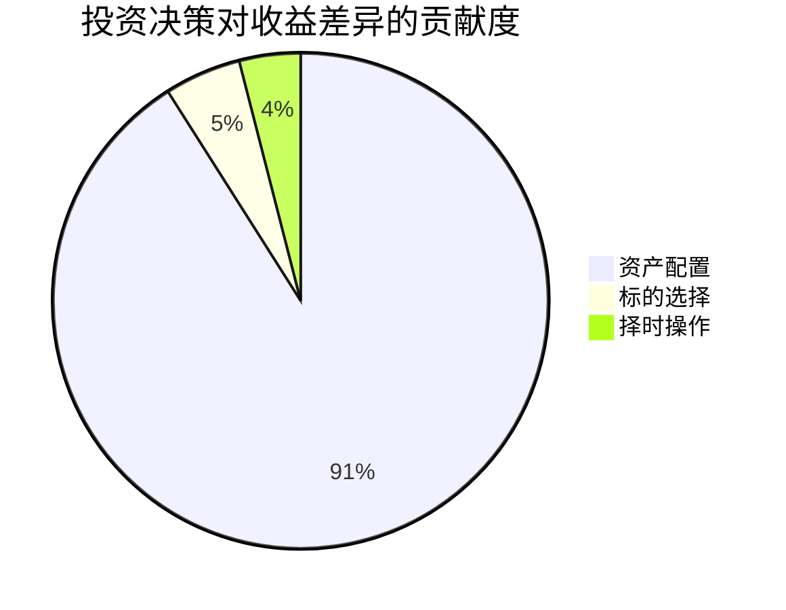
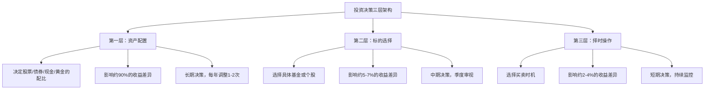
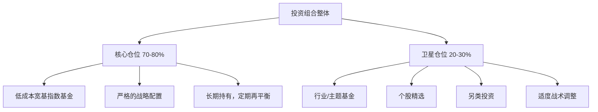
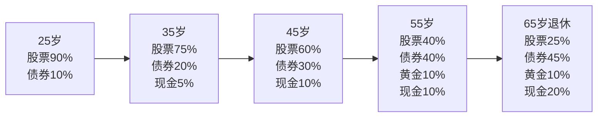
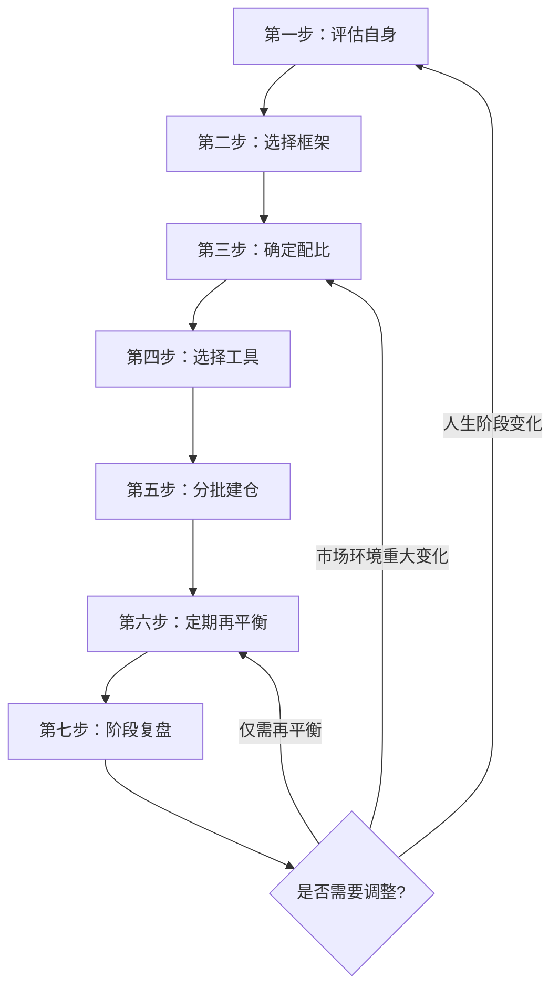

## 5.4 资产配置的理论基础

> "资产配置是投资过程中最重要的决策，是你能做的唯一一个能够真正降低风险而不牺牲预期收益的决定。" —— 大卫·史文森（David Swensen），耶鲁大学首席投资官

在前几节中，你已经理解了投资的本质（5.1）、风险与收益的共生关系（5.2）、以及复利的力量（5.3）。现在你面临一个关键问题：**我有了一笔钱，应该把它放在哪里？** 全部买股票？全部存银行？还是买一半股票一半债券？如果买股票，买A股还是美股？买大盘还是小盘？

这些问题的答案，统称为**资产配置**（Asset Allocation）。它是投资决策中最核心、影响最深远的环节。研究表明，投资组合收益差异的90%以上来自资产配置决策，而非具体标的选择或择时操作。理解资产配置的理论基础，是从"凭直觉投资"走向"科学投资"的关键一步。

---

### 5.4.1 什么是资产配置

#### 定义与核心思想

**资产配置是指将投资资金分配到不同资产类别的过程，目标是在给定风险水平下最大化预期收益，或在给定收益目标下最小化风险。**

这个定义包含三层含义：

| 层次 | 含义 | 关键词 |
|------|------|--------|
| **分配资金** | 决定每类资产占总投资的比例 | 比例、权重 |
| **不同资产类别** | 股票、债券、现金、黄金、房产等 | 分散、多元 |
| **风险-收益优化** | 不是简单分散，而是追求最优组合 | 效率、最优化 |

资产配置的核心思想可以用一句话概括：**不要把所有鸡蛋放在同一个篮子里，而且要选择不同材质的篮子。** 如果你买了10只银行股，虽然放在了10个篮子里，但这些篮子都是同一种材质——银行行业。一旦银行业出问题，所有篮子同时摔碎。真正的分散需要跨越资产类别、行业、地域、时间等多个维度。

#### 资产配置在投资决策中的位置

投资决策可以分为三个层次，每个层次对最终收益的影响程度不同：



这个结论来自布里森（Gary Brinson）、胡德（Randolph Hood）和比鲍尔（Gilbert Beebower）1986年发表的经典论文《Determinants of Portfolio Performance》。他们分析了91只大型养老基金10年的数据，发现资产配置策略解释了91.5%的收益变异。后续研究虽然对具体数字有争议（从40%到90%不等），但结论一致：**资产配置是投资收益最重要的决定因素。**

这意味着什么？意味着你花在"我应该买哪些股票"上的时间，远不如花在"我应该在股票、债券、现金之间如何分配比例"上的时间有价值。一个由低成本指数基金构成的、配置合理的投资组合，长期表现大概率优于一个精心挑选个股但配置失衡的组合。

#### 资产配置与标的选择、择时的关系



**关键洞察**：越上层的决策，影响越大，频率越低，也越容易做好。越下层的决策，影响越小，频率越高，也越难做好。这给了普通投资者一个非常清晰的策略：**把主要精力放在资产配置上，标的选择用低成本指数基金解决，放弃择时。**

---

### 5.4.2 现代投资组合理论（MPT）

资产配置的理论基石是**现代投资组合理论**（Modern Portfolio Theory，简称MPT），由哈里·马科维茨（Harry Markowitz）在1952年发表的论文《Portfolio Selection》中提出。这篇论文为他赢得了1990年的诺贝尔经济学奖，也奠定了整个现代金融学的基础。

#### 马科维茨的核心洞见

在马科维茨之前，人们认为投资就是挑选最好的股票——收益率最高、前景最好的。马科维茨提出了一个革命性的观点：**你不应该单独看每一只资产，而应该看整个组合的表现。** 两只单独看起来都不够好的资产，放在一起可能构成一个非常优秀的组合。

这个洞见的关键在于**相关性**（Correlation）的概念。

#### 相关性：分散投资的数学基础

相关性衡量两个资产价格变动的同步程度，取值范围从-1到+1：

| 相关系数 | 含义 | 组合效果 | 典型资产对 |
|----------|------|----------|-----------|
| +1.0 | 完全正相关：同涨同跌 | 无分散效果 | 同一行业的两只股票 |
| +0.7 | 高度正相关 | 分散效果有限 | A股大盘股与港股大盘股 |
| +0.3 | 低度正相关 | 分散效果较好 | 股票与债券 |
| 0 | 不相关：涨跌完全独立 | 分散效果显著 | 股票与黄金（部分时期） |
| -0.3 | 低度负相关 | 分散效果优秀 | 股票与长期国债（危机时） |
| -1.0 | 完全负相关：涨跌相反 | 最大分散效果 | 理论极限，现实中罕见 |

**分散投资降低风险的数学公式：**

```text
组合方差 = w₁²σ₁² + w₂²σ₂² + 2w₁w₂σ₁σ₂ρ₁₂

其中：
w₁, w₂ = 两类资产的权重
σ₁, σ₂ = 两类资产的标准差（波动率）
ρ₁₂    = 两类资产的相关系数
```

当ρ₁₂ < 1时，组合方差一定小于两类资产方差的加权平均——这就是风险被"分散"掉的数学证明。**相关性越低，分散效果越好。**

用具体数字说明：

```text
假设：
- 股票A：预期收益10%，年化波动率20%
- 债券B：预期收益5%，年化波动率6%
- 各配置50%

不同相关性下的组合波动率：
- ρ = +1.0：组合波动率 = 13.0%（无分散效果）
- ρ = +0.5：组合波动率 = 11.4%（风险降低12%）
- ρ =  0.0：组合波动率 = 10.4%（风险降低20%）
- ρ = -0.5：组合波动率 =  9.2%（风险降低29%）

预期收益始终 = 7.5%（不受相关性影响）
```

**这就是马科维茨所说的"免费午餐"：通过配置相关性低的资产，你可以在不降低预期收益的情况下降低风险。** 全世界没有其他任何投资策略能做到这一点——只有分散配置可以。

#### 主要大类资产的历史相关性

理解了相关性的重要性，你需要知道现实世界中各大类资产之间的相关性是多少：

|  | A股 | 美股 | 中国债券 | 美国债券 | 黄金 | 房产 | 现金 |
|--|-----|------|---------|---------|------|------|------|
| **A股** | 1.00 | 0.35 | -0.10 | -0.20 | 0.05 | 0.25 | 0.00 |
| **美股** | 0.35 | 1.00 | 0.05 | -0.30 | -0.10 | 0.20 | 0.00 |
| **中国债券** | -0.10 | 0.05 | 1.00 | 0.30 | 0.15 | 0.10 | 0.50 |
| **美国债券** | -0.20 | -0.30 | 0.30 | 1.00 | 0.30 | 0.05 | 0.40 |
| **黄金** | 0.05 | -0.10 | 0.15 | 0.30 | 1.00 | 0.00 | 0.10 |
| **房产** | 0.25 | 0.20 | 0.10 | 0.05 | 0.00 | 1.00 | 0.00 |

（注：以上为长期历史均值的近似值，实际相关性会随市场环境变化而波动）

**关键发现**：
1. **股票与债券通常呈低相关或负相关**——这是"股债搭配"经典组合的理论基础
2. **A股与美股的相关性约为0.35**——说明同时配置中美股票有一定分散效果
3. **黄金与股票的相关性接近0**——黄金是有效的分散工具，尤其在危机时期
4. **现金与所有资产几乎不相关**——但它不产生实质收益，仅提供流动性

> **重要警告**：相关性不是固定的。在市场极端恐慌时（如2008年金融危机），几乎所有资产的相关性都会趋向+1——股债同跌、黄金也可能被抛售换取现金。这就是"相关性崩溃"现象，说明分散投资不能消除所有风险，尤其是系统性风险。

#### 有效前沿（Efficient Frontier）

马科维茨理论最著名的产出是**有效前沿**的概念。

给定一组资产，你可以通过调整配比构建无数种投资组合。每个组合都有一个预期收益率和一个波动率（风险）。把这些组合画在"风险-收益"坐标系中，它们会形成一个区域。这个区域的**左上边界**就是有效前沿——在同等风险下收益最高、在同等收益下风险最低的所有组合的集合。


**有效前沿的含义**：只有位于有效前沿上的组合才是"最优"的——任何一个理性投资者都不应该选择有效前沿以下的组合，因为存在同等风险但收益更高（或同等收益但风险更低）的替代方案。

在有效前沿上，你需要根据自己的风险承受能力选择一个点：
- **风险厌恶型投资者**：选择有效前沿左下角的组合（低风险低收益）
- **风险中性投资者**：选择有效前沿中间的组合（中等风险中等收益）
- **风险偏好型投资者**：选择有效前沿右上角的组合（高风险高收益）

**有效前沿的实践意义**：它告诉你，不是"买什么都一样"——**配比很重要**。同样是70%股票+30%债券，如果你选的是有效前沿上的配比，风险调整后的表现会优于随意配比。

---

### 5.4.3 资本资产定价模型（CAPM）

在马科维茨的投资组合理论基础上，威廉·夏普（William Sharpe）、约翰·林特纳（John Lintner）和简·莫辛（Jan Mossin）在1960年代独立提出了**资本资产定价模型**（Capital Asset Pricing Model，简称CAPM）。CAPM回答了一个核心问题：**给定一只资产，它应该获得多少预期收益？**

#### CAPM的公式

```text
E(Rᵢ) = Rꜰ + βᵢ × (E(Rₘ) - Rꜰ)

其中：
E(Rᵢ) = 资产i的预期收益率
Rꜰ    = 无风险利率（通常用国债收益率）
βᵢ    = 资产i的Beta系数（对市场波动的敏感度）
E(Rₘ) = 市场组合的预期收益率
E(Rₘ) - Rꜰ = 市场风险溢价（投资者承担市场风险要求的额外补偿）
```

**用通俗语言解读**：一只资产的预期收益 = 无风险收益 + 它承担的系统性风险 × 单位风险的补偿。

举例说明：
- 无风险利率 = 3%（10年期国债收益率）
- 市场预期收益 = 10%（沪深300长期预期）
- 市场风险溢价 = 10% - 3% = 7%
- 某股票Beta = 1.3

则该股票的预期收益 = 3% + 1.3 × 7% = 12.1%

这意味着：这只股票因为比市场波动大30%（Beta=1.3），所以投资者要求它提供比市场高50%的超额收益（9.1% vs 7%）作为补偿。

#### CAPM对资产配置的启示

| 启示 | 含义 | 实践指导 |
|------|------|----------|
| **只有系统性风险才能获得补偿** | 非系统性风险可以通过分散消除，市场不会为此付费 | 不要承担可以被分散掉的风险 |
| **Beta决定预期收益** | 高Beta资产应该有更高的预期收益 | 想要更高收益，就需要承担更高的市场敏感度 |
| **Alpha是超额收益** | 实际收益超过CAPM预期的部分 | 持续正Alpha极其困难，大多数主动基金做不到 |
| **市场组合是最优风险组合** | 在有效前沿上，市场组合是切点组合 | 对大多数人来说，持有市场指数基金是最优策略 |

**CAPM最重要的实践结论**：如果市场是有效的（价格已经反映了所有信息），那么**持有整个市场的指数基金**就是最优策略——你获得了市场风险溢价，没有承担不必要的非系统性风险，也没有支付高额的主动管理费用。

#### CAPM的局限性

CAPM是一个优雅的理论模型，但现实世界比模型复杂得多：

| 局限性 | 说明 | 现实影响 |
|--------|------|----------|
| **假设单一风险因子** | 只考虑市场风险，忽略了其他影响收益的因素 | 后来发展出多因子模型（如Fama-French三因子、五因子模型） |
| **假设所有投资者同质** | 现实中投资者的风险偏好、信息获取、投资期限差异巨大 | 不同投资者的最优组合不同 |
| **假设无交易成本和税收** | 现实中交易有佣金、有资本利得税 | 频繁调整组合的成本可能抵消收益 |
| **市场组合不可观测** | 理论上的"市场组合"应包含所有资产（股票、债券、房产、人力资本等） | 实践中只能用股票指数近似 |
| **Beta不稳定** | 同一资产的Beta会随时间变化 | 用历史Beta预测未来可能失准 |

尽管有这些局限性，CAPM的核心逻辑——**风险决定收益，分散消除非系统性风险**——依然是资产配置最重要的理论基础。

---

### 5.4.4 大类资产的特征与角色

要进行资产配置，你首先需要了解有哪些"篮子"可以选择，以及每个篮子的特性。以下是主要大类资产的系统梳理：

#### 六大核心资产类别

| 资产类别 | 代表品种 | 预期年化收益 | 年化波动率 | 核心角色 | 最佳持有场景 |
|----------|---------|-------------|-----------|---------|-------------|
| **股票** | 沪深300、标普500、偏股基金 | 8-12% | 15-25% | 增长引擎 | 经济扩张期、低利率环境 |
| **债券** | 国债、政金债、债券基金 | 3-5% | 3-8% | 稳定器、减震器 | 经济衰退期、利率下行期 |
| **现金/货币** | 银行存款、货币基金 | 1.5-3% | ≈0.5% | 流动性储备 | 高不确定性时期、短期需求 |
| **黄金** | 实物黄金、黄金ETF | 5-8%（长期） | 12-18% | 避险工具、通胀对冲 | 通胀高企、地缘政治风险 |
| **房产** | 住宅、商业地产、REITs | 5-8%（含租金） | 8-15% | 实物资产、租金收入 | 长期持有、抗通胀 |
| **另类投资** | 私募股权、对冲基金、大宗商品 | 不确定 | 高 | 分散化、超额收益 | 高净值投资者、专业配置 |

#### 各资产类别的详细分析

**股票——长期增长的核心引擎**

股票是长期收益最高的主流资产类别。过去200年，美国股票的实际年化收益约为6.5-7%（扣除通胀后），远超债券的约2%。这个超额收益叫做**股权风险溢价**（Equity Risk Premium），它是投资者承担股市波动风险所获得的补偿。

股票内部还可以进一步细分：

| 维度 | 分类 | 特征 |
|------|------|------|
| **市值** | 大盘股 vs 中小盘股 | 大盘股更稳定，中小盘股弹性更大、长期收益略高 |
| **风格** | 价值股 vs 成长股 | 价值股估值低、分红多；成长股增速快、波动大 |
| **地域** | A股 vs 港股 vs 美股 | 不同市场的经济周期、政策环境、估值水平不同 |
| **行业** | 消费/科技/医药/金融等 | 不同行业在不同经济阶段表现差异大 |

**债券——组合的稳定器**

债券的本质是你把钱借给政府或企业，对方承诺定期支付利息并在到期时归还本金。债券的核心价值不在于高收益，而在于：

1. **与股票的低/负相关性**：股票跌时债券往往涨（资金避险流入债市），起到"减震器"作用
2. **稳定的现金流**：利息收入可预测，适合需要定期收入的投资者
3. **降低组合波动**：即使债券本身收益不高，加入债券可以显著降低整个组合的波动率

债券也有风险——主要是**利率风险**（利率上升→债券价格下跌）和**信用风险**（发行人违约）。国债几乎没有信用风险，但利率风险仍然存在。

**黄金——千年避险资产**

黄金的特殊性在于它不产生现金流（没有利息、没有股息），它的收益完全来自价格上涨。黄金的核心角色是：

- **避险功能**：在金融危机、地缘政治冲突时，黄金往往逆势上涨
- **通胀对冲**：长期来看，黄金价格与通胀正相关
- **与股票低相关**：黄金和股票的相关性长期接近0，是优秀的分散工具

**但黄金不是万能的**。在经济繁荣、利率上升的环境中，黄金往往表现平庸甚至下跌。巴菲特曾批评黄金是"从非洲或地底下挖出来，然后又埋进另一个地下的保险库里，还要付钱请人看守"——他更偏好产生现金流的资产。

**现金——被低估的"期权"**

现金的收益率极低，长期持有会被通胀侵蚀。但现金有一种隐性价值——**它是等待机会的弹药**。当市场暴跌、优质资产被恐慌性抛售时，持有现金的人可以"捡便宜"。这就是为什么即使是最激进的投资者，也应该保留一定比例的现金。

---

### 5.4.5 资产配置的三大理论模型

#### 模型一：战略资产配置（Strategic Asset Allocation, SAA）

战略资产配置是基于长期目标和风险承受能力，设定一个**长期目标配比**，并坚持执行。它是资产配置的"基本盘"。

**核心理念**：长期来看，各大类资产的风险-收益特征相对稳定。设定好配比后，通过定期再平衡回到目标比例，不需要频繁调整。

```text
战略资产配置示例（稳健型投资者）：

股票 40% ── 增长引擎
债券 35% ── 稳定器
黄金 10% ── 避险工具
现金 15% ── 流动性储备

再平衡规则：每季度检查，偏离超过5个百分点时调整
```

**优点**：简单、纪律性强、适合大多数投资者
**缺点**：在市场剧烈变化时可能反应迟钝

#### 模型二：战术资产配置（Tactical Asset Allocation, TAA）

战术资产配置在战略配比的基础上，允许根据短期市场判断进行**临时偏离**。它承认市场在短期内可能偏离长期均衡，试图利用这种偏离获取超额收益。

```text
战略基准：股票60% + 债券30% + 黄金10%

战术调整示例：
- 当股票估值处于历史低位（如PE<12）：股票比例上调至70%
- 当股票估值处于历史高位（如PE>20）：股票比例下调至50%
- 当通胀预期上升：黄金比例上调至15%
- 当经济衰退信号出现：债券比例上调至40%
```

**优点**：可以利用市场的短期错误定价
**缺点**：需要较强的市场判断能力，判断错误可能适得其反。研究表明，大多数投资者的战术调整不仅没有增加收益，反而因为频繁买卖增加了交易成本和税收负担。

**给普通投资者的建议**：如果没有深入的宏观经济分析能力和丰富的投资经验，以战略配置为主，最多留出10-20%的仓位做小幅战术调整。

#### 模型三：核心-卫星配置（Core-Satellite）

核心-卫星模型是前两种模型的结合，是目前专业投资者最广泛使用的配置框架：



```text
核心-卫星配置实例（中等风险投资者，总资金100万）：

核心仓位（75万，75%）：
  沪深300指数基金    25万（25%）
  中证500指数基金    10万（10%）
  标普500指数基金    10万（10%）
  中长期纯债基金     20万（20%）
  黄金ETF            10万（10%）

卫星仓位（25万，25%）：
  医药行业基金        8万（8%）
  科技行业基金        8万（8%）
  个股精选            5万（5%）
  现金/货币基金       4万（4%，等待机会）
```

**核心仓位的特点**：低成本、被动跟踪、长期持有、纪律再平衡——它提供了市场平均回报，是组合的"压舱石"。

**卫星仓位的特点**：可以主动管理、追逐超额收益、承受更高风险——它是组合的"进攻端"。即使卫星仓位全部亏损，核心仓位仍然能保证你获得市场平均回报。

---

### 5.4.6 生命周期资产配置

人的一生中，风险承受能力会系统性地变化。年轻时能承受高风险（时间多、责任少），年长时需要降低风险（时间少、用钱近）。基于这一逻辑，**生命周期资产配置**（Life-Cycle Asset Allocation）应运而生。

#### 经典模型：下滑航道（Glide Path）



这个"下滑航道"的逻辑非常直观：

| 人生阶段 | 年龄段 | 股票比例 | 债券+现金比例 | 核心考量 |
|----------|--------|----------|-------------|---------|
| **积累期** | 25-35岁 | 70-90% | 10-30% | 时间长，亏损可恢复，最大化增长 |
| **巩固期** | 35-50岁 | 50-70% | 30-50% | 收入高峰期，平衡增长与安全 |
| **过渡期** | 50-60岁 | 30-50% | 50-70% | 接近退休，逐步降低风险 |
| **退休期** | 60岁+ | 20-35% | 65-80% | 需要稳定现金流，保本优先 |

#### 目标日期基金：自动化生命周期配置

目标日期基金（Target Date Fund）是生命周期配置理念的商业化产品。你只需选择一个目标退休年份（如"2050退休"），基金会自动按照下滑航道调整股票/债券比例——年轻时偏股票，临近退休自动偏债券。

```text
目标日期基金的典型费率结构：
- 管理费：0.3-0.8%/年（指数型更低）
- 优势：一站式解决资产配置+再平衡
- 劣势：配置方案"一刀切"，可能不适合你的具体情况

适合人群：
- 不想花时间研究配置的投资者
- 401(k)/企业年金等养老金账户的默认选项
- 投资新手的第一个基金
```

#### 对"100法则"的深度审视

5.2节提到了"100法则"（股票比例≈100-年龄）。这个法则简洁实用，但过于粗糙。以下是更精确的修正版本：

| 法则 | 公式 | 适用场景 |
|------|------|---------|
| 100法则 | 股票比例 = 100 - 年龄 | 保守型投资者 |
| 110法则 | 股票比例 = 110 - 年龄 | 中等风险偏好 |
| 120法则 | 股票比例 = 120 - 年龄 | 激进型投资者，收入稳定 |
| 目标日期法 | 根据退休年份动态调整 | 使用目标日期基金 |

**更精确的调整因素**：

```text
在100法则基础上，根据以下因素±调整：

+10：收入非常稳定（公务员、大企业）
+10：有额外收入来源（租金、副业）
+10：投资期限超过30年
-10：收入不稳定（自由职业、创业）
-10：有高额负债（房贷>月收入50%）
-10：需要定期从投资中取钱
-10：心理承受力差（看到亏损就焦虑）

示例：
35岁，公务员，无负债，心理承受力一般
基础：100 - 35 = 65%
调整：+10（收入稳定）-10（心理一般）= ±0
最终：65%股票 + 35%债券和现金
```

---

### 5.4.7 资产配置的关键决策框架

#### 决策一：股票vs债券的核心配比

这是资产配置中最基本、影响最大的决策。以下是不同配比下组合的历史表现（基于美国市场1926-2023年数据，供参考）：

| 配比（股票:债券） | 年化收益 | 最大回撤 | 年化波动率 | 适合投资者 |
|-------------------|---------|---------|-----------|-----------|
| 100:0 | 10.2% | -51% | 15.3% | 极激进，能承受腰斩 |
| 80:20 | 9.5% | -44% | 12.3% | 激进型 |
| 60:40 | 8.7% | -35% | 9.6% | 平衡型（经典配比） |
| 40:60 | 7.6% | -25% | 7.2% | 稳健型 |
| 20:80 | 6.3% | -14% | 5.3% | 保守型 |
| 0:100 | 5.0% | -8% | 4.0% | 极保守 |

**60/40组合**（60%股票+40%债券）是投资界最经典的配比，过去近100年的年化收益约8.7%，最大回撤约-35%。它在增长和安全之间取得了良好的平衡，被广泛认为是"默认配置"的起点。

**中国市场需要注意**：A股的波动率比美股更高（年化约22-25% vs 美股的15-18%），中国债券的收益率和波动率也与美国不同。因此，照搬美国数据的配比可能不适合中国投资者。实际操作中，可以参考上述比例框架，但需要根据中国市场的特征做调整。

#### 决策二：国内vs国际的配比

全球化配置可以利用不同国家经济周期的差异，进一步分散风险。但投资者普遍存在**本土偏好**（Home Bias）——过度集中于本国市场。

```text
全球股票市值占比（2024年近似值）：
- 美股：约42%
- 欧洲：约15%
- 日本：约6%
- 中国（A股+港股）：约12%
- 其他新兴市场：约10%
- 其他发达市场：约15%

如果你100%投资A股，你只覆盖了全球市场的12%。
```

**国际配置的建议框架**：

| 投资者类型 | A股比例 | 港股/中概 | 美股 | 其他国际市场 |
|-----------|---------|---------|------|------------|
| 保守型（仅国内） | 80% | 15% | 5% | 0% |
| 均衡型 | 50% | 15% | 25% | 10% |
| 全球型 | 30% | 10% | 35% | 25% |

#### 决策三：主动vs被动的选择

在确定了各大类资产的比例后，你需要决定每一类资产是用主动基金还是被动指数基金来实现。

| 维度 | 被动指数基金 | 主动管理基金 |
|------|-------------|-------------|
| **费率** | 0.1-0.5%/年 | 1.0-2.0%/年 |
| **目标** | 跟踪市场指数，获得市场平均回报 | 超越市场，获得超额收益（Alpha） |
| **胜率** | 长期中，约80-90%的主动基金跑不赢指数 | 只有少数顶级基金经理能持续跑赢 |
| **透明度** | 高——持仓即指数成分 | 低——持仓通常季度才披露 |
| **适合场景** | 大多数资产类别的核心配置 | 你有充分理由相信某个基金经理的能力 |

**给普通投资者的建议**：核心仓位用被动指数基金（低成本、高透明、确定获得市场回报），卫星仓位可以配置少量主动基金（如果你确实研究过基金经理的投资理念和历史业绩）。

---

### 5.4.8 资产配置的行为陷阱

理论很完美，但人类的行为往往与理论背道而驰。以下是资产配置中最常见的行为偏差：

#### 陷阱一：本土偏好（Home Bias）

**表现**：把绝大部分资金投资于本国市场，忽视国际市场。
**原因**：对熟悉的事物过度自信，对不了解的市场恐惧。
**数据**：中国投资者A股配置通常超过80%，而中国GDP仅占全球约18%。
**纠正**：至少将20-30%配置于国际市场，通过QDII基金或港股通实现。

#### 陷阱二：追涨杀跌的资产轮动

**表现**：看到某类资产涨得好就加仓，跌了就减仓。
**原因**：近因效应和损失厌恶——最近的涨跌对决策的影响被过度放大。
**数据**：晨星的研究显示，基金投资者的实际收益比基金本身的收益率平均每年低1-1.5%，主要原因就是"高买低卖"。
**纠正**：设定固定配比，通过再平衡纪律化地"高抛低吸"。

#### 陷阱三：忽视再平衡

**表现**：设好配比后不管，任由市场波动改变实际比例。
**原因**：惰性、嫌麻烦、或者"涨的为什么要卖"的心理。
**后果**：牛市后股票占比可能从60%膨胀到80%，熊市来临时亏损远超预期。
**纠正**：每季度检查一次，偏离超过5个百分点时再平衡。

#### 陷阱四：过度分散

**表现**：买了几十只基金，覆盖了所有行业和主题。
**原因**：误以为"越分散越好"。
**后果**：持有过多基金导致组合实质上等于市场指数（指数化），但费率远高于指数基金；同时难以管理和跟踪。
**纠正**：5-10只低相关性的基金足以实现充分分散。质量比数量重要。

#### 陷阱五：锚定于历史表现

**表现**：用过去3-5年的收益率来选择资产类别。
**原因**：近因效应——人类倾向于认为最近发生的事情会持续下去。
**现实**：资产类别的表现存在均值回归现象。过去5年表现最好的资产类别，在未来5年往往表现平庸甚至落后。
**纠正**：关注资产类别的长期（20年以上）风险-收益特征和在组合中的角色，而非短期业绩。

#### 陷阱六：把相关性当作固定的

**表现**：用历史相关性做配置假设，并认为它永远不变。
**原因**：统计思维的惰性——过去的数据给了虚假的安全感。
**现实**：在极端市场环境下，几乎所有资产的相关性都会趋向+1（"相关性崩溃"）。2008年金融危机中，股债商同跌，分散配置也遭受了大幅回撤。
**纠正**：在配置中加入"危机对冲"资产（如长期国债、黄金），并预留足够的现金缓冲。

---

### 5.4.9 资产配置的实操步骤概览

理解了理论基础后，以下是资产配置的完整操作流程。详细的实操方法将在"技巧三：资产配置实操"中展开。



**第一步：评估自身**
- 风险承受能力（见5.2节的自测评分）
- 投资期限（短期/中期/长期）
- 流动性需求（近期是否有大额支出）
- 投资目标（保值/增值/财务自由）

**第二步：选择配置框架**
- 保守型/稳健型/平衡型/激进型
- 核心-卫星模型
- 生命周期模型

**第三步：确定各大类资产比例**
- 股票:债券:黄金:现金
- 国内:国际
- 大盘:中小盘
- 价值:成长

**第四步：选择具体投资工具**
- 优先选择低成本指数基金
- 每类资产选1-2只代表性基金
- 关注费率、跟踪误差、流动性

**第五步：分批建仓**
- 不要一次性全部投入（避免买在高点）
- 3-6个月内分批建仓
- 或者直接开始定投

**第六步：定期再平衡**
- 每季度检查一次实际配比
- 偏离超过5个百分点时调整
- 优先通过新增资金调整（减少交易成本）

**第七步：阶段复盘**
- 每年做一次全面复盘
- 评估配置是否仍符合自身情况
- 根据人生阶段变化调整方案

---

### 5.4.10 资产配置的常见误区与纠正

#### 误区一："资产配置就是买一堆基金"

**现实**：资产配置的核心是**配比**和**相关性管理**，不是数量。买了20只高相关的科技主题基金，不叫资产配置，叫集中投资。真正的配置是跨资产类别（股票+债券+黄金+现金）、跨地域（A股+美股）、跨风格（价值+成长）的系统性分散。

#### 误区二："设好配比就不用管了"

**现实**：配置不是一劳永逸的。市场波动会改变实际配比（牛市后股票占比膨胀），人生阶段变化需要调整风险水平（结婚、生子、退休），宏观经济环境变化也会影响各类资产的预期表现。配置需要**纪律性的再平衡**和**周期性的审视**。

#### 误区三："分散投资会降低收益"

**现实**：分散确实会"放弃"把所有筹码押在单一赢家上的暴利机会。但它同时也"排除"了把所有筹码押在单一输家上的归零风险。长期来看，分散投资的风险调整后收益（夏普比率）一定优于集中投资——这就是马科维茨证明的"免费午餐"。

#### 误区四："黄金和债券没必要配，收益太低"

**现实**：黄金和债券的价值不在于它们自身的收益率，而在于它们与股票的**低/负相关性**。在股票暴跌30%时，债券可能涨10%、黄金可能涨20%——它们保护了你的组合不至于腰斩。一个60%股票+30%债券+10%黄金的组合，长期收益可能只比100%股票低1-2个百分点，但波动率和最大回撤降低了40%以上。

#### 误区五："我年轻，不需要配置，全买股票就行"

**现实**：全股票配置的最大风险不在于长期收益不够高，而在于**你可能在市场暴跌时恐慌卖出**。如果你的心理承受力只能接受20%的亏损，但全股票配置让你亏了50%，你很可能在最低点割肉——然后永远告别投资。配置中加入一部分债券，可以让你在暴跌中"扛得住"，从而真正享受到长期持有的复利收益。

#### 误区六："跟着大V/朋友的配置方案做"

**现实**：每个人的财务状况、风险承受能力、投资目标、税收情况都不同。别人能承受30%的亏损，不代表你也可以。别人不需要流动性（没有短期大额支出），不代表你也不需要。资产配置必须是**个性化的**——框架可以参考，比例必须自己决定。

---

### 5.4.11 进阶：多因子模型与Smart Beta

对于希望深入理解资产配置理论的读者，这里简要介绍CAPM之后的理论发展。

#### Fama-French三因子模型

CAPM只考虑一个风险因子（市场风险）。1992年，尤金·法玛（Eugene Fama）和肯尼斯·弗伦奇（Kenneth French）发现，除了市场风险外，还有两个因子能系统性地解释股票收益差异：

```text
三因子模型：
E(Rᵢ) - Rꜰ = αᵢ + β₁(Rₘ - Rꜰ) + β₂(SMB) + β₃(HML) + εᵢ

因子说明：
- Rₘ - Rꜰ：市场因子（市场超额收益）
- SMB (Small Minus Big)：规模因子（小盘股相对大盘股的超额收益）
- HML (High Minus Low)：价值因子（高账面市值比相对低账面市值比的超额收益）
```

后续研究又加入了**动量因子**（Momentum）和**质量因子**（Quality），形成五因子模型。

#### Smart Beta策略

多因子模型的实践产物是**Smart Beta**（智慧贝塔）策略——通过系统性地暴露于一个或多个风险因子来获取超额收益：

| 策略 | 目标因子 | 逻辑 | 代表指数 |
|------|---------|------|---------|
| **价值策略** | HML | 买入低估值股票，做空高估值股票 | 沪深300价值 |
| **规模策略** | SMB | 偏向小盘股 | 中证1000 |
| **质量策略** | RMW | 买入高ROE、低负债的优质公司 | MSCI质量指数 |
| **低波动策略** | 反Beta | 买入低波动股票 | 中证500低波动 |
| **红利策略** | 股息 | 买入高分红股票 | 中证红利 |
| **动量策略** | UMD | 买入近期涨幅靠前的股票 | 动量指数 |

**Smart Beta在资产配置中的应用**：在传统的大类资产配置基础上，通过Smart Beta指数基金来获取特定因子的风险溢价。例如，在A股部分的配置中，50%用沪深300指数（市场因子），25%用中证红利指数（价值+分红因子），25%用中证500指数（规模因子）。

**警告**：因子投资并非"免费午餐"。因子溢价在长期中存在，但在短期内可能大幅反转（如2019-2020年价值因子严重跑输成长因子）。因子投资需要更长的投资期限和更强的心理承受力。

---

### 5.4.12 本节核心要点回顾

```text
1. 资产配置是投资决策中最重要的环节，决定了90%以上的收益差异
2. 现代投资组合理论（MPT）证明：配置低相关资产可以在不降低收益的情况下降低风险
3. CAPM告诉我们：只有系统性风险才能获得补偿，非系统性风险应通过分散消除
4. 六大核心资产类别：股票（增长）、债券（稳定）、现金（流动性）、黄金（避险）、房产（实物）、另类（分散）
5. 三种配置模型：战略配置（长期基准）、战术配置（短期调整）、核心-卫星（兼顾稳健与灵活）
6. 生命周期配置：随年龄增长逐步降低风险，下滑航道或目标日期基金
7. 关键决策：股票vs债券配比、国内vs国际、主动vs被动
8. 行为陷阱：本土偏好、追涨杀跌、忽视再平衡、过度分散、锚定历史
9. 再平衡是资产配置的"纪律引擎"——没有再平衡的配置等于没有配置
10. 个性化是资产配置的铁律——没有适合所有人的"万能配比"
```

> **下一步**：理解了资产配置的理论基础之后，你需要了解有哪些具体的投资工具可以用来实现你的配置方案。下一节"5.5 常见投资工具详解"将系统介绍各类投资工具的特点、优缺点和适用场景。而在"技巧三：资产配置实操"中，你将学到如何把本节的理论落地为具体的操作方案。
