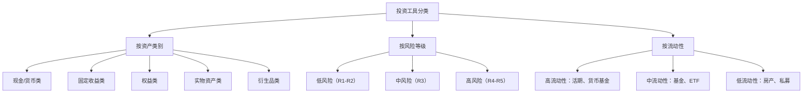
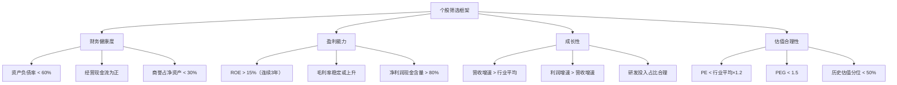
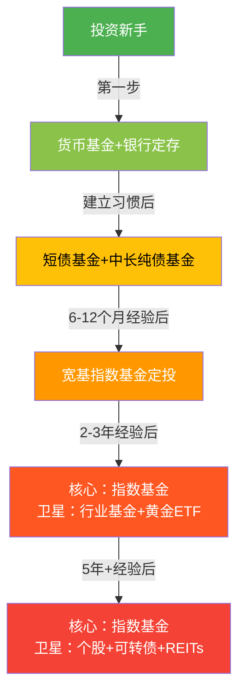
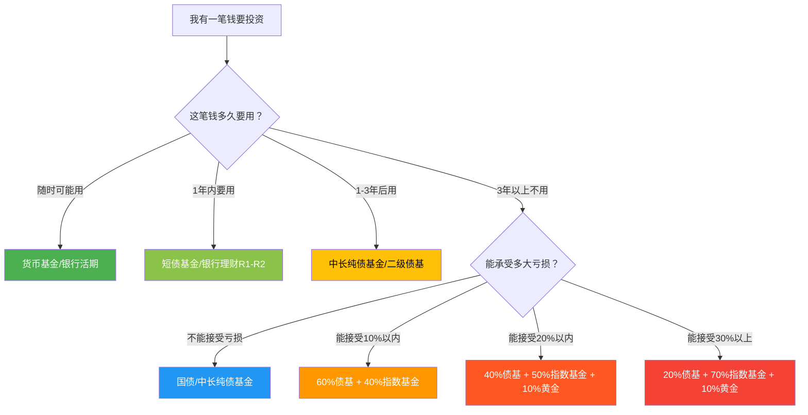

## 5.5 常见投资工具详解

> "工欲善其事，必先利其器。" —— 《论语·卫灵公》

在前四节中，你已经建立了投资的认知框架：理解了投资的本质（5.1）、风险与收益的关系（5.2）、复利的威力（5.3）、以及资产配置的理论基础（5.4）。现在你面临一个非常实际的问题：**理论我都懂了，但具体到"买什么"，市场上有那么多工具——股票、基金、债券、银行理财、保险、黄金、房产、数字货币……它们到底是什么？怎么运作的？各有什么优缺点？适合什么样的人？**

本节将逐一拆解中国市场中所有主流投资工具，从最简单的货币基金到最复杂的期权期货，帮你建立一个完整的"投资工具全景图"。读完本节，你将能够为每一类资产类别找到对应的、可执行的投资工具。

---

### 5.5.1 投资工具的分类框架

在逐一介绍之前，先建立一个统一的分类框架。所有投资工具都可以按以下三个维度来归类：



#### 风险等级标识体系

中国监管机构要求所有金融产品标注风险等级，这是你判断产品风险的第一道参考：

| 风险等级 | 标识 | 含义 | 最大可能亏损 | 典型产品 |
|---------|------|------|-------------|---------|
| **R1 低风险** | 🟢 | 本金损失概率极低 | 接近0 | 国债、银行存款、货币基金 |
| **R2 中低风险** | 🟢 | 本金损失概率较低 | 0-5% | 纯债基金、银行理财（稳健型） |
| **R3 中风险** | 🟡 | 可能出现本金小幅亏损 | 5-20% | 混合基金、二级债基、可转债 |
| **R4 中高风险** | 🟠 | 可能出现本金较大亏损 | 20-50% | 股票基金、指数基金、黄金ETF |
| **R5 高风险** | 🔴 | 可能出现本金重大亏损 | 50%以上 | 股票、期货、期权、加密货币 |

**重要提醒**：风险等级是产品设计时的静态标签，不等于实际风险。R2的银行理财在2022年底也出现过亏损（"破净"），因为底层债券市场发生了剧烈波动。永远不要因为"风险等级低"就放松警惕。

---

### 5.5.2 现金与货币类工具

这类工具的核心功能是**保本+流动性**，是投资组合的"蓄水池"。

#### 货币基金

货币基金是投资入门的第一站，也是大多数人接触的第一个"投资"产品。余额宝、微信零钱通、各银行的"宝宝类"产品，底层都是货币基金。

**运作原理**：

货币基金将大量投资者的小额资金汇集起来，投资于短期、高信用等级的金融工具——主要是银行协议存款、国债逆回购、短期债券等。这些底层资产的风险极低、期限极短（通常在120天以内），因此货币基金的净值几乎不会波动。

| 属性 | 详情 |
|------|------|
| **起投金额** | 0.01元起（余额宝等平台） |
| **预期收益** | 年化1.5%-2.5%（受市场利率影响） |
| **风险等级** | R1（极低） |
| **流动性** | T+0（快速赎回，单日限额1万元）；T+1（普通赎回，无限额） |
| **费率** | 管理费0.15%-0.33% + 托管费0.05%-0.1%，无申购赎回费 |
| **适合场景** | 活期资金存放、应急备用金、等待投资机会的"弹药库" |

**选择货币基金的三个关键指标**：

1. **七日年化收益率**：反映最近7天的平均收益水平，但不代表未来收益。注意不要只看单日的万份收益（波动较大），要看7日或30日的均值。
2. **基金规模**：规模在100亿-500亿之间的货币基金通常表现最稳定。规模太小（<50亿）可能面临大额赎回冲击，规模太大（>2000亿）收益率可能被摊薄。
3. **持有人结构**：机构持有比例过高的基金，一旦机构集中赎回，可能导致净值大幅波动。散户为主的基金更稳定。

**货币基金的局限性**：

- 收益率长期低于通货膨胀率，持有过多等于"确定性地亏购买力"
- 2022年资管新规后，货币基金不再"保本"（虽然历史上极少亏损）
- 快速赎回单日限额1万元，大额资金需要用普通赎回（T+1到账）

**实践建议**：保留3-6个月生活费的应急资金放在货币基金中即可，超出部分应投入到收益更高的工具中。

#### 银行活期/定期存款

银行存款是最传统、最"保守"的工具，但在当前低利率环境下，它的价值已经大幅缩水。

| 类型 | 利率水平（2024年参考） | 特点 |
|------|----------------------|------|
| 活期存款 | 0.2%-0.25% | 随时存取，收益极低 |
| 定期存款（1年） | 1.45%-1.8% | 锁定期限，提前支取按活期计息 |
| 定期存款（3年） | 1.95%-2.5% | 较长锁定期，利率略高 |
| 大额存单（20万起） | 2.0%-2.65% | 门槛较高，利率优于普通定存 |
| 结构性存款 | 1.5%-4.0%（浮动） | 与衍生品挂钩，收益不确定 |

**存款保险制度**：根据《存款保险条例》，同一家银行50万元以内的存款本息受到全额保障。如果你有大额资金，分散存放在不同银行可以确保全部受到保障。

**与货币基金的对比**：

| 维度 | 银行定期存款 | 货币基金 |
|------|------------|---------|
| 收益率 | 略高（锁定利率） | 略低（浮动） |
| 流动性 | 差（提前支取损失利息） | 好（T+0/T+1） |
| 安全性 | 极高（存款保险） | 极高（但理论上不保本） |
| 灵活性 | 差（金额和期限固定） | 好（随时存取任意金额） |

#### 国债逆回购

国债逆回购是一种"把钱借给别人，用国债做抵押"的操作，本质是短期借贷。它的收益率通常在平时与货币基金相当，但在季末、年末等资金紧张时期可能飙升到5%-10%甚至更高。

| 属性 | 详情 |
|------|------|
| **操作方式** | 在券商APP中操作，选择"国债逆回购" |
| **起投金额** | 1000元（沪市）/ 100元（深市） |
| **期限** | 1天、2天、3天、4天、7天、14天、28天、91天、182天 |
| **安全性** | 极高——以国债为抵押，交易所监管 |
| **最佳使用场景** | 季末/年末资金紧张时、长假前锁定收益 |

**实操技巧**：在周四做1天期逆回购，实际占款3天（周五到周日），但只收1天的手续费，性价比最高。长假前操作同理——在放假前一天做1天期逆回购，占款覆盖整个假期。

---

### 5.5.3 固定收益类工具

固定收益类工具的核心功能是**提供稳定现金流+降低组合波动**，是投资组合的"压舱石"。

#### 国债

国债是中央政府发行的债券，被视为"无风险资产"——因为政府拥有征税权和货币发行权，理论上不会违约。

| 类型 | 特点 | 适合人群 |
|------|------|---------|
| **储蓄国债（凭证式）** | 按期付息，不可流通转让，只能在银行柜台购买 | 保守型个人投资者 |
| **储蓄国债（电子式）** | 按期付息，通过银行账户购买，可提前兑取 | 保守型个人投资者 |
| **记账式国债** | 可在交易所/银行间市场买卖，价格随市场波动 | 有一定经验的投资者 |

**国债收益率的"锚"作用**：10年期国债收益率是整个金融市场的"利率锚"。当它的收益率上升时，债券价格下跌（利率风险）；当它的收益率下降时，债券价格上涨。理解这一点是理解所有债券投资的基础。

#### 债券基金

直接购买债券门槛较高（银行间市场个人无法参与，交易所债券门槛也要数万元），债券基金是普通投资者参与债券市场的最佳途径。

| 基金类型 | 投资范围 | 预期收益 | 波动率 | 风险等级 |
|---------|---------|---------|--------|---------|
| **短债基金** | 短期限债券（1年以内） | 2%-3% | 极低 | R1-R2 |
| **中长期纯债基金** | 中长期利率债+信用债 | 3%-5% | 低 | R2 |
| **一级债基** | 债券为主+参与新股申购 | 4%-6% | 中低 | R2-R3 |
| **二级债基** | 债券为主+少量股票（<20%） | 4%-8% | 中等 | R3 |
| **可转债基金** | 以可转换债券为主 | 5%-15% | 较高 | R3-R4 |

**选择债券基金的关键指标**：

1. **基金规模**：2亿以上，避免清盘风险
2. **历史最大回撤**：纯债基金一般<3%，二级债基<10%
3. **机构持有比例**：机构占比适中（30%-70%）为佳，过高说明机构认可但可能面临集中赎回风险
4. **基金经理任职年限**：最好超过3年，经历过完整的债市牛熊周期
5. **费率**：纯债基金管理费0.3%-0.6%为宜，过高说明性价比差

**债券基金的风险点**：

- **利率风险**：央行加息时，债券价格下跌，债基净值下跌
- **信用风险**：持仓债券发行人违约（如2020年永煤事件），可能导致净值暴跌
- **流动性风险**：市场恐慌时债券可能卖不出去，导致基金净值"踩踏"
- **"暴雷"风险**：部分信用债基金为追求高收益持有低评级债券，一旦违约损失惨重

**实践建议**：新手从短债基金或中长期纯债基金开始，先感受债市的波动特征，再逐步尝试二级债基或可转债基金。

#### 银行理财产品

资管新规（2022年正式实施）后，银行理财已经打破了"刚性兑付"——不再保本保收益。但很多人仍然把它当作"稳赚不赔"的存款替代品，这是一个危险的认知误区。

| 属性 | 资管新规前 | 资管新规后 |
|------|----------|----------|
| **收益承诺** | 预期收益率（实际保本保收益） | 业绩比较基准（不保证） |
| **净值化** | 不透明 | 每日披露净值 |
| **投资门槛** | 1万-5万元 | 1元起 |
| **风险** | 隐藏（银行兜底） | 透明（投资者自担） |

**银行理财的分类**（按投资性质）：

- **固收类**：主要投资债券、存款等，风险较低（R1-R2）
- **固收+类**：固收为主，少量配置股票、可转债等增厚收益（R2-R3）
- **混合类**：股债混合配置（R3-R4）
- **权益类**：主要投资股票（R4-R5，较少见）
- **商品及金融衍生品类**：投资黄金、期货等（R5，极少）

**购买银行理财的注意事项**：

1. **看产品说明书**，不要只听客户经理口头推荐。重点关注投资范围、风险等级、费率结构。
2. **区分"自营"和"代销"**：银行自己发行的产品和代销其他机构的产品，风险特征完全不同。代销产品的风险由产品发行方承担，银行不兜底。
3. **注意封闭期**：很多理财产品有3个月、6个月、1年甚至更长的封闭期，期间不能赎回。
4. **比较费率**：银行理财的管理费+托管费+销售费通常在0.3%-1.5%之间，可能比同类公募基金更高。

#### 信托产品

信托是"受人之托、代人理财"的金融产品，通常门槛较高（100万元起），面向高净值人群。

| 属性 | 详情 |
|------|------|
| **起投金额** | 100万元（部分产品300万元） |
| **预期收益** | 5%-8%（固定收益类） |
| **期限** | 1-3年为主 |
| **风险** | 存在违约风险，2020年以来已有多起信托违约事件 |

**信托与银行理财的区别**：信托的底层资产通常更集中（可能只有1-3个项目），因此单一项目违约的影响更大。银行理财通过分散投资数百只债券来降低单一风险。**信托的高收益来源于更高的风险集中度**，不是"免费的高收益"。

---

### 5.5.4 权益类工具

权益类工具的核心功能是**获取长期资本增值**，是投资组合的"增长引擎"。

#### 股票

股票是投资工具中收益潜力最大、波动也最大的一类。持有股票意味着你拥有了上市公司的一小部分所有权。

**A股市场的基本规则**：

| 规则 | 详情 |
|------|------|
| **交易时间** | 工作日9:30-11:30、13:00-15:00 |
| **涨跌幅限制** | 主板±10%，创业板/科创板±20%，北交所±30% |
| **最小交易单位** | 100股（1手），科创板最低200股 |
| **T+1制度** | 当天买入，次日才能卖出 |
| **交易费用** | 佣金万2.5左右 + 印花税卖出时0.05% + 过户费0.001% |

**股票投资的核心挑战**：

选择个股需要分析公司的基本面——财务报表（营收、利润、现金流、负债）、行业地位（护城河、竞争优势）、管理层质量（战略眼光、执行力）、估值水平（PE、PB、PEG）。这需要大量的财务知识、行业经验和时间投入。

统计数据显示：**A股市场中，长期跑赢沪深300指数的个股不足30%**。也就是说，如果你随机买一只股票，有超过70%的概率跑输指数。这就是为什么对于非专业投资者，指数基金是比个股更好的选择。

**如果一定要投资个股，以下是基本的筛选框架**：



#### 指数基金与ETF

指数基金是"被动投资"理念的载体——不试图挑选个股，而是买入整个指数的所有成分股，获取市场平均回报。ETF（Exchange Traded Fund，交易所交易基金）是指数基金的一种，在交易所上市交易，买卖方式和股票一样。

**为什么指数基金是最适合大多数人的投资工具**：

1. **成本低**：管理费0.1%-0.5%/年，远低于主动基金的1%-2%
2. **透明度高**：持仓就是指数成分股，完全公开
3. **分散化**：一只基金持有数百只股票，天然分散
4. **长期胜率高**：80%-90%的主动基金长期跑不赢指数
5. **省心省力**：不需要研究个股，不需要择时

**A股市场主要宽基指数**：

| 指数 | 代码 | 成分股数 | 特征 | 适合场景 |
|------|------|---------|------|---------|
| **沪深300** | 000300 | 300只 | A股最大最稳定的300家公司 | 核心配置，蓝筹代表 |
| **中证500** | 000905 | 500只 | 排除沪深300后的中型公司 | 成长性补充 |
| **中证1000** | 000852 | 1000只 | 小盘股代表 | 高弹性，高风险 |
| **创业板指** | 399006 | 100只 | 创新型成长企业 | 科技成长配置 |
| **科创50** | 000688 | 50只 | 科创板龙头 | 硬科技配置 |
| **上证50** | 000016 | 50只 | 超大盘蓝筹 | 稳健防守型 |

**跨境指数基金**（通过QDII投资海外市场）：

| 指数 | 跟踪市场 | 特征 |
|------|---------|------|
| **标普500** | 美股大盘 | 全球最核心的股票指数 |
| **纳斯达克100** | 美股科技 | 科技巨头集中 |
| **恒生指数** | 港股大盘 | 中国经济+国际资金 |
| **恒生科技** | 港股科技 | 中国互联网龙头 |
| **MSCI新兴市场** | 新兴市场 | 分散配置全球新兴经济体 |

**选择指数基金的要点**：

1. **跟踪误差**：越小越好，说明基金紧密跟踪指数。年化跟踪误差<2%为佳。
2. **费率**：同一只指数有多个基金产品，选管理费+托管费最低的。
3. **规模**：2亿以上避免清盘风险，10亿以上流动性更好。
4. **成立时间**：最好超过3年，有足够历史数据评估跟踪效果。
5. **联接基金 vs ETF**：ETF需要证券账户实时交易，联接基金可以通过支付宝/天天基金等平台申购，更适合定投。

#### 主动管理型基金

主动基金由基金经理主动选股，目标是跑赢指数。如果选对了基金经理，确实可能获得超额收益——但"选对"的概率远比你想象的低。

**选主动基金的"5-3-2"法则**：

- **5年以上从业经验**：基金经理至少经历过一轮牛熊周期
- **3年以上管理同一只基金**：确保业绩是他自己的能力，不是运气
- **2亿以上管理规模**：规模太小可能清盘，但也不宜太大（>200亿灵活性下降）

**警惕这些"陷阱"**：

| 陷阱 | 表现 | 真相 |
|------|------|------|
| **冠军魔咒** | 去年排名第一的基金，今年往往表现平庸 | 短期冠军通常是极端风格恰好踩中风口，不可持续 |
| **明星经理光环** | 基金公司大力宣传某位"明星经理" | 营销包装可能掩盖真实业绩，明星经理跳槽后基金可能变脸 |
| **规模陷阱** | 某基金因业绩好吸引了大量资金 | 规模暴涨后基金经理被迫买入不熟悉的标的，业绩下滑 |
| **费率忽视** | 只看收益不看费率 | 1.5%的管理费在30年里会侵蚀超过30%的总收益 |

#### LOF基金与QDII基金

**LOF基金**（Listed Open-ended Fund，上市型开放式基金）既可以在场外（支付宝、天天基金等平台）申购赎回，也可以在交易所像股票一样买卖。当两个市场的价格出现差异时，存在"套利"机会——但对于普通投资者，了解即可，不必刻意追求。

**QDII基金**是投资海外市场的基金通道。你无法直接买美股，但可以通过QDII基金间接投资标普500、纳斯达克100等指数。

QDII基金的注意事项：
- **额度限制**：QDII有外汇额度限制，热门产品可能暂停申购
- **汇率风险**：人民币升值时，海外收益会被汇率吃掉一部分
- **时差问题**：美股在北京时间凌晨收盘，当天的申购净值要到次日才能确认
- **费率较高**：管理费+托管费通常在0.8%-1.5%，高于国内指数基金

---

### 5.5.5 商品与实物资产类工具

#### 黄金投资工具

黄金作为"千年避险资产"，在投资组合中扮演着独特的角色——与股票低相关，在危机时期可能逆势上涨。

**黄金投资的五种方式**：

| 方式 | 起投金额 | 流动性 | 持有成本 | 适合人群 |
|------|---------|--------|---------|---------|
| **实物金条** | 约3万元起（30g） | 低（需回购渠道） | 保管费+买卖价差2%-5% | 极长期持有、传承 |
| **银行纸黄金** | 1克起 | 高（T+0） | 点差0.4-0.8元/克 | 短线交易（已被部分银行暂停） |
| **黄金ETF** | 约400元起（1手） | 高（场内交易） | 管理费0.5%/年 | 中长期配置 |
| **黄金ETF联接基金** | 10元起 | 中（T+1） | 管理费0.5%/年 | 定投、场外投资者 |
| **黄金期货** | 约3万元起（1手） | 极高 | 保证金交易，杠杆风险 | 专业投资者 |

**黄金在组合中的合理比例**：根据5.4节的分析，黄金与股票的相关性接近0，是优秀的分散工具。一般建议配置5%-15%的黄金。过多配置（>20%）会拖累组合的长期收益，因为黄金不产生现金流。

**黄金的价格驱动因素**：

1. **美元走势**：黄金以美元计价，美元走强通常压制金价
2. **实际利率**：实际利率（名义利率-通胀预期）下降时，黄金上涨
3. **避险需求**：地缘政治冲突、金融危机时，资金涌入黄金
4. **央行购金**：全球央行持续增持黄金储备，构成需求支撑
5. **通胀预期**：高通胀环境下，黄金作为抗通胀资产受到追捧

#### 房产与REITs

房产是中国家庭最重要的资产类别，也是最具争议的投资标的。

**直接投资房产的考量因素**：

| 因素 | 分析 |
|------|------|
| **租售比** | 中国一线城市的租售比通常在1.5%-2%（即年租金/房价），远低于国际合理水平3%-5% |
| **持有成本** | 物业费、维修基金、折旧、空置期、房产税（部分城市试点） |
| **流动性** | 差——卖房可能需要数月，且有交易税费（契税、增值税、个税） |
| **杠杆效应** | 房贷是大多数人能获得的最大杠杆，放大收益也放大风险 |
| **政策风险** | 限购限贷政策、房产税预期、学区政策变化 |

**REITs（不动产投资信托基金）**：如果你看好房产的租金收益但不想直接买房，REITs是一个替代方案。REITs将写字楼、商场、仓储物流、高速公路等不动产打包成基金份额，在交易所上市交易。

中国公募REITs于2021年正式上市，目前主要投资于基础设施——产业园区、仓储物流、高速公路、保障性租赁住房等。特点是强制分红（每年至少分配可供分配金额的90%），适合追求稳定现金流的投资者。

#### 大宗商品

大宗商品包括能源（原油、天然气）、金属（铜、铝、铁矿石）、农产品（大豆、玉米、棉花）等。个人投资者通常通过以下方式参与：

- **商品ETF**：如黄金ETF、白银ETF、原油基金等
- **商品期货**：门槛高、风险大、需要专业知识
- **投资商品主题的股票基金**：如资源类、能源类基金

大宗商品的核心价值在于**与股票和债券的相关性低**，可以进一步分散组合风险。但大宗商品本身不产生现金流（没有利息、没有股息），收益完全来自价格波动，因此不适合作为核心配置。

---

### 5.5.6 衍生品工具

衍生品是金融工具中的"高级装备"——威力大、风险也大，需要专业知识和经验。

#### 可转换债券

可转债是一种"进可攻、退可守"的特殊债券——持有人可以在约定条件下将债券转换为发行公司的股票。

| 属性 | 详情 |
|------|------|
| **本质** | 债券 + 看涨期权 |
| **下有保底** | 持有到期可获得本金+利息（前提：公司不违约） |
| **上不封顶** | 如果正股大涨，可转债价格也会跟着涨 |
| **交易方式** | T+0，无涨跌幅限制（上市首日后） |
| **起投金额** | 约1000元（1手=10张，每张面值100元） |
| **风险等级** | R3（中风险） |

**可转债的核心指标**：

| 指标 | 含义 | 参考值 |
|------|------|--------|
| **转股价值** | 如果立即转股，转债值多少钱 | >100为"溢价"状态 |
| **转股溢价率** | 转债价格比转股价值贵多少 | <10%为低溢价，弹性大 |
| **到期收益率** | 持有到期的年化收益率 | >0说明有债底保护 |
| **信用评级** | 发行公司的偿债能力 | AA以上为安全底线 |

**可转债投资的两种策略**：

1. **双低策略**：选择"价格低 + 转股溢价率低"的可转债，下有债底保护，上有机会跟随正股上涨。这是可转债投资中最经典的入门策略。
2. **摊大饼策略**：同时持有20-30只低价可转债，分散单一违约风险，靠整体的概率优势获利。

#### 股票期权

期权是一种"花钱买权利"的金融合约——你支付一笔权利金，获得了在未来某个时间以某个价格买入（看涨期权）或卖出（看跌期权）某只股票的权利，但没有义务。

**期权的核心概念**：

| 概念 | 含义 |
|------|------|
| **看涨期权（Call）** | 你有权以约定价格买入标的资产——适合看涨 |
| **看跌期权（Put）** | 你有权以约定价格卖出标的资产——适合看跌或对冲 |
| **行权价** | 约定的买卖价格 |
| **到期日** | 权利的截止日期 |
| **权利金** | 购买期权支付的费用——这是你的最大亏损 |

**期权的风险收益特征**：

```text
买入看涨期权：
  最大亏损 = 权利金（已知且有限）
  最大收益 = 理论上无限（股价可以一直涨）
  盈亏平衡 = 行权价 + 权利金

卖出看涨期权：
  最大收益 = 权利金（已知且有限）
  最大亏损 = 理论上无限（股价可以一直涨）
  → 风险极大，新手严禁裸卖空

买入看跌期权：
  最大亏损 = 权利金（已知且有限）
  最大收益 = 行权价 - 权利金（股价跌到0时）
  → 相当于给持仓买"保险"
```

**给新手的警告**：期权是复杂金融工具，时间价值衰减（Theta）会每天侵蚀你的持仓价值。A股期权开户门槛为50万元+6个月交易经验+通过考试。**没有足够的知识和经验，不要碰期权。**

#### 股指期货

股指期货是以股票指数为标的物的期货合约。A股市场目前有沪深300（IF）、中证500（IC）、中证1000（IM）、上证50（IH）四个品种。

| 属性 | 详情 |
|------|------|
| **合约乘数** | IF/IH每点300元，IC每点200元，IM每点200元 |
| **保证金** | 约12%-15%（杠杆约7-8倍） |
| **交割方式** | 现金交割（不涉及实物） |
| **开户门槛** | 50万元+10笔以上商品期货仿真交易+通过测试 |
| **交易时间** | 9:30-11:30、13:00-15:00、21:00-次日2:30（部分品种） |

**期货的双刃剑效应**：

假设沪深300指数在4000点，每点300元，合约价值=4000×300=120万元，保证金约15万元。

- 如果指数涨5%到4200点：盈利=200×300=6万元，保证金收益率=6/15=40%（杠杆放大了收益）
- 如果指数跌5%到3800点：亏损=200×300=6万元，保证金亏损率=6/15=40%（杠杆放大了亏损）

**股指期货的合理用途**：
1. **套期保值**：持有大量股票的同时做空股指期货，对冲市场下跌风险
2. **资产配置**：用少量保证金获得市场敞口，剩余资金配置债券获取收益
3. **套利**：利用期货与现货的价差进行低风险套利

**不推荐的用途**：裸多/裸空投机——杠杆交易放大了判断错误的后果，大多数散户在期货市场是亏损的。

---

### 5.5.7 其他投资渠道

#### 养老目标基金（FOF）

养老目标基金是一种"基金中的基金"（Fund of Funds），它不直接投资股票或债券，而是投资其他基金。目标日期基金（见5.4节）就是其中一种。

| 类型 | 特征 | 适合人群 |
|------|------|---------|
| **目标日期型** | 根据退休年份自动调整股债配比 | 有明确退休目标的投资者 |
| **目标风险型** | 固定风险水平（稳健/平衡/积极） | 了解自身风险偏好的投资者 |

养老目标基金的优缺点：
- **优点**：一站式解决资产配置+基金选择+动态调整+再平衡
- **缺点**：双重收费（FOF管理费+底层基金管理费），总费率可能达1%-2%
- **锁定期**：通常有1年、3年或5年的最短持有期

#### 保险类产品

部分保险产品兼具保障和投资功能，但需要仔细区分：

| 类型 | 保障功能 | 投资功能 | 适合场景 |
|------|---------|---------|---------|
| **纯保障型**（重疾险、意外险、寿险） | 强 | 无 | 人人需要 |
| **年金险** | 中 | 中（锁定长期利率） | 养老规划、教育金 |
| **万能险** | 弱 | 中（保底收益1.75%-3%） | 保守型理财 |
| **投连险** | 弱 | 强（投资账户自负盈亏） | 不推荐（费率高、透明度低） |

**关键原则**：保险的核心功能是"保障"，不是"投资"。先把保障做足（重疾险、医疗险、意外险、定期寿险），再考虑投资。不要为了"收益"去买保险——保险产品的投资回报率通常低于直接投资基金。

#### 信托与私募基金

| 维度 | 信托 | 私募基金 |
|------|------|---------|
| **门槛** | 100万元 | 100万元 |
| **监管** | 银保监会 | 证监会/基金业协会 |
| **投资范围** | 债权、股权、资产收益权等 | 股票、债券、衍生品等 |
| **典型收益** | 5%-8%（固收类） | 不确定（取决于策略） |
| **风险特征** | 存在信用风险和流动性风险 | 取决于策略，高风险私募可能巨亏 |

**适合人群**：可投资资产在500万元以上、已有丰富投资经验的高净值人群。普通投资者不建议参与。

#### 数字货币

比特币、以太坊等加密货币是近十年来最具争议的"投资"品种。

**客观分析**：

| 优势 | 风险 |
|------|------|
| 高收益潜力（比特币过去10年年化收益超100%） | 波动极大（单日涨跌幅20%常见） |
| 与传统资产低相关性 | 监管不确定性（中国已禁止加密货币交易） |
| 去中心化、抗审查 | 交易所安全风险（FTX暴雷、黑客攻击） |
| 总量有限（比特币2100万枚上限） | 无内在价值支撑（纯靠共识和稀缺性） |

**在中国的法律现状**：中国明确禁止加密货币的交易和挖矿活动。通过境外交易所参与交易存在法律风险和资金安全风险。本书不对加密货币投资做推荐，仅作为知识普及列入。

---

### 5.5.8 投资工具对比总览

将所有工具放在一张表中对比，帮助你快速定位适合自己的工具：

| 工具 | 风险等级 | 预期年化收益 | 流动性 | 起投金额 | 适合谁 |
|------|---------|-------------|--------|---------|--------|
| 货币基金 | R1 | 1.5%-2.5% | 极高 | 0.01元 | 所有人（应急资金） |
| 银行定存 | R1 | 1.5%-2.5% | 低 | 50元 | 极度保守型 |
| 国债 | R1 | 2%-3% | 中 | 100元 | 保守型 |
| 短债基金 | R1-R2 | 2%-3% | 高 | 10元 | 保守型+流动性需求 |
| 中长纯债基金 | R2 | 3%-5% | 中高 | 10元 | 稳健型 |
| 银行理财 | R1-R3 | 2%-5% | 中低 | 1元 | 稳健型 |
| 二级债基 | R3 | 4%-8% | 中高 | 10元 | 平衡型 |
| 可转债 | R3 | 5%-15% | 高 | 1000元 | 有经验的平衡型 |
| 黄金ETF | R3-R4 | 5%-8%（长期） | 高 | 约400元 | 所有人（5%-15%配置） |
| 指数基金/ETF | R4 | 8%-12%（长期） | 高 | 10元/约100元 | 长期投资者 |
| 主动基金 | R4 | 8%-15%（优秀者） | 中高 | 10元 | 有选基能力的投资者 |
| 股票 | R4-R5 | 不确定 | 高 | 约100元 | 有分析能力的投资者 |
| REITs | R3-R4 | 5%-8% | 中高 | 约100元 | 追求现金流的投资者 |
| 信托 | R3-R4 | 5%-8% | 低 | 100万元 | 高净值人群 |
| 股指期货 | R5 | 不确定 | 极高 | 约15万元（保证金） | 专业投资者 |
| 期权 | R5 | 不确定 | 高 | 约50万元（开户门槛） | 专业投资者 |

---

### 5.5.9 不同阶段投资者的工具选择路径



**每个阶段的具体建议**：

**第一阶段（0-6个月）：学习期**
- 操作：将活期资金转入货币基金，开始定投短债基金
- 目标：理解基金的申购赎回流程、净值波动的概念、费率的影响
- 投入金额：每月500-2000元
- 学习重点：阅读本章全部内容，理解风险与收益的关系

**第二阶段（6-18个月）：实践期**
- 操作：开始定投沪深300或中证500指数基金，同时持有债券基金
- 目标：体验市场波动，建立"跌了不慌"的心态
- 投入金额：根据收入增加到每月2000-5000元
- 配置建议：60%指数基金 + 40%债券基金

**第三阶段（18个月-3年）：优化期**
- 操作：学习资产配置理论，建立核心-卫星组合，加入黄金和海外配置
- 目标：形成自己的投资体系，不再依赖"抄作业"
- 投入金额：持续增加，目标储蓄率>30%
- 配置建议：参考5.4节的生命周期配置模型

**第四阶段（3年以上）：成熟期**
- 操作：精细化资产配置，适度参与个股、可转债等进阶工具
- 目标：长期年化收益8%-10%，最大回撤控制在-25%以内
- 核心原则：永远不把超过10%的资产放在自己不完全理解的工具中

---

### 5.5.10 常见误区与纠正

**误区一："基金名字里有'稳健'就是低风险"**

纠正：基金名称不能代表实际风险。一些名叫"XX稳健增长"的基金可能是股票型基金，波动远超你的预期。判断风险要看基金类型（股票型/混合型/债券型）、持仓结构、历史最大回撤，而不是名字。

**误区二："银行推荐的理财产品一定安全"**

纠正：银行代销的产品不等于银行自己的产品。银行可能代销基金、保险、信托等各类产品，银行不对这些产品的亏损负责。购买前务必看清产品管理人是谁。

**误区三："ETF和指数基金是一样的"**

纠正：ETF和指数基金都跟踪指数，但交易方式不同。ETF在交易所实时买卖（需要证券账户，价格实时变动），指数基金在场外平台申购赎回（按收盘净值成交，T+1确认）。ETF的交易成本更低，但指数基金更适合定投。

**误区四："债券基金不会亏钱"**

纠正：2022年11月债市大跌，许多纯债基金短期内亏损1%-3%，二级债基亏损更大。债券基金不是"存款替代品"，它有利率风险、信用风险和流动性风险。

**误区五："分红多的基金/股票就是好"**

纠正：分红不是"白给的钱"——基金分红后净值会相应下降，你的总资产不变。分红只是把钱从左口袋（基金净值）转到右口袋（现金）。真正重要的是"总回报"（价格涨跌+分红再投资），而不是分红金额。

**误区六："黄金是最好的避险工具，应该大量配置"**

纠正：黄金不产生现金流（没有利息、没有股息），长期收益低于股票和债券。黄金的价值在于与股票低相关性，5%-15%的配置比例即可。大量配置黄金（>30%）会严重拖累组合的长期收益。

**误区七："定投就不用管了，放着就行"**

纠正：定投解决了"择时"问题，但没有解决"止盈"问题。如果你在2015年6月开始定投沪深300，到2018年底还在亏损。定投需要配合止盈策略——当收益率达到目标（如30%-50%）时，分批止盈落袋为安。

---

### 5.5.11 工具选择决策树

当你面对一个具体的投资决策时，可以用以下决策树来选择合适的工具：



---

### 本节小结

本节系统梳理了中国市场上所有主流投资工具，核心要点如下：

1. **投资工具按风险等级从低到高排列**：货币/存款 → 国债/债基 → 银行理财 → 混合基金 → 指数基金 → 股票 → 衍生品。你的能力圈应该从低风险工具开始，逐步扩展。

2. **指数基金是大多数人的最优核心工具**——低成本、高分散、长期胜率超过80%的主动基金。在你的投资组合中，指数基金应该占据核心仓位。

3. **没有完美的工具，只有合适的工具**。每种工具都有其适用场景和局限性。关键是在正确的时间、以正确的比例使用正确的工具。

4. **工具是"器"，配置是"法"，心态是"道"**。本节解决了"器"的问题（5.4节解决了"法"的问题，5.6节将解决"道"的问题）。三者缺一不可。

带着这份工具全景图，你已经具备了"买什么"的知识基础。接下来一节，我们将探讨投资中最重要的变量——你自己。因为再好的工具、再完美的配置，如果心态不对，最终的结果也会南辕北辙。
