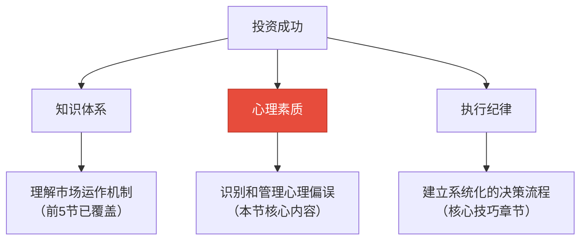
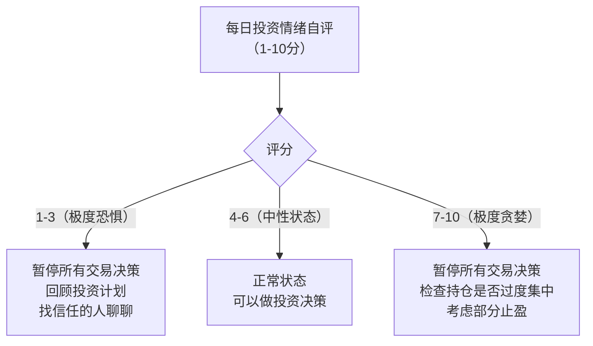

## 5.6 投资的心理学

> "投资中最大的敌人不是市场，而是你自己。" —— 沃伦·巴菲特

在前五节中，你已经理解了投资的本质（5.1）、风险与收益的关系（5.2）、复利的力量（5.3）、资产配置理论（5.4），以及各类投资工具（5.5）。你拥有了知识框架和工具箱，但一个严峻的事实是：**绝大多数投资者的失败，不是因为不懂工具，而是因为管不住自己。**

行为金融学（Behavioral Finance）的研究反复证明：人类的进化本能与理性投资之间存在系统性冲突。我们的大脑在非洲草原上进化出的生存机制——对损失的恐惧、对群体的追随、对确定性的渴望——在金融市场中变成了致命弱点。诺贝尔经济学奖得主丹尼尔·卡尼曼（Daniel Kahneman）的研究表明：**投资者因为心理偏误造成的年化收益损失，平均达到 1.5%~3%。** 对于一个投资 30 年、年化收益 8% 的投资者来说，这意味着最终资产缩水 30%~55%。

本节将系统剖析投资中的心理学机制，从认知偏误到情绪陷阱，从社会心理到决策框架，帮你建立一套完整的"心理防御体系"。

---

### 5.6.1 为什么心理学是投资的核心能力

#### 投资收益的"行为差距"

晨星（Morningstar）每年发布"投资者收益"（Investor Return）报告，对比基金的时间加权收益率和投资者的实际资金加权收益率。两者的差值就是"行为差距"（Behavior Gap）——投资者因为择时错误（追涨杀跌）而损失的收益。

根据晨星 2023 年的数据：

| 指标 | 过去 10 年年化 | 过去 20 年年化 |
|------|----------------|----------------|
| 美国股票基金平均收益 | 11.2% | 9.8% |
| 美国股票基金投资者实际收益 | 9.5% | 7.6% |
| **行为差距** | **-1.7%** | **-2.2%** |

中国市场的情况更加极端。根据好买基金研究中心的数据，2005-2020 年间，偏股型基金的年化收益率约为 16%，但基民的实际年化收益率仅为 8% 左右，行为差距高达 8 个百分点。这意味着一只基金涨了 10 倍，基民只赚了 3 倍。

#### 投资成功的三个支柱



知识是必要条件，但远非充分条件。一个精通金融理论的教授，如果在市场暴跌时恐慌抛售，其收益远不如一个什么都不懂但坚持定投 30 年的普通上班族。**心理素质是知识和纪律之间的桥梁**——它决定了你能否在压力下执行正确的决策。

---

### 5.6.2 认知偏误：大脑的系统性错误

认知偏误不是"犯傻"，而是人类大脑的固有特征。它们是进化过程中形成的"快速决策捷径"（启发式），在大多数生活场景中是高效的，但在金融市场中会系统性地导致错误判断。

#### 一、损失厌恶（Loss Aversion）

**机制解析：** 诺贝尔奖得主卡尼曼和特沃斯基的前景理论（Prospect Theory）发现：人们对损失的感受强度是等额收益的 2~2.5 倍。亏损 1 万元的痛苦，需要盈利 2~2.5 万元才能抵消。

**在投资中的表现：**

- **过早卖出盈利股票**（"落袋为安"心理）：赚了 20% 就急着卖，因为害怕利润回吐
- **死扛亏损股票**（"回本再说"心理）：亏了 30% 不舍得割肉，因为"卖掉就变成真实亏损了"
- **频繁查看账户**：越频繁查看，看到亏损的概率越大（短期波动），情绪波动越大

**真实案例：** 假设你持有两只股票——A 股票盈利 5000 元，B 股票亏损 5000 元。根据前景理论，你需要卖出的"心理冲动"是：卖掉 A（锁定收益，获得快乐）+ 持有 B（避免确认损失的痛苦）。这就是"处置效应"（Disposition Effect）。但理性分析可能是：如果 B 的基本面恶化了，你应该卖 B；如果 A 还有上涨空间，你应该持有 A。

**对抗方法：**

1. **预设止损止盈点**：买入前就确定卖出条件，写在纸上。比如"跌破买入价 15% 止损，达到目标价盈利 50% 止盈"。
2. **用"成本归零"思维**：问自己"如果我现在空仓，我还会买入这只股票吗？"如果答案是否定的，就应该卖出，不管当前是盈是亏。
3. **降低查看频率**：长期投资者每周或每月查看一次账户即可。研究显示，每天查看账户的投资者比每月查看的投资者，交易频率高 3 倍，收益低 2 个百分点。

#### 二、锚定效应（Anchoring Effect）

**机制解析：** 人们在做判断时，会过度依赖第一个接触到的信息（"锚"），即使这个信息与当前决策无关。

**在投资中的表现：**

- **买入价锚定**："这只股票我 50 元买的，现在 40 元，等回到 50 元我就卖。"——但 50 元可能与这只股票的真实价值毫无关系。
- **历史高点锚定**："这只股票最高到过 100 元，现在才 60 元，肯定能回到 100。"——历史高点不代表合理估值。
- **分析师目标价锚定**："分析师说目标价 80 元，现在才 50 元，买入！"——分析师的目标价同样可能是错的。

**真实案例：** 2021 年初，GameStop（GME）股价从 20 美元暴涨到 483 美元。很多投资者在 300 美元时买入，他们的"锚"是 483 美元的高点——"从 483 回落到 300，肯定能再涨回去"。结果 GME 最终跌回 15 美元左右，这些投资者亏损超过 95%。

**对抗方法：**

1. **建立独立估值框架**：不看买入价，用基本面指标（市盈率、市净率、现金流折现）判断当前价格是否合理。
2. **问"假设性问题"**：如果我从未持有这只股票，以当前价格我会买入吗？
3. **使用相对估值**：不是和自己的买入价比，而是和同类资产、历史中位数、无风险收益率比。

#### 三、确认偏误（Confirmation Bias）

**机制解析：** 人们倾向于寻找、解读和记忆支持自己已有观点的信息，同时忽略或贬低与之矛盾的信息。

**在投资中的表现：**

- **选择性阅读**：看好某只股票后，只关注利好新闻，对利空消息视而不见或找理由反驳
- **社交圈子效应**：只和同样看好这只股票的人交流，形成"信息茧房"
- **事后合理化**：股价上涨了，说"我早就知道会涨"；股价下跌了，说"这是暂时的调整"

**真实案例：** 2020-2021 年，很多投资者重仓教育股（好未来、新东方等）。当"双减"政策的消息开始传出时，他们选择性地关注"政策不会那么严""影响有限"的分析，忽略了"学科类培训可能被全面禁止"的预警信号。结果政策落地后，这些股票暴跌 90% 以上。

**对抗方法：**

1. **主动寻找反面论据**：每次做投资决策前，强迫自己花同样多的时间研究看空的理由。
2. **建立"魔鬼代言人"习惯**：找一个投资风格与你不同的人，在重大决策前听取他的意见。
3. **写下投资论据**：在买入时写下"我为什么买这只股票"的完整理由，定期回顾，检查哪些理由已经被证伪。

#### 四、过度自信（Overconfidence）

**机制解析：** 人们倾向于高估自己的知识准确性和预测能力。研究显示，当人们对自己的判断有 80% 的信心时，实际正确率只有 60%~70%。

**在投资中的表现：**

- **频繁交易**：过度自信的投资者交易更频繁，因为相信自己能把握每一次波动。但研究显示，交易频率最高的投资者，收益比交易频率最低的投资者低 7 个百分点（Barber & Odean, 2000）。
- **集中持仓**："我对这只股票非常有信心"导致重仓单只股票，忽略了黑天鹅事件的可能。
- **忽视下行风险**：只看到"可能会涨 100%"，看不到"可能会跌 80%"。

**对抗方法：**

1. **记录预测日志**：把每次对市场的预测（涨跌、幅度、时间）写下来，定期统计准确率。大多数人会发现自己的准确率远低于预期。
2. **使用概率思维**：不是"这只股票会涨"，而是"这只股票有 60% 的概率上涨 30%，40% 的概率下跌 20%"。
3. **强制分散化**：设定规则——任何单只股票不超过总资产的 5%，任何行业不超过 20%。

#### 五、可得性偏误（Availability Bias）

**机制解析：** 人们倾向于根据信息的"容易想起程度"来判断事件发生的概率。越生动、越近期、越情绪化的信息，越容易被想起，也越容易被高估概率。

**在投资中的表现：**

- **追热点**：媒体铺天盖地报道 AI 概念股，投资者高估 AI 行业的短期收益，忽视估值泡沫。
- **恐惧近期暴跌**：经历一次 20% 的暴跌后，投资者高估"市场随时会崩盘"的概率，长期持有过多现金。
- **幸存者偏差**：只看到巴菲特、张磊的成功案例，高估"选中牛股"的概率，看不到大量失败的基金经理。

**对抗方法：**

1. **回归数据**：用历史统计数据而非新闻头条做决策。比如"过去 100 年，美股在任何一年内下跌超过 20% 的概率约为 5%"。
2. **延迟决策**：看到一条引发强烈情绪的新闻后，强制等待 48 小时再做决策。
3. **多元化信息源**：不只看财经新闻，还要看学术论文、历史数据、不同立场的分析。

#### 六、从众效应（Herd Behavior）

**机制解析：** 人类是社会性动物，在不确定的环境中，跟随群体是进化赋予的生存策略。但在金融市场中，群体往往是错的——因为市场价格已经反映了群体的共识。

**在投资中的表现：**

- **追涨**：邻居、同事都在买某只股票，自己也跟着买
- **恐慌性抛售**：市场暴跌时，看到别人在卖，自己也跟着卖
- **错过独立判断**："大家都说好，应该不会错吧"

**真实案例：** 2015 年中国 A 股牛市中，从 3000 点到 5000 点，大量从未投资过股票的普通人开户入场。"全民炒股"成为社会现象，出租车司机、菜市场大妈都在讨论股票。当市场从 5178 点暴跌到 2850 点时，又出现恐慌性抛售，很多人在最低点附近割肉。从众效应让大多数人买在高点、卖在低点。

**对抗方法：**

1. **逆向思考**："当别人贪婪时恐惧，当别人恐惧时贪婪。"但逆向思考需要建立在独立分析的基础上，而不是简单地反着来。
2. **远离噪音**：在市场极端波动时，减少社交平台和论坛的使用，避免被群体情绪感染。
3. **制定"恐慌预案"**：在市场平静时，预先写下"如果市场暴跌 30%，我会怎么做"的具体计划。

---

### 5.6.3 情绪陷阱：恐惧与贪婪的循环

认知偏误是"思维模式"的错误，情绪陷阱则是"感受状态"的失控。两者经常同时出现，形成恶性循环。

#### 情绪周期与市场周期

市场心理学有一个经典模型：情绪周期往往领先于市场周期。


| 市场阶段 | 典型情绪 | 典型行为 | 结果 |
|----------|----------|----------|------|
| 牛市初期 | 怀疑、谨慎 | 观望，不敢入场 | 错过底部建仓机会 |
| 牛市中期 | 乐观、信心增强 | 开始入场，定投 | 获得较好收益 |
| 牛市末期 | 兴奋、贪婪 | 加大投入，借钱炒股 | 承担过度风险 |
| 市场顶部 | 狂热、极度自信 | "这次不一样"，满仓甚至加杠杆 | 即将遭受重大损失 |
| 下跌初期 | 否认、侥幸 | "只是回调"，加仓 | 损失扩大 |
| 下跌中期 | 恐惧、焦虑 | 频繁看账户，睡不着觉 | 精神压力极大 |
| 市场底部 | 绝望、投降 | "再也不炒股了"，全部清仓 | 卖在最低点 |
| 触底反弹 | 沮丧、麻木 | 不关注市场 | 再次错过底部 |

**关键洞察：** 大多数人在牛市中期入场（因为看到别人赚钱了），在市场底部离场（因为承受不了亏损），然后在下一轮牛市中期再次入场。这个循环让他们反复"买高卖低"。

#### 恐惧的具体表现与应对

**恐惧类型一：损失恐惧（Fear of Loss）**

这是最原始、最强大的投资恐惧。它源于损失厌恶，但在市场下跌时会被放大数倍。

具体表现：
- 市场下跌 5% 就开始焦虑
- 连续下跌 3 天就想清仓
- 完全无法执行既定的投资计划
- 用"这次不一样"来合理化恐慌行为

应对策略：
1. **回测你的投资组合**：用历史数据测试你的组合在 2008 年金融危机、2015 年 A 股股灾、2020 年新冠暴跌中的表现。如果你知道"最坏情况是亏损 40%，但 18 个月后恢复"，你就不会那么害怕。
2. **设定"最大可承受损失"**：在投资前，明确自己能承受多大的亏损。如果超过这个数字让你睡不着觉，说明你的仓位太重了。
3. **分批建仓**：不要一次性投入全部资金。分 6~12 个月逐步建仓，可以显著降低"买在最高点"的风险。

**恐惧类型二：错过恐惧（FOMO - Fear of Missing Out）**

当周围的人都在赚钱时，"害怕错过"会驱使人在不合适的时机入场。

具体表现：
- 看到朋友在某只股票上赚了 50%，立刻买入同一只
- 热门基金发行时抢购（"配售比例只有 10%，太抢手了"）
- 不做分析就跟着 KOL 的推荐买

应对策略：
1. **接受"不可能抓住所有机会"**：投资是一生的事业，不是一场赌博。错过一个机会，总会有下一个。
2. **回到你的投资计划**：问自己"这个机会符合我的投资策略和风险承受能力吗？"如果不符合，不管别人赚了多少，都不应该参与。
3. **设置"冷静期"**：当强烈的 FOMO 情绪出现时，强制等待一周。如果一周后你仍然想买，再重新分析。

**恐惧类型三：后悔恐惧（Fear of Regret）**

害怕做出错误决策导致后悔，导致投资者选择不行动。

具体表现：
- 明明分析好了该买入，但迟迟不敢下单
- 已经设置了止损点，但到了止损价又犹豫不决
- 不断推迟投资计划（"等市场跌一点再买""等我多学一点再投"）

应对策略：
1. **接受"不完美决策"**：不存在完美的投资时机。重要的是做出"足够好"的决策并坚持执行，而不是等待"完美"的决策。
2. **自动化执行**：设置自动定投，消除"要不要投"的决策压力。
3. **区分"可逆决策"和"不可逆决策"**：大多数投资决策都是可逆的（可以卖出），不需要过度恐惧。

#### 贪婪的具体表现与应对

**贪婪的渐进式升级：**

贪婪往往不是突然出现的，而是随着收益增加而逐步升级的：

```text
第一阶段：稳健收益 → "年化 8% 不错"
第二阶段：收益增长 → "10% 也做到了，15% 应该也可以"
第三阶段：过度自信 → "我对市场的理解比大多数人强"
第四阶段：风险忽视 → "借钱炒股，放大收益"
第五阶段：全押高风险 → "all in，这把稳了"
```

每个阶段的过渡看起来都"合理"，但累积起来就是灾难的前兆。

应对策略：
1. **设定"收益上限"思维**：不是设最低收益目标，而是设"当收益超过 X% 时，我要做什么"——通常是降低风险敞口（止盈/再平衡）。
2. **定期再平衡**：当某类资产因涨幅过大而超出目标配置比例时，强制卖出一部分，买入低配资产。这天然地实现了"卖高买低"。
3. **永远保留"安全垫"**：无论对市场多有信心，始终保持 20%~30% 的低风险资产（债券、货币基金、定期存款）。

---

### 5.6.4 社会心理与群体行为

投资不仅仅是个人行为，它发生在社会环境中。群体心理会对个体决策产生巨大影响。

#### 社会认同（Social Proof）

当不确定该怎么做时，人们会参考他人的行为。在投资中，这意味着：

- **热门基金效应**：规模最大的基金往往是因为"大家都在买"，而不是因为"业绩最好"。但投资者倾向于买入规模大的基金，因为"这么多人买，应该没问题"。
- **社区共识**：在投资论坛（雪球、集思录、东方财富股吧）中，如果一个观点获得大量点赞和认同，你会不自觉地认为它是对的。但论坛中的"共识"往往是错误的——因为如果大家都是对的，市场价格已经反映了这个信息。
- **权威效应**：巴菲特说了一句话，投资者就把它当作投资准则。但巴菲特的投资环境（资金规模、信息渠道、风险承受能力）和普通投资者完全不同。

#### 社会比较（Social Comparison）

人们会不自觉地和周围的人比较投资收益。这种比较会：

- **扭曲风险偏好**：看到同事一年赚了 50%，你可能会提高自己的风险水平以"追赶"。
- **产生嫉妒心理**：别人赚了你没赚到，比自己亏钱还难受。这种心理会导致"报复性交易"——为了证明自己也能赚钱而做出非理性决策。
- **模糊投资目标**：你的投资目标是"20 年后攒够退休金"，但社会比较让你把目标变成了"收益率超过同事老王"。

**对抗方法：**
1. **只和自己比**：你的参照系应该是自己的投资计划和长期目标，而不是他人的收益。
2. **减少社交炫耀**：不要在朋友圈晒投资收益，也不要过多关注他人的晒单。
3. **理解"幸存者偏差"**：你看到的晒收益的人，往往是赚了钱的人。亏钱的人不会出来说，所以你的样本是严重偏斜的。

#### 叙事经济学（Narrative Economics）

诺贝尔奖得主罗伯特·席勒（Robert Shiller）提出：经济行为很大程度上受"叙事"（故事）驱动，而非理性分析。

在投资中，叙事的力量体现在：

- **"这次不一样"叙事**：每次泡沫都有一个动人的故事。2000 年是"互联网改变一切"，2008 年是"房价永远涨"，2021 年是"元宇宙/Web3/去中心化"。
- **"颠覆者"叙事**：特斯拉不只是汽车公司，是"能源革命"；茅台不只是白酒，是"中国消费升级"。好的叙事让人忽略估值的合理性。
- **"稀缺性"叙事**：比特币只有 2100 万枚、核心城区土地有限、茅台产量有限……稀缺性叙事放大了 FOMO 情绪。

**对抗方法：**
1. **区分"好故事"和"好投资"**：一个公司可以有伟大的愿景，但股价可能已经透支了未来 20 年的增长。
2. **量化叙事**：把"这个故事"转化为具体数字——"按照这个叙事，公司的收入需要每年增长 50% 持续 10 年，市盈率需要保持在 100 倍。这现实吗？"
3. **研究历史叙事**：读一读历史上那些失败的叙事（郁金香泡沫、南海泡沫、互联网泡沫），你会发现每个叙事在当时都"非常有说服力"。

---

### 5.6.5 决策框架：用系统对抗人性

认识到偏误的存在只是第一步。真正的改变需要建立系统化的决策框架，用"流程"替代"感觉"。

#### 投资检查清单（Investment Checklist）

在做出任何投资决策前，使用检查清单可以有效对抗多种偏误。以下是经过实践验证的清单框架：

**买入前检查清单：**

```text
□ 基本面分析
  - 这家公司的商业模式是什么？我能用一句话解释清楚吗？
  - 过去 5 年的营收和利润增长率如何？
  - 护城河（竞争优势）是什么？可持续吗？
  - 管理层是否值得信赖？有没有重大诚信问题？

□ 估值分析
  - 当前市盈率/市净率相对于历史中位数是高还是低？
  - 相对于同行业公司，估值是否合理？
  - 按照当前增长速度，多少年能回本？

□ 风险评估
  - 最坏情况是什么？我可能亏损多少？
  - 这笔投资占总资产的比例是多少？（单只不超过 5%）
  - 如果这只股票停牌 3 年，我能接受吗？

□ 心理检查
  - 我是被 FOMO 驱动的吗？
  - 我有没有主动寻找反面论据？
  - 我的投资理由是基于数据还是基于叙事？
```

**卖出前检查清单：**

```text
□ 触发条件
  - 是否达到了预设的止损/止盈点？
  - 公司基本面是否发生了实质性恶化？
  - 是否有更好的投资机会（机会成本）？

□ 心理检查
  - 我卖出是因为恐惧还是因为分析？
  - 我是否被"损失厌恶"或"锚定效应"影响？
  - 如果我现在空仓，我还会买入吗？
```

#### 情绪温度计

建立一个简单的情绪监控机制，帮助你识别情绪状态：



**操作规则：**

- 当情绪评分低于 3 或高于 7 时，暂停一切交易操作
- 记录每次情绪极端时的市场情况和自己的想法
- 每月回顾情绪记录，寻找自己的情绪模式（比如"我总是在市场连跌 3 天后恐慌"）

#### 预承诺策略（Pre-commitment Strategy）

预承诺是指在冷静状态下，提前为未来可能的情绪化决策制定规则。核心思想是：**在你最清醒的时候为最不清醒的自己做决定。**

**具体做法：**

1. **写下"投资宪法"**：在市场平静时，写下你的投资原则和规则。比如：
   - "我永远不借钱炒股"
   - "任何单只股票不超过总资产的 5%"
   - "市场暴跌超过 20% 时，我将启动定投加仓计划"
   - "我不在情绪极端时做任何交易"

2. **设置自动执行机制**：定投、再平衡、止盈止损都可以自动化。减少需要做决策的次数，就是减少犯错的机会。

3. **找一个"问责伙伴"**：和一个理性的朋友约定，在你想要违反投资规则时，先和他商量。一个局外人往往能更客观地评估你的决策。

#### 决策日志

记录每一次投资决策的过程和结果，包括：

- **日期和市场环境**
- **决策内容**：买入/卖出/持有什么
- **决策理由**：为什么做这个决定
- **当时的情绪状态**：用 1-10 分评估
- **预期结果**
- **实际结果**（一个月后、三个月后、一年后分别填写）

定期回顾决策日志，你会发现：
- 你在什么情绪状态下做出的决策质量最高
- 你有哪些重复犯的错误
- 你的哪些投资直觉是准确的，哪些是系统性偏差

---

### 5.6.6 不同投资阶段的心理挑战

投资者在不同阶段面临不同的心理挑战，需要不同的应对策略。

#### 新手期（0-2 年）：无知者无畏

**心理特征：**
- 过度自信："投资不就是低买高卖嘛"
- 缺乏风险意识：只看到收益，看不到风险
- 追涨杀跌：因为没有经历过完整的市场周期

**常见陷阱：**
- 初次投资就赚钱，觉得自己是"天选之子"
- 开始使用杠杆（融资融券、期权）放大收益
- 忽视学习，认为"实战经验"比理论重要

**建议：**
- 用小资金（不超过可投资资产的 10%）实践
- 认真记录每一笔交易和理由
- 设定"学费预算"——告诉自己"前两年亏的钱都是学费"

#### 成长期（2-5 年）：过度优化

**心理特征：**
- 开始学习各种分析方法，但知道得越多越焦虑
- 频繁调整策略：这个月学技术分析，下个月学价值投资
- 对"错过"的敏感度增加

**常见陷阱：**
- 追求"完美策略"：试图找到一个永远赚钱的方法
- 信息过载：关注太多投资信息，反而无法做决策
- 过度交易：因为"知道得多了"而更频繁操作

**建议：**
- 选定一个投资策略，坚持至少 1 年不换
- 减少信息输入——选 2-3 个可靠的信息源即可
- 把注意力从"如何赚更多"转移到"如何不亏大钱"

#### 成熟期（5 年以上）：倦怠与自满

**心理特征：**
- 经历过完整的牛熊周期，对市场有了深刻理解
- 可能产生"经验主义"——用过去的经验过度类比新情况
- 可能出现投资倦怠——对投资失去兴趣，不再更新知识

**常见陷阱：**
- 忽视市场变化：2020 年后的市场和 2010 年后的市场可能有很大不同
- 过度自信："我经历过 2015 年股灾，什么没见过"
- 忽视再平衡：因为"懒得动"而让组合偏离目标配置

**建议：**
- 每年回顾一次投资策略，检查是否需要更新
- 保持学习——关注新的投资工具和市场变化
- 定期做"压力测试"——如果市场出现你没见过的情况，你的组合会怎样？

---

### 5.6.7 建立长期投资的心理韧性

心理韧性不是天生的，是可以培养的。以下是一套经过验证的心理韧性培养方法。

#### 认知重构（Cognitive Reframing）

改变对投资事件的解读方式，直接影响情绪反应。

| 原始认知 | 重构后的认知 |
|----------|-------------|
| "我亏了 2 万，我是个失败的投资者" | "这 2 万是学费，让我学到了什么" |
| "市场暴跌，太可怕了" | "市场暴跌提供了便宜买入的机会" |
| "别人赚了我没赚到" | "我的目标是长期收益，不是短期比较" |
| "我应该在最高点卖出" | "没有人能持续准确预测最高点和最低点" |
| "这只股票跌了 50%，完了" | "如果基本面没变，下跌只是暂时的价格波动" |

#### 正念与投资

正念（Mindfulness）在投资中的应用越来越被重视。桥水基金的创始人瑞·达利欧（Ray Dalio）就公开表示冥想对他投资决策的帮助。

**核心练习：**

1. **暂停呼吸法**：在做任何投资决策前，先做 5 次深呼吸（吸 4 秒、屏 4 秒、呼 4 秒）。这能激活副交感神经系统，降低情绪反应的强度。

2. **身体扫描**：当你查看投资账户或考虑交易时，注意身体的感受——心跳是否加速？肩膀是否紧绷？手心是否出汗？这些身体信号往往比意识更早捕捉到情绪变化。

3. **观察者视角**：想象自己是一个旁观者，在观察"一个投资者正在考虑卖出"。从第三方视角审视自己的决策，往往能更客观。

#### 长期视角的培养

**实用技巧：**

1. **看月线图而非日线图**：把股票软件的默认图表从日 K 线切换为月 K 线。从月线图看，大多数剧烈波动都变成了微小的噪音。

2. **计算"不看账户"的收益**：统计一下，如果你在过去一年中完全不看账户（买入后持有不动），你的收益是多少？和你的实际收益比一比。

3. **写给未来的自己**：在市场平静时，给"未来恐慌时的自己"写一封信。告诉自己为什么要坚持长期投资，为什么不应该在暴跌时卖出。把这封信放在一个容易找到的地方，在恐慌时拿出来读。

---

### 5.6.8 投资心理学的常见误区

#### 误区一："我是理性的人，不会受情绪影响"

**真相：** 没有人是完全理性的。卡尼曼的研究表明，人类的决策过程天然包含"系统 1"（快速、直觉、情绪化）和"系统 2"（慢速、理性、分析性）。即使是最专业的投资者，也会受到情绪影响。差别在于，专业投资者建立了"系统 2"的检查机制来纠正"系统 1"的偏差。

**纠正：** 接受自己会受情绪影响的事实，然后建立系统化的机制来对抗它（检查清单、预承诺、自动执行）。

#### 误区二："学习了心理学知识就能避免犯错"

**真相：** 知道偏误的存在，不等于能避免它。就像知道近视的原理不能治好近视一样。认知偏误是人类大脑的"硬件特征"，不是"软件 bug"——你不能通过"知道"来修复它。

**纠正：** 知识是第一步，但更重要的是建立"外部系统"——自动化规则、检查清单、问责伙伴。这些外部系统可以在你"内部系统"失灵时提供保护。

#### 误区三："情绪管理就是压制情绪"

**真相：** 压制情绪（"我不能害怕""我不能贪婪"）不仅无效，还会适得其反——越压制，反弹越强。情绪管理不是消除情绪，而是识别情绪、接纳情绪、然后在情绪存在的情况下做出理性决策。

**纠正：** 当恐惧出现时，不要说"我不应该害怕"，而是说"我现在感到恐惧，这是正常的。让我暂停交易，等情绪平复后再做决定。"

#### 误区四："投资心理学只对新手有用"

**真相：** 经验丰富的投资者面临的心理挑战可能更大。他们的过度自信往往建立在"我经历过很多"的基础上，反而更难察觉自己的偏误。2008 年金融危机中，很多有 20 年经验的老手也遭受了重大损失，因为他们认为"这次和以前一样"。

**纠正：** 无论投资经验多丰富，都需要持续保持心理警惕。定期回顾自己的决策日志，保持学习和反思的习惯。

#### 误区五："别人的心理问题很明显，我是清醒的"

**真相：** 这本身就是一种偏误——"盲点偏误"（Bias Blind Spot）。研究显示，人们在了解了各种偏误后，更容易发现别人的偏误，却更难发现自己的。就像司机总是认为自己的驾驶水平高于平均水平一样。

**纠正：** 用客观的、可量化的方式评估自己的投资行为（比如决策日志），而不是依赖自我感觉。

---

### 5.6.9 延伸阅读与工具推荐

#### 经典书籍

| 书名 | 作者 | 核心内容 | 适合人群 |
|------|------|----------|----------|
| 《思考，快与慢》 | 丹尼尔·卡尼曼 | 人类决策的双系统理论 | 所有投资者 |
| 《助推》 | 理查德·塞勒 | 如何设计环境促进理性决策 | 想改善投资习惯的人 |
| 《投资中最简单的事》 | 邱国鹭 | 价值投资的心理学视角 | A 股投资者 |
| 《行为投资学手册》 | 詹姆斯·蒙蒂尔 | 系统性的行为金融学指南 | 有一定基础的投资者 |
| 《穷查理宝典》 | 彼得·考夫曼 | 查理·芒格的多元思维模型 | 进阶投资者 |
| 《金钱心理学》 | 摩根·豪塞尔 | 财富与人性的关系 | 所有人 |

#### 自检工具

**投资心理偏误自测清单：**

每月花 10 分钟回答以下问题，回答"是"越多，说明你需要加强心理建设：

```text
□ 我这个月因为"大家都在买"而买入了某只股票/基金
□ 我这个月因为"害怕错过"而匆忙做了投资决策
□ 我这个月因为恐惧而在亏损时卖出了投资品
□ 我这个月频繁查看了投资账户（超过每周一次）
□ 我这个月在做投资决策时没有写下理由
□ 我这个月主动寻找过反对自己观点的论据吗？（没有=是）
□ 我这个月因为社交媒体上的信息做了投资决策
□ 我这个月对自己的投资能力比上个月更有信心了（过度自信信号）
□ 我这个月违反了自己的投资计划或规则
□ 我这个月因为投资的事情失眠或焦虑过
```

---

### 5.6.10 本节总结

投资心理学的核心要点可以浓缩为三句话：

1. **你的大脑不是为投资设计的**——进化赋予的本能反应（恐惧、贪婪、从众、过度自信）在金融市场中会系统性地导致错误决策。这些不是"性格缺陷"，而是"硬件特征"。

2. **知道不等于做到**——了解偏误是第一步，但真正的保护来自外部系统：检查清单、预承诺策略、自动化执行、情绪监控、决策日志。

3. **投资是一场终身的心理修炼**——不存在"一劳永逸"的解决方案。随着投资经验的增加，你面临的心理挑战也会变化。持续的自我观察、反思和调整，是长期投资成功的心理基础。

记住巴菲特的搭档查理·芒格的话：**"知道自己会在哪里死去，就不要去那里。"** 在投资中，大多数人的"死亡之地"不是复杂的金融工程，而是自己内心的恐惧和贪婪。识别这些"死亡之地"，然后系统性地避开它们——这就是投资心理学的全部意义。

> 下一节我们将进入投资工具的深度分析（5.7），在拥有了知识框架和心理防御体系之后，你已经准备好深入了解每一个具体的投资品类了。
