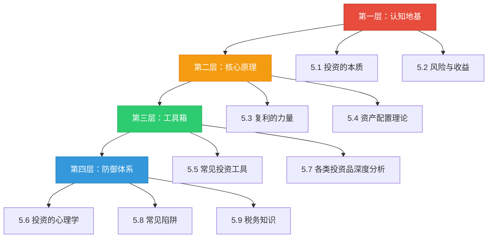
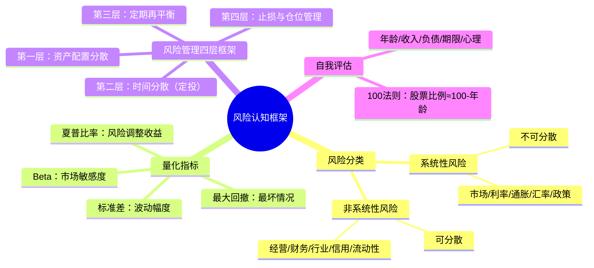
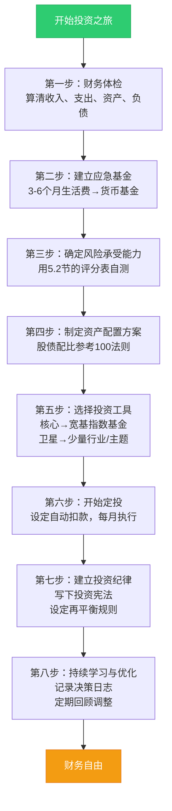
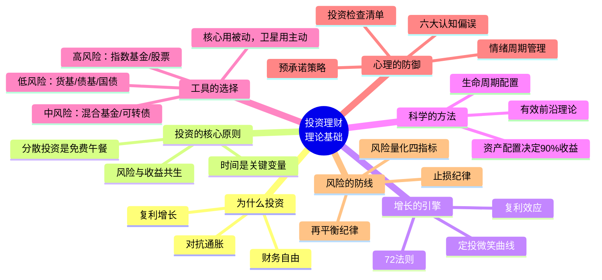

## 理论基础 · 全章总结

> 本章是整本书"投资理财基础"篇的理论根基。从投资的本质出发，经过风险与收益、复利、资产配置、投资工具、投资心理学、投资品分析、常见陷阱和税务知识，构建了一套完整的投资认知框架。本节将全章的核心知识体系化梳理，帮助你把零散的知识点串联成一张可以指导实践的认知网络。

---

### 一、全章知识体系总览

本章共10节，可以划分为四个递进层次：

**层次逻辑**：先建立正确的认知（投资是什么、风险是什么），再理解增长引擎（复利）和科学方法（资产配置），然后掌握具体工具（各类投资品），最后建立心理防御和风险防线。这个顺序不可颠倒——没有前两层的地基，后面的工具越多越危险。

---

### 二、核心知识点提炼

#### 2.1 关于"投资的本质"（5.1节）

**一句话总结**：投资是用今天的确定性换明天的不确定性，通过持有优质资产分享经济增长的果实。

本节建立的四个核心认知：

| 认知维度 | 核心观点 | 为什么重要 |
|----------|----------|-----------|
| **投资的定义** | 投入当前资源→配置到资产中→期望未来回报 | 看清投资与投机/赌博的本质区别，避免"博傻"行为 |
| **回报的来源** | 经济增长+通胀+股息利息+估值变化（前三个是正和，最后一个是零和） | 明确该赚什么钱——长期持有赚企业成长的钱，而非短线博弈赚别人亏的钱 |
| **为什么要投资** | 对抗通胀（不投资=确定性亏损）+ 复利增长 + 通往财务自由 | 理解"不投资"的风险比"投资"的风险更大 |
| **三大原则** | 风险与收益共生、时间是关键变量、分散投资是免费午餐 | 这三条是投资世界的"牛顿定律"，违背必付代价 |

**关键数据锚点**：
- 100万元现金按3%通胀放30年，实际购买力仅41万
- 10万元按8%年化投资30年，终值约100.6万
- 4%法则：年开支×25 = 财务自由所需本金
- 沪深300自2005年以来，任何连续持有10年以上的投资者都获得了正收益

#### 2.2 关于"风险与收益"（5.2节）

**一句话总结**：高收益必然伴随高风险，理解并量化风险是理性投资的前提。

本节构建的风险认知框架：

**关键数据锚点**：
- 夏普比率 > 1.0 为优秀，> 2.0 极为罕见
- 亏损50%需要涨100%才能回本——控制回撤比追求收益更重要
- 持有20-30只低相关股票可消除约80-90%的非系统性风险
- 中国市场散户占比高、政策调控频繁，需要额外关注A股特有的风险因素

#### 2.3 关于"复利的力量"（5.3节）

**一句话总结**：复利是时间的函数——本金、收益率、时间三个变量中，时间和收益率的敏感性远高于本金。

**三要素的敏感性对比**（基准：10万本金，8%收益率，30年，终值100.6万）：

| 调整项 | 调整方式 | 终值变化 | 增幅 |
|--------|----------|----------|------|
| 本金+20% | 12万 | 120.7万 | +20% |
| 收益率+20% | 9.6% | 155.6万 | +55% |
| 时间+20% | 36年 | 159.1万 | +58% |

**关键工具**：
- **72法则**：翻倍时间 ≈ 72 ÷ 年化收益率（%），8%收益约9年翻倍
- **115法则**：三倍时间 ≈ 115 ÷ 年化收益率
- **定投公式**：终值 = 每期投入 × ((1+r)^n - 1) / r
- **微笑曲线**：定投在下跌时自动买入更多份额，拉低平均成本

**实践启示**：
- 25岁开始月投1000元（年化8%），60岁约203万；晚5年开始少67万
- 收益率从7%提升到10%（仅3个百分点），30年终值从76万飙升到175万
- 复利的前提是"不中断"——每一次恐慌卖出都在打断指数增长

#### 2.4 关于"资产配置"（5.4节）

**一句话总结**：资产配置决定了90%以上的投资收益差异，是投资决策中最重要的一环。

**理论基石**：

| 理论 | 提出者 | 核心贡献 | 实践意义 |
|------|--------|----------|----------|
| **现代投资组合理论（MPT）** | 马科维茨（1952） | 通过配置低相关资产可在不降低收益的前提下降低风险 | 分散投资的数学证明 |
| **资本资产定价模型（CAPM）** | 夏普等（1960s） | 只有系统性风险才能获得补偿，Alpha极难持续 | 持有市场指数基金是最优策略 |
| **有效前沿** | 马科维茨 | 在同等风险下收益最高、同等收益下风险最低的组合集合 | 配比很重要，不是随便分散就行 |

**六大核心资产类别的角色定位**：

| 资产类别 | 核心角色 | 预期年化收益 | 与A股相关性 | 配置建议 |
|----------|----------|-------------|------------|----------|
| 股票 | 增长引擎 | 8-12% | 1.00 | 核心配置 |
| 债券 | 稳定器、减震器 | 3-5% | -0.10 | 必配 |
| 现金/货币 | 流动性储备 | 1.5-3% | 0.00 | 保留3-6个月开支 |
| 黄金 | 避险工具 | 5-8% | 0.05 | 5-15% |
| 房产/REITs | 实物资产+租金 | 5-8% | 0.25 | 视情况 |
| 另类投资 | 分散化 | 不确定 | 低 | 高净值者适量 |

**配置策略选择**：
- **战略配置（SAA）**：设定长期目标配比，定期再平衡——适合大多数人
- **战术配置（TAA）**：在战略配比基础上小幅偏离——需要较强判断力
- **核心-卫星模型**：70-80%被动指数（核心）+ 20-30%主动/行业/个股（卫星）——最推荐
- **生命周期配置**：随年龄增加逐步降低股票比例——100/110/120法则

#### 2.5 关于"投资工具"（5.5节 + 5.7节）

**一句话总结**：工具是策略的载体——先定配置，再选工具，而不是反过来。

**按风险等级排列的工具全景图**：

| 风险等级 | 工具 | 起投金额 | 流动性 | 适合场景 |
|----------|------|----------|--------|----------|
| R1 极低 | 货币基金、银行存款、国债 | 0.01元起 | 高 | 应急资金、短期存放 |
| R2 低 | 短债基金、中长期纯债基金、R2银行理财 | 1元起 | 中-高 | 稳健配置、降低波动 |
| R3 中 | 混合基金、二级债基、可转债 | 10元起 | 中 | 平衡增长与安全 |
| R4 中高 | 指数基金、股票基金、黄金ETF | 10元起 | 中-高 | 长期增长核心 |
| R5 高 | 个股、期货、期权、加密货币 | 因品种而异 | 因品种而异 | 需专业知识，新手慎入 |

**投资工具选择的核心原则**：
- **先被动后主动**：80-90%的主动基金长期跑不赢指数，核心仓位用低成本指数基金
- **先宽基后行业**：沪深300/中证500/标普500先配好，再考虑行业/主题基金
- **先国内后国际**：A股打底，逐步配置港股和美股实现地域分散
- **费率敏感**：1.5%的管理费在30年里会侵蚀超过30%的总收益

#### 2.6 关于"投资心理学"（5.6节）

**一句话总结**：投资中最大的敌人不是市场，而是你自己的大脑——行为差距平均每年吞噬1.5%-3%的收益。

**六大核心认知偏误速查表**：

| 偏误 | 机制 | 典型表现 | 对抗方法 |
|------|------|----------|----------|
| **损失厌恶** | 亏损的痛苦是盈利快乐的2-2.5倍 | 赚了急卖、亏了死扛 | 预设止损止盈、成本归零思维 |
| **锚定效应** | 过度依赖第一个信息 | 以买入价判断该不该卖 | 用基本面估值替代成本价参考 |
| **确认偏误** | 只看支持自己观点的信息 | 重仓后只看利好新闻 | 主动寻找反面论据、写下投资论据 |
| **过度自信** | 高估自己的判断能力 | 频繁交易、集中持仓 | 记录预测日志、强制分散 |
| **可得性偏误** | 容易想起的信息被高估概率 | 追热点、恐惧近期暴跌 | 回归数据、延迟48小时决策 |
| **从众效应** | 跟随群体行为 | 全民炒股时入场、暴跌时割肉 | 逆向思考、制定恐慌预案 |

**情绪周期与市场周期的对应关系**：

大多数人入场于牛市中期（看到别人赚钱了），离场于市场底部（扛不住了），循环"买高卖低"。

**建立心理防御的三个核心工具**：
1. **投资检查清单**：买入前逐项检查基本面、估值、风险、心理状态
2. **预承诺策略**：在冷静时写下"投资宪法"，为情绪化的自己提前做决定
3. **决策日志**：记录每一次决策的过程、情绪和结果，定期回顾发现自己的行为模式

---

### 三、贯穿全章的核心公式与法则

以下公式和法则是本章的"骨架"，建议熟记于心：

#### 3.1 必须掌握的公式

| 公式 | 表达式 | 用途 |
|------|--------|------|
| **复利终值** | FV = PV × (1+r)^n | 计算一次性投资的未来价值 |
| **定投终值** | FV = M × ((1+r)^n - 1) / r | 计算定期定额投资的未来价值 |
| **夏普比率** | SR = (Rp - Rf) / σp | 评估风险调整后的收益质量 |
| **72法则** | 翻倍时间 ≈ 72 / R | 快速估算资金翻倍所需年数 |
| **4%法则** | 所需本金 = 年开支 × 25 | 估算财务自由的目标金额 |
| **100法则** | 股票比例 ≈ 100 - 年龄 | 快速确定股债配比参考 |
| **组合方差** | σ²p = w₁²σ₁² + w₂²σ₂² + 2w₁w₂σ₁σ₂ρ₁₂ | 理解分散投资降低风险的数学原理 |

#### 3.2 必须牢记的经验法则

| 法则 | 内容 | 应用场景 |
|------|------|----------|
| **风险-收益正相关** | 高收益必然伴随高风险，没有例外 | 识别"高收益零风险"骗局 |
| **分散是免费午餐** | 低相关资产组合可在不降低收益的前提下降低风险 | 资产配置的基本逻辑 |
| **时间 > 收益率 > 本金** | 长期投资中，时间和收益率的敏感性远高于本金 | "尽早开始"比"攒够钱再投"更有效 |
| **控制回撤 > 追求收益** | 亏50%需涨100%才回本 | 止损纪律比选股能力更重要 |
| **被动 > 主动** | 80-90%的主动基金长期跑不赢指数 | 核心仓位用指数基金 |
| **纪律 > 技巧** | 坚持定投30年的普通人，收益超过频繁交易的"高手" | 行为差距每年1.5-3% |

---

### 四、本章常见误区总结

本章各节反复强调的误区，汇总如下以供自查：

| 误区 | 正确认知 | 出处 |
|------|----------|------|
| "投资是有钱人的事" | 货币基金1元起投，指数基金10元起投 | 5.1节 |
| "投资就是炒股" | 炒股是投机，投资是基于分析的长期持有 | 5.1节 |
| "等学够了再开始" | 等待损失复利累积，投资是"做中学" | 5.1节 |
| "低风险=没风险" | 银行存款面临通胀侵蚀，确定性亏购买力 | 5.2节 |
| "高风险一定赚大钱" | 高风险只是分布更广，可能赚100%也可能亏80% | 5.2节 |
| "分散就是买很多只股票" | 10只银行股不是分散，跨资产/跨行业/跨地域才是 | 5.2节 |
| "过去的收益代表未来" | 业绩回归均值是金融市场的铁律 | 5.2节 |
| "银行理财保本保收益" | 资管新规后已打破刚性兑付，2022年R2理财也出现过亏损 | 5.5节 |
| "频繁交易能赚更多" | 交易频率最高的投资者收益低7个百分点 | 5.6节 |
| "大家都买的肯定好" | 热门基金往往是因"大家都在买"而非"业绩最好" | 5.6节 |
| "这次不一样" | 每次泡沫都有动人的故事，结局都一样 | 5.6节 |

---

### 五、从理论到实践：行动路线图

理解了全部理论之后，以下是按优先级排列的行动步骤：

**给不同阶段读者的建议**：

| 读者类型 | 当前状态 | 首要行动 | 推荐阅读重点 |
|----------|----------|----------|-------------|
| **零基础入门** | 从未投资过 | 开一个基金账户，每月定投500元沪深300指数基金 | 5.1（本质）+ 5.3（复利） |
| **有存款无投资** | 银行里存了钱但没做任何投资 | 先把超出应急资金的部分转入货币基金，再逐步配置 | 5.1（通胀侵蚀）+ 5.5（工具选择） |
| **有投资但无体系** | 买过基金/股票但没有系统策略 | 暂停操作，先做风险评估，制定配置方案 | 5.2（风险评估）+ 5.4（资产配置） |
| **有经验想进阶** | 已经投资多年，想优化策略 | 检查组合是否符合有效前沿，审视行为差距 | 5.4（配置优化）+ 5.6（心理管理） |

---

### 六、一张图总结全章

---

### 七、延伸阅读与下一章预告

本章建立了投资理财的理论框架。理论是必要的，但投资终究是一门实践的艺术。在后续章节中，我们将从理论走向实操：

- **核心投资策略篇**：定投策略的完整实操、估值方法与择时技巧、不同市场环境下的应对方案
- **进阶篇**：个股分析方法论、基金筛选的完整流程、构建个人投资体系的完整步骤

带着本章的认知框架进入实操，你会发现自己不再是一个"凭感觉赌"的散户，而是一个"基于系统决策"的理性投资者。

> **最后记住一句话**：投资成功 = 正确的认知 × 合理的配置 × 长期的纪律。三者缺一不可，而认知排在第一位——这就是本章存在的意义。
