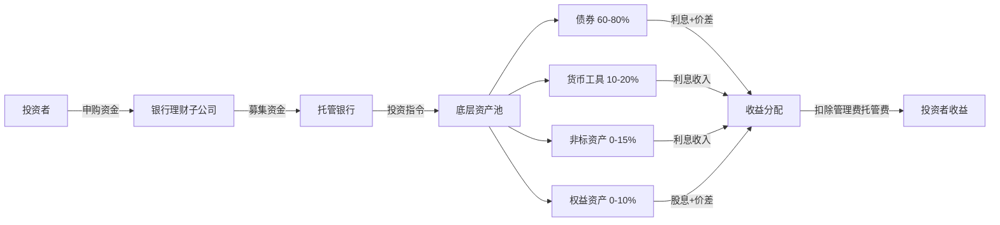
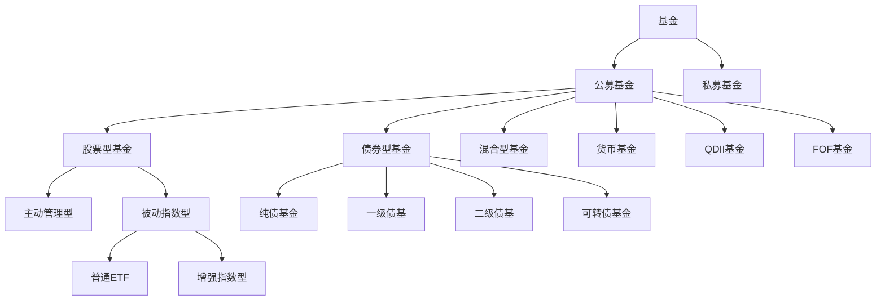
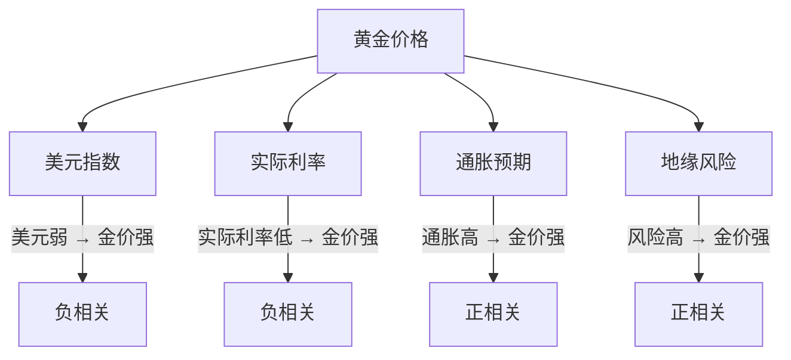
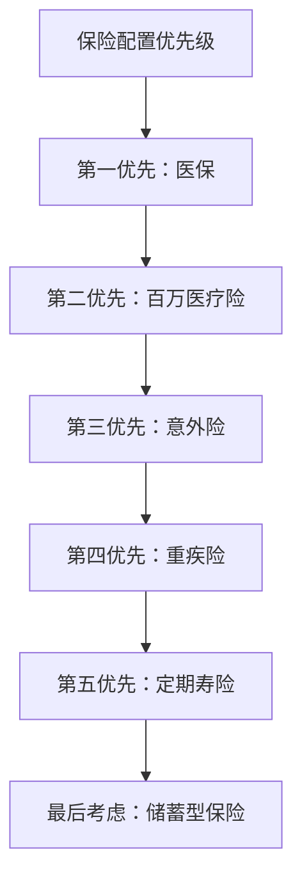
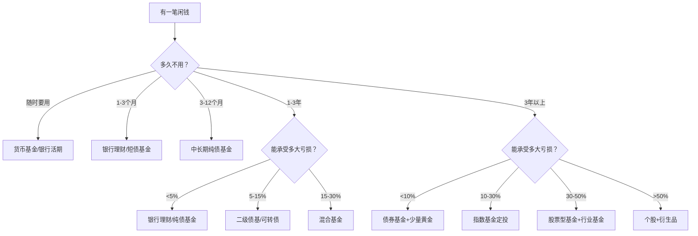

## 5.7 各类投资品深度分析

> "投资的本质不是选择工具，而是理解工具背后的逻辑。" —— 霍华德·马克斯

5.5节为你建立了投资工具的全景图，你知道了市场上有哪些工具、它们的基本特征是什么。但"知道"和"理解"之间隔着一道鸿沟。本节的目标是**跨越这道鸿沟**——对每一类主流投资品进行深度拆解，让你不仅知道它是什么，更理解它为什么这样运作、在什么环境下表现好、什么环境下会亏钱、以及专业投资者是如何驾驭它的。


---

### 5.7.1 银行理财产品深度分析

#### 银行理财的本质与运作机制

银行理财产品不是存款，而是**资产管理产品**。2022年1月1日资管新规全面落地后，银行理财彻底告别"保本保收益"时代，进入"净值化"管理。理解这个转变是正确使用银行理财的前提。

**运作链条拆解：**



**关键概念——净值化管理：**

资管新规前，银行理财采用"资金池"模式，用新投资者的钱兑付老投资者的收益，本质上是"借新还旧"。资管新规后，每只产品独立建账、独立核算，产品净值随底层资产价格波动。这意味着：

- 你看到的"年化收益3.5%"不再是承诺，而是过去的表现
- 产品净值可能跌破1元（即"破净"），你的本金会亏损
- 2022年11月债市大跌期间，超过3000只银行理财产品一度破净

#### 产品类型深度对比

| 维度 | 现金管理类 | 固定收益类 | 混合类 | 权益类 | 商品及衍生品类 |
|------|-----------|-----------|--------|--------|--------------|
| **投资范围** | 货币市场工具、短期债券 | 债券为主（≥80%） | 债券+股票+商品 | 股票为主（≥80%） | 黄金、原油等 |
| **风险等级** | R1 | R1-R2 | R3 | R4-R5 | R4-R5 |
| **历史年化** | 2.0-2.8% | 3.0-4.5% | 3.5-8% | -5%-15% | 波动极大 |
| **流动性** | 高（T+0/T+1） | 中低（有封闭期） | 低（通常封闭） | 低 | 低 |
| **起投金额** | 1元 | 1元 | 1元 | 1元 | 1元 |
| **典型持有期** | 随时 | 3个月-3年 | 6个月-3年 | 1年以上 | 1年以上 |
| **适合场景** | 活期资金管理 | 稳健增值 | 收益增强 | 进取投资 | 分散配置 |

#### 银行理财的核心风险

**1. 利率风险——债券价格与利率的跷跷板**

银行理财的底层资产以债券为主，债券价格与市场利率呈反向关系。当央行加息或市场利率上升时，存量债券价格下跌，理财产品净值随之下降。

量化理解：一只久期3年的债券基金，利率每上升0.25%，净值大约下跌0.75%。2022年11月，10年期国债收益率在两周内从2.65%飙升至2.85%，导致大量理财产品破净。

**2. 信用风险——底层债券违约**

虽然银行理财主要投资高信用等级债券，但"高信用"不等于"零风险"。2020年永煤违约事件、2022年地产债大面积暴雷，都波及了持有相关债券的理财产品。

**3. 流动性风险——封闭期的代价**

封闭式理财产品在到期前无法赎回。即使市场大幅下跌，你也只能"眼看着亏"。2022年底很多投资者发现，自己买的1年期理财破净了，但要3个月后才能赎回。

**4. 信息不透明风险**

虽然净值化改革提升了透明度，但很多理财产品仍然不公布详细的持仓信息。你不知道你的钱具体买了哪些债券，也就无法独立评估风险。

#### 选择银行理财的实操框架

**第一步：明确资金用途和期限**

| 资金用途 | 建议产品类型 | 持有期限 |
|---------|-------------|---------|
| 日常零用 | 现金管理类 | 随时 |
| 3个月内要用 | 最短持有期型（30天/60天） | 1-3个月 |
| 半年内闲置 | 稳固封闭型（90天/180天） | 3-6个月 |
| 1年以上不用 | 中长期封闭型或混合类 | 1年以上 |

**第二步：识别产品风险的真实水平**

不要只看产品标注的风险等级（R1/R2），要关注以下指标：

- **最大回撤**：过去1年净值从最高点到最低点的最大跌幅。R2产品如果最大回撤超过1%，说明风险可能被低估
- **夏普比率**：每承担1单位风险获得的超额收益。夏普比率>1说明性价比不错，<0.5说明收益不足以补偿风险
- **底层资产穿透**：在产品说明书中找到"投资范围"和"投资比例"，如果"非标资产"占比超过10%，流动性风险显著增加

**第三步：费率比较**

| 费用类型 | 典型水平 | 注意事项 |
|---------|---------|---------|
| 管理费 | 0.15%-0.5%/年 | 固收类通常0.15%-0.3%，混合类0.5%-1.0% |
| 托管费 | 0.02%-0.05%/年 | 差异不大 |
| 销售服务费 | 0-0.3%/年 | 有些产品不收，有些收0.15%-0.3% |
| 赎回费 | 0-0.1% | 部分产品持有不足期限收取 |

**费率陷阱**：有些产品表面管理费低，但通过"业绩报酬"（超额收益的20%归管理人）变相收费。看产品说明书中的"费用"章节，找到"业绩报酬计提"条款。

#### 银行理财与同类产品的横向对比

| 维度 | 银行理财 | 纯债基金 | 货币基金 | 国债 |
|------|---------|---------|---------|------|
| 收益水平 | 3-4.5% | 3-6% | 1.5-2.5% | 2.5-3% |
| 风险水平 | 低-中低 | 低-中 | 极低 | 极低 |
| 流动性 | 中低（有封闭期） | 高（T+1） | 高（T+0） | 低（持有到期） |
| 透明度 | 低 | 高（每日公布持仓） | 高 | 高 |
| 门槛 | 1元 | 10元 | 0.01元 | 100元 |
| 适合人群 | 不愿操心、追求省心 | 愿意学习、追求收益 | 管理零钱 | 极度保守型 |

**结论**：如果你愿意花一点时间学习，纯债基金在收益、透明度、流动性上全面优于银行理财。银行理财的核心优势是"省心"——不用自己选基金、不用关注净值波动。但"省心"的代价是更低的收益和更少的掌控感。

---

### 5.7.2 债券投资深度分析

#### 债券定价的核心原理

债券价格由三个因素决定：**票面利率、市场利率、剩余期限**。理解它们之间的关系，是债券投资的基本功。

**债券定价公式（简化版）：**

```text
债券价格 ≈ 票面价值 × (1 + 票面利率) / (1 + 市场利率)^剩余年限
```

当市场利率上升时，新发行的债券票面利率更高，存量债券的吸引力下降，价格下跌。反之亦然。

**久期——衡量利率敏感度的核心指标：**

久期（Duration）衡量的是债券价格对利率变动的敏感程度。简单理解：久期为5年的债券，利率每上升1%，价格大约下跌5%。

| 债券类型 | 典型久期 | 利率上升1%时价格变动 |
|---------|---------|-------------------|
| 货币基金 | <0.5年 | 几乎不变 |
| 短债基金 | 1-3年 | 下跌1-3% |
| 中长期纯债基金 | 3-5年 | 下跌3-5% |
| 长期国债 | 7-10年 | 下跌7-10% |

**实战应用**：如果你预期利率将上升，应缩短久期（买短债）；如果预期利率将下降，应拉长久期（买长债）。2024年中国处于降息周期，长债表现优异，30年期国债ETF年涨幅超过10%。

#### 各类债券的风险收益深度分析

**1. 国债——无风险利率的锚**

国债是以国家信用为担保的债券，在中国被视为"无风险资产"。但"无风险"指的是信用风险为零，不代表没有利率风险。

- **储蓄国债**：面向个人投资者，在银行柜台购买，持有到期。利率通常高于同期定期存款0.3-0.5个百分点。缺点是流动性差，提前兑付会损失部分利息
- **记账式国债**：在交易所或银行间市场交易，价格随市场波动。通过券商APP可直接购买。2024年30年期国债收益率一度跌破2.5%，创下历史新低
- **国债ETF**：跟踪国债指数的ETF基金，流动性好，交易方便。代表产品：十年国债ETF（511260）、30年国债ETF（511090）

**2. 地方政府债——信用略高于城投**

地方政府债由省级政府发行，信用等级仅次于国债。但要注意区分一般债和专项债：

- **一般债**：以一般公共预算收入偿还，信用更高
- **专项债**：以特定项目收益偿还，信用取决于项目质量

城投债虽然不是严格意义上的地方政府债，但市场普遍认为有地方政府隐性担保。2023年以来，部分弱资质城投债出现信用利差走阔，说明"信仰"正在松动。

**3. 企业债与公司债——信用风险的定价**

企业债的收益率 = 无风险利率 + 信用利差。信用利差反映的是市场对该企业违约概率的定价。

| 信用评级 | 信用利差（参考值） | 违约概率（历史统计） |
|---------|-----------------|-------------------|
| AAA | 0.5-1.0% | <0.1% |
| AA+ | 1.0-1.5% | 0.1-0.5% |
| AA | 1.5-2.5% | 0.5-2% |
| AA以下 | 3-8% | 2-10% |

**信用分析的核心指标：**

- **资产负债率**：超过70%的企业要警惕
- **经营性现金流**：持续为负的企业靠"借新还旧"维持
- **短期债务占比**：超过50%说明短期偿债压力大
- **利息覆盖倍数**：EBITDA/利息费用，低于2倍要警惕

**4. 可转债——进可攻退可守的特殊品种**

可转债是上市公司发行的、可以转换为股票的债券。它具有"债底保护+权益弹性"的双重特性：

- **债底保护**：即使正股大跌，可转债价格通常不会跌破面值太多（因为到期可以收回本金+利息）
- **权益弹性**：当正股上涨时，可转债价格会跟随上涨（但涨幅通常小于正股）

**可转债的关键指标：**

| 指标 | 含义 | 实战意义 |
|------|------|---------|
| 转股溢价率 | 转债价格相对转股价值的溢价 | 越低越有弹性，负溢价说明被低估 |
| 纯债价值 | 假设不转股，作为债券的价值 | 价格跌破纯债价值说明被严重低估 |
| 到期收益率 | 持有到期的年化收益率 | 为正说明有债底保护 |
| 转股价下修 | 公司下调转股价 | 对持有人利好，增加转股价值 |

**可转债策略：**

- **双低策略**：选择价格低（<110元）+转股溢价率低（<20%）的转债，既有安全边际又有弹性
- **打新策略**：参与可转债申购，中签后上市首日卖出，历史上大概率盈利（但2022年后破发增多）
- **摊大饼策略**：买入10-20只低价转债分散风险，赌其中几只触发强赎（价格涨到130元以上）

#### 债券投资的风险管理

**1. 利率风险管理**

- **哑铃策略**：同时持有短期和长期债券，短期提供流动性，长期提供收益
- **阶梯策略**：将资金均匀分布在1年、2年、3年、4年、5年到期的债券上，每年都有到期的债券可以再投资
- **子弹策略**：集中在某一期限的债券上，适合对利率走势有明确判断时使用

**2. 信用风险管理**

- **分散持仓**：单一债券持仓不超过组合的5%
- **评级筛选**：个人投资者建议只买AA+及以上评级的债券
- **行业分散**：避免过度集中于某一行业（如2021年的地产债集中暴雷）
- **关注评级变动**：评级下调通常预示信用恶化，应提前卖出

**3. 流动性风险管理**

- 避免持有日均成交额不足1000万的债券或债券基金
- 封闭式债券基金在封闭期内无法赎回，需确保资金期限匹配

---

### 5.7.3 股票投资深度分析

#### 股票的本质——你买的是什么

买股票不是买一个代码，而是买一家公司的**部分所有权**。你的收益来源有两个：

1. **股价上涨**（资本利得）：公司价值增长 → 股价上涨 → 你卖出获利
2. **分红**（股息收入）：公司把部分利润分给股东

**股价的决定因素（长期vs短期）：**

| 时间维度 | 主导因素 | 例子 |
|---------|---------|------|
| 短期（日-周） | 市场情绪、资金流动 | 概念炒作、游资拉升 |
| 中期（月-季） | 行业景气度、政策变化 | 新能源政策利好、地产调控 |
| 长期（年-十年） | 公司盈利能力（EPS增长） | 贵州茅台10年10倍 |

**估值的核心指标：**

| 指标 | 计算方式 | 含义 | 适用场景 |
|------|---------|------|---------|
| 市盈率PE | 股价/每股收益 | 多少年回本 | 盈利稳定的公司 |
| 市净率PB | 股价/每股净资产 | 相对净资产的溢价 | 银行、地产等重资产行业 |
| 市销率PS | 股价/每股营收 | 相对营收的估值 | 亏损但营收增长快的公司 |
| PEG | PE/盈利增长率 | 性价比 | 成长股估值 |
| 股息率 | 每股分红/股价 | 分红回报 | 高分红策略 |

**PE的历史分位数——判断贵不贵：**

不要用绝对PE判断贵不贵，要看当前PE在历史上的分位数位置：

- **0-20%分位**：便宜，可以逐步建仓
- **20-50%分位**：合理偏低，适合定投
- **50-80%分位**：合理偏高，谨慎投资
- **80-100%分位**：贵，考虑减仓

以沪深300为例，PE在10-12倍属于低估区间，12-14倍属于合理区间，14倍以上属于偏贵区间。

#### A股市场的结构性特征

理解A股的独特性，比理解"什么是股票"更重要。

**特征一：散户占比高，波动大**

A股散户交易量占比约60-70%，远高于美股的10-15%。散户为主的市场容易出现追涨杀跌、炒概念、炒小盘等现象，导致A股波动率显著高于成熟市场。

**特征二：政策驱动明显**

A股被称为"政策市"。一行一局一会（央行、金融监管总局、证监会）的政策表态，国务院的产业政策，都会对市场产生重大影响。2024年"9·24"行情就是典型的政策驱动上涨。

**特征三：牛短熊长**

A股历史上牛市平均持续12-18个月，熊市平均持续24-36个月。这意味着大部分时间市场是下跌或震荡的，真正的上涨窗口很短。择时在A股比在美股更重要。

**特征四：行业轮动剧烈**

A股的行业轮动速度远快于成熟市场。2020年是白酒、新能源，2021年是新能源、周期，2022年是煤炭、银行，2023年是AI、中特估，2024年是AI、低空经济。追热点往往成为"接盘侠"。

#### 股票投资的三种主流策略

**1. 价值投资——买便宜的好公司**

核心逻辑：以低于内在价值的价格买入优质公司，等待价值回归。

选股标准：
- ROE连续5年>15%（赚钱能力强）
- 资产负债率<60%（财务健康）
- 经营性现金流持续为正（赚的是真金白银）
- PE处于历史低位（价格便宜）
- 行业龙头或细分领域冠军

代表人物：巴菲特、张磊（高瓴资本）、但斌

**价值投资的陷阱：**

- **价值陷阱**：股票便宜是有原因的（行业衰退、管理不善）。便宜不等于低估
- **时间成本**：价值回归可能需要3-5年，你的资金被长期锁定
- **逆人性**：在市场恐慌时买入，需要极强的心理素质

**2. 趋势投资——顺势而为**

核心逻辑：不预测底部和顶部，只在趋势确立后跟进，在趋势反转后退出。

技术工具：
- **均线系统**：股价站上20日均线买入，跌破20日均线卖出
- **MACD**：金叉买入，死叉卖出
- **成交量**：放量突破有效，缩量突破无效

**趋势投资的陷阱：**

- **假突破**：股价短暂突破均线后回落，反复止损消耗本金
- **震荡市失效**：趋势策略在震荡市中会频繁触发买卖信号，反复亏钱
- **滞后性**：技术指标都是滞后指标，等信号确认时行情已走了一段

**3. 指数投资——不选股，买市场**

核心逻辑：不试图战胜市场，而是以最低成本获取市场平均收益。

为什么指数投资适合大多数人：
- A股约70%的主动基金长期跑输沪深300指数
- 指数基金费率低（管理费0.5% vs 主动基金1.5%）
- 不依赖基金经理的能力
- 天然分散，避免个股"黑天鹅"

**核心指数及适用场景：**

| 指数 | 代码 | 特征 | 适合场景 |
|------|------|------|---------|
| 沪深300 | 000300 | 大盘蓝筹，300只成分股 | 核心配置 |
| 中证500 | 000905 | 中盘成长，500只成分股 | 成长配置 |
| 中证1000 | 000852 | 小盘股，1000只成分股 | 进取配置 |
| 创业板指 | 399006 | 科技成长 | 行业配置 |
| 科创50 | 000688 | 硬科技 | 行业配置 |
| 恒生指数 | HSI | 港股大盘 | 跨市场配置 |
| 标普500 | SPX | 美股大盘 | 全球配置 |
| 纳斯达克100 | NDX | 美股科技 | 科技配置 |

#### A股交易的实操细节

**交易规则：**

| 规则 | 内容 |
|------|------|
| 交易时间 | 9:30-11:30, 13:00-15:00 |
| 涨跌幅限制 | 主板±10%，创业板/科创板±20%，北交所±30% |
| T+1制度 | 今天买的股票，明天才能卖 |
| 最低买入 | 100股（1手），科创板200股 |
| 印花税 | 卖出时0.05%（2023年下调） |
| 佣金 | 万1-万3（可与券商协商） |

**开户选择：**

- 选大券商（中信、华泰、国泰君安等），系统稳定、服务好
- 佣金谈到万1.5以下（资金量大的可以谈到万1）
- 开通创业板、科创板权限（需要2年交易经验+一定资产门槛）

---

### 5.7.4 基金投资深度分析

#### 基金的分类与选择逻辑

基金是最适合普通投资者的工具——专业管理、分散投资、门槛低。但基金的种类繁多，选错基金的代价比不投资还大。

**基金分类全景图：**



#### 指数基金——最值得深入的投资品种

**为什么指数基金是"最适合普通人的投资品"：**

1. **成本低**：管理费0.5%（ETF更低，0.15%），远低于主动基金的1.5%
2. **透明**：持仓就是指数成分股，完全公开
3. **不依赖基金经理**：避免了"选人"的难题
4. **长期表现好**：A股70%的主动基金长期跑输指数
5. **可预测**：你始终知道自己买了什么

**ETF vs 联接基金 vs 普通指数基金：**

| 维度 | ETF（场内） | ETF联接基金（场外） | 普通指数基金 |
|------|-----------|-------------------|-------------|
| 交易方式 | 券商APP，实时买卖 | 支付宝/天天基金，T+1 | 支付宝/天天基金，T+1 |
| 费率 | 最低（管理费0.15-0.5%） | 中等（多一层联接费） | 中等 |
| 跟踪误差 | 最小 | 较小 | 较小 |
| 起投金额 | 100元左右（1手） | 10元 | 10元 |
| 定投方便性 | 不方便（需手动操作） | 方便（自动定投） | 方便（自动定投） |
| 适合人群 | 有券商账户的投资者 | 没有券商账户的定投者 | 入门投资者 |

**宽基指数vs行业指数：**

- **宽基指数**（沪深300、中证500）：覆盖多个行业，风险分散，适合长期定投
- **行业指数**（新能源、半导体、医药）：集中在单一行业，波动大，适合有行业判断的投资者

**新手建议**：以宽基指数为核心（70-80%），行业指数为卫星（20-30%）。

#### 主动基金的选择方法

虽然指数基金是首选，但优秀的主动基金确实能创造超额收益。关键是如何在6000+只基金中找到那20%的好基金。

**选择主动基金的五维筛选法：**

| 维度 | 指标 | 标准 |
|------|------|------|
| 业绩 | 年化收益率 | 同类排名前30% |
| 稳定性 | 最大回撤 | <同类平均回撤 |
| 风险调整收益 | 夏普比率 | >1 |
| 基金经理 | 任职年限 | >3年，经历过牛熊 |
| 规模 | 基金规模 | 2-100亿（太小流动性差，太大难调仓） |

**基金经理的考察要点：**

- **从业年限**：至少经历过一轮完整的牛熊周期（5年以上）
- **管理规模**：规模过大（>300亿）会限制操作灵活性
- **投资风格**：价值型、成长型、均衡型——要和你的风险偏好匹配
- **持仓集中度**：前十大重仓股占比>60%说明风格激进
- **换手率**：年换手率>300%说明频繁交易，风格不稳定

#### 基金定投的科学方法

定投不是"无脑投"，需要科学的策略才能获得满意收益。

**普通定投vs智能定投：**

- **普通定投**：每月固定日期、固定金额。简单但不灵活
- **估值定投**：PE低于历史30%分位时加倍投，高于70%分位时减额或暂停
- **目标市值定投**：设定每月目标持仓市值，低于目标时补投，高于目标时少投或不投

**定投的止盈策略：**

定投赚钱的关键不是"投多久"，而是"什么时候卖"。

| 止盈方法 | 规则 | 优缺点 |
|---------|------|--------|
| 目标收益率 | 累计收益达20-30%时卖出 | 简单明确，但可能错过后续上涨 |
| 最大回撤止盈 | 从最高点回撤10%时卖出 | 能抓住大部分涨幅，但信号滞后 |
| 估值止盈 | PE高于历史70%分位时分批卖出 | 有逻辑依据，但估值可能长期高位 |
| 分批止盈 | 收益达20%卖1/3，达30%再卖1/3 | 平衡收益和风险 |

**定投的常见误区：**

- **误区一：定投不需要择时**。错。在市场高位开始定投，可能需要3-5年才能回本。在低估区域开始定投，收益天差地别
- **误区二：定投越久越好**。错。A股是周期性市场，不止盈的话收益会坐过山车
- **误区三：亏损时停止定投**。错。亏损恰恰是定投的"黄金期"——同样的钱能买到更多份额，拉低平均成本
- **误区四：只投一只基金**。错。即使是宽基指数，也应该分散配置2-3只不同风格的基金

---

### 5.7.5 黄金投资深度分析

#### 黄金定价的底层逻辑

黄金是一种特殊的资产——它不产生利息、不产生分红，它的价值完全来自**稀缺性共识**和**避险属性**。

**黄金价格的四大驱动力：**



**实际利率——黄金定价的核心变量：**

实际利率 = 名义利率 - 通胀预期

当实际利率为负时（即通胀高于利率），持有现金会贬值，黄金的"保值"属性凸显，金价上涨。2020-2022年全球实际利率深度为负，黄金价格从1500美元飙升至2000美元以上。

**央行购金——新变量：**

2022年以来，全球央行（尤其是中国、俄罗斯、印度等）大幅增持黄金储备，成为支撑金价的重要力量。2023年全球央行净购金1037吨，连续第二年超过1000吨。这一趋势的驱动力是"去美元化"——各国央行希望降低对美元资产的依赖。

#### 黄金投资方式的深度对比

| 维度 | 实物金条 | 纸黄金 | 黄金ETF | 黄金期货 | 积存金 | 黄金股 |
|------|---------|--------|---------|---------|--------|--------|
| **交易场所** | 银行/金店 | 银行 | 交易所 | 期货交易所 | 银行 | 股票市场 |
| **起投金额** | 10g起（约5000元） | 1g起 | 100元左右 | 约4万元/手 | 1g起 | 100股起 |
| **交易成本** | 买卖价差5-15元/g | 点差0.4-0.8元/g | 管理费0.5%/年 | 保证金10-15% | 买卖价差1-2元/g | 佣金万2-3 |
| **流动性** | 低（需回购渠道） | 高 | 高 | 高 | 中 | 高 |
| **杠杆** | 无 | 无 | 无 | 有（6-10倍） | 无 | 无 |
| **持有成本** | 保管费、保险 | 无 | 管理费 | 无 | 无 | 无 |
| **适合场景** | 长期持有、传承 | 短线交易 | 中长期配置 | 专业投机 | 定投 | 间接配置 |

**实物金条购买的注意事项：**

- 只买投资金条（纯度Au99.99），不要买工艺金条（溢价高）
- 银行金条的买卖价差通常在5-10元/g，金店可能更高
- 保留购买凭证和发票，回购时需要
- 银行回购通常只认本行售出的金条
- 存放银行保管箱每年约200-500元

**黄金ETF是大多数人的最优选择：**

- 交易方便：券商APP实时买卖
- 成本低：管理费0.5%/年，无买卖价差
- 流动性好：日均成交额数亿元
- 跟踪准确：紧密跟踪上海金交所金价
- 代表产品：华安黄金ETF（518880）、博时黄金ETF（159937）

#### 黄金在资产配置中的角色

**黄金的核心价值：与其他资产的低相关性**

| 资产组合 | 不含黄金年化波动率 | 含10%黄金年化波动率 | 波动率下降 |
|---------|------------------|-------------------|-----------|
| 60%股票+40%债券 | 12.5% | 11.2% | -10.4% |
| 80%股票+20%债券 | 16.8% | 15.1% | -10.1% |

加入10%的黄金，可以在几乎不降低收益的情况下显著降低组合波动。

**黄金的配置建议：**

- **保守型投资者**：总资产的5-10%
- **稳健型投资者**：总资产的10-15%
- **进取型投资者**：总资产的5%（作为对冲工具）

**不适合配置黄金的情况：**

- 资金量很小（<10万元），分散配置的意义不大
- 短期资金（<1年），黄金短期波动不可预测
- 已有大量抗通胀资产（如房产、大宗商品基金）

#### 黄金投资的时机判断

**买入信号：**

- 美元指数走弱（DXY跌破100）
- 全球央行持续购金
- 地缘政治紧张升级
- 实际利率走低或为负
- 金价突破前高并站稳

**卖出信号：**

- 美元指数走强（DXY突破105）
- 央行开始加息周期
- 地缘风险消退
- 金价短期涨幅过大（3个月涨>20%）

---

### 5.7.6 房地产与REITs深度分析

#### 中国房地产的投资逻辑已根本改变

2020年"三道红线"政策出台后，中国房地产从"金融投资品"回归"居住属性"。理解这个根本性变化，是做出正确房产投资决策的前提。

**房地产的传统投资逻辑（已失效）：**

- 城镇化率提升 → 住房需求增加 → 房价上涨
- 货币超发 → 资产价格膨胀 → 房价上涨
- 土地供给垄断 → 地价推高房价

**新的现实：**

- 城镇化率已达66%，增速放缓
- 人口进入负增长，住房需求结构性下降
- "房住不炒"政策基调未变
- 大部分城市房价已从2021年高点下跌20-40%

**房产投资的核心指标——租售比：**

```text
租售比 = 年租金 / 房价
国际合理水平：3-5%
中国一线城市：1.5-2%（说明房价相对租金偏高）
```

当租售比低于2%时，持有房产的成本（贷款利息、物业费、折旧）远高于租金收入，房产投资的现金流是负的。只有房价持续上涨才能覆盖成本——但在房价下跌的环境下，这是一个巨大的风险。

#### REITs——不动产投资信托基金

REITs是将大型不动产项目（高速公路、产业园、仓储物流等）打包成可在交易所交易的基金份额，让普通投资者以小额资金参与不动产投资。

**中国公募REITs的现状：**

| 维度 | 详情 |
|------|------|
| 上市数量 | 30+只（截至2024年） |
| 底层资产类型 | 产业园区、高速公路、仓储物流、保障性租赁住房、新能源等 |
| 收益来源 | 租金分红（强制分配90%以上利润）+ 价格涨跌 |
| 分红率 | 4-8%（因底层资产而异） |
| 交易方式 | 交易所实时买卖，与股票相同 |
| 风险等级 | R3（中风险） |

**选择REITs的关键指标：**

- **底层资产质量**：位于核心城市的产业园、物流园优于偏远地区的资产
- **出租率**：>90%为优，<80%要警惕
- **分红率**：关注"可供分配金额/市值"，而非表面分红率
- **管理人能力**：头部管理人（如中金、华安）的资产管理能力更强
- **折溢价**：溢价过高（>20%）说明价格可能被高估

**REITs vs 直接买房：**

| 维度 | REITs | 直接买房 |
|------|-------|---------|
| 门槛 | 几百元 | 几十万-几百万 |
| 流动性 | 高（交易所交易） | 低（交易周期长） |
| 分散度 | 高（持有多处物业） | 低（集中在一处） |
| 管理 | 专业团队打理 | 自己操心 |
| 杠杆 | 无 | 通常有贷款 |
| 税费 | 低 | 高（契税、增值税等） |

---

### 5.7.7 保险产品的投资属性深度分析

#### 保险的本质——先保障，后理财

保险的首要功能是**风险转移**，不是投资增值。在讨论保险的投资属性之前，必须先确保保障类保险配置充足。

**保障优先级排序：**



#### 具有投资属性的保险产品深度分析

**1. 增额终身寿险——"保险界的大额存单"**

增额终身寿的保额以合同约定的利率（目前上限3.0%）逐年复利增长，同时现金价值也同步增长。你可以通过"减保"（部分退保）取出资金。

**核心优势：**
- 锁定利率：在利率下行周期，3.0%的复利写入合同，不受市场利率影响
- 灵活取用：通过减保可以随时取出部分资金
- 财富传承：身故赔付，可以指定受益人

**核心劣势：**
- 前5年退保亏损：现金价值在前几年低于已交保费
- 实际收益率低于3.0%：因为前几年没有收益，拉低了长期IRR
- 流动性受限：虽然可以减保，但通常有比例限制

**实际IRR计算示例（30岁男性，年交10万，交5年）：**

| 持有年限 | 现金价值 | 累计交费 | IRR |
|---------|---------|---------|-----|
| 5年 | 48万 | 50万 | -0.8%（亏损） |
| 10年 | 58万 | 50万 | 1.5% |
| 20年 | 79万 | 50万 | 2.3% |
| 30年 | 107万 | 50万 | 2.6% |

**适合人群**：有长期闲置资金（10年以上不用）、追求确定性收益、有传承需求的人。不适合需要短期流动性的投资者。

**2. 年金险——"终身现金流"**

年金险在约定时间开始，定期（每年/每月）向你支付固定金额，直到身故。

**核心优势：**
- 现金流确定：写入合同的"终身收入"
- 对冲长寿风险：活得越久领得越多
- 强制储蓄：帮助不善理财的人积累资金

**核心劣势：**
- 收益率低：IRR通常在2-3%
- 流动性极差：退保亏损严重
- 通胀侵蚀：固定金额的购买力随时间下降

**3. 万能险——"保底+浮动"**

万能险有一个保底利率（目前最高2.0%），实际结算利率根据保险公司的投资收益浮动（目前3.5-4.5%）。

**关键注意点：**

- **保底利率**：写入合同，是你的"底线收益"
- **结算利率**：每月公布，可能随时下调
- **初始费用**：前5年通常收取1-5%的初始费用，严重侵蚀收益
- **部分领取手续费**：前5年领取通常收取1-5%的手续费

**万能险的实际收益计算：**

假设年交10万，初始费用第1年3%、第2年2%、第3-5年1%、第6年以后0%：

| 年份 | 交费 | 扣除费用后 | 结算利率4% | 账户价值 |
|------|------|-----------|-----------|---------|
| 1 | 10万 | 9.7万 | 4% | 10.09万 |
| 2 | 10万 | 9.8万 | 4% | 20.69万 |
| 3 | 10万 | 9.9万 | 4% | 31.43万 |
| 5 | 10万 | 9.9万 | 4% | 53.55万 |
| 10 | 10万 | 10万 | 4% | 118.5万 |

前5年的初始费用让你的实际收益大幅缩水。

#### 保险投资的决策框架

**什么时候买储蓄型保险：**

- ✅ 保障类保险已配置充足
- ✅ 有10年以上不用的闲置资金
- ✅ 已经做好了基金、股票等收益更高的投资
- ✅ 需要锁定利率（预期利率将继续下降）
- ✅ 有传承或养老规划需求

**什么时候不该买储蓄型保险：**

- ❌ 保障类保险还没配齐
- ❌ 资金可能3-5年内要用
- ❌ 还没做其他投资（保险的收益垫底）
- ❌ 被"限时限量"的营销话术催促购买

---

### 5.7.8 衍生品投资深度分析

#### 可转换债券的进阶策略

可转债在5.7.2中已有基础介绍，这里补充进阶内容。

**可转债的三大条款博弈：**

| 条款 | 内容 | 对投资者的影响 |
|------|------|--------------|
| 下修条款 | 正股跌到转股价的85-90%时，公司可下调转股价 | 利好：转股价值提升 |
| 强赎条款 | 正股连续15-30天高于转股价的130%，公司强制赎回 | 利好/中性：逼迫转股或卖出 |
| 回售条款 | 正股连续30天低于转股价的70%，投资者可回售给公司 | 利好：提供保底保护 |

**可转债的实战策略——双低轮动：**

1. 计算每只可转债的"双低值" = 价格 + 转股溢价率 × 100
2. 按双低值排序，买入排名前20的转债
3. 每月轮动一次：卖出双低值上升的，买入新进入前20的
4. 单只转债亏损超过10%止损

历史回测显示，双低策略在2018-2023年的年化收益约10-15%，最大回撤约15-20%。

#### 股票期权入门

期权是一种"以小博大"的衍生品——你支付一笔权利金，获得在未来以特定价格买入或卖出标的资产的权利。

**期权的基本类型：**

| 类型 | 含义 | 适用场景 |
|------|------|---------|
| 认购期权（Call） | 有权以约定价格买入 | 看涨 |
| 认沽期权（Put） | 有权以约定价格卖出 | 看跌/对冲 |

**期权交易的门槛和风险：**

- 开通条件：50万资产 + 6个月交易经验 + 通过期权知识考试
- 最大亏损：买方最多亏权利金，卖方可能亏损无限
- 适合人群：有丰富投资经验、能承受高风险的投资者

**新手警告**：期权交易的复杂度远超股票和基金。没有充分学习和模拟交易经验之前，不要实盘操作。期权卖方的风险是无限的——2020年"原油宝"事件就是衍生品风险的极端案例。

#### 股指期货

股指期货是以股票指数为标的的期货合约，可以做多也可以做空。

**基本合约：**

| 合约 | 标的 | 合约价值 | 保证金 |
|------|------|---------|--------|
| IF | 沪深300 | 指数点×300元 | 约12-15% |
| IC | 中证500 | 指数点×200元 | 约14-17% |
| IM | 中证1000 | 指数点×200元 | 约15-18% |
| IH | 上证50 | 指数点×300元 | 约12-15% |

**股指期货的主要用途：**

- **套期保值**：持有股票组合时，卖出股指期货对冲下跌风险
- **套利交易**：利用期货与现货的价差获取无风险收益
- **方向性投机**：看多/看空指数（风险极高）

**开通门槛**：50万资产 + 10笔以上商品期货交易经验 + 通过知识测试

---

### 5.7.9 数字资产投资分析

#### 比特币与主流加密货币

数字资产是一个高风险、高波动的新兴资产类别。本书不推荐普通投资者参与，但需要了解其基本逻辑。

**比特币的投资逻辑：**

- **稀缺性**：总量2100万枚，每4年减半
- **去中心化**：不受任何政府或机构控制
- **数字黄金叙事**：被部分投资者视为抗通胀资产
- **机构入场**：2024年比特币现货ETF获批，贝莱德等传统金融机构入场

**核心风险：**

- **价格波动**：单日涨跌20%是常态
- **监管不确定**：各国政策随时可能变化
- **安全风险**：交易所被黑、私钥丢失等
- **缺乏内在价值**：没有现金流、没有分红，价格完全由供需决定

**投资建议（仅供参考）：**

- 如果要配置，不超过总资产的5%
- 只用"亏了不心疼"的钱
- 只在合规平台交易（如香港持牌交易所）
- 长期持有，不追涨杀跌

---

### 5.7.10 各类投资品的系统性对比

#### 风险收益全景图

| 投资品 | 预期年化收益 | 最大回撤 | 波动率 | 适合持有期 | 流动性 | 风险等级 |
|--------|------------|---------|--------|-----------|--------|---------|
| 货币基金 | 1.5-2.5% | <0.5% | 极低 | 随时 | 极高 | R1 |
| 银行理财 | 2.5-4.5% | 1-5% | 低 | 3月-3年 | 中低 | R1-R2 |
| 纯债基金 | 3-6% | 2-8% | 低 | 1年以上 | 高 | R2 |
| 可转债 | 5-15% | 10-20% | 中 | 1年以上 | 高 | R3 |
| 黄金 | 5-10% | 15-25% | 中 | 3年以上 | 高 | R3 |
| REITs | 4-8% | 10-30% | 中 | 3年以上 | 高 | R3 |
| 指数基金 | 8-15% | 30-50% | 高 | 5年以上 | 高 | R4 |
| 主动股票基金 | 5-20% | 30-60% | 高 | 5年以上 | 高 | R4 |
| 个股 | -50%-100% | 50-90% | 极高 | 不确定 | 高 | R5 |
| 期货期权 | -100%-500% | 可能爆仓 | 极高 | 短期 | 高 | R5 |
| 数字资产 | -80%-1000% | 80%+ | 极高 | 不确定 | 中 | R5 |

#### 不同人生阶段的投资品配置建议

| 阶段 | 年龄 | 股票/基金 | 债券 | 黄金 | 保险理财 | 现金 |
|------|------|----------|------|------|---------|------|
| 积累期 | 22-30岁 | 60-70% | 15-20% | 5% | 0% | 10-15% |
| 增长期 | 30-40岁 | 50-60% | 20-25% | 5-10% | 5% | 10% |
| 稳定期 | 40-50岁 | 40-50% | 25-30% | 10% | 10% | 10% |
| 保守期 | 50-60岁 | 25-35% | 30-35% | 10% | 15% | 10% |
| 退休期 | 60岁+ | 15-20% | 35-40% | 10% | 20% | 15% |

#### 投资品选择的决策流程



---

### 5.7.11 常见误区与纠正

**误区一：收益率越高越好**

纠正：高收益必然伴随高风险。年化收益20%的策略，可能在某一年亏损40%。衡量投资好坏的标准不是收益率，而是**风险调整后收益**（夏普比率）——每承担1单位风险获得的超额收益。

**误区二：过去表现好，未来也会好**

纠正：基金的短期业绩排名几乎没有持续性。过去1年排名前10%的基金，下一年只有不到20%的概率继续排在前10%。选基金要看长期（3-5年）业绩、基金经理的投资逻辑、以及基金规模和费率。

**误区三：分散投资就是买很多只基金**

纠正：真正的分散是**资产类别**的分散，不是数量的分散。买10只沪深300指数基金不叫分散——它们的底层资产完全相同。真正的分散是：股票+债券+黄金+REITs，跨资产类别、跨地域、跨行业。

**误区四：专家说的一定对**

纠正：没有人在所有时间都能准确预测市场。即使是巴菲特也有投资失败的时候（航空股、卡夫亨氏）。对任何"专家观点"保持独立思考，用数据和逻辑验证，而不是盲目跟从。

**误区五：我不需要学习，交给专业人士就好**

纠正：即使你选择把钱交给基金经理，你也需要具备足够的知识来选择好基金、判断市场环境、管理自己的情绪。投资中最大的风险不是市场波动，而是**投资者自己的无知和冲动**。

---

### 本节小结

本节对主流投资品进行了深度拆解，核心要点：

1. **银行理财**：已进入净值化时代，不再保本。核心风险是利率风险和信用风险。纯债基金在收益、透明度、流动性上全面优于银行理财
2. **债券**：理解久期和信用利差是债券投资的基本功。可转债的"双低策略"是散户参与可转债的最优方式
3. **股票**：A股是政策市、散户市、牛短熊长。指数投资是大多数人的最优选择。择时在A股比在美股更重要
4. **基金**：指数基金是最适合普通人的投资品。定投不是"无脑投"，需要科学的止盈策略
5. **黄金**：核心价值在于与其他资产的低相关性。配置5-15%可以显著降低组合波动
6. **REITs**：以小额资金参与不动产投资的新工具。关注底层资产质量和分红可持续性
7. **保险**：先保障后理财。增额终身寿适合锁定利率，但流动性差、实际收益低于宣传
8. **衍生品**：复杂度高、风险大。没有充分学习之前不要实盘操作

> 投资的终极目标不是"赚最多的钱"，而是在可承受的风险范围内，实现你的财务目标。选择投资品的过程，本质上是认识自己的过程——你的风险承受能力、投资期限、知识水平、心理素质，决定了哪些工具适合你。
