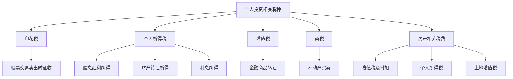
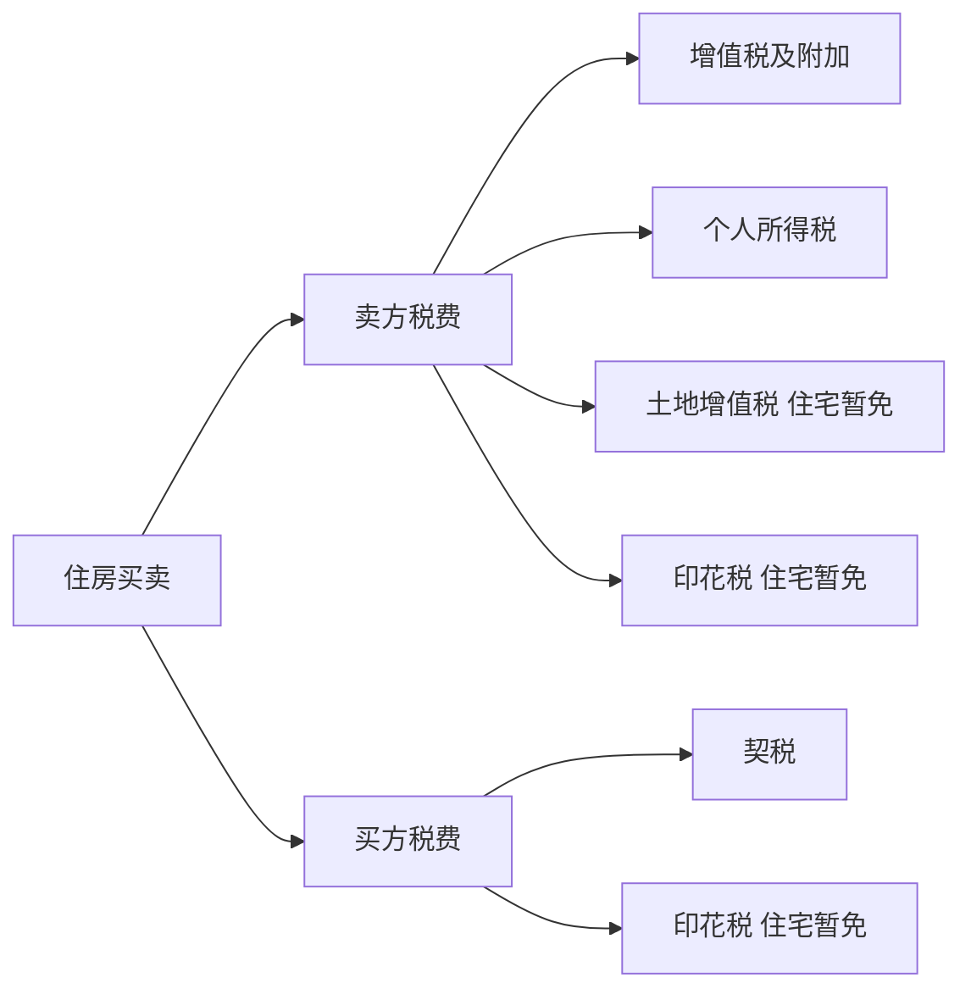
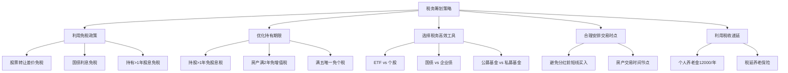
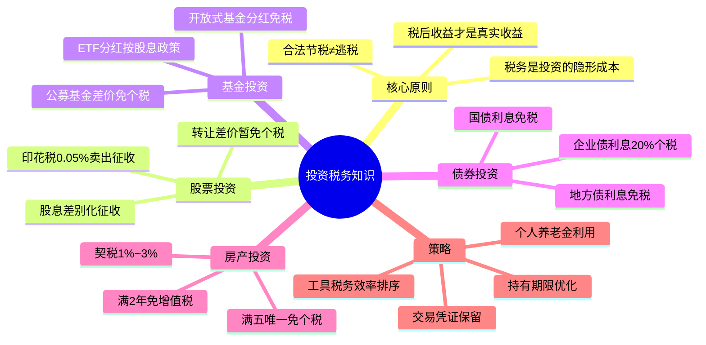

## 5.9 投资中的税务知识

> 世界上只有两件事是不可避免的，那就是税收和死亡。——本杰明·富兰克林

很多投资者把全部精力放在"买什么"和"什么时候买"上，却忽略了一个悄无声息吃掉收益的隐形杀手——**税收**。同样是年化10%的投资回报，税前和税后的差距可以在20年复利周期里造成数十万元的差异。理解税务规则不是会计师的专属技能，而是每一个认真对待投资回报的人必须掌握的基础知识。

本节将系统梳理中国个人投资者面临的各类税务问题，从底层原理到实操细节，帮助你在合法合规的前提下最大化税后收益。

---

### 1. 为什么税务是投资的"隐形成本"

#### 1.1 税收拖累效应（Tax Drag）

税收拖累是指因纳税而导致实际收益率低于名义收益率的现象。假设你投资了100万元，年化收益率10%，在不同税负情境下，20年后的资产差异如下：

| 情境 | 税后年化收益率 | 20年后资产（万元） | 与免税差距（万元） |
|------|---------------|-------------------|-------------------|
| 完全免税 | 10.0% | 672.8 | — |
| 15%税率 | 8.5% | 511.2 | 161.6 |
| 20%税率 | 8.0% | 466.1 | 206.7 |
| 30%税率 | 7.0% | 386.9 | 285.9 |

可以看到，20%的税率在20年复利周期中吃掉了超过200万元的收益——相当于初始本金的两倍多。这就是为什么税务筹划是投资管理中不可忽视的一环。

#### 1.2 税后收益率才是真实收益率

很多投资者习惯看"税前收益率"来评估投资表现，这是一个认知陷阱。真正到手的钱才是你赚的钱。一个年化8%的免税国债，可能比年化10%但需要缴纳20%所得税的公司债更值得持有。在做投资决策时，必须将税后收益率作为比较基准。

#### 1.3 中国个人投资者面临的主要税种



---

### 2. 股票投资的税务规则

#### 2.1 印花税——交易的"过路费"

印花税是股票交易中最直接、最明确的税种，由卖出方单边承担。

**现行政策（2023年8月28日起）：**

| 项目 | 具体规定 |
|------|---------|
| 税率 | 成交金额的0.05%（万分之五） |
| 征收方向 | 仅卖出时征收 |
| 计税基础 | 成交金额（不含交易佣金等费用） |
| 征收方式 | 由证券公司在交易清算时自动代扣 |
| 历史沿革 | 2023年8月28日起由0.1%降至0.05% |

**计算示例：** 你以每股10元的价格卖出某股票10,000股，成交金额100,000元，印花税 = 100,000 × 0.05% = 50元。

**关键提示：** 印花税只在卖出时收取，买入时不收取。这意味着频繁交易的投资者承担的印花税成本远高于长期持有者。假设你每月交易一次（买卖各一次），每次金额10万元，一年的印花税支出 = 100,000 × 0.05% × 12 = 600元。如果交易更频繁或金额更大，这笔费用会显著累积。

#### 2.2 股票转让所得——个人投资者的"免税红利"

这是一个让很多人意外的政策：**个人投资者通过买卖A股上市公司的股票所获得的资本利得（差价收入），暂免征收个人所得税。**

政策依据：《财政部 国家税务总局关于个人转让股票所得继续暂免征收个人所得税的通知》（财税字〔1998〕61号），该政策自1997年起执行至今。

**但需要注意以下几种特殊情况：**

| 情况 | 税务处理 |
|------|---------|
| A股二级市场买卖 | 暂免个人所得税 |
| 新三板（北交所）股票转让 | 同样暂免（财税〔2018〕137号） |
| 转让限售股 | 按"财产转让所得"缴纳20%个人所得税 |
| 转让原始股（IPO前取得） | 按"财产转让所得"缴纳20%个人所得税 |
| 通过沪港通/深港通买卖港股 | 暂免个人所得税 |

**限售股的税务处理详解：**

限售股是这个免税政策中最重要的例外。如果你持有上市公司IPO前的股份、股权激励获得的股份、或定向增发获得的股份，在解禁后转让时需要缴纳20%的个人所得税。

限售股转让所得的计算公式：

```text
应纳税额 =（转让收入 - 限售股原值 - 合理税费）× 20%
```

如果无法提供完整、真实的限售股原值凭证，主管税务机关会按转让收入的15%核定限售股原值。

**案例：** 张先生持有某上市公司IPO前股份10万股，IPO发行价为20元/股。解禁后以30元/股卖出，不考虑交易费用。应纳税所得额 =（30 - 20）× 100,000 = 1,000,000元，应纳税额 = 1,000,000 × 20% = 200,000元。这意味着张先生需要在卖出时缴纳20万元的个人所得税，由证券公司代扣代缴。

#### 2.3 股息红利所得——差别化征收政策

上市公司分配的股息红利，个人投资者需要缴纳个人所得税，但税率取决于**持股期限**。这就是"差别化征收"政策。

**现行政策（2015年9月8日起）：**

| 持股期限 | 税率 | 适用说明 |
|---------|------|---------|
| 持股 ≤ 1个月 | 20% | 全额计入应纳税所得额 |
| 1个月 < 持股 ≤ 1年 | 10% | 减半计入应纳税所得额 |
| 持股 > 1年 | 免税 | 股息红利免征个人所得税 |

**持股期限的计算规则：**

- 持股期限从买入日起算，到卖出日前一日截止
- 持股期限按"先进先出"法计算，即先买入的股票先卖出
- 个人持有上市公司股票的时间，包括股票转让后再次购回的时间

**关键细节——"先进先出"的陷阱：**

假设你在2024年1月1日买入A股票1000股，2024年6月1日又买入1000股，2024年7月1日卖出500股。按先进先出原则，你卖出的500股是1月1日买入的那批，持股期限为6个月（1月1日至6月30日），适用10%的税率。

**实际操作中的扣税时点：**

很多人以为股息红利的个人所得税在分红到账时扣除，实际上并非如此。A股上市公司分红时，股息红利会**全额到账**，个人所得税在你**卖出股票时**才由证券公司代扣。如果你长期持有不卖出，税款会一直递延。

**计算示例：** 你持有某股票5000股，公司宣布每股派发现金红利0.5元（含税），你获得现金红利2500元。如果你在持股1个月内卖出，需补缴个税 = 2500 × 20% = 500元；持股超过1年卖出，不需补缴任何税款。

**重要提示：** 很多短线投资者不了解这个规则，在分红后短期卖出股票时发现被扣了一大笔税，实际收益率远低于预期。如果你只是想赚取短期差价，应该避免在分红登记日前后买入股票。

#### 2.4 股票交易相关费用一览

除税收外，股票交易还涉及以下费用，它们共同构成交易成本：

| 费用项目 | 费率 | 收取方向 | 备注 |
|---------|------|---------|------|
| 印花税 | 0.05% | 卖出时 | 国家税务机关征收 |
| 券商佣金 | 0.025%~0.03% | 买卖双向 | 最低5元/笔，可协商 |
| 过户费 | 0.001% | 买卖双向 | 中国结算收取 |
| 经手费 | 0.00341% | 买卖双向 | 交易所收取 |
| 证管费 | 0.002% | 买卖双向 | 证监会收取 |

一个完整的买卖来回（以10万元交易额为例）的成本约为：

- 买入成本：100,000 ×（0.03% + 0.001% + 0.00341% + 0.002%）≈ 36.41元
- 卖出成本：100,000 ×（0.05% + 0.03% + 0.001% + 0.00341% + 0.002%）≈ 86.41元
- 单次来回总成本 ≈ 122.82元，约占交易金额的0.123%

---

### 3. 基金投资的税务规则

基金的税务处理比直接投资股票更为复杂，因为涉及基金本身的税务和投资者层面的税务两个维度。

#### 3.1 个人买卖基金的资本利得

**个人投资者买卖开放式基金（包括场内ETF和场外基金）所获得的差价收入，暂不征收个人所得税。** 这与股票买卖的免税政策一致。

政策依据：《财政部 国家税务总局关于开放式证券投资基金有关税收问题的通知》（财税〔2002〕128号）。

**但以下情况需要注意：**

| 基金类型 | 买卖差价 | 分红 | 备注 |
|---------|---------|------|------|
| 公募开放式基金 | 免个税 | 免个税 | 目前最优惠的税务待遇 |
| 公募封闭式基金 | 免个税 | 免个税 | 同开放式基金 |
| 场内ETF/LOF | 免个税 | 按股息红利差别化征收 | 交易所上市交易 |
| 私募基金 | 视具体形式 | 视具体形式 | 合伙型/契约型/公司型各不同 |

**ETF的税务优势：** ETF（交易所交易基金）同时享受基金分红免税和股票交易免税的双重优惠。对于想投资一篮子股票的投资者来说，ETF在税务上比自己单独购买多只股票更有优势，特别是涉及分红时。

#### 3.2 基金分红的税务处理

基金分红的税务处理取决于基金类型和投资者类型：

**公募基金分红（个人投资者）：**

- 开放式基金分红：暂不征收个人所得税
- 场内ETF分红：由于在交易所上市交易，按照上市公司股息红利差别化政策执行

**这个差异非常重要。** 同样是指数基金，如果你通过场外渠道（支付宝、天天基金等）购买的开放式基金获得分红，不需要缴纳个税；但如果你通过场内购买ETF获得的分红，则需要按照持股期限缴纳个税。不过，大多数ETF会选择"红利再投资"的方式处理分红，而非直接派现。

#### 3.3 基金分红方式的选择

面对基金分红，投资者通常有两种选择：

**现金分红：** 直接获得现金，落袋为安。适用于需要现金流的投资者。注意：如果是场内ETF，现金分红可能涉及个税。

**红利再投资：** 将分红自动转为基金份额，实现复利增长。优势在于：
1. 免除申购费用（大多数基金对红利再投资免收申购费）
2. 增加持仓份额，享受未来复利增长
3. 对于场内ETF，红利再投资不触发个税（因为没有实际收到现金）

**建议：** 如果你不需要现金分红带来的现金流，选择红利再投资是更税务高效的方式。

#### 3.4 基金转换的税务问题

基金转换在技术上被视为"赎回旧基金 + 申购新基金"的操作。但由于个人投资者买卖开放式基金的差价收入暂不征税，基金转换本身不产生额外的税务负担。需要注意的是，基金转换可能涉及转出基金的赎回费（通常根据持有时间递减）。

---

### 4. 债券投资的税务规则

债券是很多投资者忽视的税务优化工具。不同类型的债券，税务待遇差异巨大。

#### 4.1 国债——完全免税的"金边"投资

**国债利息收入免征个人所得税和企业所得税。** 这是国债最重要的税务优势之一。

政策依据：《中华人民共和国个人所得税法》第四条明确规定，国债和国家发行的金融债券利息免征个人所得税。

**实际收益对比：** 假设你处于20%的个税边际税率，国债年利率3%，企业债年利率3.75%。表面上看企业债收益更高，但税后收益：
- 国债税后收益：3%（免税）
- 企业债税后收益：3.75% ×（1 - 20%）= 3%

两者税后收益相同。如果企业债利率低于3.75%，实际上国债更优。

#### 4.2 地方政府债券

地方政府债券的利息收入同样**免征个人所得税和企业所得税**。政策依据与国债相同。地方政府债券的安全性虽不及国债，但在税务待遇上完全一致，是追求稳健收益投资者的优质选择。

#### 4.3 企业债券和公司债券

企业债券（公司债券）的利息收入需要缴纳**20%的个人所得税**。通常由发行方或承销商在付息时代扣代缴。

**不同类型债券的税务对比：**

| 债券类型 | 利息收入个税 | 转让差价个税 | 安全性 | 税后收益优势 |
|---------|------------|------------|--------|------------|
| 国债 | 免税 | 免税 | 最高 | 高 |
| 地方政府债券 | 免税 | 免税 | 很高 | 高 |
| 政策性金融债 | 免税 | 免税 | 很高 | 高 |
| 企业/公司债 | 20% | 免税 | 中等 | 需计算比较 |
| 可转债 | 20% | 免税 | 中等 | 需计算比较 |

#### 4.4 可转换债券（可转债）

可转债的税务处理较为特殊：

- **持有期间的利息收入：** 按20%缴纳个人所得税（通常由发行方代扣）
- **二级市场买卖差价：** 暂免个人所得税
- **转股后的股息红利：** 按照股票股息红利差别化政策执行
- **转股后的股票买卖差价：** 暂免个人所得税

**可转债的税务套利空间：** 由于可转债利息很低（通常第一年0.2%~0.5%），且利息要缴20%的税，实际税后利息收益极低。但可转债的收益主要来自转股价差和二级市场价格波动，这两部分均享受免税待遇。因此，可转债在税务上是比较高效的投资工具。

---

### 5. 房产投资的税务规则

房产交易涉及的税种最多、税负最重、规则最复杂，是个人投资者税务筹划的重点领域。

#### 5.1 住房买卖涉及的全部税种



#### 5.2 卖方税费详解

**（一）增值税及附加**

| 房屋类型 | 持有时间 | 增值税 |
|---------|---------|--------|
| 普通住房 | 持有≥2年（北上广深：≥5年） | 免征 |
| 普通住房 | 持有<2年 | 全额÷1.05×5% |
| 非普通住房 | 持有≥2年（北上广深：≥5年） | 差额÷1.05×5% |
| 非普通住房 | 持有<2年 | 全额÷1.05×5% |

附加税包括：城市维护建设税（增值税的7%/5%/1%）、教育费附加（增值税的3%）、地方教育附加（增值税的2%）。合计为增值税的6%~12%（视所在地区而定）。

**（二）个人所得税**

| 情况 | 税率 | 计算方式 |
|------|------|---------|
| 满五唯一（持有≥5年且为家庭唯一住房） | 免征 | — |
| 提供原值凭证 | 20% | （转让收入 - 房屋原值 - 合理费用）× 20% |
| 不能提供原值凭证 | 1%~2% | 转让收入 × 核定征收率 |

**"满五唯一"是房产交易中最重要的税务优惠条件。** 一套购入价200万、卖出价350万的房子，如果不满足满五唯一，差额的20%需要缴纳个税 =（350 - 200）× 20% = 30万元。满足满五唯一则完全免征。

#### 5.3 买方税费详解

**契税（2024年最新政策）：**

| 购房情况 | 住房面积 | 契税税率 |
|---------|---------|---------|
| 首套房 | ≤140平方米 | 1% |
| 首套房 | >140平方米 | 1.5% |
| 二套房 | ≤140平方米 | 1% |
| 二套房 | >140平方米 | 2% |
| 三套及以上 | 不限 | 3%（各地政策有差异） |

注：2024年12月1日起实施新政，将首套房和二套房140平方米以下的契税税率统一为1%。

**计算示例：** 购买一套120平方米、总价300万元的首套房，契税 = 300万 × 1% = 3万元。

#### 5.4 房产投资的税务筹划要点

**持有时间规划：** 如果计划出售房产，持有满2年可免增值税，满5年且为唯一住房可免个税。在出售前，务必计算好时间节点，避免因为提前几个月出售而多缴纳数十万元的税款。

**原值凭证保留：** 购房发票、契税完税证明、装修发票（部分城市认可）、房贷利息凭证等，都应该妥善保管。这些凭证可以作为房屋原值和合理费用的扣除依据，直接影响个人所得税的计算。

**"先买后卖"还是"先卖后买"：** 如果你计划换房，顺序的选择直接影响契税和个税。先卖后买可能让你在卖出时享受满五唯一的优惠，在买入时享受首套房的契税优惠。

---

### 6. 其他投资品种的税务规则

#### 6.1 银行存款利息

**银行存款利息收入自2008年10月9日起暂免征收个人所得税。** 在此之前，存款利息需要缴纳20%（后来降至5%）的个税。目前银行存款利息完全免税，这也是为什么银行存款的实际收益率与名义收益率一致。

#### 6.2 理财产品

银行理财产品、信托产品的收益税务处理：

| 产品类型 | 税务处理 | 备注 |
|---------|---------|------|
| 银行存款 | 利息免税 | 2008年10月9日起 |
| 银行理财（净值型） | 个税政策尚不明确 | 实践中暂未征收 |
| 信托产品 | 按合同约定，通常受益人自行申报 | 政策模糊 |
| 券商收益凭证 | 按"利息所得"缴纳20%个税 | 券商通常代扣 |

**注意：** 资管新规后，银行理财产品全面净值化转型，但税务政策并未同步明确。实际操作中，大多数理财产品在兑付时不会代扣个税，但从法理上讲，个人从理财产品取得的收益应按"利息所得"或"财产转让所得"缴纳20%个税。这是一个政策灰色地带。

#### 6.3 保险产品的税务优惠

保险产品在中国有独特的税务优惠地位：

| 保险类型 | 税务优惠 | 限制条件 |
|---------|---------|---------|
| 商业健康保险 | 每年最高2,400元税前扣除 | 需购买符合规定的产品 |
| 税延养老保险 | 每月最高1,000元税前扣除 | 领取时按3%缴税 |
| 个人养老金 | 每年最高12,000元税前扣除 | 领取时按3%缴税 |
| 保险赔款 | 免税 | — |
| 保险分红（传统寿险） | 免税 | 以被保险人死亡/伤残为给付条件的 |

**个人养老金账户的税务优势：**

个人养老金是2022年11月启动的制度，每人每年最高可缴存12,000元。其税务优势在于：

1. **缴存阶段：** 每年12,000元可在综合所得或经营所得中据实扣除
2. **投资阶段：** 账户内投资收益暂不征税
3. **领取阶段：** 按照3%的税率单独计算缴纳个税

**案例分析：** 假设你的边际税率为20%，每年缴存12,000元到个人养老金账户，直接节税 = 12,000 × 20% = 2,400元/年。30年累计节税72,000元（未考虑时间价值）。退休后领取时按3%缴税，实际节税效果 = 12,000 ×（20% - 3%）= 2,040元/年。

#### 6.4 期货和期权

| 品种 | 税务处理 |
|------|---------|
| 商品期货 | 个人暂免征收个人所得税 |
| 股指期货 | 个人暂免征收个人所得税 |
| 国债期货 | 个人暂免征收个人所得税 |
| 股票期权 | 行权时按"工资薪金所得"缴税（员工期权）；非员工按"财产转让所得"20%缴税 |

#### 6.5 数字货币和虚拟资产

中国目前对加密货币交易采取禁止态度，相关交易平台已被清退。从税务角度而言，由于加密货币交易在国内不被法律认可，相关的税务处理政策也不明确。投资者应充分认识到参与此类交易的法律风险。

#### 6.6 黄金投资

| 黄金投资方式 | 买卖差价 | 收益税务处理 |
|------------|---------|------------|
| 实物黄金 | 买卖差价视为财产转让所得，理论上20%个税 | 实践中难以征管 |
| 纸黄金 | 银行代理，暂未明确代扣 | 灰色地带 |
| 黄金ETF | 免税（参照基金） | 明确免税 |
| 上海金交所个人黄金 | 暂免增值税和个税 | 财税〔2002〕128号精神 |

---

### 7. 税务筹划的核心策略

#### 7.1 利用免税额度和优惠政策

这是最基础也最重要的策略。充分利用现有政策中的免税条款：



#### 7.2 持有期限优化

持有期限对税后收益的影响是巨大的。以下是一些关键的"时间节点"：

**股票投资：**
- 持股超过1年：股息红利免税
- 持股1个月至1年：股息红利按10%缴税
- 持股1个月以内：股息红利按20%缴税

**房产投资：**
- 持有满2年：免征增值税
- 持有满5年且为唯一住房：免征个人所得税

**建议：** 如果你持有的股票即将分红，且你原本就打算长期持有，那么持有超过1年再卖出可以节省一笔股息税。如果你持有房产接近满2年或满5年的节点，尽量等到节点过后再出售。

#### 7.3 投资工具的税务效率排序

从税务效率角度，不同投资工具的排名如下（税负由低到高）：

| 税务效率等级 | 投资工具 | 税务优势 |
|------------|---------|---------|
| ★★★★★ | 国债、地方政府债 | 利息完全免税 |
| ★★★★★ | 公募基金（持有>1年） | 买卖差价免税+分红免税 |
| ★★★★☆ | 银行存款 | 利息免税 |
| ★★★★☆ | 个人养老金账户内投资 | 递延纳税，领取时仅3% |
| ★★★☆☆ | A股（长期持有） | 转让差价免税，股息持有1年免税 |
| ★★★☆☆ | 房产（满五唯一） | 免增值税+免个税 |
| ★★☆☆☆ | 企业债 | 利息20%个税 |
| ★★☆☆☆ | A股（短期交易） | 股息20%个税+印花税 |
| ★☆☆☆☆ | 房产（不满足优惠条件） | 增值税+个税+契税 |

#### 7.4 资产配置中的税务考量

在构建资产组合时，税务效率应该成为资产配置的考量因素之一。一个税务优化的资产配置框架：

**税务高效的配置建议：**

1. **核心仓位（60%~70%）：** 以公募指数基金和ETF为主，享受买卖差价免税和长期持有分红免税的双重优势
2. **稳健仓位（20%~30%）：** 以国债和地方政府债券为主，利息收入完全免税
3. **机动仓位（10%~20%）：** 用于个股投资或其他品种，利用A股转让差价免税政策
4. **养老储备：** 每年充分利用个人养老金12,000元的税收优惠额度

---

### 8. 年度个税汇算清缴与投资收入

#### 8.1 投资收入在综合所得中的位置

中国的个人所得税采用综合与分类相结合的税制。投资相关的收入分属不同的征税类别：

| 收入类型 | 所得类别 | 税率 | 是否纳入综合所得 |
|---------|---------|------|----------------|
| 工资薪金 | 综合所得 | 3%~45%累进 | 是 |
| 稿酬/劳务报酬 | 综合所得 | 3%~45%累进 | 是 |
| 股息红利 | 利息、股息、红利所得 | 20% | 否（分类征收） |
| 股票转让差价 | 财产转让所得 | 免税 | 否 |
| 房产转让差价 | 财产转让所得 | 20% | 否（分类征收） |
| 利息收入 | 利息所得 | 免税/20% | 否 |
| 偶然所得 | 偶然所得 | 20% | 否 |

**关键点：** 大多数投资收入属于"分类征收"项目，不纳入综合所得汇算清缴。这意味着即使你有大额的投资收益，也不会推高你的工资薪金适用的边际税率。但房产转让等需缴税的财产转让所得需要单独申报。

#### 8.2 年度汇算清缴中需要注意的事项

1. **股票分红：** 由证券公司代扣代缴，投资者通常不需要在年度汇算中额外处理
2. **房产交易：** 如果在年度内有房产出售，需要确认相关税费是否已经完税
3. **个人养老金扣除：** 如果缴存了个人养老金，需要在年度汇算中填报扣除
4. **商业健康保险扣除：** 每年2,400元的税前扣除需要在汇算中确认

---

### 9. 常见的税务误区与纠正

#### 误区一："股票买卖赚钱了要交税"

**事实：** 个人投资者买卖A股上市公司的股票获得的差价收入，暂免征收个人所得税。这个政策从1997年延续至今。很多人因为不了解这个政策，对自己的投资收益产生了错误的预期。

**例外：** 转让限售股、原始股需要缴纳20%的个人所得税。

#### 误区二："分红越多越好，反正不交税"

**事实：** 股票分红的税务处理取决于持股期限。持股1个月以内分红需要缴纳20%的个税。如果你是短线投资者，在分红登记日前买入股票可能反而"亏税"。

**案例：** 某股票股价10元，每股分红1元（股息率10%）。你在分红前一天买入1000股，获得分红1000元，但因为你持股不足1个月，需要缴纳20%的个税 = 200元。实际到手分红只有800元，而且股价在除权后通常会下跌至9元左右。你的实际收益为800 - 1000 = -200元（亏损）。

#### 误区三："基金分红要交税"

**事实：** 个人投资者从公募开放式基金获得的分红，暂不征收个人所得税。这是基金投资相对于直接股票投资的一个重要税务优势。但场内ETF的分红需要按照股息红利差别化政策执行。

#### 误区四："房子满两年就不用交税了"

**事实：** "满两年免增值税"只适用于增值税和个人所得税中的一个税种（视地区政策而定）。要同时免征增值税和个人所得税，通常需要满足"满五唯一"的条件（持有满5年且为家庭唯一住房）。很多中介为了促成交易，会笼统地说"满两年免税"，导致买家在过户时才发现还需要缴纳一大笔个人所得税。

#### 误区五："国债和企业债收益差不多，选哪个都一样"

**事实：** 国债利息完全免税，企业债利息需要缴纳20%的个人所得税。如果国债利率3%，企业债利率3.5%，税后收益分别为3%和2.8%，实际上国债更优。在比较债券收益时，一定要计算税后收益率。

#### 误区六："避税和逃税是一回事"

**事实：** 避税（税务筹划）是在法律允许的范围内，通过合理的安排来降低税负，是合法的。逃税是故意隐瞒收入、虚假申报等违法行为，是犯罪。两者的界限在于是否遵守了法律规定。利用免税政策、优化持有期限、选择税务高效的投资工具，都是合法的税务筹划。

---

### 10. 实操工具与资源

#### 10.1 自然人电子税务局

国家税务总局的自然人电子税务局（https://etax.chinatax.gov.cn/）是个人办理税务事项的官方平台，主要功能包括：

- **收入纳税明细查询：** 查看全年的收入和已缴税款明细
- **年度汇算清缴：** 每年3月1日至6月30日办理上一年度的综合所得汇算
- **专项附加扣除填报：** 包括个人养老金等扣除项
- **完税证明开具：** 需要完税证明时可在线开具

#### 10.2 证券交易软件中的税务信息

大多数券商APP都提供了税务相关信息查询功能：

- **交割单查询：** 每笔交易的印花税、佣金、过户费明细
- **持仓盈亏：** 包含已实现和未实现的盈亏（税前）
- **分红记录：** 历史分红明细和持股期限信息

#### 10.3 税后收益计算公式

做投资决策时，用以下公式快速计算税后收益率：

```text
税后收益率 = 税前收益率 × (1 - 适用税率)
```

对于更复杂的场景（如股票分红+转让的综合收益），可以使用以下模型：

```text
综合税后收益 = 转让差价 × (1 - 转让税率) + 分红金额 × (1 - 分红税率) - 交易费用
综合税后收益率 = 综合税后收益 ÷ 初始投资金额 × 100%
```

#### 10.4 税务筹划清单

在做每一个投资决策前，过一遍这份清单：

- [ ] 确认该投资品种的税务处理规则
- [ ] 计算税后收益率，而非税前收益率
- [ ] 评估持有期限对税负的影响
- [ ] 确认是否可以利用免税政策（满五唯一、持股超1年等）
- [ ] 确认个人养老金扣除额度是否已用满
- [ ] 检查商业健康保险扣除是否已申报
- [ ] 保留所有交易凭证和完税证明
- [ ] 年度终了检查是否需要办理汇算清缴

---

### 11. 进阶内容：跨境投资的税务问题

#### 11.1 QDII基金的税务处理

通过QDII基金投资海外市场，税务处理较为复杂：

| 收入类型 | 中国税务处理 | 海外税务处理 |
|---------|------------|------------|
| 股票转让差价 | 个人暂免个税 | 可能在来源国被预扣税 |
| 股息红利 | 取决于基金类型 | 来源国通常预扣10%~30% |
| 债券利息 | 取决于基金类型 | 来源国通常预扣10%~30% |

**提示：** QDII基金在海外投资中被预扣的税款，通常无法在中国抵免（因为中国个人投资者买卖基金差价免税，没有对应的中国税可以抵免）。这是QDII基金的一个隐性成本。

#### 11.2 港股通的税务规则

通过沪港通/深港通投资港股的税务规则：

| 项目 | 税务处理 |
|------|---------|
| 买卖差价 | 暂免个人所得税 |
| 股息红利 | H股：由中国结算按20%代扣个税；非H股：由中国结算按20%代扣个税 |
| 印花税 | 买卖双向各0.13%（香港印花税） |

**港股通的税务成本较高：** 港股通的印花税是A股的2.6倍（双向0.13% vs 单向0.05%），且股息红利统一按20%扣税，没有A股的差别化优惠政策。在做港股通投资决策时，必须将这些额外的税务成本纳入考量。

#### 11.3 中国与税收协定

中国已与100多个国家和地区签署了避免双重征税协定。如果你在海外有投资收入，在来源国被征收的税款通常可以在中国的个人所得税中抵免，但需要注意：

- 抵免额不能超过该所得按中国税法计算的应纳税额
- 需要提供境外完税凭证
- 需要在年度汇算清缴时申报

---

### 12. 本节要点回顾



**核心要记住的规则：**

1. **A股买卖差价：** 免税（限售股除外）
2. **A股分红：** 持有超1年免税，1个月内20%
3. **基金买卖差价：** 公募基金免税
4. **国债利息：** 完全免税
5. **房产交易：** 满五唯一是最优税务条件
6. **个人养老金：** 每年12,000元，缴存时抵扣、领取时3%
7. **印花税：** 股票卖出0.05%
8. **一切以税后收益为准做决策**

税务知识看似枯燥，但它是投资回报体系中不可或缺的一环。掌握这些规则，不是为了钻法律的空子，而是在合法合规的框架内，让你的投资收益最大化。每一分钱的税，都是你投资收益的一部分——值得你认真对待。
