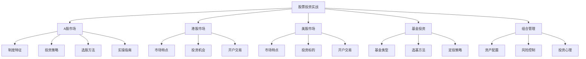
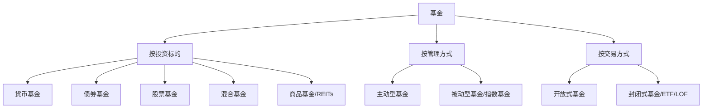

# 第六章：股票投资实战（A股、港股、美股）

> "股市短期是投票机，长期是称重机。" —— 本杰明·格雷厄姆

股票投资是最常见的财富增值方式之一。全球股票市场总市值超过100万亿美元，是人类有史以来最大的财富蓄水池。对于普通投资者来说，理解不同市场的制度特征、掌握系统的分析方法、建立可重复的投资体系，是实现财富增长的核心路径。

本章将从A股、港股、美股三个市场出发，涵盖市场制度、投资策略、选股方法、实操工具、基金投资、组合管理、投资心理等完整知识体系，为你提供一套从入门到精通的股票投资实战指南。

**本章知识地图**：



***

## 6.1 A股市场投资

### 6.1.1 市场制度与结构

A股市场是中国大陆的主要股票市场，包含四个交易所板块，每个板块的定位、上市门槛、交易规则各不相同。

**四大交易所板块对比**：

| 板块 | 交易所 | 上市门槛 | 涨跌幅 | 投资者门槛 | 定位 |
|------|--------|----------|--------|-----------|------|
| 主板 | 上交所/深交所 | 盈利要求高，净利润≥1.5亿 | ±10% | 无 | 大型蓝筹企业 |
| 创业板 | 深交所 | 注册制，盈利要求较低 | ±20% | 10万+2年经验 | 成创新型中小企业 |
| 科创板 | 上交所 | 注册制，允许未盈利上市 | ±20% | 50万+2年经验 | 硬科技企业 |
| 北交所 | 北交所 | 注册制，市值/收入多套标准 | ±30% | 50万+2年经验 | 专精特新中小企业 |

**注册制改革详解**

2023年2月，A股全面实行注册制，这是中国资本市场最深刻的制度变革之一：

- **核准制时代**：证监会实质审核企业质量，上市门槛高，壳资源有价值
- **注册制时代**：交易所审核+证监会注册，信息披露为核心，市场化定价
- **核心变化**：发行定价市场化（23倍PE限制取消）、上市效率提升（审核周期缩短至6个月左右）、退市常态化（2023年退市超40家）
- **对投资者的影响**：打新不再是无风险收益（破发常态化）、选股难度加大（供给增加）、壳价值归零（小盘股不再有重组溢价）

**实战建议**：注册制下，投资者需要更加注重基本面研究，"炒小、炒差、炒新"的策略风险急剧上升。

**政策市特征**

A股市场受政策影响极大，这是理解A股运行逻辑的第一课。政府的产业政策、货币政策、监管政策都会直接影响市场走势：

- **2015年"杠杆牛"**：场外配资泛滥→监管清理配资→千股跌停→流动性危机。教训：政策转向时不要逆势
- **2020年"双碳"政策**：碳中和目标提出→新能源板块暴涨（宁德时代从200元涨至690元）→2022年产能过剩→板块回调50%+
- **2023年"中特估"**：中国特色估值体系提出→央企国企股估值修复→中国神华、中国移动等创新高
- **2024年"新质生产力"**：人工智能、低空经济、量子计算等政策支持方向成为市场热点

**信息获取渠道**：
| 渠道 | 类型 | 特点 | 适用场景 |
|------|------|------|---------|
| 中国政府网 | 官方 | 第一手政策文件 | 重大政策研判 |
| 财联社电报 | 快讯 | 7×24小时，速度快 | 盘中信息跟踪 |
| 东方财富Choice | 数据 | 专业金融终端 | 深度数据分析 |
| 雪球 | 社区 | 投资者讨论 | 观点碰撞、情绪感知 |
| 巨潮资讯 | 公告 | 上市公司官方公告 | 财报/重大事项 |

**散户占比与市场结构**

A股散户交易占比约60%-70%，远高于美股的10%-15%。这意味着：

- **情绪化严重**：市场容易暴涨暴跌，2015年千股涨停千股跌停交替出现
- **概念炒作频繁**：题材股活跃，"沾AI就涨"、"沾华为就涨"的非理性行为常见
- **价值回归周期长**：好公司可能长期被低估，烂公司可能长期被高估
- **机构化趋势**：公募基金、外资、险资占比在逐年提升，市场正在缓慢机构化

**T+1交易制度**

A股实行T+1交易，即当天买入的股票次日才能卖出。这一制度的影响：

- **无法日内止损**：买入后当天发现判断错误也无法卖出，需要更谨慎的买入决策
- **适合中长线**：不适合频繁短线操作，交易成本和制度摩擦较高
- **变相T+0方法**：已持有底仓的情况下，当日买入等量→次日卖出旧仓，实现变相T+0；跨境ETF（如港股ETF、纳指ETF）支持T+0交易
- **可转债**：可转债实行T+0交易，且无涨跌停限制（上市首日除外），是A股少数可以日内交易的品种

**涨跌停制度详解**

| 板块 | 涨跌幅 | 特殊情况 |
|------|--------|---------|
| 主板 | ±10% | ST股±5% |
| 创业板 | ±20% | 上市前5日不设涨跌停 |
| 科创板 | ±20% | 上市前5日不设涨跌停 |
| 北交所 | ±30% | 上市首日不设涨跌停 |

涨跌停的实战意义：
- **涨停打板**：A股特有的短线策略，追涨停板博次日溢价。核心是判断涨停封板力度（封单量/成交量比）、板块效应、市场情绪
- **跌停风险**：跌停时无法卖出，连续跌停可能导致严重亏损。2015年股灾期间多只股票连续5个以上跌停
- **一字板**：开盘即涨停/跌停且全天未打开，说明多空力量极度失衡

**融资融券**

融资融券是A股的杠杆交易工具，相当于"借钱炒股"和"借股票卖出"：

- **融资**：向券商借钱买入股票，看涨时使用。利率通常5%-8%，杠杆比例不超过1:1
- **融券**：向券商借入股票卖出，看跌时使用。券源有限，费率通常8%-10%
- **开通条件**：50万资产+6个月交易经验
- **风险警示**：融资有强制平仓线（维持担保比例低于130%），2015年股灾中大量融资盘被强平

**实战建议**：新手不建议使用融资融券。杠杆放大收益的同时也放大亏损，且A股T+1制度下无法日内止损，杠杆风险更大。

**北向资金（外资流向）**

北向资金是指通过沪股通、深股通流入A股的境外资金，被称为"聪明钱"：

- **观察意义**：北向资金偏好大盘蓝筹和行业龙头，其流向对市场有领先指示作用
- **查看方法**：东方财富网"沪深港通"栏目、同花顺"资金流向"模块
- **注意事项**：2023年后北向资金数据不再实时披露（改为季度披露），且部分资金为对冲基金短线交易，不宜过度迷信

### 6.1.2 投资策略

A股市场的投资策略可以分为四大流派，每种策略适合不同的投资者类型和市场环境。

**一、价值投资：选择优质公司长期持有**

价值投资的核心是"用合理的价格买入优质公司的股票，长期持有"。这一方法由本杰明·格雷厄姆创立，由沃伦·巴菲特发扬光大。

选股五维标准：
1. **护城河**：品牌优势（茅台）、网络效应（腾讯）、转换成本（用友）、成本优势（海螺水泥）、规模效应（宁德时代）
2. **盈利能力**：ROE（净资产收益率）连续5年>15%，且主要来自经营而非一次性收益
3. **成长性**：营收和净利润持续增长，增速>行业平均
4. **估值合理**：PE、PB处于历史中位数以下，或PEG<1
5. **管理层优秀**：诚信（无重大违规）、能力（战略清晰、执行力强）、格局（有长期愿景）

**杜邦分析法拆解ROE**：

ROE = 净利润率 × 资产周转率 × 权益乘数

| 驱动因素 | 含义 | 代表行业 | 关注点 |
|---------|------|---------|--------|
| 高利润率 | 产品赚钱 | 白酒、医药 | 毛利率稳定性 |
| 高周转率 | 薄利多销 | 零售、快消 | 资产效率 |
| 高杠杆 | 借钱生钱 | 银行、地产 | 负债风险 |

好的公司通常由前两个因素驱动ROE，而不是靠高杠杆。茅台ROE常年30%+，主要靠高利润率（净利率50%+），这是最健康的模式。

**案例分析：贵州茅台**

贵州茅台是A股价值投资的经典案例：
- 2001年上市价格：31.39元
- 2021年最高价：2627.88元
- 20年涨幅超过80倍，年化收益率约25%
- 期间经历2008年金融危机（跌55%）、2013年反腐（跌60%）、2015年股灾（跌30%），但每次都创新高

茅台的护城河分析：
| 护城河类型 | 具体表现 | 持久性 |
|-----------|---------|--------|
| 品牌壁垒 | 国酒地位，社交货币 | 极强 |
| 产能限制 | 茅台镇地理标志保护，无法复制 | 极强 |
| 提价能力 | 消费升级+供不应求，出厂价持续上调 | 强 |
| 文化属性 | 白酒文化+收藏属性 | 强 |

**二、趋势投资：跟随市场趋势操作**

趋势投资的核心是"顺势而为"，不预测市场，只跟随趋势。这一方法由杰西·利弗莫尔开创，查尔斯·道的道氏理论提供了理论基础。

**趋势判断工具体系**：

1. **均线系统**：
   - 5日均线：超短期趋势，适合日内/隔日交易
   - 20日均线：短期趋势，是短线交易的生命线
   - 60日均线：中期趋势，机构常用
   - 120日均线（半年线）：中长期趋势分水岭
   - 250日均线（年线）：牛熊分界线。股价站稳年线通常视为进入牛市

2. **MACD指标**：
   - 金叉（DIF上穿DEA）：买入信号，零轴上方金叉更强
   - 死叉（DIF下穿DEA）：卖出信号，零轴下方死叉更弱
   - 顶背离：股价创新高但MACD不创新高→趋势可能反转下跌
   - 底背离：股价创新低但MACD不创新低→趋势可能反转上涨
   - 实战要点：MACD适合判断中长线趋势，不适合短线

3. **布林带（Bollinger Bands）**：
   - 上轨：压力位，股价触及上轨可能回调
   - 中轨：20日均线，趋势方向参考
   - 下轨：支撑位，股价触及下轨可能反弹
   - 带宽收窄：波动率降低，可能即将变盘
   - 带宽扩大：波动率增大，趋势启动信号

4. **RSI（相对强弱指标）**：
   - RSI>70：超买区域，可能回调
   - RSI<30：超卖区域，可能反弹
   - RSI背离：与股价走势不一致，可能反转
   - 实战要点：RSI在趋势行情中可能长期处于超买/超卖区间，不宜单独使用

5. **成交量分析**：
   - 放量上涨：趋势确认，多头力量强
   - 缩量回调：正常调整，筹码锁定好
   - 放量下跌：趋势破坏，资金出逃
   - 地量见地价：成交量极度萎缩时，可能见底
   - 量价背离：股价创新高但成交量萎缩→上涨动能不足

**趋势交易的基本原则**：
- 在上升趋势中买入，在下降趋势中卖出
- 不抄底、不逃顶，只吃中间最确定的一段
- 设置止损位，控制单笔亏损在总资金的2%以内
- 仓位与趋势强度正相关：强趋势重仓，弱趋势轻仓

**三、定投策略：定期定额投资指数基金**

定投是普通投资者最友好的投资方式，核心是"无视涨跌，定期买入"。其理论基础是"微笑曲线"——市场下跌时买入更多份额，市场上涨时份额增值。

**定投的数学原理**：

假设每月定投1000元：
- 股价10元时：买入100份
- 股价5元时：买入200份
- 股价10元时：买入100份
- 总投入3000元，持有400份，平均成本7.5元/份，市值4000元，收益率33.3%

**A股适合定投的指数基金**：

| 指数 | 基金代码 | 特点 | 适合人群 |
|------|---------|------|---------|
| 沪深300 | 510300 | 大盘蓝筹，稳健 | 保守型投资者 |
| 中证500 | 510500 | 中盘成长，弹性大 | 均衡型投资者 |
| 创业板指 | 159915 | 科技成长，波动大 | 激进型投资者 |
| 科创50 | 588000 | 硬科技，高成长 | 高风险偏好 |
| 红利指数 | 510880 | 高股息，防守型 | 稳健型投资者 |
| 中证1000 | 560010 | 小盘股，高弹性 | 进取型投资者 |

**定投实操建议**：
- **金额**：月收入的10%-30%，不影响日常生活
- **频率**：每周定投比每月定投平滑成本效果更好，但差距不大（约1%-2%），选择自己能坚持的频率
- **时间**：坚持3-5年以上，穿越至少一个牛熊周期
- **止盈**：收益率达到30%-50%时分批止盈，或采用估值止盈法（PE百分位>80%时开始卖出）
- **增强策略**：低估加倍（PE百分位<30%时投入1.5-2倍）、高估减半（PE百分位>70%时投入0.5倍）

**四、打新策略：新股申购**

A股打新曾是几乎无风险的套利机会，但注册制改革后风险显著上升。

**打新规则**：
- 需要持有一定市值的股票作为底仓（沪市1万、深市5千，按T-2前20个交易日日均市值计算）
- 中签率极低（约0.01%-0.05%），需要坚持申购
- 科创板和创业板需要开通权限（50万/10万+2年经验）
- 注册制后破发风险显著增加，2022年破发率约20%-30%

**打新收益分析**：
| 年份 | 平均单签收益 | 破发率 | 年化收益（20万底仓） |
|------|------------|--------|-------------------|
| 2020 | 3-5万 | <5% | 15%-25% |
| 2022 | 1-2万 | 20%-30% | 5%-10% |
| 2024 | 0.5-1.5万 | 15%-25% | 3%-8% |

**打新实战建议**：
- 坚持打新，但不要为了打新而买不熟悉的股票
- 注册制下需要选择性打新，关注发行价是否合理、行业是否有前景
- 科创板和创业板新股风险更高，需要更谨慎


### 6.1.3 选股方法

选股是投资的核心技能。本节从基本面、技术面、估值三个维度构建完整的选股体系。

**一、基本面分析**

基本面分析是价值投资的核心，通过分析公司的财务数据和经营状况来判断其内在价值。

**财务报表三张表**：

1. **利润表**（看赚钱能力）：
   - **营收增长率**：>15%为佳，说明公司处于成长期。关注收入结构——是靠主业增长还是靠投资收益/政府补贴
   - **净利润率**：行业对比，越高越好。茅台净利率50%+是极优秀，一般制造业5%-15%为正常
   - **毛利率**：反映产品竞争力和定价权。毛利率持续下降是危险信号——可能意味着竞争加剧或产品失去差异化
   - **费用率**：销售费用率+管理费用率+研发费用率。越低越好（说明管理效率高），但研发投入过低可能影响未来竞争力
   - **扣非净利润**：剔除一次性收益后的净利润，更能反映真实经营状况

2. **资产负债表**（看财务健康）：
   - **资产负债率**：<60%为佳，银行等金融行业除外（通常80%+）
   - **流动比率**：>1.5为佳，说明短期偿债能力充足
   - **商誉占比**：越低越好，商誉过高意味着并购溢价大，存在减值风险（暴雷）。2018年A股商誉减值超千亿
   - **有息负债率**：有息负债/总资产，越低越好。高有息负债意味着利息支出侵蚀利润
   - **应收账款周转天数**：越短越好，说明回款快。突然大幅增加可能是放宽信用条件冲收入
   - **存货周转天数**：行业差异大，但趋势很重要。存货大幅增加可能是产品滞销

3. **现金流量表**（看真金白银）：
   - **经营现金流**：应该为正，且接近或超过净利润。如果净利润很高但经营现金流为负——可能是纸面富贵，需要高度警惕
   - **自由现金流**：经营现金流-资本支出。自由现金流为正的公司才有真正的分红和回购能力
   - **现金流与净利润的匹配度**：净现比（经营现金流/净利润）>1为佳，说明赚到的是真金白银而非应收账款
   - **筹资现金流**：持续为正说明公司在不断融资，可能是烧钱模式；持续为负说明公司在还债或分红

**杜邦分析实战**：

以某消费品公司为例：
```text
ROE = 15% = 净利润率12% × 资产周转率0.8 × 权益乘数1.56
```
- 净利润率12%：中等偏上，产品有一定定价权
- 资产周转率0.8：中等，资产效率尚可
- 权益乘数1.56：低杠杆，财务稳健
- 结论：ROE主要靠利润率驱动，模式健康

**选股实战清单**：

```text
基本面筛选：
□ ROE连续5年>15%（核心指标）
□ 营收增长率>10%（成长性）
□ 净利润率>10%（盈利能力）
□ 资产负债率<60%（财务安全）
□ 经营现金流为正且>净利润（现金流健康）
□ 毛利率稳定或上升（竞争力）
□ 商誉占比<20%（减值风险低）
□ 股东质押比例<30%（大股东安全）
□ 大股东增持或回购（管理层看好）
□ 行业前景良好（赛道选择）
□ 扣非净利润连续增长（真实盈利）
□ 应收账款周转天数稳定或下降（回款健康）
```

**二、技术面分析**

技术分析通过历史价格和成交量预测未来走势。其理论基础是：市场行为包含一切信息、价格沿趋势运动、历史会重演。

**K线基础**：
- 阳线（A股红色）：收盘价>开盘价，多方占优
- 阴线（A股绿色）：收盘价<开盘价，空方占优
- 上影线长：上方抛压重，多头冲高回落
- 下影线长：下方支撑强，空头打压被拉回
- 十字星：多空平衡，可能变盘

**常见K线组合形态**：

| 形态 | 构成 | 信号 | 可靠度 |
|------|------|------|--------|
| 早晨之星 | 阴线+十字星+阳线 | 底部反转看涨 | ★★★★ |
| 黄昏之星 | 阳线+十字星+阴线 | 顶部反转看跌 | ★★★★ |
| 红三兵 | 连续三根阳线，每根新高 | 看涨 | ★★★ |
| 三只乌鸦 | 连续三根阴线，每根新低 | 看跌 | ★★★ |
| 锤子线 | 下影线长≥实体2倍，无上影 | 底部看涨 | ★★★ |
| 吞没形态 | 后一根实体完全包裹前一根 | 反转信号 | ★★★★ |

**经典图形形态**：

| 形态 | 类型 | 说明 | 操作策略 |
|------|------|------|---------|
| 头肩底 | 底部反转 | 左肩→头→右肩，突破颈线确认 | 突破颈线买入，目标涨幅≈头部到颈线距离 |
| 头肩顶 | 顶部反转 | 左肩→头→右肩，跌破颈线确认 | 跌破颈线卖出 |
| 双底(W底) | 底部反转 | 两次探底，第二次不破前低 | 突破中间高点买入 |
| 双顶(M顶) | 顶部反转 | 两次冲高，第二次不破前高 | 跌破中间低点卖出 |
| 上升旗形 | 中继形态 | 上涨后小幅回调，呈平行四边形 | 突破上沿继续做多 |
| 收敛三角形 | 中继/反转 | 高点降低+低点抬高 | 等待突破方向 |

**技术指标深度解析**：

1. **均线系统**（前文已述，此处补充实战用法）：
   - **葛兰碧八大法则**：均线交易的经典理论，包含4个买点和4个卖点
   - **均线粘合后发散**：多条均线粘合在一起后向上发散→强势启动信号
   - **均线支撑/阻力**：回调到重要均线（如60日线）获支撑→买入机会

2. **MACD深度用法**：
   - **零轴判断**：DIF在零轴上方为多头市场，下方为空头市场
   - **红绿柱**：红柱缩短→上涨动能减弱；绿柱缩短→下跌动能减弱
   - **二次金叉**：第一次金叉后小幅回调再金叉，信号更可靠
   - **周线MACD**：比日线更可靠，适合中长线判断

3. **布林带（BOLL）深度用法**：
   - **缩口后张口**：布林带收窄后向上张口→启动上涨行情
   - **股价沿上轨运行**：强势特征，不宜轻易卖出
   - **股价跌破中轨**：趋势转弱信号
   - **下轨买入法**：股价触及下轨+RSI超卖→反弹概率大

4. **KDJ指标**：
   - K值>80且J值>100：超买
   - K值<20且J值<0：超卖
   - KDJ金叉+MACD金叉共振：强买入信号
   - 适合震荡行情，趋势行情中可能反复钝化

5. **成交量深度分析**：
   - **量价齐升**：健康上涨
   - **量价背离（顶背离）**：股价创新高但成交量萎缩→上涨乏力
   - **量价背离（底背离）**：股价创新低但成交量萎缩→下跌动能衰竭
   - **天量天价**：成交量创历史新高时，往往接近阶段顶部
   - **地量地价**：成交量极度萎缩时，往往接近阶段底部
   - **OBV（能量潮）**：累计成交量指标，判断资金流入流出趋势

**三、估值分析**

估值是判断股票"贵不贵"的核心工具。没有一种估值方法是万能的，需要多种方法交叉验证。

**常用估值方法详解**：

**1. 市盈率（PE）**：
- **公式**：股价 / 每股收益（或 总市值 / 净利润）
- **分类**：
  - 静态PE：用上年年报数据
  - 滚动PE（TTM）：用最近四个季度数据，最常用
  - 动态PE：用预测的未来一年数据
- **适用**：盈利稳定的成熟公司
- **不适用**：周期股（盈利波动大）、亏损公司、高增长早期公司
- **判断方法**：与自身历史PE中位数对比、与同行业对比、与国际同类公司对比

**2. 市净率（PB）**：
- **公式**：股价 / 每股净资产
- **适用**：重资产行业（银行、地产、钢铁）、周期性行业底部估值
- **判断**：PB<1可能被低估（破净），但需要确认净资产质量（商誉、存货是否虚高）
- **银行股PB**：A股银行平均PB约0.5-0.7，港股更低，反映市场对坏账的担忧

**3. PEG估值法**：
- **公式**：PE / 净利润增长率（%）
- **判断**：PEG<1可能被低估，PEG>1可能被高估
- **适用**：成长股估值，由彼得·林奇推广
- **局限**：增长率是预测值，可能不准确

**4. 现金流折现（DCF）**：
- **原理**：公司价值 = 未来所有自由现金流的现值之和
- **公式**：V = Σ FCFt / (1+r)^t + 终值 / (1+r)^n
- **适用**：现金流稳定的成熟公司（如公用事业、消费品）
- **局限**：对增长率和折现率假设高度敏感，微小变化可能导致估值差异50%以上
- **实战**：更多用于理解估值逻辑，而非精确计算

**5. 股息折现模型（DDM）**：
- **公式**：P = D1 / (r - g)，其中D1为下一年预期股息，r为要求收益率，g为股息增长率
- **适用**：高分红、稳定增长的公司（如银行、公用事业）
- **实战**：常用于"股息贴现法"评估高股息股票的合理价格

**估值实战对比表**：

| 公司 | PE(TTM) | PB | PEG | 行业PE中位数 | 股息率 | 估值判断 |
|------|---------|-----|-----|-------------|--------|---------|
| 贵州茅台 | 25 | 8 | 1.5 | 25 | 2.5% | 合理 |
| 招商银行 | 5.5 | 0.7 | 0.8 | 6 | 5.5% | 偏低 |
| 宁德时代 | 20 | 4 | 0.7 | 30 | 0.5% | 偏低 |
| 比亚迪 | 18 | 3.5 | 0.6 | 25 | 0.3% | 偏低 |
| 中国神华 | 10 | 1.5 | - | 12 | 6% | 合理偏低 |

**估值的常见误区**：
- **低PE不等于便宜**：可能是盈利即将下滑（如周期股顶部）
- **高PE不等于贵**：可能是高增长公司（如早期的腾讯PE 50+）
- **PB<1不代表安全**：净资产可能有水分（商誉、存货减值）
- **不要用单一估值指标**：多种方法交叉验证才可靠

### 6.1.4 实操指南

**开户流程与券商选择**

选择券商的核心标准和推荐：

| 标准 | 权重 | 说明 |
|------|------|------|
| 佣金费率 | ★★★★★ | 万1-万3，差距巨大。10万本金每月交易10次，万1和万3年佣金差2400元 |
| 交易软件 | ★★★★ | 功能齐全、操作流畅、行情速度快 |
| 研报质量 | ★★★ | 投研能力强的券商研报有参考价值 |
| 融资融券利率 | ★★★ | 如果需要杠杆交易，利率差异显著 |
| 客户服务 | ★★ | 响应及时、专业度高 |

**推荐券商**：
- **东方财富**：佣金低（万1.2起）、软件好（东方财富APP/Choice数据）、一站式服务
- **华泰证券**：涨乐财富通APP优秀、研报质量高、佣金可谈至万1
- **中信证券**：研报最强、机构业务领先、适合高净值客户
- **国金证券**：佣金宝（万1起）、性价比高

**开户流程**：
1. 下载券商APP或到营业部
2. 上传身份证正反面照片
3. 填写个人信息（职业、收入、投资经验等）
4. 视频认证（通常1-2分钟）
5. 设置交易密码和资金密码
6. 绑定银行卡（用于银证转账）
7. 完成风险测评问卷
8. 等待审核（通常1-2个工作日）

**佣金谈判技巧**：
- 新开户时主动要求低佣金，通常可以谈到万1.5以下
- 资金量越大，谈判空间越大
- 线上开户通常比线下佣金更低
- 可以用其他券商的低佣金报价作为谈判筹码

**交易软件使用指南**：

**同花顺**（推荐指数：★★★★★）：
- 功能全面，覆盖面广，支持多券商登录
- 问财选股功能强大：支持自然语言选股（如"ROE连续5年大于15%的消费股"）
- iFinD数据终端适合专业投资者
- 缺点：广告较多、部分高级功能收费

**东方财富**（推荐指数：★★★★★）：
- 自带券商，一站式服务，开户交易无缝衔接
- 股吧社区活跃，可以感知市场情绪
- Choice数据专业版强大（需付费）
- 资讯及时全面，覆盖面广

**通达信**（推荐指数：★★★★）：
- 老牌行情软件，运行速度快
- 公式编辑功能强大，支持自编指标
- 适合技术分析派
- 缺点：界面较老旧、资讯功能弱

**下单技巧与注意事项**：

1. **限价单 vs 市价单**：
   - 限价单：指定价格，可能无法成交但价格可控
   - 市价单：按当前最优价成交，保证成交但价格不可控
   - 实战建议：正常行情用限价单，紧急情况用市价单

2. **分批建仓策略**：
   - 不要一次性满仓，分3-5次买入
   - 第一次试探性买入30%仓位
   - 股价下跌5%-10%时加仓30%
   - 确认趋势后加仓剩余40%
   - 核心逻辑：降低平均成本、控制风险

3. **条件单设置**（自动化交易工具）：
   - 止损条件单：跌破某价位自动卖出，防止深度套牢
   - 止盈条件单：涨到某价位自动卖出，锁定利润
   - 网格交易：设定价格区间和网格大小，自动高抛低吸
   - 回落卖出：从最高点回落一定比例自动卖出

4. **集合竞价技巧**：
   - 9:15-9:20可以撤单，9:20-9:25不能撤单
   - 9:25确定开盘价，9:30开始连续竞价
   - 实战：如果想买入涨停板股票，9:25前以涨停价下单；如果想卖出跌停板股票，尽早挂单

**交易时间与盘前盘后**：

| 时段 | 时间 | 说明 |
|------|------|------|
| 集合竞价 | 9:15-9:25 | 确定开盘价 |
| 连续竞价 | 9:30-11:30 | 上午交易 |
| 午休 | 11:30-13:00 | 休市 |
| 连续竞价 | 13:00-14:57 | 下午交易 |
| 收盘集合竞价 | 14:57-15:00 | 确定收盘价 |
| 盘后 | 15:00-15:30 | 科创板/创业板盘后固定价格交易 |


***

## 6.2 港股市场投资

### 6.2.1 市场制度与特点

港股市场是连接中国与全球资本的桥梁，也是全球最活跃的股票市场之一。理解港股的制度特征是投资港股的前提。

**港股与A股制度对比**：

| 特征 | A股 | 港股 |
|------|-----|------|
| 交易制度 | T+1 | T+0 |
| 涨跌停 | ±10%/±20%/±30% | 无涨跌停 |
| 投资者结构 | 散户占比60%+ | 机构占比60%+ |
| 做空机制 | 融券（有限） | 做空便利，个股可做空 |
| 交易货币 | 人民币 | 港币 |
| 交易时间 | 9:30-15:00 | 9:30-16:00（含午休） |
| 结算周期 | T+1 | T+2 |
| 印花税 | 卖方0.05% | 买卖各0.13% |
| 股息税 | 持有1年以上免税 | 港股通20%，直接账户看注册地 |

**港股的核心特征**：

**1. 国际化程度高**
港股市场机构投资者占比超过60%，包括全球主权基金（如挪威主权基金、淡马锡）、养老基金、对冲基金等。这意味着：
- 定价更加理性，不容易被散户情绪左右
- 估值体系与国际接轨，对盈利质量要求更高
- 流动性严重分化：蓝筹股流动性充裕，中小盘可能日成交额不足100万港元

**2. 估值长期偏低**
港股长期处于全球估值洼地，原因复杂：
- 恒生指数PE通常在8-12倍，远低于标普500的20-25倍
- AH股溢价指数长期在130-150之间，同一家公司A股比港股贵30%-50%
- 原因：香港市场以国际投资者为主，对中国资产存在"折价"偏见；流动性不如A股充裕；部分公司治理结构不如国际标准

**3. 无涨跌停限制**
港股没有涨跌停限制，这是港股最大的风险特征：
- 单日可能暴涨暴跌：2022年3月恒生指数单日跌幅超5%的天数多次出现
- 仙股（股价低于1港元的股票）风险极大：可能一天跌50%以上
- 老千股：部分小公司通过供股、合股等手段损害小股东利益
- 实战建议：远离不知名小盘股、远离仙股、只买流动性好的标的

**4. T+0交易**
港股实行T+0交易，当天买入可以当天卖出：
- 可以日内止损，控制风险
- 适合短线交易和日内策略
- 可以进行日内套利（如AH溢价日内波动）
- 注意：频繁交易成本高（印花税0.13%双向收取）

**5. 供股与合股风险**

港股特有的公司行为风险，A股投资者容易忽视：

- **供股（Rights Issue）**：公司向现有股东按比例发行新股，通常折价。小股东如果不行权，股份被稀释。老千股常用手段：低价供股→大股东低价拿筹码→再高价卖出
- **合股（Share Consolidation）**：将多股合并为一股，通常发生在仙股公司。合股后股价上涨，但总市值不变，且往往继续下跌
- **防御方法**：避开频繁供股的公司、避开治理结构差的小公司、关注大股东持股比例变化

**6. 窝轮与牛熊证**

港股衍生品市场发达，窝轮和牛熊证是高杠杆投机工具：

- **窝轮（Warrants）**：即权证，分为认购窝轮（看涨）和认沽窝轮（看跌）。杠杆倍数通常5-20倍，到期日固定
- **牛熊证（CBBC）**：与窝轮类似但有强制收回机制。牛证看涨，熊证看跌。当标的资产价格触及收回价时，牛熊证立即终止交易
- **风险极高**：时间价值持续衰减（Theta），杠杆放大亏损，牛熊证可能被强制收回导致血本无归
- **实战建议**：新手远离窝轮和牛熊证。即使是老手，也应将其仓位控制在总资产的5%以内

### 6.2.2 投资机会

**一、AH股溢价套利**

同一家公司在A股和港股同时上市，由于市场结构差异存在价差。AH溢价指数反映了A股相对港股的溢价程度。

**套利逻辑**：
- 当AH溢价指数>150时，A股相对港股溢价50%以上，港股估值吸引力大
- 选择AH溢价大、基本面好的公司，在港股买入
- 等待溢价收窄（通常通过港股上涨或A股下跌实现）

**注意事项**：
- AH溢价长期存在，不一定收敛——不要期待"无风险套利"
- 流动性差异：港股流动性可能较差，大额交易有冲击成本
- 汇率风险：港币与美元挂钩，人民币升值时港股投资收益会被汇率侵蚀
- 股息税差异：港股通红利税20%，A股持有1年以上免税，套利需考虑税后收益

**案例：中国平安**
- 2023年A股价格：约50元人民币
- 2023年港股价格：约50港元（约45元人民币）
- AH溢价：约11%
- 但考虑港股通红利税20%，实际股息收益差距缩小

**二、科技股投资**

港股聚集了中国最优秀的科技公司，是投资中国科技产业的重要渠道：

| 公司 | 代码 | 主营业务 | 护城河 |
|------|------|---------|--------|
| 腾讯控股 | 00700 | 社交+游戏+投资 | 社交网络效应（微信12亿用户） |
| 美团-W | 03690 | 本地生活服务 | 商家网络+配送网络 |
| 小米集团-W | 01810 | 智能硬件+IoT | 性价比品牌+生态系统 |
| 快手-W | 01024 | 短视频+直播 | 下沉市场用户基础 |
| 百度集团-SW | 09888 | AI+搜索 | 搜索入口+AI技术积累 |
| 京东集团-SW | 09618 | 电商+物流 | 自建物流体系 |
| 网易-S | 09999 | 游戏+音乐 | 游戏IP+音乐版权 |
| 阿里巴巴-SW | 09988 | 电商+云计算 | 电商平台+云基础设施 |

**后缀说明**：-W表示同股不同权，-S表示二次上市，-SW表示两者兼具

**科技股投资策略**：
1. 选择行业龙头，不买二三线公司——港股流动性分化严重，小公司可能无人接盘
2. 关注公司护城河和竞争格局变化——中国科技行业竞争激烈，护城河可能被颠覆
3. 估值合理时分批买入——科技股波动大，不要追高
4. 长期持有，但要跟踪基本面变化——政策风险（如反垄断）可能改变投资逻辑

**三、高股息策略**

港股有很多高股息率的公司，适合追求稳定现金流的投资者。港股高股息策略的优势在于：估值低→买入成本低→股息率高。

**高股息股票筛选标准**：
- 股息率>5%（港股通扣除20%红利税后仍有4%+）
- 连续5年以上稳定分红（穿越经济周期）
- 派息率<70%（有持续分红能力，不过度分红）
- 公司基本面稳定（利润不大幅下滑）
- 有提价能力或垄断地位（分红可持续性）

**港股高股息股票示例**：

| 公司 | 代码 | 股息率 | 行业 | 派息率 | 分红连续性 |
|------|------|--------|------|--------|-----------|
| 中国神华 | 01088 | 8%-10% | 煤炭 | 60% | 15年+ |
| 中国移动 | 00941 | 7%-8% | 电信 | 65% | 20年+ |
| 建设银行 | 00939 | 6%-8% | 银行 | 30% | 20年+ |
| 中国海洋石油 | 00883 | 8%-12% | 石油 | 45% | 10年+ |
| 中国石油化工 | 00386 | 7%-9% | 石化 | 50% | 15年+ |
| 中国电信 | 00728 | 6%-8% | 电信 | 60% | 10年+ |

**高股息策略的风险**：
- 股价下跌可能抵消股息收益（如股价跌20%但股息只有7%）
- 公司利润下滑可能导致削减分红
- 行业周期性：煤炭、石油等资源股分红受大宗商品价格影响大
- 汇率风险：港币计价，人民币升值时收益被侵蚀

### 6.2.3 开户与交易

**港股通**

通过A股券商开通港股通，是内地投资者参与港股最便捷的方式。

**开通条件**：
- 证券账户及资金账户资产合计不低于50万元（20个交易日日均）
- 完成风险测评（积极型或激进型）
- 通过港股通知识测试（通常10道选择题）

**港股通优势与限制**：

| 优势 | 限制 |
|------|------|
| 用人民币交易，无需换汇 | 只能买港股通名单内股票（约500只） |
| 通过A股券商操作，流程简单 | 不能参与港股打新 |
| 资金闭环，安全性高 | 结算周期为T+2 |
| 无外汇额度限制 | 交易时间与A股部分重叠但不完全相同 |

**港股通交易规则**：
- 交易时间：9:30-12:00、13:00-16:00（香港时间）
- 以港币报价，人民币结算
- 最小交易单位：1手（不同股票每手股数不同，如腾讯100股/手，汇丰400股/手）
- 碎股不能通过港股通交易

**直接港股开户**

如果想投资更多港股标的（包括打新、窝轮等），可以选择直接开港股账户。

**推荐券商**：

| 券商 | 特色 | 佣金 | 适合人群 |
|------|------|------|---------|
| 富途证券 | 用户体验好，社区活跃 | 万3-万5 | 入门投资者 |
| 老虎证券 | 功能全面，资讯丰富 | 万3-万5 | 进阶投资者 |
| 盈透证券 | 专业级，费率最低，支持全球市场 | 万1-万3 | 专业投资者 |
| 长桥证券 | 佣金低，界面简洁 | 万1-万3 | 性价比投资者 |

**开户流程**：
1. 下载券商APP
2. 填写个人信息和投资经验
3. 上传身份证和地址证明（水电费账单或银行对账单）
4. 完成风险测评
5. 等待审核（通常1-3个工作日）
6. 入金（需要港币，可通过银行购汇转账）

**入金方式**：
- **香港银行卡**：最方便，支持FPS转数快即时到账
- **大陆银行卡汇款**：需要购汇→跨境汇款→到账（1-3个工作日）
- **跨境理财通**：大湾区居民可通过理财通直接入金

**交易费用详解**

港股交易费用比A股高，需要充分了解：

| 费用项目 | 费率 | 说明 |
|---------|------|------|
| 佣金 | 0.03%-0.25% | 不同券商不同 |
| 印花税 | 0.13% | 买卖双向收取 |
| 交易征费 | 0.0027% | 证监会征收 |
| 交易费 | 0.005% | 联交所征收 |
| 交收费 | 0.002% | 结算所征收 |
| 过户费 | 每手2.5港元 | 过户登记处征收 |

**费用计算示例**：买入10万港元的腾讯，总费用约350-550港元（含佣金+印花税+其他费用）。

**税务注意事项**：
- **港股通红利税**：H股公司20%（企业所得税后分配）、非H股公司20%
- **直接港股账户红利税**：取决于公司注册地。注册在开曼群岛的公司（如腾讯）无红利税，注册在中国大陆的H股公司有10%预扣税
- **资本利得税**：香港不征收资本利得税
- **遗产税**：香港不征收遗产税


***

## 6.3 美股市场投资

### 6.3.1 市场制度与特点

美股市场是全球最大、最成熟的资本市场，总市值超过50万亿美元，占全球股票市场总市值的40%以上。

**美股核心特征**：

**1. 机构投资者主导**
美股机构投资者占比超过80%，市场定价相对理性：
- 大型机构（养老基金、共同基金、对冲基金）主导定价
- 分析师覆盖充分：标普500成分股平均有20+位分析师覆盖
- 信息披露要求严格：SEC监管下的财务报告标准（GAAP/IFRS）
- 做空机制完善：个股可以方便地做空，使价格发现更高效

**2. T+0交易，无涨跌停**
美股实行T+0交易，没有涨跌停限制：
- 可以日内无限次交易，灵活度极高
- 单日波动可能很大：个股单日涨跌30%+并不罕见（财报发布后）
- **Pattern Day Trader规则**：5个交易日内日内交易超过4次，账户需要维持2.5万美元以上保证金
- 实战建议：新手不要频繁日内交易，PDT规则的存在说明监管层认为频繁交易对散户有害

**3. 盘前盘后交易**
美股交易时间（北京时间，夏令时/冬令时有1小时差异）：

| 时段 | 夏令时 | 冬令时 | 说明 |
|------|--------|--------|------|
| 盘前 | 16:00-21:30 | 17:00-22:30 | 流动性差、点差大 |
| 正常交易 | 21:30-次日4:00 | 22:30-次日5:00 | 流动性最好 |
| 盘后 | 4:00-8:00 | 5:00-9:00 | 流动性差、点差大 |

盘前盘后交易特点：
- 流动性较差，买卖点差可能比正常交易时段大5-10倍
- 适合处理重大事件（如盘后发布财报）
- 大型券商（如盈透证券）支持盘前盘后交易，部分券商不支持

**4. 退市制度严格**
美股退市率远高于A股：
- 纽交所和纳斯达克每年退市公司超过200家
- 退市原因：股价低于1美元（连续30个交易日）、市值不达标、财务造假等
- 退市后股票转入OTC（场外交易）市场，流动性急剧下降
- 实战建议：远离低价股（低于5美元），关注公司是否符合交易所上市标准

**5. 美股重要事件日历**

| 月份 | 事件 | 影响 |
|------|------|------|
| 1月 | CES消费电子展 | 科技股催化 |
| 1/4/7/10月 | 财报季（季度结束后1-2个月） | 个股大幅波动 |
| 3/6/9/12月 | FOMC议息会议 | 全市场影响 |
| 5月 | "Sell in May"效应 | 季节性弱势 |
| 9月 | 历史上表现最差的月份 | 季节性弱势 |
| 11月 | 美国大选年影响 | 政策不确定性 |
| 12月 | 年末Window Dressing | 机构调仓 |

### 6.3.2 投资标的

**一、科技股：美股投资的核心**

美国科技股是全球投资者的宠儿，代表了最先进的生产力。科技股投资的核心逻辑是：网络效应+规模效应+技术壁垒→赢者通吃。

**科技巨头深度分析**：

| 公司 | 代码 | 主营业务 | 护城河 | 风险因素 |
|------|------|---------|--------|---------|
| Apple | AAPL | 硬件+服务生态 | 品牌忠诚度+生态系统锁定 | 中国市场竞争、创新乏力 |
| Microsoft | MSFT | 云计算+AI+办公 | 企业IT基础设施锁定 | Azure竞争、反垄断 |
| Alphabet | GOOGL | 搜索+广告+AI | 搜索垄断+数据优势 | AI搜索替代、反垄断 |
| Amazon | AMZN | 电商+云计算 | 物流网络+AWS规模效应 | 零售利润率低、竞争加剧 |
| Meta | META | 社交+广告+元宇宙 | 社交网络效应（30亿用户） | 年轻用户流失、元宇宙烧钱 |
| NVIDIA | NVDA | AI芯片 | CUDA生态+技术领先 | 估值过高、竞争者追赶 |
| Tesla | TSLA | 电动车+能源 | 品牌+超级充电网络 | 竞争加剧、估值争议 |

**AI产业链投资逻辑**：

AI是当前美股最大的投资主题，产业链分为三个层次：

| 层次 | 公司 | 逻辑 | 风险 |
|------|------|------|------|
| 基础设施（卖铲子） | NVIDIA、AMD、Broadcom | AI训练需要大量算力芯片 | 需求周期性、竞争加剧 |
| 平台层（云服务） | Microsoft(Azure)、Amazon(AWS)、Google(GCP) | AI模型运行在云上 | 资本开支巨大、回报周期长 |
| 应用层（AI应用） | Salesforce、Adobe、Palantir | AI赋能企业软件 | 商业化进度不确定 |

**二、指数基金：普通投资者的最佳选择**

指数基金是普通投资者参与美股的最佳方式，低成本、分散风险、长期表现优于大多数主动基金。

**核心指数基金对比**：

| 基金 | 代码 | 跟踪指数 | 费率 | 特点 |
|------|------|----------|------|------|
| SPDR S&P 500 | SPY | 标普500 | 0.0945% | 最大的美股ETF，流动性最好 |
| Vanguard S&P 500 | VOO | 标普500 | 0.03% | 费率最低 |
| Invesco QQQ | QQQ | 纳斯达克100 | 0.20% | 科技股为主，弹性大 |
| Vanguard Total Stock | VTI | 全美股票市场 | 0.03% | 最广泛的美股ETF（4000+只） |
| Vanguard IT | VGT | 信息技术 | 0.10% | 纯科技行业ETF |
| iShares MSCI EFA | EFA | 发达市场（除美国） | 0.32% | 国际分散 |
| iShares MSCI Emerging | EEM | 新兴市场 | 0.68% | 新兴市场配置 |
| Vanguard Total Bond | BND | 美国债券市场 | 0.03% | 债券配置 |

**指数基金配置策略**：

**核心-卫星配置法**：
- 核心（60%-70%）：SPY或VOO，获取市场平均收益
- 卫星（30%-40%）：根据判断配置QQQ、行业ETF、国际ETF等

**全球配置方案**：
| 资产 | 比例 | 基金 | 作用 |
|------|------|------|------|
| 美国大盘 | 40% | VOO | 核心持仓 |
| 美国科技 | 20% | QQQ | 成长性 |
| 国际发达 | 15% | EFA | 地域分散 |
| 新兴市场 | 10% | VWO | 高增长 |
| 美国债券 | 10% | BND | 降低波动 |
| 黄金 | 5% | GLD | 避险 |

**三、ADR投资**

ADR（美国存托凭证）是非美国公司在美国上市交易的凭证，让投资者可以方便地投资全球公司。

**常见ADR标的**：
| 公司 | ADR代码 | 交易所 | 行业 |
|------|---------|--------|------|
| 台积电 | TSM | 纽交所 | 半导体 |
| 丰田汽车 | TM | 纽交所 | 汽车 |
| 诺华制药 | NVS | 纽交所 | 医药 |
| 三星电子 | - | OTC | 电子 |
| 阿里巴巴 | BABA | 纽交所 | 电商 |

**ADR投资注意事项**：
- ADR与原股之间可以转换，但有一定成本
- 汇率风险：ADR价格受汇率波动影响
- 部分ADR流动性较差（OTC市场交易的）

**四、分红再投资（DRIP）**

DRIP（Dividend Reinvestment Plan）是将收到的股息自动再买入同一股票的计划：
- 复利效应显著：假设股息率3%+股价年涨7%，30年后DRIP组合是非DRIP组合的1.5倍以上
- 大多数美股券商支持免费DRIP
- 缺点：再投资时无法选择买入时机
- 实战建议：长期持有者应该开启DRIP

### 6.3.3 开户与交易

**券商选择**

| 券商 | 推荐度 | 特色 | 佣金 | 适合人群 |
|------|--------|------|------|---------|
| 富途证券 | ★★★★★ | 中文客服，体验好 | 每股0.005美元，最低1美元 | 入门投资者 |
| 老虎证券 | ★★★★★ | 资讯丰富，功能全 | 每股0.005美元，最低1美元 | 进阶投资者 |
| 盈透证券 | ★★★★ | 专业级，费率最低，全球市场 | 每股0.005美元，最低1美元 | 专业投资者 |
| 嘉信理财 | ★★★ | 美国本土大券商，研究强 | 免佣金 | 高净值投资者 |

**汇率风险与换汇策略**

投资美股需要将人民币换成美元，汇率波动直接影响投资收益。

**换汇方式对比**：
| 方式 | 汇率 | 限额 | 到账时间 | 安全性 |
|------|------|------|---------|--------|
| 银行换汇 | 较差（点差0.5%-1%） | 每年5万美元 | 即时 | 最高 |
| 券商换汇 | 较好（点差0.1%-0.3%） | 视券商而定 | 即时 | 高 |
| 港卡换汇 | 最好 | 无限制 | 1-2天 | 高 |

**汇率风险管理策略**：
- 分批换汇，平摊汇率成本（每月换一部分，而非一次性换完）
- 长期持有，忽略短期汇率波动（汇率长期均值回归）
- 美元资产配置比例不超过总资产的30%-50%（适度分散）
- 关注中美利差和汇率走势，选择合适时机换汇

**美股财报解读**

美股财报是投资美股的核心信息来源。每季度发布一次（季度结束后约1-2个月）。

**关键日期**：
- **财报发布日**：通常在盘后或盘前发布
- **电话会议**：财报发布后通常有管理层电话会议，包含关键信息
- **10-K年报**：每年发布，包含完整财务数据和管理层讨论（MD&A）
- **10-Q季报**：每季度发布，包含季度财务数据

**财报关注要点**：
| 指标 | 说明 | 重要性 |
|------|------|--------|
| Revenue（营收） | 总收入，关注增速是否符合预期 | ★★★★★ |
| EPS（每股收益） | 净利润/股数，关注是否beat预期 | ★★★★★ |
| Gross Margin（毛利率） | 盈利质量指标 | ★★★★ |
| Operating Cash Flow（经营现金流） | 真金白银 | ★★★★ |
| Guidance（业绩指引） | 管理层对未来业绩的预期 | ★★★★★ |
| Buyback（回购计划） | 公司回购力度 | ★★★ |

**实战技巧**：
- 财报发布后股价反应比财报数据更重要——"买预期卖事实"
- 关注电话会议中管理层的语气和措辞变化
- 使用Seeking Alpha、Yahoo Finance获取财报分析

**税务申报注意事项**

**美国端税务**：
- **股息税**：美国预扣10%（中美税收协定税率，否则30%）
- **资本利得税**：非美国居民免征
- **遗产税**：非美国居民超过6万美元需缴纳，税率最高40%。这是美股投资的重大风险——如果在持有美股期间去世，超过6万美元的部分将被美国征收高额遗产税
- **规避遗产税方法**：通过香港券商持有（以香港公司名义）、购买爱尔兰注册的ETF（如CSPX）、购买人寿保险覆盖遗产税风险

**中国端税务**：
- **股息收入**：需要申报个人所得税（20%税率），但实际执行中多数投资者未申报
- **资本利得**：目前暂无明确征税规定，但未来可能追溯
- **建议**：保留完整的交易记录，咨询专业税务顾问


***

## 6.4 基金投资

基金是将众多投资者的资金汇集起来，由专业基金经理进行投资管理的金融产品。对于没有时间或能力直接投资个股的投资者，基金是最便捷的投资工具。

### 6.4.1 基金类型全景

**基金分类体系**：



**各类基金详细对比**：

| 基金类型 | 风险等级 | 预期年化收益 | 适合人群 | 流动性 |
|---------|---------|------------|---------|--------|
| 货币基金 | R1（极低） | 1.5%-2.5% | 所有人（现金管理） | 极好（T+0/T+1） |
| 纯债基金 | R2（低） | 3%-6% | 保守型投资者 | 好（T+1） |
| 混合债基 | R2-R3 | 4%-8% | 稳健型投资者 | 好（T+1） |
| 偏股混合 | R3-R4 | 8%-15% | 均衡型投资者 | 好（T+1） |
| 股票基金 | R4（高） | 10%-20% | 进取型投资者 | 好（T+1） |
| 指数基金 | R3-R4 | 跟踪指数 | 所有投资者 | 好（ETF实时） |
| QDII基金 | R3-R5 | 取决于海外市场 | 全球配置需求 | 中等（T+2-T+7） |
| REITs | R3 | 5%-12% | 收益型投资者 | 中等 |

**一、货币基金**

货币基金是风险最低的基金类型，适合存放短期资金和应急储备。

**代表产品**：
- 余额宝（天弘余额宝）：最大的货币基金，支持支付宝直接消费
- 零钱通（华夏财富宝）：微信生态，使用便捷
- 微众银行活期+：收益略高于余额宝
- 南方天天利、易方达易理财：收益稳定的货币基金

**货币基金核心指标**：
- **七日年化收益率**：最近7天的平均收益年化，通常1.5%-2.5%
- **万份收益**：每万元每天的收益，更直观
- **规模**：规模太小有清盘风险，太大收益可能被摊薄。100亿-1000亿为佳

**实战建议**：
- 应急资金（3-6个月生活费）放在货币基金
- 不要把货币基金当投资工具——收益仅略高于银行活期
- 关注"快速赎回"限额：单日单账户通常1万元T+0到账

**二、债券基金**

债券基金主要投资于债券市场，风险和收益介于货币基金和股票基金之间。

**债券基金子类**：

| 类型 | 投资范围 | 风险 | 收益 |
|------|---------|------|------|
| 短债基金 | 短期限债券 | 最低 | 2%-4% |
| 中长期纯债 | 中长期利率债+信用债 | 低 | 3%-6% |
| 一级债基 | 债券+可转债+打新 | 中低 | 4%-8% |
| 二级债基 | 债券+少量股票（<20%） | 中 | 5%-10% |

**债券基金风险提示**：
- **利率风险**：利率上升时债券价格下跌，债券基金净值回撤
- **信用风险**：持仓债券违约可能导致净值大幅下跌（如2020年永煤事件）
- **流动性风险**：债券市场流动性不如股票，大额赎回可能导致净值异常波动
- **2022年教训**：债市大幅调整，纯债基金也出现了3%-5%的回撤，打破了"债基不亏"的幻觉

**三、股票基金**

**主动型 vs 指数基金深度对比**：

| 对比项 | 主动型基金 | 指数基金 |
|--------|-----------|----------|
| 费率 | 管理费1.5%+托管费0.25% | 管理费0.5%+托管费0.1% |
| 选股方式 | 基金经理主动选股 | 被动跟踪指数 |
| 长期收益 | 不确定（取决于基金经理能力） | 跟踪指数（市场平均收益） |
| 超额收益 | 目标跑赢指数 | 目标跟踪指数（扣除费用后略低于指数） |
| 适合人群 | 相信优秀基金经理能创造超额收益 | 相信市场有效、长期难以跑赢指数 |
| 选择难度 | 需要选基金经理（难度大） | 只需选指数（难度小） |

**一个关键数据**：根据S&P SPIVA报告，10年期来看，约85%-90%的主动型基金跑输对应的指数基金。这意味着：除非你能选到前10%的基金经理，否则指数基金是更好的选择。

**四、QDII基金**

QDII（合格境内机构投资者）基金是投资海外市场的基金，是普通投资者进行全球配置的重要工具。

**QDII基金类型**：
| 类型 | 代表基金 | 跟踪标的 | 费率 |
|------|---------|---------|------|
| 美股指数 | 广发纳斯达克100(270042) | 纳斯达克100 | 0.85% |
| 美股指数 | 博时标普500ETF联接(050025) | 标普500 | 0.85% |
| 港股指数 | 华夏恒生ETF联接(000071) | 恒生指数 | 0.75% |
| 全球债券 | 鹏华全球高收益债(000290) | 全球高收益债 | 1.0% |
| 黄金 | 华安黄金ETF联接(000216) | 黄金 | 0.6% |

**QDII注意事项**：
- 额度限制：QDII有外汇额度限制，热门基金可能暂停申购
- 汇率风险：基金净值受汇率波动影响
- 到账时间：赎回到账通常T+7-T+10，比普通基金慢
- 基金溢价：当QDII基金暂停申购时，场内交易可能出现大幅溢价（如2024年部分纳指ETF溢价超过10%），不要在高溢价时买入

**五、LOF基金**

LOF（上市型开放式基金）既可以在场外（基金公司/银行/第三方平台）申购赎回，也可以在场内（交易所）买卖。

**LOF优势**：
- 套利机会：当场内价格与净值出现差异时，可以套利
- 流动性：场内交易实时成交，比场外T+1更快
- 费用：场内交易费用通常低于场外申购费

**六、FOF基金**

FOF（基金中的基金）是投资其他基金的基金，相当于"买一篮子基金"。

**FOF特点**：
- 双重分散：底层基金本身已经分散投资，FOF再分散一层
- 双重收费：FOF管理费+底层基金管理费，总费率较高（2%+）
- 适合人群：完全不想自己做资产配置的投资者
- 缺点：双重费率侵蚀收益，且不保证比直接买指数基金好

**七、REITs（不动产投资信托基金）**

REITs是投资不动产的基金，让普通投资者也能参与房地产投资。

**中国公募REITs**（2021年6月上市）：
- 投资范围：产业园区、高速公路、仓储物流、保障性住房等
- 收益来源：租金分红（强制分配90%+可分配利润）+ 价格涨跌
- 交易方式：场内交易（类似股票）
- 风险：流动性较差、底层资产估值波动、政策风险

### 6.4.2 选基方法

**选主动型基金的核心——选基金经理**

评价维度详解：

1. **从业年限**：至少5年以上，最好经历过完整的牛熊周期。新基金经理可能只见过牛市，风控能力未经检验

2. **历史业绩**：
   - 看3年、5年、10年业绩，不要只看1年
   - 看不同市场环境下的表现：牛市能否跟上、熊市能否少亏
   - 看同类排名：前1/3持续稳定比偶尔拿第一更重要
   - 看风险调整后收益：夏普比率>1为优秀

3. **投资风格**：
   - 价值型：偏好低估值、高分红的公司
   - 成长型：偏好高增长、高估值的公司
   - 均衡型：兼顾价值和成长
   - 风格漂移警惕：如果基金经理频繁改变风格，说明投资体系不成熟

4. **管理规模**：
   - 太小（<1亿）：有清盘风险
   - 太大（>200亿）：灵活性下降，"船大难掉头"
   - 最佳区间：10亿-100亿

5. **回撤控制**：
   - 最大回撤：从最高点到最低点的最大跌幅
   - 优秀基金经理的最大回撤通常小于同类平均
   - 回撤控制能力在熊市中尤为重要

**选指数基金的核心——选指数+比费率**

1. **选指数**：
   - 宽基指数（沪深300、标普500）适合核心配置
   - 行业指数（消费、医药、科技）适合卫星配置
   - 策略指数（红利、低波、质量）适合特定需求

2. **比费率**：
   - 同一个指数有多个ETF，选费率最低的
   - 长期来看，费率差异对收益影响巨大

3. **比跟踪误差**：
   - 跟踪误差越小，说明基金管理越精确
   - 优秀的指数基金年化跟踪误差<0.5%

4. **比规模和流动性**：
   - 规模太小有清盘风险
   - 流动性差的ETF买卖点差大，隐性成本高

**费率对长期收益的影响**：

假设投资10万元，年化收益10%，不同费率30年后的差异：

| 费率 | 10年后 | 20年后 | 30年后 |
|------|--------|--------|--------|
| 0.2%（低费率指数） | 25.9万 | 67.0万 | 173.5万 |
| 0.5%（普通指数） | 25.3万 | 63.9万 | 161.8万 |
| 1.5%（主动基金） | 23.1万 | 53.2万 | 122.4万 |

差距惊人：30年后，低费率和高费率的差距超过50万！这就是为什么费率是选基的核心指标之一。

**风险指标详解**：

**夏普比率（Sharpe Ratio）**：
- 公式：(基金收益率 - 无风险利率) / 基金波动率
- 意义：每承担一单位风险获得的超额收益
- 判断：>1为优秀，>2为卓越，>3极为罕见
- 使用场景：比较同类基金的风险调整后收益

**最大回撤（Maximum Drawdown）**：
- 定义：从最高点到最低点的最大跌幅
- 意义：衡量最坏情况下的亏损
- 判断：股票基金<30%为佳，混合基金<20%为佳
- 使用场景：评估基金经理的风控能力

**信息比率（Information Ratio）**：
- 公式：超额收益 / 跟踪误差
- 意义：基金经理创造超额收益的稳定性
- 判断：>0.5为优秀

### 6.4.3 定投策略

**普通定投 vs 智能定投**

| 维度 | 普通定投 | 智能定投 |
|------|---------|---------|
| 策略 | 固定时间、固定金额 | 根据估值调整金额 |
| 操作 | 简单，设定后自动执行 | 需要关注估值数据 |
| 长期收益 | 市场平均 | 通常优于普通定投2%-5%/年 |
| 适合人群 | 初学者、没时间研究的投资者 | 有一定投资知识的投资者 |

**智能定投策略详解**：

**基于PE百分位的智能定投**：

| PE百分位 | 估值水平 | 定投倍数 | 说明 |
|----------|---------|---------|------|
| <20% | 极度低估 | 2倍 | 大幅加仓，捡便宜筹码 |
| 20%-40% | 低估 | 1.5倍 | 适度加仓 |
| 40%-60% | 合理 | 1倍 | 正常定投 |
| 60%-80% | 偏高 | 0.5倍 | 减少投入 |
| >80% | 高估 | 0倍 | 暂停定投，考虑分批止盈 |

**PE百分位查询工具**：
- 乌龟量化（guorn.com）：免费查看主要指数估值
- 理杏仁（lixinger.com）：专业估值数据（部分收费）
- 且慢/蛋卷基金：自带估值定投功能

**定投止盈策略**：

**目标止盈法**：
- 设定目标收益率（如30%、50%）
- 达到目标后分批卖出（如达到30%卖1/3，达到40%再卖1/3，达到50%清仓）
- 重新开始新一轮定投
- 优点：简单明确，纪律性强
- 缺点：可能错过后续上涨

**估值止盈法**：
- 当PE百分位>70%时开始分批卖出
- 当PE百分位>80%时卖一半
- 当PE百分位>90%时清仓
- 优点：更符合"低买高卖"原则
- 缺点：估值可能长期处于高位（如美股2015-2021年）

**最大回撤止盈法**：
- 从最高点回撤一定比例（如10%）时卖出
- 优点：能保护大部分利润
- 缺点：可能被短期波动触发

**案例：沪深300定投10年收益分析**

假设从2014年1月开始，每月定投1000元沪深300指数基金：

| 策略 | 总投入 | 2024年1月市值 | 总收益率 | 年化收益率 |
|------|--------|-------------|---------|-----------|
| 普通定投 | 12万 | 18万 | 50% | 4.1% |
| 智能定投（低估加倍） | 15万 | 25万 | 67% | 5.3% |
| 智能定投+估值止盈 | 15万 | 28万 | 87% | 6.5% |

智能定投+估值止盈的组合策略，年化收益比普通定投高出约2.4个百分点。10年下来，差距超过10万元。

**定投常见误区**：
- **误区一：定投不用管**——需要定期检视基金表现，基金经理变更、基金规模异动时需要调整
- **误区二：定投越久越好**——长期不止盈可能坐过山车，需要有止盈纪律
- **误区三：定投只买不卖**——A股波动大，合理止盈能显著提升收益
- **误区四：只定投一只基金**——建议分散到2-3只不同风格的基金


***

## 6.5 投资组合管理

### 6.5.1 资产配置理论

资产配置是投资中最重要的决策——研究表明，投资收益的90%以上由资产配置决定，而非个股选择或择时。

**现代投资组合理论（MPT）**

由哈里·马科维茨提出，核心思想是通过分散投资降低风险：

- **有效前沿**：在给定风险水平下，存在一个收益最高的投资组合
- **分散化**：持有相关性低的资产，可以在不降低预期收益的情况下降低风险
- **关键指标**：
  - 期望收益：各资产收益的加权平均
  - 组合风险：不仅取决于各资产风险，还取决于资产间的相关系数
  - 相关系数越低，分散效果越好（股票+债券相关系数约-0.2，分散效果好）

**核心-卫星策略**

核心-卫星策略是资产配置的经典方法，平衡稳健收益与超额收益：

**核心资产（60%-80%）**：
- 宽基指数基金（沪深300、标普500）
- 稳健，长期持有，目标获取市场平均收益
- 定期再平衡（每季度或每半年）

**卫星资产（20%-40%）**：
- 行业ETF、个股、另类投资
- 灵活调整，追求超额收益
- 可以根据市场判断主动操作

**配置示例（以100万为例）**：

| 资产 | 比例 | 金额 | 品种 | 作用 |
|------|------|------|------|------|
| 沪深300ETF | 30% | 30万 | 510300 | A股核心 |
| 标普500ETF | 20% | 20万 | 513500 | 美股核心 |
| 港股ETF | 15% | 15万 | 513050 | 港股配置 |
| 科技ETF | 15% | 15万 | 515030 | 成长性 |
| 红利ETF | 10% | 10万 | 510880 | 防守性 |
| 黄金ETF | 5% | 5万 | 518880 | 避险 |
| 货币基金 | 5% | 5万 | 余额宝 | 流动性 |

**年龄配置法则（简化版）**：
- 股票比例 ≈ (100 - 年龄)%
- 30岁：70%股票 + 30%债券
- 50岁：50%股票 + 50%债券
- 70岁：30%股票 + 70%债券

**全天候策略（All Weather Strategy）**

由桥水基金达里奥提出，目标是在任何经济环境下都能获得稳定收益：

| 经济环境 | 利好资产 | 配置比例 |
|---------|---------|---------|
| 经济增长+通胀上升 | 大宗商品、通胀保护债券 | 15% |
| 经济增长+通胀下降 | 股票、公司债券 | 30% |
| 经济衰退+通胀上升 | 黄金、通胀保护债券 | 15% |
| 经济衰退+通胀下降 | 长期国债、股票 | 40% |

简化版全天候组合（适合个人投资者）：
- 40% 长期国债ETF
- 30% 股票指数ETF
- 15% 黄金ETF
- 15% 大宗商品ETF

### 6.5.2 再平衡策略

再平衡是维持投资组合风险收益特征的重要手段。随着市场波动，各资产比例会偏离目标配置，需要定期调整。

**再平衡触发条件**：

1. **定期再平衡**：每季度或每半年检视一次，将各资产比例调回目标
2. **阈值再平衡**：某类资产偏离目标比例超过5%时触发。如目标30%的股票涨到36%，则卖出6%的股票买入其他资产

**再平衡操作**：
- 卖出涨得多的资产（高位锁定利润）
- 买入跌得多的资产（低位加仓）
- 保持原有配置比例

**再平衡的意义**：
- 纪律性卖出高估值资产——避免贪婪
- 纪律性买入低估值资产——克服恐惧
- 控制组合风险——不让单一资产占比过大
- 实证研究表明：再平衡可以提升长期收益0.5%-1%/年

**再平衡的注意事项**：
- 交易成本：再平衡会产生交易费用，不宜过于频繁
- 税务影响：卖出盈利资产可能产生资本利得税
- 实操建议：阈值再平衡比定期再平衡更有效，但需要关注市场

### 6.5.3 风险控制体系

风险控制是投资的生命线。巴菲特的投资第一原则是"不要亏损"，第二原则是"记住第一原则"。

**仓位管理**：

| 原则 | 规则 | 说明 |
|------|------|------|
| 单只股票上限 | ≤20% | 避免单只股票暴雷导致重大损失 |
| 单个行业上限 | ≤30% | 避免行业系统性风险 |
| 单个国家上限 | ≤50% | 地域分散 |
| 现金比例 | 10%-20% | 保持流动性+等待机会 |

**止损策略详解**：

| 止损方法 | 规则 | 适用场景 | 优缺点 |
|---------|------|---------|--------|
| 固定比例止损 | 亏损10%-15%卖出 | 所有投资 | 简单明确，但可能被洗出 |
| 技术止损 | 跌破重要支撑位卖出 | 技术分析派 | 有技术依据，但支撑位判断主观 |
| 时间止损 | 持有3-6个月不涨卖出 | 趋势投资 | 避免资金占用，但可能错过启动 |
| 基本面止损 | 基本面恶化时卖出 | 价值投资 | 最理性，但反应可能滞后 |
| 最大亏损止损 | 单笔亏损不超过总资金2% | 风控严格型 | 保护资金，但可能限制收益 |

**止损的误区**：
- **不设止损**：可能深度套牢，2015年股灾中有人从盈利变亏损80%+
- **止损太频繁**：增加交易成本，被市场噪音洗出。止损幅度应与投资周期匹配——短线5%-8%，中线10%-15%，长线20%-25%
- **止损后不反思**：重复犯同样的错误。每次止损后应记录原因并复盘
- **止损后急于回本**：情绪化交易，越做越亏。止损后应冷静观察，等待下一次机会

**止盈策略**：

| 止盈方法 | 规则 | 适用场景 |
|---------|------|---------|
| 目标止盈 | 达到目标收益率（如30%）分批卖出 | 定投、价值投资 |
| 移动止盈 | 从最高点回撤一定比例（如10%）卖出 | 趋势投资 |
| 估值止盈 | PE百分位>80%时开始卖出 | 指数定投 |
| 分批止盈 | 每涨10%卖出1/4 | 所有投资 |

### 6.5.4 投资心理与行为金融学

投资中最大的敌人不是市场，而是自己的情绪和认知偏差。行为金融学研究表明，投资者的非理性行为是导致亏损的主要原因。

**常见认知偏差**：

| 偏差 | 表现 | 危害 | 应对 |
|------|------|------|------|
| 损失厌恶 | 亏损的痛苦是盈利快乐的2.5倍 | 不愿止损，死扛亏损 | 设定机械止损规则 |
| 过度自信 | 认为自己能跑赢市场 | 频繁交易、重仓单只股票 | 记录交易胜率，直面现实 |
| 锚定效应 | 以买入价为参考判断涨跌 | "等回本再卖"——回本无期 | 关注公司基本面而非成本价 |
| 从众心理 | 跟风买入热门股 | 高位接盘 | 独立思考，逆向投资 |
| 近因偏差 | 过度关注近期事件 | 牛市尾声入场，熊市底部离场 | 看长期数据，不被短期情绪左右 |
| 禀赋效应 | 高估自己持有的股票 | 不愿卖出亏损的股票 | 定期检视：如果现在空仓，还会买这只股票吗？ |
| 确认偏差 | 只关注支持自己观点的信息 | 忽视风险信号 | 主动寻找反对意见 |

**情绪管理实用技巧**：

1. **制定投资计划**：在冷静时制定买入、持有、卖出的规则，情绪波动时严格执行计划
2. **减少看盘频率**：长线投资者每天看一次即可，频繁看盘增加焦虑和冲动交易
3. **写投资日记**：记录每笔交易的逻辑和情绪状态，定期复盘
4. **设置"冷静期"**：重大决策前等待24小时，避免冲动
5. **远离噪音**：不听股评荐股、不追热点新闻、不参与股票群讨论
6. **接受不确定性**：市场不可预测，接受亏损是投资的一部分

**巴菲特的逆向投资智慧**：
- "在别人贪婪时恐惧，在别人恐惧时贪婪"
- 实战应用：当市场恐慌（如暴跌、政策利空）时，是优质资产的买入机会；当市场狂热（如全民炒股、出租车司机荐股）时，是减仓信号

### 6.5.5 宏观经济与市场周期

理解宏观经济周期有助于判断市场大方向，做出更合理的资产配置决策。

**经济周期与资产表现**：

| 经济阶段 | 特征 | 利好资产 | 利空资产 |
|---------|------|---------|---------|
| 复苏期 | GDP回升、通胀低、政策宽松 | 股票>债券>商品>现金 | 现金 |
| 过热期 | GDP高、通胀升、政策收紧 | 商品>股票>现金>债券 | 债券 |
| 滞胀期 | GDP降、通胀高、政策两难 | 现金>商品>债券>股票 | 股票 |
| 衰退期 | GDP低、通胀降、政策宽松 | 债券>现金>股票>商品 | 商品 |

**关键宏观指标**：

| 指标 | 发布频率 | 影响 | 关注点 |
|------|---------|------|--------|
| GDP增速 | 季度 | 经济整体健康度 | 趋势变化 |
| CPI/PPI | 月度 | 通胀水平 | 影响货币政策 |
| PMI | 月度 | 制造业景气度 | 50为荣枯线 |
| 社融/M2 | 月度 | 流动性 | 影响股市资金面 |
| 美联储利率决议 | 6-8周 | 全球资金流向 | 加息/降息预期 |
| 中国央行LPR | 月度 | 国内资金成本 | 影响估值水平 |

**A股市场周期特征**：
- A股牛短熊长：牛市通常1-2年，熊市通常3-5年
- 政策底→市场底→业绩底：政策转向通常领先市场底部3-6个月
- 板块轮动规律：牛市初期金融→中期消费→后期科技→末期垃圾股

### 6.5.6 投资记录与复盘

投资记录和复盘是从"投资新手"到"投资老手"的关键跨越。没有记录的投资，和赌博无异。

**投资记录内容**：

每笔交易应记录：
- 买入/卖出时间、价格、数量
- 买入/卖出理由（基本面/技术面/消息面）
- 当时的市场环境（牛/熊/震荡）
- 心态和情绪（冷静/焦虑/贪婪/恐惧）
- 预期收益和止损位
- 事后反思（实际结果与预期是否一致）

**投资记录模板**：

```text
日期：2024-01-15
操作：买入 贵州茅台（600519）100股 @1700元
金额：17万元
理由：
1. 基本面：ROE>30%，净利率>50%，现金流充沛
2. 估值：PE(TTM) 25倍，处于近5年低位
3. 技术面：60日均线支撑，MACD金叉
止损位：1530元（-10%）
目标位：2000元（+18%）
市场环境：震荡市，消费板块回暖
心态：冷静，计划性买入
```

**复盘频率与要点**：

| 频率 | 内容 | 目的 |
|------|------|------|
| 每笔交易后 | 记录交易逻辑和结果 | 积累经验 |
| 每周 | 检查持仓表现，对比基准 | 及时发现问题 |
| 每月 | 总结投资收益，计算胜率 | 评估策略有效性 |
| 每季度 | 调整投资策略，再平衡 | 优化组合 |
| 每年 | 全面复盘，制定新年计划 | 持续改进 |

**复盘四问**：
1. 哪些操作是正确的？为什么？→ 强化正确行为
2. 哪些操作是错误的？为什么？→ 纠正错误行为
3. 哪些认知需要更新？→ 升级投资体系
4. 下一步如何改进？→ 制定行动计划

***

## 推荐资源

**书籍推荐（按学习路径排序）**：

| 阶段 | 书籍 | 作者 | 核心价值 |
|------|------|------|---------|
| 入门 | 《指数基金投资指南》 | 银行螺丝钉 | 定投入门，简单易行 |
| 入门 | 《小狗钱钱》 | 博多·舍费尔 | 投资理财思维启蒙 |
| 进阶 | 《聪明的投资者》 | 本杰明·格雷厄姆 | 价值投资圣经 |
| 进阶 | 《彼得·林奇的成功投资》 | 彼得·林奇 | 选股实战方法论 |
| 进阶 | 《手把手教你读财报》 | 唐朝 | 财务分析入门 |
| 高级 | 《投资最重要的事》 | 霍华德·马克斯 | 风险控制与逆向思维 |
| 高级 | 《股票作手回忆录》 | 埃德温·勒菲弗 | 交易心理经典 |
| 高级 | 《周期》 | 霍华德·马克斯 | 理解市场周期 |
| 专业 | 《证券分析》 | 格雷厄姆/多德 | 估值分析的教科书 |
| 专业 | 《漫步华尔街》 | 伯顿·马尔基尔 | 学术视角的投资理论 |

**平台推荐**：

| 平台 | 网址 | 核心功能 | 适合人群 |
|------|------|---------|---------|
| 雪球 | xueqiu.com | 投资者社区、实盘组合 | 所有投资者 |
| 集思录 | jisilu.cn | 低风险投资、套利机会 | 低风险投资者 |
| 理杏仁 | lixinger.com | 估值分析、数据查询 | 价值投资者 |
| 东方财富 | eastmoney.com | 行情数据、研报、股吧 | 所有投资者 |
| 乌龟量化 | guorn.com | 指数估值查询 | 定投投资者 |
| 天天基金 | 1234567.com.cn | 基金销售、基金比较 | 基金投资者 |
| Seeking Alpha | seekingalpha.com | 美股深度分析 | 美股投资者 |

**工具推荐**：

| 工具 | 用途 | 费用 |
|------|------|------|
| 同花顺 | A股行情软件，功能全面 | 基础免费，高级收费 |
| 东方财富Choice | 专业金融数据终端 | 收费（个人版约3000元/年） |
| 理杏仁 | 指数估值查询 | 部分收费 |
| 巨潮资讯 | 上市公司公告查询 | 免费 |
| SEC EDGAR | 美股公司SEC文件查询 | 免费 |
| Yahoo Finance | 美股行情和基本面数据 | 免费 |

**学习路径**：

1. **入门阶段**（1-3个月）：
   - 阅读《指数基金投资指南》
   - 开户，开始每月定投沪深300指数基金（金额从500元开始）
   - 了解基本概念：PE、PB、ROE、股息率
   - 学会使用交易软件的基本功能

2. **进阶阶段**（3-6个月）：
   - 阅读《聪明的投资者》和《手把手教你读财报》
   - 学习基本面分析，能看懂三大财务报表
   - 尝试用选股清单筛选个股
   - 开始记录投资日记

3. **实战阶段**（6-12个月）：
   - 建立自己的投资体系（选择适合自己的投资风格）
   - 开始个股投资，初始仓位控制在总资金的20%以内
   - 每周复盘，每季度总结
   - 学习技术分析基础

4. **精通阶段**（1年以上）：
   - 阅读《投资最重要的事》和《周期》
   - 完善投资策略，形成可重复的投资流程
   - 开始全球配置（A股+港股+美股）
   - 稳定盈利，年化收益目标10%-15%

***

## 本章小结

股票投资是一门需要终身学习的技艺。无论你选择A股、港股还是美股，都需要在"道、法、术、器"四个层面持续精进：

| 层面 | 内容 | 关键词 |
|------|------|--------|
| 道 | 理解市场本质，树立正确的投资理念 | 认知、心态、长期主义 |
| 法 | 掌握分析方法，建立投资体系 | 基本面、估值、资产配置 |
| 术 | 熟练使用工具，严格执行纪律 | 止损、止盈、仓位管理 |
| 器 | 善用平台和工具，提高效率 | 券商、数据终端、交易软件 |

**核心投资原则**：

1. **永远不要亏损**——保护本金是第一要务
2. **用闲钱投资**——不要借钱炒股，不要用生活费投资
3. **分散投资**——不把鸡蛋放在一个篮子里
4. **长期持有**——时间是最好的朋友，复利是最强大的力量
5. **持续学习**——市场在变化，认知需要不断升级
6. **独立思考**——不跟风、不盲从、不听消息
7. **知行合一**——制定了规则就要严格执行

记住，投资不是赌博，不要追求暴富。通过系统的学习和实践，借助复利的力量，普通人完全可以实现年化10%-15%的长期收益，跑赢通胀，实现财富的稳健增长。

> "投资的本质是认知的变现。提升认知，就是最好的投资。"

**行动清单**：
- [ ] 选择一家券商开户（建议东方财富或华泰证券）
- [ ] 开始每月定投指数基金（从500元/月开始）
- [ ] 阅读一本投资经典书籍（推荐《指数基金投资指南》入门）
- [ ] 建立投资记录习惯（用Excel或投资日记记录每笔交易）
- [ ] 设定自己的投资目标（年化收益、最大回撤、投资周期）
- [ ] 学会看三大财务报表（利润表→资产负债表→现金流量表）
- [ ] 了解自己的风险偏好（保守/稳健/进取）
- [ ] 制定投资计划书（包括选股标准、仓位管理、止损止盈规则）
