# 第06章 股票投资实战

## 章节定位：从赌徒到投资者的蜕变之路

中国A股市场拥有超过2.2亿投资者账户，但根据上海证券交易所的统计数据，长期盈利的散户比例不足10%。这意味着每10个进入股市的人，有9个最终以亏损收场。问题出在哪里？不是股市本身不公平，而是绝大多数人带着"赌徒心态"进入了需要"投资者思维"的领域。

本章的核心使命不是教你几个"炒股秘诀"或"选股公式"——任何承诺快速致富的方法论都是骗局。我们要做的事情只有一件：帮你建立一套系统化的、经过市场检验的投资决策框架。这套框架的价值不在于让你明天就赚到钱，而在于让你在十年后回望时，能清晰地看到自己从"凭感觉下注"到"按纪律执行"的进化轨迹。

**本章的底层假设：** 股票投资是可以学习的技能，而非天赋或运气。就像学开车需要理解交通规则、练习操控技巧、积累路感经验一样，投资也有明确的知识体系和可训练的能力模型。

## 知识体系全景图

```mermaid
graph TD
    A[股票投资实战] --> B[理论基础]
    A --> C[核心技巧]
    A --> D[实战案例]
    A --> E[常见误区]
    A --> F[练习方法]
    A --> G[深度拓展]

    B --> B1[股票本质与赚钱逻辑]
    B --> B2[基本面分析体系]
    B --> B3[技术分析基础]
    B --> B4[行为金融学]
    B --> B5[有效市场假说]
    B --> B6[投资与投机的边界]
    B --> B7[A股市场特殊性]

    C --> C1[选股方法论]
    C --> C2[买入时机判断]
    C --> C3[卖出时机判断]
    C --> C4[仓位管理]
    C --> C5[交易纪律与心态]
    C --> C6[实用工具推荐]
    C --> C7[不同市场环境策略]
    C --> C8[技术分析进阶]
    C --> C9[资金管理进阶]

    D --> D1[价值投资: 茅台]
    D --> D2[成长股: 宁德时代]
    D --> D3[指数定投]
    D --> D4[可转债策略]
    D --> D5[打新套利]
    D --> D6[波段操作]
    D --> D7[分红收租]
    D --> D8[避雷教训]

    style A fill:#1a73e8,color:#fff
    style B fill:#34a853,color:#fff
    style C fill:#fbbc04,color:#000
    style D fill:#ea4335,color:#fff
    style E fill:#ff6d01,color:#fff
    style F fill:#46bdc6,color:#fff
    style G fill:#7b1fa2,color:#fff
```

## 核心问题框架

本章围绕四个层层递进的核心问题展开，每个问题都对应一个完整的能力模块：

| 序号 | 核心问题 | 对应模块 | 能力层级 |
|:----:|----------|----------|----------|
| 1 | 股票的本质是什么？买股票凭什么赚钱？ | 理论基础 | 认知层：建立正确的投资世界观 |
| 2 | 如何判断一家公司值不值得投资？ | 核心技巧·选股 | 分析层：掌握公司价值评估方法 |
| 3 | 什么时候买、什么时候卖、买多少？ | 核心技巧·择时与仓位 | 决策层：形成纪律性的交易系统 |
| 4 | 如何控制风险，避免大亏？ | 常见误区+仓位管理 | 防御层：建立风险意识和纠错机制 |

这四个问题的顺序不能颠倒。不理解股票本质就去选股，如同不懂建筑原理就去盖楼——可能短期不会塌，但迟早会出事。

## 读者自评：你处在哪个阶段？

在开始学习之前，花两分钟评估自己的投资认知水平，有助于确定阅读重点：

**入门级（A类）——建议从理论基础开始逐节精读**
- 还没开过证券账户，或刚开户不久
- 不清楚PE、PB、ROE这些指标的含义
- 买股票主要靠朋友推荐或看新闻标题
- 没有系统读过任何一家上市公司的财报

**进阶级（B类）——可快速浏览理论基础，重点学习核心技巧**
- 有1-3年投资经验，基本了解常见财务指标
- 读过至少3份上市公司年报
- 有自己的选股逻辑，但执行不够稳定
- 经历过至少一次完整的牛熊转换

**实战级（C类）——跳过基础，直接进入案例分析和深度拓展**
- 有3年以上投资经验，有稳定的交易体系
- 能独立完成公司基本面分析
- 年化收益跑赢沪深300指数
- 希望完善细节、突破瓶颈

## 内容结构详解

### 一、理论基础篇：投资的地基

理论是行动的指南针。这一部分不是学院派的空洞说教，而是构建投资决策框架的底层代码。跳过理论直接学技巧，就像跳过语法学口语——能说几句，但遇到复杂场景就会犯系统性错误。

**8个核心主题：**

1. **股票的本质：你买的到底是什么？** ——股票不是代码，不是K线图上的红绿柱子，而是企业所有权的一份凭证。理解这一点，你就已经超越了80%的散户。本节详解股票赚钱的三种方式（企业成长、股息分红、估值变化），并通过对比股票与银行存款、房产、债券等资产的风险收益特征，帮你建立资产配置的全局视野。

2. **基本面分析：如何判断一家公司值不值得买？** ——从利润表、资产负债表、现金流量表三张核心报表入手，教你用PE、PB、ROE、PEG四大估值指标快速评估公司价值。同时讲解护城河分析框架（品牌、转换成本、网络效应、成本优势、特许经营权）和行业分析方法，帮你建立从财务数据到投资决策的完整链路。

3. **技术分析基础：读懂市场的"情绪语言"** ——均线系统、MACD、成交量、K线形态，这些工具的价值不在于"预测未来"，而在于"描述当下"。本节同时明确技术分析的四大局限性（滞后性、自我实现与自我毁灭、无法预测黑天鹅、诱导频繁交易），帮你避免过度依赖技术指标。

4. **行为金融学：为什么你总是做出错误决策** ——损失厌恶、锚定效应、从众心理、过度自信、近因偏差、确认偏误……这些认知偏差不是个人弱点，而是人类进化遗留的本能反应。了解它们，你就能在关键时刻按下"暂停键"，用理性对抗本能。

5. **有效市场假说与现实：市场的效率边界** ——市场到底是完全有效的还是经常出错？答案是"半有效"——大部分时候价格大致合理，但会周期性地出现显著偏离。这种偏离就是价值投资者的机会窗口。

6. **投资与投机的区别：选择你的游戏** ——投资和投机没有高下之分，但混淆两者是灾难的起点。本节通过六个维度的对比表，帮你明确自己在玩哪种游戏，以及不同游戏需要的不同技能和心态。

7. **A股市场的特殊性：中国玩家的必修课** ——涨跌停板制度、T+1交易、散户主导的投资者结构、政策市特征、IPO发行制度、退市机制……这些A股特有的规则，决定了在中国做投资不能照搬华尔街教科书。

8. **基本面分析的系统方法：从碎片到体系** ——将前面的分析工具整合成一套可执行的分析流程，从行业筛选到公司评估到估值判断，形成标准化的研究框架。

### 二、核心技巧篇：投资的工具箱

理论告诉你"为什么"，技巧告诉你"怎么做"。这一部分是全章最实用的内容，每个技巧都经过市场验证，可以直接应用到实际操作中。

**10个核心主题：**

1. **选股方法论：如何从4000+只股票中找到好公司？** ——两步筛选法：先用财务指标初筛（ROE>12%、营收增长>10%、负债率<60%、现金流为正），从4000只缩小到200-300只；再通过深入研究精选，缩小到10-20只核心标的。针对价值型、成长型、白马型三种股票，给出差异化的选股标准。

2. **买入时机判断：好公司也要好价格** ——估值买入法（历史PE法、PEG法、股息率法）为主，技术面辅助择时为辅。明确"击球区"的概念——不是追求买在最低点，而是在合理偏低的估值区间分批建仓。

3. **卖出时机判断：会买的是徒弟，会卖的是师傅** ——三种止盈方法（目标止盈、估值止盈、移动止盈）和三种止损方法（绝对止损、基本面止损、调仓止损），帮你建立清晰的卖出纪律。核心原则：卖出的理由应该在买入时就确定，而不是被市场情绪左右。

4. **仓位管理：控制风险的核心** ——永远不满仓、单只不超过20%、根据市场估值动态调整仓位。详解分批建仓和金字塔加仓策略，用数学模型说明仓位管理如何影响长期收益。

5. **交易纪律与心态管理：投资中最难的一课** ——技术可以学、知识可以积累，但纪律和心态只能靠长期训练。本节提供一套可执行的纪律清单和心态调节方法。

6. **实用工具推荐：提高效率的利器** ——行情软件（同花顺、东方财富）、数据查询（巨潮资讯、Wind）、研报平台、量化筛选工具，每个工具都给出具体的使用场景和操作指南。

7. **不同市场环境下的操作策略** ——牛市、熊市、震荡市需要完全不同的策略。详解每种市场环境的识别信号和应对方案，避免"一套方法打天下"的思维。

8. **实战选股案例分析** ——用真实数据演示从初筛到精选的完整过程，手把手教你如何分析一家公司。

9. **技术分析核心技巧** ——比理论基础更深一层的技术分析实战方法，包括趋势判断、支撑阻力、量价配合等高级技巧。

10. **资金管理的进阶技巧** ——凯利公式在投资中的应用、风险平价策略、组合优化方法，为有数学基础的读者提供更科学的资金管理工具。

### 三、实战案例篇：真实的投资故事

理论和技巧最终要在真实市场中验证。本部分通过11个精心挑选的案例，覆盖A股市场最常见的投资策略和典型陷阱。每个案例都不是简单的"成功故事"，而是完整的决策过程还原——包括买入逻辑、持有过程中的心理挣扎、卖出时机的选择，以及最终的收益分析和经验教训。

| 序号 | 案例名称 | 核心策略 | 关键教训 |
|:----:|----------|----------|----------|
| 1 | 价值投资：长期持有茅台 | 好公司+长持有 | 时间是好公司的朋友 |
| 2 | 成长股投资：抓住宁德时代 | 行业爆发期+龙头 | 如何识别和抓住产业趋势 |
| 3 | 指数基金定投：懒人投资法 | 定时定额+纪律 | 最适合普通人的策略 |
| 4 | 可转债投资：下有保底上有弹性 | 债底保护+股性弹性 | 低风险投资工具的运用 |
| 5 | 打新股：低风险套利 | 制度红利 | 理解A股特有的投资机会 |
| 6 | 技术面波段操作 | 趋势跟踪+止损 | 短线操作的纪律要求 |
| 7 | 案例总结：策略对比 | 多策略横向比较 | 不同策略的适用场景 |
| 8 | 分红投资策略：老李的"收租"之路 | 高股息+长期持有 | 被动收入的构建方法 |
| 9 | 避免踩雷：小张的教训 | 风险识别 | 学会从别人的错误中学习 |
| 10 | 真实投资案例分析 | 综合分析 | 完整的投资决策还原 |
| 11 | 案例总结：投资中的常见错误 | 错误复盘 | 最贵的教训往往最深刻 |

### 四、常见误区篇：散户的十八般"错"法

揭示散户最容易犯的错误，包括但不限于：

- **追涨杀跌**：被情绪驱动，在高点贪婪、在低点恐惧
- **频繁交易**：用"勤奋"掩盖"盲目"，交易成本吞噬利润
- **满仓单只股票**：把鸡蛋放在一个篮子里，一次黑天鹅归零
- **听消息炒股**：把投资决策建立在未经验证的"内幕消息"上
- **不设止损**：用"长期持有"的借口掩盖"不愿认错"的心理
- **过度自信**：把运气当能力，在牛市中觉得自己是股神

每个误区都配有具体的数据说明和可执行的纠正方法。记住这条铁律：**在股市里，避免犯大错比追求大赚更重要。** 活得久，才能赚得多。

### 五、练习方法篇：从模拟到实盘的渐进训练

投资能力是"练"出来的，不是"看"出来的。本部分提供一套完整的训练体系：

- **模拟盘阶段**（1-2个月）：用虚拟资金验证策略，记录每笔交易的决策逻辑
- **小资金实盘阶段**（3-6个月）：用可承受亏损的小资金实盘练习，培养真实交易心态
- **逐步加仓阶段**（6个月后）：建立稳定的交易体系后，逐步增加投入资金

配套工具包括：每日复盘模板、选股清单检查表、交易日志模板、绩效评估表格。

### 六、深度拓展篇：进阶者的知识边界突破

为已完成基础学习、希望进一步提升的读者准备的高级内容：

- 技术分析的数学基础（移动平均线的数学原理、MACD的计算过程）
- 高级估值模型（DCF现金流折现、剩余收益模型）
- 量化投资入门（因子模型、回测框架）
- 全球视野下的A股投资（跨市场比较、宏观周期分析）

## 学习路径规划

**推荐阅读节奏：**

| 阶段 | 内容 | 预计时间 | 学习方式 |
|:----:|------|----------|----------|
| 第一阶段 | 理论基础 | 2-3天 | 精读+做笔记，不求快 |
| 第二阶段 | 核心技巧 | 5-7天 | 边学边练，用模拟盘验证 |
| 第三阶段 | 实战案例 | 3-4天 | 对照自己的经历思考 |
| 第四阶段 | 常见误区 | 1-2天 | 自查自纠，列出自己的问题清单 |
| 第五阶段 | 练习方法 | 持续执行 | 逐项执行，建立交易日志 |
| 第六阶段 | 深度拓展 | 按需学习 | 选择感兴趣的主题深入 |

**预计总学习时间：** 2-3周基础学习 + 持续的模拟/实盘练习。投资是一辈子的修行，不要急于求成。

## 学习目标

完成本章全部学习和练习后，你将具备以下能力：

1. **认知能力**：理解股票投资的基本原理，能清晰解释"股票凭什么赚钱"
2. **分析能力**：运用基本面分析方法独立筛选和评估上市公司
3. **决策能力**：制定买入、持有、卖出的纪律性规则，并严格执行
4. **风控能力**：建立适合自己的风险管理体系，包括仓位控制和止损纪律
5. **心理韧性**：识别并规避常见的投资心理陷阱，在市场波动中保持理性
6. **持续进化能力**：掌握复盘方法，能从每次交易中提取经验教训

## 适合人群

本章适合以下读者：

- **零基础入门者**：有1万元以上闲钱，想了解股票投资但不知从何开始
- **亏损散户**：已经开户交易，但总是亏钱，想要找到问题根源
- **升级型投资者**：有基本经验，想从"炒股票"升级为"做投资"
- **长期主义者**：希望通过股票实现资产的长期稳健增值

**不适合的读者：** 想要"一夜暴富"的人、不愿意花时间学习的人、用借来的钱或生活必需资金投资的人。

## 前置知识要求

本章假设读者具备以下基础（不具备也不影响阅读，但建议补充）：

- 基本的数学运算能力（百分比、增长率计算）
- 对银行存款、理财产品的基本了解
- 基本的网络操作能力（会使用股票行情软件查看数据）

**不需要的前置知识：** 金融学学位、数学建模能力、编程能力。本章所有内容都用通俗语言讲解，专业术语首次出现时都会给出明确定义。

## 重要风险提示

> **投资有风险，入市需谨慎。** 本章所有内容仅为教育目的，不构成任何投资建议。每个人的财务状况、风险承受能力不同，请根据自身情况做出独立判断。以下几条是不可逾越的红线：
>
> 1. **永远不要用借来的钱炒股** ——杠杆会放大亏损，一次失误可能倾家荡产
> 2. **永远不要把所有钱投入股市** ——至少保留6个月的生活费作为紧急备用金
> 3. **永远不要投入你承受不起亏损的钱** ——如果这笔钱亏掉会影响你的正常生活，那就不该进股市
> 4. **永远不要相信"稳赚不赔"的承诺** ——任何这么说的人，要么是骗子，要么是疯子

## 阅读建议

1. **按顺序阅读**：理论基础是后续所有内容的地基，不可跳过。即使是有经验的投资者，也建议快速回顾理论部分，查漏补缺。

2. **带问题阅读**：每读完一节，问自己三个问题——"这一节的核心观点是什么？""这个观点的证据/逻辑是什么？""我目前的做法和这个观点一致吗？"

3. **边学边练**：核心技巧部分不要只"看懂"就跳过，要用模拟盘或小资金实际操作一遍。投资和游泳一样，不下水永远学不会。

4. **反复研读重点章节**：理论基础和核心技巧部分值得反复阅读。每次重读都会因为经验的增长而获得新的理解。

5. **建立自己的交易日志**：从阅读本章开始，记录你的每一笔交易决策及其逻辑。这是你最宝贵的学习资料。

6. **预计完整学习和练习需要2-3周时间**，但投资能力的真正建立需要以年为单位的持续实践。耐心，是投资中最稀缺的品质。
