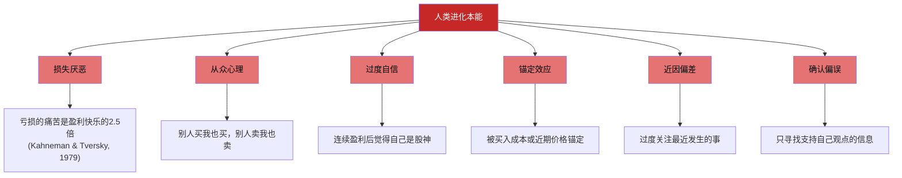
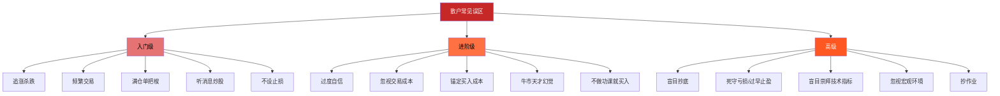
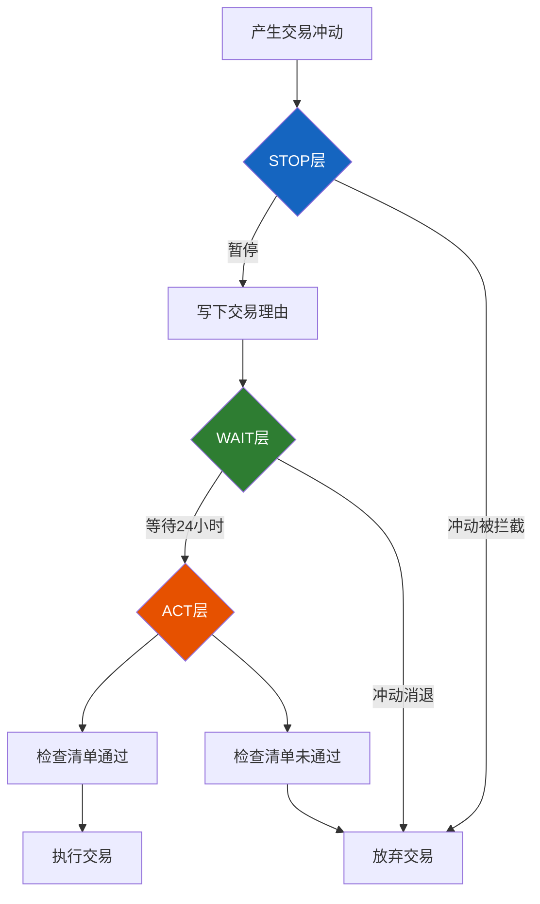

# 第06章 股票投资实战——常见误区

> "投资中最重要的不是做对了多少事，而是避免犯下大错。" ——查理·芒格

散户在A股市场长期亏损比例超过90%，这个数字背后不是运气问题，而是**系统性的认知偏差和行为错误**。本章不讲高深理论，只做一件事：把你可能正在犯的错误——或者即将犯的错误——逐个拆解，告诉你错在哪里、为什么会错、以及如何纠正。

每个误区都按统一框架呈现：**表现识别 → 底层原因 → 数据佐证 → 纠正方法 → 自查清单**。读完后，你应该能构建一份属于自己的"避坑清单"。

---

## 一、行为金融学基础：理解你为什么会犯错

在逐一拆解误区之前，有必要先理解一个核心事实：**大多数投资错误不是因为你笨，而是因为你的大脑在进化中形成的本能反应与理性投资的要求相冲突。**

人类大脑经过数百万年的进化，形成了快速决策、从众避险的本能。这些本能在非洲草原上能救命，但在股市中会要命。



诺贝尔经济学奖得主丹尼尔·卡尼曼在《思考，快与慢》中将人的思维分为两个系统：系统1（快速、直觉、情绪化）和系统2（慢速、理性、需要消耗精力）。投资决策几乎全部应该由系统2做出，但散户在90%的情况下都在用系统1。

**这意味着什么？** 意味着"知道"错误并不够——你的本能会在关键时刻压过理性。所以纠正方法不仅是"认知升级"，更要建立**外部约束机制**（交易规则、检查清单、冷静期制度），用制度对抗本能。

---

## 二、入门级误区：新手最常踩的五个坑

### 误区一：追涨杀跌——情绪驱动的亏损引擎

#### 表现特征

- 看到某只股票连续涨停，忍不住在第4、5个板追进去
- 手里的股票一跌就慌，跌5%就想卖，跌10%就割肉
- 买入和卖出的依据是"涨了还会涨""跌了还会跌"
- 每天盯盘超过4小时，涨了开心、跌了焦虑

#### 底层心理机制

追涨杀跌的本质是**趋势外推偏见**（Trend Extrapolation Bias）——人类大脑天生倾向于认为当前的趋势会延续。当股票连涨3天，你的大脑自动预测"明天还会涨"；当股票连跌3天，你的大脑预测"明天还会跌"。

这个偏见在进化中有其合理性：在原始环境中，看到同伴往某个方向跑，跟着跑大概率是正确的。但股市不是原始草原——股价的短期走势接近随机游走，历史走势不能预测未来。

同时，追涨杀跌还受到**后悔厌恶**（Regret Aversion）的驱动：看到别人赚钱而自己没买，比自己亏钱更痛苦。这种痛苦驱动你在高点仓促入场；而持有亏损股票时，卖出意味着"承认错误"，这种痛苦又驱动你死拿到底。

#### 数据佐证

| 研究来源 | 核心发现 |
|---------|---------|
| 深交所2019年统计 | A股散户平均收益率-3.7%，同期沪深300涨36%，差距39.7个百分点 |
| Barber & Odean (2000) | 交易最频繁的散户年均收益比市场低6.5个百分点 |
| 上交所2020年统计 | 散户在牛市中后期大量入场，在熊市初期大量离场 |
| 行为金融学实证 | 散户的买入时点平均在股价已上涨20-30%之后 |

一个经典案例：2020年7月，A股出现"牛市"行情，沪指从2900点快速涨至3400点。大量散户在3300-3400点高位入场，结果7月中旬开始回调，沪指在一个月内跌回3200点。追高的散户平均亏损10-15%。

#### 纠正方法

**建立"冷却机制"：**

1. **24小时冷静期规则**：产生买入冲动后，强制等待24小时。把想买的股票写在纸上，记录当时的理由和价格，24小时后再做决定。研究显示，冲动型交易中有超过60%在冷静期后会被放弃。

2. **估值锚定法**：不以价格走势为买入依据，而以估值为锚。只有当PE低于历史中位数的70%分位时才考虑买入。具体操作：在行情软件中查看个股PE的10年历史分位数，低于30%分位才进入观察池。

3. **分批建仓制度**：任何股票都不一次性买入，分3-4批建仓。第一批试探性买入1/4仓位，确认判断正确后再逐步加仓。这能有效降低"一把梭在最高点"的风险。

4. **反向操作训练**：当你产生强烈的"必须马上买/卖"冲动时，有意识地做相反的操作——至少不做任何操作。告诉自己："市场越是让我恐慌或贪婪的时候，越应该冷静。"

#### 自查清单

- [ ] 我是否在过去一个月内因为"涨了"而买入过某只股票？
- [ ] 我是否因为"跌了"而卖出过某只股票，卖出后它又涨回来了？
- [ ] 我是否有过"买完就跌、卖完就涨"的经历？
- [ ] 我是否在牛市中后期才开始加大投入？

---

### 误区二：频繁交易——用勤奋掩盖盲目

#### 表现特征

- 每天都要操作，一天不交易就手痒
- 持有股票平均不超过一周
- 一年换手率超过500%（即平均每只股票持有不到3个月）
- 总觉得"今天的行情不做点什么就亏了"
- 账户中频繁出现"买了卖、卖了买"的循环

#### 底层心理机制

频繁交易的核心驱动力是**控制错觉**（Illusion of Control）——人倾向于认为自己对随机事件有控制力。每天看盘、下单、调整仓位，让你产生"我在掌控局面"的错觉。但事实上，短期股价波动近似随机游走，你的"操作"对结果几乎没有正面影响。

另一个驱动力是**行动偏见**（Action Bias）——面对不确定性时，人倾向于"做点什么"而不是"什么都不做"。这在足球守门员身上有经典体现：守门员面对点球时，无论向左扑、向右扑还是站中间，扑救成功率其实差不多，但90%以上的守门员会选择扑向一侧——因为"站着不动"让人感觉没有尽力。

股市中的"坐着不动"同样需要勇气。当别人在交易、在讨论"今天买什么"时，你的"什么都不做"会带来焦虑感。但真正的投资大师，90%的时间都在等待。

#### 交易成本的真实侵蚀

很多人低估了频繁交易的成本。以下是一笔详细计算：

| 成本项目 | 单次金额（以10万元交易额为例） |
|---------|--------------------------|
| 佣金（万2.5，双向） | 50元 |
| 印花税（千1，仅卖出） | 100元 |
| 过户费（十万分之一，双向） | 2元 |
| **单次买卖总成本** | **约152元（0.152%）** |
| 滑点成本（估计） | 约0.05-0.1% |
| **实际单次成本** | **约0.2-0.25%** |

假设一年换手率500%（即平均每只股票持有2.4个月）：

- 年交易成本 = 0.2% × 500% = **10%**
- 这意味着你需要比市场多赚10%才能保本
- 而巴菲特的长期年化收益率也才20%左右

**换句话说，频繁交易的散户，需要有巴菲特一半的水平，才能在扣费后不亏钱。**

#### 数据佐证

Barber和Odean在2000年发表的经典论文《Trading Is Hazardous to Your Wealth》中，分析了66,465个家庭在1991-1996年的交易记录。结论是：

- 交易最频繁的20%投资者，年均收益率比市场低约7个百分点
- 散户的平均年换手率约75%，但前20%的高频交易者换手率超过150%
- 如果将这些散户直接转为买入并持有指数基金，他们的年均收益会提升4-5个百分点

#### 纠正方法

1. **交易次数限制**：每月交易次数硬性上限3次。把交易记录打印出来贴在显示器旁边，每次下单前先数一下本月已交易几次。

2. **交易日志制度**：每次交易前必须写下书面理由——"我为什么要买/卖这只股票？""买入逻辑是什么？""什么情况下会卖出？"如果写不出合理的理由，就不做这笔交易。

3. **条件单替代手动操作**：提前设置好买入条件单（低于某价格自动买入）和止盈止损单，然后关闭行情软件。用规则替代盯盘。

4. **换个时间框架思考**：问自己"如果这只股票我要持有3年，今天的0.5%波动重要吗？"答案几乎总是"不重要"。

#### 自查清单

- [ ] 我的年换手率是否超过300%？
- [ ] 我是否每天至少打开一次行情软件？
- [ ] 我是否有时交易前没有写下书面理由？
- [ ] 我最近一年的交易成本总额是多少？（在券商APP中可以查看）

---

### 误区三：满仓单把梭——集中风险的定时炸弹

#### 表现特征

- 把所有资金压在一只股票上
- 买入理由是"我特别看好这只股票"
- 持仓中只有一只股票，没有任何分散
- 单只股票仓位超过总资产的50%

#### 为什么集中持仓是危险的

很多人用"巴菲特也集中持仓"来为自己的行为辩护。但这里有一个巨大的区别：

| 维度 | 散户集中持仓 | 巴菲特集中持仓 |
|------|-----------|-------------|
| 研究深度 | 看了几篇股评、听了朋友推荐 | 团队数月深度调研，阅读全部公开资料 |
| 信息来源 | 公开信息+小道消息 | 管理层直接对话+行业专家访谈 |
| 估值能力 | 凭感觉判断"贵不贵" | DCF模型+多种估值交叉验证 |
| 资金规模 | 几万到几十万 | 几十亿到几百亿 |
| 容错空间 | 一次黑天鹅可能归零 | 即使单只亏损50%，对整体影响可控 |

简单说：**你不是巴菲特，不能用巴菲特的方法。**

#### 历史教训

A股市场中，满仓单只股票导致重大亏损的案例不胜枚举：

- **乐视网（300104）**：2015年最高价89.47元，2020年退市价0.18元。满仓持有者亏损99.8%，即100万变成2000元。
- **暴风集团（300431）**：2015年上市后暴涨至327元，2020年退市。满仓者血本无归。
- **康美药业（600518）**：2018年曝出财务造假，300亿现金"蒸发"。股价从最高28元跌至2元以下。
- **中国石油（601857）**：2007年上市首日48元买入，17年后的今天仍在8元左右，亏损超过80%。

这些都不是垃圾公司，而是曾经的"明星股""白马股"。它们的崩塌说明：**即使是好公司，也可能出现你无法预见的风险。** 分散持仓不是对"好公司"的不信任，而是对"不确定性"的敬畏。

#### 纠正方法

1. **仓位上限规则**：单只股票仓位不超过总资产的20%。这是一个硬性规则，不因任何"看好"而突破。

2. **行业分散**：持有5-8只不同行业的股票。同一行业的股票往往同涨同跌，起不到分散作用。具体建议：
   - 消费（1-2只）
   - 金融（1只）
   - 科技/制造（1-2只）
   - 医药（1只）
   - 能源/资源（1只）
   - 现金/债券（10-20%）

3. **核心+卫星策略**：70%资金配置3-4只长期看好的核心标的，30%资金配置2-3只中短期机会的卫星标的。核心仓位不动，卫星仓位灵活调整。

4. **极端情景测试**：买入前问自己"如果这只股票明天跌50%，我的生活会受到严重影响吗？"如果答案是"会"，那仓位太重了。

#### 自查清单

- [ ] 我的持仓中是否有单只股票占比超过30%？
- [ ] 我的持仓是否集中在同一行业（如全部是科技股）？
- [ ] 我是否在某只股票上"越跌越买"以摊低成本？
- [ ] 如果我最大的持仓跌50%，我的总资产会损失多少？

---

### 误区四：听消息炒股——信息不对称的牺牲品

#### 表现特征

- 根据"内幕消息""朋友推荐""股吧大V建议"买卖股票
- 相信"某某公司的高管告诉我……"
- 加入各种"荐股群""牛股群"，每天根据群主推荐操作
- 看到新闻标题就做出买卖决定

#### 信息传播的真实链条


一条消息从产生到传到你耳朵里，经历了至少3-4个层级的传播。到了你这里：

1. **时间已晚**：股价可能已经反映了这个消息（信息已被消化）
2. **内容已变形**：每经过一个人的转述，信息都会失真和放大
3. **动机可疑**：告诉你消息的人，他的目的是什么？是帮你赚钱，还是让你接他的盘？

#### 荐股群的商业模式

很多"荐股群"的赚钱方式不是靠炒股，而是靠收会员费或者让你接盘：

**模式一：会员费模式**
- 免费群每天推荐2-3只股票，碰对了就大肆宣传，碰错了就默默删除
- 赚钱后引导你付费加入"VIP群"（月费几百到几千元）
- VIP群的推荐质量并没有本质提升

**模式二：接盘模式**
- 主力建仓完成后，通过各种渠道散布"好消息"
- 散户蜂拥而入，推高股价
- 主力趁机出货，散户成为接盘侠
- 这就是为什么很多"好消息"出来后股价反而跌

**模式三：概率游戏模式**
- 将1000人分为2组，给A组推荐股票X看涨，给B组推荐股票X看跌
- 第二天，将预测正确的一组再分为2组，继续推荐
- 经过5轮，剩下约30人，这些人看到的"预测师"连续5次正确，于是深信不疑
- 但实际上只是概率筛选的结果

#### 数据佐证

中国证监会2019-2023年查处的非法荐股案件中：
- 涉及金额超过100亿元
- 受害投资者超过50万人
- 典型案件中，"荐股大师"自己根本不用推荐的策略交易

#### 纠正方法

1. **建立信息分级体系**：

| 信息来源 | 可信度 | 处理方式 |
|---------|--------|---------|
| 上市公司公告（巨潮资讯网） | ★★★★★ | 必读，作为决策基础 |
| 券商研报（头部券商） | ★★★★ | 参考，但注意分析师的立场 |
| 财经媒体深度报道 | ★★★ | 辅助了解行业和公司 |
| 社交媒体/股吧/论坛 | ★★ | 仅作为情绪指标参考 |
| 朋友推荐/荐股群 | ★ | 忽略，或仅作为反向指标 |

2. **逆向验证法**：对任何消息，都问三个问题——"这个消息的来源是什么？""为什么这个人要告诉我？""如果这个消息是真的，为什么股价还没有反映？"

3. **独立研究制度**：听到任何推荐后，不直接买入，而是先自己做一轮研究。如果自己研究后仍然看好，再买入。记住：**如果你不能用自己的语言解释为什么买入这只股票，那你就不应该买。**

4. **记录消息推荐结果**：把每次听到的推荐记下来，3个月后统计准确率。你会发现，大多数推荐的准确率和抛硬币差不多。

#### 自查清单

- [ ] 我是否加入了任何荐股群？
- [ ] 我最近3个月内是否因为"别人推荐"而买入过股票？
- [ ] 我能否用自己的话清楚解释我持仓的每只股票的买入逻辑？
- [ ] 我的信息来源中，社交媒体/股吧/论坛的占比是否超过50%？

---

### 误区五：不设止损——用"长期持有"掩盖"不愿认错"

#### 表现特征

- 亏了就死拿，心想"总会涨回来的"
- 用"价值投资就是长期持有"来为自己的深度套牢辩护
- 账户中有多只亏损超过30%的股票，一直没卖
- 从不设置止损位，觉得"设止损就是不看好这只股票"

#### "长期持有"≠"死拿不卖"

这是散户最常犯的概念混淆。长期持有的前提是**公司基本面没有恶化**。如果公司的基本面发生了根本变化（财务造假、行业衰退、管理层重大失误），"长期持有"就变成了"长期亏损"。

真正的价值投资者也有卖出纪律：
- 巴菲特在2020年清仓了航空股（疫情改变了行业基本面）
- 巴菲特在2023年大幅减持台积电（地缘政治风险超出预期）
- 彼得·林奇说过："如果当初的买入理由不再成立，不管盈亏都应该卖出"

#### 资金的机会成本

深度套牢的隐性损失不仅是浮亏，更是**机会成本**：

假设你在A股票上套牢了5万元（亏损50%，浮亏2.5万），如果卖出并买入一只更好的标的：
- A股票可能需要2年才能回本（如果能回本的话）
- 如果新标的年化收益15%，2年后5万元变成6.6万元
- 机会成本 = 6.6万 - 2.5万（当前市值）= 4.1万元

**死拿不卖不是"没有亏损"，只是"没有实现亏损"。** 账面浮亏和实际亏损的区别，只是你什么时候点击"卖出"按钮而已。

#### 纠正方法

1. **买入前设定止损位**：每笔交易在买入时就设定好止损位。常用的止损规则：
   - **绝对止损**：亏损达到10%无条件卖出
   - **技术止损**：跌破关键支撑位（如60日均线）卖出
   - **基本面止损**：公司基本面发生重大变化时卖出（不论盈亏）

2. **区分"暂时下跌"和"基本面恶化"**：

| 情形 | 表现 | 应对 |
|------|------|------|
| 暂时下跌 | 整个行业/大盘都在跌，公司基本面没有变化 | 可以持有甚至加仓 |
| 基本面恶化 | 公司营收利润大幅下滑、出现财务问题、行业被颠覆 | 果断止损，不要等反弹 |

3. **"空仓审视"法**：如果现在你空仓，手里有现金，你会以当前价格买入这只股票吗？如果答案是"不会"，那你应该卖出。**你的持仓决策不应该受到买入成本的影响。**

4. **止损不是认输**：把止损看作"保险费"——你花10%的代价避免了可能的50%甚至100%的亏损。保险公司不会因为客户没有出险就觉得"保费白交了"。

#### 自查清单

- [ ] 我的持仓中是否有亏损超过20%的股票？
- [ ] 这些亏损股中，有多少我是在买入时就设定了止损位的？
- [ ] 如果我空仓，我是否愿意以当前价格买入这些亏损股？
- [ ] 我是否用"等回本"作为继续持有的唯一理由？

---

## 三、进阶级误区：有经验投资者的陷阱

### 误区六：过度自信——把运气当能力

#### 表现特征

- 连续几次盈利后觉得自己"悟道了"，开始加大仓位
- 开始向朋友推荐股票，享受"股神"的感觉
- 放松交易纪律，觉得"规则是给新手的"
- 开始使用杠杆（融资融券），觉得"用杠杆才能赚大钱"

#### 心理归因偏差

心理学研究表明，人在归因时存在不对称性：
- **盈利时**：归功于自己的能力（"我选的股票好"）
- **亏损时**：归咎于运气不好（"大盘跌了没办法"）

这种偏差导致你永远觉得自己做得不错——赚了是因为自己厉害，亏了是因为运气差。长此以往，你会越来越自信，直到市场给你一次毁灭性的教训。

一个典型的心理实验：让一群人预测硬币正反面，连续猜对5次的人，会开始相信自己有"特殊能力"。股市中的连续盈利与之类似——在牛市中，随便买什么都涨，但你不会觉得自己是运气好。

#### 数据佐证

- 2020-2021年A股牛市中，大量散户年化收益超过50%，很多人辞职专职炒股
- 2022年熊市来临，这些散户平均亏损超过20%，把之前的利润全部回吐
- 综合2020-2022年三年，超过70%的散户并未真正盈利

一个经典案例：2020年某知名财经博主，用100万本金在一年内做到300万，在社交媒体上大量吸粉并开始卖课。2021年加杠杆操作，半年内300万亏回50万，从此销声匿迹。

#### 纠正方法

1. **绩效归因表**：每季度制作一张绩效归因表，将收益分解为：
   - 市场整体贡献（β收益）
   - 选股贡献（α收益）
   - 择时贡献
   - 运气成分（无法解释的部分）

   如果你的收益主要来自β（市场涨了你跟着涨），那说明你的能力还没有体现。

2. **与指数对标**：每半年计算一次自己的收益率，与同期沪深300指数对比。如果连续两个半年跑输指数，说明你的主动管理没有价值，不如直接买指数基金。

3. **牛熊周期验证**：至少经历一个完整的牛熊周期（通常5-7年），才能评估自己的真实投资能力。在牛市中赚钱不代表能力强，可能只是运气好。

4. **杠杆红线**：无论多么自信，都不使用融资融券。杠杆是把双刃剑——它放大收益的同时也放大亏损。散户使用杠杆的长期结局，99%是亏损。

#### 自查清单

- [ ] 我最近一次加仓是否因为"最近赚了不少，信心很足"？
- [ ] 我是否曾向朋友推荐过股票？推荐的结果如何？
- [ ] 我是否使用过或考虑过使用融资融券？
- [ ] 我过去一年的收益率是否跑赢沪深300？

---

### 误区七：忽视交易成本——利润的隐形杀手

#### 表现特征

- 只看涨跌幅，从不计算佣金、印花税和滑点
- 觉得"手续费才万几，忽略不计"
- 频繁做T+0（日内交易），每次赚几百块但成本也不少
- 不知道自己的券商佣金率是多少

#### 交易成本的完整构成

| 成本类型 | 计算方式 | 金额（以10万元为例） | 备注 |
|---------|---------|-------------------|------|
| 佣金 | 成交额 × 佣金率（双向） | 25-50元（万2.5-万5） | 可协商，最低万1 |
| 印花税 | 成交额 × 0.1%（仅卖出） | 100元 | 国家税收，无法减免 |
| 过户费 | 成交额 × 0.001%（双向） | 1元 | 仅沪市收取 |
| 滑点成本 | 实际成交价与预期价的差额 | 50-100元（估计） | 与交易速度和盘口深度有关 |

**一次完整买卖的综合成本约为0.2-0.3%。** 看似不多，但复利效应下会非常惊人。

#### 累积效应计算

假设初始资金10万元，年化毛收益率15%，不同交易频率下20年后的资产规模：

| 换手率 | 年交易成本 | 净收益率 | 20年后资产 |
|-------|----------|---------|----------|
| 100%（买入持有） | 0.25% | 14.75% | 157万 |
| 300%（中频交易） | 0.75% | 14.25% | 144万 |
| 500%（较高频） | 1.25% | 13.75% | 132万 |
| 1000%（高频交易） | 2.5% | 12.5% | 105万 |

**从100%换手到1000%换手，20年后差距超过50万元。** 交易成本不是"忽略不计"的数字，而是长期收益的巨大拖累。

#### 纠正方法

1. **降低佣金率**：联系券商客户经理，要求降低佣金率到万1-万1.5。目前主流互联网券商（华泰、东方财富、国金等）默认佣金率已经较低，但老账户可能仍在万2.5-万5。

2. **使用限价单**：尽量使用限价单而非市价单。市价单虽然成交快，但在波动较大的时段会产生明显的滑点。

3. **交易成本纳入计算**：在计算每笔交易的盈亏时，必须扣除交易成本。很多散户觉得自己"赚了500块"，但扣除来回佣金和印花税后可能只赚了300块，甚至不赚。

4. **减少交易频率**：这与误区二一致。降低交易频率是降低交易成本最直接的方法。

#### 自查清单

- [ ] 我知道自己的券商佣金率是多少吗？
- [ ] 我过去一年的总交易成本是多少？（可在券商APP中查询）
- [ ] 我是否使用限价单为主？
- [ ] 我在计算交易盈亏时是否扣除了交易成本？

---

### 误区八：锚定买入成本——沉没成本的陷阱

#### 表现特征

- 总是拿当前价格和自己的买入成本比较
- "这只股票我买的成本是50块，现在48块，我不卖，等回本再说"
- "这只股票我30块买的，现在涨到60块了，翻倍了，该卖了"
- 所有的买卖决策都围绕"我的成本价"展开

#### 为什么买入成本不重要

这是一个经济学中经典的**沉没成本谬误**（Sunk Cost Fallacy）：

> 你的买入成本是已经发生的、无法改变的历史事实。它不应该影响你对未来的决策。

股票不知道你多少钱买的。你的买入成本对股价未来的走势没有任何影响。**正确的决策框架是"向前看"——基于当前的信息和未来的预期做决策，而不是基于过去的历史。**

一个思想实验：
- 情形A：你30元买入某股票，现在涨到60元
- 情形B：你60元买入同一只股票，现在价格60元
- 情形A中你倾向于"赚了一倍，该卖了"
- 情形B中你倾向于"刚买入，再看看"

**两种情形下，你的持仓成本完全相同——都是60元的机会成本。** 但你的决策会因为历史买入价的不同而完全不同。这就是锚定效应的典型表现。

#### 纠正方法

1. **"空仓审视"法**：每天早上问自己——"如果我现在有现金但没有持仓，我会以当前价格买入这些股票吗？"如果答案是"不会"，那就应该考虑卖出。

2. **隐藏成本价**：大多数券商APP都支持隐藏持仓成本。在做决策时，先不看成本价，只看公司的基本面和当前估值。

3. **定期"重新建仓"审视**：每季度将自己的持仓"假设"清仓，然后用当前信息重新评估是否值得买入。如果某些股票在"重新评估"后不值得买入，就卖出它们。

4. **关注基本面变化**：把注意力从"我赚了多少/亏了多少"转移到"公司的基本面有没有变化"。如果公司越来越好，不管你是赚是亏，都应该持有；如果公司越来越差，不管你是赚是亏，都应该卖出。

#### 自查清单

- [ ] 我卖出股票的主要理由是否经常是"回本了"或"赚了XX%"？
- [ ] 我是否经常查看自己的持仓成本价？
- [ ] 我是否因为"还没回本"而拒绝卖出基本面恶化的股票？
- [ ] 我是否因为"已经赚了一倍"而急于卖出基本面仍然优秀的股票？

---

### 误区九：在牛市中觉得自己是天才

#### 表现特征

- 牛市中赚了50-100%后觉得自己投资能力超群
- 开始辞职炒股、把房子抵押炒股
- 在社交媒体上分享自己的"投资心得"
- 开始嘲笑那些"不懂投资"的人

#### 牛市的幻觉

牛市是最危险的老师——它给你正确的答案，但错误的理由。

在2020-2021年的A股牛市中：
- 偏股型基金平均收益率超过60%
- "炒股"相关话题在微博、抖音上的热度增长了300%
- 大量95后、00后新开证券账户，入市"淘金"
- 一些散户在社交媒体上炫耀收益，吸引了更多人入场

然后2022年来了：
- 偏股型基金平均亏损超过20%
- 之前最活跃的投资者群体大面积亏损
- "炒股"相关话题的热度骤降
- 大量在牛市入场的散户割肉离场

**在牛市中，选股能力、择时能力、甚至基本的投资常识都不太重要——因为水涨船高，闭着眼睛买都能赚。** 但这种"赚钱"是系统性风险溢价，不是你的能力。

#### 巴菲特的比喻

沃伦·巴菲特有一个著名的比喻："只有在退潮的时候，你才能看到谁在裸泳。"牛市就是涨潮——所有人在水里看起来都穿着衣服。但熊市一来，谁有真本事、谁在裸泳，一目了然。

#### 纠正方法

1. **至少经历一个完整牛熊周期**：如果你投资不到3年，还没有资格评估自己的投资能力。给自己定一个规则：在经历至少一次完整的牛熊转换之前，不要改变自己的投资策略（包括仓位、频率等）。

2. **牛市中适当止盈**：当你的收益率显著超过历史平均水平时（比如年化超过30%），应该适当减仓锁定利润。具体操作：
   - 收益达到30%时，卖出20%仓位
   - 收益达到50%时，再卖出20%仓位
   - 收益达到100%时，再卖出20%仓位
   - 保留40%仓位继续持有，但设好移动止盈

3. **能力-运气分解表**：

| 信号 | 可能是能力 | 可能是运气 |
|------|----------|----------|
| 收益来源 | 选股精准，选出了跑赢行业的个股 | 整个行业/市场都在涨 |
| 持仓逻辑 | 有清晰的买入和卖出理由 | "别人都在买" |
| 风控表现 | 熊市中回撤控制在20%以内 | 还没经历过熊市 |
| 对标基准 | 持续跑赢沪深300 | 与指数差不多或略高 |

4. **保持对市场的敬畏**：市场永远比你聪明。即使你在过去10年都做得很好，也不代表未来10年会继续好。保持谦逊、保持学习、保持纪律。

---

### 误区十：不做功课就买入——用30秒决定3万元的去向

#### 表现特征

- 花30秒决定买入一只股票，理由是"朋友说好"或"最近涨得不错"
- 从未完整读过任何一家公司的年报
- 不知道公司的主营业务是什么、竞争对手是谁
- 对PE、PB、ROE等基本估值指标一无所知

#### 讽刺性的对比

| 决策场景 | 投入金额 | 研究时间 | 研究深度 |
|---------|---------|---------|---------|
| 买一部手机 | 3000-6000元 | 1-2周 | 看无数评测视频、对比参数、去实体店体验 |
| 买一台电脑 | 5000-15000元 | 1-3天 | 详细对比配置、查看用户评价 |
| 买一只股票 | 10000-100000元 | 30秒-1分钟 | 看了一眼K线图或听朋友推荐 |

**你在买手机上花的时间比在买股票上花的时间多得多，但后者涉及的金额可能是前者的10-30倍。** 这说明散户对投资的重视程度远远不够。

#### 最低功课标准

买入一只股票前，至少应该了解以下信息：

**公司基本面（必做）：**
- 公司主营业务是什么？（用一句话说清楚）
- 公司的收入和利润在过去3年是增长还是下滑？
- 公司的ROE（净资产收益率）是否超过12%？
- 公司的负债率是否低于60%？
- 公司的经营现金流是否为正？

**估值判断（必做）：**
- 当前PE（市盈率）是多少？处于历史什么分位？
- 当前PB（市净率）是多少？
- 与同行业其他公司相比，估值是高还是低？

**风险识别（必做）：**
- 公司有没有大额商誉？
- 有没有未决诉讼或监管风险？
- 大股东有没有频繁减持？
- 有没有财务造假的历史记录？

#### 纠正方法

1. **"投资研究报告"模板**：每买入一只股票前，填写一份标准模板：

```text
【投资研究摘要】
股票代码：______
公司名称：______
主营业务：______
买入理由：______
目标价格：______
止损价格：______
预期持有时间：______
风险因素：______
```

2. **"三问检验"**：买入前问自己三个问题：
   - 这家公司靠什么赚钱？（商业模式）
   - 这家公司比同行强在哪里？（竞争优势）
   - 当前价格是便宜还是贵？（估值判断）

   如果任何一个问题答不上来，就不要买。

3. **年报精读计划**：每个月精读1-2份上市公司年报。先从你持仓的公司开始，再扩展到你感兴趣的行业。年报可以在巨潮资讯网（cninfo.com.cn）免费下载。

4. **模拟投资先行**：对于没有做过功课就想买的股票，先在模拟盘中买入并记录理由，观察1-3个月。这期间认真做功课，如果功课做完后仍然看好，再在实盘中买入。

#### 自查清单

- [ ] 我能否用一句话说清楚我持仓的每只股票的主营业务？
- [ ] 我过去一年读过几份上市公司年报？
- [ ] 我在买入股票前是否会填写投资研究模板？
- [ ] 我是否知道我持仓的每只股票的PE和ROE？

---

## 四、高级误区：认知层面的深层陷阱

### 误区十一：盲目抄底——"已经跌了这么多，不会再跌了吧"

#### 表现特征

- 股价从100元跌到50元，觉得"腰斩了，肯定到底了"
- 不看公司基本面变化，只看"跌了多少"
- 越跌越买，试图"摊低成本"
- 抄底的理由是"历史上这个价格买的人都是赚钱的"

#### 底层心理机制

这是**锚定效应**和**赌徒谬误**的结合：
- **锚定效应**：你被历史最高价锚定了。100元跌到50元，你的大脑告诉你"已经便宜了一半"——但50元可能仍然远高于公司的内在价值。
- **赌徒谬误**：你认为"连续跌了这么多天，明天涨的概率更大了"。但股价走势不是抛硬币——每一步都是独立事件，过去跌了多少与未来涨跌无关。

#### 经典案例

| 股票 | 最高价 | "腰斩抄底"价 | 最终价格 | 腰斩后继续跌幅 |
|------|--------|-------------|---------|-------------|
| 乐视网 | 89元 | 44元 | 0.18元 | -99.6% |
| 暴风集团 | 327元 | 163元 | 退市 | -100% |
| 中国石油 | 48元 | 24元 | 8元 | -67% |
| 康美药业 | 28元 | 14元 | 2元 | -86% |
| 恒瑞医药 | 97元 | 48元 | 25元 | -48% |

这些案例说明：**腰斩不是底，膝盖斩不是底，脚踝斩可能也不是底。** 只有基本面才是判断底部的依据。

#### 纠正方法

1. **用估值而非跌幅判断底部**：不看"跌了多少"，看"当前估值处于历史什么分位"。当PE/PB处于近10年最低的20%分位时，才开始关注。

2. **基本面确认法**：在"抄底"前，确认以下条件：
   - 公司营收和利润仍在增长（或至少没有大幅下滑）
   - 公司现金流仍然健康
   - 行业没有出现结构性衰退
   - 没有财务造假、管理层丑闻等负面事件

3. **分批买入法**：如果决定"抄底"，将计划投入的资金分成5-6批，在不同价格区间分批买入。这能有效避免"抄在半山腰"的风险。

4. **"跌了不买"纪律**：对于下跌中的股票，只有在出现明确的止跌信号（如连续3天缩量企稳、出现放量阳线等）后才考虑买入。

#### 自查清单

- [ ] 我是否有"越跌越买"的习惯？
- [ ] 我抄底的理由是否主要是"已经跌了这么多"？
- [ ] 我在抄底前是否确认了公司的基本面仍然健康？
- [ ] 我是否有过抄底后继续大幅亏损的经历？

---

### 误区十二：死守亏损、过早止盈——赔率错配的行为陷阱

#### 表现特征

- 亏损的股票一直拿着，心想"等回本就卖"
- 盈利的股票赚了10-20%就急于卖出，"落袋为安"
- 账户中长期保留多只深套的股票，但赚钱的股票很少能持有超过一个月
- 整体算下来，亏损的金额远大于盈利的金额

#### 底层心理机制

这正是卡尼曼和特沃斯基的**前景理论**（Prospect Theory）所揭示的核心现象——**损失厌恶**：

- 面对亏损时，人倾向于"赌一把"，希望股价反弹（风险偏好型）
- 面对盈利时，人倾向于"落袋为安"，害怕利润消失（风险厌恶型）

这种行为模式的数学结果是：**你截断了盈利，却保留了亏损。** 长期来看，这是亏损的必然之路。

```text
理想的投资结果：  小亏 + 小亏 + 大赚 + 小亏 + 大赚 = 盈利
散户的典型结果：  大亏 + 大亏 + 小赚 + 大亏 + 小赚 = 亏损
```

#### 数据佐证

行为金融学研究显示，散户的卖出决策呈现明显的"处置效应"（Disposition Effect）：
- 散户卖出盈利股票的概率比卖出亏损股票的概率高1.5倍
- 散户持有亏损股票的平均时间比持有盈利股票的平均时间长50%
- 这种行为每年造成约3-5%的收益损失

#### 纠正方法

1. **移动止盈法**：对于盈利的股票，不设固定的止盈点，而是使用移动止盈：
   - 股价上涨过程中，将止盈位设在最高点回撤10-15%的位置
   - 股价继续上涨，止盈位跟着上移
   - 直到股价跌破止盈位才卖出
   - 这样既能保护利润，又不会过早卖出大牛股

2. **硬性止损纪律**：对于亏损的股票，设置绝对止损位（如-10%或-15%），无条件执行。不抱侥幸心理，不等"反弹"。

3. **定期持仓审查**：每月审查一次持仓，对每只股票问：
   - 如果我现在空仓，我会以当前价格买入它吗？
   - 公司的基本面在过去一个月有改善还是恶化？
   - 如果答案是"不会买入"或"基本面恶化"，就卖出。

4. **"截断亏损，让利润奔跑"训练**：把这句话写在便利贴上，贴在显示器旁边。每次做卖出决策时，先看看这句话。

#### 自查清单

- [ ] 我卖出盈利股票的平均持有时间是否比卖出亏损股票的短？
- [ ] 我是否经常在股票盈利10-20%时就急于卖出？
- [ ] 我是否经常在股票亏损时选择"再等等看"？
- [ ] 我的交易记录中，盈利交易和亏损交易的平均金额哪个更大？

---

### 误区十三：盲目崇拜技术指标——把工具当神谕

#### 表现特征

- 同时使用10个以上技术指标，指标之间互相矛盾时不知所措
- 相信某个指标能"预测"股价走势
- 不断尝试新的技术指标和参数组合，寻找"圣杯指标"
- 忽略基本面分析，认为技术分析可以解决一切问题

#### 技术分析的本质与局限

技术分析的价值在于**描述当下**——告诉你市场目前处于什么状态（趋势向上/向下/震荡）。但它不能**预测未来**——没有任何技术指标能可靠地预测股价的下一步走势。

技术分析的四个根本局限：

1. **滞后性**：所有技术指标都是基于历史数据计算的，天然具有滞后性。当你看到"买入信号"时，股价可能已经涨了一截；当你看到"卖出信号"时，股价可能已经跌了一段。

2. **自我实现与自我毁灭**：当足够多的人使用同一个指标时，该指标的信号可能成为自我实现的预言（大家同时买入推高股价）。但一旦有人利用这一点反向操作，信号就会失效。

3. **无法预测黑天鹅**：技术分析基于历史规律，但真正影响股价的重大事件（政策变化、财务造假、疫情爆发等）是无法从历史数据中预测的。

4. **诱导频繁交易**：技术指标频繁发出信号，容易诱导投资者频繁交易。而频繁交易（如误区二所述）是散户亏损的重要原因。

#### 纠正方法

1. **技术分析是"辅"不是"主"**：投资决策的80%应该基于基本面分析，技术分析只用于辅助判断买入和卖出的时机。具体来说：
   - 用基本面决定"买什么"和"值不值得买"
   - 用技术分析辅助决定"什么时候买"和"什么时候卖"

2. **少即是多**：技术指标不超过3个。推荐组合：
   - **均线系统**（MA20 + MA60）：判断趋势方向
   - **MACD**：判断趋势的强度和可能的转折点
   - **成交量**：确认趋势的有效性
   - 这三个指标涵盖了趋势、动量和量价关系，足以应对大多数场景

3. **多指标共振原则**：不因为单个指标发出信号就行动。当均线、MACD、成交量三个指标同时确认同一方向时，信号的可靠性才比较高。

4. **基本面优先原则**：如果技术指标说"买入"但基本面说"不值得买"，以基本面为准。如果技术指标说"卖出"但基本面说"公司越来越好"，以基本面为准。

#### 自查清单

- [ ] 我同时使用了多少个技术指标？超过5个就太多了
- [ ] 我是否因为技术指标的信号而忽略了基本面的变化？
- [ ] 我是否有过不断调整指标参数、寻找"最优组合"的经历？
- [ ] 我是否能清楚解释每个技术指标的计算原理和适用场景？

---

### 误区十四：忽视宏观环境——只看个股不看天

#### 表现特征

- 选股时完全不考虑宏观经济周期
- 不知道当前处于加息周期还是降息周期
- 不关心货币政策、财政政策的变化
- 觉得"好公司在什么环境下都能涨"

#### 宏观环境对股市的影响

再好的公司，也无法对抗宏观大势。以下是A股历史上几次重大宏观事件对市场的影响：

| 事件 | 时间 | 沪指跌幅 | 恢复时间 |
|------|------|---------|---------|
| 全球金融危机 | 2008年 | -65% | 约2年 |
| 钱荒 | 2013年6月 | -15% | 约3个月 |
| 去杠杆+贸易战 | 2018年 | -25% | 约1年 |
| 新冠疫情 | 2020年2月 | -12% | 约2个月 |
| 教培双减+反垄断 | 2021年下半年 | -15% | 约1年 |

在这些系统性下跌中，即使是茅台、腾讯这样的"好公司"也未能幸免。2018年去杠杆期间，茅台从最高800元跌到500元，跌幅超过37%。

#### 关键宏观指标

| 指标 | 观察方式 | 影响路径 |
|------|---------|---------|
| 利率 | 关注央行MLF/LPR调整 | 利率上升→企业融资成本增加→利润下降→股价下跌 |
| 货币供应量（M2） | 每月央行公布 | M2增速上升→流动性充裕→利好股市 |
| CPI/PPI | 每月统计局公布 | CPI过高→央行收紧→利空；PPI上升→企业成本增加→利空 |
| PMI | 每月统计局公布 | PMI>50→经济扩张→利好；PMI<50→经济收缩→利空 |
| 社融数据 | 每月央行公布 | 社融增加→信贷扩张→利好实体经济→利好股市 |

#### 纠正方法

1. **宏观日历制度**：制作一个宏观数据发布日历，关注以下时间节点：
   - 每月中旬：CPI、PPI、社融数据
   - 每月末：PMI
   - 每季度：GDP、央行货币政策报告
   - 每年12月：中央经济工作会议

2. **"大势判断"流程**：在选股之前，先判断当前宏观环境：
   - 经济扩张期（PMI>50、利率低）→偏向周期股、成长股
   - 经济收缩期（PMI<50、利率高）→偏向防御股、高股息股
   - 流动性充裕（M2增速高）→偏向中小盘、题材股
   - 流动性收紧（M2增速低）→偏向大盘蓝筹、白马股

3. **仓位与宏观联动**：根据宏观环境调整总仓位：
   - 经济扩张+流动性充裕：仓位80-90%
   - 经济扩张+流动性收紧：仓位60-70%
   - 经济收缩+流动性充裕：仓位50-60%
   - 经济收缩+流动性收紧：仓位30-40%

#### 自查清单

- [ ] 我是否知道当前的利率环境和央行货币政策方向？
- [ ] 我是否关注每月发布的PMI和CPI数据？
- [ ] 我的选股是否考虑了当前所处的经济周期阶段？
- [ ] 我是否根据宏观环境调整过总仓位？

---

### 误区十五：抄作业——跟踪"聪明钱"的误区

#### 表现特征

- 跟踪知名基金经理的持仓变动，看到他们买了什么就跟着买
- 盯着龙虎榜数据，跟踪"游资"的操作
- 关注"北向资金"的流入流出，作为买卖依据
- 看到大股东增持就买入，看到大股东减持就卖出

#### 为什么"抄作业"行不通

1. **时间延迟**：基金持仓每季度才公布一次。当你看到基金经理的持仓时，他可能已经卖出了。
   - 基金季报：季度结束后15个工作日内发布
   - 实际时滞：你看到的持仓可能是2-3个月前的状态

2. **规模差异**：管理100亿的基金经理和管理10万的散户，投资逻辑完全不同：
   - 基金经理的建仓/减仓可能持续数周甚至数月
   - 散户可以瞬间完成买卖
   - 基金经理不能像散户一样"一键清仓"

3. **信息不对称**：基金经理做出买卖决策时，可能基于你没有的信息（如管理层调研、产业链访谈等）。

4. **"北向资金"的误导**：
   - 北向资金并不是一个统一的"聪明钱"，而是由数千个不同策略的投资者组成
   - 北向资金每天的流入流出金额相对A股总成交额微不足道（通常不到1%）
   - 过度解读北向资金的短期流向是典型的"噪声交易"

#### 纠正方法

1. **不跟踪个股，跟踪方向**：可以从知名基金经理的持仓中了解他们的行业配置方向（比如都在加仓新能源），但不要跟踪具体个股。

2. **只看长期逻辑**：如果某位基金经理连续多个季度持有同一只股票，说明他对这只股票有长期信心。这种信息是有价值的——但你仍然需要自己做功课确认。

3. **独立验证**：看到任何"聪明钱"的动作后，先做自己的分析。如果分析后发现逻辑不通，就不跟进。

#### 自查清单

- [ ] 我是否定期查看基金季报并跟踪基金经理的持仓？
- [ ] 我是否每天关注北向资金的流入流出？
- [ ] 我是否因为"某某基金经理买了"而买入某只股票？
- [ ] 我在跟踪"聪明钱"时是否做了自己的独立分析？

---

## 五、误区全景图与自测工具

### 误区分类总览



### 综合自测表

根据过去6个月的投资行为，对每项进行评分（0=从未，1=偶尔，2=经常，3=几乎每次）：

| 序号 | 误区描述 | 得分 | 等级 |
|:----:|---------|:----:|:----:|
| 1 | 因为股价上涨而买入，因为股价下跌而卖出 | __ | 入门 |
| 2 | 每月交易次数超过5次 | __ | 入门 |
| 3 | 单只股票仓位超过总资产的30% | __ | 入门 |
| 4 | 根据他人推荐或消息买卖股票 | __ | 入门 |
| 5 | 不设止损位，亏损死扛 | __ | 入门 |
| 6 | 连续盈利后加大仓位或放松纪律 | __ | 进阶 |
| 7 | 不知道自己的交易成本是多少 | __ | 进阶 |
| 8 | 买卖决策主要参考买入成本价 | __ | 进阶 |
| 9 | 牛市中觉得自己投资能力很强 | __ | 进阶 |
| 10 | 买入前没有阅读过公司的年报/财报 | __ | 进阶 |
| 11 | 股价大跌后不看基本面就抄底 | __ | 高级 |
| 12 | 盈利的股票急于卖出，亏损的股票一直持有 | __ | 高级 |
| 13 | 同时使用5个以上技术指标 | __ | 高级 |
| 14 | 不关注宏观经济和政策变化 | __ | 高级 |
| 15 | 跟踪基金经理或"聪明钱"的持仓操作 | __ | 高级 |

**评分标准：**

| 总分 | 评级 | 建议 |
|:----:|:----:|------|
| 0-8 | 优秀 | 你已经建立了较好的投资习惯，继续保持 |
| 9-18 | 良好 | 存在一些常见问题，重点纠正得分>=2的项目 |
| 19-27 | 及格 | 有明显的误区需要纠正，建议系统性改进 |
| 28-36 | 危险 | 存在严重问题，建议暂停实盘交易，先系统学习 |
| 37-45 | 极度危险 | 建议清仓并从零开始学习，否则必然长期亏损 |

---

## 六、误区纠正的系统框架

### "STOP-WAIT-ACT" 三层防御体系

纠正投资误区不是靠"知道"就够了，需要建立系统性的防御机制：



**STOP层（触发拦截）：**
- 每次产生交易冲动时，强制暂停
- 在交易日志中写下交易理由和预期
- 不在冲动产生后立即执行

**WAIT层（冷静等待）：**
- 等待至少24小时
- 在等待期间，重新审视交易理由
- 如果等待后冲动消退，则放弃交易

**ACT层（检查清单）：**
- 通过"自查清单"中的所有项目
- 确认符合自己的交易规则
- 只有全部通过才执行交易

### 每周复盘制度

每周花30分钟做一次投资复盘：

1. **本周交易回顾**：记录本周所有的买卖操作，评估每笔操作是否符合自己的交易规则
2. **持仓健康检查**：审查每只持仓股票的基本面是否有变化
3. **误区自查**：对照15个误区，检查本周是否有触犯
4. **宏观环境更新**：关注本周发布的宏观数据，更新自己的宏观判断
5. **下周计划**：制定下周的操作计划（包括观察清单、止盈止损位等）

### 交易日志模板

```text
【交易日志】日期：______

=== 买入记录 ===
股票代码：______
买入价格：______
买入数量：______
买入理由：______
（必须具体：基于什么分析得出的结论）
目标价格：______
止损价格：______
预期持有时间：______

=== 卖出记录 ===
股票代码：______
卖出价格：______
卖出理由：______
（与买入时预设的理由是否一致？）
盈亏金额：______
盈亏比例：______

=== 复盘笔记 ===
这笔交易做得好的地方：______
这笔交易做得不好的地方：______
下次可以改进的地方：______
```

---

## 七、总结：避坑比寻宝更重要

> 沃伦·巴菲特的投资第一原则：**永远不要亏钱。**
> 投资第二原则：**永远不要忘记第一原则。**

在股市中，避免犯大错比追求大赚更重要。原因很简单：

**数学逻辑**：亏损50%后需要上涨100%才能回本，而上涨50%后只需下跌33%就会回到原点。亏损和盈利在数学上是不对称的——亏损的"修复成本"远高于盈利的"创造收益"。

| 亏损幅度 | 回本所需涨幅 |
|:--------:|:----------:|
| -10% | +11% |
| -20% | +25% |
| -30% | +43% |
| -50% | +100% |
| -70% | +233% |
| -90% | +900% |

**实战逻辑**：散户长期亏损的首要原因不是"选不到好股票"，而是"犯了不该犯的大错"。如果你能避免本章列出的15个误区中的大部分，你的收益率就已经能超过80%的散户。

**人生逻辑**：投资是一场马拉松，不是百米冲刺。活得久比跑得快更重要。控制住风险、避免致命错误，时间自然会站在你这一边。

最后，记住查理·芒格的话：

> "如果我知道我会死在哪里，我就永远不去那个地方。"

投资也是如此——知道哪些地方会让你亏钱，然后永远不要去那些地方。

---

*本节内容涉及投资心理和行为分析，建议配合第05节「练习方法」中的复盘模板和交易日志一起使用。知易行难，关键在于持续执行。*
