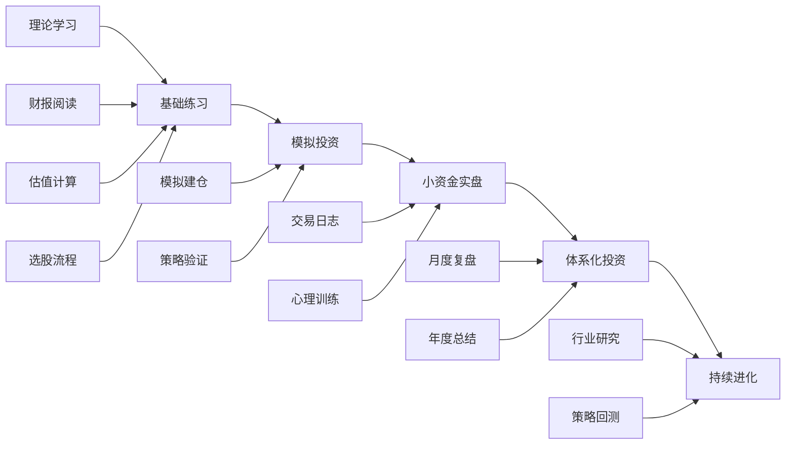

# 第06章 股票投资实战——练习方法

## 练习体系概述

股票投资是一门手艺，和学医、学编程一样，能力只能从大量刻意练习中来。光看书、听课、听别人分析股票，永远只是"知道了"，距离"做到了"隔着十万八千里。本章提供一套从零到一、从模拟到实盘、从简单到复杂的渐进式训练体系，帮你把前几章学的理论和技巧转化成真正能赚钱的肌肉记忆。

### 为什么要系统化练习

大多数人学投资的路径是：看几本书→关注几个大V→凭感觉买卖→亏钱→骂市场→放弃。这条路径失败的根本原因在于缺乏系统化练习。医学实习生不会看完教科书就上手术台，投资也一样——你需要一个有明确目标、循序渐进、有反馈机制的训练方案。

系统化练习的价值体现在三个层面：

**认知层：** 通过反复练习，把"知道"变成"理解"。比如你从书上学到"低PE股票可能被低估"，但只有当你真正拿着10家公司的数据去计算、比较、验证，你才能理解为什么有些低PE股票确实便宜，有些却是因为基本面恶化导致的"价值陷阱"。

**执行层：** 通过模拟和实盘练习，把"理解"变成"能做到"。你知道应该在恐慌时买入，但当你的账户一天亏了5%，你真的能按计划加仓吗？这种能力只有通过反复在真实场景中练习才能获得。

**反馈层：** 通过记录和复盘，把"做了"变成"做得更好"。没有复盘的练习等于白练。每一笔交易、每一次决策都需要被记录、被分析、被改进。

### 训练四大原则

**原则一：先模拟后实盘。** 模拟盘不丢人，它是你用零成本试错的最佳工具。在模拟盘上都没赚到钱的人，实盘只会亏得更惨。至少在模拟盘上连续3个月跑赢基准指数，再考虑投入真金白银。

**原则二：先小资金后大资金。** 即使进入实盘阶段，也要从你完全亏得起的小金额开始。1万元的学费和100万元的学费，学到的东西一样多，但代价相差100倍。小资金阶段的目标不是赚钱，是建立正确的交易习惯和心理素质。

**原则三：先简单策略后复杂策略。** 新手最容易犯的错误是一上来就想搞量化、搞期权、搞多因子模型。先把最简单的价值投资做好——找到好公司、合理价格买入、长期持有——这一个策略就够你用很多年。等简单策略熟练了，再逐步叠加更复杂的工具和方法。

**原则四：重过程轻结果。** 练习阶段，评判标准不是"赚了多少钱"，而是"是否严格执行了计划"。一笔严格按照计划执行但最终亏损的交易，比一笔凭运气赚到钱的冲动交易有价值得多。前者代表你有了正确的习惯，后者只会让你养成赌博心态。

### 能力成长路线图



---

## 第一阶段：基础能力构建（第1-4周）

这个阶段的目标是建立最基础的投资分析能力——能看懂财报、能算估值、能说出一家公司好在哪里、差在哪里。不涉及任何交易操作，纯粹是"磨刀"。

### 练习1：财务报表精读

**目标：** 能独立看懂上市公司的三大财务报表，提取关键信息，形成初步判断。

**为什么这个练习重要：** 财务报表是了解一家公司最真实、最客观的信息来源。年报里的每一个数字背后都藏着公司的经营故事。很多投资者买了股票却从来没看过年报，这就像当医生不看化验单一样荒谬。通过精读3家公司的财报，你能建立起对财务数据的直觉——一眼就能看出哪些数字正常、哪些异常。

**具体步骤：**

**第1步：选择3家你熟悉的公司。** 建议选择消费、科技、金融各一家，这样你能同时了解不同行业的财务特点。推荐组合：
- 消费类：贵州茅台（600519）——高毛利、高ROE的典型
- 科技类：宁德时代（300750）——高增长、重研发的典型
- 金融类：招商银行（600036）——银行股的典型

**第2步：下载年报。** 登录巨潮资讯网（cninfo.com.cn），搜索公司代码，下载最新年度报告（PDF格式，通常200-300页）。重点看以下章节：
- 第一节：公司概况（了解主营业务）
- 第八节：财务报告（三大报表）
- 第十一节：其他重要事项（诉讼、担保等风险）

**第3步：填写财务分析表。** 不要只是"看"，要动手填表、计算：

| 分析维度 | 茅台 | 宁德时代 | 招商银行 |
|----------|------|----------|----------|
| 营业收入（亿元） | | | |
| 营收同比增长率 | | | |
| 净利润（亿元） | | | |
| 净利润同比增长率 | | | |
| 毛利率 | | | |
| 净利率 | | | |
| ROE（净资产收益率） | | | |
| 资产负债率 | | | |
| 经营活动现金流净额 | | | |
| 现金流与净利润比值 | | | |
| 应收账款周转天数 | | | |
| 存货周转天数 | | | |
| 研发支出（亿元） | | | |
| 研发占营收比例 | | | |

**第4步：写出分析结论。** 对每家公司用3-5句话总结：
- 这家公司的赚钱能力强不强？（看毛利率、净利率、ROE）
- 这家公司的成长性如何？（看营收和利润增速）
- 这家公司的财务风险大不大？（看资产负债率、现金流）
- 这家公司最让你印象深刻的一点是什么？

**第5步：横向对比。** 把3家公司放在一起比较，思考：
- 为什么茅台的毛利率高达90%以上，而宁德时代只有20%多？
- 银行的ROE为什么和一般企业不一样？
- 现金流和净利润差距大的公司说明什么？

**预期收获：** 看完财报后，你应该能回答"这家公司靠什么赚钱？赚得多不多？赚得稳不稳？"这三个最基础的问题。

**时间投入：** 6-8小时（建议分2-3天完成，每天2-3小时）

---

### 练习2：估值指标计算与判断

**目标：** 掌握PE、PB、PEG、PS等核心估值指标的计算方法，理解它们各自的适用场景和局限性。

**为什么这个练习重要：** 很多人买股票只看"贵不贵"，但不知道怎么判断。估值指标就是帮你回答"这个价格值不值"的工具。不同的行业、不同类型的公司，适用的估值指标完全不同。用错了指标，判断就会出错。

**核心估值指标速查表：**

| 指标 | 计算公式 | 适用场景 | 不适用场景 | 合理范围参考 |
|------|----------|----------|------------|-------------|
| PE（市盈率） | 股价÷每股收益 | 盈利稳定的成熟公司 | 亏损公司、周期底部 | A股历史中枢15-20倍 |
| PB（市净率） | 股价÷每股净资产 | 重资产行业（银行、地产） | 轻资产公司（互联网） | 银行股通常0.5-1.5倍 |
| PEG | PE÷净利润增长率 | 成长股估值 | 周期股、低增长股 | 1为合理，<1可能低估 |
| PS（市销率） | 市值÷营业收入 | 尚未盈利的高增长公司 | 盈利稳定的公司 | 因行业差异极大 |
| EV/EBITDA | 企业价值÷息税折旧摊销前利润 | 跨国比较、高负债公司 | 轻资产公司 | 因行业差异极大 |
| 股息率 | 每股股息÷股价 | 高分红的价值股 | 不分红的成长股 | 高于3%有吸引力 |

**具体步骤：**

**第1步：选择5只不同行业的股票。** 建议覆盖消费、科技、金融、医药、制造五个行业，每行业选一只龙头。

**第2步：计算并填写估值对比表：**

| 股票 | 当前股价 | 每股收益(EPS) | PE | 每股净资产 | PB | 净利润增长率 | PEG | 当前股息率 | 历史PE分位 |
|------|----------|---------------|-----|------------|-----|--------------|-----|------------|-----------|
| 消费龙头 | | | | | | | | | |
| 科技龙头 | | | | | | | | | |
| 金融龙头 | | | | | | | | | |
| 医药龙头 | | | | | | | | | |
| 制造龙头 | | | | | | | | | |

**第3步：判断估值水平。** 对每只股票回答以下问题：
- 当前PE处于近5年什么分位？（低于30%算低估，高于70%算高估）
- PEG是否大于1？大于1说明市场给的估值已经超过了成长速度
- 和同行业其他公司比，这只股票的估值是偏高还是偏低？
- 这种估值水平合理吗？为什么？

**第4步：理解估值的相对性。** 估值没有绝对的贵和便宜，只有相对的。一只30倍PE的股票，如果业绩增速是40%，那它其实是便宜的（PEG<1）；如果业绩增速只有10%，那它就是贵的（PEG=3）。通过对比5只股票，你会逐渐建立起对估值的直觉。

**常见估值误区提醒：**
- 误区一：只看PE不看行业。银行5倍PE不代表便宜，互联网30倍PE不代表贵
- 误区二：只看绝对值不看趋势。PE从100降到50不一定代表变便宜了，可能是业绩增长了
- 误区三：忽略周期性。周期股在PE最低时反而是卖点（因为业绩最好时往往是周期顶部）
- 误区四：用静态PE做判断。要看滚动PE（TTM）或预期PE（Forward），而不是上一年的静态PE

**时间投入：** 3-4小时

---

### 练习3：护城河分析

**目标：** 学会识别和评估公司的竞争优势（护城河），这是价值投资最核心的能力之一。

**为什么这个练习重要：** 巴菲特说投资的关键是找到有护城河的公司。一家公司今天的业绩好不代表明天还好，关键在于它有没有持续保持竞争优势的能力。护城河分析就是帮你判断"这家公司5年、10年后还能不能继续赚钱"。

**护城河五大类型：**

| 护城河类型 | 含义 | 典型案例 | 如何验证 |
|-----------|------|----------|----------|
| 品牌壁垒 | 消费者愿意为品牌付溢价 | 茅台、苹果、爱马仕 | 看毛利率是否长期高于同行 |
| 转换成本 | 用户换产品代价很高 | 微信、微软Office、ERP系统 | 看客户留存率和续费率 |
| 网络效应 | 用户越多产品越有价值 | 淘宝、微信、Visa | 看用户增长和市场份额 |
| 成本优势 | 生产成本低于竞争对手 | 海螺水泥、牧原股份 | 看毛利率和产能利用率 |
| 规模经济 | 规模越大单位成本越低 | 顺丰、宁德时代 | 看市占率和成本曲线 |

**具体步骤：**

**第1步：** 从练习1选择的3家公司中，为每家公司识别其核心护城河。

**第2步：** 对每条护城河进行强度评估（1-5分）：
- 5分：几乎无法被复制，竞争对手10年内不可能超越
- 4分：很难被复制，但竞争对手在努力追赶
- 3分：有一定优势，但差距在缩小
- 2分：优势不明显，竞争对手已经很接近
- 1分：几乎没有护城河，随时可能被超越

**第3步：** 寻找反面证据。试着找出"这家公司的护城河可能正在被侵蚀"的证据。比如茅台的品牌护城河是否会被年轻一代消费者削弱？招商银行的服务优势是否会被互联网银行超越？

**第4步：** 写一份简短的护城河分析报告（每家公司300字），包含：
- 核心护城河类型
- 护城河强度评分及理由
- 潜在威胁因素
- 5年展望

**时间投入：** 3-4小时

---

## 第二阶段：模拟投资实战（第5-10周）

基础能力有了，接下来进入模拟投资阶段。这个阶段的目标是：在不投入真金白银的情况下，验证你的投资分析能力，建立完整的投资决策流程。

### 练习4：模拟盘实战

**目标：** 用模拟资金完整走一遍"研究→建仓→持有→调仓→复盘"的全流程。

**为什么这个练习重要：** 模拟盘最大的价值不是测试你能不能赚钱，而是测试你能不能执行计划。很多人在模拟盘上因为没有真实金钱压力，反而能做出理性决策——这恰恰说明他们的亏损来自于情绪而非判断。模拟盘是你建立正确投资习惯的最佳训练场。

**具体步骤：**

**第1步：开通模拟炒股账户。** 推荐平台：
- 同花顺模拟炒股：功能最全面，支持A股全市场
- 雪球模拟组合：可以和真实投资者PK，有排名激励
- 东方财富模拟炒股：和实盘数据完全同步

**第2步：设定初始条件。**
- 初始资金：100万元（虚拟资金，和你的实际能力匹配）
- 投资期限：至少4周
- 投资标的：只选A股，不选港股、美股（先专注一个市场）
- 交易频率：每周最多交易2次（避免频繁交易）

**第3步：制定书面投资计划。** 在建仓之前，必须先写一份投资计划书：

```markdown
# 投资计划书

## 一、投资目标
- 4周目标收益率：___% 
- 可接受最大亏损：___%
- 基准指数：沪深300

## 二、投资策略
- 策略类型：价值投资/成长投资/指数基金定投
- 选股标准：（列出你的筛选条件）
- 仓位管理规则：单只股票不超过总资金的___%

## 三、持仓计划
| 股票 | 计划仓位 | 买入价格区间 | 目标价 | 止损价 | 买入理由 |
|------|----------|-------------|--------|--------|----------|
|      |          |             |        |        |          |

## 四、交易纪律
- 单笔交易最大亏损不超过总资金的___%
- 达到止损价必须卖出，不犹豫
- 达到目标价先卖一半，剩余持有观察
- 不追涨杀跌，不在情绪激动时交易
```

**第4步：执行并记录。** 每周填写持仓周报：

| 日期 | 股票 | 买入/卖出 | 价格 | 数量 | 仓位 | 当日盈亏 | 操作理由 | 是否符合计划 |
|------|------|-----------|------|------|------|----------|----------|-------------|
| | | | | | | | | |

**第5步：4周后全面复盘。** 回答以下问题：
- 总收益率是多少？跑赢沪深300了吗？
- 最成功的一笔交易是什么？成功的关键因素是什么？
- 最失败的一笔交易是什么？失败的根本原因是什么？
- 你有几次违背了投资计划？每次违背的原因是什么？
- 你的情绪对决策有多大影响？（1-10分）
- 如果给你100万真金白银，你敢用同样的策略吗？

**时间投入：** 4-6周，每周3-4小时

---

### 练习5：系统化选股流程

**目标：** 建立一套可重复、可验证的选股流程，从"凭感觉选"升级为"按流程选"。

**为什么这个练习重要：** 散户最大的问题之一是没有系统的选股流程，今天听朋友推荐买这只，明天看新闻买那只，完全没有一致性。系统化选股能保证你每次决策都基于相同的逻辑，这样你才能在事后评估"到底是我的流程有问题，还是执行有问题"。

**选股流程四步法：**

**第一步：量化初筛（缩小范围）**

用选股器（同花顺、东方财富、理杏仁都有此功能）按以下条件筛选：

| 筛选条件 | 阈值 | 筛选逻辑 |
|----------|------|----------|
| ROE | ≥15%，连续3年 | 排除赚钱能力弱的公司 |
| 营收增长率 | ≥10%，连续3年 | 排除不增长的公司 |
| 资产负债率 | ≤60% | 排除财务风险高的公司 |
| 经营现金流 | >0，连续3年 | 排除"纸面利润"的公司 |
| 市值 | ≥100亿 | 排除流动性差的小公司 |
| PE | ≤30倍 | 排除估值过高的公司 |

经过这一步，A股4000多家公司通常会缩小到30-50家。

**第二步：行业分类与优先级排序**

把筛选结果按行业分组，然后按以下优先级排序：
1. 你熟悉的行业（有认知优势）
2. 当前处于景气周期的行业（有趋势优势）
3. 长期空间大的行业（有成长优势）

从排序结果中选出10家公司进入下一步。

**第三步：深度分析（选股清单）**

对每家公司填写完整的选股清单：

```text
═══════════════════════════════════════════
选股深度分析清单
═══════════════════════════════════════════

【基本信息】
公司名称：___
股票代码：___
所属行业：___
当前市值：___亿元
主营业务（一句话）：___

【商业模式分析】
公司靠什么赚钱？（收入结构）
主要客户是谁？（To B / To C / To G）
公司的核心竞争力是什么？
护城河类型：品牌 / 转换成本 / 网络效应 / 成本优势 / 规模经济

【财务质量评估】
近3年平均ROE：___%（是否稳定？趋势如何？）
近3年平均毛利率：___%（是否高于行业平均？）
近3年营收复合增长率：___%
近3年净利润复合增长率：___%
经营现金流/净利润：___（>1说明利润质量高）
资产负债率：___%
商誉占净资产比例：___%（>30%要警惕）

【估值判断】
当前PE：___，近5年PE分位：___%
当前PB：___，近5年PB分位：___%
PEG：___
股息率：___%
综合估值判断：低估 / 合理 / 偏高

【风险因素】
政策风险：___
竞争风险：___
财务风险：___
管理层风险：___
行业周期风险：___

【最终决策】
值得深入研究：是 / 否
拟投入仓位：___%
买入价格区间：___ ~ ___
目标价：___
止损价：___
═══════════════════════════════════════════
```

**第四步：建立股票池**

从10份清单中选出3-5只最看好的，组成你的"核心观察池"。不是立刻买入，而是持续跟踪至少2-4周，确认你的判断没有遗漏重要信息，等待合适的价格。

**时间投入：** 8-12小时（建议分3-4天完成）

---

### 练习6：行业研究入门

**目标：** 培养自上而下的分析视角，学会从行业层面理解公司。

**为什么这个练习重要：** 很多投资者只看公司不看行业，结果买了一家好公司却在一个夕阳行业里，怎么努力都赚不到钱。行业研究帮你回答一个更根本的问题："这个行业的蛋糕在变大还是在变小？"在增长的行业里，优秀公司的天花板很高；在萎缩的行业里，即使是龙头也很难有好的表现。

**具体步骤：**

**第1步：选择一个你感兴趣的行业。** 建议选择你工作或生活中能直接感知到的行业——比如你在医疗行业工作，就选医药；你经常网购，就选电商/物流。

**第2步：阅读行业研究报告。** 在以下平台搜索该行业的研报：
- 慧博投研（hibor.com.cn）：免费研报聚合
- 东方财富研报中心：覆盖全行业
- 各券商官方APP：通常有免费研报

重点阅读3-5篇，每篇关注：
- 市场规模有多大？增速是多少？
- 行业集中度如何？CR5/CR10是多少？
- 行业的核心驱动因素是什么？
- 未来3-5年的增长逻辑是什么？

**第3步：绘制行业竞争格局图。** 用一个简单的表格梳理行业主要玩家：

| 公司 | 市占率 | 核心优势 | 近3年营收增速 | 毛利率 | PE |
|------|--------|----------|-------------|--------|-----|
| 龙头一 | | | | | |
| 龙头二 | | | | | |
| 龙头三 | | | | | |
| 挑战者 | | | | | |
| 新进入者 | | | | | |

**第4步：撰写行业研究简报（1500-2000字）。** 结构如下：
- 行业概况：定义、规模、增速
- 竞争格局：主要玩家、集中度、竞争态势
- 核心驱动因素：技术、政策、需求
- 行业风险：政策变化、技术替代、产能过剩
- 投资结论：哪些公司值得跟踪，为什么

**时间投入：** 6-8小时

---

## 第三阶段：小资金实盘（第11-20周）

经过模拟阶段的训练，你应该已经建立了一套完整的投资决策流程。现在是时候用真金白银来检验了。小资金实盘阶段的核心目标不是赚钱，而是体验真实投资中的心理波动，建立正确的交易心态。

### 练习7：1万元实盘计划

**目标：** 用真实资金体验投资决策中的心理压力，学会控制情绪。

**为什么小资金比模拟盘更有训练价值：** 模拟盘最大的问题是"不疼"。亏了10万虚拟资金，你不会有任何心理波动。但亏了1000块真钱，你会心跳加速、手心出汗、反复查看账户——这就是真实投资中的心理压力。只有在这种压力下还能坚持执行计划，你才具备了管理更大资金的心理素质。

**具体步骤：**

**第1步：准备资金。** 投入1万元——这笔钱必须是你完全亏得起的金额，亏光了不会影响你的生活。如果你月收入1万元，那1万元的投资金额是合理的；如果你月收入3000元，那就投入3000元。

**第2步：选择1-2只股票。** 从你的股票池中选择1-2只已经跟踪了一段时间、估值合理的股票。不要选太多——小资金分散到太多股票上，既学不到东西，手续费也划不来。

**第3步：制定书面投资计划。** 这一步比模拟盘时更重要，因为有真钱的压力：

```markdown
# 实盘投资计划

## 标的：___（股票名称及代码）

## 投资逻辑（为什么买？）
基本面：___
估值判断：___
催化剂（有什么可能推动股价上涨的因素）：___

## 交易计划
- 买入价格：___元
- 买入数量：___股
- 投入金额：___元
- 占总资金比例：___%
- 目标价格：___元（预期收益___%）
- 止损价格：___元（最大亏损___%）
- 预计持有期：___

## 持有期间检查清单
- [ ] 每周检查一次基本面是否有变化
- [ ] 不每天看盘（设置价格提醒即可）
- [ ] 达到止损价必须执行卖出
- [ ] 达到目标价先卖一半
- [ ] 每月写一次持仓反思

## 卖出条件
必须卖出：
1. 基本面发生重大恶化（如业绩暴雷、行业政策剧变）
2. 股价跌到止损价
3. 发现当初的买入逻辑有明显错误

可以卖出：
1. 股价达到目标价
2. 出现更好的投资机会
3. 持有期满但股价未达预期

绝不能卖出：
1. 因为短期下跌而恐慌
2. 因为别人说不好而动摇
3. 因为想换一只"涨得更快"的股票
```

**第4步：记录心理变化。** 这是这个练习最核心的部分。每天花2分钟记录：

```text
日期：___
账户盈亏：___元（___%）
今日心理状态（1-10分，1=极度恐惧，10=极度贪婪）：___
今天有没有想冲动操作？有/无
如果有，冲动是什么？最终是否执行了？为什么？___
今天学到什么：___
```

**第5步：3个月后全面复盘。** 回答以下关键问题：
- 总收益率是多少？和沪深300比怎么样？
- 你有几次违背了计划？每次违背的代价是什么？
- 你在亏钱时是什么感受？你在赚钱时是什么感受？
- 你有没有因为恐惧而在底部卖出？
- 你有没有因为贪婪而在顶部加仓？
- 如果重新来过，你会改变什么？

**时间投入：** 3个月，每周1-2小时

---

### 练习8：交易日志深度版

**目标：** 通过详细记录和定期分析，发现自己的投资行为模式和心理弱点。

**为什么这个练习重要：** 交易日志是投资进步最有效的工具，没有之一。人的记忆是有偏差的——你总会记住自己赚钱的交易，忘记亏钱的交易。但白纸黑字的记录不会说谎。通过分析交易日志，你能发现自己的行为模式：是不是总在周一冲动交易？是不是一亏钱就想加仓翻本？是不是拿不住赚钱的股票？

**交易日志模板（深度版）：**

```text
══════════════════════════════════════════════════
交易日志 #___
══════════════════════════════════════════════════

【交易信息】
日期：___年___月___日___时___分
操作：买入 / 卖出 / 加仓 / 减仓
股票：___（代码：___）
价格：___元
数量：___股
金额：___元
手续费：___元
当前总仓位：___%

【决策分析】
买入/卖出的核心理由（不超过3条）：
1. ___
2. ___
3. ___

这个决策是否符合投资计划？
□ 完全符合计划
□ 基本符合但有调整
□ 偏离计划
□ 完全没有计划（冲动交易）

【情绪记录】
操作前情绪（可多选）：
□ 平静  □ 兴奋  □ 贪婪  □ 焦虑  □ 恐惧  □ 后悔  □ 无聊

操作后情绪（可多选）：
□ 满意  □ 后悔  □ 释然  □ 焦虑  □ 兴奋  □ 无所谓

情绪对决策的影响程度（1-10分）：___

【事后评估】（交易完成1周后填写）
操作是否正确：是 / 否
如果不正确，错在哪里：___
如果重来会怎么做：___
这笔交易最大的教训：___
══════════════════════════════════════════════════
```

**月度行为模式分析：**

每个月底，统计以下数据：
- 本月交易次数：___次
- 符合计划的交易占比：___%
- 冲动交易次数：___次
- 冲动交易的平均盈亏：___%
- 最常见的交易情绪：___
- 盈利交易的平均持有天数：___天
- 亏损交易的平均持有天数：___天
- 止损执行率：___%（达到止损价后真正卖出的比例）

通过几个月的积累，你会逐渐发现自己的行为模式——这就是你投资能力提升的起点。

**时间投入：** 每笔交易5分钟记录，每月1小时分析

---

## 第四阶段：复盘与系统优化（持续进行）

从这个阶段开始，投资练习变成了一种习惯和生活方式。核心目标是通过定期复盘不断优化你的投资体系。

### 练习9：月度复盘

**目标：** 每月系统回顾投资表现，发现改进空间。

**复盘时间：** 每月最后一个周末，约2-3小时。

**月度复盘完整清单：**

```text
══════════════════════════════════════════════════
___年___月 投资月度复盘报告
══════════════════════════════════════════════════

【业绩回顾】
本月收益率：___% 
沪深300收益率：___%
超额收益：___%
年初至今收益率：___%
年初至今沪深300收益率：___

【交易统计】
本月交易次数：___次
买入次数：___次，卖出次数：___次
盈利交易占比：___%
最大单笔盈利：___元（___%），原因：___
最大单笔亏损：___元（___%），原因：___
手续费合计：___元（占总资金___%）

【持仓分析】
当前仓位：___%
持仓集中度：前3大持仓占比___%
表现最好的持仓：___（收益___%）
表现最差的持仓：___（收益___%）

【策略执行评估】
是否严格执行了交易计划？ 是 / 部分 / 否
违背计划的次数：___次
违背计划的原因（逐一列出）：
1. ___
2. ___

【情绪管理评估】
本月情绪对决策的影响程度（1-10分）：___
最容易产生情绪波动的场景：___
情绪管理做得最好的一次：___

【本月收获】
学到的最重要的一课：___
做得最好的一个决策：___
做得最差的一个决策：___

【下月计划】
需要改进的地方：___
下月重点关注的股票/行业：___
下月计划仓位：___
══════════════════════════════════════════════════
```

---

### 练习10：年度投资总结

**目标：** 全面回顾一年的投资历程，总结经验教训，制定下一年计划。

**复盘时间：** 每年1月，约4-6小时。

**年度总结框架：**

**第一部分：业绩总览**
- 全年收益率 vs 沪深300、中证500、创业板指
- 最大回撤（年内从最高点到最低点的最大跌幅）
- 夏普比率（如果会计算的话，收益/波动率）
- 按月绘制收益曲线图，和基准指数对比

**第二部分：策略回顾**
- 你用的是什么策略？价值投资？成长投资？趋势跟踪？
- 这个策略在什么市场环境下有效？什么环境下无效？
- 有没有出现策略"失效"的阶段？原因是什么？

**第三部分：交易行为分析**
- 全年交易次数：盈利交易占比
- 平均持股天数：最长持仓 / 最短持仓
- 止损执行率：止损后股价继续下跌的比例（验证止损是否有效）
- 冲动交易占比及其平均盈亏

**第四部分：关键决策回顾**
- 最成功的3笔交易：成功的关键因素是什么？能否复制？
- 最失败的3笔交易：失败的根本原因是什么？能否避免？
- 最后悔的一次操作：错在哪里？如何避免再犯？
- 最纠结的一次决策：最终结果如何？决策过程有什么问题？

**第五部分：行为模式总结**
- 你发现了自己哪些投资习惯（好的和坏的）？
- 你的情绪管理有什么进步？还有什么问题？
- 你的信息获取方式是否有效？

**第六部分：下一年规划**
- 投资目标（收益率目标、最大回撤目标）
- 策略调整（保留什么、改变什么、新增什么）
- 需要学习的新技能
- 资金规划（是否增加投入）

**时间投入：** 4-6小时

---

## 进阶练习

当你完成了前四个阶段的所有练习，说明你已经具备了基本的投资能力。以下进阶练习适合已经有一定经验、想要进一步提升的投资者。

### 练习11：投资策略回测

**目标：** 用历史数据验证投资策略的有效性，理解策略的适用条件和局限性。

**为什么回测重要：** 任何投资策略在执行之前都应该先经过历史数据的检验。回测不能保证未来的表现，但能帮你理解：这个策略在历史上表现如何？在哪些市场环境下有效？最大回撤是多少？需要多长的持有期？

**具体步骤：**

**第1步：定义策略规则。** 策略必须是可量化的、无歧义的。例如：

```text
策略名称：低估值高质量策略

选股条件：
- PE < 15 且 ROE > 15%
- 营收增长率 > 10%
- 资产负债率 < 60%

调仓规则：
- 每季度第一个交易日调仓
- 不满足条件的股票卖出
- 满足条件的股票等权重买入
- 每次最多持有10只股票

止损规则：
- 个股跌幅超过20%止损
- 市场整体下跌超过30%减半仓
```

**第2步：使用回测工具。** 常用免费回测工具：
- **理杏仁（lixinger.com）：** 有现成的因子策略回测，操作简单
- **果仁网（guorn.com）：** 支持自定义策略，回测功能较完善
- **聚宽（joinquant.com）：** Python编程回测，功能最强大但需要编程基础
- **优矿（uqer.datayes.com）：** 类似聚宽，有免费额度

**第3步：分析回测结果。** 重点关注以下指标：
- 年化收益率：跑赢基准了吗？
- 最大回撤：你能承受吗？
- 夏普比率：风险调整后收益如何？（>1算不错，>2算很好）
- 胜率：盈利交易占比
- 盈亏比：平均盈利/平均亏损
- 不同市场环境下的表现：牛市、熊市、震荡市分别如何

**第4步：理解策略的局限性。** 没有任何策略在所有市场环境下都有效。你需要回答：
- 这个策略在什么情况下会失效？
- 最大回撤发生在什么时间？当时市场发生了什么？
- 策略的有效性是否在下降？（近5年 vs 近10年）
- 这个策略需要多长的持有期才能体现效果？

**时间投入：** 8-12小时

---

### 练习12：宏观经济分析入门

**目标：** 理解宏观经济如何影响股市，学会自上而下的投资分析框架。

**为什么需要宏观分析：** 个股再好，如果大环境不好，也很难有好的表现。宏观分析帮你判断"现在适不适合投资"以及"应该投资什么类型的资产"。

**核心宏观指标学习清单：**

| 指标 | 含义 | 发布频率 | 数据来源 | 对股市的影响 |
|------|------|----------|----------|-------------|
| GDP增速 | 经济增长速度 | 季度 | 国家统计局 | 增速回升利好股市 |
| CPI | 通胀水平 | 月度 | 国家统计局 | 高通胀导致紧缩预期 |
| PMI | 制造业景气度 | 月度 | 国家统计局 | >50扩张，<50收缩 |
| 社融 | 社会融资规模 | 月度 | 央行 | 社融回升通常利好股市 |
| M2 | 广义货币供应量 | 月度 | 央行 | M2增速回升利好股市 |
| LPR | 贷款市场报价利率 | 月度 | 央行 | 降息利好股市 |
| 10年期国债收益率 | 无风险利率 | 每日 | 中债 | 收益率下行利好股市 |

**练习任务：**
1. 跟踪以上指标3个月，记录数据变化
2. 在每个数据发布后，写下你对市场影响的判断
3. 3个月后验证你的判断是否正确
4. 总结哪些指标对市场影响最大，哪些影响有限

**时间投入：** 每月1-2小时，持续3个月以上

---

### 练习13：投资心理学训练

**目标：** 识别和克服投资中的常见心理偏误，建立理性决策能力。

**为什么这个练习重要：** 投资中80%的错误来自于心理因素而非分析错误。你知道一只股票应该长期持有，但看到连续3天大跌就忍不住卖出——这不是分析能力问题，是心理问题。行为金融学研究表明，人类大脑天生不适合做投资决策，因为我们的很多本能反应（恐惧、贪婪、从众）在投资中都是有害的。只有通过刻意训练，才能克服这些本能。

**常见投资心理偏误及训练方法：**

**偏误一：损失厌恶**
- 表现：亏100元的痛苦是赚100元快乐的2倍，导致你死扛亏损股票，却急于卖出盈利股票
- 训练方法：强制执行止损规则。把止损价写在纸上贴在电脑旁，到价必卖，不给自己找借口的机会。连续执行10次止损后，你会发现止损并不可怕

**偏误二：锚定效应**
- 表现：你100元买的股票跌到70元，你总觉得它应该"回到100元"，但100元只是你的买入价，和股票的真实价值毫无关系
- 训练方法：每次评估一只股票时，先问自己"如果我现在没有持有这只股票，我愿意以当前价格买入吗？"如果答案是"不愿意"，那就应该卖出

**偏误三：确认偏误**
- 表现：你买入一只股票后，只关注支持你买入理由的信息，忽略负面信息
- 训练方法：每次买入后，强制自己列出3个"应该卖出这只股票的理由"。每卖出后，强制列出3个"不应该卖出的理由"

**偏误四：从众心理**
- 表现：大家都买我也买，大家都卖我也卖。在牛市顶部最兴奋，在熊市底部最恐惧
- 训练方法：建立一个"逆向思考"习惯。当朋友圈都在晒股票收益时，问自己"现在是不是太热了？"；当大家都在骂股市时，问自己"现在是不是太冷了？"

**偏误五：过度自信**
- 表现：连续几笔交易赚钱后，觉得自己"掌握了规律"，开始加大仓位、忽略风险
- 训练方法：每赚一笔钱后，强制自己回顾最近3笔亏损的交易。提醒自己：赚钱可能只是运气好，亏钱才是真正的能力体现

**心理训练日常练习：**

每天花5分钟做以下练习：
1. 今天有没有因为情绪做出任何投资决策？（有/无）
2. 如果有，当时的情绪是什么？决策结果如何？
3. 如果保持理性，我会做出不同的决策吗？
4. 今天市场上涨/下跌时，我的情绪反应是怎样的？
5. 我有没有因为看了某条新闻而改变看法？

持续记录1个月，你会对自己的心理模式有清晰的认识，这是投资进步的最关键一步。

**时间投入：** 每天5分钟，持续进行

---

## 常见练习错误与纠正

即使是练习，也有很多人会掉进坑里。以下是最常见的练习错误和对应的纠正方法：

### 错误一：跳过模拟直接实盘

**症状：** 觉得模拟盘"没意思"，直接拿真钱进场。

**后果：** 在没有建立正确投资习惯的情况下投入真金白银，亏损几乎不可避免。

**纠正：** 强制自己在模拟盘上至少待4周，而且必须做到连续4周每周填写持仓周报、每笔交易记录理由。只有当你在模拟盘上能严格执行计划时，才进入实盘。

### 错误二：只看结果不看过程

**症状：** 一笔交易赚钱了就觉得自己做对了，亏钱了就觉得做错了。

**后果：** 赚钱的坏习惯会被强化（比如追涨杀跌恰好赚了一次），亏钱的好习惯会被否定（比如严格执行止损但股价后来反弹了）。

**纠正：** 评判标准永远是"是否严格执行了计划"，而不是"赚没赚钱"。严格按照计划执行但最终亏损的交易，比凭运气赚到钱的冲动交易更有价值。

### 错误三：练习过于频繁

**症状：** 每天都交易，每天都在"练习"。

**后果：** 频繁交易不仅增加手续费成本，还会让你养成"必须做点什么"的冲动，这和真正投资中"大部分时间应该等待"的原则完全相反。

**纠正：** 给自己设定交易频率上限——模拟阶段每周最多2次交易，实盘阶段每月最多3次交易。强迫自己学会等待。

### 错误四：不做复盘

**症状：** 交易完就完了，从不回顾和总结。

**后果：** 同样的错误反复犯，学习效率极低。100笔没有复盘的交易，不如10笔有详细复盘的交易有学习价值。

**纠正：** 把复盘当成和交易本身一样重要的事情。每笔交易必须记录，每月必须复盘。可以设一个固定时间（比如每月最后一个周六下午），专门用来做复盘。

### 错误五：过早追求复杂策略

**症状：** 学了几天就想搞量化、搞期权、搞多因子。

**后果：** 复杂策略需要更多知识和经验才能正确使用。新手用复杂策略，往往是"知其然不知其所以然"，一旦市场环境变化就会手足无措。

**纠正：** 先把最简单的策略做好——找到好公司、合理价格买入、长期持有。把这个策略练到炉火纯青（至少半年以上的实盘验证），再考虑叠加更复杂的工具。

---

## 推荐学习资源

### 书籍（按阅读顺序推荐）

**入门级：**
- 《聪明的投资者》——本杰明·格雷厄姆：价值投资圣经，适合反复读
- 《彼得·林奇的成功投资》——彼得·林奇：教你如何从日常生活中发现投资机会
- 《投资中最简单的事》——邱国鹭：用中国视角讲价值投资，接地气

**进阶级：**
- 《股票作手回忆录》——埃德温·勒菲弗：投机天才杰西·利弗莫尔的传奇故事，理解市场心理
- 《巴菲特致股东的信》——沃伦·巴菲特：学习大师的思维方式
- 《周期》——霍华德·马克斯：理解市场周期，把握买入卖出时机

**专业级：**
- 《证券分析》——本杰明·格雷厄姆：价值投资的教科书级著作
- 《投资最重要的事》——霍华德·马克斯：投资哲学的高级思考
- 《思考，快与慢》——丹尼尔·卡尼曼：理解人类决策的心理机制

### 网站与工具

| 工具 | 网址 | 主要用途 | 是否免费 |
|------|------|----------|----------|
| 雪球 | xueqiu.com | 投资者社区、模拟组合 | 基础免费 |
| 理杏仁 | lixinger.com | 估值数据、因子分析 | 部分免费 |
| 巨潮资讯网 | cninfo.com.cn | 官方公告、年报下载 | 免费 |
| 同花顺 | 10jqka.com.cn | 行情、选股器、模拟盘 | 基础免费 |
| 东方财富 | eastmoney.com | 行情、研报、社区 | 基础免费 |
| 慧博投研 | hibor.com.cn | 券商研究报告 | 免费 |
| 果仁网 | guorn.com | 策略回测 | 部分免费 |
| 聚宽 | joinquant.com | 量化回测（需编程） | 部分免费 |

### 免费学习资源

- **巴菲特股东信（中文版）：** 在伯克希尔官网可下载历年股东信的中文翻译
- **各大券商研报：** 在东方财富、同花顺APP中可免费阅读部分研报
- **投资纪录片：** 《华尔街》《大空头》《门口的野蛮人》等经典电影，帮助理解市场运作
- **播客：** 搜索"投资"相关播客，在通勤路上学习

---

## 训练时间表总览

| 阶段 | 时间 | 核心练习 | 每周投入 | 预期成果 |
|------|------|----------|----------|----------|
| 基础构建 | 第1-4周 | 财报精读+估值计算+护城河分析 | 4-6小时 | 能独立分析一家公司 |
| 模拟投资 | 第5-10周 | 模拟盘+选股流程+行业研究 | 3-5小时 | 建立完整投资决策流程 |
| 小资金实盘 | 第11-20周 | 1万元实盘+交易日志 | 2-3小时 | 体验真实心理，建立纪律 |
| 持续优化 | 长期 | 月度复盘+年度总结 | 2-3小时 | 不断优化投资体系 |
| 进阶深化 | 长期 | 策略回测+宏观分析+心理训练 | 3-5小时 | 形成独立投资哲学 |

**总时间投入参考：**
- 前20周（基础+模拟+小资金实盘）：约150-200小时
- 之后每月投入：约10-15小时
- 年度总投入：约200-300小时

**关键提醒：** 投资能力的提升是一个长期过程，不要指望3个月就能成为投资高手。以上练习体系的设计周期是1-2年——用1-2年时间建立扎实的投资基础，远比用同样的时间在市场上盲目交易有价值得多。真正的投资高手都是在无数次练习和复盘中磨练出来的，而不是靠一两本秘籍就能速成的。
