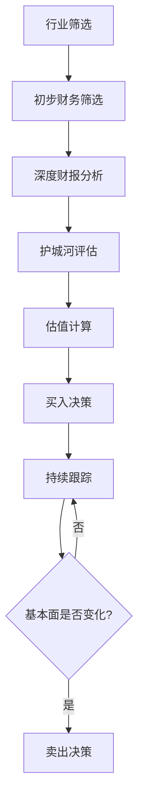

# 第06章 股票投资实战——本章小结

> "投资中最重要的不是你做对了多少事，而是你避免了多少大错。" ——查理·芒格

本章用六大部分——理论基础、核心技巧、实战案例、常见误区、练习方法、深度拓展——构建了一套完整的股票投资知识体系。本小结不是简单的"要点罗列"，而是将全章内容提炼为一张可执行的投资地图，帮你把分散的知识点串联成系统化的决策框架。

---

## 一、认知地基：理解股票的本质

### 1.1 股票到底是什么？

股票不是屏幕上的六位代码，不是K线图上的红绿柱子，不是赌博筹码——它是企业所有权的一份凭证。买一股茅台，你就是茅台的股东，哪怕只持有0.0000001%。这个认知是一切正确投资决策的起点。

**为什么这个认知如此关键？** 因为当你把股票视为"企业所有权"时，你的决策逻辑会从根本上改变：

| 思维模式 | 赌徒思维 | 投资者思维 |
|----------|----------|------------|
| 关注什么 | 股价涨跌 | 企业价值 |
| 决策依据 | 消息、感觉、K线 | 财务数据、商业模式 |
| 持有心态 | 随时准备跑路 | 与好公司共成长 |
| 盈利来源 | 低买高卖的价差 | 企业创造的真实利润 |
| 风险认知 | "这次不一样" | "市场永远会犯错" |

### 1.2 股票赚钱的三种方式

理解股票的盈利来源，才能理解为什么有些策略长期有效，有些策略只是赌博：

**方式一：企业成长带来的价值增长（最可持续）**

公司每年赚取利润，留存一部分用于再投资，推动业务扩张。利润增长带动内在价值提升，股价长期必然反映这一增长。贵州茅台2001年上市时净利润约3.4亿元，2023年净利润约747亿元，22年增长约220倍。这就是企业成长的力量——你不需要卖出股票，光是持有就能获得巨大回报。

**方式二：股息分红（稳定现金流）**

公司将一部分利润以现金形式分配给股东。高股息策略的核心不是追求股价上涨，而是像"收租"一样获取稳定现金流。一家股息率5%、每年稳定分红的公司，即使股价不涨，14年后你也能通过分红收回全部本金（72法则：72÷5≈14年）。

**方式三：估值变化（短期波动，长期回归）**

市场情绪会推动股价围绕内在价值上下波动。估值扩张（PE从15涨到30）能在短期内带来超额收益，但估值收缩（PE从30跌回15）同样能造成巨大亏损。长期来看，估值终将回归均值——这就是为什么"买入价格"如此重要。

### 1.3 A股市场的特殊性

在中国做投资，不能照搬华尔街教科书。A股有其独特的游戏规则：

- **涨跌停板制度**：主板±10%、创业板/科创板±20%，ST股±5%。这个制度限制了单日波动，但也人为制造了"涨停板效应"——资金会追逐涨停股票，形成短期的趋势惯性。
- **T+1交易**：当天买入的股票次日才能卖出。这意味着你无法在买入后立即止损，增加了短线操作的风险。
- **散户主导的投资者结构**：A股散户交易占比超过70%，远高于美股的20%。散户主导意味着市场更容易出现情绪化波动——恐慌时更恐慌，贪婪时更贪婪，这为理性投资者创造了机会。
- **政策市特征**：政府政策对A股的影响远大于成熟市场。2015年的"国家队"救市、2023年的"活跃资本市场"政策，都是政策直接影响市场的典型案例。
- **IPO发行制度与退市机制**：注册制改革后IPO节奏加快，但退市机制仍然不够完善，"壳价值"虽然在下降但仍未完全消失。

---

## 二、分析体系：如何判断一家公司值不值得买

### 2.1 基本面分析——选股的核心

选股的本质是选公司。基本面分析帮你回答一个根本问题：**这家公司值不值得买？**

#### 财务报表分析

三大财务报表是了解公司最真实、最客观的信息来源：

| 报表 | 核心问题 | 关键指标 |
|------|----------|----------|
| 利润表 | 公司赚钱能力强不强？ | 营收增长率、毛利率、净利率 |
| 资产负债表 | 公司家底厚不厚？财务风险大不大？ | 资产负债率、流动比率、商誉占比 |
| 现金流量表 | 赚到的是真金白银还是纸面利润？ | 经营现金流、自由现金流 |

**关键原则：** 经营现金流必须大于净利润。如果一家公司净利润很高但经营现金流为负，那它很可能在"做账"——利润是算出来的，不是赚出来的。

#### 核心估值指标

| 指标 | 公式 | 判断标准 | 适用场景 |
|------|------|----------|----------|
| ROE（净资产收益率） | 净利润÷净资产 | 连续5年>15%优秀 | 判断公司盈利能力的综合指标 |
| PE（市盈率） | 股价÷每股收益 | <行业中位数 | 盈利稳定的成熟公司 |
| PB（市净率） | 股价÷每股净资产 | <3（重资产行业） | 银行、地产等重资产行业 |
| PEG（市盈增长比） | PE÷净利润增长率 | <1说明估值合理 | 成长型公司 |
| 毛利率 | (营收-成本)÷营收 | >30%说明有定价权 | 判断产品竞争力 |
| 资产负债率 | 总负债÷总资产 | <60%为安全线 | 判断财务风险 |

**记住巴菲特的标准：** ROE连续5年超过15%的公司值得关注。ROE衡量的是公司用股东的钱赚钱的效率——长期高ROE意味着公司有持续的竞争优势。

#### 护城河分析

护城河是公司抵御竞争的持久优势。巴菲特将护城河分为五种类型：

1. **品牌护城河**：消费者愿意为品牌支付溢价（茅台、苹果）
2. **转换成本护城河**：用户更换产品的成本很高（微软Office、用友ERP）
3. **网络效应护城河**：用户越多，产品价值越大（微信、淘宝）
4. **成本优势护城河**：规模效应或独特资源带来的成本领先（海螺水泥、牧原股份）
5. **特许经营权护城河**：政府授予的独家经营权（机场、水电站）

### 2.2 技术分析——择时的辅助

技术分析帮助判断买卖时机，但不能作为主要决策依据。

**实用工具：**
- **均线系统**：5日/10日/20日/60日/120日/250日均线，反映不同周期的趋势方向
- **MACD**：通过快慢均线的差值判断趋势强弱和转折信号
- **成交量**：量价配合是判断趋势可靠性的关键——上涨放量、下跌缩量是健康趋势
- **K线形态**：锤子线、吞没形态、十字星等，反映市场短期情绪

**核心原则：基本面选股，技术面择时。** 先通过基本面找到好公司，再用技术分析寻找合适的买入点。技术分析有四大局限性需要牢记：滞后性、自我实现与自我毁灭、无法预测黑天鹅、诱导频繁交易。

---

## 三、交易系统：什么时候买、什么时候卖、买多少

### 3.1 买入时机判断

**好公司也要好价格。** 再优秀的公司，买贵了也会亏钱。

#### 估值买入法

| 方法 | 具体操作 | 适用场景 |
|------|----------|----------|
| 历史PE法 | 查看公司过去5-10年PE区间，在30%分位以下买入 | 盈利稳定的成熟公司 |
| PEG法 | PEG<1时买入 | 成长型公司 |
| 股息率法 | 股息率>3%时考虑买入 | 高分红蓝筹股 |
| PB法 | PB<历史中位数时买入 | 银行、保险等重资产行业 |

**"击球区"概念：** 不追求买在最低点（那是神才能做到的事），而是在合理偏低的估值区间分批建仓。巴菲特用棒球比喻——投资不需要每次都挥棒，等待那个好球进入你的击球区再出手。

#### 分批建仓策略

- 第一批（试探仓）：估值进入合理区间时，买入计划仓位的30%
- 第二批（确认仓）：估值继续下探，基本面没有变化，再买入30%
- 第三批（重仓）：估值跌到历史低位，买入剩余40%

### 3.2 卖出时机判断

**会买的是徒弟，会卖的是师傅。** 卖出决策比买入更难，因为涉及更多的心理博弈。

#### 三种止盈方法

| 方法 | 操作 | 优缺点 |
|------|------|--------|
| 目标止盈 | 设定目标收益率（如30%、50%），达到即卖出 | 简单明确，但可能错过大行情 |
| 估值止盈 | PE超过历史70%分位时卖出 | 有逻辑依据，但需要持续跟踪 |
| 移动止盈 | 从最高点回撤10-15%时卖出 | 能吃到大部分涨幅，但回撤幅度需要合理设置 |

#### 三种止损方法

| 方法 | 操作 | 适用场景 |
|------|------|----------|
| 绝对止损 | 亏损达到预设比例（如10%、15%）无条件卖出 | 所有交易的底线保护 |
| 基本面止损 | 公司基本面恶化（财报变脸、管理层出问题、行业逻辑被打破）果断卖出 | 核心持仓的保护 |
| 调仓止损 | 发现更好的投资机会时，卖出相对差的持仓换入更好的 | 资金效率优化 |

**核心理念：** 卖出的理由应该是"公司变了"或"估值贵了"，而不是"亏了"或"赚了"。买入前就应该确定卖出条件，而不是被市场情绪左右。

### 3.3 仓位管理——控制风险的核心

仓位管理是投资中最重要的技能之一，但也是最容易被忽视的。很多散户亏损不是因为选错了股票，而是因为仓位管理出了问题。

#### 铁律清单

1. **永远不要满仓**：保留10-20%的现金仓位，既是应对突发机会的弹药，也是心理安全垫
2. **单只股票不超过总仓位的20%**：即使你再看好一只股票，也不要赌上全部身家
3. **分批建仓**：不要一次性投入，至少分3次建仓
4. **根据市场估值调整总仓位**：市场整体估值偏低时仓位可以高一些（70-80%），估值偏高时降低仓位（40-50%）

#### 金字塔加仓法

股价越低，买入越多。假设计划总投入10万元：
- 价格10元时：买入2万元（2000股）
- 价格8元时：买入3万元（3750股）
- 价格6元时：买入5万元（8333股）

加权平均成本 = 100000÷(2000+3750+8333) ≈ 7.12元，远低于简单平均的8元。

---

## 四、风险管理：避免大错比追求大赚更重要

### 4.1 散户最常犯的十个错误

这十个错误覆盖了A股散户90%以上的亏损来源：

| 序号 | 错误 | 底层心理 | 纠正方法 |
|:----:|------|----------|----------|
| 1 | 追涨杀跌 | 趋势外推偏见 | 用估值体系替代情绪判断 |
| 2 | 频繁交易 | 过度自信+行动偏好 | 设定最低持有周期 |
| 3 | 满仓单只股票 | 赌博心态 | 严格执行20%上限 |
| 4 | 听消息炒股 | 懒惰+从众 | 建立独立研究能力 |
| 5 | 不设止损 | 损失厌恶+侥幸心理 | 买入前就确定止损位 |
| 6 | 过度自信 | 把运气当能力 | 记录每笔交易，定期复盘 |
| 7 | 忽视交易成本 | 对摩擦成本不敏感 | 计算年化换手率和佣金占比 |
| 8 | 锚定买入成本 | 锚定效应 | 用当前估值替代买入成本做决策 |
| 9 | 牛市中觉得自己是天才 | 近因偏差 | 牛市中更要保持谦逊和纪律 |
| 10 | 不做功课就买入 | 懒惰+侥幸 | 建立选股检查清单 |

**自查清单：** 每个月检查一次自己是否正在犯以上错误。如果连续两个月都在犯同一个错误，说明你需要调整交易系统，而不是调整心态。

### 4.2 行为金融学：理解你为什么会犯错

诺贝尔经济学奖得主丹尼尔·卡尼曼在《思考，快与慢》中将人的思维分为两个系统：

- **系统1**（快速、直觉、情绪化）：自动运行，不需要消耗精力，但容易出错
- **系统2**（慢速、理性、需要消耗精力）：需要主动调用，准确但费力

投资决策几乎全部应该由系统2做出，但散户在90%的情况下都在用系统1。这意味着"知道"错误并不够——你的本能会在关键时刻压过理性。所以纠正方法不仅是"认知升级"，更要建立**外部约束机制**（交易规则、检查清单、冷静期制度），用制度对抗本能。

### 4.3 投资者的心理训练

| 认知偏差 | 表现 | 对抗方法 |
|----------|------|----------|
| 损失厌恶 | 亏损的痛苦是盈利快乐的2.5倍，导致死拿亏损股 | 设定自动止损，不要盯盘 |
| 锚定效应 | 被买入成本锚定，忽视当前价值 | 每天问自己"如果现在空仓，我会买入吗？" |
| 从众心理 | 别人买我也买，别人卖我也卖 | 建立独立研究体系，远离股吧 |
| 过度自信 | 连续盈利后觉得自己是股神 | 记录交易结果，用数据说话 |
| 近因偏差 | 过度关注最近发生的事 | 定期回顾长期投资目标 |
| 确认偏误 | 只寻找支持自己观点的信息 | 主动寻找反对意见 |

---

## 五、实战案例：从真实故事中学习

### 5.1 六大实战案例的核心教训

| 案例 | 策略类型 | 核心逻辑 | 关键教训 |
|------|----------|----------|----------|
| 价值投资：茅台 | 长期持有好公司 | 好公司+合理价格+长期持有 | 时间是好公司的朋友，复利的力量远超想象 |
| 成长股：宁德时代 | 产业趋势投资 | 识别行业爆发期+抓住龙头 | 产业趋势比个股选择更重要 |
| 指数基金定投 | 被动投资 | 定时定额+纪律执行 | 最适合普通人的策略，战胜80%的主动投资者 |
| 可转债 | 低风险套利 | 债底保护+股性弹性 | 理解金融工具的双重属性 |
| 打新股 | 制度套利 | A股特有的制度红利 | 理解规则，利用规则 |
| 分红收租 | 现金流投资 | 高股息+长期持有 | 构建被动收入，实现财务自由 |

### 5.2 案例背后的普适规律

从这些案例中可以提炼出三条普适规律：

1. **所有成功的投资都建立在"好公司+好价格"的基础上。** 茅台是好公司，但如果在2021年2600元的高点买入，至今仍然亏损。好公司买贵了，照样亏钱。

2. **纪律比聪明更重要。** 指数定投的策略简单到"无聊"，但长期收益率超过了80%的主动基金。原因很简单：它消除了人为判断的干扰，用纪律战胜了情绪。

3. **风险控制是投资的第一要务。** 避免踩雷的案例告诉我们，一次重大亏损可能需要数年才能恢复——亏损50%需要上涨100%才能回本。活下来，才有机会赚钱。

---

## 六、工具与效率：提高投资研究的质量

### 6.1 必备工具清单

| 工具类型 | 推荐工具 | 核心用途 |
|----------|----------|----------|
| 行情软件 | 同花顺、东方财富 | 实时行情、技术分析、板块热度 |
| 数据查询 | 巨潮资讯、Wind | 年报下载、财务数据查询 |
| 选股筛选 | 同花顺问财、雪球选股器 | 按财务指标筛选股票 |
| 研报平台 | 慧博投研、萝卜投研 | 券商研报、行业分析 |
| 量化工具 | 聚宽、米筐 | 策略回测、因子分析 |

### 6.2 建立你的投资研究流程

一个标准的股票研究流程应包括以下步骤：

---

## 七、投资能力训练：从模拟到实盘的渐进路径

### 7.1 四阶段训练方案

| 阶段 | 时间 | 核心任务 | 成功标准 |
|------|------|----------|----------|
| 基础知识巩固 | 第1-2周 | 精读3家公司的年报，计算核心财务指标 | 能独立看懂财报，说出一家公司好在哪里 |
| 模拟投资 | 第3-6周 | 用虚拟资金实践选股、买入、卖出全流程 | 连续3个月跑赢沪深300指数 |
| 小资金实盘 | 第7-12周 | 用1-3万元实盘练习，建立交易日志 | 严格执行交易计划，不因情绪改变决策 |
| 持续复盘优化 | 长期 | 每月复盘，每季度调整策略 | 年化收益率稳定跑赢指数 |

### 7.2 交易日志模板

每笔交易都必须记录以下信息：

| 字段 | 内容 |
|------|------|
| 日期 | 买入/卖出的具体日期 |
| 股票代码 | 公司名称和代码 |
| 买入/卖出 | 操作方向 |
| 价格 | 具体价格 |
| 仓位 | 占总资金的比例 |
| 买入理由 | 为什么买？基于什么逻辑？ |
| 卖出理由 | 为什么卖？触发了什么条件？ |
| 决策评分 | 事后评估：这是好决策吗？ |
| 改进点 | 下次可以做得更好的地方 |

### 7.3 复盘的核心问题

每月复盘时，回答以下五个问题：

1. **这个月的交易是否严格按照计划执行？** 如果不是，是什么原因导致偏离？
2. **有没有犯"常见误区"中的错误？** 如果有，下次如何避免？
3. **持仓公司的基本面有没有变化？** 如果有，需要调整仓位吗？
4. **市场整体估值处于什么水平？** 需要调整总仓位吗？
5. **下个月的投资计划是什么？** 提前规划，避免临时决策。

---

## 八、关键公式速查表

| 指标 | 公式 | 好的标准 | 备注 |
|------|------|----------|------|
| ROE | 净利润÷净资产 | >15% | 连续5年达标更佳 |
| PE | 股价÷每股收益 | <行业中位数 | 注意周期股PE陷阱 |
| PB | 股价÷每股净资产 | <3（重资产行业） | 适用于银行、地产等 |
| PEG | PE÷净利润增长率 | <1 | 成长股估值利器 |
| 毛利率 | (营收-成本)÷营收 | >30% | 反映产品定价权 |
| 资产负债率 | 总负债÷总资产 | <60% | 金融行业除外 |
| 经营现金流 | 现金流量表直接获取 | >净利润 | 验证利润质量 |
| 自由现金流 | 经营现金流-资本支出 | 持续为正 | 公司真正赚到的钱 |
| 股息率 | 每股分红÷股价 | >3% | 高股息策略的筛选线 |
| 杜邦分解 | 净利率×周转率×权益乘数 | 分析驱动因素 | 识别ROE的来源 |

---

## 九、不同市场环境下的操作策略

### 9.1 三种市场环境的识别与应对

| 市场环境 | 识别信号 | 仓位建议 | 策略重点 |
|----------|----------|----------|----------|
| 牛市 | 沪深300突破前高，成交量持续放大，新开户数激增 | 60-80%，但逐步减仓 | 享受泡沫但不贪心，分批止盈 |
| 熊市 | 沪深300跌破年线，成交量萎缩，市场情绪极度悲观 | 20-40%，保留现金 | 定投优质标的，为下一轮牛市布局 |
| 震荡市 | 指数在区间内反复，无明显方向 | 40-60%，灵活调整 | 高抛低吸，关注个股机会 |

**核心原则：** 牛市不贪心，熊市不恐惧，震荡市有耐心。大多数人恰恰相反——牛市追高，熊市割肉，震荡市频繁交易。

---

## 十、一句话总结

> **股票投资的本质是以合理价格买入优质公司的所有权，然后耐心持有，分享企业成长的果实。**

这句话包含了投资的全部秘密：
- **"合理价格"** ——再好的公司买贵了也亏钱
- **"优质公司"** ——有护城河、高ROE、强现金流
- **"耐心持有"** ——时间是好公司的朋友，复利需要时间发酵
- **"分享成长"** ——你的收益来自企业创造的真实价值，不是零和博弈

---

## 十一、下一步行动清单

完成本章学习后，立即执行以下行动：

**本周完成：**
- [ ] 选择3家你熟悉的公司，下载并阅读它们的最新年报
- [ ] 计算这3家公司的PE、PB、ROE、毛利率、资产负债率
- [ ] 判断这3家公司各自属于"价值型"还是"成长型"
- [ ] 评估它们各自的护城河类型

**两周内完成：**
- [ ] 开通模拟账户（同花顺/东方财富均支持模拟交易）
- [ ] 根据本章的选股方法，选出5只候选股票
- [ ] 在模拟账户中建仓，记录每笔交易的决策逻辑
- [ ] 建立交易日志，使用本章提供的模板

**长期坚持：**
- [ ] 每天花15分钟阅读财经新闻（只关注宏观政策和持仓公司）
- [ ] 每周复盘一次交易记录
- [ ] 每月评估一次持仓组合，检查是否需要调整
- [ ] 每季度阅读一次持仓公司的财报

**最后一条建议：** 投资是一辈子的事，不必急于求成。先学会不亏钱，再想着赚钱。从模拟盘开始，从你最熟悉的行业开始，从你能承受亏损的小金额开始。慢慢来，比较快。
