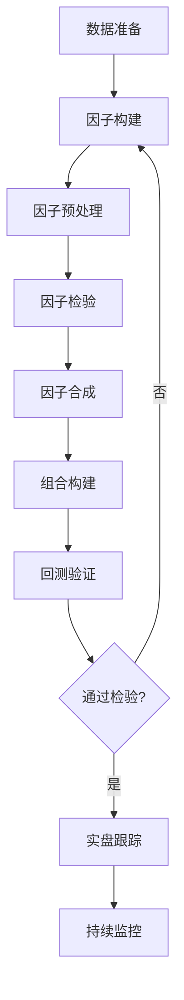
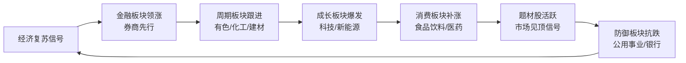

# 第六章 深度拓展：股票投资的高级理论与实践

前六节从选股、买卖时机、仓位管理到实战案例，构建了完整的投资操作框架。本章在此基础上向纵深拓展——从技术指标的数学本质到估值模型的推导逻辑，从量化策略的构建方法到风险管理的现代理论，从A股市场的结构性特征到全球视野下的资产配置。这些内容不是"额外加分项"，而是将零散知识点串联成体系、让你真正理解"为什么"的关键拼图。

---

## 一、技术分析的数学基础

很多投资者把技术指标当作"玄学"来用——金叉买入、死叉卖出，却不知道背后的数学逻辑。理解这些逻辑有两个直接好处：第一，你知道指标的适用边界在哪里；第二，你能根据市场特征调整参数，而不是盲目套用默认设置。

### 1.1 移动平均线族：从SMA到自适应均线

**简单移动平均线（SMA）** 的本质是等权重线性滤波：

**SMA(n) = (P₁ + P₂ + ... + Pₙ) / n**

它把最近n天的价格等权平均，天然存在滞后性——n越大，滞后越严重。用一个直观的例子说明：假设股价从10元连续上涨到20元，20日SMA在第20天的值大约只有15元，远远落后于实际价格。

**指数移动平均线（EMA）** 赋予近期价格指数递增的权重：

**EMA(today) = Price(today) × k + EMA(yesterday) × (1-k)**

其中 k = 2/(n+1)。以12日EMA为例，k ≈ 0.154，当天价格权重15.4%，昨天的EMA值权重84.6%。这意味着EMA对趋势变化的响应速度比SMA快1-2天——在趋势行情中，这1-2天的领先价值巨大。

**加权移动平均线（WMA）** 采用线性递减权重：

**WMA = (n×P₁ + (n-1)×P₂ + ... + 1×Pₙ) / (n+(n-1)+...+1)**

WMA的权重衰减比EMA更激进，对最近几天的价格变化非常敏感，适合短线交易者捕捉快速趋势。

**三者的适用场景对比：**

| 指标 | 权重分配 | 滞后性 | 噪声敏感度 | 适用场景 |
|------|----------|--------|------------|----------|
| SMA | 等权重 | 高 | 低 | 中长线趋势判断，支撑/阻力位 |
| EMA | 指数递减 | 中 | 中 | 趋势跟踪，MACD的基础 |
| WMA | 线性递减 | 低 | 高 | 短线交易，快速趋势捕捉 |

**进阶：考夫曼自适应移动平均（KAMA）**。传统均线的问题是：震荡市中频繁假信号，趋势市中又太慢。KAMA通过效率比率（Efficiency Ratio）自动调整平滑系数——价格波动方向一致时（趋势强），KAMA紧跟价格；来回震荡时（噪声大），KAMA放慢响应。其核心公式：

- 方向变动 = |Close(today) - Close(n days ago)|
- 波动幅度 = Σ|Close(i) - Close(i-1)|，i从今天到n天前
- 效率比率 ER = 方向变动 / 波动幅度
- 平滑系数 SC = [ER × (fast SC - slow SC) + slow SC]²

其中 fast SC = 2/(2+1) ≈ 0.667，slow SC = 2/(30+1) ≈ 0.065。ER接近1时SC接近fast，KAMA快速跟随；ER接近0时SC接近slow，KAMA趋于平坦。

### 1.2 布林带：统计学在价格分析中的应用

布林带由约翰·布林格（John Bollinger）发明，其数学基础是正态分布理论。三条线的定义：

- **中轨**：N日简单移动平均线（通常N=20）
- **上轨**：中轨 + K × N日标准差（通常K=2）
- **下轨**：中轨 - K × N日标准差

标准差的计算公式：

**σ = √[Σ(Pᵢ - μ)² / N]**

在正态分布假设下，约68%的数据落在±1σ范围内，约95%落在±2σ范围内。当价格突破布林带边界时，从统计学角度看是小概率事件（5%概率），表明出现了异常波动。

**但这里有一个关键陷阱：股票收益率不服从正态分布。** 真实市场的收益率分布存在"肥尾"特征——极端波动发生的频率远高于正态分布的预测。2015年A股的千股跌停、2020年3月美股四次熔断，都是"正态分布假设失灵"的案例。因此，布林带突破并不意味着"价格一定会回归"，在极端行情中价格可以沿着布林带上轨或下轨持续运行数周。

**布林带的三种经典形态：**

1. **缩口（Squeeze）**：布林带宽度收窄到历史低位，意味着波动率极低，通常预示即将出现大幅突破方向。这是布林带最有价值的信号之一。
2. **走平（Walking the Band）**：价格持续贴近上轨或下轨运行，表明趋势强劲，此时逆势操作极其危险。
3. **假突破**：价格突破布林带后迅速收回，配合成交量萎缩，往往是反向信号。

**布林带宽度指标（Bandwidth）**：

**Bandwidth = (上轨 - 下轨) / 中轨 × 100%**

该指标可以量化波动率的收缩程度，配合历史分位数使用效果更佳。当Bandwidth低于近一年的10%分位时，突破信号的可靠性显著提高。

### 1.3 MACD：从信号处理到交易信号

MACD（Moving Average Convergence Divergence）本质上是一个带通滤波器，通过两个不同周期EMA的差值提取价格趋势中的中频信号：

1. **DIF线（快线）** = EMA(12) - EMA(26)，捕捉短期与中期趋势的差异
2. **DEA线（信号线）** = EMA(DIF, 9)，对DIF进行平滑去噪
3. **MACD柱** = 2 × (DIF - DEA)，直观显示多空力量的消长

从信号处理角度看，EMA(12)和EMA(26)分别过滤掉了高频噪声和低频趋势，二者的差值DIF保留了"趋势变化"这个中频信息。DEA线则进一步平滑DIF，过滤残余噪声。

**MACD的四大经典信号及失效场景：**

| 信号 | 定义 | 有效场景 | 失效场景 |
|------|------|----------|----------|
| 金叉 | DIF上穿DEA | 趋势启动初期 | 震荡市中频繁假金叉 |
| 死叉 | DIF下穿DEA | 趋势反转初期 | 强势行情中快速修复 |
| 顶背离 | 价格新高，DIF未新高 | 上涨趋势末端 | 强趋势中可连续背离多次 |
| 底背离 | 价格新低，DIF未新低 | 下跌趋势末端 | 弱势行情中可连续背离多次 |

**关键认知：背离不等于反转信号。** 在强趋势中，MACD可以出现3次甚至4次连续背离而价格继续创新高/新低。背离只是说明"趋势的动能在减弱"，但减弱不等于结束。实战中应结合成交量、市场情绪和宏观环境综合判断。

**零轴的特殊意义**：DIF和DEA同时在零轴上方，表明中期趋势向上；同时在零轴下方，表明中期趋势向下。零轴附近的金叉/死叉比远离零轴的更有参考价值。

### 1.4 RSI：买卖力量的量化

相对强弱指标（RSI）将买卖力量比值归一化到0-100区间：

**RSI = 100 - 100/(1 + RS)**

**RS = N日内上涨幅度平均值 / N日内下跌幅度平均值**

默认参数N=14，超买阈值70，超卖阈值30。RSI的数学本质是将上涨动量与下跌动量的比值通过S型函数映射到固定区间。

**RSI的进阶用法：**

1. **RSI区间的意义因趋势而异**：牛市中RSI回落到40就可能是买入机会（而非30），熊市中RSI反弹到60就可能是卖出信号（而非70）。教科书上的70/30阈值只适用于震荡市。

2. **RSI背离的可靠性高于MACD背离**：因为RSI直接衡量动量，而非趋势差异。当价格创新高但RSI未能创新高时，上涨动能确实在衰减。

3. **RSI的中轴50**：RSI在50以上运行表明多头占优，50以下空头占优。RSI从下方突破50往往是趋势转多的早期信号。

### 1.5 KDJ指标：价格位置的概率解读

随机指标（KDJ）的核心假设是：上升趋势中收盘价倾向于接近当日最高价，下降趋势中则倾向于接近当日最低价。

**K = 100 × (C - Lₙ) / (Hₙ - Lₙ)**

**D = K的M日移动平均（通常M=3）**

**J = 3K - 2D**

其中C为当日收盘价，Lₙ为N日最低价，Hₙ为N日最高价（通常N=9）。K值衡量的是收盘价在近期价格区间中的相对位置，类似于百分位数——K=80意味着当前收盘价位于近9日价格区间的80%分位。

**J值的特殊作用**：J值的波动范围可以超出0-100，J>100表明极度超买，J<0表明极度超卖。在极端行情中，J值可以连续多日停留在超买/超卖区，这并不代表立刻反转，而是趋势强度的体现。

**KDJ与RSI的核心区别**：RSI衡量的是"涨跌幅度比"，KDJ衡量的是"价格在区间中的位置"。两者可以互补——RSI告诉你"涨了多少"，KDJ告诉你"在什么位置"。

### 1.6 技术指标的组合使用原则

单个技术指标的胜率通常在40-55%之间，略高于随机猜测。但通过合理组合，可以将胜率提升到60%以上。组合的原则是：**选择衡量不同维度的指标，避免重复信号。**

一个经典的三维度组合方案：

| 维度 | 指标 | 作用 |
|------|------|------|
| 趋势 | MACD或均线系统 | 判断大方向 |
| 动量 | RSI或KDJ | 判断超买超卖 |
| 波动率 | 布林带或ATR | 判断突破有效性 |

当三个维度同时发出同向信号时，交易的胜率和盈亏比都会显著提升。例如：MACD金叉（趋势转多）+ RSI从30以下回升（超卖修复）+ 价格突破布林带中轨（波动率扩张），三者共振的信号远强于单一金叉。

---

## 二、基本面分析的进阶方法

### 2.1 杜邦分析法：拆解ROE的三驾马车

净资产收益率（ROE）是巴菲特最看重的财务指标，但光看ROE的数字是不够的——两家ROE都是15%的公司，可能有着完全不同的经营逻辑。杜邦分析法将ROE拆解为三个驱动因素：

**ROE = 净利润率 × 资产周转率 × 权益乘数**

= (净利润/营业收入) × (营业收入/总资产) × (总资产/股东权益)

三种典型的盈利模式：

| 模式 | 代表行业 | 核心驱动 | ROE特征 |
|------|----------|----------|---------|
| 高利润率型 | 奢侈品、白酒、软件 | 净利润率>20% | ROE高且稳定 |
| 高周转型 | 零售、快消品 | 资产周转率>2次 | ROE中等但增长快 |
| 高杠杆型 | 银行、房地产 | 权益乘数>10倍 | ROE高但风险大 |

**实战案例：茅台vs永辉超市**

假设贵州茅台ROE=30%，分解为：净利润率50% × 资产周转率0.4 × 权益乘数1.5。这是一家典型的"高利润率型"公司——靠极高的品牌溢价赚钱。

假设永辉超市ROE=10%，分解为：净利润率2% × 资产周转率2.5 × 权益乘数2.0。这是一家典型的"高周转型"公司——薄利多销，靠快速周转赚钱。

两者虽然ROE差距巨大，但商业模式各有优劣。茅台的问题是增长天花板（高端白酒市场有限），永辉的问题是利润率太薄（一旦周转效率下降就会亏损）。理解了杜邦分解，你才能真正看懂一家公司的经营质量。

**杜邦分析的五步拆解法（扩展版）：**

将净利润率进一步拆解，得到更精细的分析框架：

1. ROE = 净利润 / 股东权益
2. = (净利润/税前利润) × (税前利润/营业利润) × (营业利润/营业收入) × (营业收入/总资产) × (总资产/股东权益)
3. = 税负效应 × 利息负担 × 经营利润率 × 资产周转率 × 权益乘数

这样可以精确定位ROE变化的驱动因素：是税收政策变化？是利息支出增加？还是经营效率下降？

### 2.2 自由现金流：比净利润更真实的盈利指标

净利润是一个容易被操纵的数字——通过折旧政策、减值准备、收入确认时点等手段，管理层可以在一定程度上"调节"利润。但现金流很难造假，因为钱要么进了银行账户，要么没有。

**自由现金流（FCF）** 的三种计算口径：

**FCF（简单版）= 经营活动现金流净额 - 资本支出**

**FCFF（企业自由现金流）= EBIT × (1-税率) + 折旧摊销 - 营运资本增加 - 资本支出**

FCFF衡量的是企业在满足再投资需求后，可以分配给所有资本提供者（股东+债权人）的现金流。

**FCFE（股权自由现金流）= FCFF - 利息费用 × (1-税率) + 净借款**

FCFE衡量的是企业在满足再投资和偿债需求后，可以分配给股东的现金流。

**为什么FCF比净利润更重要？**

一个经典的例子：某公司连续三年净利润分别为1亿、1.2亿、1.5亿，看起来增长良好。但同期经营活动现金流分别为0.5亿、0.3亿、-0.2亿。深入分析发现，公司的应收账款急剧增加——利润增长是靠"赊销"堆出来的，实际上现金在不断流出。这种公司在2018-2019年的A股暴雷潮中比比皆是（康得新、康美药业等）。

**FCF的实战应用——现金收益率：**

**FCF Yield = 自由现金流 / 总市值 × 100%**

FCF Yield > 5%的公司通常具有较好的投资价值，因为它意味着公司用5-6年就能产生等于当前市值的现金。这比PE更能反映真实的回报水平。

### 2.3 盈利质量分析的四把尺子

评估盈利质量不能只看利润数字，需要用多维度交叉验证：

**尺子一：现金收入比**

**现金收入比 = 销售商品收到的现金 / 营业收入**

健康值应持续大于1。如果一家公司的收入增长很快但现金收入比持续低于1，很可能是在通过放宽信用条件（赊销）来冲收入。当应收账款周转天数从30天增加到90天时，即使收入增长了30%，实际上公司的经营质量是在恶化的。

**尺子二：经营现金流/净利润**

这个比值持续大于1说明盈利质量高——每1块钱的利润都对应着超过1块钱的现金流入。如果该比值长期低于0.8，需要深入分析原因：可能是折旧政策过于保守（高折旧压低了利润但不影响现金流），也可能是应收/存货异常增加。

**尺子三：非经常性损益占比**

**非经常性损益占比 = 非经常性损益 / 净利润**

如果该比例超过30%，说明公司利润中有很大一部分来自一次性收入（如卖资产、政府补贴、投资收益），这些收入不可持续。关注扣非净利润（扣除非经常性损益后的净利润）才是评估公司主业盈利能力的正确方式。

**尺子四：会计政策变更**

公司突然变更折旧方法、坏账计提比例、收入确认政策时，需要高度警惕。这些变更可能是合理的（如新会计准则要求），也可能是管理层在操纵利润。关注审计报告中的"关键审计事项"段落，审计师会在那里提示风险。

### 2.4 行业分析框架

**波特五力模型**：评估行业吸引力的经典框架

```text
                    潜在进入者的威胁
                         ↓
供应商议价能力 ← 行业内竞争程度 → 买方议价能力
                         ↑
                    替代品的威胁
```

每个力量的强弱决定了行业的利润空间。例如白酒行业的五力分析：
- 行业内竞争：高端寡头垄断（茅台、五粮液），竞争温和
- 潜在进入者：品牌壁垒极高，新进入者威胁低
- 替代品：啤酒、红酒、洋酒替代性弱
- 供应商：原材料（粮食）供应充足，议价能力弱
- 买方：消费者对高端白酒价格不敏感，议价能力弱

五力全部"友好"，这就是白酒行业长期高利润率的结构性原因。

**行业生命周期的四阶段模型：**

| 阶段 | 特征 | 代表行业（举例） | 投资策略 |
|------|------|------------------|----------|
| 导入期 | 市场小、亏损、高风险 | 量子计算、固态电池 | VC思维，极小仓位 |
| 成长期 | 快速增长、高投入 | 新能源车、AI芯片 | 重仓龙头，容忍高PE |
| 成熟期 | 增速放缓、利润丰厚 | 白酒、家电 | 估值合理时买入，吃分红 |
| 衰退期 | 市场萎缩、产能过剩 | 传统煤炭、报纸 | 回避或博弈困境反转 |

---

## 三、股票估值模型详解

估值是投资的核心能力。买贵了，再好的公司也会让你亏钱；买便宜了，普通的公司也能带来不错的回报。

### 3.1 现金流折现模型（DCF）

DCF的哲学很简单：一只股票的价值等于它未来能给你产生的所有现金流，折算成今天的钱。

**V = Σ [CFₜ / (1+r)ᵗ] + TV / (1+r)ⁿ**

其中CFₜ为第t期的自由现金流，r为折现率（通常用WACC，即加权平均资本成本），TV为终值，n为显性预测期（通常5-10年）。

**终值的计算**——永续增长模型：

**TV = CFₙ₊₁ / (r - g)**

其中g为永续增长率。这个公式假设从第n+1年开始，公司以恒定增长率g永远增长下去。g通常取2-3%（不超过GDP长期增长率），r通常取8-12%（取决于行业风险）。

**DCF的实战演示：**

假设某公司的以下数据：
- 当前自由现金流：10亿元
- 未来5年增长率：15%
- 之后永续增长率：3%
- 折现率（WACC）：10%

| 年份 | 1 | 2 | 3 | 4 | 5 |
|------|--------|--------|--------|--------|--------|
| 自由现金流（亿元） | 11.50 | 13.23 | 15.21 | 17.49 | 20.12 |
| 折现因子 | 0.909 | 0.826 | 0.751 | 0.683 | 0.621 |
| 现值（亿元） | 10.45 | 10.93 | 11.43 | 11.95 | 12.49 |

前5年现值合计：57.25亿元

终值 = 20.12 × (1+3%) / (10% - 3%) = 298.90亿元

终值现值 = 298.90 / (1.10)⁵ = 185.62亿元

**公司总价值 = 57.25 + 185.62 = 242.87亿元**

注意：终值占总价值的76%。这是DCF模型最大的争议点——你对公司价值的判断，绝大部分取决于那个遥远的"永续增长率"假设。把g从3%改成2%，总价值就变成203亿元，差了近40亿。这就是为什么说DCF是一门"精确的伪科学"——公式很精确，但输入假设的微小变化会导致结果的巨大差异。

**DCF的适用条件和局限性：**

| 条件 | 说明 |
|------|------|
| ✅ 适用 | 现金流稳定可预测的公司（公用事业、消费品） |
| ✅ 适用 | 现金流为正且持续增长的成熟公司 |
| ❌ 不适用 | 现金流剧烈波动的周期性公司 |
| ❌ 不适用 | 初创公司或尚未盈利的成长公司 |
| ❌ 不适用 | 多元化集团（各业务线差异太大） |

### 3.2 市盈率估值法（PE）

市盈率是最直观的估值指标——它告诉你"按当前盈利水平，多少年能回本"。

**PE = 股价 / 每股收益 = 总市值 / 净利润**

PE的倒数是盈利收益率（Earnings Yield）：PE=20意味着盈利收益率5%，你可以把它和银行理财、国债收益率做比较。

**影响PE的四大因素：**

1. **增长率**：高增长公司享受更高PE。道理很简单——如果利润每年增长30%，今年20倍PE的股票明年实际只有15倍PE（假设股价不变）。
2. **风险**：低风险公司PE更高。因为投资者愿意为"确定性"支付溢价。
3. **利率环境**：低利率环境下PE普遍较高。当无风险收益率只有2%时，20倍PE（盈利收益率5%）就有吸引力；当无风险收益率达到5%时，20倍PE就不那么有吸引力了。
4. **行业特性**：消费品PE通常20-30倍，银行PE通常5-8倍，科技股PE可以到50倍以上。跨行业比PE没有意义。

**静态PE vs 滚动PE vs 动态PE：**

| 类型 | 计算方式 | 优缺点 |
|------|----------|--------|
| 静态PE | 当前股价 / 上年EPS | 数据确定但可能过时 |
| 滚动PE（TTM） | 当前股价 / 最近12个月EPS | 最常用，反映最新盈利 |
| 动态PE（Forward） | 当前股价 / 预测EPS | 面向未来但有预测误差 |

**PEG指标**——将增长纳入估值：

**PEG = PE / 预期增长率（%）**

PEG由投资大师彼得·林奇推广。PEG<1意味着估值相对于增长速度偏低（可能被低估），PEG>2则可能被高估。例如：一家PE=30、预期增长率35%的公司，PEG=0.86，从增长角度看估值合理。

**PEG的局限性**：它假设增长率可以线性外推，但现实中增长经常减速。一家PE=50、过去增长率50%的公司（PEG=1），如果明年的增长率降到20%，实际PEG就变成了2.5。

### 3.3 市净率估值法（PB）

**PB = 股价 / 每股净资产 = 总市值 / 股东权益**

PB估值的核心逻辑是"底线思维"——公司清算时，净资产是股东能拿回的最低金额。PB<1（破净）意味着股价低于清算价值。

**PB最适用的行业：**

- **银行**：资产以贷款和债券为主，账面价值接近市场价值
- **保险**：投资资产有明确的市场价值
- **房地产**：土地和物业有明确的市场价值
- **钢铁/有色**：重资产行业，生产设备价值可评估

**PB不适用的行业：**

- **互联网/软件**：核心资产是用户、数据、品牌，不在资产负债表上
- **医药**：研发管线的价值无法用账面价值衡量
- **消费品**：品牌价值远超有形资产

**PB与ROE的数学关系：**

根据戈登增长模型可以推导出：

**PB = (ROE - g) / (r - g)**

这个公式揭示了一个关键洞察：**高ROE的公司理应享受更高的PB估值。** 假设r=10%，g=3%：ROE=20%的公司合理PB=2.43倍，ROE=8%的公司合理PB只有0.71倍。这就是为什么茅台PB高达10倍以上而银行PB不到1倍——不是银行被低估了，而是ROE差异决定了估值差异。

### 3.4 其他估值方法

**EV/EBITDA**——消除资本结构差异的估值指标：

EV（企业价值）= 总市值 + 净债务。EBITDA（息税折旧摊销前利润）排除了折旧政策、资本结构和税收差异的影响。EV/EBITDA最适合比较同一行业内不同杠杆水平的公司。例如：一家全靠自有资金的公司和一家高负债的公司，PE差异可能很大，但EV/EBITDA的差异会小得多。

**PS（市销率）**——适用于尚未盈利的公司：

PS = 总市值 / 营业收入。对于尚在亏损但收入高速增长的公司（如早期的Amazon、拼多多），PS是唯一可用的相对估值指标。PS的隐含假设是"当前亏损是暂时的，未来盈利能力会随规模扩大而改善"。

**剩余收益模型（Residual Income Model）**：

**V = BV + Σ [(ROE - r) × BVₜ₋₁ / (1+r)ᵗ]**

将公司价值分解为两部分：账面价值（BV）+ 超额收益的现值。当ROE > r时，公司创造了超额价值；当ROE < r时，公司在毁灭价值。这个模型特别适合评估ROE稳定但增长缓慢的成熟公司。

### 3.5 估值方法的选择与组合

没有一种估值方法是万能的。成熟的投资者会同时使用多种方法，取交集作为"合理估值区间"：

| 方法 | 适用阶段 | 核心优势 | 核心局限 |
|------|----------|----------|----------|
| DCF | 成熟期 | 理论上最正确 | 假设敏感 |
| PE | 盈利稳定期 | 简单直观 | 不适用亏损公司 |
| PB | 重资产行业 | 有底线参考 | 不适用轻资产公司 |
| EV/EBITDA | 跨公司比较 | 排除资本结构差异 | 忽略资本支出差异 |
| PS | 高速成长期 | 亏损公司也能用 | 忽略盈利能力差异 |
| PEG | 高增长期 | 纳入增长因素 | 增长率预测困难 |

**实战建议**：对同一家公司至少用3种方法估值，取中位数作为参考。如果3种方法的结果差异很大，说明公司的商业模式或财务状况存在不确定性，需要更加谨慎。

---

## 四、现代投资组合理论与风险管理

这是很多散户完全忽略的领域——他们花大量时间研究"买什么"和"什么时候买"，却从不考虑"买多少"和"怎么组合"。而在机构投资界，风险管理的重要性不亚于选股。

### 4.1 现代投资组合理论（MPT）

1952年，哈里·马科维茨（Harry Markowitz）提出了现代投资组合理论，奠定了量化投资的理论基石。核心思想是：**通过资产之间的不完全相关性，可以在不降低预期收益的情况下降低组合风险。**

**组合的预期收益率：**

**E(Rp) = Σ wᵢ × E(Rᵢ)**

**组合的方差（风险）：**

**σp² = Σᵢ Σⱼ wᵢwⱼσᵢσⱼρᵢⱼ**

关键在第二项——当相关系数ρᵢⱼ < 1时，组合的方差小于各资产方差的加权平均。ρ越低（甚至为负），风险分散效果越好。

**一个直觉化的例子：**

假设你有100万，全买A股预期收益10%、波动率25%。现在加入预期收益同样10%、波动率20%的债券基金。

| 配置 | 预期收益 | 组合波动率（假设相关系数0.3） |
|------|----------|-------------------------------|
| 100% A股 | 10% | 25.0% |
| 80% A股 + 20% 债券 | 10% | 20.8% |
| 60% A股 + 40% 债券 | 10% | 17.5% |
| 50% A股 + 50% 债券 | 10% | 16.2% |

预期收益不变，但波动率从25%降到了16.2%——这就是"免费的午餐"。

### 4.2 有效前沿与最优组合

在所有可能的资产配置中，存在一条"有效前沿"——在每一个风险水平上提供最高预期收益的组合。有效前沿上的每一个点都是"帕累托最优"的——你不可能在不增加风险的情况下获得更高收益，也不可能在不降低收益的情况下减少风险。

实际操作中，确定最优组合需要以下步骤：
1. 估计各资产的预期收益率、波动率和相关系数
2. 在给定风险约束下最大化预期收益（或在给定收益约束下最小化风险）
3. 根据个人风险偏好选择有效前沿上的具体点

### 4.3 风险度量：从波动率到VaR和CVaR

**波动率（σ）** 是最基础的风险度量，但它有一个问题：把上涨的波动和下跌的波动同等对待。投资者显然只关心下行风险。

**最大回撤（Max Drawdown）**：从历史最高点到最低点的最大跌幅。

**MDD = (峰值 - 谷值) / 峰值 × 100%**

最大回撤是投资者体验到的"最坏情况"。如果你的策略最大回撤是30%，意味着在最糟糕的时间点入场，你会经历30%的账面亏损。评估一个策略时，最大回撤比波动率更有意义。

**在险价值（VaR）**：在给定置信水平下，特定时间内可能发生的最大损失。

例如："95% VaR = 5%"意味着在95%的情况下，单日最大亏损不超过5%。但VaR有一个致命缺陷——它不告诉你那5%的"尾部"会发生什么。2008年金融危机中，很多投资组合的实际亏损远超VaR预测。

**条件在险价值（CVaR / Expected Shortfall）**：在VaR之外的尾部损失的平均值。

**CVaR = E[损失 | 损失 > VaR]**

CVaR弥补了VaR的缺陷——它告诉你"如果最坏的5%真的发生了，平均会亏多少"。在监管实践中（如巴塞尔协议III），CVaR正在逐步取代VaR成为标准风险度量。

### 4.4 凯利公式：数学上最优的仓位管理

凯利公式（Kelly Criterion）源自信息论，被广泛用于赌博和投资中的资金管理：

**f* = (bp - q) / b**

其中：
- f* = 最优仓位比例
- b = 赔率（盈亏比）
- p = 胜率
- q = 1 - p（败率）

**实战计算示例：**

你的交易系统胜率55%，平均盈利15%，平均亏损10%，盈亏比b = 15/10 = 1.5：

f* = (1.5 × 0.55 - 0.45) / 1.5 = (0.825 - 0.45) / 1.5 = 0.25

即最优仓位为25%。但这是理论最优——在实际投资中，通常使用"半凯利"（仓位减半），即12.5%。原因是：凯利公式假设你精确知道胜率和赔率，但现实中这些参数有估计误差，全凯利会导致波动过大。

**凯利公式的直觉理解：**
- 当胜率高且赔率高时 → 重仓
- 当胜率高但赔率低时 → 中等仓位
- 当胜率低但赔率高时 → 小仓位（如深度虚值期权）
- 当胜率低且赔率低时 → 不参与

---

## 五、量化选股策略

### 5.1 多因子选股：从理论到实践

多因子模型的理论基础来自Fama-French三因子模型：

**Rᵢ - Rf = αᵢ + β₁(Rm-Rf) + β₂SMB + β₃HML + εᵢ**

| 因子 | 含义 | 经济学解释 |
|------|------|------------|
| Rm-Rf | 市场风险溢价 | 承担系统性风险的补偿 |
| SMB | 小市值因子（Small Minus Big） | 小盘股的超额收益 |
| HML | 价值因子（High Minus Low） | 价值股相对成长股的超额收益 |

后续扩展的五因子模型加入了盈利能力因子（RMW，高ROE公司跑赢低ROE公司）和投资因子（CMA，保守投资公司跑赢激进投资公司）。

### 5.2 A股市场常用量化因子

**价值因子**——寻找"便宜"的股票：
- 市盈率倒数（EP）：PE越低，EP越高
- 市净率倒数（BP）：PB越低，BP越高
- 股息率：高分红公司的防御属性
- 自由现金流收益率：比PE更真实的"便宜度"

**成长因子**——寻找"变好"的公司：
- 营收增长率（TTM同比）
- 净利润增长率（TTM同比）
- ROE变化趋势（ROE逐季提升的公司值得关注）
- 分析师预期上调比例

**质量因子**——寻找"靠谱"的公司：
- ROE水平（稳定在15%以上）
- 资产负债率（行业内的相对水平）
- 应收账款/营收比（越低越好）
- 经营现金流/净利润比（越高越好）

**动量因子**——"强者恒强"效应：
- 过去3-12个月的价格动量（A股中1-6个月动量效果最好）
- 成交量动量（放量上涨的趋势更可持续）
- 分析师一致预期的变化方向

**低波因子**——"低波动异象"：
- 过去60日/120日收益率的波动率
- 低波动股票的长期收益率往往高于高波动股票（这与直觉相反，被称为"低波动异象"）

### 5.3 因子投资的完整实施流程



**步骤一：因子构建**

计算每只股票在每个因子上的原始得分。例如市盈率因子：取所有股票的PE，按从小到大排序，PE最低的10%得1分，次低的10%得2分，以此类推。

**步骤二：因子预处理**

- **去极值**：将超过均值±3倍标准差的值截断到边界
- **标准化**：将因子值转化为均值为0、标准差为1的Z-score
- **中性化**：消除行业和市值的影响。具体做法是对因子值做行业和市值的截面回归，取残差作为中性化后的因子值。不做中性化的话，你的"价值因子"可能实际上只是在买银行股（因为银行天然低PE）。

**步骤三：因子检验**

计算因子的IC值（信息系数）——因子值与下期收益率的截面相关系数。IC均值大于0.03且IC_IR（IC均值/IC标准差）大于0.5的因子才值得使用。

**步骤四：因子合成**

将多个因子加权合成综合得分。权重确定方法包括：
- 等权法：最简单，但忽视因子有效性的差异
- IC加权：按历史IC值加权，有效因子权重更高
- 最大化IC_IR：优化权重使得组合因子的IC_IR最大

**步骤五：组合构建与再平衡**

按综合得分排序选股，通常每月或每季度调仓一次。调仓频率过高会增加交易成本，过低则信号衰减。

### 5.4 机器学习在量化投资中的应用

机器学习在量化投资中的应用场景正在快速扩展，但也充满了陷阱。

**监督学习——预测收益率：**

| 算法 | 优势 | 劣势 | 适用场景 |
|------|------|------|----------|
| 线性回归 | 可解释性强 | 无法捕捉非线性 | 因子线性合成 |
| 随机森林 | 抗过拟合、能处理非线性 | 特征重要性不直观 | 多因子非线性组合 |
| XGBoost/LightGBM | 精度高、速度快 | 需要仔细调参 | 因子挖掘和收益预测 |
| 神经网络 | 能捕捉复杂模式 | 需要大量数据、黑箱 | 另类数据处理（NLP、图像） |

**非监督学习——发现结构：**
- K-Means聚类：识别股票风格集群（价值/成长/动量）
- PCA主成分分析：提取市场的共同因子，降维去噪
- 异常检测：识别财务造假或经营异常的公司

**机器学习投资的最大陷阱——过拟合。** 金融数据的信噪比极低（噪声远大于信号），模型很容易学到"历史数据中的随机噪声"而非"真正的市场规律"。判断过拟合的关键方法：

1. **样本外测试**：严格划分训练集（2010-2018）和测试集（2019-2024），在测试集上表现差的模型就是过拟合
2. **交叉验证的时间序列特性**：不能用未来数据训练模型（前向偏差），必须使用滚动窗口
3. **特征数量/样本数量比**：特征不应超过样本量的1/10，否则大概率过拟合
4. **经济逻辑**：模型选出的因子/特征必须有经济学解释，纯数据挖掘的模式很可能是伪相关

### 5.5 量化策略的风险管理

量化策略的最大风险不是"策略不赚钱"，而是"策略突然失效"。

**策略失效的常见原因：**

1. **因子拥挤**：太多资金追逐同一个因子，导致因子收益被摊薄甚至反转。2021年初的"核心资产"崩塌就是典型案例——当所有人都在买茅台、宁德时，这些股票的估值被推到了不可持续的水平。
2. **市场结构变化**：注册制改革后小市值因子的表现发生了结构性变化；量化资金增多后动量因子的衰减速度加快。
3. **黑天鹅事件**：2015年股灾期间流动性枯竭，很多量化策略无法执行调仓。

**应对措施：**

- **最大回撤止损线**：策略回撤超过历史最大回撤的1.5倍时暂停
- **波动率目标管理**：当组合波动率超过目标时自动减仓
- **因子暴露控制**：单一因子暴露不超过总暴露的40%
- **换手率约束**：月换手率不超过50%，控制交易成本
- **流动性筛选**：剔除日均成交额低于500万的股票

---

## 六、A股市场特征深度分析

### 6.1 A股的结构性特征

A股市场与成熟市场有着根本性的差异，不理解这些差异就照搬海外投资方法，往往会水土不服。

**散户主导的市场结构**

A股个人投资者交易占比长期在70%以上（持仓占比约30%），远高于美国市场的10-15%。这意味着：

- **情绪驱动明显**：散户更易受短期涨跌和新闻影响，导致市场波动率高于成熟市场
- **投机氛围浓厚**：换手率远高于美股（A股年化换手率约300%，美股约150%）
- **反转效应显著**：由于散户追涨杀跌的行为模式，A股的短期反转效应（买跌卖涨）比美股更明显
- **小盘股溢价**：散户偏好低价股和小盘股，导致小市值公司的估值偏高

**政策驱动的市场特征**

A股历史上多次大的行情转折都与政策密切相关：
- 2014-2015年杠杆牛市：融资融券和场外配资政策的放松
- 2015年下半年股灾：清理配资政策
- 2019-2021年结构牛：注册制改革+机构化趋势
- 2024年9月行情：政策组合拳（降准降息+活跃资本市场）

**对投资者的启示**：在A股做投资，必须关注政策信号。不是要你去"猜政策"，而是要理解政策对资金面、情绪面和基本面的传导机制。

### 6.2 A股的季节性规律

A股存在一些统计上显著的季节性效应，但需要注意的是，随着知道这些规律的人越来越多，效应本身在逐渐减弱：

**春季躁动（1-3月）**

每年年初往往有一波上涨行情，原因包括：
- 年初银行信贷投放集中，资金面宽松
- 两会前政策预期升温
- 机构年初建仓需求
- 统计数据：2005-2024年，上证指数1月上涨概率约55%，2月上涨概率约60%

**"五穷六绝七翻身"**

5-6月偏弱的原因：
- 一季度经济数据落地，预期差修正
- 年中资金面偏紧（银行MPA考核）
- 上市公司年报/一季报发布完毕，信息真空期

**年末效应（11-12月）**

- 机构排名战：排名靠前的机构倾向于"锁定收益"减仓，排名靠后的倾向于"搏一把"加仓
- 估值切换：市场开始用下一年的预期盈利估值，高增长公司获得估值提升

**重要提醒：季节性规律只在没有重大事件干扰时有效。** 如果出现重大政策变化、外部冲击或流动性危机，季节性效应会被完全覆盖。

### 6.3 板块轮动的内在逻辑

A股的板块轮动不是随机的，而是有着清晰的经济逻辑：



**券商板块的"春江水暖鸭先知"效应**：券商是最直接受益于牛市的行业（经纪业务收入与成交量正相关），因此在牛市启动初期通常率先上涨。历史上多次大行情中，券商板块都提前1-2周启动。

**判断轮动阶段的实用指标**：
- 券商/大盘的相对强弱：券商开始走强，可能是牛市信号
- 成交量变化：温和放量是健康的，急剧放量（单日万亿以上）可能意味着短期过热
- 融资余额变化：融资余额快速增加表明杠杆资金入场，短期利好但中长期风险增加

### 6.4 北向资金的信号价值

沪深港通开通以来，北向资金（外资通过港股通买入A股）成为市场的重要风向标。

**北向资金的配置偏好**：
- 重仓消费龙头（茅台、美的、格力等）
- 偏好高ROE、高股息的蓝筹股
- 对估值有一定的逆向操作特征（低买高卖）

**北向资金的信号价值**：
- 单日净买入/净卖出的信号意义有限（可能只是调仓）
- 连续5日以上的大额净买入/净卖出更有参考价值
- 北向资金在市场底部区域往往有"抄底"行为

**不要神化北向资金**：北向资金中有相当比例是"假外资"（内地资金通过港股通道回流A股），其真实配置意图可能与表面数据不同。

### 6.5 注册制改革的深远影响

注册制改革（2023年全面实施）是A股30多年来最重大的制度变革，影响包括：

1. **供给增加**：上市公司数量从2019年的3700多家增加到2024年的5300多家，稀缺性溢价下降
2. **壳价值归零**：注册制下"借壳上市"不再有制度优势，ST股票的壳价值大幅缩水
3. **退市常态化**：2024年退市公司数量创历史新高，"炒差""炒小"的风险急剧增加
4. **分化加剧**：优质公司享受流动性溢价，劣质公司逐渐被边缘化（出现"仙股"）
5. **机构化加速**：注册制对投资者的选股能力要求更高，散户的劣势进一步放大

**对普通投资者的启示**：注册制时代，"买指数"可能比"买个股"更明智。个股投资的风险在注册制下显著增加——你买的公司可能变成下一个退市股。

---

## 七、全球股票市场比较与配置

### 7.1 主要市场的结构差异

| 市场 | 代表指数 | 主导行业 | 散户占比 | 估值中枢（PE） |
|------|----------|----------|----------|----------------|
| 美国 | 标普500 | 科技、医疗 | ~15% | 15-22倍 |
| 中国A股 | 沪深300 | 金融、消费 | ~70% | 12-25倍 |
| 日本 | 日经225 | 汽车、电子 | ~20% | 12-18倍 |
| 欧洲 | STOXX600 | 工业、金融 | ~20% | 12-16倍 |
| 印度 | SENSEX | 金融、IT | ~40% | 18-25倍 |

### 7.2 全球市场的相关性与分散化价值

**相关性数据（近10年日收益率相关系数）**：

| | 美股 | A股 | 日股 | 欧股 |
|------|------|------|------|------|
| 美股 | 1.00 | 0.30 | 0.60 | 0.80 |
| A股 | 0.30 | 1.00 | 0.35 | 0.30 |
| 日股 | 0.60 | 0.35 | 1.00 | 0.55 |
| 欧股 | 0.80 | 0.30 | 0.55 | 1.00 |

A股与全球市场的相关性最低（0.30左右），这意味着配置A股对全球组合有显著的分散化价值。但注意：在危机时期（如2008年、2020年3月），所有市场的相关性都会急剧上升到0.8以上，分散化效果大幅减弱。

### 7.3 汇率风险的实际影响

投资海外市场必须考虑汇率因素。一个真实案例：2022年美元指数上涨15%，如果你年初用人民币兑换了美元投资美股，即使美股指数全年下跌（标普500下跌约20%），换算成人民币后亏损幅度减小到约5%。反之，如果你投资的是日股，日元贬值20%会放大你的亏损。

**汇率风险管理工具**：
- 分散投资多种货币计价的资产
- 使用外汇远期/期权进行对冲（机构投资者常用）
- 通过港股通投资港股（以港币计价，但港币与美元挂钩）
- 投资QDII基金时关注基金的汇率对冲策略

### 7.4 全球配置的实操建议

**核心-卫星策略：**

| 层级 | 配置比例 | 投资标的 | 目的 |
|------|----------|----------|------|
| 核心仓位 | 60-70% | 宽基指数基金（沪深300+标普500） | 获取市场平均收益 |
| 卫星仓位 | 20-30% | 行业/主题ETF、个股 | 获取超额收益 |
| 机动仓位 | 5-10% | 另类资产（黄金、REITs） | 极端风险对冲 |

**全球配置的注意事项：**

1. **时差与交易时间**：美股交易时间是北京时间21:30-次日4:00，不适合需要实时盯盘的策略
2. **税务差异**：美股股息需缴纳10-30%的预扣税（中美税收协定下为10%），A股免征资本利得税
3. **信息不对称**：投资海外市场面临语言、信息渠道、监管环境等多方面的劣势
4. **监管政策**：中国个人投资者每年5万美元的购汇额度限制了直接投资海外的规模

---

## 八、行为金融与投资决策陷阱

技术分析和基本面分析解决的是"分析"问题，但投资中更大的敌人往往是自己的大脑。行为金融学揭示了人类在投资决策中系统性的认知偏差。

### 8.1 影响投资决策的六大认知偏差

**锚定效应（Anchoring）**

你以50元买入了一只股票，跌到30元后你不愿意卖——因为你在心里"锚定"了50元的买入价。但50元是你买入的成本，不是市场的合理价格。理性的决策应该问自己："如果我现在没有持仓，我愿意以30元买入这只股票吗？"如果答案是否定的，就应该卖出。

**处置效应（Disposition Effect）**

投资者倾向于过早卖出盈利的股票（"落袋为安"），而过晚卖出亏损的股票（"等回本"）。这与正确的做法恰好相反——应该"截断亏损，让利润奔跑"。研究显示，散户卖出的盈利股票在之后6个月的平均涨幅，比他们卖出的亏损股票在之后6个月的平均跌幅高出约4个百分点。

**过度自信（Overconfidence）**

投资者普遍高估自己的选股能力和择时能力。调查显示，超过70%的散户认为自己的投资水平高于平均水平——这在统计上显然是不可能的。过度自信导致的直接后果是过度交易（频繁买卖增加成本）和集中持仓（押注少数个股）。

**确认偏差（Confirmation Bias）**

你买入了一只股票后，会不自觉地倾向于关注支持你买入决策的信息（利好新闻、看多报告），而忽视或低估相反的信息（利空新闻、看空报告）。对策是：在做投资决策前，刻意列出反对你观点的3个理由。

**损失厌恶（Loss Aversion）**

心理学研究表明，亏损1万元带来的痛苦感，大约是盈利1万元带来的快乐感的2-2.5倍。这导致投资者在面对亏损时做出非理性的决策——比如死扛亏损股票不卖，或者在市场暴跌时恐慌性抛售。

**从众心理（Herd Behavior）**

"大家都在买，我也应该买"——这种心理在牛市后期尤其危险。当出租车司机都在讨论股票时，往往是市场见顶的信号（这不是玩笑，而是有统计支持的规律）。对策是：建立自己的投资体系并严格执行，不受市场情绪左右。

### 8.2 建立决策纪律

对抗认知偏差的最有效方法不是"意志力"，而是"制度化"——建立一套不依赖情绪的投资纪律：

**投资纪律清单：**

1. **买入前**：写下买入的3个理由和不买入的3个理由，量化目标价和止损价
2. **持有中**：每周检查一次基本面是否变化，不看盘不盯盘
3. **卖出时**：只在达到目标价、触发止损、或基本面恶化时卖出，不因短期波动操作
4. **复盘时**：每月统计胜率、盈亏比、最大回撤，识别系统性偏差

---

## 九、前沿话题：ESG、Smart Beta与AI量化

### 9.1 ESG投资

ESG代表环境（Environmental）、社会（Social）、治理（Governance）三个维度的企业非财务指标。全球ESG资产管理规模已超过35万亿美元，在中国也在快速发展。

**ESG的投资逻辑**：
- 高ESG评分的公司通常经营更稳健、长期风险更低
- ESG风险未被市场充分定价时，存在超额收益机会
- 监管趋势推动ESG信息披露要求越来越严格

**A股ESG投资的现状**：
- ESG评级体系尚不统一（不同评级机构的结果差异大）
- 部分公司ESG报告"漂绿"（实际表现与报告不符）
- 个人投资者可以通过ESG主题ETF参与

### 9.2 Smart Beta策略

Smart Beta是介于传统被动指数投资和主动管理之间的投资方式——通过透明的规则化方法，在传统市值加权指数的基础上引入因子暴露。

**常见的Smart Beta策略**：

| 策略 | 逻辑 | 代表ETF |
|------|------|---------|
| 等权重 | 每只股票相同权重，避免大市值过度集中 | RSP（美股） |
| 红利优选 | 选择高股息率的股票 | 红利ETF（A股） |
| 低波动 | 选择波动率最低的股票 | 低波ETF |
| 基本面加权 | 按收入/利润/分红等基本面指标加权 | 基本面50 |
| 动量 | 选择过去一段时间涨幅最大的股票 | 动量ETF |

### 9.3 AI与大模型在投资中的应用

2023年以来，大语言模型（LLM）在金融领域的应用快速发展：

- **文本分析**：自动解析财报、研报、新闻，提取关键信息和情感倾向
- **代码生成**：自动生成量化策略代码、回测脚本
- **投资研究辅助**：快速整理行业信息、对比公司财务数据
- **风险预警**：监控社交媒体和新闻中的异常信号

**但AI不能替代人做投资决策**——它可以处理信息、发现模式、提高效率，但对宏观经济的判断、对企业竞争优势的理解、对市场情绪的感知，仍然需要人的经验和直觉。

---

## 本章小结

本章从六个维度对股票投资进行了深度拓展：

| 维度 | 核心要点 |
|------|----------|
| 技术分析数学 | 理解指标的数学本质，知道适用边界和失效条件 |
| 基本面进阶 | 杜邦拆解ROE、自由现金流比净利润更真实、四把尺子验证盈利质量 |
| 估值模型 | DCF是理论最优但假设敏感、多方法交叉验证取交集 |
| 风险管理 | MPT分散化、VaR/CVaR度量尾部风险、凯利公式优化仓位 |
| 量化策略 | 多因子选股、机器学习防过拟合、策略失效的风险管理 |
| 市场特征 | A股散户主导+政策驱动、季节性规律、板块轮动逻辑 |
| 全球配置 | A股分散化价值高、汇率风险管理、核心-卫星配置 |
| 行为金融 | 六大认知偏差、建立决策纪律对抗人性弱点 |
| 前沿话题 | ESG、Smart Beta、AI在投资中的应用与边界 |

投资是一门理论与实践缺一不可的学科。理论告诉你"应该怎么做"，实践教会你"实际会遇到什么"。没有放之四海而皆准的投资方法，关键是理解原理、建立体系、严格执行、持续迭代。
