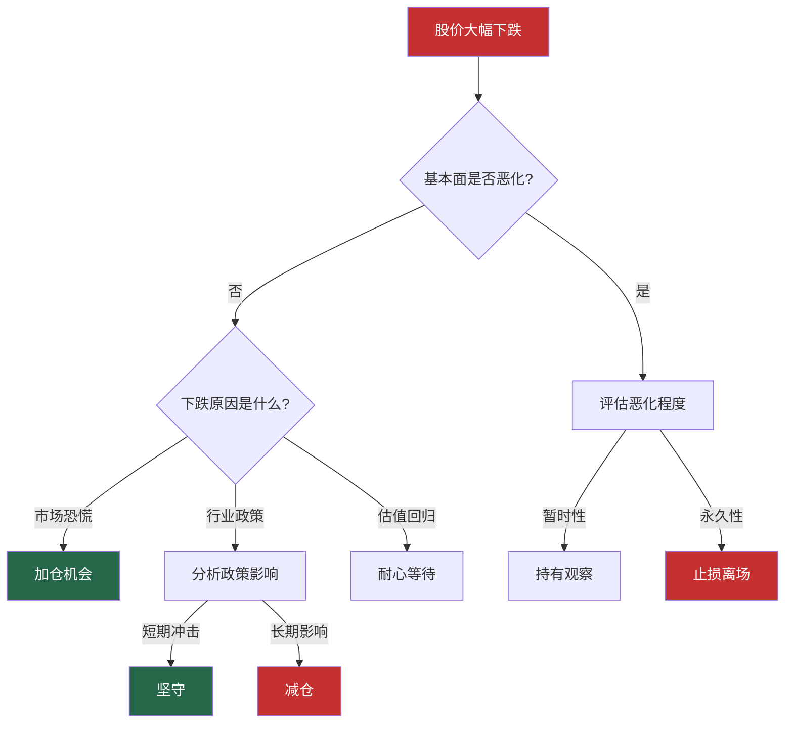

## 案例一：价值投资——长期持有贵州茅台

> "时间是好公司的朋友，是烂公司的敌人。" —— 沃伦·巴菲特

贵州茅台（600519.SH）是A股价值投资最经典的教科书案例。从2001年上市至2024年，茅台股价从31.39元最高涨至2627元，复权后涨幅超过300倍，年化收益率约28%。如果一位投资者在上市之初投入10万元，持有到2021年最高点，资产将超过3000万元。

这个案例的价值不仅在于结果的惊人，更在于过程中的每一次考验——金融危机、政策打压、行业寒冬——都是对价值投资信念的终极检验。

---

### 一、为什么选择茅台作为案例

#### 1.1 案例的典型性

在A股数千只股票中，茅台是价值投资逻辑最清晰、数据最完整、教训最深刻的案例：

| 维度 | 茅台的表现 | 案例价值 |
|------|-----------|---------|
| 护城河 | 品牌+产能+文化三重壁垒 | 展示什么是真正的"宽护城河" |
| 盈利能力 | ROE常年30%+，净利率50%+ | 证明高ROE公司的复利威力 |
| 抗风险能力 | 经历多次危机均创新高 | 验证长期持有的逻辑 |
| 现金流 | 经营现金流远超净利润 | 说明"真金白银"的价值 |
| 股东回报 | 分红+回购累计超千亿 | 证明价值投资的收益来源 |

#### 1.2 案例的学习价值

通过茅台案例，投资者可以学到：

- **如何识别优质公司**：护城河分析的完整框架
- **如何估值买入**：什么价格是"合理"的，什么价格是"便宜"的
- **如何持有穿越周期**：面对下跌50%时如何保持理性
- **何时卖出**：价值投资并非"永远不卖"
- **常见错误**：伪价值投资的陷阱

---

### 二、茅台的基本面深度分析

#### 2.1 商业模式解析

茅台的商业模式可以用一句话概括：**生产一种供不应求的奢侈品，拥有几乎无限的定价权**。


**12987工艺**是茅台的核心生产密码：

| 步骤 | 含义 | 对应周期 |
|------|------|---------|
| 1 | 一个生产周期 | 1年 |
| 2 | 两次投料 | 下沙+糙沙 |
| 9 | 九次蒸煮 | 反复蒸馏取酒 |
| 8 | 八次发酵 | 堆积+入窖发酵 |
| 7 | 七次取酒 | 每轮取不同风味基酒 |

这意味着茅台的产能扩张有天然的时间瓶颈——今年投料，五年后才能上市销售。产能规划必须提前5-10年布局，这也是为什么茅台的供给始终偏紧。

#### 2.2 护城河深度分析

**（一）品牌护城河**

茅台的品牌价值不是靠广告砸出来的，而是70年历史沉淀的结果：

- **国宴用酒**：从开国大典到APEC峰会，茅台是中国最高规格宴会的标配
- **社交货币**：在商务宴请、婚丧嫁娶等场景中，茅台具有"无需解释"的面子价值
- **价格锚定**：飞天茅台1499元的指导价已经成为高端白酒的价格标杆
- **收藏属性**：年份茅台具有投资品属性，老酒价格随年份增长

品牌护城河的量化指标：

```text
品牌溢价率 = (实际售价 - 同品质产品价格) / 同品质产品价格 × 100%

茅台飞天实际售价约2700元，同品质白酒（如五粮液普五）约1000元
品牌溢价率 = (2700 - 1000) / 1000 × 100% = 170%
```

**（二）产能护城河**

茅台镇的地理标志保护是天然的产能壁垒：

- **地理限制**：只有茅台镇核心产区（约15平方公里）才能酿造正宗茅台
- **微生物环境**：茅台酒的酿造依赖当地独特的微生物群落，无法复制
- **产能上限**：即使全力扩产，茅台年产量上限约5-6万吨基酒（对应成品酒约4万吨）
- **供需失衡**：高端白酒市场需求约8-10万吨，茅台永远供不应求

**（三）提价护城河**

茅台的提价能力是消费品公司中最强的：

| 年份 | 出厂价(元/瓶) | 涨幅 | 背景 |
|------|-------------|------|------|
| 2001 | 218 | - | 上市年份 |
| 2006 | 308 | 41% | 消费升级启动 |
| 2008 | 439 | 43% | 金融危机前 |
| 2010 | 499 | 14% | 四万亿刺激后 |
| 2012 | 819 | 64% | 白酒黄金期顶点 |
| 2018 | 969 | 18% | 行业复苏 |
| 2023 | 1169 | 21% | 直营渠道改革 |

20年间出厂价涨了5.4倍，年化涨幅约8.8%，远超通胀率。而且茅台的提价几乎不影响销量——这是定价权的终极体现。

#### 2.3 财务数据深度解读

**核心财务指标（2014-2023年）**：

| 年份 | 营收(亿) | 净利润(亿) | 毛利率 | 净利率 | ROE | 经营现金流(亿) |
|------|---------|-----------|--------|--------|-----|--------------|
| 2014 | 316 | 153 | 92.6% | 48.3% | 31.2% | 175 |
| 2016 | 389 | 167 | 91.2% | 43.0% | 24.4% | 375 |
| 2018 | 736 | 352 | 91.1% | 47.8% | 34.5% | 421 |
| 2020 | 949 | 467 | 91.4% | 49.2% | 31.4% | 517 |
| 2022 | 1241 | 627 | 91.9% | 50.5% | 32.1% | 582 |
| 2023 | 1476 | 747 | 92.0% | 50.6% | 33.2% | 698 |

从这组数据中可以读出三个关键信息：

**第一，盈利能力极其稳定。** 毛利率始终在91%以上，净利率稳定在48%-51%之间。这意味着茅台的盈利不是靠某个偶然因素，而是商业模式本身的必然结果。

**第二，ROE长期维持30%以上。** 这个水平在A股所有上市公司中排名前1%。按照72法则，30%的ROE意味着净资产每2.4年翻一倍——这就是复利的威力。

**第三，经营现金流始终大于净利润。** 净现比（经营现金流/净利润）常年在1.0以上，说明茅台赚到的每一分钱都是真金白银，不是纸面利润。

**杜邦分析拆解**：

```text
ROE 33.2% = 净利率50.6% × 资产周转率0.48 × 权益乘数1.37
```

- **净利率50.6%**：驱动因素，茅台赚钱主要靠高利润率
- **资产周转率0.48**：偏低，但这恰恰说明茅台不需要大量资产就能赚钱
- **权益乘数1.37**：极低杠杆，几乎没有有息负债

结论：茅台的ROE完全由利润率驱动，是最健康、最可持续的模式。相比之下，银行ROE虽然也高（10%-15%），但主要靠高杠杆驱动，风险完全不同。

---

### 三、茅台历史上的重大危机与应对

价值投资最大的考验不是选出好公司，而是在好公司遇到危机时能否坚持持有。茅台历史上经历了至少五次重大危机，每次都考验着投资者的信念。

#### 3.1 2008年全球金融危机

| 指标 | 数据 |
|------|------|
| 高点 | 2007年12月：230元 |
| 低点 | 2008年11月：84元 |
| 跌幅 | -63% |
| 恢复时间 | 2009年7月回到230元 |

**当时发生了什么：** 全球金融海啸，A股从6124点暴跌至1664点。茅台虽然基本面没有变化，但市场恐慌情绪导致所有股票无差别下跌。

**价值投资者的思考：** 茅台的酒还在生产，消费者还在喝酒，商务宴请并没有因为金融危机而消失。公司的内在价值没有变化，变化的只是价格。

**事后复盘：** 2008年84元买入的茅台，到2021年最高点2627元，涨幅30倍。

#### 3.2 2012-2014年反腐风暴

| 指标 | 数据 |
|------|------|
| 高点 | 2012年7月：266元 |
| 低点 | 2014年1月：118元 |
| 跌幅 | -56% |
| 恢复时间 | 2015年4月回到266元 |

**当时发生了什么：** 中央八项规定出台，公务消费大幅缩减。茅台被视为"腐败酒"，终端价格从2000多元暴跌至800多元，经销商大面积亏损。市场普遍认为茅台的"黄金时代"结束了。

**价值投资者的思考：** 需要回答两个核心问题——(1)茅台的需求是否会永久性萎缩？(2)如果公务消费消失，茅台还能卖给谁？

分析逻辑：
- 公务消费占比约30%，即使完全消失，还有70%的商务和个人消费
- 茅台的品牌价值不会因为公务消费减少而消失
- 消费升级的长期趋势没有改变
- 茅台可以主动调整产品结构和渠道策略

**事后复盘：** 茅台成功从"政务消费"转型为"商务消费+个人消费"，2016年后业绩重新高速增长。那些在118元恐慌卖出的投资者，错失了之后10倍的涨幅。

#### 3.3 2015年股灾

| 指标 | 数据 |
|------|------|
| 高点 | 2015年6月：290元 |
| 低点 | 2015年8月：166元 |
| 跌幅 | -43% |
| 恢复时间 | 2016年3月回到290元 |

**当时发生了什么：** A股杠杆牛市崩盘，千股跌停成为常态。茅台基本面没有任何问题，纯粹是市场流动性危机。

**价值投资者的思考：** 系统性风险是价值投资的"试金石"。如果你持有的公司基本面没有变化，市场暴跌反而是加仓的机会。

#### 3.4 2021-2024年估值回归

| 指标 | 数据 |
|------|------|
| 高点 | 2021年2月：2627元 |
| 低点 | 2024年9月：1245元 |
| 跌幅 | -53% |
| 恢复状态 | 截至2024年底仍在修复中 |

**当时发生了什么：** 2020-2021年核心资产泡沫破裂，茅台估值从30倍PE回归到20倍PE。同时叠加消费降级预期、白酒库存周期等因素。

**价值投资者的思考：** 这次下跌的本质是"估值回归"而非"基本面恶化"。茅台的营收和利润仍在增长，只是市场不再愿意给30倍PE的估值。这是价值投资中最有价值的教训——**好公司也需要好价格**。

#### 3.5 危机应对框架



---

### 四、茅台的估值方法与买入时机

#### 4.1 估值方法一：历史PE区间法

茅台过去10年的PE（TTM）波动区间：

| PE区间 | 市场状态 | 历史出现时间 | 操作建议 |
|--------|---------|-------------|---------|
| <20倍 | 极度低估 | 2013-2014年反腐期 | 重仓买入 |
| 20-25倍 | 合理偏低 | 2018年底、2024年 | 逐步建仓 |
| 25-30倍 | 合理 | 大部分时间 | 持有 |
| 30-35倍 | 合理偏高 | 2020年初 | 停止加仓 |
| >35倍 | 高估 | 2021年2月 | 分批减仓 |

**实战应用：** 2024年9月茅台PE跌破20倍，触及1245元。从历史估值分位数来看，这已经是近10年最低10%的区域。对于价值投资者来说，这是一个极具吸引力的买入区间。

#### 4.2 估值方法二：DCF现金流折现

以2023年数据为基础，估算茅台的内在价值：

```text
基本假设：
- 2023年自由现金流：650亿元（经营现金流698亿-资本支出48亿）
- 未来10年增长率：12%（保守估计）
- 终端增长率：3%（长期通胀率）
- 折现率：10%（股权要求收益率）

计算过程：
第1-10年现金流现值 = Σ(650×1.12^n / 1.10^n)
第10年自由现金流 = 650 × 1.12^10 = 2021亿元
终值 = 2021 × 1.03 / (0.10-0.03) = 29,738亿元
终值现值 = 29,738 / 1.10^10 = 11,466亿元

总内在价值 = 前10年现值 + 终值现值 ≈ 15,000亿元
每股内在价值 = 15,000亿 / 12.56亿股 ≈ 1,194元
```

**敏感性分析**：

| 增长率\折现率 | 8% | 9% | 10% | 11% |
|-------------|------|------|------|------|
| 10% | 1,850 | 1,580 | 1,360 | 1,180 |
| 12% | 2,280 | 1,920 | 1,630 | 1,400 |
| 14% | 2,830 | 2,350 | 1,980 | 1,680 |
| 16% | 3,550 | 2,900 | 2,410 | 2,030 |

结论：在保守假设（12%增长+10%折现率）下，茅台内在价值约1,630元。当前股价低于这个水平，意味着有一定的安全边际。

#### 4.3 估值方法三：股息折现模型（DDM）

茅台2023年每股分红约57元（含特别分红），股息率约4.5%。

```text
假设：
- 当前股息：57元/股
- 股息增长率：10%（未来5年），之后5%
- 要求收益率：10%

两阶段DDM：
第1-5年股息现值 = Σ(57×1.10^n / 1.10^n) = 57×5 = 285元
第6年起股息现值 = 57×1.10^5×1.05 / (0.10-0.05) / 1.10^5 = 1,197元
合计 = 1,482元
```

#### 4.4 买入时机综合判断

将三种估值方法的结论交叉验证：

| 方法 | 估值结果 | 安全边际价格(打7折) |
|------|---------|-------------------|
| 历史PE法 | 合理PE 25倍 ≈ 1,500元 | 1,050元 |
| DCF法 | 1,630元 | 1,140元 |
| DDM法 | 1,482元 | 1,037元 |
| **综合** | **约1,500-1,600元** | **约1,050-1,100元** |

**实战建议：**

- **理想买入区间**：PE < 20倍（约1,200-1,300元），此时安全边际充足
- **可以建仓区间**：PE 20-25倍（约1,300-1,600元），分批建仓
- **持有观望区间**：PE 25-30倍（约1,600-1,900元），不加不减
- **逐步减仓区间**：PE > 30倍（约1,900元以上），分批止盈

---

### 五、持有过程中的心理考验

#### 5.1 最难熬的时刻

价值投资最难的不是分析和买入，而是在以下时刻保持不动：

**场景一：买入后继续下跌**

假设你在2013年初以200元买入茅台（当时PE约15倍，已经很便宜），但股价继续跌到2014年初的118元，跌幅41%。

此时你的内心独白：
- "我是不是分析错了？"
- "也许基本面真的恶化了？"
- "要不要先卖掉，等跌到底再买回来？"

正确的应对方式：
1. 回到最初的买入逻辑，检查基本面是否发生变化
2. 如果逻辑没变，下跌反而是加仓的机会
3. 不要试图"高抛低吸"——你不可能精确判断底部

**场景二：持有期间大幅跑输市场**

2019-2020年科技股暴涨，芯片、新能源动辄翻倍。而茅台2019年涨幅约50%，看似不错但远不及科技股的疯狂。

此时你的内心独白：
- "茅台是不是涨不动了？"
- "要不要换到更热门的赛道？"
- "价值投资在A股真的有效吗？"

正确的应对方式：
1. 不要用短期涨幅衡量投资策略的有效性
2. 记住2021年核心资产崩盘后，科技股跌幅远超茅台
3. 稳定的复利远比大起大落更有价值

**场景三：卖出后继续上涨**

假设你在2020年底以PE 45倍（约1900元）卖出茅台，但股价继续涨到2627元。

此时你的内心独白：
- "我卖早了，价值投资是不是错了？"

正确的应对方式：
1. 卖出是基于估值纪律，不是基于对错
2. 赚到自己认知范围内的钱就足够了
3. 没有人能卖在最高点，这是价值投资的必然

#### 5.2 心理修炼清单

| 心理陷阱 | 表现 | 纠正方法 |
|---------|------|---------|
| 锚定效应 | 买入价成为心理锚点，亏损时不舍得卖 | 问自己：如果现在空仓，会以当前价格买入吗？ |
| 损失厌恶 | 亏损的痛苦是盈利快乐的2倍 | 用百分比而非金额思考，接受波动是常态 |
| 从众心理 | 看到别人赚钱就忍不住跟风 | 写下自己的投资原则，定期回顾 |
| 过度自信 | 几次成功后觉得自己是股神 | 记录每笔交易的逻辑，定期复盘错误 |
| 确认偏差 | 只看支持自己观点的信息 | 主动寻找反对意见，挑战自己的逻辑 |

---

### 六、完整的投资决策流程

#### 6.1 选股阶段：如何发现茅台

用前文的选股清单逐一检验：

```text
基本面筛选（以2023年数据为例）：
☑ ROE连续5年>15%        → 茅台ROE常年30%+，远超标准
☑ 营收增长率>10%        → 2023年营收增长19%
☑ 净利润率>10%          → 净利率50.6%，A股顶尖
☑ 资产负债率<60%        → 资产负债率仅27%
☑ 经营现金流>净利润     → 净现比1.07
☑ 毛利率稳定            → 92%，20年稳定
☑ 商誉占比<20%          → 几乎无商誉
☑ 股东质押比例<30%      → 大股东无质押
☑ 大股东增持/回购        → 持续回购+特别分红
☑ 行业前景良好          → 高端消费长期增长
☑ 扣非净利润连续增长     → 连续10年+增长
☑ 应收账款周转天数稳定   → 先款后货，几乎无应收
```

**结论：茅台12项指标全部达标，是A股最符合价值投资标准的公司之一。**

#### 6.2 建仓阶段：分批买入策略

不要一次性全仓买入，采用分批建仓：

| 批次 | 时机 | 仓位 | 条件 |
|------|------|------|------|
| 第一批 | PE < 25倍 | 30% | 进入合理估值区间 |
| 第二批 | PE < 22倍 | 30% | 进入低估区间 |
| 第三批 | PE < 20倍 | 40% | 极度低估，加大投入 |

**实战示例：**

假设总计划投入30万元：

```text
第一批：PE=24倍，股价约1,500元，投入9万元，买入60股
第二批：PE=22倍，股价约1,370元，投入9万元，买入65股
第三批：PE=20倍，股价约1,250元，投入12万元，买入96股

总投入：30万元
总股数：221股
平均成本：1,357元/股
```

#### 6.3 持有阶段：定期检视框架

每季度财报发布后，用以下框架检视持仓：

```text
季度检视清单：
□ 核心逻辑是否仍然成立？（护城河是否被削弱）
□ 财务数据是否符合预期？（营收/利润增速）
□ 管理层是否有重大变化？（战略方向/人事变动）
□ 行业环境是否发生根本变化？（政策/竞争/需求）
□ 估值是否严重高估？（PE是否超过历史90%分位）
□ 是否有更好的投资机会？（机会成本比较）

如果5项以上为"是"→ 继续持有
如果核心逻辑发生变化 → 启动卖出评估
如果估值严重高估 → 分批减仓
```

#### 6.4 卖出阶段：何时卖出

价值投资并非"永远不卖"，以下情况需要卖出：

| 卖出信号 | 严重程度 | 操作 |
|---------|---------|------|
| 护城河被根本性削弱 | ★★★★★ | 立即卖出 |
| 管理层出现诚信问题 | ★★★★★ | 立即卖出 |
| 行业发生永久性衰退 | ★★★★ | 逐步减仓 |
| 估值严重高估(PE>40) | ★★★ | 分批减仓 |
| 发现更好的投资机会 | ★★ | 酌情换仓 |

**茅台的"永不出卖"清单：**
- 短期业绩波动（一两个季度低于预期）→ 不卖
- 市场系统性下跌（股灾、熊市）→ 不卖
- 行业短期政策冲击（如反腐）→ 不卖
- 竞争对手推出新品 → 不卖

---

### 七、常见错误与教训

#### 7.1 伪价值投资的陷阱

很多投资者以为自己在做价值投资，实际上犯了以下错误：

**错误一：只看PE买股票**

低PE不等于便宜。2012年白酒行业见顶时，很多白酒股PE只有10倍，但随后业绩暴跌50%，实际变成了20倍PE。

**正确做法：** PE必须结合成长性看。茅台PE 25倍但利润增长20%，PEG只有1.25，比PE 10倍但利润下滑30%的公司更值得买。

**错误二：不设止损**

价值投资不等于"死扛"。如果基本面真的恶化了（比如茅台突然被曝出食品安全问题），该止损还是要止损。

**正确做法：** 区分"价格波动"和"基本面恶化"。前者继续持有甚至加仓，后者果断止损。

**错误三：过度集中**

把所有资金都押在一只股票上，即使是茅台也有不可预见的风险。

**正确做法：** 单只股票仓位不超过总资产的30%。茅台再好，也要分散配置。

**错误四：忽略估值**

"好公司什么时候买都对"是最大的谎言。2021年初以PE 60倍买入茅台的投资者，到2024年仍然亏损30%以上。

**正确做法：** 好公司+好价格=好投资。三者缺一不可。

**错误五：频繁交易**

今天看到茅台涨了就追，明天看到跌了就卖。价值投资的收益主要来自长期持有，而不是频繁交易。

**正确做法：** 年交易次数控制在个位数。大部分时间什么都不做，就是最好的操作。

#### 7.2 茅台案例的关键教训总结

| 教训 | 内容 | 反面案例 |
|------|------|---------|
| 护城河比增长更重要 | 30%ROE稳定20年 > 100%增长3年 | 暴风集团增长100%后破产 |
| 现金流比利润更真实 | 经营现金流>净利润才是真赚钱 | 康美药业300亿利润全是假的 |
| 估值纪律比选股能力更重要 | 好公司买贵了照样亏钱 | 2021年60倍PE买入茅台亏损 |
| 耐心比聪明更重要 | 持有10年30倍 vs 频繁交易10年2倍 | 追涨杀跌的散户90%亏损 |
| 认知边界比能力圈更重要 | 只买自己看得懂的公司 | 跟风买入不了解的科技股 |

---

### 八、进阶：茅台估值的深度思考

#### 8.1 茅台的估值天花板在哪里？

茅台的长期估值上限取决于两个因素：

**因素一：提价空间**

茅台出厂价从2001年的218元涨到2023年的1,169元，年化涨幅8.8%。未来能否继续提价？

- 乐观情况：消费升级持续，出厂价年均涨5-8%，2030年达到1,700元
- 中性情况：提价节奏放缓，年均涨3-5%，2030年达到1,500元
- 悲观情况：消费降级，年均涨0-3%，2030年达到1,300元

**因素二：量的增长**

茅台基酒产量从2001年的约1万吨增长到2023年的约5.6万吨，年化增长约8.5%。未来产能上限约6-7万吨。

- 乐观情况：扩产顺利，2030年成品酒销量达到5万吨
- 中性情况：扩产温和，2030年成品酒销量达到4.5万吨
- 悲观情况：产能瓶颈，2030年成品酒销量维持4万吨

**2030年利润估算**：

| 场景 | 出厂价 | 销量 | 营收 | 净利率 | 净利润 |
|------|--------|------|------|--------|--------|
| 乐观 | 1,700元 | 5万吨 | 3,400亿 | 52% | 1,768亿 |
| 中性 | 1,500元 | 4.5万吨 | 2,700亿 | 51% | 1,377亿 |
| 悲观 | 1,300元 | 4万吨 | 2,080亿 | 50% | 1,040亿 |

按25倍PE计算，2030年茅台市值区间为2.6万亿-4.4万亿元，对应股价2,070-3,500元。

#### 8.2 茅台的风险因素

即使是最优质的公司也有风险，投资者需要清醒认识：

| 风险类型 | 具体风险 | 概率 | 影响程度 |
|---------|---------|------|---------|
| 政策风险 | 消费税改革（从价税提高） | 中 | 高 |
| 消费趋势 | 年轻人不喝白酒 | 低 | 中 |
| 食品安全 | 产品质量事故 | 极低 | 极高 |
| 管理层 | 领导班子更替，战略失误 | 低 | 高 |
| 估值风险 | 买入价格过高 | 高 | 高 |
| 替代品 | 高端红酒/威士忌抢占市场 | 低 | 低 |

---

### 九、案例复盘：完整的投资决策记录

以下是一个模拟的价值投资者在茅台上的完整投资记录：

| 时间 | 操作 | 价格 | PE | 逻辑 |
|------|------|------|-----|------|
| 2014.01 | 买入 | 118元 | 10倍 | 反腐恐慌，极度低估 |
| 2015.06 | 持有 | 290元 | 20倍 | 估值合理，不加不减 |
| 2015.08 | 加仓 | 166元 | 13倍 | 股灾错杀，加仓 |
| 2018.10 | 加仓 | 510元 | 20倍 | 熊市底部，估值合理 |
| 2020.07 | 持有 | 1,600元 | 40倍 | 估值偏高，停止加仓 |
| 2021.02 | 减仓30% | 2,500元 | 60倍 | 严重高估，分批止盈 |
| 2024.09 | 加仓 | 1,250元 | 19倍 | 估值回归，加仓 |

**模拟收益计算：**

```text
初始投入：50万元（2014年1月，118元买入）
期间分红再投资：约15万元
2021年减仓30%回收：约80万元
2024年底持仓市值：约200万元（以1,400元计算）
累计回收现金：80万元
总价值：280万元
总收益：280万-65万（初始+分红再投）= 215万元
10年收益率：330%
年化收益率：约15.7%
```

这个收益看似不如"买入不动"的策略，但通过估值判断的高抛低吸，投资者降低了持仓波动，提高了心理承受能力，也保证了在极端情况下不会因为恐慌而割肉。

---

### 十、案例启示：普通投资者如何复制

#### 10.1 能力圈原则

不是每个人都能看懂茅台，但每个人都可以找到自己能看懂的公司：

- **消费品从业者**：更容易理解茅台、海天味业、伊利股份的商业模式
- **科技从业者**：更容易理解腾讯、华为产业链、半导体的技术壁垒
- **金融从业者**：更容易理解招商银行、中国平安的经营逻辑
- **医药从业者**：更容易理解恒瑞医药、迈瑞医疗的竞争优势

#### 10.2 检验清单

在决定长期持有一只股票之前，用以下清单检验：

```text
□ 我能用三句话说清楚这家公司怎么赚钱吗？
□ 我知道这家公司的竞争对手是谁吗？
□ 我知道这家公司的核心风险是什么吗？
□ 如果股市关闭5年，我还愿意持有这只股票吗？
□ 如果股价下跌50%，我会加仓还是割肉？
□ 我的买入价格有足够的安全边际吗？
□ 这只股票在我的组合中占比是否过高（>30%）？
```

如果以上7个问题中有2个以上无法清晰回答，说明你还没有真正理解这家公司，不应该重仓买入。

#### 10.3 行动建议

1. **从观察开始**：选3-5只你了解的公司，跟踪1-2年，记录自己的判断和实际走势的差异
2. **小仓位试水**：用总资金的10%-20%实践价值投资，积累经验
3. **写投资日记**：记录每笔交易的逻辑、情绪、结果，定期复盘
4. **读经典书籍**：《聪明的投资者》《巴菲特致股东的信》《价值投资实战手册》
5. **加入投资社区**：雪球、集思录等平台，与同好交流，但保持独立思考

---

### 总结

茅台案例的核心启示可以浓缩为三句话：

1. **好公司**：护城河宽、ROE高、现金流好、管理层靠谱
2. **好价格**：在市场恐慌时买入，在市场疯狂时卖出
3. **好耐心**：持有5-10年，让复利发挥威力

价值投资不是一种技巧，而是一种思维方式。它要求投资者用企业所有者的眼光看待股票，用长期思维代替短期博弈，用理性分析代替情绪判断。

茅台的故事还在继续。下一次市场恐慌时，你会是那个在118元割肉卖出的人，还是在118元加仓买入的人？

> "在别人贪婪时恐惧，在别人恐惧时贪婪。" —— 沃伦·巴菲特
