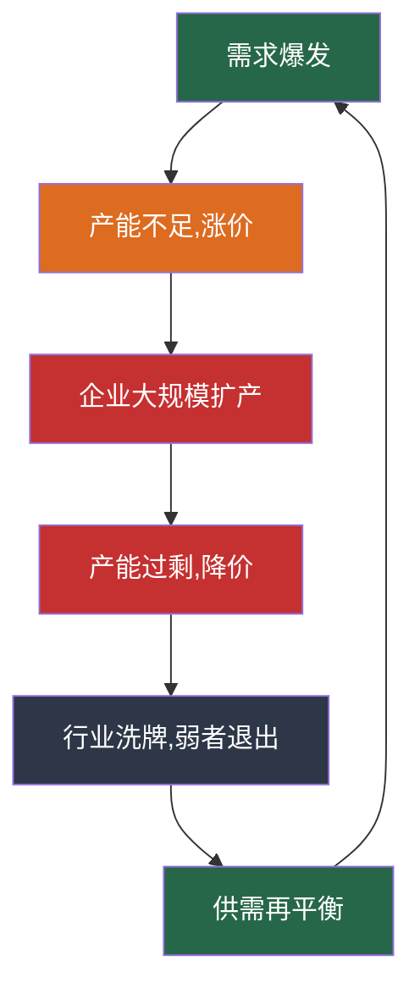

## 案例二：成长股投资——抓住宁德时代

> "投资成长股，你赌的不是公司今天值多少钱，而是它未来能值多少钱。" —— 菲利普·费雪

如果说茅台是A股价值投资的标杆，那么宁德时代（300750.SZ）就是成长股投资的最佳教科书。从2018年上市到2024年，宁德时代用6年时间完成了从"创业板新股"到"创业板市值之王"的蜕变，股价最高涨幅超过20倍，市值一度突破1.5万亿元，超越中国石油、工商银行等传统巨头。

但成长股投资从来不是一条坦途。宁德时代的股价同样经历了从260元跌到160元（-38%）、从690元跌到170元（-75%）的惨烈回撤。无数投资者在暴涨中追入，又在暴跌中割肉，最终亏损离场。

这个案例的核心价值在于：**教会你如何识别真正的成长股，如何在高波动中做出理性决策，以及如何避免成长股投资中最常见的致命错误。**

---

### 一、为什么选择宁德时代作为成长股案例

#### 1.1 成长股与价值股的本质区别

在深入案例之前，必须先理解成长股和价值股的投资逻辑有何不同：

| 维度 | 价值股（如茅台） | 成长股（如宁德时代） |
|------|-----------------|---------------------|
| 核心驱动 | 盈利稳定性 + 分红 | 营收高速增长 + 市场份额扩张 |
| 估值方法 | PE/PB/股息率 | PEG/PS/DCF（高增长假设） |
| 买入逻辑 | 便宜买入，等价值回归 | 在成长确认期买入，享受戴维斯双击 |
| 卖出逻辑 | 估值过高或基本面恶化 | 增速放缓或行业天花板临近 |
| 持有体验 | 波动小，心理压力低 | 波动大，需要极强心理素质 |
| 典型持有期 | 5-10年甚至更长 | 3-5年，成长期结束后换仓 |
| 代表行业 | 消费、金融、公用事业 | 新能源、半导体、生物医药 |

理解这个区别至关重要——用价值投资的方法分析成长股，或者用成长股的逻辑持有价值股，都会犯下严重错误。

#### 1.2 宁德时代的案例典型性

| 维度 | 宁德时代的表现 | 案例价值 |
|------|--------------|---------|
| 行业地位 | 全球动力电池市占率连续7年第一 | 展示如何识别行业龙头 |
| 增长速度 | 2018-2023年营收增长10倍，净利润增长8倍 | 典型的成长股爆发轨迹 |
| 技术壁垒 | 麒麟电池、钠离子电池、凝聚态电池 | 理解技术护城河的构建 |
| 全球化布局 | 德国、匈牙利、印尼建厂 | 分析全球化带来的估值溢价 |
| 股价波动 | 最大涨幅20倍，最大回撤75% | 学会应对极端波动 |
| 竞争格局 | 面对比亚迪、LG、松下的围攻 | 理解成长股的竞争风险 |

#### 1.3 本案例的学习要点

通过宁德时代案例，投资者可以学到：

- **如何发现高成长行业**：在行业爆发初期识别机会
- **如何评估成长股的护城河**：技术壁垒、规模效应、客户粘性
- **成长股的估值方法**：为什么PE不适用于高增长期的公司
- **何时买入成长股**：在什么阶段介入风险收益比最优
- **如何应对剧烈波动**：成长股动辄50%的回撤如何承受
- **何时卖出成长股**：增速放缓后如何退出

---

### 二、宁德时代的崛起之路

#### 2.1 创始人曾毓群的创业史

要理解宁德时代，首先要理解曾毓群。这位1968年出生的福建宁德人，用30年时间将一个电池代工厂打造成全球动力电池帝国。

**关键时间线：**

| 时间 | 事件 | 意义 |
|------|------|------|
| 1999年 | 创立ATL（新能源科技） | 进入消费电池领域，为苹果供应电池 |
| 2008年 | ATL成立动力电池事业部 | 看到新能源汽车的未来 |
| 2011年 | 从ATL独立，成立宁德时代 | 抓住中国新能源补贴政策窗口 |
| 2012年 | 获得宝马供应链认证 | 国际大客户背书，打开全球市场 |
| 2017年 | 动力电池装机量全球第一 | 超越松下和比亚迪 |
| 2018年 | 创业板上市 | 融资扩产，加速全球化 |
| 2021年 | 市值突破1.5万亿 | 成为创业板历史上市值最高的公司 |
| 2023年 | 全球市占率36.8% | 连续7年全球第一 |

曾毓群的名言"赌性坚强"完美概括了宁德时代的成长基因——在行业尚未爆发时敢于重注押入，在竞争加剧时敢于大规模扩产，在技术变革时敢于投入巨资研发。

#### 2.2 商业模式解析

宁德时代的商业模式可以用一个词概括：**为新能源汽车提供"心脏"**。


**商业模式的关键特征：**

**（一）to B为主，大客户依赖**

宁德时代的客户是车企而非消费者。这意味着：

- 订单集中度高：前五大客户贡献约50%营收
- 客户粘性强：车企一旦选定电池供应商，更换成本极高（需重新适配、认证、测试）
- 议价权复杂：大车企（如特斯拉）有强议价能力，但中小车企相对弱势
- 账期压力大：车企通常3-6个月账期，对电池厂现金流有压力

**（二）技术驱动，研发投入巨大**

2023年宁德时代研发投入约184亿元，研发费用率约5.5%，远超同行。核心技术包括：

| 技术 | 进展 | 竞争优势 |
|------|------|---------|
| 麒麟电池 | 第三代CTP技术，体积利用率72% | 能量密度领先同行1-2代 |
| 钠离子电池 | 已实现量产，成本比锂电池低30% | 低端市场降维打击 |
| 凝聚态电池 | 能量密度500Wh/kg | 航空级电池，开辟新赛道 |
| M3P电池 | 磷酸锰铁锂体系 | 兼顾成本和能量密度 |
| 神行超充电池 | 4C超充，10分钟充400公里 | 解决充电焦虑痛点 |

**（三）规模效应极其显著**

动力电池是典型的"规模越大、成本越低"的行业：

```text
规模效应量化：
- 宁德时代2023年产能：约300GWh（全球第一）
- 单位成本：约0.55元/Wh
- 行业平均成本：约0.70元/Wh
- 成本优势：约21%

成本优势来源：
1. 采购规模：原材料采购量大，议价能力强（约降低5-8%）
2. 制造效率：自动化程度高，良品率>95%（约降低5-7%）
3. 技术工艺：CTP/CTC技术减少结构件（约降低3-5%）
4. 管理优化：精益生产，能耗低（约降低2-3%）
```

#### 2.3 护城河深度分析

**（一）技术护城河**

宁德时代的技术壁垒不是单一专利，而是整个技术体系的累积优势：

- **专利数量**：截至2023年底，全球专利申请超过2万件，远超竞争对手
- **技术路线覆盖**：同时布局磷酸铁锂、三元锂、钠离子、固态电池等多种路线，"不把鸡蛋放在一个篮子里"
- **材料体系创新**：从电芯到材料的垂直整合，在正极材料、电解液等核心材料上拥有自主研发能力
- **制造工艺壁垒**：极片制造精度达到微米级，良品率行业领先

**（二）客户护城河**

动力电池的客户粘性可能是所有制造业中最强的：

| 粘性因素 | 具体表现 | 切换成本 |
|---------|---------|---------|
| 产品适配 | 电池包与车型底盘深度集成 | 需要重新设计整车架构，耗时1-2年 |
| 安全认证 | 车规级安全测试周期长 | 新供应商认证需6-12个月 |
| 产能锁定 | 大客户签订长期供货协议 | 违约需支付高额赔偿 |
| 技术协同 | 与车企联合开发定制电池 | 转换供应商意味着技术积累归零 |
| 售后体系 | 电池质保通常8年/15万公里 | 更换供应商影响质保体系 |

这意味着一旦宁德时代进入一家车企的供应链，竞争对手想要替代极其困难。

**（三）规模护城河**

动力电池行业正在经历"赢者通吃"的格局演化：

```text
2023年全球动力电池装机量排名：
1. 宁德时代  36.8%  ████████████████████████████████████
2. 比亚迪    15.8%  ████████████████
3. LG新能源  13.6%  ██████████████
4. 三星SDI    6.4%  ██████
5. SK On      5.1%  █████
6. 松下       4.7%  ████
7. 其他      17.6%  ██████████████████
```

宁德时代的市占率是第二名比亚迪的2.3倍，是第三名LG的2.7倍。这种规模优势形成了正向循环：规模大 → 成本低 → 价格竞争力强 → 获得更多订单 → 规模更大。

---

### 三、宁德时代的财务数据深度解读

#### 3.1 核心财务指标（2018-2023年）

| 年份 | 营收(亿) | 净利润(亿) | 毛利率 | 净利率 | ROE | 经营现金流(亿) |
|------|---------|-----------|--------|--------|-----|--------------|
| 2018 | 296 | 34 | 28.6% | 11.5% | 11.8% | 112 |
| 2019 | 458 | 46 | 27.7% | 10.0% | 12.7% | 178 |
| 2020 | 503 | 56 | 27.8% | 11.1% | 11.3% | 185 |
| 2021 | 1,304 | 159 | 26.3% | 12.2% | 23.7% | 402 |
| 2022 | 3,286 | 307 | 20.3% | 9.3% | 27.4% | 987 |
| 2023 | 4,009 | 441 | 22.9% | 11.0% | 22.8% | 1,178 |

**从这组数据中可以读出四个关键信号：**

**第一，营收爆发式增长。** 从2018年的296亿到2023年的4,009亿，5年增长12.5倍，年复合增长率约68%。这是典型成长股的标志——营收增速远超传统行业。

**第二，毛利率先降后稳。** 2022年毛利率降至20.3%的低点，主要原因是上游锂价暴涨（碳酸锂价格从5万/吨涨到60万/吨）。2023年随着锂价回落，毛利率回升至22.9%。这说明成长股的盈利波动往往比价值股更大。

**第三，ROE波动较大。** 从11.3%到27.4%，波动幅度远超茅台（茅台ROE稳定在30%+）。这是成长股的典型特征——高增长带来高ROE，但也伴随着高波动。

**第四，现金流优秀。** 经营现金流持续为正且远超净利润，净现比（经营现金流/净利润）常年在2.0以上。这说明宁德时代的利润质量很高，不是靠应收账款堆出来的纸面利润。

#### 3.2 成长性分析：与茅台的对比

| 指标 | 宁德时代（2018-2023） | 茅台（2018-2023） |
|------|---------------------|-------------------|
| 营收CAGR | 68% | 15% |
| 净利润CAGR | 67% | 16% |
| 毛利率趋势 | 下降后企稳（20%→23%） | 极其稳定（91%+） |
| ROE趋势 | 波动大（11%-27%） | 稳定高位（31%-33%） |
| 经营现金流/净利润 | 2.0-2.7倍 | 1.0-1.1倍 |
| 资本支出/净利润 | 2-3倍 | 0.1-0.2倍 |

这组对比揭示了成长股和价值股的核心差异：

- **宁德时代**：增长快但波动大，需要大量资本开支维持增长，盈利能力受原材料价格影响
- **茅台**：增长慢但极其稳定，几乎不需要资本开支，盈利能力由品牌和定价权保障

#### 3.3 杜邦分析拆解

```text
宁德时代 2023年：
ROE 22.8% = 净利率11.0% × 资产周转率0.86 × 权益乘数2.41

茅台 2023年：
ROE 33.2% = 净利率50.6% × 资产周转率0.48 × 权益乘数1.37
```

**对比解读：**

| 驱动因素 | 宁德时代 | 茅台 | 含义 |
|---------|---------|------|------|
| 净利率 | 11.0% | 50.6% | 宁德时代靠"薄利多销"，茅台靠"高利润率" |
| 资产周转率 | 0.86 | 0.48 | 宁德时代资产利用效率更高 |
| 权益乘数 | 2.41 | 1.37 | 宁德时代杠杆较高，有息负债较多 |

宁德时代的ROE由"周转率+杠杆"双驱动，而茅台由"利润率"单驱动。两种模式各有优劣——宁德时代的模式增长更快但风险更高，茅台的模式更稳健但增长受限。

---

### 四、成长股投资的关键决策节点

#### 4.1 何时买入：成长股的"甜蜜点"

成长股投资最难把握的就是买入时机。买早了，公司可能还没长大就倒闭了；买晚了，最肥美的涨幅已经错过。

**成长股的生命周期与买入窗口：**


| 阶段 | 特征 | 买入风险 | 买入收益 | 适合投资者 |
|------|------|---------|---------|-----------|
| 导入期 | 技术尚未成熟，商业模式未验证 | 极高（可能失败） | 极高（100倍潜力） | VC/天使投资人 |
| 成长初期 | 产品得到验证，收入快速增长 | 高（竞争激烈） | 高（10-50倍） | 专业投资者 |
| 高速成长期 | 行业地位确立，利润爆发 | 中（估值偏高） | 中（3-10倍） | 普通投资者 |
| 成熟期 | 增速放缓，竞争格局稳定 | 低（但增长有限） | 低（1-3倍） | 价值投资者 |

**宁德时代的最佳买入窗口：2019-2020年（高速成长期初期）**

为什么这个时间点最优？

- **成长确认**：2018年上市后连续两个季度业绩超预期，证明增长不是画饼
- **竞争格局清晰**：已确立全球第一地位，护城河开始显现
- **估值尚未泡沫化**：PE约40-60倍，对比其60%+的增速，PEG不到1
- **政策利好**：中国新能源补贴政策+欧洲碳排放法规双重驱动

#### 4.2 买入决策框架：成长股的估值方法

**（一）PEG估值法**

成长股最常用的估值工具是PEG（PE/Growth Ratio）：

```text
PEG = PE / 净利润增长率(%)

PEG < 0.5：严重低估，极度值得买入
PEG 0.5-1.0：合理偏低，值得买入
PEG 1.0-1.5：合理，可以持有
PEG 1.5-2.0：偏高，谨慎持有
PEG > 2.0：高估，考虑卖出
```

**宁德时代的PEG分析：**

| 时间 | 股价 | PE(TTM) | 净利润增速 | PEG | 判断 |
|------|------|---------|-----------|-----|------|
| 2019.01 | 70元 | 25倍 | 35% | 0.71 | 偏低，可买入 |
| 2020.03 | 120元 | 40倍 | 22% | 1.82 | 偏高，观望 |
| 2020.06 | 160元 | 50倍 | 13% | 3.85 | 高估，不买 |
| 2021.01 | 400元 | 120倍 | 185% | 0.65 | 偏低（高增长消化估值） |
| 2021.12 | 650元 | 130倍 | 185% | 0.70 | 仍合理 |
| 2022.04 | 400元 | 60倍 | 93% | 0.64 | 偏低，可加仓 |
| 2022.10 | 350元 | 35倍 | 93% | 0.38 | 严重低估 |

**关键洞察：** 2021年初宁德时代PE高达120倍，很多人认为"太贵了"。但当时净利润增速高达185%，PEG只有0.65，反而是合理的买入时机。这就是成长股估值的"反直觉"之处——高PE不等于高估，关键看增速能否匹配。

**（二）PS估值法（市销率）**

对于尚未盈利或利润波动大的成长股，PS比PE更实用：

```text
PS = 市值 / 营业收入

适用场景：
- 公司尚未盈利（如早期特斯拉）
- 利润波动剧烈（如周期性成长股）
- 需要跨行业对比（不同利润率的公司用PE无法直接对比）
```

**（三）DCF现金流折现（高增长假设版）**

```text
宁德时代 DCF估值示例（2022年10月，股价约350元时）：

基本假设：
- 2022年自由现金流：500亿元
- 未来5年增长率：40%（保守，实际2023年增速71%）
- 第6-10年增长率：20%
- 终端增长率：3%
- 折现率：12%（成长股风险溢价更高）

计算过程：
第1-5年现金流现值合计：约3,500亿元
第6-10年现金流现值合计：约4,200亿元
终值现值：约6,000亿元
总内在价值：约13,700亿元
总股本：24.4亿股
每股内在价值：约561元

安全边际价格（打6折）：约337元
```

当时股价350元，接近安全边际价格，是极佳的买入时机。

#### 4.3 持有阶段：如何应对剧烈波动

成长股的持有体验远比价值股痛苦。以宁德时代为例：

**宁德时代历史上的重大回撤：**

| 时间段 | 高点 | 低点 | 跌幅 | 回撤原因 | 恢复时间 |
|--------|------|------|------|---------|---------|
| 2020.02-2020.03 | 169元 | 105元 | -38% | 新冠疫情恐慌 | 约3个月 |
| 2021.01-2021.03 | 420元 | 280元 | -33% | 核心资产杀估值 | 约4个月 |
| 2021.12-2022.04 | 690元 | 350元 | -49% | 锂价暴涨+杀估值 | 约8个月 |
| 2022.07-2023.01 | 575元 | 345元 | -40% | 行业产能过剩担忧 | 约6个月 |
| 2023.01-2024.02 | 450元 | 140元 | -69% | 价格战+增速放缓 | 至今未恢复 |

**最惨烈的回撤：2023-2024年，从450元跌到140元，跌幅69%。**

如果你在2023年初以400元买入10万元宁德时代，到2024年最低点只剩约3.5万元——亏损6.5万元。这不是假设场景，而是真实发生在无数投资者身上的惨痛经历。

**如何在极端回撤中保持理性：**

**方法一：回到基本面检查清单**

```text
当宁德时代股价暴跌时，逐项检查：

□ 全球新能源汽车销量是否在增长？ → 是，2023年增长35%
□ 宁德时代市占率是否在下降？ → 否，仍保持全球第一
□ 技术优势是否被追平？ → 否，麒麟电池/钠离子电池仍领先
□ 核心客户是否流失？ → 否，特斯拉/宝马/奔驰仍为核心客户
□ 现金流是否恶化？ → 否，经营现金流创新高
□ 管理层是否出现重大问题？ → 否

结论：基本面未恶化，下跌原因是行业产能过剩预期+估值回归
→ 坚定持有甚至加仓
```

**方法二：分批建仓，摊薄成本**

```text
假设你计划投入10万元：

第一笔（2023.01）：350元买入3万元，获得85股
第二笔（2023.06）：250元买入3万元，获得120股
第三笔（2023.12）：180元买入4万元，获得222股

总投入：10万元
总股数：427股
平均成本：234元/股

如果股价从180元反弹到300元：
总市值 = 427 × 300 = 128,100元
收益率 = 28.1%

如果一次性在350元买入：
总股数 = 285股
300元时市值 = 85,500元
亏损 = -14.3%
```

分批建仓的核心价值不是"抄到底"，而是**避免在最高点一次性投入全部资金**。

**方法三：设置心理防线**

| 跌幅 | 心理状态 | 正确应对 | 错误应对 |
|------|---------|---------|---------|
| -10% | 轻微焦虑 | 正常波动，无需操作 | 开始怀疑选股 |
| -20% | 明显不安 | 检查基本面，考虑加仓 | 开始看空 |
| -30% | 恐慌 | 基本面OK则加仓，否则止损 | 恐慌卖出 |
| -50% | 绝望 | 回到最初买入逻辑重新评估 | 割肉离场 |
| -70% | 麻木 | 区分"股价跌"和"公司差" | 彻底放弃 |

#### 4.4 卖出时机：成长股的退出信号

成长股的卖出逻辑与价值股完全不同。价值股看估值是否过高，成长股看增长是否放缓。

**成长股的核心卖出信号：**

| 信号 | 严重程度 | 具体表现 | 操作建议 |
|------|---------|---------|---------|
| 增速显著放缓 | ★★★★★ | 营收增速从50%+降至20%以下 | 启动减仓 |
| 行业天花板临近 | ★★★★★ | 渗透率超过50%，增长空间收窄 | 逐步退出 |
| 竞争格局恶化 | ★★★★ | 市占率持续下降，价格战加剧 | 减仓观察 |
| 技术路线被颠覆 | ★★★★ | 新技术路线出现，现有技术可能被淘汰 | 果断减仓 |
| 估值严重泡沫 | ★★★ | PE超过历史90%分位，PEG>2 | 分批止盈 |
| 管理层重大变动 | ★★★ | 核心创始人离职，战略方向改变 | 观察1-2个季度 |

**宁德时代当前（2024年）的卖出信号检查：**

```text
□ 增速是否放缓？ → 是，2023年增速降至22%（2021年为185%）
  → 这是一个重要警示信号
□ 行业天花板是否临近？ → 部分是，中国新能源车渗透率已超35%
  → 但全球渗透率仅约18%，仍有增长空间
□ 竞争格局是否恶化？ → 部分是，比亚迪弗迪电池自供比例提升
  → 但宁德时代在海外市场份额仍在增长
□ 技术是否被颠覆？ → 否，固态电池尚在研发阶段
□ 估值是否泡沫化？ → 否，PE约18倍，处于历史低位
□ 管理层是否稳定？ → 是，曾毓群仍为实际控制人

综合判断：增速放缓但未停滞，估值已回归合理区间
→ 可以持有但不宜重仓，建议仓位控制在20%以内
```

---

### 五、成长股投资的常见致命错误

#### 5.1 错误一：在行业爆发末期追入

**典型场景：** 2021年底，新能源板块全面暴涨，宁德时代PE超过100倍。大量投资者看到"新能源是未来"，在600-690元的历史高位追入。

**为什么会犯这个错误：**

- 看到别人赚钱就眼红（FOMO心理）
- 把"行业好"等同于"公司好"等同于"股票好"
- 忽略了估值——好公司买贵了照样亏钱

**真实数据：** 2021年12月以690元买入的投资者，到2024年最低点140元，亏损80%。即使持有到2024年底（约250元），仍然亏损64%。

**正确做法：** 成长股投资必须区分"行业前景"和"股票估值"。新能源行业确实在高速增长，但690元的宁德时代已经透支了未来3-5年的增长预期。

#### 5.2 错误二：把增速线性外推

**典型场景：** 宁德时代2021年净利润增长185%，很多投资者认为"明年至少增长50%"，于是在高估值时加仓。

**实际情况：**

| 年份 | 净利润增速 | 市场预期 |
|------|-----------|---------|
| 2021 | +185% | - |
| 2022 | +93% | 预期100%+ |
| 2023 | +44% | 预期50%+ |
| 2024(E) | +15% | 预期25%+ |

增速逐年放缓是成长股的必然规律——基数越大，增长越难。把过去的高增速线性外推到未来，是成长股投资中最常见的认知偏差。

**正确做法：** 用保守的增速假设估值。如果你认为公司未来能增长30%，用20%的假设来估值，给自己留出安全边际。

#### 5.3 错误三：忽略竞争格局变化

**典型场景：** 2020年之前，宁德时代在动力电池领域几乎没有对手。但随着比亚迪弗迪电池的崛起、中创新航的上市、国轩高科被大众入股，竞争格局急剧恶化。

**竞争格局恶化的量化指标：**

```text
宁德时代全球市占率变化：
2020年：24.6%  ████████████████████████
2021年：32.6%  ████████████████████████████████
2022年：37.0%  █████████████████████████████████████
2023年：36.8%  ████████████████████████████████████
2024年(H1): 35.1% ███████████████████████████████████

趋势：从快速增长转为微幅下降，竞争压力开始显现
```

**正确做法：** 持续跟踪市占率变化、竞争对手动态、新技术路线进展。成长股的竞争格局可能在一两年内发生根本性变化。

#### 5.4 错误四：不设止损

**典型场景：** "宁德时代是好公司，跌了就拿着，总会涨回来。"

**问题在于：** 成长股的"涨回来"可能需要很长时间，甚至可能永远不会回到前高。690元买入的投资者，即使等到2030年，也未必能解套。

**与茅台的关键区别：** 茅台的商业模式极其稳固，即使短期下跌，长期几乎确定能创新高。但宁德时代面临技术路线变革、竞争加剧、行业周期等多重风险，股价有可能长期低于前高。

**正确做法：** 成长股必须设置止损线。建议止损线为买入价的-30%或PE跌破合理区间。

#### 5.5 错误五：忽视产业链周期

动力电池行业有明显的周期性：



2022-2023年正处于"产能过剩,降价"阶段——碳酸锂价格从60万/吨暴跌至10万/吨，电池价格战激烈。在这个阶段重仓成长股，即使公司基本面没有恶化，股价也会因为行业周期而大幅下跌。

**正确做法：** 成长股投资必须关注行业周期。在产能过剩阶段降低仓位，在需求爆发阶段加仓。

---

### 六、成长股投资的完整决策框架

#### 6.1 选股阶段：如何发现下一个宁德时代

**成长股筛选清单：**

```text
行业层面（满足至少3项）：
□ 市场规模 > 1000亿元（足够大的池子才能养出大鱼）
□ 渗透率 < 20%（仍有巨大增长空间）
□ 年增速 > 30%（行业处于高速增长期）
□ 政策支持（国家战略方向，有政策红利）
□ 技术成熟度高（不是PPT阶段，已有商业化产品）

公司层面（全部满足）：
□ 行业市占率前三（龙头或准龙头）
□ 营收增速 > 30%（连续2年以上）
□ 毛利率稳定或上升（有定价权）
□ 研发投入/营收 > 5%（技术驱动型公司）
□ 经营现金流为正（不是靠融资烧钱）
□ 管理层持股（利益绑定）
□ 客户集中度合理（不过度依赖单一客户）

排除项（有一项即排除）：
✗ 大股东高比例质押（>50%）
✗ 商誉/总资产 > 30%
✗ 频繁变更会计政策
✗ 实控人涉及法律纠纷
```

#### 6.2 建仓阶段：成长股的分批策略

成长股的建仓策略需要比价值股更加谨慎：

| 批次 | 时机 | 仓位 | 理由 |
|------|------|------|------|
| 观察仓 | PEG<1.5 | 10% | 建立观察，不重仓 |
| 第一批 | PEG<1.0 | 20% | 进入合理估值区间 |
| 第二批 | PEG<0.7 | 30% | 低估区间，加大投入 |
| 第三批 | PEG<0.5或股价回调30%+ | 40% | 极度低估或深度回调 |

**关键原则：** 成长股宁可少赚也不要重仓被套。因为成长股的回撤幅度远超价值股（宁德时代最大回撤75%，茅台最大回撤63%），一旦在高位重仓被套，心理压力会导致错误决策。

#### 6.3 跟踪阶段：成长股的核心监控指标

| 指标 | 频率 | 预警阈值 | 数据来源 |
|------|------|---------|---------|
| 季度营收增速 | 每季 | <20%需警惕 | 财报 |
| 季度净利润增速 | 每季 | <15%需警惕 | 财报 |
| 行业月度装机量 | 每月 | 市占率下降>2% | 行业协会 |
| 原材料价格 | 每周 | 涨幅>30%需警惕 | 百川盈孚 |
| 竞争对手动态 | 每月 | 新技术/大客户变动 | 新闻/研报 |
| 机构持仓变化 | 每季 | 机构大幅减持 | 财报 |
| 北向资金流向 | 每日 | 持续净流出>20天 | 东方财富 |

---

### 七、案例复盘：模拟投资决策记录

以下是一个模拟的成长股投资者在宁德时代上的完整投资记录：

| 时间 | 操作 | 价格 | PE | PEG | 逻辑 |
|------|------|------|-----|-----|------|
| 2019.06 | 买入观察仓 | 75元 | 28倍 | 0.80 | 行业爆发+全球第一确认 |
| 2020.03 | 加仓 | 110元 | 35倍 | 1.59 | 疫情错杀，但估值偏高，少量加仓 |
| 2020.09 | 加仓 | 200元 | 60倍 | 1.40 | 新能源行情启动，业绩验证 |
| 2021.01 | 持有 | 400元 | 120倍 | 0.65 | 高增速消化估值，继续持有 |
| 2021.07 | 减仓30% | 550元 | 150倍 | 1.15 | 估值偏高，锁定部分利润 |
| 2021.12 | 减仓20% | 650元 | 130倍 | 0.70 | 估值泡沫化，继续减仓 |
| 2022.04 | 加仓 | 380元 | 50倍 | 0.54 | 深度回调+PEG低估 |
| 2022.07 | 持有 | 550元 | 50倍 | 0.54 | 估值合理，持有 |
| 2023.06 | 少量加仓 | 230元 | 20倍 | 0.45 | 极度低估，但需控制仓位 |
| 2024.02 | 持有 | 160元 | 15倍 | 1.00 | 增速放缓，估值已低，等待 |

**模拟收益计算：**

```text
初始投入（2019.06）：20万元，75元买入2,666股
2020.03加仓：10万元，110元买入909股
2020.09加仓：10万元，200元买入500股
2021.07减仓30%（1,222股）：550元卖出，回收67.2万元
2021.12减仓20%（670股）：650元卖出，回收43.6万元
2022.04加仓：20万元，380元买入526股
2023.06加仓：10万元，230元买入434股

总投入：70万元
总回收：110.8万元
剩余持仓：3,143股 × 250元（2024年底估计）= 78.6万元
总价值：110.8万 + 78.6万 = 189.4万元
总收益：189.4万 - 70万 = 119.4万元
5年收益率：171%
年化收益率：约22%
```

这个收益看似不错，但注意：如果在2021年12月最高点650元一次性买入70万，到2024年底只剩约27万——亏损61%。**买入时机和仓位管理决定了成长股投资的成败。**

---

### 八、进阶：成长股投资的深层思考

#### 8.1 成长股的"戴维斯双击"与"戴维斯双杀"

**戴维斯双击（股价上涨的正向飞轮）：**

```text
业绩增长 → 盈利预期提升 → 市场给予更高PE → 股价涨幅 = 业绩涨幅 × PE涨幅

宁德时代实例（2020-2021）：
- 净利润从56亿增长到159亿（+184%）
- PE从50倍提升到130倍（+160%）
- 股价涨幅 = 184% × 160% ≈ 400%（从160元到650元）
```

**戴维斯双杀（股价下跌的恶性循环）：**

```text
增速放缓 → 盈利预期下调 → 市场降低PE → 股价跌幅 = 业绩下滑 × PE压缩

宁德时代实例（2022-2023）：
- 净利润增速从185%降至44%（增速大幅放缓）
- PE从130倍压缩到20倍（-85%）
- 股价跌幅 = 增速放缓(约-60%) × PE压缩(约-85%) ≈ -75%（从690元到170元）
```

理解戴维斯双击和双杀，就理解了成长股暴涨暴跌的根本原因。

#### 8.2 成长股的终局思考

所有成长股最终都会变成价值股或衰退股。投资者必须在投资初期就想清楚：

| 问题 | 宁德时代的答案 | 对投资的影响 |
|------|--------------|-------------|
| 行业终局是什么？ | 新能源汽车全面替代燃油车 | 高增长可能持续5-10年 |
| 公司终局是什么？ | 成为全球能源巨头，或被新技术颠覆 | 长期持有需要持续跟踪 |
| 增速终局是什么？ | 从60%+降至20%再到个位数 | 估值必然从成长股PE回归价值股PE |
| 竞争终局是什么？ | 3-5家巨头瓜分市场 | 市占率可能被稀释 |

**关键结论：** 成长股投资本质上是"与时间赛跑"——你必须在市场发现增长放缓之前退出，否则就会被戴维斯双杀。

#### 8.3 宁德时代的未来展望

**乐观情景（概率30%）：**

- 全球新能源车渗透率2030年达到50%
- 宁德时代海外市占率提升至40%
- 储能业务成为第二增长曲线
- 凝聚态电池实现商业化
- 2030年营收突破万亿，净利润超1000亿
- 对应股价：500-800元

**中性情景（概率50%）：**

- 全球新能源车渗透率2030年达到35%
- 国内市占率微降，海外稳步增长
- 储能业务贡献20%营收
- 价格战持续，毛利率维持20-22%
- 2030年营收6000亿，净利润500亿
- 对应股价：250-400元

**悲观情景（概率20%）：**

- 固态电池技术突破，宁德时代技术优势被削弱
- 比亚迪弗迪电池开放外供，抢走大量份额
- 欧洲/美国设置贸易壁垒，海外扩张受阻
- 行业全面产能过剩，价格战导致利润大幅下滑
- 2030年营收4000亿，净利润200亿
- 对应股价：100-200元

---

### 九、成长股 vs 价值股：一张决策对比表

| 决策维度 | 宁德时代（成长股） | 茅台（价值股） |
|---------|-------------------|---------------|
| 买入依据 | 增速+行业空间+竞争格局 | 估值+护城河+现金流 |
| 估值工具 | PEG/PS/DCF | PE/股息率/DDM |
| 建仓节奏 | 小仓试探→逐步加仓 | 估值到位→分批买入 |
| 持有耐心 | 3-5年，增速放缓需换仓 | 10年+，几乎可以"永远持有" |
| 卖出信号 | 增速放缓/竞争恶化/技术颠覆 | 估值过高/基本面恶化 |
| 最大回撤承受 | -50%~75% | -30%~50% |
| 心理要求 | 极高（需承受剧烈波动） | 中等（波动相对可控） |
| 适合人群 | 有经验的投资者 | 所有投资者 |

---

### 十、经验总结

从宁德时代案例中，我们可以提炼出成长股投资的核心法则：

**法则一：行业比公司重要。** 再优秀的公司，如果在一个萎缩的行业中，也难以持续增长。选择成长股的第一步是选对行业——市场规模大、渗透率低、增速快、政策支持。

**法则二：增速比利润重要。** 成长股的核心价值在于增长速度，而非当前利润。一家利润100亿但增速5%的公司，不如一家利润10亿但增速50%的公司值得投资。

**法则三：估值纪律比选股能力更重要。** 好公司买贵了照样亏钱。宁德时代是好公司，但在690元买入的投资者亏了80%。永远不要因为"看好行业"就忽略估值。

**法则四：仓位管理决定生死。** 成长股的波动幅度远超价值股。如果你在高位重仓，一次-70%的回撤就可能让你永远无法翻身。永远留有余地。

**法则五：退出比进入更重要。** 成长股投资最难的不是发现机会，而是在增速放缓时果断退出。不要恋战，不要幻想"再涨一点"，该走就走。

**法则六：分散投资是对冲风险的唯一手段。** 不要把所有资金押在一只成长股上。即使你对宁德时代再有信心，也要分散到不同行业、不同风格的资产中。

> "成长股投资是投资世界中最刺激的游戏，但也是最容易亏钱的游戏。赢的人靠的是纪律和耐心，输的人靠的是贪婪和侥幸。"
