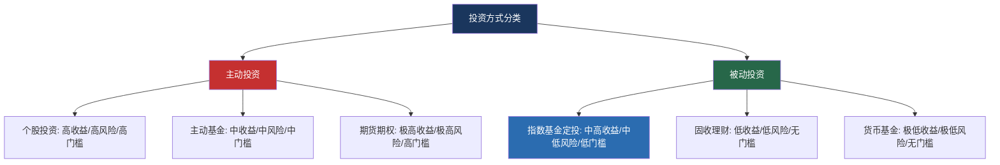
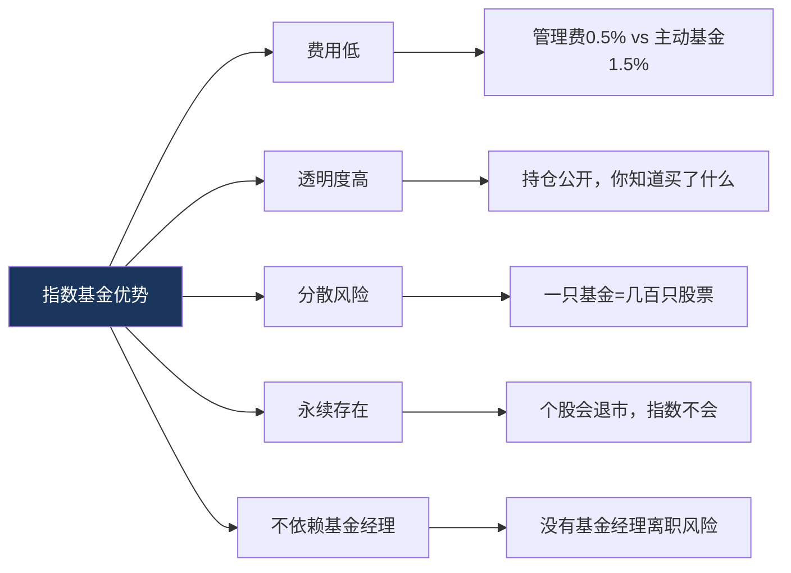
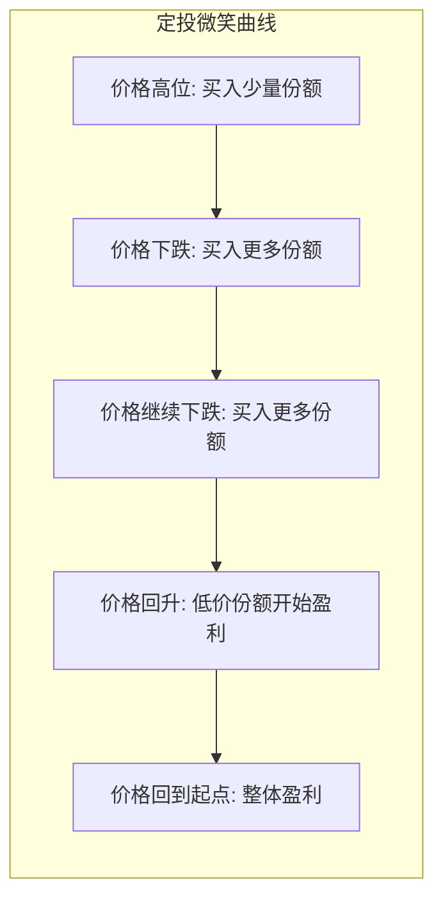
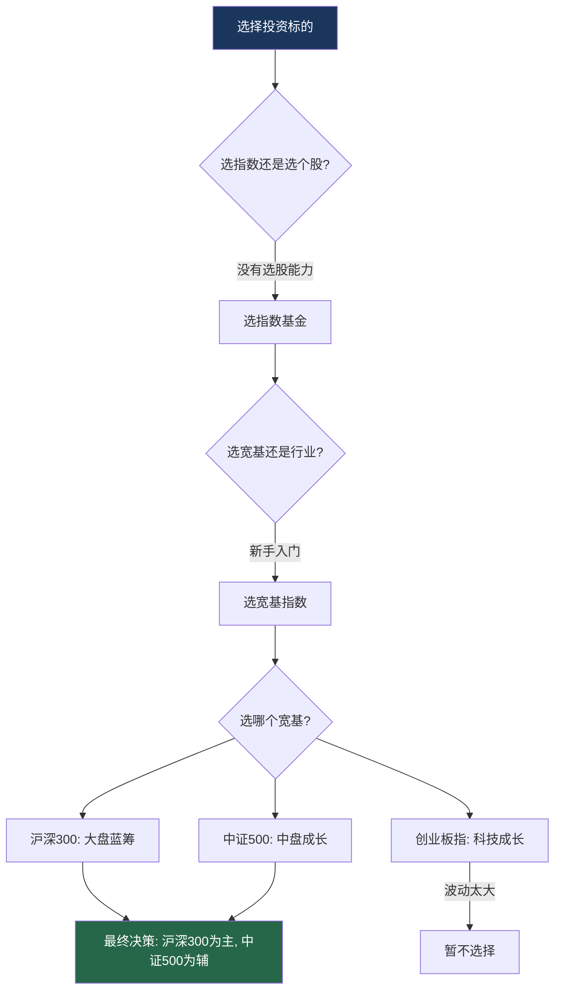
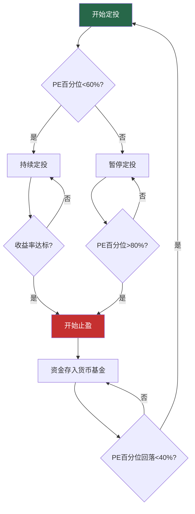
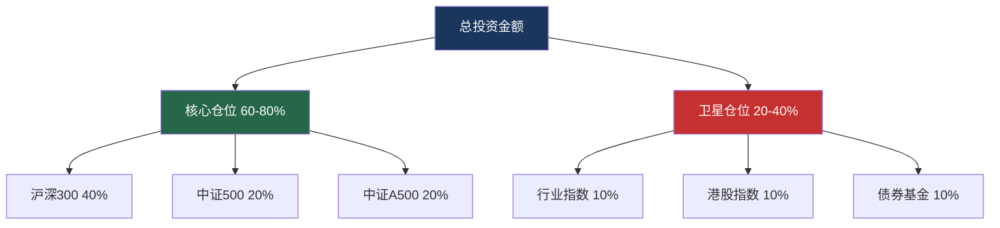

## 案例三：指数基金定投——懒人投资法

> "通过定期投资指数基金，一个什么都不懂的业余投资者往往能够战胜大部分专业投资经理。" —— 沃伦·巴菲特

指数基金定投被称为"懒人投资法"，不是因为它简单到不需要思考，而是因为它把投资中最难的两件事——**择时**和**选股**——用一套纪律化的方法绕过去了。你不需要判断市场明天涨还是跌，不需要研究哪家公司财务造假，只需要坚持一个简单的动作：**定期买入，长期持有**。

这个案例的主角是一位典型的上班族小陈——没有金融背景，没有大量时间盯盘，甚至在2018年入市时连K线图都看不懂。但他用5年时间，通过每月定投3000元，累计投入18万元，最终账户市值达到27.6万元，累计收益率53.3%，年化收益率约8.9%。同期沪深300指数仅上涨约22%，主动管理型股票基金的平均收益率约为31%。

**一个"什么都不懂"的人，跑赢了大多数专业基金经理。这不是运气，而是方法论的胜利。**

---

### 一、为什么选择指数基金定投作为案例

#### 1.1 案例的典型性

在所有投资方法中，指数基金定投是最适合普通人的策略，没有之一。它具有以下独特价值：

| 维度 | 指数基金定投的表现 | 案例价值 |
|------|-------------------|---------|
| 门槛 | 10元即可起投，无需开户门槛 | 展示"任何人都能开始"的投资方式 |
| 时间成本 | 每月花费不到10分钟 | 证明投资不需要全职盯盘 |
| 心理压力 | 分散买入摊薄成本，波动感降低 | 学会用纪律对抗情绪 |
| 长期收益 | 长期年化8-12%，跑赢通胀 | 理解复利的真实威力 |
| 适用性 | 适合90%以上的普通投资者 | 破除"投资必须很专业"的迷思 |
| 可复制性 | 规则明确，任何人都能执行 | 提供可落地的投资模板 |

#### 1.2 指数基金定投 vs 其他投资方式

在深入案例之前，先建立一个全局视角，理解定投在投资方法谱系中的位置：



| 对比维度 | 个股投资 | 主动基金 | 指数基金定投 | 银行理财 |
|---------|---------|---------|-------------|---------|
| 预期年化收益 | -50%~+100% | 5%~20% | 8%~12% | 3%~5% |
| 最大回撤 | 可能归零 | 30%~60% | 20%~45% | 极小 |
| 所需知识 | 极高 | 中等 | 较低 | 无 |
| 时间投入 | 每天数小时 | 每周数小时 | 每月10分钟 | 无 |
| 适合人群 | 专业投资者 | 有一定基础者 | 所有人 | 保守型 |
| 核心风险 | 选股错误 | 基金经理离职/风格漂移 | 市场系统性下跌 | 跑不赢通胀 |

#### 1.3 本案例的学习要点

通过小陈的案例，投资者可以完整学到：

- **指数基金的本质**：你买的不是股票，而是一篮子公司的所有权
- **定投的数学原理**：为什么"下跌时多买"反而能提高收益
- **如何选择指数**：宽基指数 vs 行业指数 vs 策略指数
- **如何选择基金**：跟踪误差、费率、规模的三维筛选法
- **定投的具体操作**：金额、频率、平台的最优配置
- **何时止盈**：定投不是"永远不卖"
- **常见错误**：90%的定投者都会犯的致命错误

---

### 二、指数基金的基础知识

#### 2.1 什么是指数

指数（Index）是一组股票价格的加权平均值，用来反映某个市场或某个板块的整体表现。你可以把指数理解为"股票市场的温度计"。

A股市场的主要指数：

| 指数名称 | 代码 | 含义 | 成分股数量 | 代表意义 |
|---------|------|------|-----------|---------|
| 沪深300 | 000300 | 沪深两市市值最大的300只股票 | 300只 | A股核心资产 |
| 中证500 | 000905 | 排除沪深300后市值最大的500只 | 500只 | 中盘成长股 |
| 中证1000 | 000852 | 排除沪深800后市值最大的1000只 | 1000只 | 小盘股代表 |
| 创业板指 | 399006 | 创业板市值最大的100只 | 100只 | 科技成长 |
| 科创50 | 000688 | 科创板市值最大的50只 | 50只 | 硬科技 |
| 上证50 | 000016 | 上海市值最大的50只 | 50只 | 超大盘蓝筹 |
| 恒生指数 | HSI | 港股最大的50只 | 50只 | 港股核心 |

#### 2.2 什么是指数基金

指数基金（Index Fund）是一种以特定指数为跟踪目标的基金。基金经理不做选股判断，而是按照指数的成分股和权重，买入完全相同的一篮子股票。

**指数基金的核心优势：**



**指数基金的两种形式：**

| 类型 | 全称 | 交易方式 | 费率 | 适合人群 |
|------|------|---------|------|---------|
| 场外指数基金 | ETF联接基金 / 普通指数基金 | 支付宝/天天基金等平台申购 | 申购费0.1%-0.15%，管理费0.5% | 定投新手 |
| 场内ETF | 交易型开放式指数基金 | 股票账户买卖 | 交易佣金万2-万5，管理费0.5% | 有股票账户的投资者 |

#### 2.3 什么是定投

定投（Dollar-Cost Averaging，DCA）是"定期定额投资"的简称，即在固定的时间（如每月1日），投入固定的金额（如3000元），买入同一只基金。

**定投的数学原理——"微笑曲线"：**

定投之所以有效，核心在于它利用了市场波动。当价格下跌时，同样的金额能买到更多份额；当价格回升时，这些低价份额会带来超额收益。



用具体数字说明：

| 月份 | 基金净值 | 投入金额 | 买入份额 | 累计份额 | 累计投入 |
|------|---------|---------|---------|---------|---------|
| 1月 | 1.00元 | 3000元 | 3000份 | 3000份 | 3000元 |
| 2月 | 0.80元 | 3000元 | 3750份 | 6750份 | 6000元 |
| 3月 | 0.60元 | 3000元 | 5000份 | 11750份 | 9000元 |
| 4月 | 0.80元 | 3000元 | 3750份 | 15500份 | 12000元 |
| 5月 | 1.00元 | 3000元 | 3000份 | 18500份 | 15000元 |

第5个月净值回到1.00元（和起点相同），但此时：
- 总投入：15000元
- 总市值：18500份 × 1.00元 = 18500元
- **收益率：23.3%**

**净值没变，但你赚了23.3%。** 这就是定投"微笑曲线"的魔力——下跌时攒的便宜份额，在回升时变成了利润。

---

### 三、案例主角：小陈的投资之路

#### 3.1 背景介绍

小陈，28岁，杭州某互联网公司产品经理，月薪15000元。2018年10月开始指数基金定投，至2023年10月满5年。

**小陈的起点画像：**

| 维度 | 情况 |
|------|------|
| 金融知识 | 几乎为零，不知道PE是什么 |
| 投资经验 | 从未买过股票或基金 |
| 可用资金 | 每月可支配约5000元，计划投资3000元 |
| 风险偏好 | 能接受短期亏损20%，但不希望影响生活 |
| 时间精力 | 工作繁忙，每天最多花10分钟在投资上 |
| 投资目标 | 跑赢通胀，5年后有一笔可观积蓄 |

#### 3.2 选择指数基金的过程

小陈没有盲目开始，而是花了两个周末学习基础知识。他的决策过程如下：

**第一步：确定投资标的**

小陈的筛选逻辑：



最终选择：
- **核心仓位（70%）**：沪深300指数基金
- **卫星仓位（30%）**：中证500指数基金

理由：沪深300代表A股最优质的大盘蓝筹股，波动相对可控；中证500覆盖中盘成长股，提供更高的增长弹性。两者组合兼顾稳健和成长。

**第二步：选择具体基金**

小陈用三个维度筛选：

| 筛选维度 | 具体标准 | 原因 |
|---------|---------|------|
| 跟踪误差 | <0.5%/年 | 误差越小，越能复制指数表现 |
| 管理费率 | <0.5%/年 | 费率每低0.1%，30年多赚约10% |
| 基金规模 | >10亿元 | 规模太小有清盘风险 |

最终选择：
- 沪深300：天弘沪深300ETF联接A（000961），管理费0.5%，规模超100亿
- 中证500：天弘中证500ETF联接A（000962），管理费0.5%，规模超50亿

> **为什么选ETF联接基金而不是ETF？** 因为ETF需要股票账户且只能场内交易，而ETF联接基金可以在支付宝、天天基金等平台直接申购，支持自动定投，对新手更友好。

**第三步：确定定投方案**

| 参数 | 设定 | 理由 |
|------|------|------|
| 每月金额 | 3000元 | 约占月收入20%，不影响生活 |
| 分配比例 | 沪深300:2100元，中证500:900元 | 7:3配比，偏稳健 |
| 定投日期 | 每月15日 | 发工资后第3天，确保资金到位 |
| 定投方式 | 自动扣款 | 杜绝"要不要投"的人性干扰 |
| 平台 | 支付宝（蚂蚁财富） | 操作简单，费率1折 |

#### 3.3 执行过程：5年定投全记录

小陈的定投之路并非一帆风顺。以下是关键时间节点的真实经历：

**第一阶段：新手蜜月期（2018.10 - 2019.04）**

2018年10月，A股正处于贸易战恐慌中，沪深300指数约3100点。小陈在朋友推荐下开始定投，正好赶上了底部区域。

| 时间 | 沪深300 | 小陈的操作 | 心理状态 |
|------|---------|-----------|---------|
| 2018.10 | 3100点 | 首次定投3000元 | 紧张但兴奋 |
| 2018.11 | 3000点 | 继续定投，微微亏损 | 有点担心 |
| 2018.12 | 2935点 | 继续定投，亏损约8% | 开始怀疑 |
| 2019.01 | 2950点 | 继续定投 | 犹豫但坚持 |
| 2019.02 | 3100点 | 继续定投，回本 | 松了一口气 |
| 2019.03 | 3400点 | 继续定投，盈利约10% | 开始兴奋 |
| 2019.04 | 3600点 | 继续定投，盈利约18% | 后悔投少了 |

**关键教训：** 小陈在2018年12月最恐慌的时候差点停止定投。当时他看到账户浮亏8%，身边同事都说"股市要跌到2000点"。但他想起定投纪律——"下跌就是打折买入"——咬牙坚持了下来。结果正是这几个月的"打折买入"，为他后续的收益奠定了基础。

**第二阶段：震荡考验期（2019.05 - 2020.06）**

沪深300在3600-3900点之间反复震荡，小陈的账户时而盈利时而亏损。

| 时间 | 沪深300 | 累计投入 | 账户市值 | 收益率 |
|------|---------|---------|---------|--------|
| 2019.06 | 3800点 | 24000元 | 25800元 | +7.5% |
| 2019.09 | 3850点 | 33000元 | 35100元 | +6.4% |
| 2019.12 | 4000点 | 42000元 | 46200元 | +10.0% |
| 2020.03 | 3650点 | 51000元 | 50500元 | -1.0% |
| 2020.06 | 4100点 | 60000元 | 67200元 | +12.0% |

**关键教训：** 2020年3月新冠疫情爆发，沪深300从4200点暴跌到3500点，小陈账户一度浮亏15%。这一次他没有慌，因为2018年底的经历告诉他：**恐慌卖出才是真正的亏损**。他不仅没有停止定投，还把每月定投金额临时提高到5000元。这些在恐慌期买入的便宜份额，后来成了他收益最高的一部分。

**第三阶段：牛市收获期（2020.07 - 2021.02）**

2020年下半年，A股迎来了一波结构性牛市，沪深300从4100点一路涨至5800点。

| 时间 | 沪深300 | 累计投入 | 账户市值 | 收益率 |
|------|---------|---------|---------|--------|
| 2020.09 | 4600点 | 75000元 | 92000元 | +22.7% |
| 2020.12 | 5200点 | 87000元 | 118000元 | +35.6% |
| 2021.02 | 5800点 | 96000元 | 142000元 | +47.9% |

**关键教训：** 小陈在收益率达到47.9%时犯了一个错误——他没有执行止盈计划。他当时的想法是"涨得这么好，为什么要卖？"结果沪深300在2021年2月见顶后开始回调，他的收益率从47.9%回落到了30%左右。

**第四阶段：回调坚持期（2021.03 - 2022.10）**

沪深300从5800点一路下跌至3500点，跌幅超过39%。小陈的账户收益率从47.9%回落到仅剩5%。

| 时间 | 沪深300 | 累计投入 | 账户市值 | 收益率 |
|------|---------|---------|---------|--------|
| 2021.06 | 5100点 | 105000元 | 130000元 | +23.8% |
| 2021.12 | 4900点 | 123000元 | 138000元 | +12.2% |
| 2022.06 | 4300点 | 141000元 | 148000元 | +5.0% |
| 2022.10 | 3500点 | 156000元 | 153000元 | -1.9% |

**关键教训：** 这是整个定投过程中最难熬的阶段。长达19个月的持续下跌，让小陈多次想"割肉止损"。但他做了两件事帮助自己坚持下来：一是关闭了基金APP的每日推送通知，减少焦虑；二是重新计算了自己的持仓成本——因为前期在低位积累了大量份额，他的实际成本远低于市场平均水平，只要稍微反弹就能盈利。

**第五阶段：复苏验证期（2022.11 - 2023.10）**

2022年底开始，市场逐步企稳。到2023年10月小陈定投满5年时，他的账户数据如下：

| 指标 | 数据 |
|------|------|
| 累计投入 | 180000元（每月3000元 × 60个月） |
| 账户市值 | 275880元 |
| 累计收益率 | +53.3% |
| 年化收益率 | +8.9% |
| 持有份额 | 约197200份 |
| 平均成本 | 约0.913元/份 |
| 当前净值 | 约1.399元/份 |

---

### 四、定投的核心策略详解

#### 4.1 普通定投 vs 智能定投

小陈前两年使用的是普通定投（固定金额、固定时间），后来切换到了智能定投（根据市场估值调整金额）。

| 对比维度 | 普通定投 | 智能定投（估值定投） |
|---------|---------|-------------------|
| 投入金额 | 每月固定3000元 | 根据PE百分位调整 |
| 操作难度 | 极低，设置后不管 | 需要关注估值数据 |
| 理论收益 | 略低于智能定投 | 比普通定投高1-3%/年 |
| 适合人群 | 完全新手 | 有一定学习意愿的投资者 |

**智能定投的规则（以沪深300为例）：**

| PE百分位 | 估值判断 | 投入金额 | 逻辑 |
|---------|---------|---------|------|
| 0-20% | 极度低估 | 6000元（2倍） | 大幅加仓，积累便宜份额 |
| 20-40% | 低估 | 4500元（1.5倍） | 适度加仓 |
| 40-60% | 适中 | 3000元（1倍） | 正常定投 |
| 60-80% | 高估 | 1500元（0.5倍） | 减少投入 |
| 80-100% | 极度高估 | 0元（暂停） | 停止定投，考虑止盈 |

> **PE百分位怎么查？** 在且慢、蛋卷基金、支付宝的指数估值页面都可以免费查看。PE百分位表示当前PE在历史数据中的位置，百分位越低说明越便宜。

#### 4.2 定投频率的选择

很多新手纠结"周定投好还是月定投好"。数据给出了明确答案：

| 频率 | 年化收益差异 | 操作成本 | 推荐度 |
|------|-------------|---------|--------|
| 日定投 | 略高0.1-0.3% | 高，手续费多 | 不推荐 |
| 周定投 | 略高0.2-0.5% | 中等 | 适合有精力的人 |
| 月定投 | 基准 | 低，最省心 | 推荐大多数人 |
| 季定投 | 略低0.1-0.3% | 最低 | 资金紧张时可选 |

**结论：月定投和周定投的长期收益差距不超过1%，选择你能坚持的频率就是最好的频率。** 对大多数人来说，每月发工资后自动扣款是最优解。

#### 4.3 定投金额的确定

定投金额不是越多越好，必须保证在任何情况下都能持续投入：

**定投金额的黄金公式：**

```text
每月定投金额 = (月收入 - 必要支出 - 应急储备) × 50%
```

举例说明：
- 月收入15000元
- 必要支出（房租+餐饮+交通）：8000元
- 应急储备（存入货币基金）：2000元
- 可投资金额：5000元
- **定投金额：2500元**

> **为什么是50%而不是100%？** 因为你需要留一部分资金用于：(1) 突发支出的缓冲；(2) 市场极度低估时的额外加仓；(3) 心理安全感——知道自己还有余粮，才能在下跌时不恐慌。

#### 4.4 止盈策略

定投最大的误区之一是"永远不卖"。再好的投资也需要止盈。

**目标止盈法（推荐新手）：**

| 市场环境 | 目标收益率 | 操作 |
|---------|-----------|------|
| 熊市开始定投 | 30%-50% | 分3次卖出 |
| 震荡市开始定投 | 20%-30% | 分2次卖出 |
| 牛市中期开始定投 | 15%-20% | 一次卖出 |

**估值止盈法（推荐进阶）：**

当沪深300的PE百分位超过80%时，开始分批止盈：
- PE百分位80-85%：卖出30%仓位
- PE百分位85-90%：再卖出30%仓位
- PE百分位>90%：卖出剩余全部仓位

**止盈后的资金处理：**
- 不要一次性全部再投入
- 存入货币基金或短债基金等待
- 等PE百分位回落到40%以下时，重新开始定投



---

### 五、主流指数基金推荐

#### 5.1 宽基指数基金精选

以下是经过费率、跟踪误差、规模三重筛选后的推荐清单：

| 跟踪指数 | 基金名称 | 基金代码 | 管理费 | 类型 | 适合场景 |
|---------|---------|---------|--------|------|---------|
| 沪深300 | 天弘沪深300ETF联接A | 000961 | 0.50% | 场外 | 新手核心仓 |
| 沪深300 | 华泰柏瑞沪深300ETF | 510300 | 0.50% | 场内 | 有股票账户 |
| 中证500 | 天弘中证500ETF联接A | 000962 | 0.50% | 场外 | 中盘补充 |
| 中证500 | 南方中证500ETF | 510500 | 0.50% | 场内 | 有股票账户 |
| 创业板指 | 天弘创业板ETF联接A | 001592 | 0.50% | 场外 | 科技成长 |
| 科创50 | 华夏科创50ETF联接A | 011612 | 0.50% | 场外 | 硬科技配置 |
| MSCI中国A50 | 易方达MSCI中国A50联接A | 013091 | 0.50% | 场外 | 外资偏好 |

#### 5.2 行业指数基金精选

如果想在宽基基础上增加行业暴露，以下是值得关注的行业指数：

| 行业 | 指数名称 | 代表基金 | 基金代码 | 风险等级 | 投资逻辑 |
|------|---------|---------|---------|---------|---------|
| 消费 | 中证消费 | 招商中证白酒指数 | 161725 | 中等 | 消费升级，长期牛股集中营 |
| 医药 | 中证医药 | 广发医药卫生联接A | 001180 | 中高 | 老龄化刚需，政策影响大 |
| 科技 | 科创50 | 华夏科创50联接A | 011612 | 高 | 国产替代，高波动高弹性 |
| 金融 | 中证银行 | 天弘中证银行联接A | 001594 | 中低 | 高股息，估值低 |
| 新能源 | 中证新能 | 天弘中证光伏联接A | 011102 | 高 | 碳中和主题，波动极大 |

> **注意：** 行业指数的风险远高于宽基指数。单一行业可能连续3-5年跑输大盘，新手建议先用宽基指数打底，等积累经验后再配置行业指数，且行业指数仓位不超过总仓位的30%。

---

### 六、定投平台对比与操作指南

#### 6.1 主流平台对比

| 平台 | 费率折扣 | 自动定投 | 估值数据 | 智能定投 | 推荐度 |
|------|---------|---------|---------|---------|--------|
| 支付宝（蚂蚁财富） | 1折 | 支持 | 有 | 支持 | ⭐⭐⭐⭐⭐ |
| 天天基金 | 1折 | 支持 | 有 | 支持 | ⭐⭐⭐⭐⭐ |
| 蛋卷基金 | 1折 | 支持 | 有 | 支持 | ⭐⭐⭐⭐ |
| 且慢 | 1折 | 支持 | 有 | 策略丰富 | ⭐⭐⭐⭐ |
| 微信理财通 | 1折 | 支持 | 基础 | 不支持 | ⭐⭐⭐ |
| 银行APP | 4-8折 | 支持 | 少 | 不支持 | ⭐⭐ |

#### 6.2 支付宝定投操作步骤

以支付宝为例，手把手设置自动定投：

**步骤一：搜索基金**
1. 打开支付宝，点击"理财"
2. 点击"基金"
3. 搜索基金代码（如000961）

**步骤二：设置定投**
1. 进入基金详情页
2. 点击"定投"按钮
3. 设置定投金额（如2100元）
4. 选择定投周期（每周/每两周/每月）
5. 选择定投日期（建议选发工资后2-3天）
6. 选择扣款方式（余额宝/银行卡）

**步骤三：确认并开启**
1. 确认定投协议
2. 输入支付密码
3. 定投设置完成

**步骤四：设置第二只基金**
重复以上步骤，设置中证500的定投（如900元/月）。

---

### 七、定投中的心理博弈

#### 7.1 定投中最难的不是选基金，而是坚持

根据基金业协会的数据，**超过70%的基金投资者是亏损的**，但基金本身的长期收益是正数。问题不在基金，在于投资者的行为：

| 行为偏差 | 表现 | 后果 | 纠正方法 |
|---------|------|------|---------|
| 损失厌恶 | 浮亏10%就想卖出 | 卖在底部 | 关闭每日涨跌提醒 |
| 锚定效应 | 总想着"我买入的成本价" | 忽视市场趋势 | 关注估值而非成本 |
| 从众心理 | 别人都在卖我也卖 | 高买低移 | 制定计划并严格执行 |
| 过度自信 | 牛市中觉得自己是股神 | 加大投入最终亏损 | 记录每次决策和结果 |
| 确认偏差 | 只看支持自己观点的信息 | 忽视风险信号 | 主动寻找反面观点 |

#### 7.2 小陈的"心理急救包"

小陈在5年定投中总结了一套应对恐慌的方法：

**当账户浮亏超过10%时：**
1. 关闭基金APP的涨跌提醒
2. 打开计算器，算一下"如果现在卖出，我实际亏了多少钱"
3. 回顾历史数据：沪深300历史上每次下跌后都涨回来了
4. 问自己：5年后回看今天，我会后悔卖出还是后悔没买？

**当身边人都在赚钱时：**
1. 检查自己的定投计划是否还在执行
2. 不要因为别人赚钱就加大投入
3. 记住：牛市中赚到钱的人，大部分在熊市中会赔回去
4. 专注自己的计划，不和别人比较收益

**当想"择时"时：**
1. 回顾历史：你过去每次"感觉"的准确率是多少？
2. 计算错过的成本：如果在等待"更低点"的过程中错过了反弹，损失多少？
3. 提醒自己：定投的目的就是不择时，择时等于放弃定投的核心优势

---

### 八、常见误区与纠正

#### 误区一：定投就是无脑买入，不需要任何思考

**真相：** 定投确实不需要择时，但需要做好三件事：(1) 选对指数；(2) 控制仓位；(3) 适时止盈。无脑买入任何基金的定投，可能踩到行业指数长期低迷的坑。

**正确做法：** 新手从沪深300或中证500等宽基指数开始，不要一上来就投行业主题基金。

#### 误区二：定投只能每月投，不能灵活调整

**真相：** 智能定投的核心就是在低估时多投、高估时少投。固定金额只是最简单的形式，不是唯一形式。

**正确做法：** 学会使用PE百分位调整投入金额，在市场极度恐慌时敢于加大投入。

#### 误区三：定投时间越长越好，不需要止盈

**真相：** A股是周期性很强的市场，不定时止盈会导致"坐过山车"——从盈利50%变回盈利5%。

**正确做法：** 设定明确的止盈目标（如收益率30%或PE百分位>80%），到达目标后果断分批止盈。

#### 误区四：跌了就停止定投，等涨回来再说

**真相：** 这是最致命的错误。下跌恰恰是定投积累便宜份额的最佳时机。停止定投等于放弃了定投最大的优势。

**正确做法：** 如果心理上无法承受，可以减少投入金额（如从3000元降到1500元），但绝对不要完全停止。

#### 误区五：只投一只基金就够了

**真相：** 只投一只基金的风险在于：如果你投的是行业指数（如中证白酒），而该行业连续多年低迷，你的收益会非常差。

**正确做法：** 至少配置2-3只不同风格的宽基指数基金（如沪深300+中证500），实现风格分散。

#### 误区六：基金分红越多越好

**真相：** 指数基金分红只是把你左口袋的钱放到右口袋。分红后基金净值会等额下降，你的总资产不变。

**正确做法：** 选择"红利再投资"模式，让分红自动买入更多份额，享受复利效应。

---

### 九、进阶策略

#### 9.1 核心-卫星策略

对于有一定经验的投资者，可以采用"核心-卫星"配置：



| 仓位 | 占比 | 功能 | 代表品种 |
|------|------|------|---------|
| 核心仓 | 60-80% | 获取市场平均收益 | 沪深300、中证500、中证A500 |
| 卫星仓 | 20-40% | 增强收益或降低波动 | 行业指数、港股、债券 |

#### 9.2 股债平衡策略

指数基金定投可以与债券基金搭配，形成攻守兼备的组合：

| 组合类型 | 股票比例 | 债券比例 | 预期年化 | 最大回撤 | 适合人群 |
|---------|---------|---------|---------|---------|---------|
| 激进型 | 80% | 20% | 10-12% | 30-40% | 30岁以下，风险承受力强 |
| 均衡型 | 60% | 40% | 7-9% | 20-30% | 大多数投资者 |
| 稳健型 | 40% | 60% | 5-7% | 10-20% | 45岁以上或风险厌恶型 |

**再平衡规则：** 每半年检查一次，如果股票仓位偏离目标超过5%，就通过买卖恢复到目标比例。这个过程天然实现了"高卖低买"。

#### 9.3 全球配置

不要把所有鸡蛋放在A股一个篮子里。全球配置可以进一步分散风险：

| 市场 | 代表指数 | 代表基金 | 配置意义 |
|------|---------|---------|---------|
| A股 | 沪深300 | 000961 | 本土市场，熟悉度高 |
| 港股 | 恒生指数 | 000071 | 估值洼地，互联网巨头 |
| 美股 | 标普500 | 050025 | 全球最强市场，科技龙头 |
| 全球 | MSCI全球 | 005530 | 一键配置全球 |

---

### 十、小陈的最终成绩单

经过5年定投，小陈交出了一份令大多数投资者羡慕的成绩单：

| 指标 | 小陈的定投 | 沪深300同期 | 股票基金平均 | 银行理财 |
|------|-----------|------------|-------------|---------|
| 累计收益率 | +53.3% | +22.0% | +31.0% | +18.0% |
| 年化收益率 | +8.9% | +4.1% | +5.6% | +3.4% |
| 最大回撤 | -15.2% | -39.0% | -45.0% | 0% |
| 投入时间 | 每月10分钟 | - | 每周数小时 | 0 |
| 心理压力 | 低 | 高 | 高 | 无 |

**小陈的三条核心总结：**

1. **定投的本质是"用时间换空间"。** 不要期望快速致富，定投的威力在3-5年后才会显现。那些在第1年就放弃的人，永远体会不到复利的力量。

2. **最好的定投策略是你能坚持的策略。** 与其追求完美的智能定投，不如用最简单的自动扣款坚持10年。简单但持续，胜过复杂但中断。

3. **定投不是目的，是手段。** 定投的最终目标是实现财务自由或某个具体的财务目标。当目标达成时，要学会从"积累期"切换到"收获期"。

---

### 十一、本案例的关键启示

#### 启示一：投资不需要成为专家

小陈从零开始，没有考过CFA，没有读过《证券分析》，但他用一套简单的方法跑赢了大多数专业投资者。这说明：**投资的门槛不在于知识的深度，而在于纪律的执行度。**

#### 启示二：市场下跌是定投的朋友

2018年底和2020年3月的恐慌，恰恰是小陈收益最高的时期。市场下跌时的每一次定投，都是在为未来的收益播种。恐惧卖出的人，永远无法享受"微笑曲线"的右半边。

#### 启示三：复利需要时间发酵

小陈的年化收益率8.9%看起来并不惊人，但持续5年后的累计收益率达到了53.3%。如果继续定投10年，按照同样的收益率，累计投入36万元将变成约57万元；定投20年，累计投入72万元将变成约172万元。**时间是复利最好的朋友。**

#### 启示四：简单策略的持久威力

投资界有句话叫"模糊的正确胜过精确的错误"。定投不需要精确的买入点位，不需要精确的行业判断，不需要精确的宏观经济预测。它只需要你做对一件事——**坚持**。

> "投资的秘诀有三条：第一条是保住本金，第二条是保住本金，第三条是记住前两条。" —— 沃伦·巴菲特

指数基金定投，就是普通人保住本金、稳步增值的最佳武器。它不会让你一夜暴富，但会让你在10年、20年后，拥有一份远超同龄人的财务安全感。

这就是"懒人投资法"的真正含义——**不是懒于思考，而是懒于折腾；不是放弃收益，而是放弃焦虑。**
