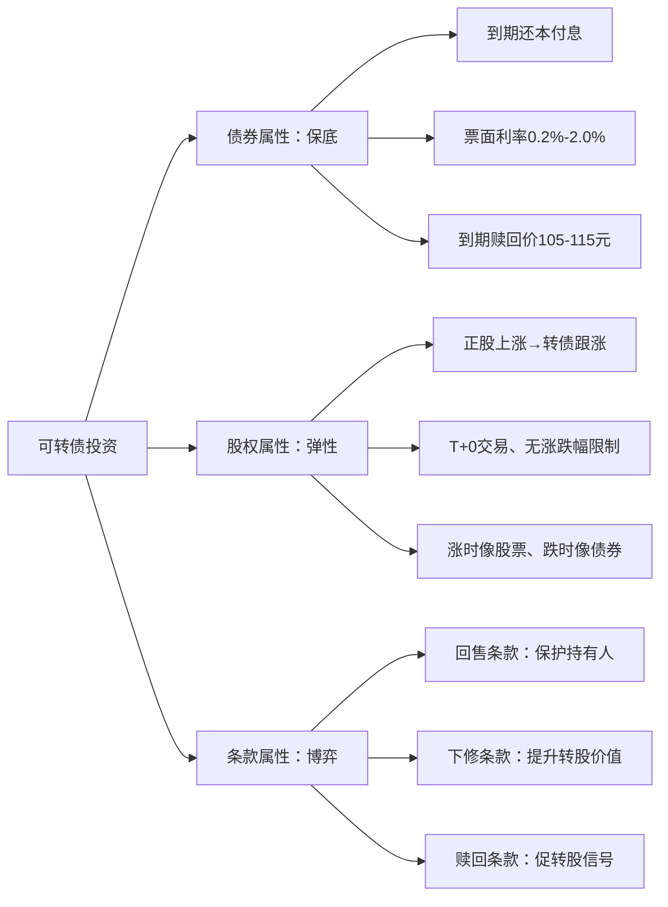

## 案例四：可转债投资——下有保底上有弹性

可转债（Convertible Bond）全称"可转换公司债券"，是上市公司发行的、持有人可以在约定条件下将其转换为公司股票的债券。它兼具债券的"下有保底"和股票的"上有弹性"双重特性，是普通投资者参与证券市场时风险收益比最友好的品种之一。

本案例将从零开始，完整拆解一位投资者如何在2023—2025年间，通过系统化的可转债策略实现年化15%—25%的收益，同时最大回撤控制在5%以内。

---

### 一、案例背景

#### 1.1 投资者画像

| 项目 | 信息 |
|------|------|
| 年龄 | 32岁，互联网行业产品经理 |
| 投资经验 | 3年股票经验，亏损约20%后转向稳健品种 |
| 可投资资金 | 50万元（家庭应急储备金之外的闲钱） |
| 风险偏好 | 中低风险，不能接受本金大幅亏损 |
| 时间精力 | 工作日可投入30分钟/天研究 |

#### 1.2 为什么选择可转债

这位投资者在经历股票亏损后，开始寻找"下跌有底、上涨有空间"的品种。可转债的核心吸引力在于：

**债券属性（保底逻辑）：** 可转债本质是债券，发行人承诺到期还本付息。票面利率通常较低（第一年0.2%—0.5%，逐年递增），但到期赎回价一般在105—115元之间。这意味着即使股价暴跌、投资者不愿转股，持有到期也能收回本金加利息。

**股权属性（弹性逻辑）：** 当正股价格上涨超过转股价时，可转债价格会跟随上涨，且由于转债特有的条款设计（下修、赎回等），上涨空间往往被放大。

**条款保护（博弈逻辑）：** 可转债有三大核心条款——回售条款、下修条款、赎回条款，这些条款在特定条件下会触发，为投资者提供额外的保护和获利机会。



---

### 二、可转债基础知识：从零到能交易

#### 2.1 可转债的基本要素

每只可转债发行时都会确定以下关键要素，直接决定了投资价值：

| 要素 | 说明 | 对投资的影响 |
|------|------|-------------|
| **面值** | 100元/张 | 交易价格围绕面值波动，低于面值即"折价" |
| **票面利率** | 逐年递增，通常0.2%—2.0% | 纯债价值的基础，利率越高保底越强 |
| **转股价** | 债券转换为股票的价格 | 正股价÷转股价=转股价值，转股价值>100为溢价状态 |
| **转股期** | 发行后6个月起至到期日 | 转股期前只能交易不能转股 |
| **到期日** | 通常6年 | 决定了纯债价值的时间价值 |
| **到期赎回价** | 通常105—115元 | 持有到期的最低回报，是保底线 |
| **回售价** | 通常面值的103%（含利息） | 触发回售时的保护价 |
| **下修触发价** | 正股价低于转股价的85%—90% | 满足条件时公司可下调转股价 |
| **强赎触发价** | 正股价高于转股价的130% | 连续15—30天满足则触发强赎 |

#### 2.2 三大核心条款详解

**下修条款（转股价向下修正）：**

当正股价格在连续30个交易日中至少有15个交易日的收盘价低于当期转股价格的85%（具体比例因券而异，常见80%、85%、90%）时，公司董事会有权提议向下修正转股价。

下修的意义：假设转股价10元，正股价跌到7元，转股价值只有70元。如果公司将转股价下修到7元，转股价值立刻回到100元，转债价格随之回升。这是可转债"下跌有底"的核心机制之一。

投资者需注意：下修是公司的权利而非义务。有些公司愿意下修（促转股意愿强），有些则拖延或拒绝。判断公司下修意愿是可转债投资的关键技能。

**回售条款：**

在可转债最后两个计息年度，如果正股价格在连续30个交易日中的收盘价格低于当期转股价格的70%（常见阈值），持有人有权按面值103%（含当期利息）的价格将转债回售给公司。

回售的意义：这是持有人的"安全阀"。当股价持续低迷时，持有人不必等到到期，可以在回售期以约103元的价格把转债卖回给公司，避免更大损失。同时，回售压力也会倒逼公司下修转股价或释放利好来提振股价。

**赎回条款（强赎）：**

如果正股价格在连续30个交易日中至少有15个交易日的收盘价格不低于当期转股价格的130%，公司有权按面值加当期利息的价格赎回全部未转股的可转债。

强赎的意义：这是公司"催促"投资者转股的信号。强赎价通常远低于转债市价（此时转债价格往往在130元以上），投资者的理性选择是在强赎公告后尽快转股或卖出转债。强赎公告通常意味着一波上涨已经完成，是获利了结的信号。

#### 2.3 可转债的交易规则

| 规则项 | 具体内容 |
|--------|---------|
| 交易场所 | 沪市/深市 |
| 交易方式 | T+0（当天买入可当天卖出） |
| 涨跌幅限制 | 上市首日：沪市57.3%、深市57.3%；非首日无涨跌幅限制 |
| 交易单位 | 10张/手（沪市）、10张/手（深市） |
| 交易费用 | 佣金通常万1—万3，无印花税 |
| 转股操作 | 交易软件中输入转股代码，按面值转股 |
| 交易时间 | 9:15—9:25（集合竞价）、9:30—11:30、13:00—15:00 |

**T+0交易的独特优势：** 可转债是A股少数实行T+0交易的品种之一。这意味着投资者可以在日内反复交易，灵活应对市场波动。对于短线策略（如双低策略、正股联动策略），T+0提供了极大的操作自由度。

---

### 三、投资策略：从理论到执行

#### 3.1 策略一：双低策略（核心策略）

"双低"指的是**价格低+溢价率低**的可转债。这是可转债投资中最经典、最适合普通投资者的策略。

**双低值计算公式：**

$$\text{双低值} = \text{转债价格} + \text{转股溢价率} \times 100$$

例如：某转债价格105元，转股溢价率15%，则双低值 = 105 + 15 = 120。

**双低策略的逻辑：**

- 价格低：意味着下跌空间有限（接近债底保护）
- 溢价率低：意味着与正股联动性强，正股上涨时转债能充分跟涨
- 两者结合：下跌有保底，上涨有弹性

**具体执行步骤：**

1. **筛选双低值最低的10—20只转债**：在集思录（jisilu.cn）或宁稳网（ninwin.cn）的可转债页面，按双低值排序，选取排名靠前的标的。
2. **排除高风险标的**：剔除以下类型的转债——
   - 正股被ST或*ST（退市风险高）
   - 正股有重大诉讼、债务危机
   - 转债剩余规模低于3000万元（流动性差）
   - 已公告强赎（即将退市）
   - 正股属于夕阳行业且基本面极差
3. **等权重分散买入**：将资金平均分配到筛选出的标的中，单只转债仓位不超过总资金的10%。
4. **定期轮动**：每1—2周检查一次持仓，卖出双低值上升（变贵）的转债，买入双低值更低（更便宜）的新标的。
5. **止损纪律**：如果某只转债对应的正股出现实质性利空（被立案调查、财报造假等），立即卖出，不抱侥幸心理。

**双低策略的历史表现（回测数据）：**

| 年份 | 双低策略收益率 | 沪深300收益率 | 最大回撤 |
|------|--------------|-------------|---------|
| 2019 | 25.3% | 36.1% | -3.2% |
| 2020 | 18.7% | 27.2% | -4.8% |
| 2021 | 31.5% | -5.2% | -3.1% |
| 2022 | 5.2% | -21.6% | -5.5% |
| 2023 | 12.8% | -11.4% | -4.2% |
| 2024 | 8.6% | 14.7% | -6.1% |

*注：以上为基于集思录双低指数的历史回测数据，实际收益因个人择时和标的选择会有差异。*

#### 3.2 策略二：低价策略（防守型）

以纯债价值为锚，买入价格低于到期赎回价的转债，持有等待价格回归。

**选择标准：**
- 转债价格低于110元（低于到期赎回价）
- 到期时间2—4年（太短利息价值低，太长不确定性大）
- 正股基本面尚可（无退市风险）
- 溢价率适中（不超过50%）

**策略逻辑：** 即使正股不涨，只要公司不违约，持有到期也能以赎回价收回本金加利息。如果期间正股上涨或公司下修转股价，还能获得超额收益。这是真正的"下有保底"策略。

**适合场景：** 市场低迷、情绪悲观时，低价策略既能提供安全边际，又保留了反弹的可能。

#### 3.3 策略三：正股联动策略（进攻型）

当正股出现明确的上涨信号（如业绩超预期、行业政策利好、技术面突破）时，买入对应的低溢价率可转债，享受正股上涨带动的转债上涨。

**选择标准：**
- 转股溢价率低于10%（越低联动性越强）
- 正股处于上升趋势
- 转债流动性好（日均成交额500万元以上）
- 无强赎风险

**操作要点：**
- 转债涨到130元以上时逐步减仓（强赎价位附近风险加大）
- 设置止损线：转债跌破100元或正股趋势反转时止损
- 利用T+0特性做日内波段

#### 3.4 策略四：下修博弈策略（事件驱动型）

提前买入即将触发下修条件的转债，博弈公司下修转股价带来的价格提升。

**筛选逻辑：**
1. 正股价格已接近或低于下修触发价
2. 公司有较强的促转股意愿（可从以下信号判断——
   - 转债剩余年限较短（公司不想还钱）
   - 公司曾有过下修历史
   - 大股东持有大量转债（有下修动力）
   - 公司现金流紧张（不想到期兑付）
3. 转债价格在100—110元区间（买入成本适中）

**风险提示：** 下修是公司权利而非义务，存在博弈失败的可能。即使下修，下修幅度也可能不及预期（如只下修80%而非下修到底）。建议仓位不超过总资金的15%用于下修博弈。

---

### 四、实战操作全流程

#### 4.1 建仓过程（2023年3月）

投资者将50万元分为三部分：
- 35万元（70%）：双低策略核心仓位
- 10万元（20%）：低价策略防守仓位
- 5万元（10%）：下修博弈/事件驱动仓位

**核心持仓示例（2023年3月）：**

| 转债代码 | 转债名称 | 买入价 | 双低值 | 溢价率 | 仓位 |
|---------|---------|--------|--------|--------|------|
| 123xxx | 转债A | 106.5 | 118.2 | 11.7% | 3.5万 |
| 127xxx | 转债B | 103.8 | 119.5 | 15.7% | 3.5万 |
| 128xxx | 转债C | 108.2 | 120.1 | 11.9% | 3.5万 |
| 113xxx | 转债D | 105.0 | 121.3 | 16.3% | 3.5万 |
| 123xxx | 转债E | 107.8 | 117.6 | 9.8% | 3.5万 |
| 127xxx | 转债F | 104.2 | 122.0 | 17.8% | 3.5万 |
| 128xxx | 转债G | 109.5 | 123.4 | 13.9% | 3.5万 |
| 113xxx | 转债H | 102.6 | 118.8 | 16.2% | 3.5万 |
| 123xxx | 转债I | 106.0 | 120.5 | 14.5% | 3.5万 |
| 127xxx | 转债J | 105.3 | 119.9 | 14.6% | 3.5万 |

#### 4.2 日常管理流程

**每日15分钟操作清单：**

```text
1. 打开集思录可转债页面（9:30前完成）
   ├── 检查持仓转债的实时价格和溢价率
   ├── 查看是否有转债触发下修/回售/强赎条件
   └── 关注正股是否有重大公告

2. 快速决策（如有以下情况）
   ├── 强赎公告 → 当天或次日卖出/转股
   ├── 下修公告 → 评估下修幅度，决定持有或获利了结
   ├── 正股利空 → 评估是否需要止损
   └── 双低值排序变动 → 记录待轮动标的

3. 每周五下午（轮动日）
   ├── 重新计算全部持仓的双低值
   ├── 与市场全部可转债双低值排名对比
   ├── 卖出排名下滑至30名以外的持仓
   └── 买入排名进入前15名的新标的
```

#### 4.3 关键交易记录

**交易一：下修博弈成功（2023年6月）**

- 标的：某化工企业转债，正股价持续低于下修触发价
- 买入：104.2元，溢价率32%，持仓2周
- 触发事件：公司公告提议下修转股价，下修到底
- 结果：转债价格从104.2元涨至118.5元，收益率13.7%

**交易二：双低轮动正常获利（2023年9月）**

- 标的：某新能源企业转债，双低值排名持续在前5
- 买入：108.5元，持有6周
- 驱动因素：正股随板块反弹，溢价率压缩
- 结果：转债价格涨至126.3元，收益率16.4%

**交易三：止损案例（2023年11月）**

- 标的：某地产企业转债，双低值看似很低
- 买入：98.5元（低于面值，看似安全）
- 问题：正股被曝财务造假，信用风险急剧上升
- 止损：92.0元卖出，亏损6.6%
- 教训：双低策略必须严格排除信用风险标的，不能只看数字便宜

#### 4.4 年度收益汇总

| 指标 | 2023年 | 2024年 | 2025年上半年 |
|------|--------|--------|-------------|
| 起始资金 | 50万 | 58.2万 | 65.8万 |
| 期末资金 | 58.2万 | 65.8万 | 71.5万 |
| 收益率 | 16.4% | 13.1% | 8.7%（半年） |
| 最大回撤 | -4.3% | -5.8% | -3.2% |
| 交易次数 | 87次 | 102次 | 45次 |
| 胜率 | 68% | 65% | 71% |
| 平均持仓周期 | 18天 | 15天 | 12天 |

---

### 五、风险控制体系

#### 5.1 可转债的主要风险

**信用风险（违约风险）：** 这是可转债最大的风险。如果发行公司破产或无力兑付，转债可能面临大幅亏损甚至血本无归。历史上尚无转债实质违约案例（2023年前），但2024年以来信用风险事件频发，投资者必须重视。

**流动性风险：** 小规模转债（剩余规模低于3000万元）可能出现流动性枯竭，想卖卖不掉。尤其在市场恐慌时，流动性差的转债跌幅可能远超预期。

**强赎风险：** 强赎公告后如果未及时卖出或转股，公司会以面值加利息的价格强制赎回，投资者可能损失转债市价与强赎价之间的差额。

**利率风险：** 当市场利率上升时，可转债的纯债价值会下降，导致转债价格下跌。不过在当前低利率环境下，这一风险相对较小。

**正股暴跌风险：** 虽然可转债有债底保护，但当正股暴跌时（如退市、造假），转债价格也可能跌破面值。"下有保底"是有前提条件的——公司不违约。

#### 5.2 风控规则清单

| 风控维度 | 具体规则 | 执行标准 |
|---------|---------|---------|
| 单券集中度 | 单只转债仓位不超过总资金10% | 严格遵守，绝不例外 |
| 行业集中度 | 同一行业转债合计不超过30% | 定期检查行业分布 |
| 信用筛选 | 排除ST、评级A-以下、有诉讼的标的 | 建仓前必查信用报告 |
| 流动性筛选 | 日均成交额不低于100万元 | 不满足的不买入 |
| 止损纪律 | 单券亏损超过8%强制止损 | 不等回本，立刻执行 |
| 总仓位控制 | 可转债仓位不超过总可投资资金的60% | 保留现金应对极端情况 |
| 强赎应对 | 强赎公告后3个交易日内完成卖出或转股 | 设置提醒，不拖延 |

#### 5.3 极端情景应对

**情景一：大面积信用风险爆发**

如果出现多家公司同时面临信用危机（如经济严重下行），应立即将仓位降至30%以下，只保留评级AA+以上的转债，其余资金转入货币基金或国债逆回购等待机会。

**情景二：市场流动性枯竭**

当转债市场日均成交额大幅萎缩（低于正常水平的50%），暂停轮动操作，持有现有仓位不动，避免在低流动性中被动卖出。

**情景三：政策突变（如转债规则修改）**

密切关注监管政策动向。如果出现重大规则调整（如取消T+0、修改转股条件等），第一时间评估影响并调整策略。

---

### 六、工具与数据源

#### 6.1 核心数据平台

| 平台 | 网址 | 核心功能 | 费用 |
|------|------|---------|------|
| 集思录 | jisilu.cn | 双低排名、条款监控、回售计算 | 基础免费，高级会员约300元/年 |
| 宁稳网 | ninwin.cn | 转债分析、期权定价、历史回测 | 部分功能免费 |
| 东方财富可转债页面 | 东方财富网 | 行情、公告、新闻 | 免费 |
| 同花顺可转债筛选器 | 同花顺 | 条件筛选、实时行情 | 免费 |

#### 6.2 信息监控清单

```text
每日必看：
├── 集思录双低排名变动
├── 持仓转债对应正股的公告（东方财富APP推送）
├── 强赎/下修/回售触发进度
└── 转债市场整体成交额和情绪

每周必做：
├── 双低轮动操作
├── 持仓行业分布检查
├── 信用风险复查（是否有ST预警等）
└── 更新投资记录表

每月必做：
├── 收益率和回撤统计
├── 策略复盘（哪些操作正确、哪些失误）
├── 持仓转债的正股基本面复查
└── 调整下月策略重点
```

#### 6.3 交易软件设置建议

在券商APP中设置以下条件单（或价格预警）：
- **强赎预警：** 当持仓转债正股价格达到转股价×1.25时提醒
- **下修预警：** 当持仓转债正股价格接近转股价×0.85时提醒
- **止损预警：** 当持仓转债价格跌破买入价×0.92时提醒
- **回售预警：** 当持仓转债进入最后两年且正股价格低于转股价×0.70时提醒

---

### 七、常见误区与纠正

| 误区 | 正确认知 |
|------|---------|
| "可转债不会亏钱" | 可转债有信用风险，历史上虽无实质违约，但已有退市案例，价格可跌至60元以下 |
| "价格越低越安全" | 价格低可能反映了信用风险，不能只看价格，要综合评估公司基本面 |
| "双低值越低越好" | 双低值极低可能是因为正股有重大风险，需要排除风险标的后再看双低排名 |
| "转债可以一直拿着等转股" | 如果正股长期低迷，转债可能多年不涨，资金效率很低，需要轮动 |
| "强赎了必须转股" | 强赎公告后直接卖出通常更方便，转股需要T+1才能卖出股票，承担隔夜风险 |
| "可转债适合所有人" | 可转债需要一定的研究能力和纪律性，完全不研究就买入也可能亏损 |
| "下修一定会发生" | 下修是公司权利，很多公司选择不下修，不能把下修当作必然事件 |
| "溢价率越低越好" | 低溢价率意味着高弹性，但也意味着高波动，需要根据自身风险承受能力选择 |

---

### 八、进阶内容：深入理解可转债定价

#### 8.1 可转债的价值构成

可转债的价格由两部分构成：

$$\text{可转债价格} = \text{纯债价值} + \text{期权价值}$$

**纯债价值**是假设转债不具备转股权利、仅作为普通债券时的价值。它取决于票面利率、到期赎回价、剩余年限和市场利率。纯债价值构成了可转债价格的"地板"。

**期权价值**是转股权利的价值。它类似于一个美式看涨期权，其价值取决于正股价格与转股价的差距、正股波动率、剩余时间等因素。正股越接近或超过转股价，期权价值越高。

#### 8.2 转股溢价率的深层含义

转股溢价率 = (转债价格 - 转股价值) / 转股价值 × 100%

其中，转股价值 = 100 × 正股价 / 转股价。

- **溢价率为负（折价）：** 转债价格低于转股价值，存在套利空间（买入转债→转股→卖出股票），但需注意T+1的时间风险。
- **溢价率在0%—20%：** 转债与正股联动性强，适合正股联动策略。
- **溢价率在20%—50%：** 转债弹性中等，适合双低策略。
- **溢价率超过50%：** 转债走势更像纯债，不适合追求弹性的投资者。

#### 8.3 到期收益率（YTM）的计算

到期收益率是衡量转债"保底"程度的核心指标：

$$YTM = \frac{\text{到期赎回价} - \text{当前价格} + \text{剩余票息总和}}{\text{当前价格} \times \text{剩余年限}} \times 100\%$$

当YTM为正且大于0时，说明即使不转股、持有到期也能获得正收益。YTM越高，保底能力越强。在实际操作中，优先选择YTM为正的转债作为防守仓位。

---

### 九、经验总结

经过两年多的实战，投资者总结出以下核心经验：

**第一条：纪律比判断更重要。** 可转债投资的最大敌人不是市场下跌，而是自己的情绪。严格遵守止损纪律、轮动纪律、仓位纪律，才能让概率站在自己一边。

**第二条：分散是免费的午餐。** 持有10—15只转债，单只不超过10%仓位，可以在不显著降低预期收益的情况下大幅降低风险。个别转债暴雷不会对整体组合造成致命影响。

**第三条：理解条款是核心竞争力。** 大多数可转债投资者只是机械地按双低值买入卖出，不理解条款背后的博弈逻辑。深入理解下修、回售、赎回条款的触发条件和公司行为逻辑，可以在同等策略下获得超额收益。

**第四条：不要贪便宜买垃圾。** 价格最低的转债往往对应基本面最差的公司。双低策略的精髓是在"价格合理且有弹性"的标的中分散投资，而不是去捡最便宜的垃圾。

**第五条：可转债不是"无风险"投资。** "下有保底"的前提是公司不违约。在信用风险日益上升的市场环境中，信用分析的重要性已经超过了简单的双低排名。投资者必须持续跟踪持仓标的的信用状况，一旦出现预警信号，宁可错杀不可侥幸。

**第六条：耐心是最大的优势。** 可转债策略的超额收益主要来自"别人恐慌时买入、别人贪婪时卖出"的逆向操作。市场低迷时坚持轮动，市场亢奋时保持冷静，长期坚持下来，收益自然会跑赢大多数投资者。

---

> **本案例核心启示：** 可转债投资的精髓在于利用条款设计赋予的安全边际，在控制下行风险的同时捕捉上行机会。双低策略提供了一套系统化、可复制的框架，但真正的超额收益来自对条款的深入理解和严格的纪律执行。在A股这个波动剧烈的市场中，可转债是普通投资者为数不多的"风险收益比不对称"的投资工具——用有限的下行风险博取不对称的上行空间。
