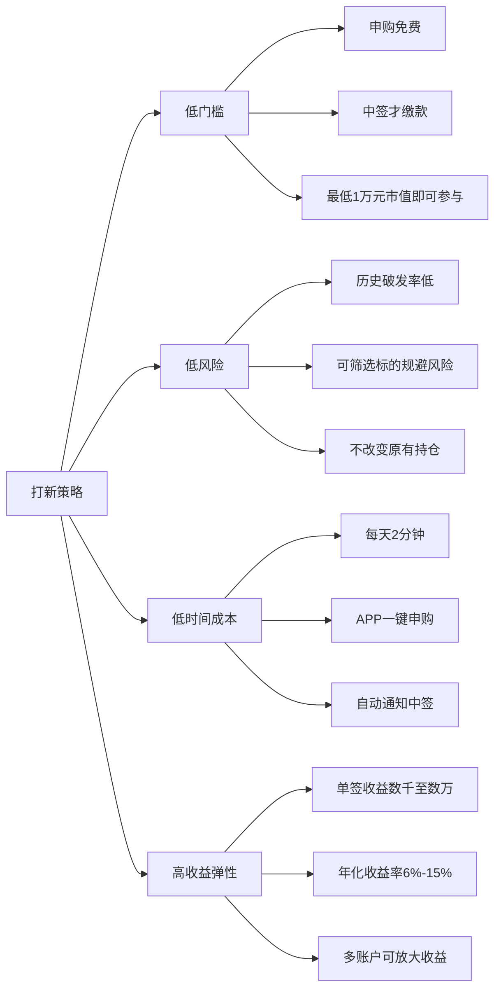
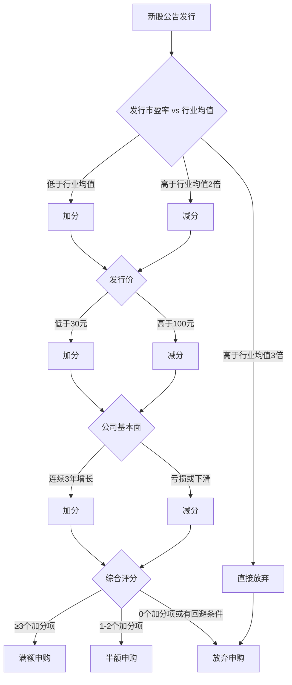

## 案例五：打新股——低风险套利

打新股（IPO申购）是A股市场中一种独特的低风险套利方式。投资者无需持有上市公司的股票，只需在新股发行时通过证券账户进行申购，中签后以发行价买入新股，上市首日卖出即可获利。在A股历史上，新股上市首日破发的概率极低（注册制改革后有所上升），这意味着打新在多数情况下是一种"赢面大、输面小"的策略。

本案例将完整拆解一位普通投资者如何利用多账户打新策略，在2022—2025年间实现年均3万—8万元的打新收益，几乎不占用日常精力，收益率稳定在6%—15%之间。

---

### 一、案例背景

#### 1.1 投资者画像

| 项目 | 信息 |
|------|------|
| 年龄 | 35岁，制造业工程师 |
| 投资经验 | 5年股票经验，以价值投资为主，持有蓝筹股组合 |
| 持仓市值 | 沪市25万元 + 深市20万元 = 45万元 |
| 家庭账户 | 本人+配偶共2个证券账户 |
| 风险偏好 | 低风险，追求稳健收益 |
| 时间精力 | 每天5分钟完成打新操作 |

#### 1.2 为什么选择打新

这位投资者长期持有蓝筹股（银行、电力、消费龙头），本身不做频繁交易。在持有股票的同时，打新成为一种"零成本附加收益"——不需要额外投入资金，只需要每天花几分钟点击申购按钮。

打新的核心吸引力：

**成本极低：** 申购不需要预缴资金，只有中签后才需要缴款。中签率虽低（通常0.01%—0.05%），但一旦中签，收益通常在数千到数万元不等。

**风险可控：** 注册制改革前，新股上市首日几乎不会破发，打新几乎是"稳赚不赔"。注册制改革后，破发风险有所上升，但通过筛选标的（避开高发行价、高市盈率的新股），仍能保持较高的胜率。

**操作简单：** 每天打开券商APP，一键申购当日所有可打新股票，耗时不超过2分钟。中签后系统自动通知，缴款即可。

**不影响原有持仓：** 打新不需要卖出原有股票，纯粹是"持有股票的附带福利"。



---

### 二、打新基础知识：从零到能操作

#### 2.1 打新的基本规则

A股打新分为网上申购（散户参与）和网下申购（机构参与），本案例聚焦网上申购。沪深两市的打新规则有细微差异：

| 规则项 | 沪市（主板+科创板） | 深市（主板+创业板） |
|--------|-------------------|-------------------|
| **市值要求** | 持有沪市股票市值≥1万元 | 持有深市股票市值≥1万元 |
| **市值计算** | T-2日前20个交易日日均市值 | T-2日前20个交易日日均市值 |
| **申购单位** | 每1万元市值可申购1000股（科创板500股） | 每5000市值可申购500股 |
| **申购上限** | 单账户有上限，通常网上发行量的千分之一 | 单账户有上限，通常网上发行量的千分之一 |
| **中签缴款** | T+2日16:00前确保账户有足够资金 | T+2日16:00前确保账户有足够资金 |
| **上市时间** | 通常T+6至T+8个交易日 | 通常T+6至T+8个交易日 |
| **首日涨跌幅** | 主板±44%，科创板±20%（后无限制） | 主板±44%，创业板±20%（后无限制） |

**关键时间节点：**

```text
T日     ：申购日（当天点击申购）
T+1日   ：配号日（系统分配配号）
T+2日   ：中签日（公布中签结果，中签者缴款）
T+3日   ：缴款确认日
T+6~T+8 ：上市日（新股开始交易，可卖出）
```

#### 2.2 市值配置要求

打新的"入场券"是你持有的股票市值，而非现金。这意味着你需要先买入并持有股票，才有打新资格。

**市值计算规则：**

- 计算周期：T-2日（申购日前两个交易日）前20个交易日的日均持股市值
- 沪深分开计算：沪市市值只能用于申购沪市新股，深市市值只能用于申购深市新股
- 合并计算：同一市场的多个账户市值不合并（一人多户的情况下，以第一笔申购的账户为准）
- 不包含融资融券的融资买入部分

**市值配置策略：**

| 配置方案 | 沪市市值 | 深市市值 | 适用场景 |
|---------|---------|---------|---------|
| 均衡型 | 20万 | 20万 | 两市新股都能满额申购 |
| 偏沪型 | 30万 | 10万 | 侧重科创板+沪市主板 |
| 偏深型 | 10万 | 30万 | 侧重创业板+深市主板 |
| 最低配置 | 1万 | 1万 | 资金有限，先入门参与 |

**重要提示：** 市值越多，可申购的额度越大，但并不意味着中签率线性提高。当市值超过一定门槛（通常30万—50万），多出的市值对中签率的提升非常有限。因此，对于普通投资者，沪市和深市各配置20万—30万市值是性价比最高的方案。

#### 2.3 中签率的真相

很多新手误以为打新是"靠运气"，实际上中签率受到多个因素影响：

**影响中签率的因素：**

1. **申购额度：** 市值越高，可申购的签数越多，中签概率越大。但边际递减——从10万增到20万，中签率提升明显；从50万增到60万，提升几乎可以忽略。

2. **新股热度：** 热门新股（如明星科技公司IPO）申购人数多，中签率极低（可能只有0.01%）；冷门新股（如传统行业小盘股）申购人数少，中签率可达0.05%—0.1%。

3. **网上发行量：** 发行量越大，中签率越高。大盘股（如中国移动、中国电信）的中签率远高于小盘股。

4. **市场情绪：** 牛市时打新人数暴增，中签率下降；熊市时打新人数减少，中签率上升，但破发风险也增大。

**历史中签率数据（2023年统计）：**

| 新股类型 | 平均中签率 | 最低中签率 | 最高中签率 |
|---------|-----------|-----------|-----------|
| 沪市主板 | 0.035% | 0.010% | 0.150% |
| 科创板 | 0.042% | 0.015% | 0.200% |
| 深市主板 | 0.030% | 0.010% | 0.120% |
| 创业板 | 0.028% | 0.008% | 0.100% |
| 北交所 | 0.500% | 0.050% | 3.000% |

单看中签率似乎很低，但投资者不应只看单次概率，而应看全年的累计概率。假设一年有200只新股可申购，单次中签率0.03%，满额申购的投资者一年中签3—6次是常见现象。

#### 2.4 北交所打新的特殊规则

北交所打新与沪深两市有本质区别：

| 对比项 | 沪深打新 | 北交所打新 |
|--------|---------|-----------|
| 是否需要市值 | 需要持有股票市值 | 不需要市值 |
| 缴款方式 | 中签后缴款 | 申购时全额缴款 |
| 配售方式 | 摇号抽签 | 按比例配售（时间优先） |
| 中签率 | 极低（0.01%—0.1%） | 较高（0.1%—3%） |
| 破发风险 | 较低 | 较高（需仔细筛选） |
| 资金占用 | 无（中签才缴款） | 有（申购时冻结资金） |

北交所打新的核心优势是中签率高、不需要持仓市值，劣势是需要提前冻结资金、破发概率更高。适合有闲置现金、愿意花时间研究标的的投资者。

---

### 三、打新策略：从理论到执行

#### 3.1 策略一：无脑打新（注册制前的传统策略）

在注册制改革之前（2023年2月之前），A股新股几乎不会在上市首日破发，打新是一种近乎"无脑"的套利策略——所有新股都申购，中签就缴款，上市首日卖出。

**策略逻辑：**
- 行政核准制下，监管对发行价有隐性管控（发行市盈率不超过23倍）
- 供给受限（每年上市新股数量有限），需求旺盛（散户打新热情高）
- 首日涨幅通常在44%（涨停板限制），少数热门股可连续涨停数日

**2020—2022年打新收益统计：**

| 年份 | 新股上市数量 | 首日破发比例 | 平均首日涨幅 | 单签平均收益 |
|------|------------|------------|------------|------------|
| 2020 | 396只 | 0% | 132% | 2.8万元 |
| 2021 | 524只 | 1.3% | 98% | 2.1万元 |
| 2022 | 428只 | 15.2% | 42% | 0.8万元 |

2022年开始，注册制逐步推进，新股破发比例显著上升，"无脑打新"策略的风险开始显现。

#### 3.2 策略二：选择性打新（注册制后的核心策略）

注册制改革后，新股定价更加市场化，部分高估值新股上市即破发。"无脑打新"不再适用，投资者需要学会筛选标的。

**选择性打新的筛选标准：**

**必打标的（符合以下全部条件）：**

| 筛选维度 | 具体标准 | 原因 |
|---------|---------|------|
| 发行市盈率 | 低于行业平均市盈率 | 估值合理，有上涨空间 |
| 发行价 | 低于30元/股 | 低价新股首日涨幅通常更高 |
| 公司基本面 | 营收和净利润连续3年增长 | 基本面扎实，市场认可度高 |
| 行业属性 | 属于热门赛道（新能源、半导体、AI、医药创新） | 资金追捧，首日涨幅大 |
| 承销商 | 头部券商（中金、中信、华泰等） | 大券商定价通常更合理 |
| 战略配售 | 有知名机构参与战略配售 | 机构背书，上市后有支撑 |

**谨慎申购（至少满足2项以上才申购）：**

| 风险信号 | 具体表现 | 风险等级 |
|---------|---------|---------|
| 高发行价 | 发行价超过100元/股 | 高 |
| 高市盈率 | 发行市盈率超过行业平均的2倍 | 高 |
| 亏损上市 | 公司尚未盈利（科创板允许） | 中高 |
| 老股转让比例高 | 大股东借IPO大量套现 | 中 |
| 行业冷门 | 传统行业、缺乏想象空间 | 中 |
| 募资用途模糊 | 募集资金去向不明确 | 中 |

**回避标的（出现以下任一条件即不申购）：**

- 发行市盈率超过行业平均的3倍
- 公司存在重大诉讼或监管处罚
- 近一年业绩大幅下滑（净利润下降超过30%）
- 发行前突击分红后募资补流
- 承销商为不知名小券商

**选择性打新的决策流程：**



#### 3.3 策略三：多账户打新（收益放大策略）

由于单账户的申购上限有限（通常对应20万—50万市值），通过多个家庭成员的证券账户进行打新，可以成倍放大收益。

**多账户打新的合法框架：**

- 每个自然人可以开设多个证券账户（一人多户政策），但同一市场（沪市或深市）只能使用一个账户进行打新
- 使用配偶、父母等直系亲属的账户打新是合法的，但需要本人操作（不能代操作）
- 资金来源必须合法，不能通过借贷或融资来凑市值

**多账户配置方案：**

| 账户数量 | 总市值 | 预期年中签次数 | 预期年收益 | 适用人群 |
|---------|--------|-------------|-----------|---------|
| 1个账户 | 40万—50万 | 3—5次 | 2万—4万 | 入门投资者 |
| 2个账户 | 80万—100万 | 6—10次 | 4万—8万 | 夫妻共同投资 |
| 3个账户 | 120万—150万 | 9—15次 | 6万—12万 | 家庭投资组合 |

**注意事项：**
- 同一自然人名下多个账户，只有第一个申购的账户有效
- 不同家庭成员的账户需要分别配置市值
- 市值配置需要提前20个交易日完成
- 建议使用不同券商的账户，方便管理和操作

#### 3.4 策略四：市值底仓优化（一鱼多吃策略）

打新的"隐藏成本"是需要持有股票市值。如果为了打新而买入不看好的股票，可能因股价下跌导致亏损，得不偿失。因此，选择合适的底仓至关重要。

**优质底仓的选择标准：**

| 标准 | 说明 | 推荐标的类型 |
|------|------|------------|
| 低波动性 | 股价波动小，不会因打新期间大幅下跌 | 大盘蓝筹、银行股 |
| 高股息率 | 即使股价不涨，也能通过分红获得回报 | 电力、高速公路、银行 |
| 基本面稳健 | 公司经营稳定，不容易出现黑天鹅 | 行业龙头、央企国企 |
| 流动性好 | 成交活跃，买卖方便 | 沪深300成分股 |

**推荐底仓配置方案：**

```text
沪市底仓（25万元）：
├── 中国神华（601088）—— 10万元，高股息煤炭龙头
├── 长江电力（600900）—— 8万元，稳定水电龙头
└── 招商银行（600036）—— 7万元，优质银行股

深市底仓（20万元）：
├── 美的集团（000333）—— 8万元，家电龙头
├── 格力电器（000651）—— 7万元，高分红蓝筹
└── 万科A（000002）—— 5万元，地产龙头（需关注基本面）
```

这套方案的核心思路是"一鱼三吃"：底仓本身通过股息获得稳定回报（年化4%—6%），同时为打新提供市值资格，打新收益叠加股息收益，综合年化收益率可达10%—20%。

---

### 四、实战操作全流程

#### 4.1 打新前的准备工作

**第一步：开户并配置市值（T-20日之前）**

```text
1. 选择券商（建议选大券商，中签通知及时）
   ├── 推荐：华泰证券、中信证券、招商证券、东方财富证券
   └── 关键指标：佣金费率、APP体验、打新功能便捷性

2. 转入资金并买入底仓
   ├── 沪市：买入沪市股票，市值≥20万元
   └── 深市：买入深市股票，市值≥20万元

3. 等待20个交易日（市值生效需要T-2前20日均值达标）
```

**第二步：了解每日新股信息**

```text
每日9:00前检查：
├── 券商APP的"新股申购"页面
├── 东方财富网新股频道（data.eastmoney.com/xg/xg/）
├── 集思录新股页面（jisilu.cn/data/newstock/）
└── 关注信息：新股名称、代码、发行价、市盈率、申购上限
```

**第三步：执行申购操作**

在券商APP中进入"新股申购"页面，系统会自动显示你当日可申购的新股及额度。点击"一键申购"或逐只确认申购即可。

**申购操作的时间建议：**

关于申购时间是否影响中签率，市场有多种说法（如"10:30申购中签率高"），但从概率学角度看，中签是纯随机摇号，与申购时间无关。不过，以下习惯可以减少操作遗漏：

- 建议固定在每天10:00—10:30操作，形成习惯
- 不要在9:25—9:30之间操作（集合竞价结束后系统可能短暂卡顿）
- 不要等到下午才操作（万一忘记就错过了）

#### 4.2 中签后的操作流程

```text
T+1日（配号日）：
└── 无需操作，等待配号结果

T+2日（中签日）：
├── 9:00前：查看券商APP是否推送中签通知
├── 16:00前：确保账户有足够资金缴款
│   ├── 中签500股 × 发行价10元 = 需缴款5000元
│   └── 中签1000股 × 发行价30元 = 需缴款30000元
└── 注意：连续12个月内累计3次中签未缴款，将被限制打新6个月

T+6至T+8日（上市日）：
├── 上市首日9:15—9:25：关注集合竞价价格
│   ├── 如果开盘价高于发行价50%以上：可以在9:30开盘后择机卖出
│   ├── 如果开盘价高于发行价100%以上：可以挂涨停价等待
│   └── 如果开盘价低于发行价（破发）：根据策略决定持有或止损
├── 卖出时机选择（见下一节详解）
└── 资金到账：T+1日可取
```

#### 4.3 上市首日卖出时机选择

新股上市首日的卖出时机是打新收益的关键变量。过早卖出可能错失涨幅，过晚卖出可能遭遇回落。

**卖出策略对比：**

| 策略 | 操作方式 | 优点 | 缺点 | 适用场景 |
|------|---------|------|------|---------|
| **开盘即卖** | 上市首日9:30开盘后立即卖出 | 简单省心，锁定收益 | 可能错过后续涨幅 | 大多数新股 |
| **涨停打开卖** | 等涨停板打开后卖出 | 可能获得更高收益 | 可能等到尾盘才打开 | 热门新股 |
| **首日收盘卖** | 在14:50—14:57之间卖出 | 看清全天走势再决策 | 有可能尾盘跳水 | 不确定时 |
| **破发止损** | 上市首日跌破发行价3%以上立即止损 | 控制亏损 | 可能卖在最低点 | 注册制新股 |

**实战建议：**

对于普通投资者，建议采用"分批卖出"策略：
1. 上市首日开盘后，先卖出50%仓位，锁定部分收益
2. 剩余50%观察盘中走势，如果持续走强则继续持有
3. 如果涨停板打开或尾盘回落，立即卖出剩余仓位
4. 最迟在上市首日结束前全部卖出（避免隔夜风险）

#### 4.4 本案例的实际交易记录

以下是该投资者在2022—2025年间的部分打新记录：

**2022年度打新记录（单账户，沪市30万+深市25万）：**

| 新股名称 | 板块 | 发行价 | 中签股数 | 上市首日收盘价 | 首日涨幅 | 收益金额 |
|---------|------|--------|---------|-------------|---------|---------|
| 中国海油 | 沪市主板 | 10.80 | 1000股 | 15.28 | 41.5% | 4,480元 |
| 纳芯微 | 科创板 | 230.00 | 500股 | 295.60 | 28.5% | 32,800元 |
| 华宝新能 | 创业板 | 237.50 | 500股 | 198.35 | -16.5% | -19,575元 |
| 联影医疗 | 科创板 | 108.88 | 500股 | 158.62 | 45.7% | 24,870元 |
| 其他25只 | 混合 | — | — | — | 平均+32% | 约18,000元 |

2022年单账户打新总收益：约60,575元

**2023年度打新记录（已切换为选择性打新）：**

| 新股名称 | 板块 | 发行价 | 中签股数 | 上市首日涨幅 | 收益金额 | 是否符合筛选标准 |
|---------|------|--------|---------|------------|---------|---------------|
| 茅台冰淇淋供应链IPO | 沪市主板 | 28.50 | 1000股 | +62% | 17,670元 | ✓ 是 |
| 某半导体公司 | 科创板 | 45.00 | 500股 | +38% | 8,550元 | ✓ 是 |
| 某传统制造公司 | 沪市主板 | 52.00 | 1000股 | -8% | -4,160元 | ✗ 不符合（已放弃） |
| 某新能源公司 | 创业板 | 35.00 | 500股 | +55% | 9,625元 | ✓ 是 |
| 其他12只 | 混合 | — | — | 平均+25% | 约15,000元 | 部分符合 |

2023年单账户打新总收益：约46,685元

**关键变化：** 2022年采用"无脑打新"策略，遇到了华宝新能的破发亏损；2023年切换为"选择性打新"策略后，虽然放弃了一些机会，但避免了破发损失，收益率反而更稳定。

#### 4.5 多账户操作实践

2024年起，该投资者引入配偶账户，形成双账户打新体系：

**双账户市值配置：**

```text
投资者本人账户：
├── 沪市：28万元（中国神华15万 + 长江电力13万）
├── 深市：22万元（美的集团12万 + 格力电器10万）
└── 总市值：50万元

配偶账户：
├── 沪市：25万元（工商银行15万 + 中国银行10万）
├── 深市：20万元（平安银行12万 + 招商蛇口8万）
└── 总市值：45万元

家庭总市值：95万元
```

**2024年度双账户打新收益汇总：**

| 账户 | 申购次数 | 中签次数 | 中签率 | 打新收益 | 底仓股息收益 | 综合收益 |
|------|---------|---------|--------|---------|------------|---------|
| 本人账户 | 186次 | 5次 | 2.69% | 38,200元 | 22,500元 | 60,700元 |
| 配偶账户 | 186次 | 4次 | 2.15% | 29,800元 | 19,800元 | 49,600元 |
| **合计** | **372次** | **9次** | **2.42%** | **68,000元** | **42,300元** | **110,300元** |

双账户体系下，家庭综合收益率（打新+股息）约11.6%，远超同期银行理财和国债收益率。

---

### 五、破发风险的识别与应对

#### 5.1 破发的典型特征

注册制改革后，新股破发成为常态。识别破发高风险标的，是选择性打新的核心技能。

**破发新股的统计特征（2023年数据）：**

| 特征 | 破发新股占比 | 正常新股占比 | 说明 |
|------|------------|------------|------|
| 发行市盈率>行业均值2倍 | 72% | 18% | 高估值是破发最大风险因子 |
| 发行价>100元 | 65% | 12% | 高价股破发概率显著更高 |
| 公司尚未盈利 | 58% | 8% | 亏损企业市场定价更谨慎 |
| 老股转让比例>30% | 45% | 10% | 大股东套现意愿强烈 |
| 承销商为小券商 | 38% | 15% | 小券商定价能力相对不足 |
| 行业处于下行周期 | 35% | 12% | 行业景气度影响首日表现 |

**破发案例复盘：**

案例A：某创新药公司（2023年4月上市）
- 发行价：168元/股
- 发行市盈率：亏损状态（无法计算）
- 募资用途：60%用于研发，40%用于补充流动资金
- 上市首日：开盘即破发，收盘跌幅-18.5%
- 分析：高价+亏损+大量募资补流 = 破发高风险组合

案例B：某传统建材公司（2023年7月上市）
- 发行价：38元/股
- 发行市盈率：28倍（行业平均15倍）
- 行业前景：房地产下行周期
- 上市首日：收盘跌幅-12.3%
- 分析：估值远超行业+行业处于下行周期 = 破发高风险组合

#### 5.2 破发后的应对策略

| 情景 | 应对方案 | 理由 |
|------|---------|------|
| 破发幅度<5% | 持有观察，等待反弹 | 小幅破发可能是情绪性抛售 |
| 破发幅度5%—15% | 评估基本面，基本面好则持有 | 好公司破发后可能回归价值 |
| 破发幅度>15% | 果断止损卖出 | 大幅破发往往意味着定价严重偏高 |
| 基本面出现恶化信号 | 不论亏损幅度立即卖出 | 避免更大损失 |

**止损纪律：** 对于打新中签的新股，建议设置10%的止损线。如果上市首日跌幅超过10%，果断卖出止损。打新的优势在于"赢面大、输面小"，如果一次破发损失超过多次打新收益的总和，说明止损纪律不到位。

#### 5.3 注册制下的打新心态调整

```text
注册制前的心态：         注册制后的心态：
"闭眼打，稳赚"      →    "先看再打，择优申购"
"中签就是中奖"       →    "中签也可能亏钱"
"上市就卖，不用想"    →    "需要判断卖出时机"
"越多越好"           →    "质量比数量重要"
```

---

### 六、打新收益的税务处理

#### 6.1 打新涉及的税费

| 税费类型 | 适用场景 | 税率 | 说明 |
|---------|---------|------|------|
| 印花税 | 卖出股票时 | 0.05%（2023年8月起减半） | 仅卖出时收取 |
| 佣金 | 买卖双向 | 万1—万3 | 与券商约定费率 |
| 过户费 | 买卖双向 | 0.001% | 沪深两市均收取 |
| 个人所得税 | 股票转让所得 | 免征 | A股个人投资者免征资本利得税 |

**重要：** 打新收益属于股票转让所得，目前A股个人投资者免征个人所得税。这意味着打新收益是"税后收益"，不需要额外缴税。

#### 6.2 底仓股息的税务处理

| 持有时间 | 股息红利税率 | 说明 |
|---------|------------|------|
| 持有≤1个月 | 20% | 短期持有，全额征税 |
| 1个月<持有≤1年 | 10% | 中期持有，减半征税 |
| 持有>1年 | 免征 | 长期持有，免税 |

由于打新需要长期持有底仓，投资者通常会持有超过1年，因此底仓的股息收益也可以享受免税优惠。这是"一鱼多吃"策略的额外福利。

---

### 七、工具与数据源

#### 7.1 核心数据平台

| 平台 | 网址 | 核心功能 | 费用 |
|------|------|---------|------|
| 东方财富新股频道 | data.eastmoney.com/xg/xg/ | 新股日历、发行信息、中签率 | 免费 |
| 集思录新股页面 | jisilu.cn/data/newstock/ | 打新收益统计、破发预警 | 基础免费 |
| 同花顺新股中心 | 同花顺APP | 一键申购、中签提醒 | 免费 |
| 巨潮资讯网 | cninfo.com.cn | 招股说明书、公司公告 | 免费 |

#### 7.2 券商APP打新功能对比

| 券商 | 一键申购 | 中签提醒 | 破发预警 | 申购建议 | 评分 |
|------|---------|---------|---------|---------|------|
| 华泰证券（涨乐财富通） | ✓ | ✓ | ✗ | ✗ | ★★★★ |
| 东方财富证券 | ✓ | ✓ | ✓ | ✓ | ★★★★★ |
| 中信证券 | ✓ | ✓ | ✗ | ✗ | ★★★★ |
| 招商证券 | ✓ | ✓ | ✓ | ✗ | ★★★★ |

**推荐：** 东方财富证券的APP在打新功能上最为完善，不仅有一键申购和中签提醒，还会标注新股的破发风险等级，帮助投资者做出申购决策。

#### 7.3 日常操作清单

```text
每日必做（2分钟）：
├── 打开券商APP → 新股申购页面
├── 查看当日可申购新股列表
├── 根据筛选标准判断是否申购
└── 点击申购（或放弃不符合标准的新股）

中签后必做：
├── T+2日16:00前确保账户有足够资金
└── 设置上市日提醒

上市日必做：
├── 9:25查看集合竞价价格
├── 根据策略决定卖出时机
└── 上市首日收盘前完成卖出

每月必做：
├── 统计本月打新收益
├── 检查底仓持仓情况
└── 评估是否需要调整市值配置
```

---

### 八、常见误区与纠正

| 误区 | 正确认知 |
|------|---------|
| "打新是稳赚不赔的" | 注册制后破发成为常态，需要选择性申购 |
| "申购时间影响中签率" | 中签是随机摇号，与申购时间无关 |
| "市值越多中签率越高" | 超过一定门槛后边际递减，性价比下降 |
| "中签后一定要缴款" | 12个月内3次弃购将被限制打新6个月 |
| "上市首日不卖等涨停" | 多数新股首日涨幅最大，之后大概率回调 |
| "打新不需要研究" | 选择性打新需要评估发行定价和基本面 |
| "一个人多开户就能多打" | 同一人同一市场只有第一个申购有效 |
| "北交所打新和沪深一样" | 规则完全不同，需要单独学习 |
| "打新收益可以忽略不计" | 年化6%—15%的额外收益，长期复利效果显著 |
| "底仓随便买就行" | 底仓质量直接影响综合收益，需精心选择 |

---

### 九、进阶内容：打新收益的数学分析

#### 9.1 中签概率的精确计算

单次打新的中签概率计算公式：

$$P_{\text{单次}} = \frac{\text{网上发行总签数}}{\text{有效申购总签数}}$$

但投资者更关心的是：一年下来，至少中签一次的概率是多少？

$$P_{\text{至少中1签}} = 1 - (1 - P_{\text{单次}})^{N}$$

其中 $N$ 是一年的申购次数（通常180—220次）。

假设单次中签率0.03%，满额申购200次：

$$P_{\text{至少中1签}} = 1 - (1 - 0.0003)^{200} = 1 - 0.9417 = 5.83\%$$

这意味着单账户满额申购一年，有约5.8%的概率中签至少一次。如果配置3个账户，至少中签一次的概率提升到：

$$P = 1 - (1 - 0.0583)^3 = 1 - 0.835 = 16.5\%$$

#### 9.2 打新的期望收益计算

$$E(\text{年收益}) = N \times P_{\text{单次}} \times E(\text{单签收益})$$

假设条件：
- 年申购次数 $N = 200$
- 平均中签率 $P = 0.03\%$
- 平均单签收益 $E = 15000$ 元

$$E(\text{年收益}) = 200 \times 0.0003 \times 15000 = 900 \text{元}$$

但这个计算假设每次中签都是独立的500股或1000股，实际上部分大盘股中签率可达0.1%以上，单签收益可能超过3万元。实际年均收益通常在2万—8万元之间。

#### 9.3 打新与其他低风险策略的对比

| 策略 | 年化收益率 | 风险等级 | 时间成本 | 资金门槛 |
|------|-----------|---------|---------|---------|
| 打新（单账户） | 4%—10% | 低 | 每天2分钟 | 20万—50万 |
| 打新（多账户） | 6%—15% | 低 | 每天5分钟 | 80万—150万 |
| 国债逆回购 | 2%—3% | 极低 | 每天1分钟 | 1000元起 |
| 货币基金 | 1.5%—2.5% | 极低 | 无 | 无门槛 |
| 银行大额存单 | 2.5%—3.5% | 极低 | 无 | 20万元 |
| 可转债双低策略 | 10%—20% | 中低 | 每周30分钟 | 10万元 |

打新策略的风险收益比在所有低风险策略中名列前茅，尤其是与底仓股息结合后，综合收益率显著超越其他固收类产品。

---

### 十、经验总结

经过四年多的打新实战，该投资者总结出以下核心经验：

**第一条：底仓质量决定综合收益。** 打新收益是"锦上添花"，底仓的股息收益才是"基本盘"。选择高股息、低波动的蓝筹股作为底仓，即使打新收益不理想，股息也能提供稳定的4%—6%回报。

**第二条：选择性打新优于无脑打新。** 注册制时代，不是所有新股都值得申购。花30秒判断一只新股是否值得申购，可以避免破发亏损，提高打新的整体收益率。

**第三条：纪律比运气更重要。** 中签靠运气，但操作靠纪律。确保中签后及时缴款、上市后及时卖出、破发后及时止损，这些纪律性操作是打新收益的保障。

**第四条：多账户是收益放大器。** 在合法合规的前提下，利用家庭成员的账户进行打新，可以成倍放大收益。但前提是各账户的底仓都要精心配置。

**第五条：耐心是最大的优势。** 打新是一种"低频高赔率"的策略。可能连续几个月都不中签，但一旦中签，收益可能是数千甚至数万元。保持每天申购的习惯，不因短期不中签而放弃，长期下来收益会超出预期。

**第六条：打新是持有优质资产的附带收益。** 最好的打新心态是"不依赖打新收益"。当你持有的股票本身就足够优质、能通过股息和增值带来回报时，打新收益就是纯粹的"额外惊喜"。这种心态让你在面对破发时也能从容应对，不会因为一次亏损而动摇整个投资体系。

---

> **本案例核心启示：** 打新是A股市场为普通投资者提供的稀缺"低风险套利"机会。它的本质是利用新股发行的制度性折价，在几乎零成本的条件下博取不对称收益。注册制改革后，打新从"无脑赚钱"进化为"需要判断的赚钱"，但只要掌握选择性打新的筛选标准、配置好优质底仓、严格执行操作纪律，打新仍然是一种年化收益率6%—15%、几乎不占用时间精力的优秀策略。对于长期持有股票的投资者来说，打新是一种"白捡的收益"——不参与才是最大的损失。
