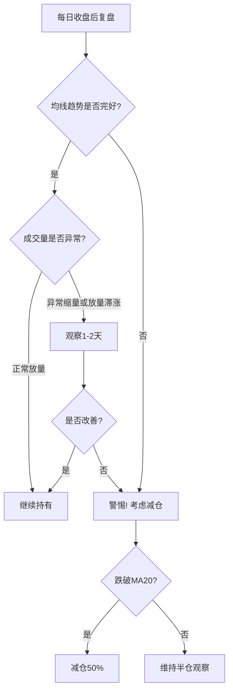
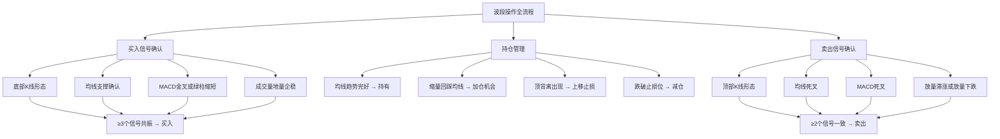

## 案例六：技术面波段操作

波段操作是介于短线交易和长线持有之间的一种策略——抓住一段趋势的中间部分，不追求买在最低点、卖在最高点，而是"吃鱼身"。本案例通过一位投资者在隆基绿能（601012）上的实战操作，完整演示如何利用技术分析工具进行波段交易，从信号识别到建仓、持仓管理、再到获利了结的全流程。

### 6.1 案例背景

**操作标的**：隆基绿能（601012），光伏行业龙头股

**操作时间**：2024年7月至2024年11月，历时约4个月，完成两轮波段操作

**投资者画像**：小王，28岁，互联网从业者，有1年股票投资经验。日常工作较忙，无法盯盘做短线，但能够每天收盘后花30分钟复盘。账户总资金15万元，计划用其中8万元（约53%仓位）做波段操作。

**为什么选波段而不是长线持有？**

小王观察到光伏行业处于政策驱动的强周期中，隆基绿能股价在2024年上半年经历了大幅回调后开始企稳。他判断这是一轮中期反弹行情，而非长期趋势性牛市，因此选择波段操作而非买入持有。波段操作的核心逻辑是：不赚最后一分钱，在趋势结束前提前离场。

**操作前的准备工作**：

1. **选股确认**：隆基绿能市值超过1000亿元，日均成交额在10亿元以上，流动性充足，适合波段操作。小盘股容易被庄家操控，技术形态容易失真，不适合纯技术面操作。
2. **工具准备**：使用同花顺/东方财富看盘软件，设置好均线系统（MA5/MA10/MA20/MA60）、MACD、KDJ、成交量副图指标。
3. **规则制定**：在交易前写下明确的进出场规则，避免盘中临时决策。


### 6.2 第一轮波段操作：底部建仓到止盈离场

#### 6.2.1 信号识别阶段（2024年7月中旬）

小王在7月中旬的复盘中发现了以下信号：

| 信号维度 | 具体表现 | 信号强度 |
|---------|---------|---------|
| K线形态 | 7月15日出现锤子线，下影线长度是实体的2倍 | 中等偏强 |
| 均线系统 | 股价触及MA60（季线）后获得支撑，连续3天未跌破 | 强 |
| MACD | 日线MACD绿柱缩短，DIF线有拐头向上迹象 | 中等 |
| 成交量 | 7月16日出现地量（近20日最低成交量），随后开始温和放量 | 中等偏强 |
| 板块环境 | 光伏板块指数同步企稳，板块资金流入 | 辅助确认 |

**信号共振判断**：K线底部形态 + 均线支撑 + 成交量地量企稳，三个维度同时发出看多信号，置信度较高。但MACD尚未形成金叉，属于"左侧偏右"的买入位置——比最早抄底稍晚，但比金叉确认后更早。

#### 6.2.2 建仓执行（2024年7月17日—7月23日）

小王没有一次性全仓买入，而是采用**分批建仓**策略：

| 日期 | 操作 | 价格 | 数量 | 仓位占比 | 理由 |
|------|------|------|------|---------|------|
| 7月17日 | 首批买入 | 18.50元 | 2000股 | 37% | 地量后放量阳线确认企稳 |
| 7月20日 | 第二批买入 | 19.20元 | 1500股 | 28% | MACD出现金叉，量能持续放大 |
| 7月23日 | 第三批买入 | 19.80元 | 1500股 | 28% | 股价站上MA20，均线多头排列初现 |
| — | 留存资金 | — | — | 7% | 应对极端回调的补仓资金 |

**建仓成本计算**：

```text
总投入 = 18.50×2000 + 19.20×1500 + 19.80×1500
       = 37,000 + 28,800 + 29,700
       = 95,500 元
总股数 = 5000股
平均成本 = 95,500 ÷ 5000 = 19.10 元/股
```

**分批建仓的核心逻辑**：没有人能精确预测最低点。第一批买入是试探性仓位，如果判断正确（股价上涨），后续加仓确认趋势；如果判断错误（股价继续下跌），亏损有限，还可以在更低位置补仓拉低成本。

#### 6.2.3 持仓管理阶段（2024年7月底—9月初）

建仓完成后，进入持仓管理阶段。这是波段操作中最考验耐心的时期。

**日常复盘检查清单**：



**关键持仓事件记录**：

1. **8月5日——洗盘考验**：股价盘中一度下跌4.2%，跌破MA10。小王检查发现：成交量并未放大（说明不是恐慌性抛售），尾盘拉回MA10上方，K线留长下影线。决策：继续持有，不做操作。

2. **8月19日——缩量回踩MA20**：股价回踩到MA20附近，成交量明显萎缩（只有前期均量的60%）。这符合经典的技术形态——上涨趋势中的缩量回踩是健康的回调，不是趋势反转。决策：继续持有，若跌破MA20且收盘价连续2天站不回来，则减仓。

3. **8月28日——MACD顶背离预警**：股价创出阶段新高22.50元，但MACD红柱比前一波高点时更短，形成日线级别的顶背离。这是中线见顶的预警信号。决策：不急于卖出，但将止损位从MA20上移到21.50元（近期平台支撑位）。

#### 6.2.4 卖出执行（2024年9月3日—9月6日）

9月2日出现关键卖出信号：

| 信号维度 | 具体表现 | 信号含义 |
|---------|---------|---------|
| K线形态 | 黄昏之星组合（阳线→十字星→阴线） | 顶部反转形态 |
| 均线系统 | MA5开始下穿MA10（短期死叉） | 短期趋势转弱 |
| MACD | DIF下穿DEA形成死叉，且在零轴上方 | 趋势由强转弱 |
| 成交量 | 9月2日放量下跌，成交量是前一日的1.8倍 | 恐慌性抛售开始 |

小王执行分批卖出：

| 日期 | 操作 | 价格 | 数量 | 理由 |
|------|------|------|------|------|
| 9月3日 | 首批卖出 | 22.00元 | 2500股（50%） | 黄昏之星确认，先锁定一半利润 |
| 9月6日 | 清仓卖出 | 21.30元 | 2500股（50%） | 股价跌破MA20，趋势确认转弱 |

**第一轮收益计算**：

```text
卖出总额 = 22.00×2500 + 21.30×2500 = 55,000 + 53,250 = 108,250 元
买入成本 = 95,500 元
毛利润 = 108,250 - 95,500 = 12,750 元
交易费用（约0.15%买卖合计）= (95,500 + 108,250) × 0.15% ≈ 306 元
净利润 = 12,750 - 306 = 12,444 元
收益率 = 12,444 ÷ 95,500 = 13.03%
持仓时间 = 48天
```

### 6.3 第二轮波段操作：趋势回调再入场

第一轮卖出后，小王并没有急于入场，而是耐心等待下一个信号。这体现了波段操作的核心纪律——**空仓等待也是一种操作**。

#### 6.3.1 等待与观察（2024年9月—10月中旬）

股价从22元回调，小王持续跟踪但不急于买入：

- **9月中旬**：股价跌到MA60附近，但MACD绿柱还在放大，说明下跌动能尚未衰竭。继续等待。
- **10月初**：股价跌破MA60，市场恐慌情绪蔓延。但小王注意到：成交量开始持续萎缩，跌速放缓，说明卖盘在衰竭。
- **10月14日**：出现关键信号——在MA120（半年线）附近，日K线连续出现3根小十字星，成交量缩至近60日最低。随后一根放量阳线突破十字星高点。

#### 6.3.2 第二轮建仓（2024年10月15日—10月18日）

| 日期 | 操作 | 价格 | 数量 | 理由 |
|------|------|------|------|------|
| 10月15日 | 首批买入 | 17.80元 | 2500股 | 底部十字星后放量阳线，MACD绿柱缩短 |
| 10月18日 | 加仓 | 18.60元 | 2000股 | 股价站上MA5和MA10，短期均线金叉 |

平均成本 = (17.80×2500 + 18.60×2000) ÷ 4500 = 81,700 ÷ 4500 = 18.16元/股

#### 6.3.3 持仓与卖出（2024年10月下旬—11月中旬）

这一轮上涨比第一轮更凌厉——因为经过充分回调，筹码结构更健康。

**关键持仓决策**：

- **10月28日**：股价快速拉升到20元以上，出现单日涨幅6%的大阳线。小王没有追涨加仓（大阳线后加仓容易追在短期高点），继续持有原有仓位。
- **11月5日**：股价突破前一轮高点22.50元，成交量放大。MACD在零轴上方形成二次金叉，这是强势信号。小王上调目标价至24元附近。
- **11月12日**：股价达到23.80元后，出现高位放量十字星，KDJ的J值超过100（严重超买）。小王判断短期顶部信号出现，执行卖出。

| 日期 | 操作 | 价格 | 数量 |
|------|------|------|------|
| 11月12日 | 全部卖出 | 23.50元 | 4500股 |

**第二轮收益计算**：

```text
卖出总额 = 23.50 × 4500 = 105,750 元
买入成本 = 81,700 元
毛利润 = 24,050 元
交易费用 ≈ 281 元
净利润 = 23,769 元
收益率 = 23,769 ÷ 81,700 = 29.09%
持仓时间 = 28天
```

### 6.4 完整操作复盘

#### 6.4.1 两轮操作汇总

| 指标 | 第一轮 | 第二轮 | 合计 |
|------|--------|--------|------|
| 持仓时间 | 48天 | 28天 | 76天 |
| 买入均价 | 19.10元 | 18.16元 | — |
| 卖出均价 | 21.65元 | 23.50元 | — |
| 净利润 | 12,444元 | 23,769元 | 36,213元 |
| 收益率 | 13.03% | 29.09% | — |
| 年化收益率（估算） | 99% | 379% | — |

**4个月总收益**：36,213元，相对于初始投入95,500元，总回报率约37.9%。

#### 6.4.2 操作中的技术分析要点总结



### 6.5 本案例的关键教训

#### 6.5.1 做对了什么

1. **信号共振而非单一指标**：小王从未仅凭一个指标做决策。买入时需要K线+均线+成交量三重确认，卖出时至少需要两个信号一致。单一技术指标的胜率只有50%左右，但多指标共振可以将胜率提升到65%以上。

2. **分批建仓降低择时风险**：没有人能精确预测最低点和最高点。分批买入让平均成本更接近区间中枢，避免"一把梭在半山腰"的尴尬。

3. **严格止损纪律**：第一轮操作中，小王在8月28日顶背离出现时就上调了止损位。虽然最终是止盈卖出而非止损出场，但这种"提前设防"的思维是波段操作存活的关键。

4. **耐心等待第二轮机会**：第一轮卖出后，小王空仓等待了整整6周才等到第二轮入场信号。很多投资者做不到这一点——看到别人赚钱就急着冲进去，结果买在回调途中。

#### 6.5.2 可以改进的地方

1. **第一轮卖早了**：如果在MACD顶背离时就减仓50%（而不是等到黄昏之星），可能在更高位置锁定更多利润。顶背离是预警信号，不一定立即反转，但提前减仓是更稳妥的做法。

2. **第二轮建仓偏保守**：在底部十字星出现时就应该建第一批仓位，而不是等到放量阳线确认后才买。虽然确认后买入更安全，但成本也高了约4%。

3. **缺少对大盘环境的分析**：整个操作过程中，小王主要关注个股技术形态，对沪深300指数的走势关注不够。如果大盘同期走弱，即使个股信号正确，涨幅也会大打折扣。波段操作应该"先看大盘，再看板块，最后看个股"。

#### 6.5.3 波段操作的通用纪律清单

| 纪律 | 具体要求 | 违反后果 |
|------|---------|---------|
| 信号纪律 | 买入必须≥3个信号共振，卖出必须≥2个信号一致 | 凭感觉操作，胜率大幅下降 |
| 仓位纪律 | 单只股票不超过总资金40%，单次建仓不超过计划仓位的50% | 一次判断失误就可能造成重大亏损 |
| 止损纪律 | 买入后设置止损位（一般为MA20或买入价下方7%），严格执行 | 小亏变大亏，套牢后被动长线 |
| 空仓纪律 | 没有明确信号时保持空仓，不为"怕错过"而入场 | 追涨杀跌，频繁交易损耗本金 |
| 复盘纪律 | 每天收盘后花15-30分钟复盘，记录操作理由和情绪状态 | 重复犯同样的错误，无法进步 |

### 6.6 波段操作的进阶技巧

#### 6.6.1 多周期共振确认

成熟的波段操作者不会只看日线，而是结合周线和月线进行多周期确认：

- **月线定方向**：月线MACD在零轴上方 → 大方向看多
- **周线定波段**：周线金叉 → 中期上涨波段开始
- **日线定买点**：日线回踩均线 → 具体买入时机

当月线、周线、日线三个周期同时看多时，波段操作的成功率最高。这就是"顺大势、逆小势"的原则——大周期定方向，小周期找入场点。

#### 6.6.2 板块轮动中的波段操作

A股市场存在明显的板块轮动现象。聪明的波段操作者不仅看个股，还会关注板块资金流向：

1. **板块启动初期**：龙头股率先涨停，板块内其他股票跟涨但涨幅较小。此时买入板块内技术形态最好的二线股。
2. **板块扩散期**：龙头股高位震荡，补涨股开始拉升。此时应持有但不加仓。
3. **板块退潮期**：龙头股开始下跌，补涨股还在冲高。这是离场信号——最后的补涨往往是诱多。

#### 6.6.3 常见的波段操作失败模式

| 失败模式 | 典型表现 | 根本原因 | 纠正方法 |
|---------|---------|---------|---------|
| 追涨式买入 | 在连续大阳线后追入 | FOMO（怕错过）心态 | 等回踩均线再买，宁可错过也不追高 |
| 恐慌式卖出 | 跌3%就割肉，结果卖在最低点 | 缺乏止损计划 | 买入前就设好止损位，盘中不临时改 |
| 补仓式套牢 | 跌了就补，越补越跌 | 不愿承认判断错误 | 跌破止损位就认错出场，不补仓 |
| 频繁换股 | 这只不涨换那只，结果两头挨打 | 缺乏耐心 | 选好标的后至少持有一个波段周期 |
| 满仓操作 | 始终满仓，没有现金储备 | 贪婪心理 | 任何时候保留20%现金作为机动资金 |

### 6.7 波段操作与其他策略的对比

| 维度 | 波段操作 | 短线交易 | 长线持有 |
|------|---------|---------|---------|
| 持仓时间 | 2周—3个月 | 1—5天 | 1年以上 |
| 分析重心 | 技术面为主，基本面为辅 | 纯技术面+情绪面 | 基本面为主 |
| 交易频率 | 每月1—3次 | 每天1—5次 | 每年1—3次 |
| 适合人群 | 有时间复盘但不能盯盘 | 全职交易者 | 没时间关注市场的上班族 |
| 年化收益预期 | 20%—60% | 不确定性极高 | 10%—20% |
| 最大回撤风险 | 10%—20% | 可能单日亏损5%+ | 30%—50% |
| 心理压力 | 中等 | 极高 | 较低 |
| 交易成本 | 中等 | 很高 | 很低 |

波段操作的核心优势在于：比长线持有更灵活（可以规避系统性风险），比短线交易更从容（不需要盯盘），是一种适合大多数普通投资者的中庸策略。但前提是——你必须有纪律，能忍住不追涨、不恐慌割肉、不在没有信号时乱操作。

> **写在最后**：技术面波段操作不是"看图算命"，而是一套基于概率的决策系统。它的核心不是预测未来，而是**在信号出现时果断行动，在信号不明时耐心等待**。任何单一的K线形态或技术指标都不能保证100%准确，但通过多指标共振、严格仓位管理和止损纪律，你可以在多次交易中实现正期望值——这正是波段操作的数学基础。
