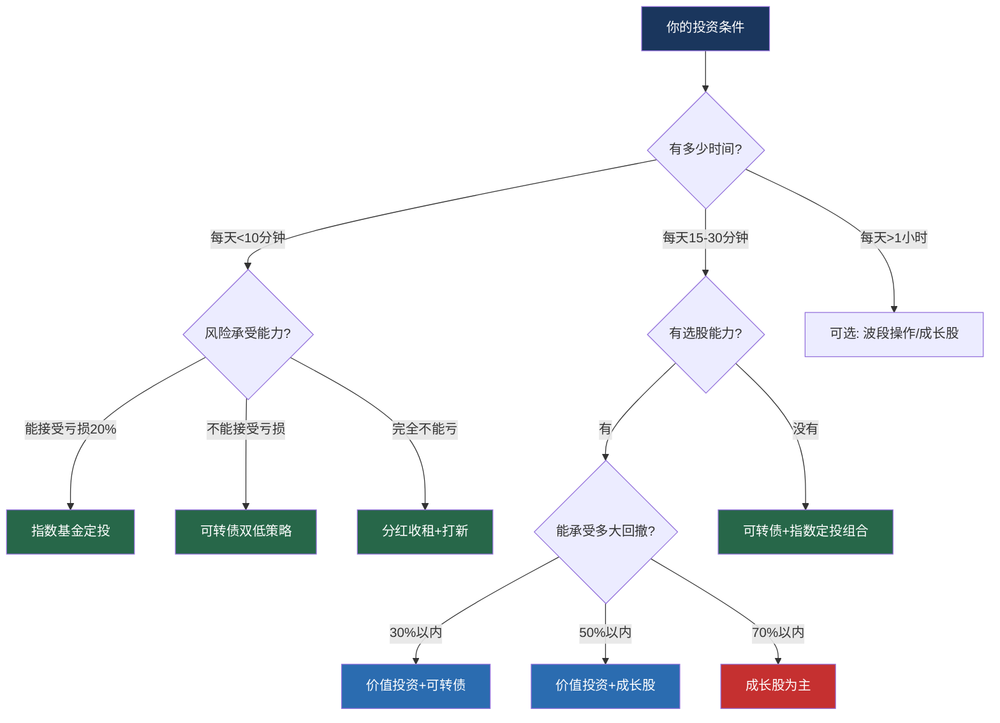
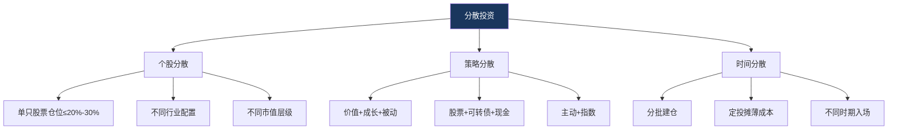
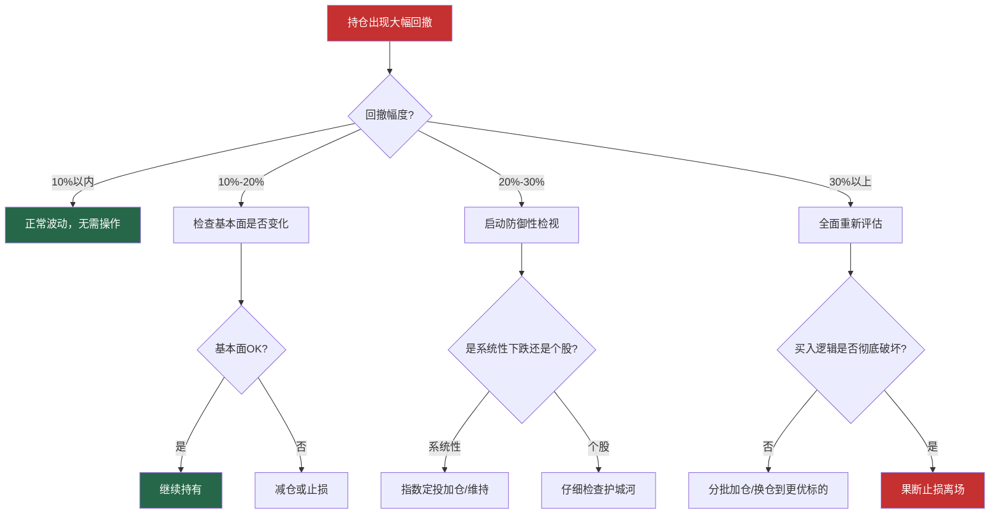
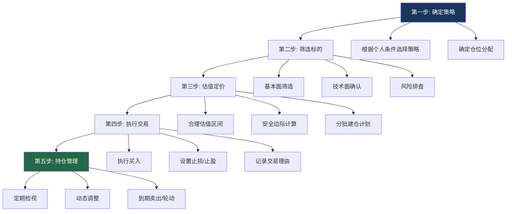
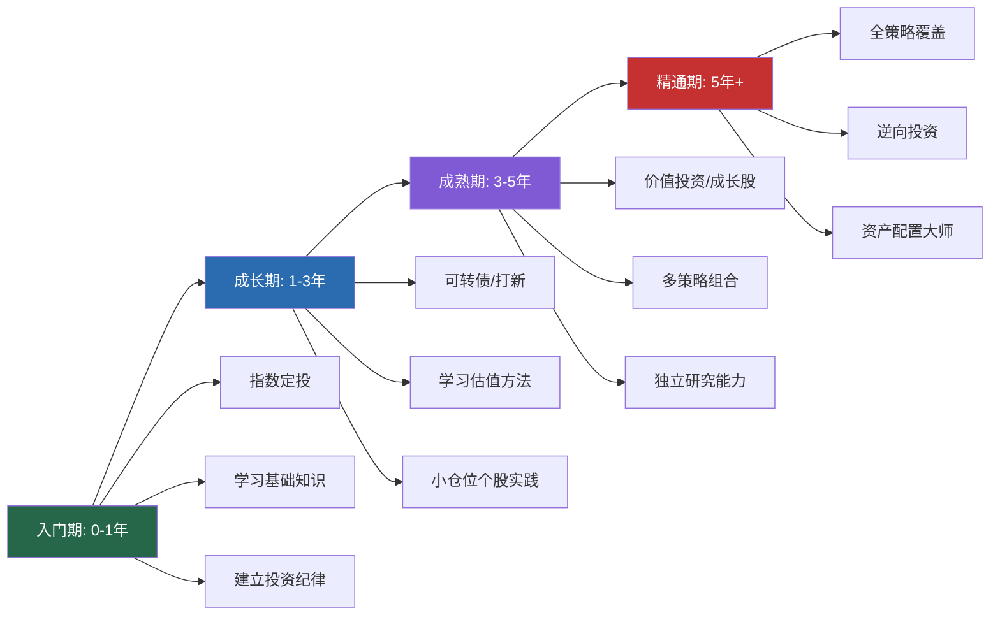

## 案例总结：八种策略的全景复盘与投资方法论提炼

> "投资的本质不是预测未来，而是在不确定性中构建一套正期望值的决策系统。"

前面八个案例覆盖了A股市场中最主流的投资策略——从价值投资到成长股捕捉，从指数定投到可转债博弈，从打新套利到技术面波段，再到分红收租和避雷防坑。每个案例都有具体的人物、数据、操作记录和教训总结。本章的目标不是简单重复这些内容，而是**站在更高的维度，从八个案例中提炼出跨策略的共性规律、核心决策框架和可直接复用的投资方法论**。

---

### 一、八大策略全景对比

#### 1.1 策略特征矩阵

将八种策略放在同一张表中对比，可以清晰看到每种策略的适用边界：

| 策略 | 代表案例 | 核心逻辑 | 预期年化收益 | 最大回撤 | 时间投入 | 适合人群 | 核心难点 |
|------|---------|---------|------------|---------|---------|---------|---------|
| 价值投资 | 茅台长期持有 | 买好公司，长期持有 | 15%-25% | 30%-55% | 低（季度检视） | 有耐心、能承受波动 | 下跌时坚持不动 |
| 成长股投资 | 宁德时代 | 抓住行业爆发期 | 20%-50%+ | 40%-75% | 中（持续跟踪） | 能承受高波动 | 增速放缓时退出 |
| 指数基金定投 | 小陈5年定投 | 纪律化分散买入 | 8%-12% | 20%-45% | 极低（月10分钟） | 所有人 | 坚持不停止 |
| 可转债投资 | 双低策略实战 | 债底保护+条款博弈 | 12%-20% | 3%-8% | 中（每日15分钟） | 追求稳健收益 | 信用风险识别 |
| 打新套利 | 多账户打新 | 低风险制度套利 | 6%-15%（附加） | 极低 | 极低（每日2分钟） | 持有股票市值者 | 注册制后筛选标的 |
| 技术面波段 | 隆基绿能操作 | 多指标共振抓波段 | 20%-60% | 10%-20% | 中高（每日复盘） | 有时间复盘者 | 克服情绪干扰 |
| 分红收租 | 老李的收租之路 | 高股息蓝筹持有 | 6%-10%（股息） | 15%-30% | 极低 | 近退休/保守型 | 股价下跌时的信心 |
| 避雷防坑 | 小张的教训 | 排除高风险标的 | 不亏损即胜利 | — | 低 | 所有人 | 识别风险信号 |

#### 1.2 策略选择决策树

不同投资者应该选择哪种策略？以下是基于个人条件的决策框架：



#### 1.3 资金分仓建议

对于有一定资金量（50万以上）的投资者，最稳健的做法是**多策略组合**，而非单一策略重仓：

| 仓位层级 | 配置比例 | 策略选择 | 作用 |
|---------|---------|---------|------|
| 核心仓位 | 40%-50% | 价值投资（优质蓝筹） | 提供长期复利基础 |
| 卫星仓位A | 15%-20% | 可转债双低策略 | 降低整体波动，提供稳健收益 |
| 卫星仓位B | 10%-15% | 指数基金定投 | 被动分散，长期β收益 |
| 机动仓位 | 10%-15% | 成长股/波段操作 | 捕捉超额收益α |
| 套利仓位 | 5%-10% | 打新底仓+分红 | 低风险附加收益 |
| 现金储备 | 5%-10% | 货币基金/逆回购 | 应对极端行情的弹药 |

这种分仓方式的核心思想是：**用核心仓位保证不掉队，用卫星仓位争取超额收益，用现金储备应对黑天鹅**。任何单一策略都有失效的时候，多策略组合才是长期生存的关键。

---

### 二、跨案例的六大核心规律

从八个案例中，可以提炼出六条反复出现的核心规律。这些规律不依赖于具体策略，是投资本身的底层逻辑。

#### 2.1 规律一：纪律比判断更重要

**案例证据：**

| 案例 | 有纪律的结果 | 无纪律的反面 |
|------|------------|------------|
| 指数定投（小陈） | 坚持5年，年化8.9% | 70%基金投资者亏损（中途放弃） |
| 价值投资（茅台） | 持有穿越危机，300倍回报 | 2013年118元卖出者错失20倍 |
| 波段操作（隆基） | 48天+28天两轮操作，收益37.9% | 追涨杀跌者频繁亏损 |
| 可转债（双低策略） | 年化15%-20%，回撤<6% | 凭感觉买卖者收益不稳定 |

**深层原因：** 人类大脑进化于狩猎采集时代，天生不擅长处理概率和长期决策。恐惧（亏损时想卖）、贪婪（上涨时想加仓）、从众（别人赚钱我也要）——这些情绪反应在投资中几乎100%是错误的。纪律的价值在于**用事先制定的规则替代盘中的情绪决策**。

**如何建立纪律：**

1. **交易前写下来**：买入前必须写下买入理由、目标价、止损价、持有期限。没有书面计划就不交易。
2. **规则具体化**：不要写"跌多了就止损"，要写"跌破买入价7%或跌破MA20止损"。
3. **自动化执行**：能设置条件单的就设置条件单，减少人为干预。
4. **定期复盘**：每周回顾一次交易记录，检查是否有违反纪律的操作。

#### 2.2 规律二：分散是免费的午餐

**案例证据：**

| 案例 | 分散程度 | 遇到的风险事件 | 影响 |
|------|---------|-------------|------|
| 可转债双低策略 | 10-15只转债 | 某地产转债亏损6.6% | 组合整体仅下跌0.5% |
| 指数基金定投 | 300-500只成分股 | 任何单只暴雷 | 对组合影响<0.3% |
| 价值投资 | 3-5只核心持仓 | 茅台下跌53%（2021-2024） | 如果全仓茅台，亏损53% |

**分散的三个维度：**



**分散的代价与平衡：** 分散会降低极端收益（你不太可能因为一只股票翻10倍而暴富），但也消除了极端亏损（你不太可能因为一只股票退市而破产）。对于绝大多数普通投资者，**消除毁灭性风险比追求极端收益重要得多**。

#### 2.3 规律三：买入价格决定大部分收益

**案例证据：**

| 案例 | 买入时机 | 结果 |
|------|---------|------|
| 茅台2013年买入 | PE<15倍，118-200元 | 持有到2021年收益10-20倍 |
| 茅台2021年买入 | PE>45倍，2000元+ | 持有到2024年亏损35%-50% |
| 宁德时代2019年买入 | PE约25倍，70元 | 持有到2021年收益8-10倍 |
| 宁德时代2021年底买入 | PE>100倍，650元 | 持有到2024年亏损60%-80% |
| 指数定投2018年开始 | 沪深300约3100点 | 5年收益53.3% |
| 指数定投2021年开始 | 沪深300约5800点 | 3年仍在亏损 |

**核心公式：**

```text
投资收益 = 基本面增长 × 估值变化

例1：茅台2013-2021年
  基本面增长：净利润从153亿增长到525亿，约3.4倍
  估值变化：PE从15倍到45倍，约3倍
  总收益：3.4 × 3 = 10.2倍

例2：茅台2021-2024年
  基本面增长：净利润从525亿增长到747亿，约1.4倍
  估值变化：PE从45倍到20倍，约0.44倍
  总收益：1.4 × 0.44 = 0.62倍（亏损38%）
```

**关键启示：** 好公司买贵了照样亏钱。估值是投资中不可忽视的变量。在估值极度高估时（如PE>历史90%分位），即使基本面再好，也应该减仓或至少停止加仓。

#### 2.4 规律四：回撤是常态，不是异常

**各策略的历史最大回撤：**

| 策略 | 最大回撤 | 恢复时间 | 投资者心理 |
|------|---------|---------|-----------|
| 茅台长期持有 | -63%（2008年） | 7个月 | 绝望 |
| 茅台长期持有 | -56%（2012-2014年） | 27个月 | 恐惧 |
| 宁德时代成长股 | -75%（2021-2024年） | 至今未恢复 | 麻木 |
| 沪深300定投 | -39%（2021-2022年） | 约18个月 | 焦虑 |
| 可转债双低策略 | -5.5%（2022年） | 约3个月 | 轻微不安 |
| 波段操作 | -10%-15%（单次止损） | 数天至数周 | 可控 |

**回撤的数学真相：**

```text
亏损50%后需要涨100%才能回本
亏损30%后需要涨43%才能回本
亏损20%后需要涨25%才能回本
亏损10%后需要涨11%才能回本

启示：控制回撤比回本容易得多
```

**回撤应对框架（从所有案例中提炼）：**



#### 2.5 规律五：复利需要时间，时间需要耐心

**复利的数学威力：**

| 年化收益率 | 10年后 | 20年后 | 30年后 |
|-----------|--------|--------|--------|
| 8%（指数定投） | 2.16倍 | 4.66倍 | 10.06倍 |
| 12%（价值投资） | 3.11倍 | 9.65倍 | 29.96倍 |
| 15%（优秀主动） | 4.05倍 | 16.37倍 | 66.21倍 |
| 20%（顶级投资者） | 6.19倍 | 38.34倍 | 237.38倍 |

**案例中的时间复利：**

- 茅台持有20年：31元→2627元，84倍（复权后300倍+）
- 小陈定投5年：18万→27.6万，53.3%
- 老李分红收租：持续收息再投资，本金不变但现金流稳定增长

**关键启示：** 复利的前提是**不中断**。一次重大亏损（如亏损50%）可以抹掉多年积累的收益。因此，**存活比暴利更重要**——先确保自己能留在牌桌上，时间会帮你赚钱。

#### 2.6 规律六：认知边界决定收益上限

**案例证据：**

| 投资者 | 认知水平 | 行为表现 | 最终结果 |
|--------|---------|---------|---------|
| 小陈（定投新手） | 知道自己不懂 | 选择指数定投，不碰个股 | 5年年化8.9%，跑赢大多数基金经理 |
| 茅台价值投资者 | 深度理解护城河和估值 | 低买高卖，穿越危机 | 10-20倍回报 |
| 追涨宁德时代的散户 | 只看到"新能源是未来" | 690元追入，不了解估值 | 亏损60%-80% |
| 可转债双低策略执行者 | 理解条款博弈逻辑 | 纪律化轮动，严格止损 | 年化15%-20% |
| 打新破发的投资者 | 不了解注册制变化 | 无脑打新，不筛选标的 | 单次亏损上万 |

**核心公式：**

```text
你能赚到的钱 = 你的认知范围内的钱

超越认知的操作 = 赌博
```

**如何扩展认知边界：**

1. **系统学习**：读完本书的理论基础部分，理解基本面分析、技术分析、行为金融学的基本框架
2. **小仓位试错**：用不超过总资金10%的仓位尝试新策略，积累实战经验
3. **记录复盘**：每笔交易写下逻辑，定期回顾，从错误中学习
4. **向案例学习**：本书的每个案例都浓缩了一种策略的精华，反复研读比看100篇股评更有价值

---

### 三、投资决策的完整框架

从八个案例中，可以提炼出一套通用的投资决策流程，适用于任何策略：

#### 3.1 投资决策五步法



#### 3.2 每一步的关键检查项

**第一步：确定策略**

| 检查项 | 具体内容 | 案例参考 |
|--------|---------|---------|
| 我有多少时间？ | 每天/每周可投入投资的时间 | 定投（10分钟/月）vs 波段（30分钟/天） |
| 我能承受多大亏损？ | 心理和财务上的最大可接受回撤 | 可转债（5%）vs 成长股（50%+） |
| 我的知识储备如何？ | 是否理解财务分析、估值方法、技术指标 | 指数定投（几乎不需要）vs 价值投资（需要深度分析） |
| 我的资金规模多大？ | 可投资金额决定了策略选择空间 | 5万以下适合定投，50万以上可多策略组合 |
| 我的投资期限多长？ | 短期（<1年）、中期（1-3年）、长期（3年+） | 短期：波段/打新；长期：价值投资/定投 |

**第二步：筛选标的**

```text
基本面筛选清单（适用于个股投资）：

□ ROE连续5年>15%？
□ 营收连续3年增长>10%？
□ 净利率>10%且稳定？
□ 资产负债率<60%？
□ 经营现金流>净利润？
□ 大股东质押比例<30%？
□ 无重大诉讼/监管处罚？
□ 行业前景未来3-5年向好？

→ 8项全通过：重点关注
→ 6-7项通过：可以考虑，需深入研究未通过项
→ 5项以下通过：放弃
```

**第三步：估值定价**

| 估值方法 | 适用场景 | 案例应用 |
|---------|---------|---------|
| 历史PE区间法 | 盈利稳定的成熟公司 | 茅台：PE<20倍买入，>35倍减仓 |
| PEG估值法 | 高增长公司 | 宁德时代：PEG<1时买入 |
| DCF现金流折现 | 现金流稳定的公司 | 茅台内在价值约1500-1600元 |
| 双低值排序 | 可转债 | 双低值<125时买入 |
| 股息率法 | 高分红蓝筹 | 股息率>5%时买入 |
| PE百分位法 | 指数基金 | 百分位<30%时加大定投 |

**第四步：执行交易**

| 原则 | 具体要求 | 违反后果 |
|------|---------|---------|
| 分批建仓 | 分2-4批买入，单批不超过计划仓位50% | 一把梭在半山腰 |
| 设置止损 | 买入时就确定止损价，写在纸上 | 小亏变大亏，套牢变长线 |
| 记录理由 | 写下买入逻辑，定期回顾 | 无法复盘，重复犯错 |
| 控制仓位 | 单只标的不超过总资金30% | 一次暴雷损失惨重 |

**第五步：持仓管理**

| 检视频率 | 检查内容 | 操作标准 |
|---------|---------|---------|
| 每日（波段策略） | 技术指标、成交量、消息面 | 触发止损/止盈条件即执行 |
| 每周（可转债策略） | 双低排名、强赎/下修触发 | 轮动操作 |
| 每月（定投策略） | 估值百分位、定投金额 | 调整定投金额 |
| 每季度（价值投资） | 财报数据、护城河变化、估值 | 更新投资逻辑 |
| 每年（所有策略） | 整体收益、策略有效性、资产配置 | 调整策略和仓位 |

---

### 四、常见错误的系统性归纳

从所有案例中，将投资错误分为四大类，每类给出具体案例和纠正方法：

#### 4.1 认知错误：不知道自己在做什么

| 错误 | 案例表现 | 正确认知 |
|------|---------|---------|
| 把投机当投资 | 追涨宁德时代690元，以为"新能源是未来"=值得买 | 好行业≠好公司≠好价格，三者必须同时满足 |
| 低PE=便宜 | 2012年白酒股PE仅10倍，但随后业绩暴跌 | PE必须结合成长性看，低PE可能是"价值陷阱" |
| 分红=不赚钱 | 认为分红只是左手倒右手 | 高分红提供现金流+复利再投资的长期威力 |
| 技术分析=看图算命 | 认为K线形态能预测未来 | 技术分析是概率工具，需要多指标共振+纪律执行 |
| 打新=稳赚不赔 | 注册制后仍无脑打新 | 破发概率上升，需要筛选标的 |

#### 4.2 情绪错误：知道但做不到

| 错误 | 触发场景 | 案例表现 | 纠正方法 |
|------|---------|---------|---------|
| 损失厌恶 | 持仓浮亏10%+ | 小陈2018年底差点停止定投 | 关闭每日推送，写好计划不看 |
| FOMO | 别人赚钱自己没跟 | 2021年追入新能源 | 回到自己的策略框架 |
| 锚定效应 | 总想着买入价 | 茅台从2627跌到1245，纠结"回本就卖" | 问自己：空仓会以当前价买入吗？ |
| 过度自信 | 连续盈利后 | 波段操作连赢3次后加大仓位 | 仓位永远按计划来，不因情绪调整 |
| 确认偏差 | 只看支持自己观点的信息 | 持有某股只看利好消息 | 主动寻找反对意见 |

#### 4.3 执行错误：做了不该做的事

| 错误 | 案例表现 | 后果 | 纠正方法 |
|------|---------|------|---------|
| 不设止损 | 茅台690元买入后跌到140元不止损 | 亏损80% | 买入前就写好止损价 |
| 频繁交易 | 波段操作中每天都在买卖 | 手续费吃掉利润 | 没有信号不操作 |
| 追涨杀跌 | 股价大涨后加仓，大跌后卖出 | 买在高点卖在低点 | 严格按计划执行 |
| 重仓单一标的 | 全仓茅台或全仓宁德时代 | 一次回撤损失惨重 | 单只≤30%仓位 |
| 忽视费率 | 选管理费1.5%的主动基金而非0.5%的指数基金 | 30年多交数十万 | 费率每低0.1%都很重要 |

#### 4.4 忽视风险：不知道危险在哪里

| 风险类型 | 案例表现 | 后果 | 防范方法 |
|---------|---------|------|---------|
| 信用风险 | 可转债持有暴雷标的 | 亏损6.6% | 排除ST、低评级、有诉讼标的 |
| 估值风险 | 690元买入宁德时代 | 亏损80% | 买入前检查估值百分位 |
| 行业风险 | 持有地产股遭遇行业下行 | 大幅亏损 | 分散行业配置 |
| 流动性风险 | 持有小盘可转债无法卖出 | 被迫低价成交 | 选择日均成交额>500万的标的 |
| 政策风险 | 反腐导致茅台短期暴跌56% | 浮亏巨大 | 理解政策影响是短期还是长期 |
| 退市风险 | 持有被ST的股票 | 可能血本无归 | 定期检查持仓基本面 |

---

### 五、不同人生阶段的投资策略建议

#### 5.1 按年龄段选择策略

| 年龄段 | 特征 | 推荐策略 | 资产配置建议 |
|--------|------|---------|------------|
| 22-30岁 | 资金少，时间多，风险承受力强 | 指数定投为主+学习价值投资 | 90%权益+10%现金 |
| 30-40岁 | 资金中等，时间有限，有家庭责任 | 价值投资+可转债+定投 | 70%权益+20%可转债+10%现金 |
| 40-50岁 | 资金较多，追求稳健 | 分红收租+价值投资+打新 | 50%权益+30%可转债/债券+20%现金 |
| 50岁以上 | 近退休，保本为先 | 高股息蓝筹+债券+定投减量 | 30%权益+50%债券+20%现金 |

#### 5.2 按资金规模选择策略

| 资金规模 | 推荐策略组合 | 说明 |
|---------|------------|------|
| 5万以下 | 指数定投（100%） | 集中精力提升主业收入 |
| 5-20万 | 指数定投60%+可转债40% | 开始分散配置 |
| 20-50万 | 价值投资40%+可转债30%+定投20%+现金10% | 多策略组合起步 |
| 50-200万 | 价值投资35%+成长股15%+可转债20%+定投15%+打新底仓10%+现金5% | 完整的多策略体系 |
| 200万以上 | 在上述基础上增加：波段操作10%+分红收租15% | 可以覆盖更多策略 |

#### 5.3 按市场环境调整策略

| 市场环境 | 判断标准 | 策略调整 |
|---------|---------|---------|
| 牛市初期 | PE百分位<30%，成交量温和放大 | 加大权益仓位，定投加倍 |
| 牛市中期 | PE百分位30%-60%，市场情绪乐观 | 维持正常仓位，不加不减 |
| 牛市末期 | PE百分位>80%，全民炒股，新闻联播报道股市 | 分批减仓，止盈 |
| 熊市初期 | PE百分位从高位回落，成交量放大 | 停止加仓，持有核心仓位 |
| 熊市中期 | PE百分位<40%，市场情绪悲观 | 开始分批建仓，定投加量 |
| 熊市末期 | PE百分位<20%，无人问津 | 重仓买入优质标的 |

---

### 六、投资者能力成长路径

#### 6.1 从入门到精通的四个阶段



#### 6.2 每个阶段的学习重点

| 阶段 | 必须掌握 | 推荐实践 | 常见陷阱 |
|------|---------|---------|---------|
| 入门期 | 复利原理、指数基金、定投方法 | 沪深300定投6个月 | 急于求成，跳过基础 |
| 成长期 | 财务报表阅读、PE/PB/ROE含义、可转债基础 | 用10%资金实践个股投资 | 过度自信，加大仓位太快 |
| 成熟期 | 估值方法（DCF/PEG）、护城河分析、行业研究 | 建立自己的投资体系 | 体系僵化，不愿调整 |
| 精通期 | 行为金融学、资产配置、宏观周期判断 | 管理家庭完整资产 | 认知傲慢，忽视风险 |

#### 6.3 推荐阅读书单

| 阶段 | 书名 | 作者 | 核心价值 |
|------|------|------|---------|
| 入门 | 《指数基金投资指南》 | 银行螺丝钉 | 定投入门必读 |
| 入门 | 《小狗钱钱》 | 博多·舍费尔 | 建立正确的金钱观 |
| 成长 | 《聪明的投资者》 | 本杰明·格雷厄姆 | 价值投资圣经 |
| 成长 | 《股票作手回忆录》 | 埃德温·勒菲弗 | 理解市场心理 |
| 成长 | 《手把手教你读财报》 | 唐朝 | A股财务分析实战 |
| 成熟 | 《巴菲特致股东的信》 | 沃伦·巴菲特 | 投资哲学的终极指南 |
| 成熟 | 《聪明的投资者》（重读） | 本杰明·格雷厄姆 | 每次重读都有新收获 |
| 成熟 | 《穷查理宝典》 | 彼得·考夫曼 | 多元思维模型 |
| 精通 | 《思考，快与慢》 | 丹尼尔·卡尼曼 | 理解认知偏差 |
| 精通 | 《周期》 | 霍华德·马克斯 | 理解市场周期 |

---

### 七、实战工具箱

#### 7.1 数据查询工具

| 工具 | 网址/APP | 核心功能 | 适用策略 |
|------|---------|---------|---------|
| 集思录 | jisilu.cn | 可转债双低排名、新股数据 | 可转债、打新 |
| 东方财富 | eastmoney.com | 行情、财报、公告 | 所有策略 |
| 同花顺 | 10jqka.com.cn | 技术分析、条件单 | 波段操作 |
| 且慢 | qieman.com | 指数估值、定投策略 | 指数定投 |
| 理杏仁 | lixinger.com | 估值数据、财务分析 | 价值投资、成长股 |
| 雪球 | xueqiu.com | 投资社区、组合跟踪 | 学习交流 |

#### 7.2 交易纪律检查清单

每次交易前，必须逐项确认：

```text
买入前检查：
□ 我的买入理由是什么？（写下来）
□ 目标价是多少？（写下来）
□ 止损价是多少？（写下来）
□ 仓位占总资金的比例是多少？
□ 如果买入后立刻跌10%，我会怎么做？
□ 这笔交易符合我的投资策略吗？
□ 我是基于分析还是基于情绪做的决定？

卖出前检查：
□ 卖出理由是什么？是计划中的还是临时起意？
□ 是否触发了预设的止盈/止损条件？
□ 如果卖出后继续涨20%，我会后悔吗？
□ 我是在执行纪律还是在被情绪驱动？
```

#### 7.3 投资记录模板

每笔交易都应该记录以下信息，定期回顾：

| 记录项 | 内容 |
|--------|------|
| 交易日期 | 2024-01-15 |
| 标的名称 | 贵州茅台 |
| 交易方向 | 买入 |
| 买入价格 | 1,500元 |
| 买入数量 | 100股 |
| 买入理由 | PE约22倍，处于历史30%分位，基本面未变化 |
| 止损价格 | 1,350元（-10%） |
| 目标价格 | 2,000元（PE约30倍） |
| 仓位比例 | 15% |
| 当时情绪 | 平静，基于分析 |
| 事后复盘 | （持有3个月后填写） |

---

### 八、本章核心结论

从八个案例中提炼出十条投资箴言，作为本章的总结：

**第一条：不懂不投。** 小陈靠指数定投跑赢大多数基金经理，不是因为他聪明，而是因为他知道自己不懂什么。选择与自己认知匹配的策略，远比追求高收益更重要。

**第二条：纪律是最大的Alpha。** 所有成功案例的共同点不是选股多精准，而是执行多严格。写下来的规则比脑子里的想法可靠一万倍。

**第三条：买入价格决定大部分收益。** 茅台在118元和2000元买入，结果天差地别。好公司+好价格，缺一不可。

**第四条：分散消除毁灭性风险。** 单只股票可能让你暴富，也可能让你破产。分散不会让你成为最富的人，但能确保你不会成为最穷的人。

**第五条：回撤是复利的敌人。** 亏损50%需要涨100%才能回本。控制回撤比追求收益更重要——先活着，再赚钱。

**第六条：时间是好公司的朋友。** 茅台20年300倍的回报，不是靠精准择时，而是靠长期持有。复利需要时间，时间需要耐心。

**第七条：别人贪婪时恐惧，别人恐惧时贪婪。** 2018年底、2020年3月、2024年9月——每次市场恐慌时坚持定投或加仓的人，最终都获得了超额回报。

**第八条：没有完美的策略，只有适合自己的策略。** 价值投资不适合没耐心的人，波段操作不适合没时间的人，成长股投资不适合不能承受波动的人。选择你能坚持的策略，比选择"最好的"策略更重要。

**第九条：投资是一辈子的事。** 不要因为一次亏损就放弃，也不要因为一次盈利就膨胀。建立系统，持续优化，让时间成为你的盟友。

**第十条：最好的投资是投资自己。** 本书的所有案例和方法，价值不在于具体的股票代码或操作时点，而在于背后的思维方式和决策框架。掌握了这些，你可以在任何市场环境中找到属于自己的机会。

---

> **本章总结：** 八个案例展示了八种不同的投资策略，但它们的底层逻辑是相通的——理解价值、尊重纪律、控制风险、保持耐心。投资没有捷径，但有方法。选择适合自己的策略，严格执行，长期坚持，复利会帮你完成剩下的工作。记住，投资的目标不是一夜暴富，而是用可承受的风险，获取可持续的回报，最终实现财务自由。
