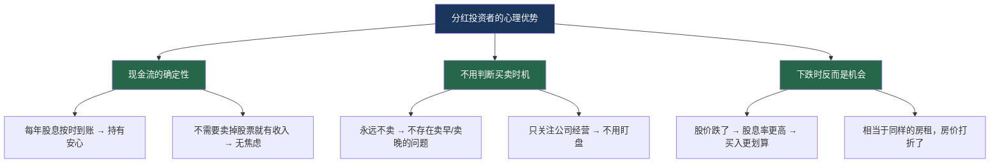

## 案例七：分红投资策略——老李的"收租"之路

> "买股票就是买公司的一部分。如果一家公司每年都能分红，那你买的不是股票，是一台会吐钱的机器。" —— 老李

### 一、什么是分红投资策略

#### 1.1 核心理念

分红投资策略，也称"股息策略"（Dividend Strategy），是所有投资策略中**最接近"收租"本质**的一种。它的核心逻辑极其简单：

```text
买入高股息、持续分红的优质公司 → 长期持有 → 每年收取股息 → 股息再投资 → 复利滚雪球
```

这个策略不要求你精准择时，不需要你天天盯盘，甚至不需要你具备高深的财务分析能力。它的本质是：**把股票当作"金融房产"来看待——你买入的是一个能持续产出现金流的资产，而股息就是你的"房租"。**

与追求股价暴涨的成长股投资不同，分红投资更关注的是：

| 维度 | 成长股投资 | 分红投资策略 |
|------|-----------|------------|
| 核心关注点 | 股价涨幅 | 股息收入 |
| 收益来源 | 低买高卖的差价 | 持续稳定的现金分红 |
| 持有心态 | 等待卖出时机 | 永远不卖，只收租 |
| 心理压力 | 较大（需要判断买卖点） | 较小（只关心公司是否持续分红） |
| 现金流 | 账面浮盈为主 | 每年真金白银到账 |
| 适合人群 | 有时间精力、能承受波动 | 追求稳定现金流、不愿操心 |

#### 1.2 为什么分红策略被称为"收租"

想象一下：你在市中心有一套价值300万的房子，每月收租6000元，年租金回报率2.4%。你不需要卖房子就能获得现金流，房子本身还可能随着城市发展而增值。

分红投资的逻辑完全一样：

```text
投入300万买入高股息组合 → 每年股息收入18-30万（股息率6%-10%）
→ 相当于每月1.5-2.5万的"房租"
→ 股票本身还可能随公司成长而增值
→ 且不需要操心维修、找租客、收租纠纷
```

老李的"收租"之路，就是这套逻辑最生动的实践案例。

#### 1.3 分红策略的理论基础

分红策略并非"笨办法"，它背后有坚实的学术和实践支撑：

**（一）"一鸟在手"理论（Gordon）**

金融学家迈伦·戈登（Myron Gordon）在1963年提出的股利折现模型指出：投资者对确定的股息收入给予更高的估值权重。用通俗的话说：**今天到手的1块钱分红，比未来可能的2块钱股价上涨更让人安心。**

**（二）A股分红因子的历史超额收益**

根据中证指数公司的数据，中证红利指数（000922.CSI）自2004年底发布至2024年底，20年累计收益约620%（含分红再投资），年化收益约10.5%，跑赢同期沪深300指数约3个百分点。更重要的是，中证红利指数的最大回撤显著低于沪深300。

| 指标（2005-2024） | 中证红利全收益 | 沪深300全收益 |
|------------------|--------------|-------------|
| 年化收益率 | 约10.5% | 约7.8% |
| 最大回撤 | -56% | -72% |
| 夏普比率 | 约0.45 | 约0.32 |
| 股息贡献占比 | 约40%-50% | 约25%-30% |

**（三）分红的"心理账户"效应**

行为金融学发现，投资者倾向于将"股息收入"和"资本利得"放入不同的"心理账户"。股息被视为"被动收入"，更容易被坚持持有；而资本利得被视为"投机收益"，容易被挥霍。**这个心理学机制，恰恰是分红策略长期有效的原因之一——它帮助投资者克服了频繁交易的冲动。**

---

### 二、案例背景：老李是谁

#### 2.1 人物画像

| 属性 | 描述 |
|------|------|
| 姓名 | 老李（化名） |
| 年龄 | 52岁（开始实施分红策略时45岁） |
| 职业 | 三线城市国企中层管理 |
| 年薪 | 约25万元 |
| 家庭状况 | 已婚，一个孩子正在读大学 |
| 投资经历 | 2007年入市，经历过6124点和1664点的暴涨暴跌 |
| 初始可投资资金 | 约120万元（多年积蓄+卖掉一套投资房） |
| 投资目标 | 不追求暴富，希望每年有稳定的额外现金流，为退休做准备 |

#### 2.2 老李的投资历程

老李的投资之路并非一帆风顺。他和绝大多数A股散户一样，经历了典型的"交学费"阶段：

```text
2007年：跟风入市，6000点追入，被套在48元的中石油 → 亏损约70%
2009年：听消息炒股，追涨杀跌，一年交易超过200笔 → 手续费都亏了几万
2012年：尝试技术分析，画了满屏的趋势线 → 胜率不到40%
2014年：杠杆牛市初期赚了钱，加了融资 → 2015年股灾差点爆仓
2016年：终于承认自己不是炒股的料，开始反思
```

**转折点出现在2016年底。** 老李读到一篇关于"股息再投资"的文章，文章的核心观点是：

> "如果你买入的公司每年给你8%的分红，即使股价一分不涨，10年后你的本金也通过分红回来了。之后你手里的股票就是'白捡'的，而且每年还在继续给你分红。"

这个观点击中了老李——他不想再为股价的涨跌焦虑，他想要的是**确定的、可持续的现金流**。

---

### 三、分红策略的选股体系

#### 3.1 老李的选股标准

老李花了三个月时间研究分红投资的选股方法论，最终建立了自己的"六维选股框架"：

| 维度 | 核心指标 | 老李的标准 | 原因 |
|------|---------|-----------|------|
| 股息率 | 滚动股息/股价 | ≥5% | 跑赢理财+通胀，才有"收租"的实感 |
| 分红连续性 | 连续分红年数 | ≥10年不间断 | 证明公司有稳定的分红意愿和能力 |
| 分红比例 | 派息额/净利润 | 30%-70% | 太低说明不重视股东回报，太高说明透支利润 |
| 盈利稳定性 | ROE连续性 | ROE≥10%，且波动不超过30% | 盈利不稳定的公司分红不可能稳定 |
| 负债水平 | 资产负债率 | <60%（金融除外） | 高负债公司可能在危机时砍掉分红 |
| 行业特征 | 行业生命周期 | 成熟期行业为佳 | 成熟期公司不需要大量资本开支，有钱分红 |

#### 3.2 为什么这六个维度缺一不可

**（一）只看股息率的陷阱**

很多新手投资者只看股息率高低就冲进去，这是一个经典陷阱。某些公司的股息率高是因为股价暴跌导致的"被动高股息"：

```text
反面案例：某地产公司
  2021年股价10元，分红0.3元/股，股息率3% —— 看起来正常
  2022年股价暴跌至3元，分红0.2元/股，股息率6.7% —— 看起来很高？
  但公司2023年已经暴雷，停止分红，股价跌到0.8元

结论：股息率高可能是股价暴跌的信号，而非投资机会
```

**（二）分红连续性为什么重要**

一家公司如果连续10年以上不间断分红，说明它经历了至少2-3轮完整的经济周期仍然保持分红，这比任何财务指标都更能说明公司的质量。

```text
老李的逻辑：连续分红15年+的公司 ≈ "抗住了08年金融危机 + 12年反腐 + 
15年股灾 + 18年贸易战 + 20年疫情 + 21年核心资产崩盘"的公司

这样的公司，大概率也能扛住下一次危机
```

**（三）分红比例为什么不能太高**

分红比例（派息率）超过100%意味着公司在"借钱分红"，这是不可持续的。老李见过不少公司为了维护股价，把利润甚至借款全部分掉，结果第二年无力分红，股价暴跌。

```text
健康区间：分红比例30%-70%
  30%：保守，公司留了大量利润再投资
  50%：平衡，兼顾股东回报和公司发展
  70%：慷慨，适合成熟行业（如公用事业、银行）

危险信号：
  <20%：公司不太重视股东回报
  >80%：可能在透支未来，需要警惕
  >100%：借钱分红，危险！
```

#### 3.3 老李的高股息"股票池"

经过系统筛选，老李建立了自己的核心股票池（以2017年初的视角）：

| 行业 | 公司 | 股息率 | 连续分红年数 | ROE | 分红比例 | 核心优势 |
|------|------|--------|-----------|-----|---------|---------|
| 银行 | 工商银行 | 5.2% | 15年+ | 12% | 30% | 宇宙大行，永不倒 |
| 银行 | 建设银行 | 5.0% | 15年+ | 13% | 30% | 基建贷款优势 |
| 煤炭 | 中国神华 | 6.8% | 15年+ | 15% | 60% | 煤电路港一体化 |
| 电力 | 长江电力 | 4.2% | 15年+ | 16% | 70% | 水电永续经营 |
| 石化 | 中国石化 | 5.5% | 15年+ | 10% | 50% | 加油站网络+垄断 |
| 高速 | 宁沪高速 | 5.8% | 15年+ | 12% | 65% | 收费公路，现金流极稳 |
| 公用 | 华能国际 | 6.0% | 10年+ | 11% | 45% | 火电龙头，电价稳定 |
| 保险 | 中国平安 | 3.5% | 15年+ | 18% | 25% | 综合金融，成长性最强 |

**老李的组合构建原则：**

1. **不把鸡蛋放在一个篮子里**：至少配置5-8只不同行业的股票
2. **核心仓位给"铁饭碗"**：银行+公用事业占比约50%，确定性最高
3. **卫星仓位给"高股息+有成长"**：神华、平安占比约30%，股息+资本增值兼顾
4. **保留10%-20%现金**：等待更好的买入机会

#### 3.4 排除清单：哪些高股息股票不能碰

老李在实践中总结了一份"排除清单"，这些特征出现任何一个就要警惕：

```text
绝对排除（出现即放弃）：
  ✗ 最近两年有分红中断记录
  ✗ ST/*ST 标记
  ✗ 大股东质押比例>50%
  ✗ 正在进行重大诉讼或被监管调查
  ✗ 扣非净利润连续两年下滑

相对排除（出现需深入研究后决定）：
  △ 行业处于强周期下行期（如2015年的煤炭）
  △ 分红比例突然大幅提高（从30%跳到80%，可能是一次性的）
  △ 公司刚完成大规模并购（商誉减值风险）
  △ 实际控制人频繁变动
```

---

### 四、老李的建仓过程（2017-2018年）

#### 4.1 分批建仓策略

老李没有一次性全部买入，而是采用了**18个月分批建仓**的策略：

```text
总资金：120万元
建仓节奏：每月投入约6-7万元，18个月完成
建仓顺序：先买股息率最高的，逐步扩展到整个组合
```

为什么是18个月？老李的考虑是：

1. **摊平成本**：如果市场在建仓期内下跌，后面买的更便宜；如果上涨，前面买的部分已经获利
2. **学习过程**：边买边研究，不急于把钱全部花完
3. **心理舒适**：每月投6万比一次性投120万压力小得多

#### 4.2 实际建仓记录

| 时间 | 买入标的 | 股数 | 买入价 | 投入金额 | 当时股息率 |
|------|---------|------|--------|---------|-----------|
| 2017.01 | 中国神华 | 3000股 | 16.8元 | 50,400元 | 6.5% |
| 2017.02 | 工商银行 | 10000股 | 4.8元 | 48,000元 | 5.4% |
| 2017.03 | 长江电力 | 2000股 | 14.5元 | 29,000元 | 4.3% |
| 2017.04 | 建设银行 | 8000股 | 5.9元 | 47,200元 | 5.1% |
| 2017.05 | 宁沪高速 | 4000股 | 9.2元 | 36,800元 | 5.9% |
| 2017.06 | 中国石化 | 6000股 | 6.1元 | 36,600元 | 5.6% |
| 2017.08 | 中国平安 | 500股 | 52元 | 26,000元 | 3.2% |
| 2017.10 | 华能国际 | 5000股 | 7.8元 | 39,000元 | 6.1% |
| 2017.12 | 中国神华 | 2000股 | 19.5元 | 39,000元 | 5.8% |
| 2018.02 | 工商银行 | 8000股 | 6.1元 | 48,800元 | 5.0% |
| 2018.05 | 长江电力 | 3000股 | 15.2元 | 45,600元 | 4.1% |
| 2018.07 | 建设银行 | 6000股 | 6.8元 | 40,800元 | 4.8% |
| 2018.09 | 中国神华 | 2000股 | 17.2元 | 34,400元 | 6.3% |
| 2018.10 | 宁沪高速 | 3000股 | 8.5元 | 25,500元 | 6.4% |
| 2018.11 | 中国石化 | 4000股 | 5.3元 | 21,200元 | 6.8% |
| 2018.12 | 工商银行 | 8000股 | 5.3元 | 42,400元 | 5.8% |
| — | 合计 | — | — | **约610,700元** | — |
| — | 剩余现金 | — | — | **约589,300元** | — |

**为什么只投入了约61万？** 因为2018年中美贸易战导致股市持续下跌，老李留了一半资金等待更低的价格。这体现了分红投资者的另一个优势——**不急于满仓，因为持有现金也有利息收入，等待"打折"机会是值得的。**

#### 4.3 建仓期的补仓操作（2018年底-2019年初）

2018年底A股跌至2440点的低谷，老李的高股息组合也出现了10%-15%的浮亏。但老李不慌——因为分红还在按时到账。他利用剩余资金加大了买入力度：

```text
2018年12月-2019年3月：
  补仓工商银行：+15000股，均价5.0元，投入75,000元
  补仓中国神华：+3000股，均价16.5元，投入49,500元
  补仓建设银行：+10000股，均价6.3元，投入63,000元
  补仓中国石化：+5000股，均价5.0元，投入25,000元
  补仓长江电力：+2000股，均价15.8元，投入31,600元

  补仓投入合计：约244,100元
  总投入约：610,700 + 244,100 = 854,800元
  剩余现金：约345,200元（留作后续机会+应急）
```

**关键数据对比：**

| 标的 | 首次买入价 | 补仓均价 | 摊薄后均价 | 补仓时股息率 |
|------|----------|---------|-----------|-----------|
| 工商银行 | 4.8元 | 5.0元 | 约4.9元 | 5.8% |
| 中国神华 | 16.8元 | 16.5元 | 约16.6元 | 6.5% |
| 建设银行 | 5.9元 | 6.3元 | 约6.1元 | 5.1% |
| 中国石化 | 6.1元 | 5.0元 | 约5.5元 | 6.8% |
| 长江电力 | 14.5元 | 15.8元 | 约15.3元 | 4.1% |

---

### 五、分红再投资的复利威力

#### 5.1 老李的核心策略：分红再投资

老李做了一个看似简单但极其关键的决定——**所有收到的股息，一分钱都不花，全部用来再买入高股息股票。**

```text
这就是"分红再投资"的复利魔法：

第1年：投入100万，股息率6%，收到股息6万 → 再买入
第2年：本金变成106万（假设股价不变），股息率6%，收到股息6.36万 → 再买入
第3年：本金变成112.36万，股息率6%，收到股息6.74万 → 再买入
...
第10年：本金变成179万，股息率6%，收到股息10.74万
第15年：本金变成240万，股息率6%，收到股息14.4万

10年后：你的年度股息收入已经是第一年的1.79倍
15年后：你的年度股息收入已经是第一年的2.4倍
```

**这就是"72法则"在分红策略中的应用：**

```text
股息翻倍所需年数 ≈ 72 ÷ 股息率(%)

股息率6%：72 ÷ 6 = 12年翻倍
股息率8%：72 ÷ 8 = 9年翻倍
股息率5%：72 ÷ 5 = 14.4年翻倍
```

#### 5.2 老李的实际分红记录（2017-2024年）

| 年份 | 持仓市值(万) | 累计投入(万) | 年度股息(万) | 综合股息率 | 股息再投资操作 |
|------|------------|------------|------------|-----------|-------------|
| 2017 | 68 | 61 | 1.8 | 2.9%（仅半年持仓） | 买入1000股神华+5000股工行 |
| 2018 | 78 | 85 | 4.2 | 5.4% | 买入5000股建行+3000股石化 |
| 2019 | 108 | 85 | 5.8 | 6.8% | 买入3000股神华+2000股长江电力 |
| 2020 | 115 | 85 | 6.5 | 7.6% | 买入5000股工行+2000股宁沪高速 |
| 2021 | 132 | 85 | 7.2 | 8.5% | 买入2000股神华+3000股工行 |
| 2022 | 125 | 85 | 8.1 | 9.5% | 买入6000股建行+2000股长江电力 |
| 2023 | 138 | 85 | 9.3 | 10.9% | 买入5000股神华+5000股工行 |
| 2024 | 155 | 85 | 10.5 | 12.4% | 继续再投资 |

**关键指标解读：**

- **累计投入**：85万（后续没有追加新资金）
- **2024年持仓市值**：约155万（不含剩余现金）
- **2024年股息收入**：10.5万元（每月约8,750元）
- **7年累计收到股息**：约53.4万元
- **年化综合收益率**：约10.8%（含股息再投资的复利效应）

```text
注意：2024年综合股息率高达12.4%，远超初始的6%
这不是因为选股更好了，而是因为"股息再投资"的复利效应——
每年的股息被用来买入更多股份，产生更多股息，形成正向循环
```

#### 5.3 分红再投资的实操细节

老李在股息再投资中遵循了几个关键原则：

**原则一：股息到账后不急于买入**

```text
错误做法：股息到账当天就买入
正确做法：等到下一个"便宜"的机会再买入

老李的操作：
  每年6-8月是分红密集期，大量公司集中派息
  收到股息后先放入货币基金（年化2%-3%）
  等到市场出现短期下跌或个股回调时再买入
  如果半年内没有好的机会，就在年底前买入（不跨年拖太久）
```

**原则二：优先买入"被低估"的标的**

```text
在自己的股票池中，每次再投资时优先买入：
  1. 当前股息率最高的标的（价格相对最低）
  2. 最近刚经历短期下跌的标的
  3. 计划仓位尚未配满的标的
```

**原则三：用"股息率阈值"控制买入时机**

```text
老李的股息率阈值体系（买入参考）：

  股息率 > 7%：积极买入（价格明显便宜）
  股息率 6%-7%：正常买入
  股息率 5%-6%：可以小量买入
  股息率 < 5%：暂停买入，等更好价格

卖出参考（仅在极端情况下）：
  股息率 < 3%：严重高估，考虑减仓
  股息率 < 2%：泡沫区间，果断卖出
```

---

### 六、分红投资的心理修炼

#### 6.1 最难熬的时刻

分红策略看似轻松，但老李坦言，有几个时刻差点让他放弃：

**考验一：2018年贸易战暴跌**

```text
2018年1月-12月：沪深300从4400点跌到2935点，跌幅33%
老李的组合浮亏：约12%（高股息股跌幅相对较小）
当时市场情绪：极度悲观，"中美脱钩""经济崩溃"的论调铺天盖地

老李的内心独白：
  "我是不是该卖掉止损？"
  "万一跌到2000点怎么办？"
  "这些银行股会不会坏账暴雷？"

老李的应对：
  打开自己的分红记录——全年股息4.2万元已到账，一分没少
  问自己：公司的业务有没有因为贸易战就停止运转了？
  答案是：银行照常放贷收息，神华照常挖煤发电，长江电力的水电大坝还在转
  → 不卖，而且趁跌补仓
```

**考验二：2020-2021年跑输热门赛道**

```text
2020年3月-2021年2月：
  新能源ETF涨幅：200%+
  半导体ETF涨幅：150%+
  茅台从1000涨到2600，涨幅160%
  
  老李的组合：涨幅约40%（含股息）

当时朋友圈/股吧里每天都在晒新能源的收益
老李的银行股被人嘲笑为"僵尸股""大烂臭"

老李的内心独白：
  "我是不是选错了策略？"
  "要不要卖掉一些银行股，买点新能源？"
  "别人都在赚钱，我在这里收利息..."

老李的应对：
  回顾了自己的投资日记——第一条写的是"我要的是确定性现金流，不是赌博"
  提醒自己：那些追新能源的人，大多数是在涨了50%之后才追入的
  结果：2021年2月后核心资产崩盘，新能源ETF从高点跌了60%+
  老李的高股息组合：只跌了约8%
```

**考验三：身边人的质疑**

```text
老李的妻子："你买了这么多银行股，天天不涨，还不如存银行定期。"
老李的同事："现在谁还买银行股啊？你看看茅台、宁德时代！"
老李的朋友："分红有什么用？股价跌了分红都不够亏的。"

老李的应对：
  每年年底做一次"投资年度报告"给家人看
  报告包括：持仓总市值、年度股息收入、分红再投资的复利效果
  当2024年年度股息收入达到10.5万（月均8750元）时，所有质疑都消失了
```

#### 6.2 分红投资者的心理优势

分红策略相比其他策略，有天然的心理优势：



老李总结的心理口诀：

```text
股价涨了 → 开心（账面增值）
股价跌了 → 也开心（股息率更高，再投资更划算）
股价不动 → 最开心（安心收租，复利滚雪球）

怎么着都开心，这就是分红策略的心理优势
```

---

### 七、老李的完整持仓检视框架

#### 7.1 季度检视清单

老李每季度做一次持仓检视，标准清单如下：

```text
分红投资季度检视清单

一、分红能力检查
  □ 各持仓本季度是否正常经营？
  □ 有无重大负面公告（如业绩预警、诉讼、被监管处罚）？
  □ 本季度/半年报的盈利是否符合预期？
  □ 分红计划是否如期公布？

二、分红意愿检查
  □ 管理层是否在公开场合表态将继续分红？
  □ 是否有回购计划？（回购也是回报股东的方式）
  □ 分红比例是否与往年一致或提升？

三、估值检查
  □ 各持仓当前股息率是否仍在"合理区间"（5%-8%）？
  □ 是否有持仓的股息率降到3%以下（严重高估信号）？
  □ 是否有持仓的股息率升到8%以上（可能基本面恶化，需深入检查）？

四、仓位检查
  □ 单只持仓是否超过总仓位的20%？
  □ 行业集中度是否过高（如银行占比>40%）？
  □ 现金比例是否保持在10%-20%？

五、操作决策
  □ 本次分红收入是否有更好的再投资标的？
  □ 是否需要调整组合中各标的的仓位比例？
  □ 是否有新的高股息标的进入筛选范围？
```

#### 7.2 年度复盘模板

老李每年1月做一次完整复盘：

```text
      年分红投资年度报告

一、年度收益总览
  年初持仓市值：____万元
  年末持仓市值：____万元
  资本利得（股价变动）：____万元（____%）
  年度股息收入：____万元
  总收益：____万元（____%）
  同期沪深300收益：____%（对比基准）

二、各持仓表现
  [逐只列出：股价变动 + 收到股息 + 股息率变化]

三、分红再投资执行情况
  年度总股息：____万元
  再投资金额：____万元
  再投资标的及价格

四、策略有效性评估
  本年综合股息率：____%（目标≥6%）
  最大回撤：____%（目标<20%）
  是否跑赢定期存款：是/否
  是否跑赢通胀：是/否

五、下一年计划
  需要调整的持仓：____
  新增关注标的：____
  分红再投资计划：____
```

---

### 八、分红策略的常见误区与纠正

#### 8.1 十大误区逐一击破

**误区一："分红就是左手倒右手，没有意义"**

```text
错误理解：分红10元，股价除息后也跌10元，总资产不变

正确理解：
  1. 分红是真金白银到你账户，你没有卖出任何股份
  2. 除息后股价低了，但公司还在运转，下一个年度还会继续分红
  3. 用分红再买入更多股份 → 来年分红更多 → 复利循环
  4. 关键区别：股价是"市场先生"说了算，分红是公司经营说了算
  
举例：你花100万买了一套收租的房子，每年收租6万
  即使房价暂时从100万跌到90万，你的房租一分不会少
  10年后你可能已经收了60万房租，而房价大概率也涨回来了
  分红投资就是这个逻辑
```

**误区二："高股息股票都是增长停滞的烂公司"**

```text
反例：
  中国神华：2017-2024年净利润从350亿增长到600亿+，同时保持6%+股息率
  长江电力：2017-2024年净利润从200亿增长到350亿+，水电是永续经营
  中国平安：股息率虽然只有3%，但10年间利润增长了3倍

结论：高股息≠低增长。真正好的分红股是"又高分红又高增长"的公司
```

**误区三："股息率越高越好"**

```text
反例：某煤炭公司在行业低谷时股息率高达12%
  但第二年公司亏损，停止分红
  股价从10元跌到3元

正确判断：股息率超过10%时，大概率是以下情况之一：
  1. 股价暴跌导致的"被动高股息"（陷阱）
  2. 一次性特别分红，不可持续
  3. 行业强周期顶部，利润即将下滑
  4. 极少数情况：真的被低估了（需要深入分析才能确认）
```

**误区四："分红策略只适合老年人"**

```text
事实：
  年轻人做分红再投资的复利效果更强——因为你有更多的时间让复利发挥威力
  25岁开始，年化10%（含股息再投资），50岁时资产增长约11倍
  45岁开始，同样条件下，50岁时资产只增长约1.6倍

  老李后悔的是：没有在30岁就开始分红投资
```

**误区五："银行股分红是陷阱，有坏账风险"**

```text
事实：
  A股上市银行的不良贷款率长期在1.5%-2%之间
  银行的拨备覆盖率（风险准备金/不良贷款）普遍在150%-300%
  工商银行连续20年分红，从未中断
  
  即使在2008年全球金融危机中，中国的四大行也没有停止分红
  这与欧美银行的暴雷有本质区别——中国银行业受严格监管，且有国家信用背书
```

**误区六："分红要交税，不划算"**

```text
A股红利税规定（2024年）：
  持股≤1个月：红利税20%
  持股1个月-1年：红利税10%
  持股>1年：红利税0%（免税！）

结论：分红投资本身就是长期持有策略，持股超过1年完全免税
  这恰恰说明了监管层在鼓励长期持有、鼓励分红投资
```

**误区七："分红策略收益太低，跑不赢通胀"**

```text
事实：中证红利全收益指数（含分红再投资）
  2005-2024年：年化收益约10.5%
  同期CPI年均约2.5%
  实际购买力年增长约8%

  这个收益率已经跑赢了大多数主动管理的基金
```

**误区八："分红策略不用研究，随便买几只高股息股就行"**

```text
反面案例：2015年买某煤炭股，当时股息率8%
  看起来很诱人，但煤炭行业正处周期顶部
  之后3年利润暴跌80%，分红取消，股价腰斩

正确做法：分红策略也需要系统选股（参见3.1节的六维选股框架）
```

**误区九："分红到账要立刻买入"**

```text
错误做法：分红到账当天立即买入，不看价格
正确做法：分红到账后放入货币基金，等待合适时机再投资

老李的经验：
  6-8月是分红密集期，也是最容易"乱买"的时期
  把分红先存着，等市场回调时再买入，效果更好
  但如果等了3个月还没有好机会，就按当前价格买入（不要无限期等待）
```

**误区十："分红策略不需要止损"**

```text
需要止损的场景：
  1. 公司宣布减少或取消分红（最明确的危险信号）
  2. 公司出现财务造假或重大违规
  3. 行业出现根本性衰退（如燃油车被电动车全面替代）
  4. 公司大举并购，分红比例大幅下降且短期内不会恢复

不需要止损的场景：
  1. 短期股价下跌（反而是加仓机会）
  2. 一两个季度业绩低于预期（正常波动）
  3. 市场系统性下跌（所有股票都在跌）
```

---

### 九、分红策略的进阶技巧

#### 9.1 "股息率恒定法"再投资

老李在实践中发现的一个进阶技巧：用"目标股息率"来指导再投资。

```text
规则：
  设定目标综合股息率为7%
  每次收到分红时，只买入当前股息率≥7%的标的
  如果没有标的满足条件，就持有现金等待

效果：
  自然实现了"低买"——因为股息率高意味着价格相对较低
  自然实现了分散——因为哪个标的便宜就买哪个
  避免了追高——价格涨上去的标的股息率下降，自动被排除
```

#### 9.2 "股息成长"策略升级

单纯的"高股息"策略可能陷入"价值陷阱"。老李在2020年升级了自己的策略，增加了"股息成长"维度：

```text
升级版选股标准（在原六维框架基础上增加）：
  新增条件：过去5年分红金额年均增长率≥5%

意义：
  如果一只股票5年前分红1元/股，现在分红1.5元/股
  即使股价不变，你的股息收入也增长了50%
  这就是"股息成长"的威力——你的"租金"在持续上涨

案例对比：
  公司A：股息率6%，但5年没涨过股息 → 你的租金永远不变
  公司B：股息率4.5%，但每年股息增长10% → 5年后股息率变成7.3%（基于原始买入价）
  → 公司B的长期回报更高
```

#### 9.3 "股息+打新"双轮驱动

老李在2019年发现了一个"隐藏福利"——持有高股息股票的同时，可以用这些持仓作为打新市值：

```text
2019年打新收益：
  全年中签3只新股，合计收益约2.8万元
  相当于额外增加了约3.3%的收益率

2020年打新收益：
  全年中签5只新股，合计收益约4.5万元
  相当于额外增加了约5.3%的收益率

组合效果：
  分红收益6%-8% + 打新收益3%-5% = 综合收益9%-13%

注意：注册制后打新破发概率上升，需要筛选标的
  但高股息蓝筹股本身就是打新底仓的最佳选择——股价波动小，安全边际高
```

#### 9.4 用可转债增强分红组合

老李在2021年开始将部分资金配置到可转债，进一步优化组合：

```text
配置方案：
  核心仓位（70%）：高股息蓝筹股（神华、银行、电力等）
  卫星仓位（20%）：可转债双低策略（下有保底，上有弹性）
  现金储备（10%）：货币基金

可转债的作用：
  1. 进一步降低组合波动（可转债最大回撤通常<10%）
  2. 在股市低迷时提供额外收益来源
  3. 债底保护让持有心态更加平稳
```

---

### 十、七年成果总结

#### 10.1 核心数据汇总

| 指标 | 数值 | 说明 |
|------|------|------|
| 总投入 | 85万元 | 2017-2018年建仓期间投入，后续未追加新资金 |
| 2024年末持仓市值 | 约155万元 | 含股价增值+股息再投资买入的股份 |
| 7年累计股息收入 | 约53.4万元 | 全部再投资，一分没花 |
| 2024年年度股息 | 约10.5万元 | 月均约8,750元 |
| 7年总收益 | 约123.4万元 | 155万市值-85万投入+53.4万股息 |
| 年化综合收益率 | 约10.8% | 含股息再投资的复利效应 |
| 最大回撤 | 约15% | 发生在2018年贸易战期间 |
| 交易次数 | 7年合计不到60笔 | 平均每月不到1笔，手续费极少 |

#### 10.2 与其他策略的对比

| 对比维度 | 老李的分红策略 | 如果买了茅台 | 如果买了宁德时代 | 如果存银行定期 |
|---------|-------------|------------|---------------|-------------|
| 总投入 | 85万 | 85万 | 85万 | 85万 |
| 2024年末价值 | 155万 | 约130万（2017年PE偏高） | 约95万（波动极大） | 约115万 |
| 最大回撤 | -15% | -53% | -75% | 0% |
| 持有心态 | 平稳 | 恐惧 | 崩溃 | 安心但焦虑通胀 |
| 年度现金流 | 10.5万（股息） | 约2.5万（茅台股息） | 约0.5万 | 约2.7万（利息） |
| 操作难度 | 极低 | 需要扛住大波动 | 需要极强心理素质 | 无 |

#### 10.3 老李的投资感悟

老李在2024年底写下了自己的投资感悟，以下是核心内容：

```text
感悟一：最好的投资是"忘了它还在赚钱"的投资
  分红投资不需要盯盘、不需要判断趋势、不需要追逐热点
  你的工作就是选好公司，然后让时间帮你赚钱

感悟二：股息是"最诚实"的收益
  股价可以被操纵、可以被情绪放大、可以脱离基本面
  但分红必须来自真金白银的利润，公司造假分红的难度远高于造假利润

感悟三：复利是第八大奇迹，但需要耐心
  前3年感受不明显（股息才4-6万/年）
  第5年开始有感觉（股息7-8万/年）
  第7年效果显著（股息10万+/年，月均接近1万）
  第10年以后会越来越快

感悟四：分红策略最大的敌人是"比较心理"
  别人追新能源翻倍了你眼红？——但你知道他们亏60%的时候有多痛苦吗？
  别人茅台暴赚你眼红？——但你知道他们从2627跌到1245时有多崩溃吗？
  认清自己的能力圈，守住自己的策略，这比什么都重要

感悟五：最大的遗憾是开始得太晚
  如果30岁就开始分红投资，到现在22年，复利效果是现在的5倍以上
  如果你正在读这段话且不到35岁，请立刻开始
```

---

### 十一、分红策略的适用场景与局限

#### 11.1 最适合的人群

| 人群特征 | 为什么适合 | 具体建议 |
|---------|-----------|---------|
| 近退休或已退休 | 需要稳定现金流替代工资收入 | 核心配置高股息蓝筹，目标股息覆盖日常开支 |
| 不愿花时间研究 | 每天只有不到10分钟用于投资 | 选好5-8只高股息股后基本不用管 |
| 心理承受力较低 | 看到浮亏10%就焦虑 | 高股息组合最大回撤通常<20% |
| 追求确定性 | 希望收入可预期、可量化 | 每年的分红金额可以提前估算 |
| 有闲置房产想变现 | 卖掉投资房后需要替代现金流 | 股票分红vs房产租金的对比往往分红更优 |

#### 11.2 不太适合的人群

| 人群特征 | 为什么不太适合 | 建议替代策略 |
|---------|-------------|------------|
| 追求短期暴富 | 分红策略年化6%-10%无法满足 | 需要调整预期，或尝试成长股/波段操作 |
| 资金量很小（<5万） | 分红金额太少，缺乏"收租"体感 | 先做指数定投积累本金 |
| 有很强的选股能力 | 分红策略的收益上限相对较低 | 可以将分红策略作为组合的"压舱石" |
| 年龄<25岁且风险承受力强 | 太保守可能错过年轻人最大的优势（时间×高收益） | 80%权益投资+20%分红收租 |

#### 11.3 分红策略的局限性

```text
局限一：收益有天花板
  高股息组合的年化收益通常在6%-12%之间
  想要20%+的年化收益，分红策略很难做到
  
局限二：牛市中跑不赢成长股
  在全面牛市中，高股息股通常涨幅不如成长股
  这是"稳"的代价——下行风险小，上行空间也相对有限
  
局限三：利率环境变化的影响
  在加息周期中，债券收益率上升，高股息股票的吸引力可能下降
  但在A股市场，这个影响相对有限——因为A股缺乏稳定的高收益替代品
  
局限四：个别公司"暴雷"风险
  即使经过严格筛选，也不能100%排除个别公司突然停止分红的可能
  解决方案：分散持有5-8只以上，单只仓位不超过20%
```

---

### 十二、对读者的实操建议

如果你想复制老李的分红投资策略，以下是具体的行动指南：

#### 12.1 从零开始的四步走

```text
第一步：建立认知（1-2周）
  阅读本文，理解分红策略的逻辑和框架
  在财经网站（如雪球、同花顺）搜索"高股息策略"相关讨论
  理解除息、股息率、分红比例等核心概念

第二步：建立股票池（1-2周）
  用3.1节的六维选股框架筛选高股息标的
  推荐初始池：银行(工/建) + 神华 + 长江电力 + 中国石化 + 宁沪高速
  在财经网站建立自选组，跟踪这些标的的股价和分红

第三步：分批建仓（6-12个月）
  不要一次性买入，用6-12个月分批建仓
  每月投入固定金额（如可投资资金的1/10）
  优先买入当前股息率最高的标的

第四步：分红再投资（长期执行）
  每年分红到账后，按"股息率恒定法"再投资
  每季度做一次持仓检视
  每年做一次年度复盘
```

#### 12.2 新手常见问题解答

**Q：大概需要多少资金才能开始？**

```text
理论上没有门槛，100股银行股（约500元）就能开始
但要感受到"收租"的效果，建议至少投入10-20万
投入20万，按6%股息率计算，年分红约1.2万（月均1000元）
虽然不多，但足以让你体验到"不卖股份就有收入"的感觉
```

**Q：需要开户吗？用什么券商？**

```text
需要一个股票账户（任何正规券商都可以）
推荐选择佣金低（万1-万1.5）、支持分红自动到账的券商
开户后将资金转入，就可以开始买入了
```

**Q：分红是自动到账的吗？**

```text
是的。A股分红会自动打到你的证券账户
你不需要做任何操作，到了分红日会自动到账
到账后你可以选择：(1)继续持有现金 (2)再买入股票
```

**Q：如果急用钱怎么办？**

```text
高股息蓝筹股的流动性很好，随时可以卖出
卖出后T+1资金到账
这比卖房子、赎回理财产品都要快得多
但建议：不要把应急资金投入股市，保持3-6个月生活费的现金储备
```

---

> **老李的故事告诉我们：投资不一定需要聪明，但一定需要耐心和纪律。** 当你不再关心明天的股价涨跌，只关心明年的股息是否到账时，你就已经超越了绝大多数投资者。分红投资不是最快的赚钱方式，但它可能是最适合普通人的"睡后收入"方式——选好公司，然后让时间帮你收租。
