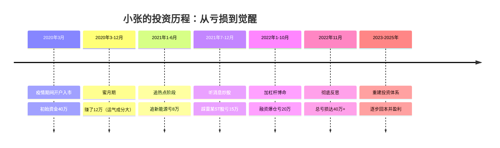
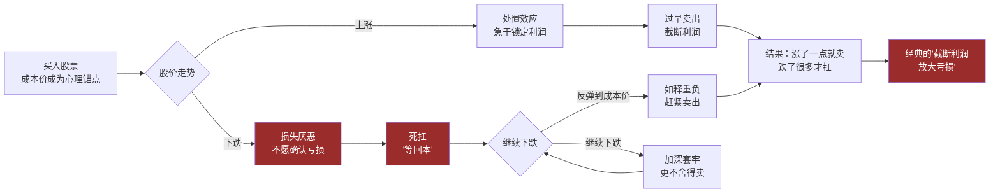
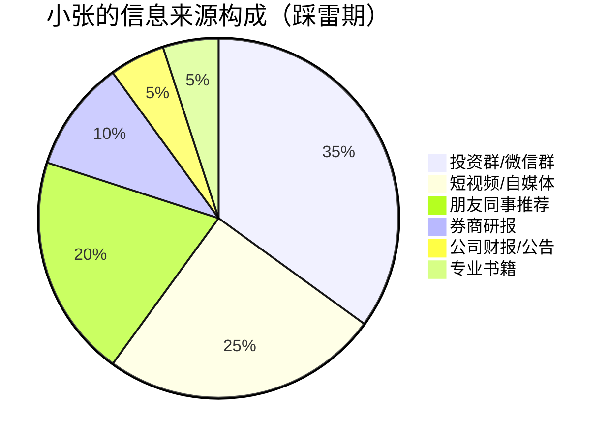
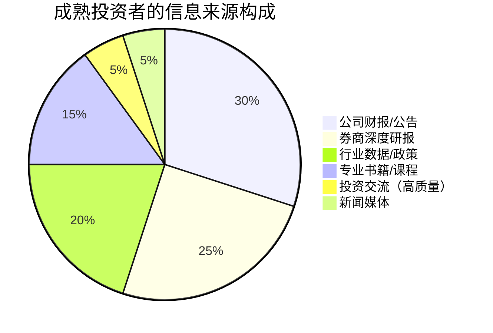
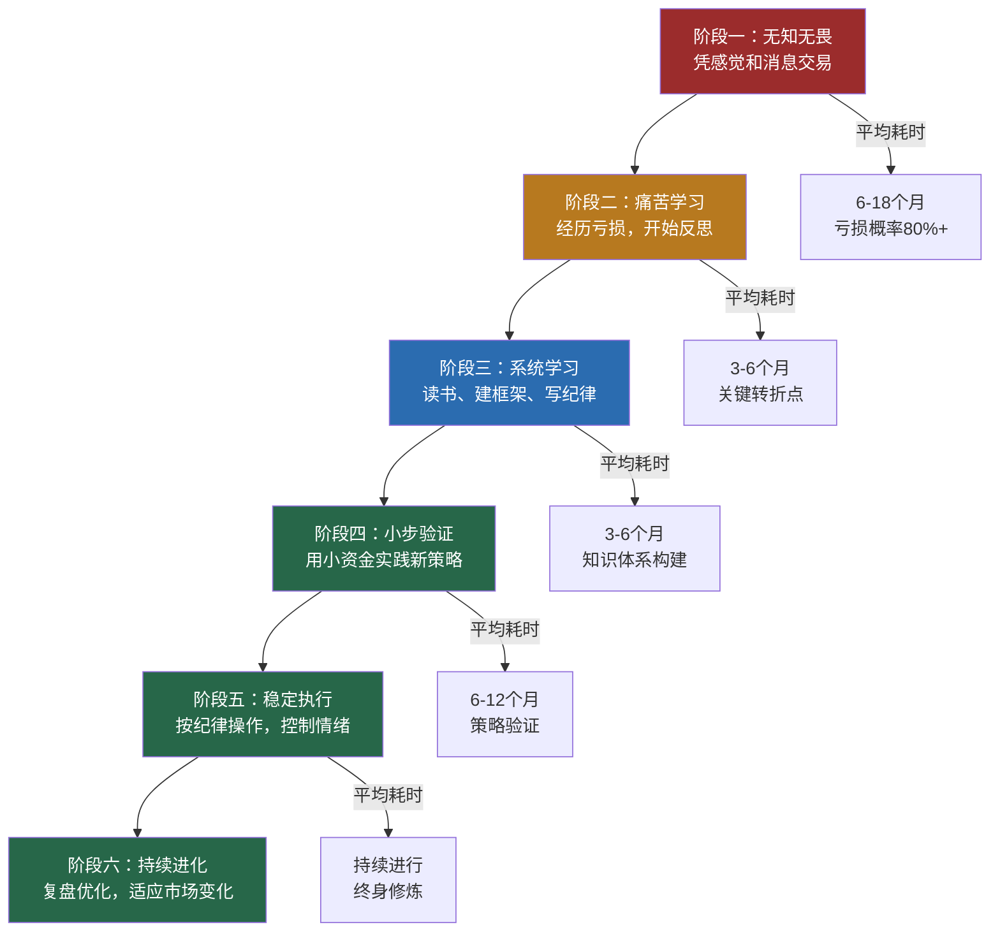

## 案例八：避免踩雷——小张的教训

> "投资中最重要的不是你赚了多少，而是你避开了多少陷阱。" —— 霍华德·马克斯

前面的案例展示了成功投资者的策略和心法，但真实的股市中，**亏损的故事远比盈利的故事多**。根据深交所发布的《个人投资者状况调查报告》，A股散户中长期盈利的比例不足20%，约60%的散户处于亏损状态，其中超过30%的散户亏损幅度超过50%。

这个案例的主角小张，就是那60%中的一员。他用三年时间，经历了几乎所有散户能犯的错误——追涨杀跌、听消息炒股、频繁交易、死扛亏损、加杠杆博命——最终亏掉了辛苦攒下的40万积蓄。但小张的可贵之处在于，他没有在失败中沉沦，而是痛定思痛，系统性地复盘了自己的每一次错误，最终形成了成熟的投资体系，实现了从"韭菜"到"理性投资者"的蜕变。

**这个案例的价值不在于教你如何赚钱，而在于帮你避开那些让人倾家荡产的坑。**

---

### 一、人物画像：小张是谁

#### 1.1 基本信息

| 属性 | 描述 |
|------|------|
| 姓名 | 小张（化名） |
| 年龄 | 入市时28岁，现在34岁 |
| 职业 | 互联网公司产品经理，年薪约30万 |
| 家庭状况 | 已婚，一个孩子，有房贷 |
| 性格特征 | 聪明好学、执行力强、但急躁、容易冲动 |
| 投资经历 | 2020年3月入市（疫情期间），至今6年 |
| 初始资金 | 约40万元（工作3年的积蓄） |

#### 1.2 小张的投资时间线总览



#### 1.3 小张的亏损全景

| 阶段 | 时间 | 错误类型 | 亏损金额 | 亏损原因 |
|------|------|---------|---------|---------|
| 蜜月期 | 2020.03-12 | 凭运气赚的钱 | +12万（浮盈） | 大盘反弹，买什么涨什么 |
| 追热点 | 2021.01-06 | 追涨杀跌 | -8万 | 高位追入新能源、半导体 |
| 听消息 | 2021.07-12 | 盲目跟风 | -15万 | 听"内幕消息"买ST股暴雷 |
| 加杠杆 | 2022.01-10 | 融资交易 | -20万 | 被迫平仓，割在最低点 |
| **合计** | **2020-2022** | **全面踩雷** | **约-31万** | **连本带利亏光** |

```text
初始投入：40万
蜜月期浮盈：+12万（纸面富贵）
实际亏损：-31万
最终账户：约21万（实际亏损约19万，加上浮盈回吐）

更痛的是机会成本：
  如果40万买入沪深300ETF并持有到2022年底 → 约42万（微赚）
  如果40万买入银行理财年化4% → 3年约45万
  小张的40万折腾3年变成了21万 → 实际损失约24万（含机会成本）
```

---

### 二、踩雷全过程复盘

#### 2.1 第一坑：蜜月期的虚假自信（2020年3-12月）

**场景还原：**

2020年3月，新冠疫情导致全球股市暴跌，A股从3100点跌至2646点。小张看到同事在股市里赚了钱，于是拿出40万积蓄开户入场。

```text
小张的入市时机：2020年3月23日（A股阶段性低点附近）
初始操作：
  买入宁德时代：100股 × 120元 = 12,000元
  买入隆基绿能：200股 × 25元 = 5,000元
  买入贵州茅台：100股 × 1,100元 = 110,000元
  买入某芯片ETF：100,000份 × 1.2元 = 120,000元
  买入某医药ETF：100,000份 × 1.5元 = 150,000元
```

**蜜月期的结果：**

| 标的 | 买入价 | 2020年底价格 | 涨幅 |
|------|--------|------------|------|
| 宁德时代 | 120元 | 350元 | +192% |
| 隆基绿能 | 25元 | 75元 | +200% |
| 贵州茅台 | 1,100元 | 1,900元 | +73% |
| 芯片ETF | 1.2元 | 1.8元 | +50% |
| 医药ETF | 1.5元 | 2.1元 | +40% |
| **组合总值** | **40万** | **约52万** | **+30%** |

**致命错觉的形成：**

小张在9个月内赚了12万，月均"收益"超过1.3万。他开始产生一系列错误认知：

```text
错觉一："我天生适合炒股" → 实际是赶上了大盘反弹期
错觉二："选股靠直觉就行" → 实际是蒙对了赛道
错觉三："股市来钱真快" → 忽视了风险的存在
错觉四："我不需要学习" → 把运气当成了能力

这就是行为金融学中的"自我归因偏差"：
  盈利时 → 归功于自己的判断力（"我真聪明"）
  亏损时 → 归咎于外部因素（"市场不好""政策打压"）
```

**教训一：运气不是能力，牛市里人人都是股神。**

> 判断你是否真的具备投资能力，不要看你在牛市里赚了多少，而要看你在熊市里亏了多少。任何一个在2020年3月买入A股的人，到年底大概率都是赚钱的——这不是你的能力，这是市场的恩赐。

---

#### 2.2 第二坑：追涨杀跌——新能源的诱惑（2021年1-6月）

**场景还原：**

2021年初，新能源赛道如日中天。宁德时代从350元一路涨到690元，隆基绿能从75元涨到120元。朋友圈、股吧、短视频平台上到处都是"新能源改变世界""碳中和万亿赛道"的论调。

小张的蜜月期收益让他信心爆棚，他做出了第一个致命决定：**把所有资金集中押注新能源。**

```text
小张2021年1月的操作：
  卖出贵州茅台（1,900元卖出，赚了80%）→ 回笼约19万
  卖出芯片ETF和医药ETF → 回笼约35万
  全仓买入宁德时代：350元 × 500股 = 175,000元
  全仓买入隆基绿能：80元 × 3000股 = 240,000元
  买入某新能源ETF：100,000份 × 2.5元 = 250,000元

  总投入新能源赛道：约66.5万（占总资金的95%以上）
```

**追涨的心理机制：**

```mermaid
flowchart TD
    A[看到新能源持续上涨] --> B[产生FOMO心理<br>（Fear of Missing Out）]
    B --> C[自我合理化<br>"这是趋势，不会跌"]
    C --> D[集中买入<br>满仓单一赛道]
    D --> E[短期继续涨<br>强化错误认知]
    E --> F[信心爆棚<br>忽视风险信号]
    F --> G[行业估值泡沫<br>政策转向信号出现]
    G --> H[暴跌开始<br>不舍得止损]
    H --> I[越跌越扛<br>"只是回调"]
    I --> J[深度套牢<br>亏损30%+]
    
    style A fill:#276749,color:#fff
    style B fill:#9b2c2c,color:#fff
    style D fill:#9b2c2c,color:#fff
    style F fill:#9b2c2c,color:#fff
    style J fill:#9b2c2c,color:#fff
```

**崩盘过程：**

| 时间 | 宁德时代 | 隆基绿能 | 新能源ETF | 小张的组合 |
|------|---------|---------|----------|-----------|
| 2021.01（买入） | 350元 | 80元 | 2.5元 | 66.5万 |
| 2021.06 | 550元（+57%） | 110元（+38%） | 3.8元（+52%） | 约96万 |
| 2021.12 | 690元（+97%） | 85元（+6%） | 3.2元（+28%） | 约85万 |
| 2022.04 | 410元（+17%） | 62元（-23%） | 2.2元（-12%） | 约58万 |
| 2022.10 | 380元（+9%） | 50元（-38%） | 1.8元（-28%） | 约49万 |

```text
小张的新能源之旅：
  2021年6月：浮盈约30万 → 觉得自己是投资天才
  2021年12月：浮盈约18万 → 开始下跌，但坚信"只是回调"
  2022年4月：浮亏约8万 → 不舍得卖，"等涨回来"
  2022年10月：浮亏约17万 → 恐慌割肉，卖出在最低点附近

  最终亏损：约8万元（在蜜月期利润12万的基础上，实际倒亏）
```

**追涨杀跌的行为金融学分析：**

小张犯了经典的行为金融学错误组合：

| 心理偏差 | 表现 | 后果 |
|---------|------|------|
| 羊群效应 | 看到别人赚钱就跟风买入 | 高位接盘 |
| 过度自信 | 把运气当能力，集中持仓 | 无分散化保护 |
| 处置效应 | 盈利时急于卖出，亏损时死扛 | 截断利润，放大亏损 |
| 锚定效应 | 以买入价为锚，不愿止损 | 越套越深 |
| 确认偏差 | 只看利好信息，忽视利空 | 错过退出时机 |

**教训二：追热点是散户亏损的第一大原因。当你听到"这次不一样"的时候，恰恰应该提高警惕。**

---

#### 2.3 第三坑：听消息炒股——"内幕消息"的陷阱（2021年7-12月）

**场景还原：**

小张在追新能源亏损后，急于"回本"。2021年7月，他在一个投资群里认识了一位"老股民"老王，老王声称有"内幕消息"：某上市公司即将被央企重组，股价至少翻倍。

```text
"老王"的推荐：
  标的：*ST银河（化名，实际为某退市股的原型）
  逻辑：央企即将注入资产，重组方案已获批准
  目标价：从3元涨到8元以上
  信息来源："我朋友在券商投行部，消息绝对可靠"

小张的操作：
  2021年8月：投入15万买入*ST银河，均价3.2元，约47,000股
  2021年9月：股价涨到4.1元，浮盈约27% → 老王说"继续持有，目标8元"
  2021年10月：股价开始下跌到3.5元 → 老王说"正常洗盘"
  2021年11月：公司公告被证监会立案调查 → 股价跌到2.1元
  2021年12月：确认财务造假，退市风险 → 股价跌到1.2元
  2022年3月：正式退市 → 投资归零
```

**"内幕消息"的真相：**

```text
为什么"内幕消息"99%是骗局？

1. 真正的内幕知情人不敢说
   - 内幕交易是刑事犯罪，最高可判10年有期徒刑
   - 2023年证监会查处内幕交易案件超过200起
   - 没有任何理性的专业人士会冒着坐牢的风险在群里"免费分享"

2. 你听到的"内幕消息"都是N手信息
   - 信息传播链：真正的知情人 → 核心圈 → 朋友圈 → 投资群 → 你
   - 等你听到的时候，早就被市场消化了
   - 或者更糟——这根本就是虚假信息

3. "内幕消息"的常见套路
   阶段一：建仓期 → 庄家先低位买入
   阶段二：传播期 → 通过各种渠道散布利好消息
   阶段三：拉升期 → 散户跟风买入推高股价
   阶段四：出货期 → 庄家高位卖出，散户接盘
   阶段五：崩盘期 → 消息被证伪，股价暴跌
   
   这就是经典的"坐庄"套路
```

**如何识别"内幕消息"骗局：**

| 信号 | 正规投资建议 | "内幕消息"骗局 |
|------|------------|--------------|
| 信息来源 | 公开研报、财报、公告 | "我朋友说""内部人士透露" |
| 分析逻辑 | 数据+逻辑+估值 | "肯定涨""至少翻倍" |
| 风险提示 | 充分披露风险 | "稳赚不赔""包你赚钱" |
| 推荐频率 | 偶尔、有深度 | 天天推、生怕你错过 |
| 利益关系 | 明确声明（如持仓） | 遮遮掩掩或声称"无私分享" |
| 推荐标的 | 主流、有基本面 | 垃圾股、ST股、小盘股 |

**教训三：天下没有免费的午餐，越是"确定"的消息越要警惕。如果你的信息来源是一个投资群里的陌生人，那你不是在投资，你是在赌博。**

---

#### 2.4 第四坑：加杠杆——融资爆仓的深渊（2022年1-10月）

**场景还原：**

经历了追热点亏8万和踩雷ST股亏15万后，小张的账户从高峰时的约52万缩水到约22万。他急于回本，在"老股民"的怂恿下，开通了融资融券账户，开始借钱炒股。

```text
小张的融资操作：
  2022年1月：自有资金22万，融资20万，总仓位42万
  买入标的：某光伏龙头（赌新能源反弹）
  
  维持担保比例 = 总资产 / 负债 = 42万 / 20万 = 210%
  警戒线：150%（需追加担保物）
  平仓线：130%（强制卖出）

  2022年4月：股价下跌25%，总资产缩水到约31.5万
  维持担保比例 = 31.5 / 20 = 157.5% → 接近警戒线
  券商通知：追加担保物或减仓
  
  小张的选择：追加5万现金 → 维持担保比例回升到182.5%
  
  2022年9月：股价继续下跌30%，总资产缩水到约27万
  维持担保比例 = 27 / 20 = 135% → 再次逼近平仓线
  券商通知：立即追加担保物
  
  小张的选择：已经没有多余资金 → 被迫平仓
  券商强制卖出：以市价卖出全部持仓
  实际回收：约27万
  偿还融资：20万
  剩余：约7万
  
  初始自有资金：22万 + 追加5万 = 27万
  最终剩余：约7万
  融资爆仓亏损：约20万
```

**杠杆的数学本质：为什么散户不该用杠杆**

```text
杠杆的"收益放大"幻觉：

假设你有10万，融资10万，总仓位20万（2倍杠杆）

场景A：股价上涨20%
  总资产 = 20万 × 1.2 = 24万
  还融资10万 → 剩余14万
  自有资金收益率 = (14-10)/10 = 40%（看起来不错！）

场景B：股价下跌20%
  总资产 = 20万 × 0.8 = 16万
  还融资10万 → 剩余6万
  自有资金亏损率 = (10-6)/10 = 40%（亏损也放大了！）

场景C：股价下跌40%
  总资产 = 20万 × 0.6 = 12万
  还融资10万 → 剩余2万
  自有资金亏损率 = (10-2)/10 = 80%（接近归零！）

场景D：股价下跌55%
  总资产 = 20万 × 0.45 = 9万
  还融资10万 → 不够还！倒欠1万！
  → 不仅本金亏光，还欠券商钱
```

**杠杆交易的风险矩阵：**

| 杠杆倍数 | 股价下跌多少会爆仓 | 散户承受能力 |
|---------|----------------|------------|
| 1.5倍 | 下跌33% | 大多数散户能承受 |
| 2倍 | 下跌25% | 约一半散户会在恐慌中割肉 |
| 2.5倍 | 下跌20% | 大多数散户无法承受 |
| 3倍 | 下跌16.7% | 几乎所有散户都会爆仓 |

```text
关键认知：A股的历史数据显示
  沪深300在任何一年内下跌超过20%的概率约为30%
  创业板在任何一年内下跌超过30%的概率约为25%
  
  这意味着：使用2倍以上杠杆，你有约25-30%的概率在一年内爆仓
  这不是"可能发生"，这是"大概率会发生"
```

**教训四：杠杆是散户的坟墓。永远不要借钱炒股，永远不要用你输不起的钱去投资。巴菲特说过："如果你聪明，你不需要杠杆；如果你不聪明，杠杆会害死你。"**

---

#### 2.5 第五坑：死扛亏损——"等回本"的心理陷阱

贯穿小张整个亏损过程的，是一个致命的行为模式：**死扛亏损，不愿止损。**

```text
小张的止损记录：

新能源追涨：
  盈利30%时 → 没有卖出（"还能涨"）
  盈利18%时 → 没有卖出（"回调完了会继续涨"）
  亏损12%时 → 没有卖出（"等涨回来再卖"）
  亏损26%时 → 恐慌卖出（卖在最低点附近）

ST股踩雷：
  盈利27%时 → 没有卖出（"目标8元，还早呢"）
  亏损34%时 → 没有卖出（"已经跌这么多了，卖了就亏定了"）
  亏损63%时 → 还没卖（"万一重组成功呢"）
  退市归零 → 想卖都卖不掉了
```

**"等回本"心理的行为金融学分析：**



**正确的止损框架：**

| 止损维度 | 错误做法 | 正确做法 |
|---------|---------|---------|
| 时间止损 | 亏损后无限期等待 | 设定最大持有期（如6个月无改善则卖出） |
| 幅度止损 | "跌了50%了，卖了就亏定了" | 设定亏损上限（如-15%无条件止损） |
| 基本面止损 | 不看基本面只看价格 | 基本面恶化立即卖出，无论盈亏 |
| 机会成本 | "万一涨回来呢" | "这笔钱放在别处是否收益更高" |

**教训五：止损不是认输，是保命。散户最大的亏损不是来自选股错误，而是来自"明明知道错了却不肯走"。**

---

### 三、小张踩雷的系统性原因分析

小张的每一次亏损看似独立，实则有共同的根源。深入分析这些根源，是避免重蹈覆辙的关键。

#### 3.1 缺乏投资知识体系

```text
小张入市前的知识储备：
  ✗ 没有读过任何投资经典书籍
  ✗ 不会看财务报表
  ✗ 不了解估值方法
  ✗ 不知道什么是资产配置
  ✗ 不理解风险管理
  ✓ 知道"低买高卖"
  ✓ 会看K线图（但不懂技术分析的原理）

类比：这就像一个不会游泳的人直接跳进深水区——
  刚好赶上退潮（牛市），可能扑腾到岸边
  一旦遇到暗流（熊市），必然溺水
```

#### 3.2 没有投资纪律

| 纪律要素 | 小张的状态 | 正确做法 |
|---------|----------|---------|
| 投资计划 | 没有，想到什么买什么 | 每笔交易前写下买入理由、目标价、止损价 |
| 仓位管理 | 满仓操作，集中持仓 | 单只股票不超过总仓位20% |
| 止损规则 | 没有，靠感觉 | 预设止损位，严格执行 |
| 交易频率 | 平均每周交易2-3次 | 降低到每月1-2次 |
| 情绪管理 | 追涨杀跌，冲动交易 | 交易前冷静24小时 |

#### 3.3 信息来源严重依赖"噪音"



**对比：成熟投资者的信息来源构成**



---

### 四、小张的觉醒与重建

#### 4.1 觉醒时刻

2022年11月，小张在融资爆仓后，账户只剩下约7万。他终于意识到：**以他目前的认知水平，继续在股市里操作只会越亏越多。**

他做了一个在当时看来"认怂"、但事后证明极其正确的决定：**清仓所有股票，暂停交易，开始系统性学习。**

```text
小张的觉醒清单（2022年11月-2023年3月）：

阅读书单：
  1.《聪明的投资者》—— 格雷厄姆 → 理解安全边际
  2.《漫步华尔街》—— 马尔基尔 → 理解市场效率
  3.《股票作手回忆录》—— 利弗莫尔 → 理解投机的代价
  4.《投资最重要的事》—— 马克斯 → 理解风险
  5.《行为金融学》—— 理查德·塞勒 → 理解自己的心理偏差
  6.《财务报表分析与证券估值》—— 利伯曼 → 学会看财报
  7.《指数基金投资指南》—— 银行螺丝钉 → 理解被动投资

学习成果：
  - 建立了完整的投资知识框架
  - 理解了风险与收益的关系
  - 认识了自己的心理弱点
  - 学会了基本的财务分析
  - 了解了不同投资策略的优劣
```

#### 4.2 重建投资体系

经过4个月的系统学习，小张建立了一套完整的投资决策框架：

**（一）资产配置框架**

| 资产类别 | 配置比例 | 投资标的 | 目的 |
|---------|---------|---------|------|
| 安全垫 | 30% | 货币基金+国债 | 应急资金+心理安全 |
| 核心仓位 | 50% | 沪深300+中证500指数基金 | 跟踪市场，长期持有 |
| 卫星仓位 | 15% | 精选个股（不超过5只） | 追求超额收益 |
| 学习仓位 | 5% | 小额试验新策略 | 持续进化 |

**（二）选股检查清单**

```text
买入前必须回答的问题（全部为"是"才能买入）：

基本面检查：
  □ 我能用一句话说清楚这家公司是做什么的吗？
  □ 公司过去5年的ROE是否持续>12%？
  □ 公司的自由现金流是否为正？
  □ 公司的资产负债率是否<60%（金融除外）？
  □ 公司的营收和利润是否在持续增长？

估值检查：
  □ 当前PE是否低于行业平均水平？
  □ 当前PE是否处于历史30%分位以下？
  □ 如果股价下跌30%，我是否愿意加仓？

风险检查：
  □ 最坏的情况是什么？我能承受吗？
  □ 这笔投资占总仓位的比例是否<20%？
  □ 我是否有明确的止损位？

心态检查：
  □ 我买入的理由是基于数据还是基于"感觉"？
  □ 我是否受到了群里/朋友圈的影响？
  □ 如果买入后立刻下跌20%，我会怎么做？
```

**（三）交易纪律**

```text
小张的"投资宪法"（贴在电脑旁边）：

第一条：永远不用杠杆
  - 不开通融资融券
  - 不借钱炒股
  - 不用信用卡/消费贷投资

第二条：永远不满仓单一标的
  - 单只股票最大仓位：20%
  - 单一行业最大仓位：30%
  - 必须保留10%以上的现金

第三条：永远有止损
  - 个股止损线：-15%（无条件卖出）
  - 组合止损线：-10%（暂停交易，复盘反思）
  - 止损后至少冷静一周再交易

第四条：永远不听"消息"
  - 不加入任何"荐股群"
  - 不看短视频炒股教程
  - 只基于公开信息做决策

第五条：永远保持学习
  - 每月至少读一本投资书籍
  - 每季度写一次投资复盘
  - 每年更新一次投资策略
```

#### 4.3 重建期的实际表现（2023-2025年）

| 年份 | 策略 | 年化收益 | 最大回撤 | 关键操作 |
|------|------|---------|---------|---------|
| 2023年 | 80%指数基金+20%现金 | +8.5% | -6% | 定投沪深300+中证500 |
| 2024年 | 70%指数+20%个股+10%现金 | +15.2% | -9% | 精选3只高ROE股票 |
| 2025上半年 | 60%指数+25%个股+15%现金 | +12%（年化） | -7% | 策略稳定运行 |

```text
小张重建期的账户变化：
  2022年11月（觉醒时）：约7万
  2023年12月：约12万（投入5万工资+收益）
  2024年12月：约28万（投入10万工资+收益）
  2025年6月：约38万（投入5万工资+收益）

  虽然还没有完全回本（相比初始40万+后续投入），
  但投资体系已经成熟，长期来看有信心实现稳定盈利
```

---

### 五、散户踩雷的完整避坑指南

基于小张的教训，以及A股散户的普遍踩雷模式，我们整理了一份完整的避坑指南。

#### 5.1 十大踩雷模式及应对策略

| 序号 | 踩雷模式 | 典型表现 | 避坑策略 |
|------|---------|---------|---------|
| 1 | 追涨杀跌 | 热门股涨了才追入 | 建立估值体系，只在合理估值时买入 |
| 2 | 听消息炒股 | 依赖"内幕消息"交易 | 只基于公开信息决策，拒绝一切荐股群 |
| 3 | 频繁交易 | 每周交易多次 | 降低交易频率，每次交易前冷静24小时 |
| 4 | 集中持仓 | 全仓单只股票或单一行业 | 分散配置，单只不超过20% |
| 5 | 不设止损 | 亏损后无限期等待 | 买入前预设止损位，严格执行 |
| 6 | 加杠杆 | 融资融券、借钱炒股 | 永远不用杠杆，只用闲钱投资 |
| 7 | 倒金字塔加仓 | 越涨越买，高位重仓 | 正金字塔加仓：跌了才加，越跌越加 |
| 8 | 忽视基本面 | 只看K线不看财报 | 学会基本的财务分析，至少看三张报表 |
| 9 | 情绪化交易 | 恐慌卖出、贪婪买入 | 建立交易纪律，用规则代替情绪 |
| 10 | 不做复盘 | 重复犯同样的错误 | 每笔交易记录原因，定期复盘 |

#### 5.2 踩雷预警信号清单

当你出现以下任何一种行为时，说明你正在"踩雷"的路上：

```text
红色预警（立即停止交易）：
  🔴 想借钱或加杠杆来"回本"
  🔴 想把所有钱押在一只股票上"搏一把"
  🔴 因为亏损而失眠、焦虑、影响工作
  🔴 开始相信某个群里的"大佬"能带你赚钱
  🔴 想卖掉房子/车子来炒股

黄色预警（暂停交易，冷静一周）：
  🟡 一周内交易超过3次
  🟡 在没有新研究的情况下加仓
  🟡 因为"不甘心"而继续持有亏损股票
  🟡 开始频繁看盘（每天超过5次）
  🟡 对家人隐瞒自己的投资亏损

绿色信号（你走在正确的路上）：
  🟢 每笔交易都有书面的理由和计划
  🟢 能够平静地接受短期浮亏
  🟢 主动学习投资知识，而不是只看涨跌
  🟢 投资决策不受他人情绪影响
  🟢 生活质量和投资盈亏脱钩
```

#### 5.3 从"韭菜"到"理性投资者"的成长路径



---

### 六、小张的反思笔记

小张在重建期间写了一本"投资日记"，以下是其中几段最深刻的反思：

#### 6.1 关于"回本心态"

> "我在亏损20万的时候，满脑子想的都是'怎么把这20万赚回来'。这个想法本身就是错的——它让我做出更冒险的决策，结果亏了更多。后来我明白了：**投资的目标不是回本，而是在当前的起点上做出最优决策。**过去的亏损是沉没成本，不应该影响未来的决策。"

#### 6.2 关于"能力圈"

> "我在互联网行业工作，对新能源、半导体、医药一窍不通，却重仓了这些行业。我以为看看研报、刷刷短视频就算'研究'了。现在我知道了：**真正的能力圈，是你能说清楚一家公司未来5年的竞争优势在哪里。**如果我说不清楚，我就没有资格买它的股票。"

#### 6.3 关于"慢就是快"

> "我用了3年亏了40万，然后用了3年才慢慢回血。如果当初我把40万买入沪深300指数基金，什么都不做，到今天大约值45万。**看起来最笨的方法，往往是最好的方法。**而我自以为聪明的操作，反而让自己付出了巨大的代价——不仅是金钱，还有时间和心态。"

#### 6.4 关于"投资与生活"

> "最让我后悔的不是亏了多少钱，而是那三年里，我因为炒股亏钱而暴躁、失眠、和妻子吵架、工作分心。**投资应该是让生活更好的工具，而不是让你的生活变得更糟的毒药。**如果你发现投资正在毁掉你的生活质量，那就停下来——不是所有的钱都该赚，也不是所有的游戏都该参与。"

---

### 七、如果你已经踩雷了怎么办

#### 7.1 紧急止损流程

```mermaid
flowchart TD
    A[发现自己踩雷了] --> B{是否还在亏损中？}
    B -->|是| C[立即评估：基本面是否恶化？]
    B -->|否| D[复盘：是运气还是能力？]
    
    C -->|基本面恶化| E[果断止损<br>不要等"回本"]
    C -->|基本面正常<br>只是短期下跌| F[评估仓位是否过重]
    
    E --> G[卖出后冷静至少1个月]
    F -->|仓位过重| H[减仓到合理比例]
    F -->|仓位合理| I[继续持有<br>但设好止损位]
    
    G --> J[开始系统性学习]
    H --> J
    I --> K[定期检视<br>按纪律执行]
    D --> J
    
    J --> L[重建投资体系]
    L --> M[用小资金验证新策略]
    M --> N[逐步扩大资金规模]
    
    style A fill:#9b2c2c,color:#fff
    style E fill:#9b2c2c,color:#fff
    style G fill:#b7791f,color:#fff
    style L fill:#276749,color:#fff
```

#### 7.2 心态重建四步法

```text
第一步：接受现实
  - 亏损已经发生，无法改变
  - 沉没成本不应影响未来决策
  - 对自己说："我交了学费，现在要学到东西"

第二步：系统复盘
  - 列出每一笔亏损交易
  - 分析每一笔的亏损原因
  - 区分"系统性错误"和"偶然性因素"
  - 找到反复出现的错误模式

第三步：重建知识
  - 至少读5本经典投资书籍
  - 学会看财务报表
  - 理解估值方法
  - 了解行为金融学

第四步：小步验证
  - 用不超过总资金10%的金额实践新策略
  - 至少验证6个月
  - 确认策略有效后再逐步扩大资金
```

---

### 八、案例总结：小张给所有散户的忠告

小张用自己的惨痛经历，总结出了以下忠告：

```text
忠告一：不要在牛市末期入市
  最好的入市时机是熊市末期，但人性让你在牛市末期才入场
  如果你发现自己是因为"看到别人赚钱"才开户的，先停下来

忠告二：先学习，后投资
  你在投资上花的学习时间，应该至少等于你花在选手机上的时间
  买一部5000元的手机你会看无数评测
  投入40万买股票你却只看一个群消息——这合理吗？

忠告三：承认自己是普通人
  你不是天才，你无法预测市场
  接受这个事实后，你反而会做出更好的投资决策
  普通人最好的策略：指数基金定投+长期持有

忠告四：投资不是生活的全部
  有稳定的工作收入，才是投资的最大底气
  如果投资让你焦虑到影响工作，说明你投入的金额超出了承受能力

忠告五：远离噪音
  退出所有荐股群
  取关所有短视频炒股博主
  不和任何人讨论"明天涨还是跌"
  把时间花在读财报、读经典、做复盘上
```

**小张的故事告诉我们：在股市中，活得久比赚得多更重要。避免踩雷，就是最好的投资策略。**

---

> *"投资的第一条规则是不要亏钱，第二条规则是记住第一条。" —— 沃伦·巴菲特*
