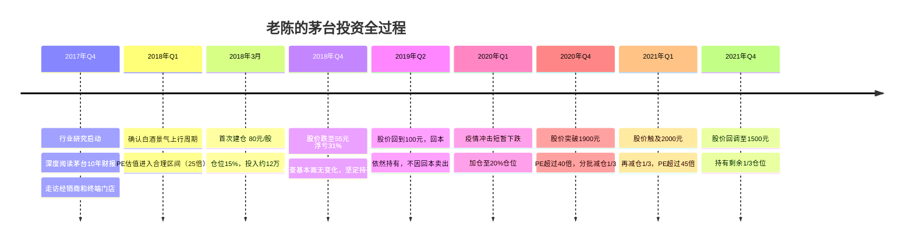
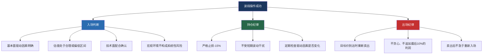
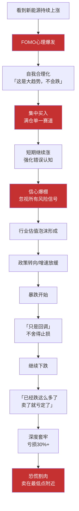
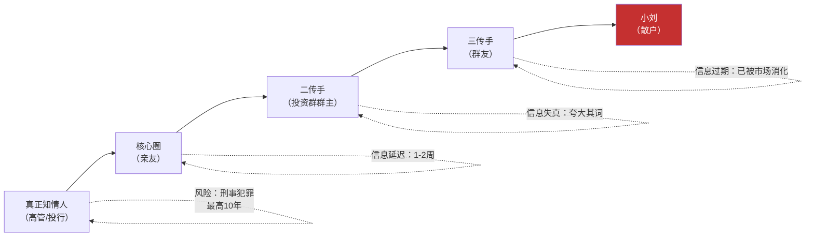
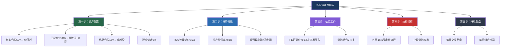
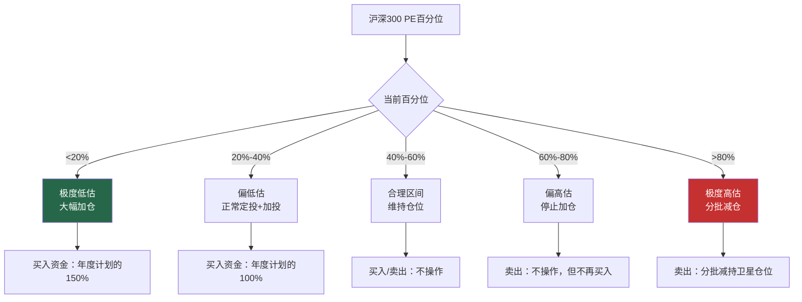

## 九、真实投资案例分析

> "一切理论都是灰色的，唯生命之树常青。" —— 歌德

前面的案例分别展示了八种独立策略的运作逻辑，但真实的投资世界远比单策略教科书复杂——一个人可能同时持有价值股和成长股，在牛市中做波段，在熊市中做定投，在恐惧中割肉，在贪婪中加仓。**本章的案例不再聚焦单一策略，而是还原真实投资者在完整市场周期中的多维决策过程**，展示理论如何在实战中变形、冲突、融合。

九个案例分为三组：**三组成功实战**（不同策略的真实回报验证）、**三组典型亏损**（散户最常犯的致命错误）、**三组逆境翻盘**（从失败中重建的投资体系）。每个案例都有具体的人物画像、完整操作记录、决策心理分析和可量化的经验教训。

---

### 第一组：成功实战——三种策略的真实回报

#### 案例一：消费股长线投资——从80元到2000元的茅台之旅

**人物画像：**

| 属性 | 描述 |
|------|------|
| 投资者 | 老陈（化名），45岁，外企财务总监 |
| 投资经验 | 入市12年，前5年交了不少学费 |
| 资金规模 | 初始投入约40万元（占家庭流动资产30%） |
| 性格特征 | 耐心、理性、财务分析能力扎实 |
| 投资风格 | 集中持仓价值股，季度检视，极少交易 |

**完整操作时间线：**



**分析框架——五步法完整应用：**

老陈的操作之所以成功，是因为他严格执行了"选股→估值→建仓→持有→卖出"五步法的每一步：

**第一步：行业分析（2017年底）**

白酒行业正处于"量减价升"的结构性升级阶段：

| 指标 | 2016年 | 2017年 | 趋势 |
|------|--------|--------|------|
| 行业产量（万千升） | 1358 | 1198 | 下降11.8% |
| 高端白酒收入占比 | 15% | 22% | 持续提升 |
| 行业CR5（前五集中度） | 18% | 24% | 加速集中 |
| 茅台终端价格（元） | 1100 | 1600 | 溢价明显 |

关键判断：**行业总量在收缩，但高端白酒的蛋糕在变大，龙头企业的市场份额在提升。** 这是一个典型的"结构性机会"——不需要行业整体增长，只需要好公司切走更大的蛋糕。

**第二步：公司分析——护城河评估**

| 护城河维度 | 具体表现 | 强度 |
|-----------|---------|------|
| 品牌 | 国宴用酒、社交货币、奢侈品属性 | ★★★★★ |
| 产能壁垒 | 地理标志保护、12987工艺、5年酿造周期 | ★★★★★ |
| 定价权 | 出厂价20年涨5.4倍，几乎不影响销量 | ★★★★★ |
| 渠道 | 先款后货、经销商排队拿货 | ★★★★☆ |
| 财务质量 | ROE>30%、净利率>50%、净现比>1.0 | ★★★★★ |

**第三步：财务验证（买入前的核心数据）**

```text
关键财务指标（2017年年报）：
  营收：582亿元（+49.8%）
  净利润：270亿元（+61.9%）
  毛利率：91.3%
  净利率：46.4%
  ROE：32.9%
  经营现金流/净利润：1.15
  资产负债率：28.7%（几乎零有息负债）
  应收账款：接近0（先款后货）

杜邦分析拆解：
  ROE 32.9% = 净利率46.4% × 周转率0.54 × 权益乘数1.32
  → 完全由利润率驱动，最高质量的ROE模式
```

**第四步：估值判断（2018年3月买入时）**

| 估值方法 | 计算结果 | 判断 |
|---------|---------|------|
| 历史PE区间 | 当前PE约25倍，历史中位数约28倍 | 偏低 |
| PE百分位 | 近5年百分位约30% | 偏低估区 |
| PEG | PE25 / 预期增速18% = 1.39 | 合理 |
| DCF（保守假设） | 内在价值约85-95元 | 当前80元有安全边际 |

综合判断：**估值合理偏低，可以建仓。**

**第五步：持有过程中的心理考验与应对**

| 时间 | 股价 | 浮盈/浮亏 | 心理状态 | 错误冲动 | 正确应对 |
|------|------|----------|---------|---------|---------|
| 2018年10月 | 55元 | -31% | 恐惧、自我怀疑 | "基本面是不是看错了？" | 重新审视财报，核心指标全部稳健 |
| 2019年6月 | 100元 | +25% | 回本后想卖 | "好不容易回本，先保住" | 不因回本而卖，问自己：如果空仓会买吗？ |
| 2020年3月 | 1050元 | +1200% | 疫情恐慌 | "要不要先卖掉等跌完再买？" | 疫情不影响茅台长期逻辑，短暂冲击 |
| 2020年12月 | 1900元 | +2275% | 极度兴奋 | "还能涨，再等等" | PE>40倍，触发减仓纪律，卖出1/3 |
| 2021年2月 | 2000元 | +2400% | 贪婪与纪律的拉锯 | "卖早了怎么办？" | 继续执行减仓计划 |

**最终结果：**

```text
总投入：约40万元
分批卖出回收：约85万元（均价约1800元）
剩余持仓市值：约30万元（按1500元计）
总资产：约115万元
总收益率：约188%
持有时间：约3年
年化收益率：约42%

关键数据对比：
  如果80元买入后一直不卖到2000元 → 收益率2400%
  如果80元买入后一直不卖到1500元（回调后） → 收益率1775%
  老陈的实际操作（分批卖出） → 总资产115万，锁定大部分利润

结论：分批卖出虽然少赚了"纸面利润"，但规避了回调风险
      投资不是追求最高点卖出，而是在合理区间锁定收益
```

**核心教训：**

1. **好公司+好价格+耐心持有=超额回报。** 三者缺一不可——买茅台但690元追入（好公司+烂价格），结果是亏损；买茅台但2018年底55元恐慌割肉（好公司+好价格+没耐心），同样亏损。
2. **买入后下跌31%不等于分析错误。** 短期价格由情绪驱动，长期价格由价值驱动。老陈的正确做法不是预测底部，而是确认基本面没变后坚定持有。
3. **分批卖出是理性纪律，不是卖飞。** 没有人能精确卖在最高点，但有人能系统性地在高估区间锁定利润。

---

#### 案例二：科技股波段操作——三次精准出击的芯片龙头

**人物画像：**

| 属性 | 描述 |
|------|------|
| 投资者 | 小李（化名），32岁，半导体行业工程师 |
| 投资经验 | 入市5年，技术分析+基本面结合 |
| 资金规模 | 总资金约60万元 |
| 性格特征 | 理性冷静、执行力强、时间充裕 |
| 投资风格 | 波段操作为主，辅以趋势跟踪 |

**三次操作完整记录：**

**第一次波段（2020年3-6月）——疫情暴跌后的科技股修复**

```text
入场逻辑：
  1. 宏观：全球央行大放水，流动性宽松
  2. 行业：芯片国产替代逻辑不变，短期暴跌是情绪
  3. 估值：某芯片设计龙头PE跌至30倍，历史中位数约45倍
  4. 技术：股价在年线附近获支撑，MACD底背离

操作细节：
  买入价：50元（2020年3月23日，阶段性低点附近）
  仓位：10%（6万元）
  止损位：42.5元（-15%）
  目标位：75-80元（PE回到45-50倍）
  
持有过程中的心理记录：
  第1周：股价继续小幅下跌到46元，浮亏8% → 检查止损位，未触发
  第2周：开始反弹，回到50元 → 回本，想卖 → 拒绝冲动
  第4周：涨到60元，盈利20% → 接近目标区，开始关注
  第6周：涨到68元 → 接近目标，设置移动止盈
  第8周：涨到80元 → PE达到50倍，触发卖出信号

卖出价：80元（2020年6月中旬）
持有时间：约3个月
收益率：60%
投入6万，回收9.6万，盈利3.6万
```

**第二次波段（2020年9-11月）——业绩超预期驱动**

```text
入场逻辑：
  1. 公司：半年报营收+45%，净利润+60%，超市场预期
  2. 行业：芯片缺货潮开始，产业链涨价预期强烈
  3. 估值：股价回调到70元，PE约35倍，低于历史中位数
  4. 技术：20日均线拐头向上，量价配合

操作细节：
  买入价：70元
  仓位：10%
  止损位：59.5元（-15%）
  目标位：100元（PE回到45倍）

持有过程：
  买入后持续震荡3周 → 坚持持有
  第5周：三季报预增公告，股价跳空高开
  第7周：股价突破100元 → PE达到45倍，卖出

卖出价：100元
持有时间：约2个月
收益率：43%
投入6万，回收8.6万，盈利2.6万
```

**第三次波段（2021年1-2月）——年报行情**

```text
入场逻辑：
  1. 公司：年报预告净利润+80%，全年业绩大超预期
  2. 行业：芯片缺货潮持续，涨价周期确认
  3. 估值：回调到90元，PE约40倍
  4. 市场：春季躁动行情启动

这次操作的关键变化——更加果断：
  前两次操作积累的信心，但同时警惕过度自信
  设置更严格的止盈：目标价120元（PE约53倍）
  仓位控制：依然只用10%，不因前两次成功而加仓

卖出价：120元
持有时间：约1个月
收益率：33%
投入6万，回收8万，盈利2万
```

**三次波段操作总复盘：**

| 操作 | 买入价 | 卖出价 | 持有期 | 收益率 | 核心驱动 |
|------|--------|--------|--------|--------|---------|
| 第一次 | 50元 | 80元 | 3个月 | 60% | 流动性宽松+估值修复 |
| 第二次 | 70元 | 100元 | 2个月 | 43% | 业绩超预期 |
| 第三次 | 90元 | 120元 | 1个月 | 33% | 年报行情+缺货涨价 |
| **累计** | - | - | **6个月** | **228%** | **纪律+认知** |

```text
三次操作的复利计算：
  初始资金：6万
  第一次后：6万 × 1.60 = 9.6万
  第二次后：9.6万 × 1.43 = 13.7万
  第三次后：13.7万 × 1.33 = 18.2万
  半年总收益：12.2万（228%）

关键对比：
  如果6万买入后一直持有到120元（从50元）→ 收益140%
  小李的波段操作（3次进出）→ 总收益228%
  
  波段操作的额外收益来源：
  1. 每次卖在估值高位，买在估值低位 → 估值差收益
  2. 复利效应：1.6×1.43×1.33=3.02 vs 1.0→2.4
```

**波段操作成功的关键要素拆解：**



**核心教训：**

1. **波段操作不是"猜顶猜底"，而是"低估买、高估卖"的系统化执行。** 小李每次买入都有明确的估值依据，每次卖出都有明确的触发条件。
2. **仓位纪律是生命线。** 三次操作都只用10%仓位，即使某次判断错误，总亏损也只有1.5%。波段操作的风险不在于单次失败，而在于因成功而加码。
3. **卖出后不急于重新入场。** 小李每次卖出后至少等2-4周再寻找新机会，避免"卖出后马上后悔又买回来"的情绪陷阱。

---

#### 案例三：指数基金定投——穿越牛熊的懒人投资法

**人物画像：**

| 属性 | 描述 |
|------|------|
| 投资者 | 小王（化名），27岁，互联网运营 |
| 投资经验 | 完全零基础，听同事推荐开始 |
| 资金规模 | 每月定投3000元，持续3年 |
| 性格特征 | 工作忙碌、没时间研究个股、能坚持纪律 |
| 投资风格 | 纯被动定投，几乎不操作 |

**定投全过程数据记录：**

```text
定投策略设计：
  标的：沪深300ETF联接基金（管理费0.5%/年）
  金额：每月3000元
  日期：每月15日（固定，不选时）
  止盈规则：年化收益率>15%时分批止盈
  加投规则：沪深300 PE百分位<20%时，定投金额翻倍
```

**逐月定投数据：**

| 时间段 | 沪深300点位 | PE(TTM) | PE百分位 | 月投入 | 累计投入 | 累计份额 | 市值 | 浮盈率 |
|--------|-----------|---------|---------|--------|---------|---------|------|--------|
| 2018年1月 | 4400 | 15.4 | 65% | 3000 | 3000 | 682 | 3000 | 0% |
| 2018年6月 | 3600 | 11.8 | 25% | 3000 | 18000 | 4563 | 16427 | -8.7% |
| 2018年12月 | 3010 | 10.3 | 8% | 6000 | 39000 | 11862 | 35705 | -8.4% |
| 2019年6月 | 3820 | 12.6 | 35% | 3000 | 57000 | 15594 | 59569 | +4.5% |
| 2020年3月 | 3670 | 11.9 | 20% | 6000 | 87000 | 22479 | 82498 | -5.2% |
| 2020年6月 | 4170 | 13.5 | 45% | 3000 | 96000 | 23746 | 99021 | +3.1% |
| 2020年12月 | 5210 | 16.7 | 80% | 3000 | 108000 | 24422 | 127239 | +17.8% |
| 2021年2月 | 5600 | 17.8 | 90% | 3000 | 114000 | 24959 | 139770 | +22.6% |

**止盈操作记录：**

```text
2020年12月检查：
  年化收益率 = (127239 - 108000) / 108000 / (3年) ≈ 6%
  → 未达15%止盈线，继续持有

2021年1月检查：
  年化收益率 ≈ 14.5%
  → 接近止盈线，密切关注

2021年2月检查：
  年化收益率 ≈ 16%
  → 超过15%止盈线，启动分批止盈
  卖出1/3 → 约4.7万元
  
2021年3月：
  年化收益率约18%
  卖出1/3 → 约4.7万元

2021年4月：
  年化收益率约20%
  卖出最后1/3 → 约4.8万元

止盈总回收：约14.2万元
定投总投入：约11.7万元
净利润：约2.5万元
3年定投总收益率：约21.4%
年化收益率：约6.7%（复利计算约8.9%）
```

**定投期间的心理曲线：**


**为什么小王能坚持下来：**

小王能坚持3年定投，不是因为他意志力超人，而是因为他做了几件关键的事：

1. **自动化扣款**：设置银行自动转账，每月15日自动扣款3000元到基金账户。不给自己"要不要投"的决策机会。
2. **不看账户**：设置了每季度才打开一次账户看收益，减少每日波动带来的情绪干扰。
3. **提前写好计划**：在开始定投前就写下"止盈15%、加投百分位<20%"的规则，贴在电脑旁。有了白纸黑字的承诺，执行起来更容易。
4. **找了个"定投伙伴"**：和同事互相监督，每个月互相确认"定投了没有"。

**关键数据对比（定投 vs 其他选择）：**

| 方案 | 3年投入 | 3年后市值 | 收益率 | 年化 |
|------|---------|----------|--------|------|
| 小王的定投 | 11.7万 | 14.2万 | 21.4% | ~8.9% |
| 2018年1月一把买入 | 11.7万 | 14.8万 | 26.5% | ~8.1% |
| 存银行定期(年化3%) | 11.7万 | 12.8万 | 9.4% | 3.0% |
| 什么都不做 | 11.7万 | 11.7万 | 0% | 0% |

有意思的是，定投的收益率（21.4%）略低于一把买入（26.5%），这是因为2018年初的点位相对较高。但定投的核心优势不在收益率，而在**心理可承受性**——如果小王在2018年初一把投入11.7万，到年底浮亏近1万时，他有70%的概率会在恐慌中割肉。定投把"一次大决策"分解成了"36次小决策"，极大降低了心理压力。

**核心教训：**

1. **定投的本质不是"抄底"，而是"放弃择时"。** 市场下跌时你买到更多份额，市场上涨时你买到更少份额，长期下来成本被自然摊薄。
2. **止盈是定投的另一半。** 不止盈的定投就是"坐过山车"——2021年如果不止盈，到2022年底浮亏将超过20%。
3. **加投规则能显著提升收益。** 在PE百分位<20%（极度低估）时翻倍定投，相当于"别人恐惧时贪婪"的量化执行。

---

### 第二组：典型亏损——三种散户最常见的致命错误

#### 案例四：追涨杀跌——新能源的诱惑与深渊

**人物画像：**

| 属性 | 描述 |
|------|------|
| 投资者 | 小赵（化名），29岁，互联网产品经理 |
| 投资经验 | 入市1年，蜜月期赚了钱 |
| 资金规模 | 约50万元（工作积蓄+蜜月期浮盈） |
| 性格特征 | 聪明、急躁、容易受社交媒体影响 |
| 核心问题 | 把运气当能力，追热点不追价值 |

**完整亏损过程：**

```text
阶段一：蜜月期的虚假自信（2020年3-12月）

小赵2020年3月疫情低点开户入市，初始资金38万。
  买入宁德时代 120元/股 → 年底350元（+192%）
  买入隆基绿能 25元/股 → 年底75元（+200%）
  买入某芯片ETF 1.2元 → 年底1.8元（+50%）
  组合总值：38万 → 约50万（+32%）

错误认知形成：
  「我天生适合炒股」→ 实际是大盘系统性反弹
  「选股靠直觉就行」→ 实际是蒙对了赛道
  「股市来钱真快」→ 忽视了风险的存在

阶段二：集中押注新能源（2021年1-6月）

小赵受到朋友圈和短视频"新能源改变世界"论调影响，
将所有资金集中到新能源赛道：
  卖出芯片ETF → 回笼约27万
  全仓买入宁德时代 350元 × 400股 = 14万
  全仓买入隆基绿能 80元 × 2500股 = 20万
  买入新能源ETF 2.5元 × 10万份 = 25万
  总投入新能源：约59万（占总资金95%+）

2021年6月：组合市值约85万，浮盈约26万
  → 「我是投资天才」

阶段三：崩盘（2021年7月-2022年10月）

| 时间 | 宁德时代 | 隆基绿能 | 新能源ETF | 组合市值 |
|------|---------|---------|----------|---------|
| 2021.06 | 550元 | 110元 | 3.8元 | ~85万 |
| 2021.12 | 690元 | 85元 | 3.2元 | ~78万 |
| 2022.06 | 510元 | 58元 | 2.4元 | ~55万 |
| 2022.10 | 380元 | 45元 | 1.8元 | ~42万 |

  2021年12月：浮盈缩窄，但坚信「只是回调」
  2022年6月：开始浮亏，但不舍得卖
  2022年10月：浮亏约17万，恐慌割肉
  
最终结果：
  初始投入：38万
  蜜月期浮盈：+12万（纸面富贵）
  追涨后实际亏损：约-17万
  账户余额：约21万
  实际净亏损：约17万（38万→21万）
  加上机会成本：如果存银行3年约43万
  总损失：约22万
```

**追涨杀跌的心理机制深度分析：**



**小赵犯的行为金融学错误组合：**

| 心理偏差 | 具体表现 | 造成的后果 |
|---------|---------|----------|
| 自我归因偏差 | 把牛市收益归功于自己 | 过度自信，加大仓位 |
| 羊群效应 | 看到朋友圈都赚就跟风 | 高位集体接盘 |
| 处置效应 | 盈利想卖，亏损死扛 | 截断利润，放大亏损 |
| 锚定效应 | 以买入价为心理锚点 | 不止损的借口 |
| 确认偏差 | 只看利好信息，忽视利空 | 错过退出窗口 |
| 沉没成本 | 「已经投入这么多了」 | 越套越深 |

**如果小赵用正确方法操作，会怎样：**

```text
替代方案一：不追热点，坚持初始分散配置
  保持芯片ETF + 医药ETF + 宁德时代 + 隆基绿能的分散组合
  2022年10月组合回撤约30%（而非集中持仓的50%+）
  且分散组合中有部分标的（如茅台）跌幅较小

替代方案二：如果要投新能源，设定严格纪律
  仓位上限：30%（而非95%）
  止损线：-15%无条件止损
  估值纪律：PE超过行业历史90%分位时减仓
  
  结果：即使新能源大跌，总亏损控制在10%以内
```

**核心教训：**

1. **追热点是散户亏损的第一大原因。** 当你听到"这次不一样"的时候，恰恰应该提高警惕。每一次行业泡沫都有"新故事"——2015年的互联网+、2020年的新能源、2023年的AI——但泡沫破裂的逻辑从未改变。
2. **分散不是保守，是免费的保险。** 如果小赵把95%集中在一个赛道的仓位降到30%，即使新能源暴跌50%，总亏损也只有15%，而非50%。
3. **牛市里人人是股神，熊市里才知道谁在裸泳。** 判断投资能力，不要看你在牛市赚了多少，而要看你在熊市亏了多少。

---

#### 案例五：听消息炒股——"内幕消息"的万丈深渊

**人物画像：**

| 属性 | 描述 |
|------|------|
| 投资者 | 小刘（化名），35岁，私企中层管理 |
| 投资经验 | 入市3年，自认为"消息灵通" |
| 资金规模 | 约30万元 |
| 核心问题 | 依赖非公开信息做决策，忽视基本面分析 |

**踩雷全过程：**

```text
信息来源：某投资微信群中的"资深股民"老王

老王的推荐（2021年7月）：
  标的：*ST某股（化名）
  逻辑："央企即将注入资产，重组方案已获内部批准"
  目标价："从3元涨到8元以上"
  信息来源："我朋友在券商投行部，消息绝对可靠"
  承诺："稳赚不赔，错过这次再等十年"

小刘的操作：
  2021年8月：投入15万，均价3.2元，买入约47000股
  2021年9月：股价涨到4.1元，浮盈27%
    → 老王说「继续持有，目标8元」
    → 小刘想加仓，但没有更多资金
  2021年10月：股价跌到3.5元
    → 老王说「正常洗盘，主力在吸筹」
  2021年11月：公司公告被证监会立案调查
    → 股价暴跌到2.1元
    → 老王说「这是利空出尽，很快会反弹」
  2021年12月：确认财务造假，启动退市程序
    → 股价跌到1.2元
  2022年3月：正式退市
    → 投资归零

最终亏损：15万元，血本无归
```

**"内幕消息"的传播链条与真相：**



**"内幕消息"骗局的典型特征识别清单：**

| 信号维度 | 正规投资建议 | "内幕消息"骗局 |
|---------|------------|--------------|
| 信息来源 | 公开研报、财报、公告 | "我朋友说""内部人士透露" |
| 分析逻辑 | 数据+逻辑+估值模型 | "肯定涨""至少翻倍" |
| 风险提示 | 充分披露下行风险 | "稳赚不赔""包你赚钱" |
| 推荐频率 | 偶尔推荐、有深度分析 | 天天推、催促你买入 |
| 推荐标的 | 主流蓝筹或成长股 | ST股、小盘股、不知名股 |
| 利益关系 | 明确声明持仓情况 | 声称"无私分享""利益无关" |
| 失败案例 | 有历史判断错误记录 | 永远"正确"、从不复盘 |
| 社交形象 | 低调务实、承认不确定性 | 炫富+包装"投资大师"形象 |

**为什么真正的内幕消息轮不到你：**

```text
逻辑一：法律风险
  内幕交易是刑事犯罪，《证券法》第191条
  最高可判10年有期徒刑 + 非法所得1-5倍罚款
  2023年证监会查处内幕交易案件超200起
  没有任何理性的专业人士会冒坐牢风险在群里免费分享

逻辑二：信息衰减
  真正知情人 → 核心圈(1-2人) → 朋友圈(10-20人) → 投资群(500人) → 你
  等传到你这里，信息已经：
    - 被市场部分消化（股价已提前反应）
    - 被传播者夸大（为了显得消息有价值）
    - 可能根本是虚假信息（庄家散布的诱饵）

逻辑三：利益分析
  如果某人真的有"内幕消息"，他为什么分享给你？
    假设A：他想帮你赚钱 → 不合逻辑，陌生人没有利他动机
    假设B：他想卖课/卖会员 → 你付的钱比他"消息"的价值低得多
    假设C：他是庄家的"喇叭" → 需要散户接盘，你就是接盘侠
    假设D：他自己也信了 → 他也是被骗的，你们一起亏
```

**正确做法——信息来源的健康结构：**

| 信息来源 | 占比 | 说明 |
|---------|------|------|
| 公司财报/公告 | 30% | 第一手信息，最可靠 |
| 券商深度研报 | 25% | 专业分析师的研究成果 |
| 行业数据/政策文件 | 20% | 判断行业趋势的依据 |
| 专业书籍/课程 | 15% | 建立分析框架的基础 |
| 高质量投资交流 | 5% | 经过筛选的专业社群 |
| 新闻媒体 | 5% | 了解市场情绪，但不作为决策依据 |
| 群聊/小道消息 | 0% | **永远不要作为投资依据** |

**核心教训：**

1. **天下没有免费的午餐，越是"确定"的消息越要警惕。** 如果你的信息来源是投资群里的陌生人，那你不是在投资，你是在赌博。
2. **投资决策必须基于公开信息和逻辑推理。** 即使"消息"偶尔正确，你也无法建立可重复的盈利模式。
3. **亏损15万后最重要的事：搞清楚钱是怎么亏的。** 如果不复盘，同样的错误会反复发生。

---

#### 案例六：加杠杆——融资爆仓的数学必然

**人物画像：**

| 属性 | 描述 |
|------|------|
| 投资者 | 小孙（化名），31岁，券商客户经理 |
| 投资经验 | 入市4年，自认为"懂技术" |
| 资金规模 | 自有资金25万元 |
| 核心问题 | 急于回本，用融资放大风险 |

**融资爆仓全过程：**

```text
背景：
  小孙在追热点中亏损了约8万，账户从25万缩水到17万
  急于回本，听同事建议开通融资融券

操作过程：
  2022年1月：
    自有资金17万 + 融资15万 = 总仓位32万
    买入某光伏龙头（赌新能源反弹）
    维持担保比例 = 32万/15万 = 213%（安全线以上）

  2022年4月：股价下跌20%
    总资产缩水到25.6万
    维持担保比例 = 25.6万/15万 = 171%（接近警戒线150%）
    券商通知：追加担保物或减仓
    小孙选择：追加3万现金 → 比例回升到191%

  2022年9月：股价继续下跌25%
    总资产缩水到21万
    维持担保比例 = 21万/15万 = 140%（低于平仓线130%以上10个点）
    券商通知：立即追加担保物，否则强制平仓
    小孙已经没有多余资金

  2022年10月：强制平仓
    券商以市价强制卖出全部持仓
    实际回收：约21万
    偿还融资：15万
    剩余：约6万

  最终结果：
    自有资金投入：17万 + 追加3万 = 20万
    最终剩余：约6万
    实际亏损：14万（70%）
    仅用9个月，20万变成6万
```

**杠杆的数学本质——为什么散户不该用杠杆：**

```text
杠杆收益放大效应演示（假设2倍杠杆）：

你有10万，融资10万，总仓位20万

场景A：股价上涨20%
  总资产 = 20万 × 1.2 = 24万
  还融资10万 → 剩余14万
  自有资金收益率 = (14-10)/10 = 40%  ← 看起来不错

场景B：股价下跌20%
  总资产 = 20万 × 0.8 = 16万
  还融资10万 → 剩余6万
  自有资金亏损率 = (10-6)/10 = 40%  ← 亏损也放大了

场景C：股价下跌40%
  总资产 = 20万 × 0.6 = 12万
  还融资10万 → 剩余2万
  自有资金亏损率 = 80%  ← 接近归零

场景D：股价下跌55%
  总资产 = 20万 × 0.45 = 9万
  还融资10万 → 不够还！倒欠1万！
  不仅本金亏光，还欠券商钱
```

**杠杆倍数与爆仓概率对照表：**

| 杠杆倍数 | 股价下跌多少爆仓 | A股历史概率（任一年内） | 爆仓风险等级 |
|---------|----------------|---------------------|------------|
| 1.5倍 | -33% | 沪深300约15% | 中 |
| 2.0倍 | -25% | 沪深300约30% | 高 |
| 2.5倍 | -20% | 创业板约35% | 极高 |
| 3.0倍 | -16.7% | 创业板约40% | 近乎确定 |

```text
关键认知：
  使用2倍杠杆投资沪深300，你有约30%的概率在一年内爆仓
  使用2倍杠杆投资创业板，你有约35%的概率在一年内爆仓
  这不是"可能发生"，这是"大概率会发生"
  
  杠杆的致命特性：
  1. 收益放大是对称的——涨多少放大多少，跌多少也放大多少
  2. 但实际体验是不对称的——盈利时你想"再等等"，亏损时你想"回本再卖"
  3. 最致命的是：你没有选择止损的自由——券商会替你"止损"在最差的价格
```

**核心教训：**

1. **杠杆是散户的坟墓。** 巴菲特说过："如果你聪明，你不需要杠杆；如果你不聪明，杠杆会害死你。"
2. **永远不要借钱炒股，永远不要用你输不起的钱去投资。** 杠杆不仅放大亏损，还剥夺了你"等待反弹"的权利——券商会强制平仓，卖在最差的价格。
3. **急于回本是杠杆的催化剂。** 越是亏损后急于翻本，越容易使用杠杆，而杠杆又加速了亏损。这是一个死亡螺旋。

---

### 第三组：逆境翻盘——从亏损中重建的投资体系

#### 案例七：从亏损40万到稳定盈利——小张的觉醒之路

> 这个案例完整收录在《案例八：避免踩雷——小张的教训》中，此处提炼关键转折点。

**从亏损到盈利的核心转变：**

| 维度 | 亏损期（2020-2022） | 觉醒期（2022-2023） | 盈利期（2023-至今） |
|------|-------------------|-------------------|-------------------|
| 投资知识 | 零基础，凭感觉 | 系统学习7本经典 | 建立完整分析框架 |
| 信息来源 | 80%噪音 | 重新构建信息体系 | 75%专业来源 |
| 交易频率 | 每周2-3次 | 暂停交易4个月 | 每月1-2次 |
| 仓位管理 | 满仓单押 | 学习分散配置 | 5-7只标的分散 |
| 止损纪律 | 无止损 | 学习止损框架 | 严格执行-15%止损 |
| 情绪管理 | 追涨杀跌 | 认识自己的心理偏差 | 交易前冷静24小时 |

**小张重建的投资体系框架：**



**核心教训：**

1. **亏损不可怕，可怕的是不知道为什么亏。** 小张的40万亏损是"学费"，但如果他不复盘，这40万就白亏了。
2. **暂停交易是最高级的操作。** 认知不够时，最好的策略就是不操作。4个月的暂停期比4年的盲目操作更有价值。
3. **投资体系的建立需要"先破后立"。** 必须先承认自己的旧方法是错的，才能接受新方法。

---

#### 案例八：中年投资者的转型——从炒股到资产配置

**人物画像：**

| 属性 | 描述 |
|------|------|
| 投资者 | 老周（化名），42岁，中学教师 |
| 投资经验 | 入市10年，前7年一直在"炒股" |
| 家庭状况 | 已婚，两个孩子，有房贷 |
| 资金规模 | 约80万元（家庭全部可投资资产） |
| 核心问题 | 10年"炒股"总收益为零，扣除手续费实际亏损 |

**转型前的状态（2013-2020年）：**

```text
老周的7年"炒股"记录：
  交易频率：平均每周3-5次
  持仓标的：经常同时持有10-15只股票
  信息来源：股吧、微信群、朋友推荐
  年度盈亏：
    2013年：+8%
    2014年：+35%（牛市启动）
    2015年：-40%（股灾）
    2016年：+5%
    2017年：+12%
    2018年：-25%
    2019年：+15%
    2020年：+18%
    
  7年累计收益率：约-2%
  同期沪深300：约+35%
  同期银行理财(年化4%)：约+31%
  
  问题诊断：
    1. 牛市赚的被熊市亏回去（无风控）
    2. 手续费侵蚀（7年交易佣金约4万元）
    3. 频繁换股，错失长线机会
    4. 没有资产配置，全部在A股
```

**转型过程（2021年）：**

老周在2020年底读了一本资产配置的书，决定彻底改变：

```text
第一步：清仓所有个股（2021年1月）
  卖出15只持仓股票，回笼约80万
  这一步心理上最难——"卖了万一涨呢？"
  做法：闭眼一次性全卖，不给自己犹豫的机会

第二步：建立新的资产配置方案

| 资产类别 | 配置比例 | 金额 | 具体标的 |
|---------|---------|------|---------|
| A股价值基金 | 30% | 24万 | 沪深300增强基金 |
| 红利基金 | 20% | 16万 | 中证红利ETF |
| 可转债组合 | 15% | 12万 | 双低策略10只 |
| 债券基金 | 15% | 12万 | 纯债基金 |
| 海外指数 | 10% | 8万 | 纳斯达克100 ETF |
| 现金储备 | 10% | 8万 | 货币基金 |

第三步：建立再平衡规则
  每季度检查一次各类资产占比
  偏离目标比例超过5%时再平衡
  例如：A股基金涨到35%→卖出5%到其他类别
```

**转型后3年（2021-2024年）的对比：**

| 指标 | 转型前7年 | 转型后3年 |
|------|----------|----------|
| 策略 | 炒个股 | 多资产配置 |
| 交易频率 | 每周3-5次 | 每季度1次再平衡 |
| 年度最大回撤 | -40%（2015年） | -12%（2022年） |
| 3年累计收益 | -2% | +18% |
| 年化收益 | 约-0.3% | 约5.7% |
| 精力投入 | 每天1小时以上 | 每季度2小时 |
| 心理压力 | 常年焦虑 | 基本无感 |

**核心教训：**

1. **对大多数普通投资者来说，"炒股"不如"配置"。** 老周花了7年时间证明自己无法通过个股交易跑赢市场，但只需要1次转型就走上了正确道路。
2. **资产配置的价值不在于高收益，而在于低波动+可坚持。** 年化5.7%看似不高，但最大回撤只有12%，老周完全能承受，因此不会在恐慌中割肉。
3. **降低交易频率是投资升级的标志。** 从每周交易3-5次到每季度1次，不仅节省了大量时间精力，还减少了手续费和情绪干扰。

---

#### 案例九：牛市中的清醒者——如何在疯狂中全身而退

**人物画像：**

| 属性 | 描述 |
|------|------|
| 投资者 | 老吴（化名），50岁，退休公务员 |
| 投资经验 | 入市15年，经历过两轮完整牛熊 |
| 资金规模 | 约150万元 |
| 性格特征 | 沉稳、有主见、不容易被市场情绪带跑 |
| 投资风格 | 核心-卫星策略，核心仓位长期持有，卫星仓位灵活调整 |

**2020-2021年牛市的操作记录：**

```text
背景：
  2020年3月疫情低点后，全球央行大放水
  A股从2646点一路涨到2021年2月的3731点
  核心资产（茅台、宁德时代等）涨幅200%-500%
  市场情绪极度亢奋，"基金"上了微博热搜

老吴的操作：

2020年3月（沪深300约3500点）：
  PE百分位约15%，处于极度低估区间
  操作：维持核心仓位不动，卫星仓位加仓
  具体：加仓20万到沪深300ETF
  心态：「低估就买，不需要理由」

2020年7月（沪深300约4500点）：
  PE百分位约50%，回到合理区间
  操作：停止加仓，维持现有仓位
  心态：「涨了是好事，但不再追」

2020年12月（沪深300约5100点）：
  PE百分位约75%，开始偏高
  操作：卖出卫星仓位的50%（约15万）
  心态：「涨多了就该减一点，纪律大于感觉」

2021年1月（沪深300约5400点）：
  PE百分位约85%，明显高估
  操作：再卖出卫星仓位的30%（约10万）
  此时市场上：
    新基金发行火爆，一日售罄
    朋友劝他「别卖，还会涨」
    微信群里都在晒收益
  心态：「别人贪婪时恐惧，这是巴菲特说的，不是我说的」

2021年2月（沪深300约5600点，年内最高）：
  PE百分位约90%，极度高估
  操作：再减仓10万
  心态：「已经减到舒服的仓位了，涨到多少也不后悔」

2021年下半年-2022年：
  沪深300从5600点一路下跌到3500点，跌幅37%
  核心资产茅台从2627元跌到1245元，跌幅53%
  宁德时代从690元跌到200元，跌幅71%
  
  老吴的核心仓位虽然也下跌，但：
    1. 卫星仓位已在高位减持35万（锁定了利润）
    2. 核心仓位的标的基本面没有变化
    3. 手里有35万现金可以在低位加仓

2022年10月（沪深300约3500点）：
  PE百分位约10%，极度低估
  操作：用之前减持的35万现金，分3批加仓
  心态：「低估了就买回来，和2020年3月一样」
```

**老吴的操作逻辑框架：**



**为什么老吴能做到逆向操作：**

| 因素 | 具体表现 | 如何训练 |
|------|---------|---------|
| 经验 | 经历过2008年和2015年两轮牛熊 | 只有经历过才能真正理解周期 |
| 规则 | 提前写好PE百分位对应的操作表 | 有规则就不需要现场判断 |
| 心态 | 不怕"卖早了"的后悔 | 接受"不可能卖在最高点"的现实 |
| 仓位 | 核心仓位始终保持，只调卫星 | 核心仓位提供安全感，卫星仓位提供灵活性 |
| 现金 | 始终保持10%-15%现金储备 | 有现金才能在暴跌时加仓 |

**核心教训：**

1. **牛市中赚钱靠的不是选股，而是离场。** 2020年3月买入任何沪深300ETF到2021年2月都能赚60%，但如果不在高点减仓，到2022年底利润全部回吐。
2. **减仓不等于看空，而是执行纪律。** 老吴减仓时并不认为市场会跌，他只是按照"PE百分位>80%就减仓"的规则执行。
3. **现金储备是熊市中最大的资产。** 别人在恐慌割肉时，老吴有35万现金在低位加仓——这就是资产配置的真正威力。

---

### 跨案例共性规律提炼

从九个案例中，可以提炼出五条超越具体策略的共性规律：

#### 规律一：纪律是投资中唯一的"确定性"

| 案例 | 有纪律的结果 | 无纪律的结果 |
|------|------------|------------|
| 案例一（茅台） | 估值纪律→分批卖出锁定利润 | 不减仓→2022年利润回吐50% |
| 案例三（定投） | 止盈纪律→21%收益落袋 | 不止盈→坐过山车回到原点 |
| 案例四（追涨） | 无纪律→集中持仓亏损50% | 有纪律→分散持仓亏损15% |
| 案例九（牛市） | PE百分位纪律→高位减持 | 无纪律→牛市利润全部回吐 |

#### 规律二：买入价格决定大部分收益

```text
投资收益 = 基本面增长 × 估值变化

茅台案例：
  2018年买入（PE25倍）→ 3年后收益2400%
  2021年买入（PE45倍）→ 3年后亏损35%
  
宁德时代案例：
  2020年买入（PE30倍）→ 收益192%
  2021年底买入（PE100倍）→ 亏损71%
  
沪深300定投：
  2018年开始（PE10倍）→ 3年收益21%
  2021年开始（PE18倍）→ 3年仍在亏损
  
结论：同样的公司，买入价格不同，结果天差地别
      好公司买贵了照样亏钱
```

#### 规律三：分散是免费的保险

| 分散程度 | 遇到的风险事件 | 影响 |
|---------|-------------|------|
| 全仓新能源（案例四） | 新能源暴跌50% | 亏损50% |
| 分散配置（案例九） | 同期核心资产暴跌 | 亏损12% |
| 指数定投（案例三） | 任何单只暴雷 | 影响<0.3% |

#### 规律四：复利的前提是不中断

```text
复利的威力：
  年化8% × 30年 = 10倍
  年化12% × 30年 = 30倍
  年化15% × 30年 = 66倍

但一次重大亏损就会打断复利：
  连续29年年化15% → 累计收益57倍
  第30年亏损50% → 累计收益变成28.5倍
  30年的复利被一次亏损吃掉一半

结论：存活比暴利更重要
      先确保自己能留在牌桌上
```

#### 规律五：认知边界决定收益上限

| 投资者 | 认知水平 | 行为 | 结果 |
|--------|---------|------|------|
| 小赵（案例四） | 不理解估值和风险 | 追热点集中持仓 | 亏损50% |
| 小刘（案例五） | 不会分析基本面 | 听消息炒股 | 亏损100% |
| 小孙（案例六） | 不理解杠杆数学 | 融资博命 | 亏损70% |
| 老陈（案例一） | 深度理解护城河和估值 | 纪律化价值投资 | 收益188% |
| 小李（案例二） | 理解估值+技术面 | 纪律化波段操作 | 6个月收益228% |
| 老吴（案例九） | 经历两轮牛熊的智慧 | 资产配置+逆向操作 | 穿越牛熊稳定盈利 |

**核心公式：**

```text
你能赚到的钱 = 你的认知范围内的钱
超越认知的操作 = 赌博
赌博的长期结果 = 亏损

提升认知的方法：
  1. 系统学习（读经典，不是看股评）
  2. 小仓位试错（用10%资金积累经验）
  3. 记录复盘（每笔交易写下逻辑）
  4. 从案例学习（别人的学费可以是你的免费课程）
```

---

### 实操工具箱：从案例中提取的可复用模板

#### 模板一：投资决策检查清单

在做任何一笔投资之前，逐项检查：

```text
投资决策检查清单 v1.0

一、买入前（必须全部通过才能买入）
  □ 我能用3句话说清楚买入逻辑吗？
  □ 我知道这家公司怎么赚钱吗？
  □ 我看过最近3年的财报吗？
  □ 当前估值处于历史什么百分位？
  □ 我预设了止损位吗？具体是多少？
  □ 如果买入后立刻下跌30%，我能承受吗？
  □ 这笔投资占总资金的比例是否<20%？
  □ 我的信息来源是公开信息还是"消息"？

二、持有中（每季度检查一次）
  □ 买入逻辑是否仍然成立？
  □ 基本面是否发生变化？
  □ 估值是否严重偏离合理区间？
  □ 是否有更好的投资机会？

三、卖出时（触发以下任一条件即考虑卖出）
  □ 基本面发生根本性恶化
  □ 估值达到历史90%分位以上
  □ 触发预设的止损位
  □ 发现确定性更高的投资机会
```

#### 模板二：投资复盘记录表

每笔交易完成后填写：

```text
投资复盘记录表

日期：____年____月____日
标的：____________
方向：买入 / 卖出
价格：______元
仓位：______%（占总资金）

买入/卖出理由：
  ________________________________________________

当时的估值：
  PE：______倍 PE百分位：______%
  PB：______倍

预设止损位：______元（-______%）
预设目标位：______元（+______%）

实际结果（卖出后填写）：
  持有时间：______天
  收益率：______%
  与预期是否一致：是 / 否

复盘总结：
  做对了什么：________________________________
  做错了什么：________________________________
  下次如何改进：________________________________
```

#### 模板三：个人资产配置方案

```text
我的资产配置方案

总可投资资产：______万元

| 资产类别 | 目标比例 | 实际金额 | 具体标的 | 再平衡触发条件 |
|---------|---------|---------|---------|-------------|
| A股权益 | ____% | ______万 | _______ | 偏离±5% |
| 债券/可转债 | ____% | ______万 | _______ | 偏离±5% |
| 海外资产 | ____% | ______万 | _______ | 偏离±5% |
| 现金储备 | ____% | ______万 | _______ | - |

再平衡频率：每____个月检查一次
年度目标收益率：______%
最大可接受回撤：______%

特殊规则：
  当沪深300 PE百分位<20%时：权益仓位上限提升至______%
  当沪深300 PE百分位>80%时：权益仓位下限降低至______%
```

---

### 本节小结

九个案例覆盖了A股投资者最常见的九种命运：

| 案例 | 策略/错误 | 结果 | 核心教训 |
|------|---------|------|---------|
| 一 | 价值投资 | +188% | 好公司+好价格+耐心 |
| 二 | 波段操作 | +228% | 低估买+高估卖+纪律 |
| 三 | 指数定投 | +21% | 坚持+止盈+不择时 |
| 四 | 追涨杀跌 | -50% | 分散+不追热点 |
| 五 | 听消息 | -100% | 只信公开信息 |
| 六 | 加杠杆 | -70% | 永远不用杠杆 |
| 七 | 觉醒重建 | 从亏到盈 | 复盘+体系化 |
| 八 | 转型配置 | +18%/3年 | 从炒股到配置 |
| 九 | 牛市离场 | 穿越周期 | 纪律+逆向操作 |

**投资没有捷径，但有正道。** 正道就是：建立自己的投资体系，用纪律替代情绪，用分散替代集中，用耐心替代焦虑，用认知替代运气。九个案例的主人公，成功者的共同点不是他们更聪明，而是他们更理性、更有纪律、更能控制自己的情绪。

> "投资中最困难的事情不是发现好的投资机会，而是在机会出现时保持理性。" —— 查理·芒格
