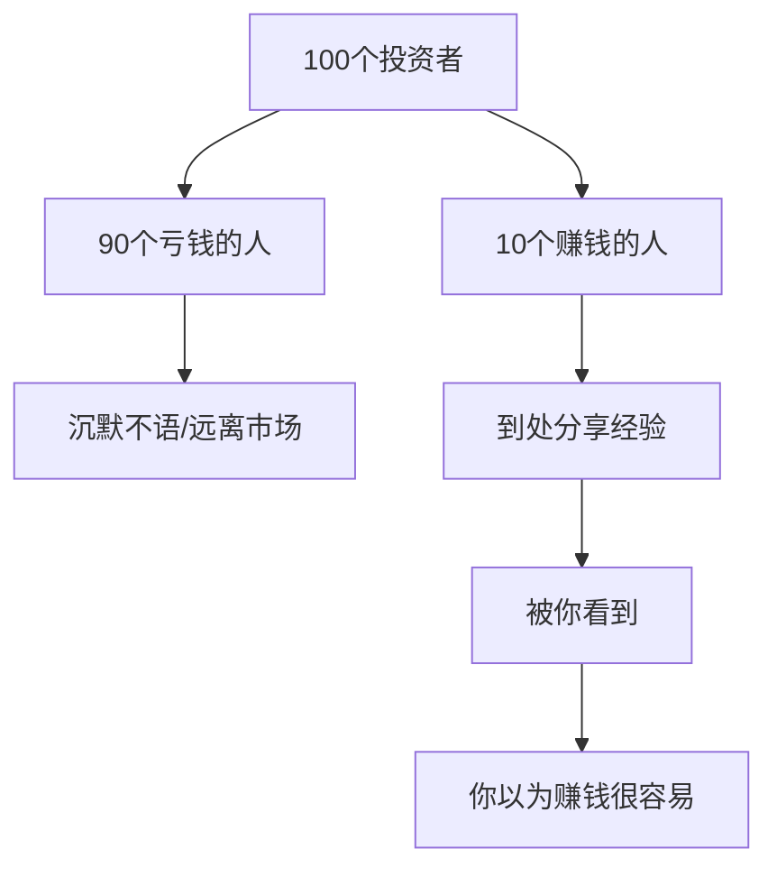
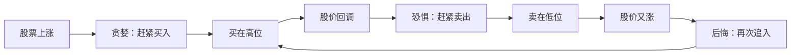
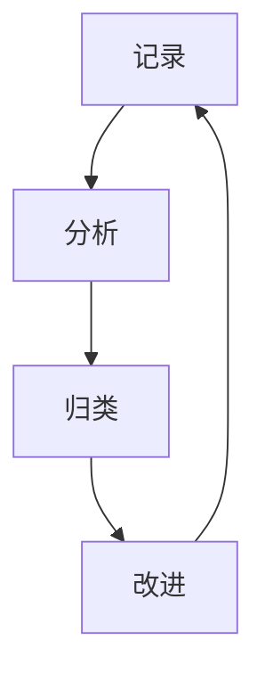

## 案例总结：投资中的常见错误

投资是一门需要在错误中不断学习的技艺。本章通过真实案例，系统梳理股票投资中最常见的错误类型，帮助读者识别自身可能存在的盲区，在犯错之前建立防线。每一个错误都配有具体案例、心理分析和纠正方案，做到"知其然，更知其所以然"。

---

### 一、认知层面的错误

认知错误是最根本的错误，它决定了你的投资框架是否正确。认知层面出了问题，后续所有操作都会偏离方向。

#### 1.1 把投资当成赌博——追求一夜暴富

**典型表现：**

- 听到"内部消息"就全仓买入，不看基本面
- 专挑低价股（"几块钱的股票跌也跌不到哪去"）
- 频繁追涨停板，期望每天赚几个点
- 用生活费甚至借款炒股

**真实案例：**

2020年7月，A股出现一波快速上涨行情。散户小李在朋友推荐下，将积攒两年的20万元全部买入某低价股（股价3.2元），理由是"这股票便宜，涨到10块就翻三倍"。买入后该股在两周内涨了15%，小李兴奋地加了5万元杠杆。随后股价开始下跌，小李不断补仓摊低成本，最终该股因财务造假被ST，股价跌至0.8元。小李亏损超过70%，总计亏损约18万元。

**错误分析：**

| 错误点 | 具体表现 | 正确做法 |
|--------|---------|---------|
| 以价格高低判断贵贱 | 认为3元的股票比100元的便宜 | 用PE、PB等估值指标判断 |
| 听消息炒股 | 没有独立研究就重仓 | 独立分析基本面后再决策 |
| 使用杠杆 | 融资加仓放大风险 | 新手绝不使用杠杆 |
| 没有止损纪律 | 亏损后不断补仓 | 设定止损位并严格执行 |

**纠正方案：**

- 建立"投资不是赌博"的核心认知：投资是基于概率和期望值的理性决策
- 学习基本的估值方法（PE、PB、DCF），用数据而非感觉做判断
- 制定资金管理规则：单只股票不超过总资金的20%，永远不用借来的钱投资
- 设定止损线：买入前就确定最大可承受亏损（通常8%-15%）

#### 1.2 幸存者偏差——只看到赚钱的人

**典型表现：**

- "我朋友买某某股票翻倍了，我也要买"
- 只关注成功的投资案例，忽略大量亏损者
- 被社交媒体上的"晒单"误导
- 认为"股市赚钱很容易"

**心理机制：**



幸存者偏差让你只看到胜利者的故事，从而严重高估了成功的概率。根据上交所统计数据，A股散户中长期盈利的比例不足10%。

**纠正方案：**

- 主动去了解亏损案例（各大论坛的"亏损帖"比"盈利帖"更有学习价值）
- 用统计数据替代个案：查看基金的平均收益率、散户的胜率等
- 建立"大多数人亏钱"的基础认知，以此为起点规划自己的策略

#### 1.3 混淆投资与投机

**投资与投机的核心区别：**

| 维度 | 投资 | 投机 |
|------|------|------|
| 关注点 | 企业内在价值 | 价格波动 |
| 持有周期 | 中长期（数月至数年） | 短期（数天至数周） |
| 决策依据 | 基本面分析、估值 | 技术面、消息面、情绪 |
| 收益来源 | 企业成长+分红 | 低买高卖的价差 |
| 风险特征 | 相对可控 | 高波动、高风险 |
| 适合人群 | 有耐心、愿学习 | 盘感好、纪律性强 |

**典型错误：** 用投资的心态买入（"我看好这只股票长期发展"），却用投机的心态持有（跌了10%就恐慌卖出）。或者反过来，用投机的心态买入（"这股票短期会涨"），却用投资的心态套牢（跌了不肯止损，说"我做长线"）。

**纠正方案：**

- 买入前明确自己是投资还是投机，并据此设定不同的操作策略
- 投资：深入研究基本面，设定合理目标价，按季报/年报跟踪
- 投机：严格设定止损止盈，不因"看好长期"而不止损

---

### 二、分析层面的错误

即使认知正确，分析方法的错误同样会导致严重的决策失误。

#### 2.1 只看单一指标做决策

**典型表现：**

- "这只股票PE只有8倍，太便宜了"（忽略行业特性和成长性）
- "这只股票连涨了5天，趋势很好"（忽略估值和基本面）
- "这家公司利润增长100%，一定很好"（忽略低基数效应和一次性收益）

**案例：低PE陷阱**

2021年初，某房地产公司PE仅5倍，看起来极度低估。投资者老王重仓买入，认为"PE这么低，肯定有上涨空间"。但他忽略了三个关键问题：

1. 房地产行业正在经历政策调控，未来盈利可能大幅下降
2. 该公司负债率超过80%，存在债务风险
3. PE低是因为市场在定价"未来盈利下滑"，而非"低估"

结果2021-2022年房地产行业深度调整，该公司股价下跌60%以上，PE反而从5倍升到了15倍（因为利润下降更快）。

**纠正方案：**

使用多维度交叉验证分析框架：

```text
完整分析 = 基本面 + 估值面 + 技术面 + 资金面 + 行业面

基本面：营收增长、利润率、ROE、负债率、现金流
估值面：PE（纵向/横向比较）、PB、PS、PEG
技术面：趋势、支撑压力、量价关系
资金面：主力资金流向、融资余额、大宗交易
行业面：行业景气度、政策方向、竞争格局
```

至少在3个以上维度达成一致时才做出决策。

#### 2.2 锚定效应——被买入价束缚

**心理机制：**

锚定效应是指人们在做决策时过度依赖第一次接收到的信息（"锚"）。在投资中，最常见的锚就是你的买入成本价。

**典型场景：**

- "等回本了我就卖"——即使基本面已经恶化
- "这股票从100跌到50了，肯定便宜"——不看当前估值是否合理
- "它之前涨到过80，现在只有40，一定还能回去"——忽略环境变化

**真实案例：**

投资者小张在2021年以每股150元的价格买入某消费白马股。之后股价持续下跌至80元，亏损近47%。小张始终不愿卖出，理由是"等回到150我就卖"。与此同时，如果他将资金转投其他更优质的标的，两年内完全有机会收回大部分亏损。但他被"150元"这个锚定死了，资金被锁在一只不断下跌的股票中长达两年。

**纠正方案：**

- 问自己一个关键问题："如果我现在没有持有这只股票，以当前价格，我会买入吗？"如果答案是否定的，就应该卖出
- 不要关注你的买入成本，关注的是这只股票当前的内在价值
- 定期（每季度）重新评估持仓，像审视一个全新投资一样

#### 2.3 确认偏差——只找支持自己的证据

**典型表现：**

- 买入一只股票后，只关注利好消息，忽略利空信号
- 在论坛和社区中只看多头的观点
- 把任何好消息都解读为"利好"，把坏消息解读为"利空出尽"
- 分析时先有结论，再找证据

**案例：**

2022年某新能源股从高位回落30%，投资者小陈已经持有且亏损。他在研究时：

- 看到"新能源政策利好"→认为"一定会涨回去"
- 看到"公司高管减持"→认为"高管也需要用钱嘛，正常"
- 看到"机构下调评级"→认为"机构经常错，他们不懂这家公司"
- 看到"行业产能过剩"→认为"过剩的是低端产能，高端不过剩"

最终该股又跌了40%，小陈损失惨重。

**纠正方案：**

- 强制自己写出"为什么要卖出这只股票"的3个理由
- 主动寻找反对意见：去看空方的分析报告
- 建立"魔鬼代言人"机制：每次买入决策前，找一个朋友帮你找毛病
- 写投资日记，记录每次决策的理由，事后复盘是否存在确认偏差

---

### 三、操作层面的错误

认知和分析都正确，操作环节出错同样会功亏一篑。

#### 3.1 追涨杀跌——情绪化交易

**行为模式：**



这个循环是散户亏钱的最主要原因之一。

**数据支撑：**

根据行为金融学研究，散户平均买入时点比最低价高20%-30%，卖出时点比最高价低20%-30%。也就是说，散户的择时操作不仅没有创造价值，反而在不断"反向操作"。

**真实案例：**

2020年3月，新冠疫情冲击全球股市，A股在3月中旬出现恐慌性下跌。散户老刘在连续暴跌中恐慌卖出全部持仓，总计亏损约8万元。卖出后仅一个月，市场就V型反转，老刘卖出的那几只股票平均反弹了40%以上。如果他不动，不仅不亏还能赚不少。

**纠正方案：**

- 制定交易计划并在盘前执行，避免在盘中做出冲动决策
- 使用"冷静期"规则：想买卖时，强制等待24小时再决定
- 设置自动化的条件单，用规则替代情绪
- 定投策略：定期定额买入，消除择时焦虑

#### 3.2 频繁交易——摩擦成本的隐形杀手

**成本计算：**

假设每次交易的综合成本（佣金+印花税+滑点）为0.15%，来看不同交易频率的成本差异：

| 交易频率 | 年交易次数 | 年摩擦成本 | 10年累计成本 |
|----------|-----------|-----------|-------------|
| 每月1次 | 12次 | 1.8% | 18% |
| 每周1次 | 52次 | 7.8% | 78% |
| 每天1次 | 240次 | 36% | 360% |
| 每天3次 | 720次 | 108% | 本金翻倍的损耗 |

频繁交易意味着即使你的选股能力平均水平，仅摩擦成本就能吃掉大部分利润。假设市场年均收益10%，每天交易1次的投资者需要获得46%的年收益才能与不交易的投资者打平。

**纠正方案：**

- 设定最低持有期限：买入后至少持有1个月
- 每次交易前问自己："这次交易的预期收益是否大于交易成本的10倍？"
- 限制每月交易次数（如不超过4次）
- 记录每笔交易，月末统计交易成本总额

#### 3.3 不设止损——小亏变大亏

**典型演变过程：**

| 阶段 | 亏损幅度 | 心理状态 | 典型行为 |
|------|---------|---------|---------|
| 第一阶段 | -5% | 轻微不安 | "正常回调，会涨回来" |
| 第二阶段 | -10% | 有些焦虑 | "再等等看，不能卖在最低点" |
| 第三阶段 | -20% | 恐惧但不愿认输 | "已经亏这么多了，卖了就真亏了" |
| 第四阶段 | -30% | 麻木 | "算了，就当长线投资了" |
| 第五阶段 | -50%+ | 绝望或放弃 | "不管了，留给子孙后代吧" |

**为什么止损如此重要：**

| 亏损幅度 | 需要涨多少才能回本 |
|---------|-------------------|
| -10% | +11.1% |
| -20% | +25% |
| -30% | +42.9% |
| -50% | +100% |
| -70% | +233% |
| -90% | +900% |

亏损到50%后，需要股价翻倍才能回本——这在A股平均需要2-3年，如果选错了股票，可能永远无法回本。

**纠正方案：**

- 买入前就设定止损位（一般8%-15%），写入交易计划
- 使用条件单自动执行止损，避免人为犹豫
- 止损不是认输，而是保存实力——"留得青山在，不怕没柴烧"
- 止损后不要急于翻本，先冷静复盘原因

#### 3.4 过度分散与过度集中

**过度分散的问题：**

- 持有20只以上股票，精力无法覆盖
- 每只股票仓位太小，即使大涨对总体收益影响也微乎其微
- 实质上变成了一个"劣质指数基金"，但交易成本远高于指数基金

**过度集中的问题：**

- 全仓甚至加杠杆单吊一只股票
- 一旦踩雷（财务造假、行业黑天鹅），可能损失惨重
- 心理压力极大，容易做出错误决策

**最优方案：**

| 投资者类型 | 建议持仓数量 | 单只上限 |
|-----------|------------|---------|
| 新手 | 3-5只 | 30% |
| 中级 | 5-8只 | 20% |
| 资深 | 8-15只 | 15% |

核心原则：每只股票你都能说出3个买入理由和2个主要风险。如果说不出来，说明研究不够深入，不应该持有。

---

### 四、心态层面的错误

投资到最后，比拼的不是智商，而是心态。心态错误往往最隐蔽、最难察觉。

#### 4.1 处置效应——过早卖出盈利股，过久持有亏损股

**心理机制：**

人类天生有"落袋为安"的倾向（盈利时急于兑现）和"逃避损失"的倾向（亏损时不愿面对）。这导致了一个反直觉的结果：投资者倾向于卖出赚钱的股票（锁定小利润），同时持有亏钱的股票（等待回本）。

**数据佐证：**

行为金融学的经典研究表明，投资者卖出盈利股票后继续上涨的概率约为60%，而卖出亏损股票后继续下跌的概率也约为60%。也就是说，你恰恰把最差的留在了手里，把最好的卖掉了。

**案例：**

投资者老赵同时持有两只股票：

- 股票A：盈利20%，老赵卖掉了（"落袋为安"）→ 半年内又涨了50%
- 股票B：亏损15%，老赵继续持有（"等回本"）→ 半年内又跌了30%

最终结果：赚了小钱（股票A），亏了大钱（股票B），整体亏损。

**纠正方案：**

- 让盈利奔跑，截断亏损——与你的本能反着来
- 对盈利股票设定移动止盈（如从最高点回撤10%卖出），而非固定止盈
- 对亏损股票设定硬止损，到了就走，不找借口

#### 4.2 从众心理——跟随"大众"

**典型表现：**

- "大家都在买，我也买"——牛市末期的典型行为
- "专家都推荐，肯定没错"——忽略专家可能有利益关联
- "这只基金规模这么大，肯定好"——规模大不等于收益好
- 社交媒体上的"抱团"效应

**案例：2021年核心资产泡沫**

2020年底至2021年初，"核心资产"概念盛行，大量散户和基金抱团白酒、医药、新能源等龙头股。某知名白酒股市盈率被推高至60倍以上（历史正常水平25-35倍）。

投资者小周在2021年2月看到"核心资产永远涨"的论调后，将50万积蓄全部买入该白酒股和几只相关基金。随后核心资产集体回调，该白酒股从最高点下跌超过50%，小周亏损约25万元。

**纠正方案：**

- 当所有人都在谈论某个投资机会时，恰恰是最危险的时候
- 建立独立思考能力：不因为别人买而买，不因为别人卖而卖
- 巴菲特名言："在别人贪婪时恐惧，在别人恐惧时贪婪"——这不是一句空话，而是需要纪律来执行的投资原则
- 关注市场情绪指标（如换手率、融资余额、新增开户数），当指标极度乐观时保持警惕

#### 4.3 过度自信——高估自己的能力

**典型表现：**

- "我已经炒了5年股，经验丰富"——但5年都在亏钱
- 连续几次盈利后觉得自己"悟道了"——可能是运气好
- 忽略市场环境对收益的影响——牛市中"股神"遍地
- 不愿意做记录和复盘——因为怕面对真实的收益率

**真相检验：**

请诚实地回答以下问题：

1. 你过去3年的年化收益率是多少？（大多数散户回答不出来）
2. 你的收益率是否跑赢了沪深300指数？（如果跑输了，不如买指数基金）
3. 你的盈利是来自能力还是运气？（牛市中赚钱不代表有能力）

**纠正方案：**

- 详细记录每笔交易，每季度计算真实收益率
- 与基准指数（如沪深300）做对比，诚实面对结果
- 如果连续2年跑不赢指数，老老实实买指数基金
- 保持谦逊：承认"我不知道"比自以为知道更有价值

#### 4.4 损失厌恶——对亏损的反应过度强烈

**科学解释：**

诺贝尔经济学奖得主卡尼曼（Kahneman）的研究表明，亏损带来的痛苦感约为同等金额盈利带来的快乐感的2-2.5倍。这意味着：

- 亏100元的痛苦 > 赚100元的快乐
- 为了逃避100元的亏损，人们可能愿意冒亏200元的风险
- 这导致了"死扛亏损"的行为

**在投资中的表现：**

- 不愿意止损（"割肉太痛了"）
- 亏损后急于翻本（报复性交易）
- 频繁查看账户（每次看到亏损都受到一次心理打击）
- 因为害怕亏损而完全不投资（把钱放在银行贬值）

**纠正方案：**

- 减少查看账户的频率：从每天改为每周甚至每月
- 把止损视为"保险费"而非"亏损"——你买保险不觉得亏，止损同理
- 用仓位管理降低单笔亏损的心理冲击：控制好每笔投资的金额

---

### 五、资金管理层面的错误

资金管理是投资的"生命线"，管理不善会让正确的分析也无法转化为盈利。

#### 5.1 仓位管理失控

**常见错误模式：**

1. **倒金字塔加仓**：随着股价上涨不断加仓，结果在最高点仓位最重
2. **满仓操作**：任何时候都保持满仓，没有留出机动资金
3. **借钱炒股**：使用融资融券超出自身承受能力

**正确做法——正金字塔建仓法：**

```text
初始建仓：计划仓位的30%（如计划投10万，先买3万）
第一次加仓：确认方向正确后加30%（再买3万）
第二次加仓：趋势确认后加20%（再买2万）
预留资金：保留20%作为应对意外的机动资金
```

这样做的好处：初始判断错误时损失有限，判断正确时虽然后面的成本高了但总体是赚的。

#### 5.2 没有资产配置概念

**典型错误：**

- 100%资金都在股票市场
- 不同风险等级的资产没有合理配比
- 不考虑自身年龄、收入、风险承受能力

**基础资产配置框架：**

| 年龄段 | 股票类 | 债券类 | 现金类 | 说明 |
|--------|--------|--------|--------|------|
| 25-35岁 | 60-70% | 20-30% | 10% | 年轻，承受能力强 |
| 35-45岁 | 50-60% | 30-40% | 10% | 家庭责任增加 |
| 45-55岁 | 40-50% | 35-45% | 15% | 稳健为主 |
| 55岁以上 | 20-30% | 40-50% | 20-30% | 保守为主 |

一个实用的公式（简化版）：股票配置比例 ≈ 100 - 你的年龄。例如30岁，可以配置70%在股票类资产。

#### 5.3 忽视应急资金

**规则：** 在投资之前，先确保有6-12个月生活费的应急资金存在流动性好的地方（如货币基金、银行活期）。

**为什么重要：** 如果没有应急资金，生活中遇到突发状况（失业、生病）时，你可能被迫在最不利的时间点卖出股票，把账面亏损变成真实亏损。

---

### 六、信息处理层面的错误

在信息爆炸的时代，如何处理信息本身就是一项核心能力。

#### 6.1 信息过载与噪音

**典型表现：**

- 每天刷大量财经新闻，但不加筛选
- 关注几十个"大V"，每天被各种观点轰炸
- 在多个股票群中接收大量碎片信息
- 把"听到"当成"知道"

**噪音的本质：**

市场中99%的短期信息对你的投资决策没有价值。真正影响股价的长期因素（行业趋势、公司竞争力、管理层质量）很少变化，每天波动的只是噪音。

**纠正方案：**

- 信息分级制度：
  - 一级信息（必须关注）：持仓公司的定期报告、重大公告、行业政策
  - 二级信息（选择性关注）：行业研究报告、优秀分析师的深度报告
  - 三级信息（尽量忽略）：日内涨跌评论、大V喊单、股吧情绪
- 每天固定的"信息时间"（如早上30分钟），其余时间专注工作
- 取关所有短期预测类内容，只关注长期价值分析

#### 6.2 后视偏差——"我早就知道了"

**典型表现：**

- 看到股价涨了说"我早就看好这只股票"
- 看到股价跌了说"我早就觉得有问题"
- 复盘时认为过去的涨跌都是"显而易见"的
- 不承认自己当初的判断是模糊的甚至错误的

**危害：** 后视偏差让你无法从错误中学习，因为你在心理上把错误的决策"改写"成了正确的。这种自我欺骗会导致同样的错误反复发生。

**纠正方案：**

- 写投资日记：在决策的同时记录理由和预期，事后对照
- 记录当时的心理状态和信息环境，不要事后用现在的眼光评判过去
- 接受"投资中存在不确定性"——很多事事后看很清楚，事前看都是模糊的

---

### 七、常见错误自检清单

将以下清单打印出来，放在你的投资笔记本中，每次做重大决策前逐项检查：

| 序号 | 检查项 | 是否通过 |
|------|--------|---------|
| 1 | 我是否做了独立分析，而非听消息？ | □ |
| 2 | 我是否从多个维度（基本面+估值+技术面）验证？ | □ |
| 3 | 我是否被买入成本价锚定？ | □ |
| 4 | 我是否只看了支持买入的理由？ | □ |
| 5 | 我是否设定了止损位？ | □ |
| 6 | 这笔投资占总资金的比例是否合理（<20%）？ | □ |
| 7 | 我是否用了借来的钱？ | □ |
| 8 | 当前市场情绪是否过热？ | □ |
| 9 | 我是否因为急于翻本而交易？ | □ |
| 10 | 如果明天就下跌20%，我能否承受？ | □ |

只要有任何一项未通过，都应该暂停决策，重新审视。

---

### 八、从错误中成长的框架

认识到错误只是第一步，更重要的是建立系统性的纠错机制。

#### 8.1 错误复盘四步法



**第一步：记录**

每次交易（无论盈亏）都记录以下信息：

```markdown
日期：2024-XX-XX
标的：XXX（代码）
操作：买入/卖出
价格：XX元
数量：XX股
仓位占比：XX%
买入理由：（写3个）
主要风险：（写2个）
预期持有时间：XX
止损位：XX元（下跌XX%）
目标价：XX元（上涨XX%）
当时心理状态：（诚实描述）
```

**第二步：分析**

每月复盘时对比预期和实际结果：

- 为什么赚钱的交易赚钱了？（是能力还是运气？）
- 为什么亏钱的交易亏钱了？（是分析错误还是执行错误？）
- 有没有违反自己定下的规则？

**第三步：归类**

把错误归入以下类别，找出你的"高频错误"：

1. 认知错误（投资理念问题）
2. 分析错误（研究方法问题）
3. 操作错误（执行力问题）
4. 心态错误（情绪管理问题）
5. 资金管理错误（仓位配置问题）

**第四步：改进**

针对高频错误制定具体的改进措施。例如：

- "我经常追涨杀跌" → 改进措施：使用限价单，设冷静期
- "我经常不止损" → 改进措施：使用自动条件单
- "我经常满仓" → 改进措施：制定建仓计划，分批买入

#### 8.2 建立投资纪律清单

将你的投资规则写成清单，贴在电脑旁或设为手机壁纸：

```markdown
我的投资纪律：
1. 单只股票不超过总资金的20%
2. 买入前必须完成分析报告
3. 必须设定止损位（最大亏损不超过总资金的3%）
4. 不借钱炒股
5. 不追涨停板
6. 每月交易不超过4次
7. 盈利股用移动止盈，亏损股用硬止损
8. 每季度复盘一次全部持仓
```

---

### 九、总结：避开错误比追求正确更重要

投资大师查理·芒格说过："如果我知道我会死在哪里，那我永远不去那个地方。"投资也是如此——你不需要每一步都踩对，只需要避免犯致命的错误。

**最核心的三条原则：**

1. **永远不要亏大钱**：严格的止损纪律和仓位管理是生存的基础。在市场中活得久，比短期赚得多更重要。
2. **独立思考，逆向思维**：当所有人都疯狂时保持冷静，当所有人都绝望时保持勇气。这不是天赋，而是纪律。
3. **持续学习，诚实复盘**：记录每一笔交易，定期复盘，从错误中学习。投资是一辈子的修行，没有捷径。

记住，投资市场中最昂贵的不是你交的手续费，而是你犯的错误。每一个错误都是一笔"学费"——关键是你是否真的学到了东西。

> **最后的忠告：** 如果你发现自己反复犯同样的错误，那问题一定不在技术层面，而在心理层面。这时候最有价值的投资不是买任何一只股票，而是读几本行为金融学的书（推荐《思考，快与慢》《助推》《非理性繁荣》），从根本上理解自己的决策偏差。
