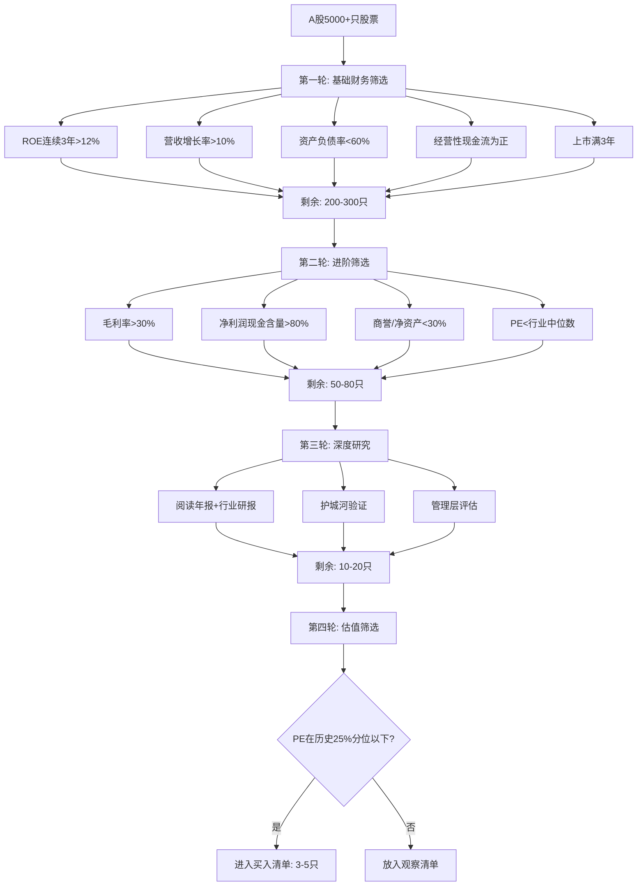
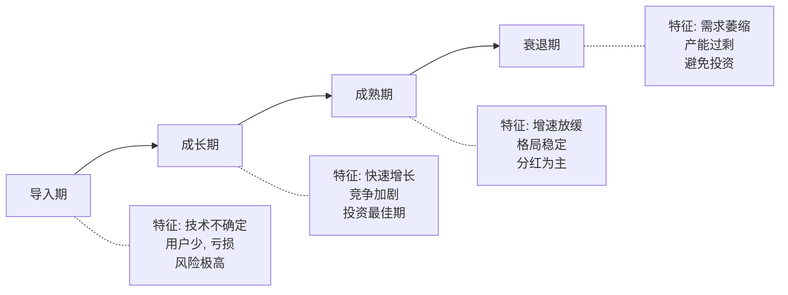
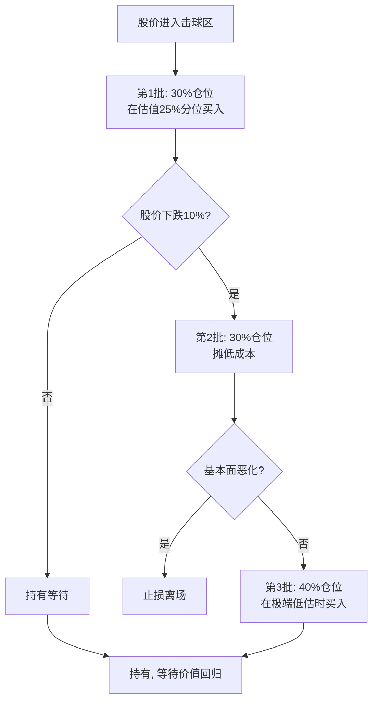

## 一、选股方法论：如何找到好公司

选股是股票投资的第一步，也是决定长期收益的关键环节。巴菲特说过："用合理的价格买入优秀的公司，远好过用便宜的价格买入平庸的公司。"这句话道出了选股的本质——**找到真正的好公司**。

但什么是"好公司"？好公司的标准不是固定的，它取决于你的投资风格、持有期限和风险承受能力。本章将从理论框架到实操工具，系统性地教你建立一套科学的选股体系。

### 1.1 选股的理论基础

在动手筛选之前，先理解几个支撑选股方法论的核心理论。

#### 1.1.1 价值投资的底层逻辑

价值投资的核心假设是：**股票的市场价格短期内会偏离其内在价值，但长期会回归。** 这意味着：

- 如果你能准确估算一家公司的内在价值，就能在市场低估时买入、高估时卖出
- 市场先生（Mr. Market）每天都会给你报价，但你不必每天都交易
- 安全边际（Margin of Safety）是你对抗估算误差的缓冲垫

本杰明·格雷厄姆在《聪明的投资者》中提出，安全边际至少应该是30%——也就是说，你估算一家公司值100元，你应该在70元以下才买入。这个30%的缓冲用来应对你估算的误差、行业突变、黑天鹅事件等不可预见的风险。

#### 1.1.2 护城河理论

巴菲特提出的"经济护城河"（Economic Moat）概念，是判断一家公司是否值得长期持有的核心框架。护城河指的是公司抵御竞争对手的结构性优势。晨星（Morningstar）将护城河分为五种类型：

| 护城河类型 | 定义 | 典型案例 | 可持续性 |
|:---:|:---:|:---:|:---:|
| **品牌优势** | 消费者愿意为品牌支付溢价 | 茅台、苹果、可口可乐 | 极强，但需持续投入维护 |
| **转换成本** | 客户更换供应商的成本很高 | 用友网络、Adobe、微软Office | 强，随使用深度增加 |
| **网络效应** | 用户越多，产品越有价值 | 微信、淘宝、Visa | 极强，赢者通吃 |
| **成本优势** | 规模经济或独特资源带来的低成本 | 海螺水泥、福耀玻璃 | 中等，需持续扩大规模 |
| **无形资产** | 专利、牌照、特许经营权 | 恒瑞医药（专利）、长江电力（水电牌照） | 取决于保护期限 |

**如何验证护城河？** 问自己三个问题：

1. **如果竞争对手给你100亿，你能复制这家公司吗？** 如果能，护城河不深；如果不能，说明有真正的壁垒
2. **过去10年，这家公司的市场份额是在扩大还是缩小？** 扩大说明护城河在加深
3. **公司的定价权如何？** 能在不流失客户的情况下提价，说明有真正的竞争力

#### 1.1.3 能力圈原则

巴菲特的搭档查理·芒格反复强调"能力圈"（Circle of Competence）的概念。你不需要了解所有行业，但你需要**真正理解**你投资的行业。

**判断自己是否在能力圈内的方法：**

- 你能用简单的语言解释这家公司是怎么赚钱的吗？
- 你知道这个行业未来3-5年的发展趋势吗？
- 你能说出这家公司的前三大竞争对手及其各自的优劣势吗？
- 你知道这个行业的关键成功因素是什么吗？

如果以上任何一个问题回答不上来，说明你还没有进入这个行业的能力圈。这时候应该做的是学习研究，而不是盲目买入。

### 1.2 选股漏斗：从4000只到3-5只

面对A股5000+只股票，你需要一套系统化的筛选流程。以下是经过实践验证的"四轮漏斗筛选法"：



> **数据支撑**：根据东方财富Choice数据统计，A股中连续5年ROE>15%的公司仅占全部上市公司的约5%（约200家），这些公司的长期股价表现显著优于市场平均水平。严格的筛选虽然会错过一些"黑马"，但能有效避免"踩雷"。

### 1.3 第一轮：基础财务筛选——用数据快速过滤

#### 1.3.1 五大核心筛选指标

**指标一：ROE连续3年 > 12%**

ROE（净资产收益率）是巴菲特最看重的财务指标，它衡量的是公司用股东的钱赚钱的效率。ROE = 净利润 / 净资产。

为什么是12%？因为A股上市公司平均ROE约为10%，12%意味着超过平均水平。连续3年达标则排除了偶然因素，证明公司的盈利能力是稳定的。

**注意：** ROE可以通过加杠杆（提高负债）来提升，所以必须同时关注资产负债率。一家ROE为20%但负债率80%的公司，远不如ROE为15%但负债率30%的公司健康。

**如何用杜邦分析拆解ROE：**

```text
ROE = 净利率 × 资产周转率 × 权益乘数
    = (净利润/营收) × (营收/总资产) × (总资产/净资产)
```

- **高净利率驱动**（如茅台，净利率>50%）：说明有强大的定价权，是最好的模式
- **高周转率驱动**（如沃尔玛，薄利多销）：需要持续扩大规模
- **高杠杆驱动**（如银行、地产）：风险最高，经济下行时最先受伤

优先选择**净利率驱动型**的高ROE公司，这类公司的盈利质量最高。

**指标二：营收增长率连续3年 > 10%**

营收增长代表公司的业务在扩张。10%的门槛意味着跑赢GDP增速（中国近年约5%），说明公司在抢占市场份额或开拓新市场。

**区分增长的质量：**
- **有机增长**（内生增长）：靠产品竞争力、市场扩张带来的增长，最健康
- **并购增长**：通过收购带来的增长，需要关注并购溢价和整合风险
- **涨价增长**：通过提价带来的增长，需要判断提价是否可持续

**指标三：资产负债率 < 60%**

资产负债率 = 总负债 / 总资产。60%是A股的一个安全线。

**不同行业的合理负债率差异很大：**

| 行业 | 合理负债率范围 | 原因 |
|:---:|:---:|:---:|
| 银行 | 90-95% | 银行的商业模式本身就是高杠杆 |
| 地产 | 60-80% | 行业特性，但近年政策收紧 |
| 制造业 | 30-50% | 需要持续资本开支 |
| 消费品 | 20-40% | 现金流充沛，不需要高杠杆 |
| 科技 | 10-30% | 轻资产模式，负债率低 |

**指标四：经营性现金流为正**

净利润可以通过会计手段调节（比如提前确认收入、推迟确认费用），但经营性现金流很难造假。一家公司净利润很高但经营性现金流为负，说明利润可能是"纸面利润"。

**关键比率：经营性现金流 / 净利润**

- 大于1：利润质量很高，赚到的钱都是真金白银
- 0.8-1：利润质量较好
- 0.5-0.8：利润质量一般，部分利润可能是应收账款
- 小于0.5：利润质量堪忧，需要深入调查原因

**指标五：上市满3年**

新上市公司存在以下风险：
- IPO前的财务数据可能经过美化
- 限售股解禁（通常在上市后1-3年）会带来抛压
- 上市时间太短，无法观察管理层的长期表现

#### 1.3.2 实操：如何使用选股器

**同花顺选股器操作步骤：**

1. 打开同花顺软件，点击"智能" → "选股器"
2. 在"基本面选股"中设置以下条件：
   - ROE（加权）> 12%，连续3年
   - 营收同比增长 > 10%，连续3年
   - 资产负债率 < 60%
   - 经营活动现金流量净额 > 0
   - 上市日期距今 > 3年
3. 点击"开始选股"，查看结果

**东方财富Choice操作步骤：**

1. 打开Choice金融终端
2. 进入"条件选股"模块
3. 逐一添加上述指标条件
4. 导出筛选结果为Excel，方便后续分析

**免费替代方案：**
- **理杏仁**（lixinger.com）：提供ROE、现金流等指标的多年筛选
- **集思录**（jisilu.cn）：侧重低估值筛选
- **韭圈儿**（funddb.cn）：基金持仓和行业分析

筛选完成后，通常能从5000+只缩小到200-300只。这个范围仍然太大，需要进入第二轮筛选。

### 1.4 第二轮：进阶筛选——识别利润质量

#### 1.4.1 毛利率 > 30%

毛利率 = (营收 - 营业成本) / 营收。高毛利率意味着公司有定价权，或者成本控制能力极强。

**不同行业的毛利率参考：**

| 行业 | 典型毛利率 | 代表公司 |
|:---:|:---:|:---:|
| 白酒 | 70-90% | 茅台（91%）、五粮液（75%） |
| 医药 | 50-80% | 恒瑞医药（86%）、片仔癀（78%） |
| 软件 | 60-90% | 金山办公（85%）、用友网络（65%） |
| 家电 | 25-35% | 美的（26%）、格力（32%） |
| 零售 | 15-25% | 永辉超市（20%） |
| 建筑 | 8-15% | 中国建筑（11%） |

**关键：毛利率要和同行业比，而不是跨行业比。** 一家毛利率20%的零售公司可能比毛利率50%的软件公司更有竞争力。

#### 1.4.2 净利润现金含量 > 80%

净利润现金含量 = 经营性现金流 / 净利润。这个指标反映利润的"含金量"。

**低现金含量的常见原因：**
- **大量应收账款**：产品卖出去了但钱没收回来，可能是放宽了信用政策冲业绩
- **大量存货**：产品生产出来但没卖出去，可能是需求下降或过度生产
- **资本化费用**：把本应计入当期的费用资本化，人为抬高利润

**案例分析：** 某知名环保公司，连续多年净利润增长20%+，但经营性现金流长期为负。原因是大量工程款以应收账款形式存在，实际上钱并没有收回来。后来应收账款集中暴雷，公司业绩断崖式下跌，股价从最高点跌去90%。

#### 1.4.3 商誉/净资产 < 30%

商誉是并购时支付的溢价。高商誉意味着公司可能进行了大量高溢价收购。一旦被收购的公司业绩不达预期，就需要计提商誉减值，直接冲减利润。

**高商誉风险案例：**
- 2018-2019年A股商誉减值潮，大量公司在2015-2016年牛市期间高溢价并购的资产集中暴雷
- 某传媒公司商誉一度占净资产的200%以上，最终计提减值超过50亿元

**安全线：商誉占净资产比例不超过30%。** 超过50%的要高度警惕，超过100%的建议直接排除。

#### 1.4.4 PE < 行业中位数

PE（市盈率）= 股价 / 每股收益。在基本面相近的情况下，选择PE更低的公司，意味着你用更便宜的价格买入同样的盈利能力。

**为什么要和行业中位数比而不是绝对值？** 不同行业的PE差异很大。银行股PE通常5-8倍，消费股PE通常25-40倍，科技股PE可能50-100倍。拿银行股的PE和科技股比没有意义。

**注意PE陷阱：**
- 周期股在利润顶峰时PE最低，但此时恰恰应该卖出
- 亏损公司没有PE，需要用PS（市销率）或DCF估值
- 一次性收益（如卖资产）会暂时拉低PE，造成低估假象

### 1.5 第三轮：深度研究——理解公司本质

通过前两轮筛选后，剩下的50-80家公司已经基本满足财务标准。但这还不够——**财务数据只能告诉你过去，不能告诉你未来。** 第三轮需要通过深度研究来判断公司的未来。

#### 1.5.1 如何阅读年报

年报是了解一家公司最全面、最权威的资料。一份年报通常200-300页，但你不需要全部读完。以下是阅读优先级：

**必读章节（按优先级排序）：**

1. **"管理层讨论与分析"（MD&A）**：这是年报最重要的部分，管理层会在这里解释公司的经营情况、行业趋势、未来战略。重点看：
   - 公司怎么描述自己的竞争优势？
   - 管理层对未来的态度是乐观还是谨慎？
   - 有没有提到新的风险因素？

2. **财务报表附注**：魔鬼在细节中。重点看：
   - 收入确认政策是否激进
   - 应收账款的账龄分布（超过1年的越多越危险）
   - 存货的构成和跌价准备
   - 关联交易的规模和定价

3. **重要事项**：包括重大诉讼、担保、关联交易等

4. **审计报告**：如果是"非标准无保留意见"，说明审计师有疑虑，要高度警惕

**快速阅读技巧：**
- 先看目录，找到重点章节
- 用Ctrl+F搜索关键词："风险"、"竞争"、"未来"、"战略"
- 对比今年和去年的年报，看哪些描述发生了变化
- 关注数字异常变化，追问"为什么"

#### 1.5.2 护城河深度验证

1.1.2节介绍了护城河的五种类型，这里给出具体的验证方法。

**品牌护城河验证：**
- 搜索百度指数/微信指数，看品牌搜索量趋势
- 在电商平台查看产品的用户评价数量和评分
- 做消费者调研：如果竞品便宜20%，你会换品牌吗？

**转换成本护城河验证：**
- 调研客户：更换供应商需要多长时间？成本多少？
- 查看客户续约率/留存率
- 评估产品的集成深度：是否嵌入客户的业务流程？

**网络效应护城河验证：**
- 查看用户增长曲线是否呈S型（前期慢、中期快、后期稳）
- 计算单用户价值是否随用户总量增加而提升
- 评估竞争对手是否有可能打破网络效应（比如通过补贴）

**成本优势护城河验证：**
- 对比公司和竞争对手的毛利率
- 分析成本优势的来源：规模、技术、地理位置、原材料？
- 评估成本优势是否容易被复制

#### 1.5.3 管理层评估

**评估维度一：诚信与透明度**

- 年报中的表述是否前后一致？
- 业绩预告是否准确？频繁修正业绩预告的管理层要警惕
- 是否存在关联交易利益输送？
- 管理层是否有减持行为？大额减持往往是一个负面信号

**评估维度二：能力与执行力**

- 管理层过去5年制定的战略目标完成了多少？
- 公司的资本配置能力如何？（并购成功率、研发投入产出比）
- 管理层是否持有公司股份？持股比例多少？（利益绑定）

**评估维度三：行业经验**

- 管理层是否有相关行业背景？
- 核心技术团队是否稳定？
- 创始人是否仍在参与经营？（创始人驱动的公司通常更有活力）

**实操方法：**
- 搜索管理层的公开采访和演讲
- 查看管理层的履历和持股变动
- 在雪球、东财股吧等平台了解投资者对管理层的评价
- 参加股东大会或观看股东大会纪要

#### 1.5.4 行业分析框架

一个好行业里的普通公司，往往比一个差行业里的好公司表现更好。行业分析的核心框架：

**行业生命周期判断：**



**波特五力分析：**

| 竞争力量 | 分析要点 | 高/低的影响 |
|:---:|:---:|:---:|
| 行业内竞争 | 竞争者数量、差异化程度 | 竞争激烈→利润率低 |
| 新进入者威胁 | 进入壁垒高低 | 壁垒低→护城河不稳 |
| 替代品威胁 | 是否有替代方案 | 替代品多→定价权弱 |
| 买方议价能力 | 客户集中度 | 客户强势→压价 |
| 供方议价能力 | 供应商集中度 | 供应商强势→成本高 |

**理想行业的特征：**
- 行业仍在成长期，渗透率有提升空间
- 竞争格局清晰，寡头垄断优于完全竞争
- 进入壁垒高，新玩家难以进入
- 行业不会被技术变革颠覆

### 1.6 不同类型股票的选股标准

不同投资风格需要不同的选股标准。以下是三种主要投资风格的具体标准：

#### 1.6.1 价值型股票（低估值、高分红）

**核心特征：** 公司成熟稳定，现金流充沛，愿意把利润分红给股东。

**量化筛选标准：**

| 指标 | 标准 | 说明 |
|:---:|:---:|:---:|
| PE | < 行业中位数 | 估值低于同行 |
| PB | < 2 | 不为虚高的净资产买单 |
| 股息率 | > 3% | 超过银行定期存款利率 |
| 分红比例 | > 30% | 公司愿意分红 |
| ROE | > 10% | 盈利能力达标 |
| 负债率 | < 50% | 财务稳健 |

**适合人群：** 稳健型投资者、退休人群、追求现金流的投资者。

**代表行业：** 银行、公用事业、高速公路、电力。

**风险提示：** 低PE不等于低估，要排除周期股利润顶峰和衰退行业的陷阱。

#### 1.6.2 成长型股票（高增长、高弹性）

**核心特征：** 公司处于快速成长期，收入和利润高速增长，通常不分红而是把利润再投入扩张。

**量化筛选标准：**

| 指标 | 标准 | 说明 |
|:---:|:---:|:---:|
| 营收增长率 | > 25% | 收入高速增长 |
| 净利润增长率 | > 30% | 利润增速快于收入（规模效应） |
| ROE | > 15% 且在提升 | 盈利能力不断增强 |
| 研发投入/营收 | > 5% | 持续投入研发 |
| PEG | < 1 | 增长未被充分定价 |

**适合人群：** 年轻投资者、能承受30%以上回撤、投资期限5年以上。

**代表行业：** 新能源、半导体、创新药、SaaS。

**风险提示：** 成长股的风险在于增长不及预期。一旦增速放缓，杀估值的幅度会非常大。2021-2023年大量成长股跌幅超过60%。

#### 1.6.3 白马型股票（行业龙头、确定性强）

**核心特征：** 行业龙头，品牌知名度高，经营确定性强，兼具成长和价值属性。

**量化筛选标准：**

| 指标 | 标准 | 说明 |
|:---:|:---:|:---:|
| 市场份额 | 行业前三 | 行业地位稳固 |
| ROE | 连续5年 > 15% | 长期盈利能力强 |
| 品牌知名度 | 高 | 消费者认知度高 |
| 机构持仓 | 高 | 被专业投资者认可 |
| 自由现金流 | 持续为正 | 真金白银的利润 |

**适合人群：** 长期持有者、定投用户、不想花太多时间研究个股的投资者。

**代表公司：** 贵州茅台、海天味业、中国平安、招商银行、美的集团。

**风险提示：** 白马股的最大风险是"买贵了"。2021年初白马股集体高估，之后两年普遍回调30-50%。

### 1.7 估值方法详解

找到好公司之后，下一个问题是：**它值多少钱？** 这是选股中最难的一步。

#### 1.7.1 PE估值法（市盈率法）

**适用场景：** 盈利稳定的成熟公司。

**操作步骤：**

1. 查看公司过去5-10年的PE区间（在理杏仁、同花顺等工具中可查）
2. 计算PE的历史中位数
3. 在PE低于历史25%分位时关注，在低于10%分位时重点考虑买入

**举例：** 某消费龙头过去10年PE区间为15-50倍，中位数28倍。
- 25%分位 ≈ 22倍：进入关注区
- 10%分位 ≈ 18倍：进入击球区
- 当前PE = 20倍 → 估值偏低，可以开始建仓

**局限性：** 不适用于亏损公司、周期股、高速成长股。

#### 1.7.2 PEG估值法

**适用场景：** 成长型公司。

PEG = PE / 净利润增长率(%)。PEG的核心思想是：**增长越快的公司，应该享受越高的PE。**

**判断标准：**
- PEG < 0.8：明显低估，强烈买入信号
- PEG 0.8-1.0：合理偏低，可以买入
- PEG 1.0-1.5：合理，持有
- PEG > 1.5：偏高，谨慎
- PEG > 2.0：高估，考虑卖出

**举例：** 某科技公司PE=30倍，预期净利润增速35%，则PEG=30/35=0.86，说明增长没有被充分定价，值得买入。

**局限性：** 增长率是预期值，存在不确定性。不同行业的合理PEG不同。

#### 1.7.3 股息率估值法

**适用场景：** 高分红的价值型股票。

**判断标准：** 股息率 > 无风险利率的1.5倍时有吸引力。

当前中国10年期国债收益率约2.5%，则股息率 > 3.75%时有吸引力。

**操作方法：**
- 在股息率处于历史高位时买入（对应股价低位）
- 在股息率处于历史低位时卖出（对应股价高位）

#### 1.7.4 DCF估值法（现金流折现法）

**适用场景：** 现金流稳定的成熟公司。这是理论上最正确的估值方法，但对假设参数非常敏感。

**简化版DCF计算步骤：**

```text
第1步：估算未来5年的自由现金流（FCF）
       FCF = 经营性现金流 - 资本支出

第2步：假设一个合理的增长率（建议用过去3年的平均增速打8折）

第3步：选择折现率（一般用10%，代表你要求的年化回报率）

第4步：计算终值（第5年之后的价值）
       终值 = 第5年FCF × (1+永续增长率) / (折现率 - 永续增长率)
       永续增长率一般取2-3%

第5步：把所有现金流折现到今天，加总就是公司的内在价值
```

**重要提醒：** DCF的结果对增长率和折现率的假设极为敏感。增长率差2个百分点，估值结果可能差50%以上。所以DCF更适合用来做"合理性检验"，而不是精确计算。

#### 1.7.5 估值方法对比

| 方法 | 适用场景 | 优点 | 缺点 |
|:---:|:---:|:---:|:---:|
| PE法 | 盈利稳定的公司 | 简单直观 | 不适用于亏损/周期公司 |
| PEG法 | 成长型公司 | 考虑了增长 | 增长率是预估值 |
| 股息率法 | 高分红公司 | 关注真实回报 | 不适用于低分红公司 |
| DCF法 | 现金流稳定的公司 | 理论最正确 | 对假设极敏感 |
| PB法 | 重资产公司/银行 | 适合资产型企业 | 轻资产公司不适用 |

**建议：** 不要只用一种估值方法。至少用两种方法互相验证，如果两种方法得出的结论一致，可信度更高。

### 1.8 常见选股误区

#### 误区一：只看PE低就认为便宜

PE低可能是因为：
- 公司处于周期性行业利润顶峰（如2021年的航运、煤炭）
- 公司面临结构性衰退（如传统报业）
- 一次性收益拉低了PE（如卖了一栋楼）

**纠正方法：** 看PE的同时，必须看利润的可持续性。扣非净利润（扣除非经常性损益后的净利润）比净利润更可靠。

#### 误区二：追涨热门赛道

2021年追新能源、2023年追AI的投资者，很多在高位买入后遭遇大幅回调。热门赛道的问题在于：
- 热门往往意味着已经被充分定价甚至高估
- 大量资金涌入会推高估值，透支未来增长
- 热门赛道的竞争格局会迅速恶化

**纠正方法：** 独立思考，不跟风。如果一个行业所有人都在讨论，往往已经过了最佳买入时机。

#### 误区三：忽视资产负债表

很多投资者只看利润表（赚多少钱），不看资产负债表（有多少家底）。但资产负债表能告诉你：
- 公司的真实财务状况
- 是否存在隐藏风险（高商誉、大额担保）
- 公司的资产质量

**纠正方法：** 养成看三张报表的习惯：利润表看赚钱能力，资产负债表看家底厚薄，现金流量表看利润质量。

#### 误区四：过度依赖单一指标

有些投资者只看ROE，有些只看增长率。单一指标容易被"修饰"。

**纠正方法：** 建立多维度的筛选体系，至少覆盖盈利能力、成长性、财务健康、估值四个维度。

#### 误区五：不做行业对比

一家毛利率30%的公司看起来不错，但如果同行业平均毛利率是50%，那它其实是行业里最差的。

**纠正方法：** 所有财务指标都要和同行业公司对比，看相对位置而非绝对值。

### 1.9 选股工具箱

| 工具 | 用途 | 费用 | 推荐指数 |
|:---:|:---:|:---:|:---:|
| 同花顺iFinD | 选股器、财务数据、研报 | 付费 | ⭐⭐⭐⭐⭐ |
| 东方财富Choice | 条件选股、数据导出 | 付费 | ⭐⭐⭐⭐⭐ |
| 理杏仁 | 估值分析、财务指标筛选 | 免费/付费 | ⭐⭐⭐⭐ |
| 雪球 | 投资社区、讨论分析 | 免费 | ⭐⭐⭐⭐ |
| 巨潮资讯网 | 年报、公告原文 | 免费 | ⭐⭐⭐⭐ |
| 韭圈儿 | 基金持仓、行业分析 | 免费 | ⭐⭐⭐ |
| 集思录 | 低估值筛选、套利 | 免费 | ⭐⭐⭐ |
| Wind万得 | 专业金融终端（最全面） | 付费（贵） | ⭐⭐⭐⭐⭐ |

### 1.10 买入时机：好公司还要好价格

找到好公司只是第一步，买对价格同样重要。即使是茅台，买贵了也要承受巨大亏损——2021年初以2600元买入茅台的投资者，到2024年仍亏损超过40%。

#### 1.10.1 估值买入法

**核心逻辑：好公司 + 好价格 = 好投资。**

**具体操作步骤：**

1. 用1.7节的估值方法计算公司的合理估值区间
2. 在股价低于合理估值下限时开始关注
3. 在股价进入"击球区"（显著低估，如合理估值的70%）时分批买入

**估值锚定参考：**

- **历史PE法：** 查看公司过去5-10年的PE区间，在25%分位以下买入
- **PEG法：** PEG < 1时具备买入价值
- **股息率法：** 股息率 > 无风险利率的1.5倍时有吸引力

#### 1.10.2 技术面辅助择时

基本面选股，技术面择时。技术分析不能告诉你买什么，但可以帮你优化买入价格。

**值得关注的买入信号：**

- 股价回调到重要均线支撑位（如60日均线、120日均线）
- MACD在零轴附近金叉（DIFF线上穿DEA线）
- 成交量缩到地量后开始放量（地量见地价）
- 出现底部反转K线形态（早晨之星、锤子线、吞没形态）

**增强信号（大盘和行业配合）：**

- 大盘处于底部区域（沪深300在年线以下）
- 行业板块出现轮动迹象（资金开始流入该行业）
- 公司发布利好消息（业绩超预期、大股东增持、回购）

#### 1.10.3 分批建仓策略

不要一次性全仓买入。分批建仓可以降低择时风险。

**推荐的建仓节奏：**



**关键纪律：**
- 每批买入之间至少间隔1-2周
- 如果基本面恶化（不是股价下跌），果断止损
- 总仓位控制在单只股票不超过总资产的20%

#### 1.10.4 定投策略

对于没有时间研究个股的投资者，定投是最简单有效的策略。

**定投标的选择：**

| 标的 | 特点 | 适合人群 |
|:---:|:---:|:---:|
| 沪深300指数基金 | 大盘蓝筹，波动适中 | 稳健型投资者 |
| 中证500指数基金 | 中小盘成长，弹性更大 | 能承受较大波动 |
| 创业板指数基金 | 科技成长，波动最大 | 高风险偏好 |
| 行业ETF | 看好某行业但不确定个股 | 有行业判断力 |

**定投纪律四要素：**

1. **固定时间：** 每月发工资后的第1-2天
2. **固定金额：** 月收入的10-30%（根据个人情况调整）
3. **不择时：** 市场涨也买、跌也买，纪律性最重要
4. **不间断：** 坚持至少3年，最好5年以上

**智能定投优化（进阶）：**

- 在指数PE低于历史30%分位时，定投金额加倍
- 在指数PE高于历史70%分位时，定投金额减半
- 在指数PE高于历史90%分位时，暂停定投并开始分批卖出

### 1.11 选股清单模板

在完成所有研究后，建议用以下模板记录你的选股决策，方便日后复盘：

```markdown
## 选股决策记录

**公司名称：** _______________
**股票代码：** _______________
**所属行业：** _______________
**研究日期：** _______________

### 基本面评分（满分10分）
- 盈利能力（ROE/净利率）：___/10
- 成长性（营收/利润增速）：___/10
- 财务健康（负债率/现金流）：___/10
- 护城河强度：___/10
- 管理层质量：___/10
- 行业前景：___/10

### 估值判断
- 当前PE：___，历史分位：___%
- PEG：___
- 股息率：___%
- 估值结论：低估 / 合理 / 高估

### 买入计划
- 买入价格区间：___-___元
- 建仓节奏：第一批___%在___元，第二批___%在___元
- 止损条件：基本面恶化 / 跌破___元
- 目标持有期限：___

### 买入理由（用两分钟能说清楚）
1. ___
2. ___
3. ___

### 主要风险
1. ___
2. ___
```

> **彼得·林奇的忠告：** "买入一只股票前，你必须能用两分钟解释清楚为什么买它。如果你说不清楚，那你就不应该买。"上面的清单模板就是帮助你系统性地回答每一个关键问题。
