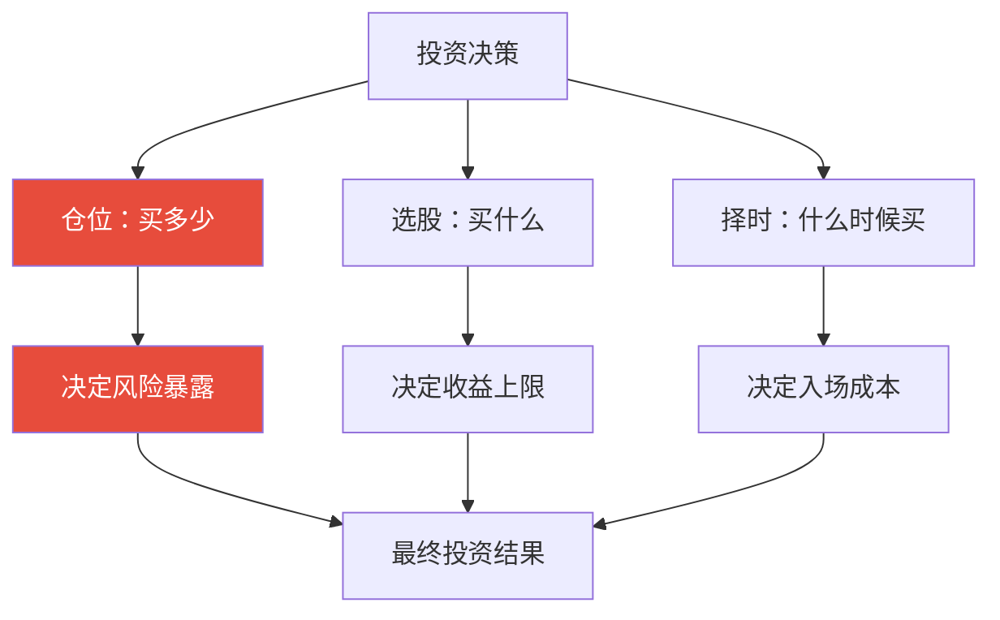

## 四、仓位管理：控制风险的核心

> 巴菲特的第一条投资规则是"不要亏损"，第二条是"不要忘记第一条"。仓位管理就是这两条规则的执行器——它决定了你在正确时赚多少，在错误时亏多少。

仓位管理（Position Sizing）是投资体系中最容易被忽视、却对收益影响最大的环节。大量散户的亏损并非源于选股失误，而是源于仓位失控：满仓单只股票遭遇黑天鹅、越跌越买直到弹尽粮绝、牛市初期轻仓而高点重仓。本节将从底层逻辑到实操方法，系统构建你的仓位管理能力。

---

### 一、为什么仓位管理是投资的"隐形引擎"

#### 1.1 仓位管理的本质：用数学控制运气

投资本质上是一场概率游戏。即使你有一个正期望值的交易系统（胜率55%、盈亏比1.5:1），仓位管理的差异会导致截然不同的结果：

| 场景 | 资金10万，每次投入10% | 资金10万，每次投入50% |
|------|----------------------|----------------------|
| 连续3次亏损 | 亏损约3万（剩余7万） | 亏损约8.75万（剩余1.25万） |
| 回本所需涨幅 | 约43% | 约700% |
| 心理状态 | 可控，能继续执行策略 | 崩溃，可能割肉离场 |

同样的交易系统，仅仅因为仓位不同，一个还能继续玩下去，另一个已经被淘汰出局。这就是仓位管理的威力——**它不改变你的胜率，但它决定了你能否活到胜利的那一天。**

#### 1.2 仓位管理与选股、择时的关系

投资决策由三个齿轮驱动，缺一不可：



三者中，**仓位管理是唯一完全可控的变量**。选股需要研究能力，择时需要市场配合，但投入多少比例的资金，完全由你自己决定。

#### 1.3 不同仓位水平的风险对比

以下用历史回测数据说明仓位对组合波动率的影响（假设持有沪深300指数）：

| 仓位水平 | 年化收益（2010-2023） | 最大回撤 | 年化波动率 | 夏普比率 |
|---------|---------------------|---------|-----------|---------|
| 100%满仓 | 5.2% | -46.7% | 23.1% | 0.23 |
| 70%仓位+30%现金 | 3.6% | -32.7% | 16.2% | 0.22 |
| 50%仓位+50%现金 | 2.6% | -23.4% | 11.6% | 0.22 |
| 动态仓位（50%-90%） | 6.8% | -28.3% | 16.8% | 0.40 |

关键发现：动态仓位策略在收益和风险之间取得了最优平衡——它在估值低位加仓、高位减仓，用仓位变化捕获了市场均值回归的收益。

---

### 二、仓位管理的四大核心原则

#### 2.1 原则一：永远不满仓

**铁律：任何时候都保留至少10-20%的现金仓位。**

保留现金仓位有三个不可替代的作用：

- **机会弹药**：当市场出现极端恐慌（如暴跌5%+）时，有资金低位补仓。2020年3月、2024年2月的暴跌中，有现金的人看到的是机会，满仓的人只能看着。
- **心理安全垫**：知道自己还有"后备军"，在市场波动时不容易恐慌性卖出。
- **强制约束**：不满仓意味着你对每一笔买入都必须更加审慎——因为你必须从现有持仓中"挤出"仓位，这自然会提高选股标准。

实操建议：将总资金分为"作战资金"（80-90%）和"战略储备"（10-20%）。战略储备可以放在货币基金或短期国债逆回购中，年化收益2%左右，聊胜于无但随时可取。

#### 2.2 原则二：单一持仓不超过总资产的20%

即使你对某只股票有极强的信心，也不要突破20%的上限。原因：

- **认知偏差**：你越看好一只股票，越可能忽略了它的风险。过度自信是人类最顽固的认知偏差之一。
- **黑天鹅不可预测**：茅台2013年塑化剂事件跌了60%，腾讯2021年反垄断跌了50%，这些事后看"显然"的风险事前几乎无人预见。
- **数学约束**：如果单只股票占比50%且下跌50%，你的总资产直接缩水25%——这已经接近大多数人的心理承受极限。

建议的持仓结构：

| 持仓类型 | 占比 | 说明 |
|---------|------|------|
| 核心持仓（2-3只） | 每只15-20% | 深度研究、高确信度的标的 |
| 卫星持仓（3-5只） | 每只5-10% | 行业配置或战术性机会 |
| 现金储备 | 10-20% | 货币基金/国债逆回购 |

#### 2.3 原则三：分批建仓，绝不满仓买入

一次性All-in的风险在于：你恰好买在短期高点的概率远比你想象的高。即使是牛市，中间的回调幅度也经常超过10%。

**分批建仓的标准流程：**

1. **第一批（试探仓）**：估值进入合理区间时，买入计划仓位的30%。目的是"上车"，建立心理锚点。
2. **第二批（主力仓）**：股价继续下跌5-10%或横盘确认支撑后，再买入40%。
3. **第三批（加码仓）**：股价进一步下跌或基本面出现积极信号时，买入剩余30%。

分批建仓的好处不仅是降低平均成本，更重要的是**给你留了纠错空间**。如果你第一批买入后发现判断有误（公司出了新问题、行业逻辑变了），你只损失了30%的计划仓位，而不是全部。

#### 2.4 原则四：根据市场估值动态调整总仓位

这是专业投资者和散户的核心区别——散户总是满仓或空仓，而专业投资者会根据市场温度调整整体风险暴露。

**基于全市场估值的仓位调整框架：**

| 全市场PE百分位 | 建议总仓位 | 逻辑 |
|--------------|-----------|------|
| 0-20%（极度低估） | 80-90% | 历史底部区域，重仓布局 |
| 20-40%（偏低估） | 70-80% | 安全边际充足，积极买入 |
| 40-60%（合理区间） | 50-70% | 正常配置，精选个股 |
| 60-80%（偏高估） | 30-50% | 逐步减仓，提高现金比 |
| 80-100%（极度高估） | 10-30% | 防守为主，只保留核心持仓 |

如何获取全市场PE百分位：可以通过"且慢"APP的"市场温度计"、Wind终端的A股整体PE分位数、或者沪深300指数的PE历史分位来判断。对于普通投资者，**沪深300 PE低于12倍时可视为低估区间，高于15倍时进入偏高区间**（截至2024年的历史数据参考）。

---

### 三、六种经典仓位管理方法详解

#### 3.1 固定金额法

**方法**：每次交易投入固定金额。例如每次买入2万元。

**优点**：简单易执行，适合新手。

**缺点**：没有考虑账户规模变化和市场状态变化。

**适用场景**：定投指数基金。每月固定金额买入，天然实现了"低位多买、高位少买"的效果（因为同样的金额，价格低时买的份额多）。

```text
定投示例（每月2000元）：
月份    净值    买入份额
1月     1.00    2000份
2月     0.80    2500份（跌了，买更多）
3月     0.70    2857份（继续跌，买更多）
4月     0.90    2222份
平均成本 = 8000元 ÷ 9579份 = 0.835元 < 简单平均0.85元
```

#### 3.2 固定比例法

**方法**：每次交易投入总资金的固定比例。例如每次买入当前总资产的10%。

**优点**：随账户规模自动调整，盈利时自动加大仓位（绝对金额增加），亏损时自动缩小仓位。

**缺点**：没有考虑标的风险差异——高波动股票和低波动股票用同一比例不合理。

**改进版——风险比例法**：

```text
每次交易的风险金额 = 总资金 × 2%
单只股票买入金额 = 风险金额 ÷ 止损幅度

示例：总资金50万
- 股票A（止损8%）：买入金额 = 50万×2% ÷ 8% = 12.5万
- 股票B（止损15%）：买入金额 = 50万×2% ÷ 15% = 6.67万

风险更高的股票自动分配更少的资金，实现风险均衡。
```

这个方法的核心逻辑是：**你买入多少钱不重要，你愿意亏多少钱才重要。** 先确定单笔最大亏损金额（总资金的1-2%），然后反推应该买入多少。

#### 3.3 金字塔加仓法

**方法**：越跌越买，但每次买入金额递增。股价越低，安全边际越大，买入越多。

**标准金字塔**（正金字塔）：

假设计划对该股票总投入10万元，当前股价10元：

| 买入批次 | 股价 | 买入金额 | 买入股数 | 累计投入 |
|---------|------|---------|---------|---------|
| 第一批 | 10元 | 2万 | 2,000股 | 2万 |
| 第二批 | 8元（跌20%） | 3万 | 3,750股 | 5万 |
| 第三批 | 6元（跌40%） | 5万 | 8,333股 | 10万 |

加权平均成本 = 100,000 ÷ (2,000 + 3,750 + 8,333) = 7.12元

对比等金额加仓：每批3.33万，加权成本 = 100,000 ÷ (3,333 + 4,167 + 5,556) = 7.67元

金字塔法的加权成本比等金额法低了0.55元——在股价从10元跌到6元的过程中，节省了7.2%的成本。

**倒金字塔**（适用于趋势确认后加仓）：

| 买入批次 | 股价 | 买入金额 | 说明 |
|---------|------|---------|------|
| 第一批（试探） | 10元 | 2万 | 少量试探 |
| 第二批（确认） | 11元（涨10%） | 3万 | 趋势确认，加码 |
| 第三批（主升） | 12.5元 | 5万 | 主升浪启动，重仓 |

倒金字塔适用于右侧交易者——在趋势确认后逐步加仓，越涨越买。风险在于：一旦趋势反转，高位重仓会带来较大亏损。

**选择建议**：价值投资者用正金字塔（越跌越买），趋势交易者用倒金字塔（越涨越买）。**切忌混用**——用价值投资的心态做倒金字塔（追涨），或用趋势交易的心态做正金字塔（死扛），都是灾难性的。

#### 3.4 凯利公式法

**方法**：用数学公式计算理论最优仓位。

**公式**：`f* = (bp - q) / b`

其中：
- f* = 最优仓位比例
- b = 盈亏比（平均盈利 / 平均亏损）
- p = 胜率
- q = 1 - p（败率）

**实战计算**：

你的交易系统：胜率55%，平均盈利15%，平均亏损10%。

```text
盈亏比 b = 15 / 10 = 1.5
f* = (1.5 × 0.55 - 0.45) / 1.5
   = (0.825 - 0.45) / 1.5
   = 0.375 / 1.5
   = 0.25（25%）
```

理论最优仓位为25%。但**实际使用时必须减半（半凯利，12.5%）**，原因有三：

1. **参数估计误差**：你不可能精确知道胜率和盈亏比，这些是从历史数据估算的，存在误差
2. **收益波动**：全凯利的收益波动极大，半凯利的长期收益约为全凯利的75%，但波动减半
3. **心理可行性**：全凯利策略在连续亏损时的回撤会让人无法坚持执行

**凯利公式的直觉理解**：

| 胜率 | 盈亏比 | 凯利仓位 | 实际建议 |
|------|-------|---------|---------|
| 高（>60%） | 高（>2:1） | 高仓位 | 重仓出击 |
| 高（>60%） | 低（<1:1） | 中等仓位 | 稳健操作 |
| 低（<40%） | 高（>3:1） | 小仓位 | 小赌怡情 |
| 低（<40%） | 低（<1:1） | 负值 | 不参与 |

凯利公式最大的价值不是给你一个精确的数字，而是告诉你**仓位应该由胜率和赔率共同决定**——赔率高的机会值得给更多仓位，即使胜率一般；胜率高但赔率差的机会只适合小仓位。

#### 3.5 波动率调整法（ATR法）

**方法**：根据股票的波动率（ATR，平均真实波幅）调整仓位。波动大的股票少买，波动小的股票多买。

**公式**：

```text
单只股票仓位 = (总资金 × 风险系数) / (N × ATR × 当前股价 / ATR)

简化版本：
买入股数 = (总资金 × 2%) / (N日ATR)

示例：总资金50万
- 股票A：20日ATR = 1.5元，股价30元
  买入股数 = 500,000 × 2% / 1.5 = 6,666股，金额约20万（40%仓位）
  
- 股票B：20日ATR = 5元，股价100元
  买入股数 = 500,000 × 2% / 5 = 2,000股，金额约20万（40%仓位）

两只股票的"风险暴露"相同——每天的正常波动对组合的影响都是1%左右。
```

ATR法的优势在于**自动实现风险均衡**——高波动股票自动分配更少资金，低波动股票自动分配更多资金。这是海龟交易法则（Turtle Trading）的核心仓位管理方法。

如何获取ATR：同花顺/东方财富的个股K线图中通常有ATR指标，也可以用Python的TA-Lib库计算：

```python
import talib
import numpy as np

# 假设high, low, close是包含至少20个交易日的数组
atr_20 = talib.ATR(high, low, close, timeperiod=20)
current_atr = atr_20[-1]  # 最新一个交易日的20日ATR
```

#### 3.6 核心-卫星仓位法

**方法**：将资金分为"核心仓位"和"卫星仓位"两部分，分别采用不同的管理策略。

| 类型 | 占比 | 标的特征 | 操作频率 | 止损策略 |
|------|------|---------|---------|---------|
| 核心仓位 | 60-70% | 宽基指数基金、低估值蓝筹 | 极低（季度或半年调仓） | 基于估值，不设硬止损 |
| 卫星仓位 | 20-30% | 行业ETF、成长股、事件驱动 | 中等（月度调仓） | 严格止损（8-15%） |
| 机动仓位 | 5-10% | 超跌反弹、打新、套利 | 高（随时调整） | 快速止损（3-5%） |

核心仓位的作用是"压舱石"——它提供稳定的底层收益，让你在市场波动中不至于焦虑到睡不着觉。卫星仓位的作用是"进攻矛"——它捕捉行业轮动和个股机会，追求超额收益。

**为什么要分层？**

因为不同类型的持仓需要不同的管理方式。如果把指数基金和短线概念股混在一起管理，你会陷入一个两难：对指数基金设8%止损太紧（它经常波动超过8%），对概念股设20%止损太松（等跌20%已经来不及了）。分层管理让每层都有自己的规则。

---

### 四、不同市场环境下的仓位策略

#### 4.1 牛市初期（估值低位 + 趋势向上）

**特征**：全市场PE处于历史低位，成交量逐步放大，市场情绪从绝望转向犹豫。

**仓位策略**：
- 总仓位：70-85%
- 核心仓位：积极买入宽基指数（沪深300、中证500）
- 卫星仓位：配置弹性大的品种（券商、科技）
- 操作节奏：快速建仓到70%，然后随着趋势确认逐步加到85%

**关键心态**：不要等"确认"再买。牛市初期的"确认"信号出现时，股价已经涨了20-30%。在估值低位时大胆建仓，即使短期被套，中期大概率能获利。

#### 4.2 牛市中后期（估值偏高 + 情绪狂热）

**特征**：全市场PE处于历史高位，新开户数暴增，出租车司机都在谈股票。

**仓位策略**：
- 总仓位：30-50%
- 核心仓位：保留优质龙头，卖出弹性品种
- 卫星仓位：大幅缩减，只保留确定性最高的
- 操作节奏：每上涨10%减仓10%，不要试图卖在最高点

**关键心态**：不要因为"还在涨"而加仓。牛市最危险的不是下跌，而是让你相信"这次不一样"。

#### 4.3 熊市（估值下行 + 趋势向下）

**特征**：市场持续阴跌或暴跌，利好不涨利空大跌，市场情绪极度悲观。

**仓位策略**：
- 总仓位：20-40%
- 核心仓位：只保留最优质的2-3只，其余全部清仓
- 卫星仓位：清零或极小仓位（<5%）试探性抄底
- 操作节奏：不要急于抄底，等待估值进入历史极低区间（PE百分位<10%）再开始分批建仓

**关键心态**：熊市的任务不是赚钱，而是**活下来**。保留足够的现金，等待下一轮牛市的到来。历史数据显示，A股每隔5-8年就会出现一轮大牛市，活下来的人总能等到机会。

#### 4.4 震荡市（无明显方向 + 板块轮动）

**特征**：指数在一个区间内反复震荡，没有持续性趋势，板块快速轮动。

**仓位策略**：
- 总仓位：40-60%
- 核心仓位：持有低估值品种等待
- 卫星仓位：跟随板块轮动做短线，但严格控制单次亏损
- 操作节奏：在区间下沿加仓、上沿减仓

**关键心态**：震荡市最容易亏钱——因为反复追涨杀跌会不断消耗本金。最好的策略是**少动**，持有估值合理的品种等待趋势明朗。

---

### 五、仓位管理的六个致命错误

#### 5.1 满仓单只股票

**错误表现**：把所有资金都押在一只股票上，理由通常是"我研究透了"或"这个机会太确定了"。

**为什么致命**：即使你的分析100%正确，你也无法控制黑天鹅事件——财务造假、政策突变、管理层暴雷、行业灾难。任何一个不可预测的事件都可能让你损失惨重。

**纠正方法**：强制执行20%上限。即使再看好，也不要突破。用一个简单的测试问自己："如果这只股票明天停牌三年，我的生活会受影响吗？"如果答案是"会"，你的仓位就太重了。

#### 5.2 越跌越买，没有止损

**错误表现**：股价下跌时不断加仓，从"摊低成本"变成"重仓套牢"。每次加仓的理由都是"已经跌这么多了，不可能再跌了"。

**为什么致命**：你没有义务一直对。很多时候股票下跌是因为基本面真的出了问题，而不是"市场错杀"。没有止损的加仓等于在赌桌上输了就加倍——赢了回本，输了倾家荡产。

**纠正方法**：设定最大仓位上限。即使采用金字塔加仓法，单只股票的总投入也不超过总资产的20%。当达到20%上限时，无论价格多低，都不再加仓。

#### 5.3 盈利后加仓过猛

**错误表现**：一只股票赚了30%后信心爆棚，不但不减仓反而加仓，甚至融资加仓。

**为什么致命**：盈利后加仓会大幅提高你的平均成本。如果股价随后回调20%，你不仅把利润全吐回去，还可能亏损。更重要的是，这种行为背后的心理是"过度自信"——把运气当成了能力。

**纠正方法**：采用"盈利锁仓"策略。股价上涨20%后，卖出1/3锁定部分利润；上涨50%后，再卖出1/3。剩余的1/3作为"免费筹码"长期持有——因为你的成本已经通过前两次卖出回收了。

#### 5.4 牛市初期轻仓、高点重仓

**错误表现**：市场低位时不敢买（"还会跌"），市场涨了一大段后才开始入场（"趋势确认了"），越涨买得越多。

**为什么致命**：这是"近因效应"和"趋势外推偏见"的典型表现。你用最近的涨跌来预测未来，结果总是反向操作——在低点恐惧、在贪婪时入场。

**纠正方法**：制定预设计划。在市场低位时就写下："当沪深300 PE低于12倍时，开始建仓到70%；当PE低于10倍时，加仓到85%。"然后严格执行，不要被短期波动干扰。

#### 5.5 忽视仓位之间的相关性

**错误表现**：买了5只银行股，觉得自己"分散了"。或者同时买入同一产业链的上下游公司，以为是分散投资。

**为什么致命**：这些持仓在同一个风险因子下会同涨同跌。银行股遇到系统性风险时会一起暴跌，产业链上下游遇到行业寒冬时会一起亏损。表面分散、实际集中。

**纠正方法**：检查持仓的相关性。至少做到——行业分散（不同行业）、市值分散（大小盘搭配）、风格分散（价值+成长）。一个简单的检查方法：如果你的前三大持仓中有两只属于同一行业或同一概念，就说明集中度过高了。

#### 5.6 被套后"装死"不动

**错误表现**：股票亏损30%后既不加仓也不止损，就放在那里"等回本"。

**为什么致命**：这在行为金融学中叫"处置效应"——人们对亏损的处置是"持有等回本"，对盈利的处置是"赶紧落袋为安"。这导致你的组合中积压了大量亏损股（死钱），而盈利股被过早卖出。时间一长，你的持仓就变成了一堆"垃圾"。

**纠正方法**：定期做"持仓体检"。每季度问自己一个问题："如果我现在没有持有这只股票，我会按当前价格买入吗？"如果答案是"不会"，就应该卖出——无论盈亏。

---

### 六、仓位管理实战模板

#### 6.1 仓位管理检查清单

每次买入前，用这个清单自检：

```text
□ 1. 这只股票占我的总仓位将超过20%吗？ → 如果是，减少买入量
□ 2. 我的总仓位（含本次买入）会超过90%吗？ → 如果是，不要买入
□ 3. 我的止损位在哪里？如果止损，亏损金额占总资金的比例是多少？
      → 应该 < 2%
□ 4. 我是分批买入还是all-in？ → 必须分批
□ 5. 当前市场估值处于什么位置？ → 决定总仓位应该多高
□ 6. 这只股票和我的现有持仓有相关性吗？ → 避免同行业集中
```

#### 6.2 仓位记录表模板

建议用Excel或在线表格记录每一笔持仓的状态：

| 股票代码 | 股票名称 | 买入日期 | 买入价格 | 持有股数 | 当前价格 | 盈亏比例 | 占总仓位% | 止损价 | 备注 |
|---------|---------|---------|---------|---------|---------|---------|----------|-------|------|
| 600519 | 贵州茅台 | 2024-01-15 | 1680 | 100 | 1750 | +4.2% | 15% | 1500 | 核心仓 |
| 000858 | 五粮液 | 2024-02-01 | 145 | 500 | 138 | -4.8% | 6% | 125 | 卫星仓 |

每月更新一次，重点关注：
- 单只股票占比是否超过20%
- 总仓位是否符合当前市场估值水平
- 是否有"装死"的持仓需要处理

#### 6.3 一键减仓流程

当市场出现系统性风险信号时（如全市场PE百分位>80%、政策收紧、流动性危机），按以下顺序减仓：

1. **第一步**：卖出卫星仓位中的投机性品种（概念股、短线博弈）
2. **第二步**：卖出基本面有疑虑的持仓（业绩不达预期、行业逻辑变化）
3. **第三步**：降低核心仓位占比（从80%减到60%）
4. **第四步**：如果市场继续恶化，进一步减到40-50%

**不要一次性全部卖出**——因为你可能判断错误。分批减仓就像分批建仓一样，给你留了纠错空间。

---

### 七、进阶：仓位管理的数学原理

#### 7.1 为什么2%规则是最优的

2%规则（单笔交易的最大亏损不超过总资金的2%）不是随便定的数字，它有数学依据：

假设你的交易系统胜率50%、盈亏比1:1（最基础的系统），单笔风险为2%：
- 连续亏损10次的概率 = 0.5^10 = 0.098%，约千分之一
- 连续亏损10次的总损失 = 10 × 2% = 20%
- 剩余资金 = 80%，回本需要25%的收益——这在1-2年内是可实现的

如果单笔风险改为5%：
- 连续亏损10次的总损失 = 50%
- 剩余资金 = 50%，回本需要100%的收益——这可能需要3-5年

2%规则的核心价值是**确保你永远不会因为连续亏损而被迫离场**。只要你还在牌桌上，概率优势最终会体现。

#### 7.2 仓位与期望值的数学关系

假设你有一个交易系统：
- 胜率 p = 60%
- 平均盈利 W = 10%
- 平均亏损 L = 8%
- 盈亏比 b = W/L = 1.25

每次交易的期望值 = p × W - (1-p) × L = 0.6 × 10% - 0.4 × 8% = 2.8%

这意味着每次交易你平均能赚2.8%。但这个2.8%是"每次交易投入金额"的2.8%，不是总资金的2.8%。如果你想把这个期望值转化为总资金的增长率，就涉及仓位比例的选择。

凯利公式给出的最优仓位能让**资金的对数增长率最大化**——这是理论上最"快"的长期增长路径。但在实践中，由于参数估计的不确定性，使用半凯利或1/3凯利是更稳健的选择。

#### 7.3 再平衡的收益增厚效应

当你的组合偏离目标仓位时（比如某只股票因为上涨占比从15%变成了25%），通过再平衡将其调回15%，你实际上在做"高卖低买"。

**再平衡的收益增厚**：

假设两只股票A和B，初始各占50%，目标仓位各50%。一年后A涨了30%、B跌了10%：
- 不再平衡：A占比56.5%，B占比43.5%
- 再平衡：卖出部分A，买入部分B，使各恢复50%

如果第二年A跌10%、B涨30%（均值回归）：
- 不再平衡的最终收益：(1.3×0.9 + 0.9×1.3) / 2 - 1 = 17%
- 再平衡的最终收益：(1.1×1.1 + 1.1×1.1) / 2 - 1 = 21%

再平衡多赚了4个百分点——这就是纪律的力量。当然，如果两只股票同涨同跌，再平衡的收益增厚就不明显，甚至可能因为卖出强势股而少赚。但长期来看，在市场存在均值回归特性的前提下，再平衡是一个正期望值的操作。

**再平衡的执行建议**：
- **阈值法**：当某只股票偏离目标仓位超过5个百分点时触发再平衡
- **定期法**：每季度或每半年做一次再平衡
- **两者结合**：每季度检查一次，偏离超过5%才调整

---

### 八、总结：仓位管理的核心心智模型

把仓位管理简化为三个核心问题：

**1. 我最多愿意亏多少钱？** → 决定单笔仓位上限

答案应该是总资金的1-2%。用这个数字和你的止损幅度，反推应该买入多少股。

**2. 当前市场贵不贵？** → 决定总仓位水平

全市场估值低时多买，估值高时少买。这是最朴素也最有效的仓位管理方法。

**3. 我的持仓集中吗？** → 决定分散程度

任何一只股票不超过20%，任何单一行业不超过40%。分散不是为了收益最大化，而是为了**避免被单一风险因子消灭**。

仓位管理不需要复杂的数学模型，也不需要每天盯盘调整。它需要的是**纪律**——在应该加仓时克服恐惧，在应该减仓时克服贪婪。做到这一点，你已经超过了90%的散户投资者。
