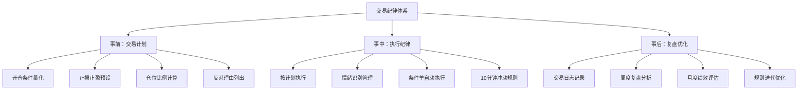

## 五、交易纪律与心态管理

交易纪律与心态管理是股票投资中**最被低估却最具决定性**的环节。大量研究数据表明，决定长期投资收益的核心变量并非选股能力或择时技巧，而是投资者能否在关键时刻执行既定策略、控制情绪冲动。本章从行为金融学理论出发，系统构建交易纪律体系，帮助投资者从"知道"到"做到"。

---

### 1. 为什么纪律比技术更重要

#### 1.1 行为金融学的实证证据

Barber 和 Odean 在 2000 年发表的经典研究《Trading Is Hazardous to Your Wealth》中，对 66,465 个家庭账户的交易记录进行了分析，发现：

- 交易最频繁的 20% 投资者，年化收益比市场低 7.2 个百分点
- 平均家庭账户的年化收益仅为 11.4%，而同期市场收益为 17.9%
- 收益差距的主要来源不是手续费，而是**频繁交易带来的决策错误**

另一项针对期货交易者的研究显示，约 90% 的个人交易者在 6 个月内亏损离场，其中绝大多数并非因为不懂技术分析，而是**无法执行纪律**。

#### 1.2 技术分析的局限性

技术指标的胜率通常在 50%-65% 之间。即使一个胜率为 60% 的系统，如果投资者在亏损时不止损、在盈利时过早获利了结，长期收益依然会趋近于零甚至为负。

```text
收益 = 胜率 × 平均盈利 - (1 - 胜率) × 平均亏损

示例：
系统胜率 60%，平均盈利 8%，平均亏损 5%
期望收益 = 0.6 × 8% - 0.4 × 5% = 2.8%（正期望）

但若情绪干扰导致：
- 盈利时提前出场 → 平均盈利降至 4%
- 亏损时扛单 → 平均亏损升至 12%
实际收益 = 0.6 × 4% - 0.4 × 12% = -2.4%（负期望）
```

一个正期望系统被情绪执行搞成负期望，这是绝大多数散户亏损的根本原因。

#### 1.3 交易纪律的三层含义

| 层次 | 内容 | 具体表现 |
|------|------|----------|
| 第一层：规则纪律 | 有明确的交易规则 | 入场条件、出场条件、仓位上限全部量化 |
| 第二层：执行纪律 | 能够严格执行规则 | 不因情绪修改计划，不因侥幸延迟止损 |
| 第三层：修正纪律 | 能够持续优化规则 | 定期复盘，基于数据而非直觉调整策略 |

---

### 2. 交易者的心理陷阱

#### 2.1 损失厌恶（Loss Aversion）

Kahneman 和 Tversky 的前景理论指出，人对损失的痛苦感受是同等收益快感的 **2-2.5 倍**。这直接导致两个致命行为：

**致命行为一：死扛亏损**

当股票下跌 10% 时，投资者面临两个选择：
- 卖出：确认 10% 的损失，痛苦立即兑现
- 持有：保留"可能回本"的希望，痛苦暂时悬置

大多数投资者选择持有，即使理性分析已经表明该股票的基本面恶化。这就是为什么散户账户中亏损股票的持有时间平均是盈利股票的 2.7 倍。

**致命行为二：过早止盈**

当股票上涨 15% 时，投资者担心利润回吐（损失厌恶的变体），倾向于落袋为安。这导致盈利交易的平均收益被大幅压缩，无法覆盖亏损交易的损失。

**纠正方法：**

- 将止损视为"购买保险"而非"承认错误"——你为每笔交易买了一份保费固定的保险
- 使用移动止损而非固定止盈，让利润有奔跑的空间
- 在交易计划中预设"痛苦承受额度"：每笔交易最大亏损不超过总资金的 1%-2%

#### 2.2 确认偏差（Confirmation Bias）

投资者倾向于寻找支持自己已有观点的信息，忽略或贬低反面证据。

**典型场景：**

你买入了某只科技股，随后：
- 看到利好新闻 → "果然如我所料"
- 看到利空新闻 → "这是短期噪音，不影响长期"
- 看到同行分析师下调评级 → "他不懂这个赛道"
- 看到技术面出现顶部信号 → "技术分析不靠谱"

每一个信息过滤都在强化你的偏见，直到现实以亏损的方式强制纠正。

**纠正方法：**

1. **事前写下反对理由**：每次开仓前，必须写下至少 3 条该交易可能失败的理由
2. **设立"魔鬼代言人"**：在交易日志中开辟专门栏位，记录与你持仓方向相反的证据
3. **定期进行"反转测试"**：如果我现在没有持仓，以当前价格，我会做多还是做空？如果答案是"做空"，则应该认真考虑离场

#### 2.3 过度自信（Overconfidence Bias）

在连续盈利后，投资者容易产生"我掌握了规律"的错觉。心理学研究表明：

- 投资者对自己判断的置信度通常比实际准确率高 20%-30%
- 连续 3-5 次盈利后，过度自信效应最为显著
- 过度自信直接导致仓位放大、止损放松、频繁交易

**经典案例：长期资本管理公司（LTCM）**

LTCM 由两位诺贝尔经济学奖得主创立，1994-1997 年年化收益超过 40%。连续的成功让管理层极度自信，杠杆率从 15:1 逐步推高到 25:1，最终在 1998 年俄罗斯金融危机中亏损 46 亿美元，濒临破产。

**纠正方法：**

- 设定硬性仓位上限，无论"信心"多高都不突破
- 每次盈利后不是加大仓位，而是**降低仓位或暂停交易 1-2 天**
- 定期回顾历史亏损交易，用痛苦记忆对冲膨胀心态

#### 2.4 锚定效应（Anchoring Effect）

投资者会将某个特定价格作为"锚"，以此判断当前价格是否"便宜"或"昂贵"。

**典型表现：**
- "这只股票最高到过 100 元，现在 60 元肯定便宜" → 但公司基本面可能已经恶化
- "我买入价是 50 元，现在跌到 45 元不卖，等回到 50 元就卖" → 成本价不应该影响决策
- "大盘平均市盈率是 15 倍，现在只有 12 倍所以便宜" → 可能正处于周期下行阶段

**纠正方法：**

- 决策只基于**当前可获得的信息和未来的预期**，忽略历史价格
- 问自己："如果我今天第一次看到这只股票，以当前价格，我会买入吗？"
- 建立基于基本面的估值框架，而非基于历史价格的"便宜/贵"判断

#### 2.5 从众心理（Herd Behavior）

当市场恐慌时，即使你的分析表明应该持有或买入，周围人的恐慌情绪也会让你产生强烈的卖出冲动。反之，在市场狂热时，即使估值已经明显偏高，"大家都在赚钱"的氛围也会驱动你追高。

**纠正方法：**

- 在交易计划中明确写入"当市场恐慌时我应该做什么"和"当市场狂热时我应该做什么"
- 建立反向指标监控：当社交平台上的持仓炫耀帖数量激增时，提高警惕
- 阅读经典投资书籍（如《聪明的投资者》《周期》），用大师的理性框架校准自己的情绪

#### 2.6 心理陷阱全景对照表

| 心理陷阱 | 触发场景 | 表现行为 | 纠正策略 |
|----------|----------|----------|----------|
| 损失厌恶 | 持仓亏损 | 死扛不止损、过早止盈 | 固定止损规则、移动止盈 |
| 确认偏差 | 持仓后 | 只看利好、忽视利空 | 事前写反对理由 |
| 过度自信 | 连续盈利 | 加大仓位、放松纪律 | 盈利后降仓位、暂停交易 |
| 锚定效应 | 看到历史价格 | 以成本价或历史高价判断 | 只基于当前信息决策 |
| 从众心理 | 市场极端波动 | 恐慌抛售或FOMO追高 | 预写应对计划 |
| 赌徒谬误 | 连续亏损后 | 认为"下次一定赚" | 固定仓位、概率思维 |
| 沉没成本 | 已投入大量时间/资金 | 不愿止损因为"已经投入这么多" | 只看未来预期，不看过去成本 |
| 处置效应 | 盈利+亏损并存 | 先卖盈利股、留亏损股 | 用规则替代直觉决策 |

---

### 3. 构建交易纪律体系

#### 3.1 交易计划模板

每一笔交易都必须在**开仓之前**完成以下计划，不可在持仓后补写：

```markdown
## 交易计划

### 基本信息
- 股票代码/名称：
- 交易方向：做多 / 做空
- 计划开仓日期：
- 所属策略类型：趋势跟踪 / 价值投资 / 事件驱动 / 其他

### 开仓理由（必须列出至少3条）
1. [技术面理由]
2. [基本面理由]
3. [市场环境理由]

### 反对理由（必须列出至少3条）
1. [可能失败的原因1]
2. [可能失败的原因2]
3. [可能失败的原因3]

### 风险控制
- 总仓位占比：___%（不超过10%）
- 止损价格：___（亏损幅度不超过总资金的2%）
- 止损触发条件：[具体的技术条件或基本面变化]
- 加仓条件：[明确的条件，不满足则不加]
- 减仓/止盈条件：[明确的条件]

### 预期与记录
- 预期持有周期：
- 预期收益目标：
- 最坏情况亏损：
- 盈亏比：___:1（至少2:1）
```

#### 3.2 仓位管理纪律

仓位管理是风控的核心。以下是经过实践验证的仓位管理框架：

**凯利公式（简化版）：**

```text
最优仓位比例 = (胜率 × 盈亏比 - 败率) / 盈亏比

示例：
胜率 55%，盈亏比 2:1
最优仓位 = (0.55 × 2 - 0.45) / 2 = 32.5%

实际使用：取凯利值的一半（半凯利），即 16.25%
```

**为什么用半凯利？** 全凯利对参数估计误差极其敏感——如果胜率估计偏差 5%，全凯利的回撤可能是半凯利的 3-4 倍。半凯利牺牲约 25% 的理论收益，换来大幅降低的波动和回撤。

**阶梯式仓位管理：**

| 账户规模 | 单笔最大仓位 | 同时持仓数 | 单行业上限 | 总仓位上限 |
|----------|-------------|-----------|-----------|-----------|
| <10万 | 30% | 1-2只 | 50% | 80% |
| 10-50万 | 15% | 3-5只 | 30% | 80% |
| 50-200万 | 10% | 5-8只 | 25% | 70% |
| >200万 | 5-8% | 8-15只 | 20% | 60% |

**关键原则：**

1. **单笔亏损不超过总资金的 2%**。如果止损幅度是 8%，则最大仓位 = 2% / 8% = 25%
2. **相关性控制**：持有同一行业的多只股票，风险不分散而是集中。计算"有效持仓数"而非名义持仓数
3. **现金不是浪费**：保留 20%-40% 的现金仓位，在极端机会出现时有能力加仓

#### 3.3 止损纪律

止损是交易纪律中最难执行、也最关键的一环。

**止损的三种类型：**

**类型一：固定比例止损**

适用于短线交易。每笔交易在开仓时设定一个固定的止损比例（通常为 5%-8%），触及即无条件卖出。

```text
优点：简单明确，执行难度低
缺点：不考虑个股波动率差异，可能在波动中被频繁触发
```

**类型二：技术位止损**

根据技术分析的关键支撑位设定止损。例如：
- 跌破 20 日均线
- 跌破前期低点
- 跌破上升趋势线
- MACD 死叉

```text
优点：止损位有技术依据，更贴合市场结构
缺点：执行时容易"再等一下"，需要极强的纪律
```

**类型三：时间止损**

如果在预设时间内（如 10 个交易日），交易未达到预期方向，无条件平仓。时间止损是被忽略但极其重要的止损类型——资金有时间成本，被套在横盘中的资金失去了捕捉其他机会的能力。

**止损执行的"三不原则"：**

1. **不移动止损**：已经设定的止损价只能向有利方向移动（锁利），不能向不利方向移动
2. **不临时修改计划**：除非出现重大基本面变化，否则不在盘中修改止损价
3. **不部分止损**：要么执行，要么不执行。部分止损往往是拖延执行的借口

**移动止损（Trailing Stop）实操：**

当股价上涨后，将止损价上移至成本价或盈亏平衡点以上，锁定部分利润。

```text
示例：
买入价：50元
初始止损：46元（-8%）

股价涨至 55元 → 止损上移至 52元（锁定+4%利润）
股价涨至 62元 → 止损上移至 58元（锁定+16%利润）
股价涨至 70元 → 止损上移至 66元（锁定+32%利润）

如果股价从70元回落至66元 → 触发止损，获利32%
如果坚持不移动止损 → 股价可能跌回46元，亏损8%
```

#### 3.4 加仓纪律

加仓是把双刃剑——正确的加仓放大利润，错误的加仓加速破产。

**加仓的硬性前提条件：**

1. 当前持仓已经产生浮盈（绝不向亏损仓位加仓）
2. 加仓的逻辑独立于首次开仓的逻辑（有新的买入理由）
3. 加仓后总仓位不超过预设上限
4. 加仓后止损位上移，确保即使最新加仓全部止损，总仓位仍盈利

**金字塔加仓法：**

```text
首次建仓：总计划仓位的 50%
第一次加仓：总计划仓位的 30%（股价上涨确认趋势后）
第二次加仓：总计划仓位的 20%（趋势进一步确认后）

示例：计划总仓位 10万元
首次：5万元 @ 50元 → 持有1000股
加仓1：3万元 @ 55元 → 持有545股（合计1545股）
加仓2：2万元 @ 60元 → 持有333股（合计1878股）
```

**绝对禁止的加仓行为：**

- ❌ "越跌越买"式的摊薄成本（除非这是事先计划的价值投资建仓策略）
- ❌ 情绪化的加仓（"涨这么好，不加仓太可惜了"）
- ❌ 超出仓位上限的加仓（"这次机会太好了，破例一次"——每次都是"破例"）

---

### 4. 日常心态管理

#### 4.1 交易前的心理准备

每个交易日开盘前，花 10-15 分钟完成以下准备：

**第一步：环境检查（2分钟）**
- 确认今日是否有重要经济数据/财报发布
- 查看隔夜海外市场走势
- 了解当日市场预期（高开/低开/震荡）

**第二步：持仓检查（3分钟）**
- 检查每只持仓股票是否触发止损/止盈条件
- 确认是否有需要执行的交易计划
- 评估当前总仓位是否合理

**第三步：心理自检（3分钟）**
- 我现在的心理状态如何？（平静/焦虑/兴奋/沮丧）
- 昨晚是否睡眠充足？
- 是否有场外因素影响情绪？（工作压力/家庭矛盾/身体不适）
- 如果心理状态不佳，今天的操作计划是什么？（建议：只观察不操作）

**第四步：执行确认（2分钟）**
- 确认今日交易计划已经写好
- 确认止损/止盈条件已经设定
- 确认不会在盘中做出计划外的操作

#### 4.2 盘中情绪控制

**识别情绪信号：**

| 情绪状态 | 身体信号 | 行为信号 | 应对策略 |
|----------|----------|----------|----------|
| 贪心 | 心跳加速、手心出汗 | 频繁查看账户、想加大仓位 | 离开屏幕5分钟，重读交易计划 |
| 恐惧 | 胸闷、胃部不适 | 想立刻卖出所有持仓 | 检查止损是否触发，未触发则不操作 |
| 后悔 | 反复回想"如果当时..." | 报复性交易（想把亏损赚回来） | 关闭交易软件，今日不再操作 |
| 兴奋 | 精力亢奋、觉得"这次一定行" | 交易频率明显增加 | 设定每日最大交易次数限制 |
| 无聊 | 昏昏欲睡、无精打采 | 为了"有点事做"而交易 | 不交易就是最好的操作 |

**"10分钟规则"：**

当你产生计划外的交易冲动时，强制等待 10 分钟。在这 10 分钟内：
1. 写下你想做的操作
2. 写下理由
3. 重新阅读你的交易计划
4. 问自己：这个操作符合我的计划吗？

大多数冲动在 10 分钟后会消退。如果 10 分钟后你仍然认为操作合理，再执行。

#### 4.3 亏损后的心理恢复

亏损是交易的常态，关键是如何从亏损中恢复而不陷入恶性循环。

**亏损后的"三步恢复法"：**

**第一步：冷静期（至少1个交易日）**

重大亏损后，强制停止交易至少 1 个交易日。在此期间：
- 不查看账户余额
- 不分析"如果当时怎样就好了"
- 做与交易无关的事情（运动、阅读、社交）

**第二步：理性复盘（亏损后第2天）**

以旁观者视角复盘亏损交易：
- 开仓理由是什么？是否合理？
- 止损是否执行了？如果没有，为什么？
- 亏损金额是否在预设范围内？
- 如果重来一次，我会做不同的选择吗？

**第三步：信心重建（3-5个交易日）**

以最小仓位（平时的 1/3 到 1/2）重新开始交易，逐步恢复信心。不要试图"一把赚回来"——这几乎总是导致更大的亏损。

**绝对禁止的行为：**

- ❌ 报复性交易（亏损后立即加大仓位想回本）
- ❌ 频繁交易（通过增加交易次数来弥补亏损）
- ❌ 放弃策略（因为一次亏损就全盘否定自己的交易系统）

#### 4.4 盈利期的心理管理

盈利期的心理风险比亏损期更加隐蔽——过度自信、放松纪律、放大仓位，这些行为往往在连续盈利 3-8 周后集中爆发。

**盈利期的"自我检查清单"：**

- [ ] 我是否在不知不觉中放大了仓位？
- [ ] 我是否开始跳过交易计划直接下单？
- [ ] 我是否觉得"这次不一样"？
- [ ] 我是否开始向朋友推荐股票？
- [ ] 我是否减少了止损的执行力度？
- [ ] 我的交易频率是否明显增加？

如果有 2 项以上勾选，说明你已经进入"盈利期心理陷阱"，需要主动降低仓位和交易频率。

---

### 5. 交易复盘体系

#### 5.1 交易日志模板

每笔交易完成后必须填写：

```markdown
## 交易复盘记录

### 基本信息
- 日期：___
- 股票：___
- 方向：买入/卖出
- 数量：___
- 价格：___
- 手续费：___

### 计划执行评估
- 是否按计划执行？是/否
- 如果偏离计划，原因是什么？
- 止损是否执行？是/否
- 仓位是否在规定范围内？是/否

### 结果记录
- 盈亏金额：___
- 盈亏比例：___%
- 持有天数：___

### 心理记录
- 开仓时的心理状态：
- 持仓期间最紧张/最兴奋的时刻：
- 平仓时的心理状态：
- 如果可以重来，会做什么不同的选择：

### 教训总结
- 这笔交易做得好的地方：
- 这笔交易做得不好的地方：
- 可以复用的经验：
- 需要避免的错误：
```

#### 5.2 周度复盘框架

每周收盘后花 30-60 分钟进行系统性复盘：

**数据统计：**
- 本周交易次数
- 胜率（盈利笔数 / 总笔数）
- 平均盈亏比
- 最大单笔盈利 / 最大单笔亏损
- 净盈亏金额及百分比

**纪律评估：**
- 有几笔交易偏离了计划？
- 偏离的主要原因是什么？（情绪/信息变化/计划不完善）
- 止损执行率是多少？
- 仓位控制是否合规？

**心理评估：**
- 本周整体情绪状态如何？
- 是否出现了明显的情绪化交易？
- 盈利/亏损对心理状态的影响程度？

**改进计划：**
- 下周需要改善的一个具体行为
- 需要调整的交易规则
- 需要补充的知识或技能

#### 5.3 月度绩效分析

每月结束时，进行更宏观的绩效分析：

| 分析维度 | 关注指标 | 健康标准 |
|----------|----------|----------|
| 收益率 | 月度收益率 | 跑赢同期大盘基准 |
| 最大回撤 | 月内最大回撤幅度 | 不超过 8% |
| 胜率 | 盈利笔数占比 | 45%-65% |
| 盈亏比 | 平均盈利/平均亏损 | ≥ 2:1 |
| 交易频率 | 月度交易笔数 | 是否在合理范围内 |
| 计划执行率 | 按计划执行的交易占比 | ≥ 90% |
| 最大单笔亏损 | 单笔最大亏损金额/比例 | 不超过总资金 2% |

**关键公式：**

```text
期望收益 = 胜率 × 平均盈利 - (1-胜率) × 平均亏损

期望值 > 0 → 系统正期望，核心问题是执行纪律
期望值 ≤ 0 → 系统本身需要优化，纪律再好也无法盈利
```

---

### 6. 建立交易纪律的实操路径

#### 6.1 从零开始的 30 天纪律训练计划

**第 1-7 天：记录阶段**

不进行实盘交易（或极小仓位），只做观察和记录：
- 每天记录自己的交易冲动和情绪变化
- 记录每次想买卖的理由
- 收盘后验证：如果执行了那些冲动交易，结果如何？

**第 8-14 天：计划阶段**

学习制定交易计划：
- 每天制定次日的交易计划
- 明确入场条件、出场条件、仓位大小
- 练习"如果...那么..."情景规划

**第 15-21 天：执行阶段**

以最小仓位（总资金的 10%-20%）进行实盘交易：
- 严格执行交易计划
- 每笔交易填写完整的复盘记录
- 重点练习止损执行

**第 22-30 天：复盘阶段**

系统回顾前三周的交易：
- 统计纪律执行率
- 分析偏离计划的原因
- 制定下一步改进方案

#### 6.2 纪律执行的"自动化"技巧

将纪律从"靠意志力执行"转变为"靠系统自动执行"：

**技巧一：条件单/止损单**

在交易软件中预先设定止损单和条件单，而不是在盘中依赖手动执行。条件单消除了"要不要现在卖出"的决策环节——价格触及条件就自动执行。

**技巧二：交易检查清单**

将开仓前需要检查的条件做成一张清单（打印出来贴在显示器旁边），每次下单前逐项打勾：

```text
□ 1. 我有交易计划吗？（没有就不做）
□ 2. 止损价设定了吗？（没有就不做）
□ 3. 仓位在规定范围内吗？（超出就不做）
□ 4. 我的心理状态正常吗？（异常就不做）
□ 5. 今天的市场环境适合我的策略吗？（不适合就不做）
□ 6. 我能承受这笔交易的最坏结果吗？（不能就不做）
```

**技巧三：交易时段限制**

给自己设定固定的交易时段：
- 只在开盘后 30 分钟到 1 小时内下单（避免开盘剧烈波动）
- 午盘和尾盘 30 分钟不交易（避免情绪化追涨杀跌）
- 收盘后不进行任何操作

**技巧四：最大交易次数限制**

设定每日/每周最大交易次数。例如每日最多 2 笔交易，每周最多 8 笔。达到上限后，无论"机会"多好都不再交易。这有效遏制过度交易。

#### 6.3 进阶：量化纪律执行率

将纪律执行情况量化，纳入绩效考核：

```text
纪律执行率 = 按计划执行的交易笔数 / 总交易笔数 × 100%

评级标准：
≥ 95% → 优秀（纪律过硬）
80%-95% → 良好（偶尔偏离，需关注原因）
60%-80% → 及格（纪律需要加强）
< 60% → 不及格（建议暂停实盘，进行模拟训练）
```

记录每月纪律执行率的趋势——这是比收益率更重要的指标。一个纪律执行率持续在 90% 以上的投资者，即使短期亏损，长期也几乎必然盈利。

---

### 7. 大师的纪律智慧

#### 7.1 杰西·利弗莫尔的教训

利弗莫尔是 20 世纪初最伟大的交易者之一，曾在 1929 年大崩盘中做空获利 1 亿美元（相当于今天的 15 亿美元）。但他的交易生涯也充满了因违反纪律而破产的经历。

他的核心教训：

> "我赚到大钱的秘诀不是靠思考，而是靠坐着不动。"

> "华尔街没有新事物。投机就像山岳那样古老。今天发生的事情以前发生过，以后还会再发生。"

> "一个人犯错是正常的，但如果他不能从错误中吸取教训，那他就真的有麻烦了。"

#### 7.2 乔治·索罗斯的纪律观

索罗斯的量子基金长期年化收益超过 30%，他的纪律核心是：

> "重要的不是你对了还是错了，而是你对了赚多少，错了亏多少。"

索罗斯的纪律体现在：
- 对的时候加足仓位（他曾将仓位放大到基金净值的 100% 做空英镑）
- 错的时候立刻认错（他的助手说他亏损时"像关水龙头一样果断"）
- 从不让小亏损变成大亏损

#### 7.3 沃伦·巴菲特的纪律

巴菲特的纪律更多体现在"不做"而非"做"：

> "投资的秘诀在于，当别人贪婪时恐惧，当别人恐惧时贪婪——但只有在你有纪律的时候才能做到。"

> "我们的工作就是找到少数明显有吸引力的股票，然后把大量资金集中在这些股票上。大部分时间我们什么也不做。"

巴菲特的纪律核心：
- 不懂的不投（能力圈原则）
- 价格不合适不买（安全边际原则）
- 持仓不超过 10-15 只（集中投资原则）
- 持有周期以年为单位（长期持有原则）

---

### 8. 常见纪律违反场景与应对

#### 8.1 "这次不一样"

**场景：** 出现了一个"历史性的机会"或"前所未有的危机"，让你觉得现有的交易规则不适用。

**真相：** 历史上每一次"这次不一样"的判断都被证明是错误的——2000 年互联网泡沫、2007 年次贷危机、2015 年A股杠杆牛市，每一次都有人说"这次不一样"。

**应对：** 如果你不能在现有规则内解释为什么要做这笔交易，那么就不做。规则之外的机会不是机会，是陷阱。

#### 8.2 "回本就卖"

**场景：** 股票亏损 20%，你决定"等回到成本价就卖"。

**真相：** 这是锚定效应的典型表现。你的成本价对市场毫无意义——市场不知道也不关心你的买入价是多少。

**应对：** 忘掉成本价。问自己："如果我现在没有持仓，以当前价格，我会买入这只股票吗？" 如果答案是"不会"，那就应该卖出。

#### 8.3 "最后再做一笔"

**场景：** 你已经连续亏损了 3 笔，决定"最后再做一笔，赚回来就停"。

**真相：** 这是赌徒谬误。前几笔交易的结果不会影响下一笔交易的概率。"最后一笔"几乎总是变成"倒数第二笔"。

**应对：** 连续亏损 3 笔后，强制停止交易至少 2 个交易日。没有例外。

#### 8.4 "别人都在赚"

**场景：** 你的朋友/同事/社交媒体上的人在某个热门股票上大赚，你感到焦虑和后悔。

**真相：** 幸存者偏差——你只看到赚钱的人在炫耀，没看到亏钱的人在沉默。社交媒体上的投资收益展示，平均被夸大 30%-50%。

**应对：** 屏蔽投资收益类的社交媒体内容。你的竞争对手不是其他投资者，而是你自己的纪律执行率。

#### 8.5 "再跌一点就买"

**场景：** 股票已经跌到你的目标买入价，但你想"再等一下，可能会更便宜"。

**真相：** 这是贪婪的变体——试图买在最低点。没有人能持续买在最低点，追求最低点的结果往往是踏空。

**应对：** 到达预设买入价就执行。如果担心继续下跌，使用分批建仓策略——分 3-5 次买入，而不是试图一把买在最低点。

---

### 9. 总结：交易纪律的核心框架



**交易纪律的终极心法：**

1. **规则比判断重要**——当你不确定该怎么做时，回到规则
2. **执行比分析重要**——分析得再好，执行不了等于零
3. **防守比进攻重要**——活下来才有机会赚钱
4. **耐心比聪明重要**——等待本身就是一种操作
5. **复盘比交易重要**——一笔交易的真正价值在于你从中学到了什么

交易纪律不是天赋，是训练出来的技能。它像健身一样——知道方法不难，难的是每天坚持执行。但正是这种坚持，把 90% 的亏损者和 10% 的长期盈利者区分开来。
